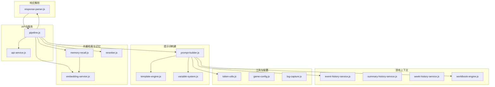
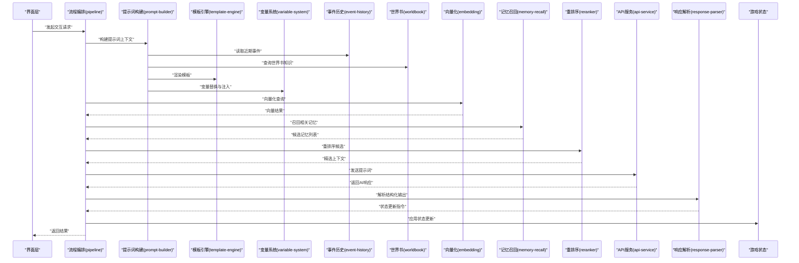
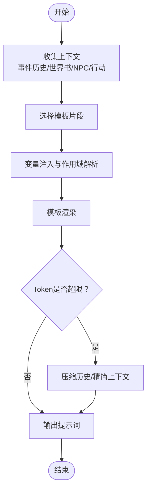
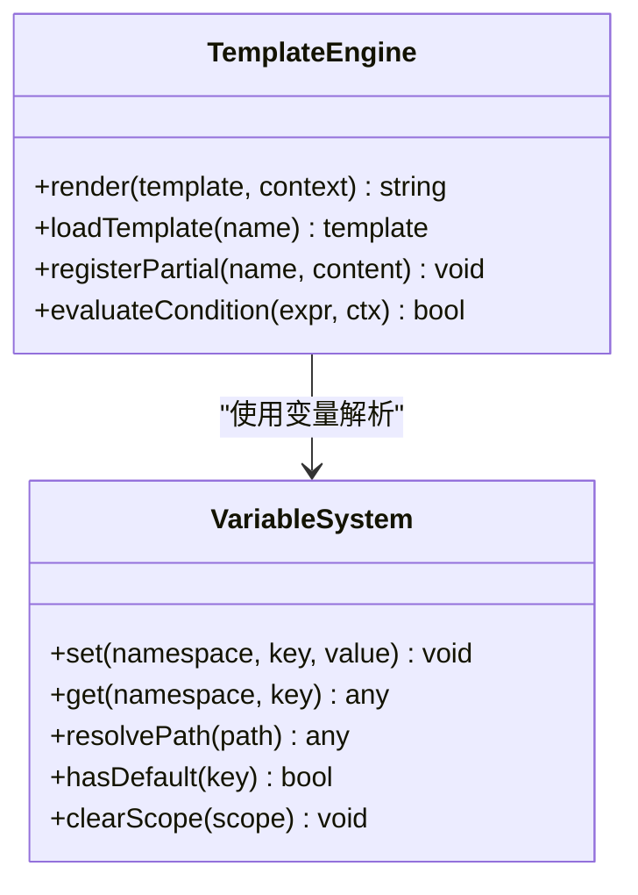
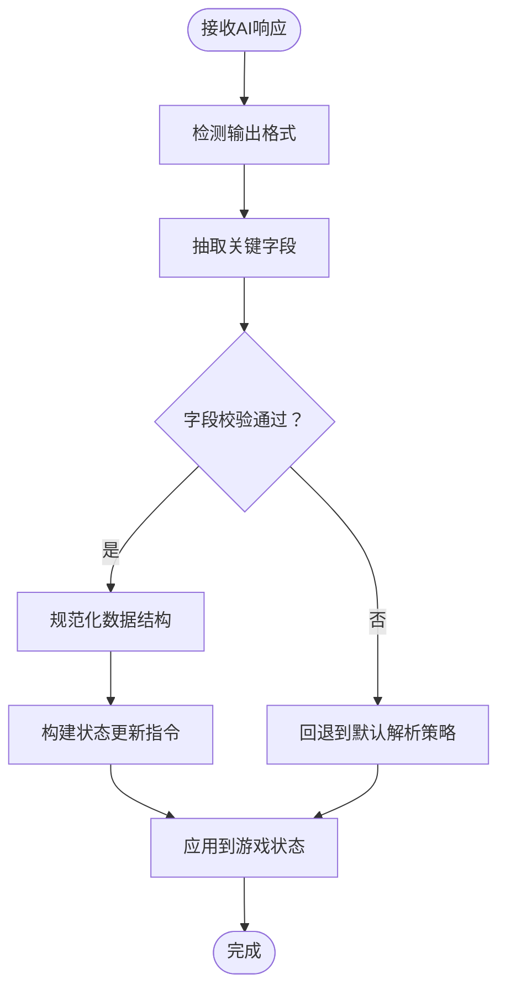
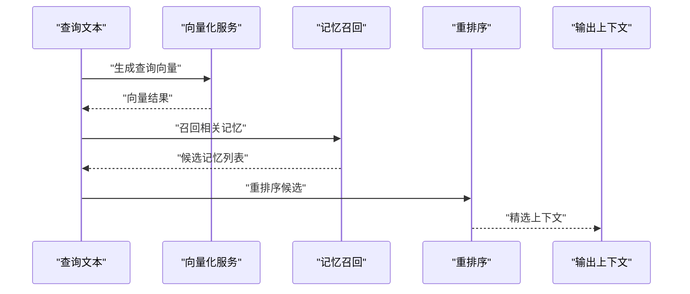
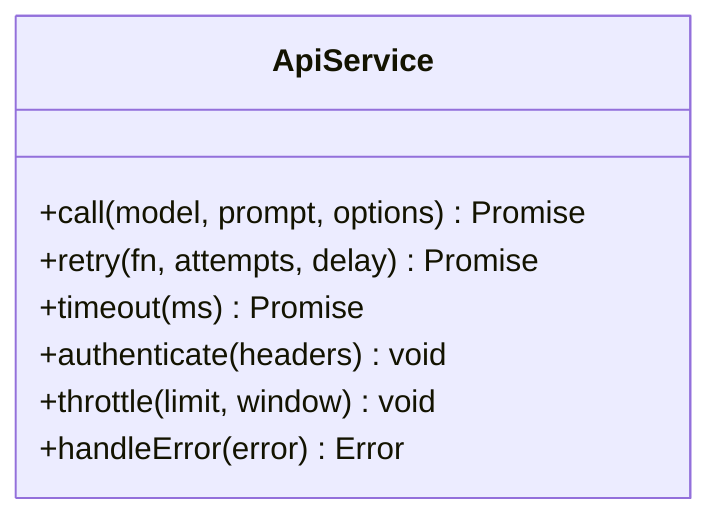
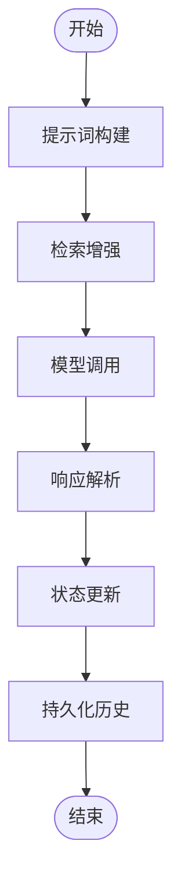
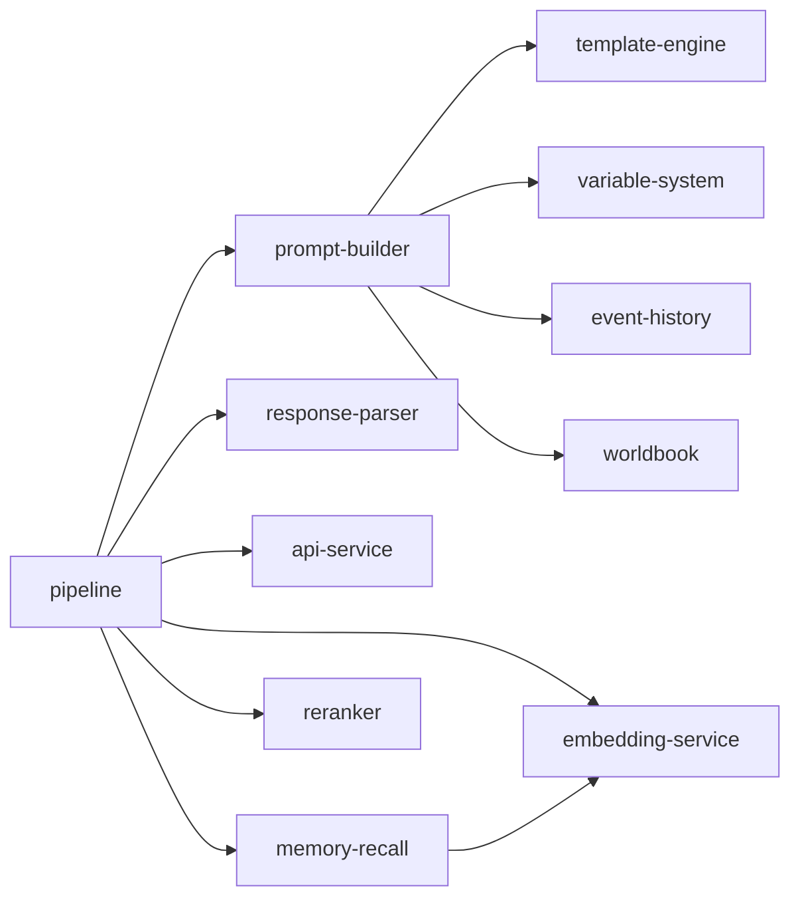

# AI集成系统

<cite>
**本文引用的文件**   
- [prompt-builder.js](file://module/prompt-builder.js)
- [template-engine.js](file://module/template-engine.js)
- [variable-system.js](file://module/variable-system.js)
- [response-parser.js](file://module/response-parser.js)
- [embedding-service.js](file://module/embedding-service.js)
- [memory-recall.js](file://module/memory-recall.js)
- [reranker.js](file://module/reranker.js)
- [api-service.js](file://module/api-service.js)
- [pipeline.js](file://module/pipeline.js)
- [game-config.js](file://module/game-config.js)
- [event-history-service.js](file://module/event-history-service.js)
- [summary-history-service.js](file://module/summary-history-service.js)
- [week-history-service.js](file://module/week-history-service.js)
- [worldbook-engine.js](file://module/worldbook-engine.js)
- [token-utils.js](file://module/token-utils.js)
- [log-capture.js](file://module/log-capture.js)
</cite>

## 目录
1. [简介](#简介)
2. [项目结构](#项目结构)
3. [核心组件](#核心组件)
4. [架构总览](#架构总览)
5. [详细组件分析](#详细组件分析)
6. [依赖关系分析](#依赖关系分析)
7. [性能考量](#性能考量)
8. [故障排查指南](#故障排查指南)
9. [结论](#结论)
10. [附录](#附录)

## 简介
本技术文档面向“姬侠传AI集成系统”，聚焦于AI提示词构建、响应解析、向量检索与记忆系统、API服务层封装，以及配置与性能优化。文档以代码级视角梳理各模块的职责边界、数据流与控制流，并提供可视化图示与调试建议，帮助开发者快速理解并扩展系统能力。

## 项目结构
系统采用前端模块化设计，AI相关能力集中在 module 目录下，按职责划分为：
- 提示词构建：prompt-builder.js、template-engine.js、variable-system.js
- 响应解析：response-parser.js
- 向量检索与记忆：embedding-service.js、memory-recall.js、reranker.js
- API服务层：api-service.js
- 流程编排：pipeline.js
- 游戏上下文与历史：event-history-service.js、summary-history-service.js、week-history-service.js、worldbook-engine.js
- 工具与配置：token-utils.js、game-config.js、log-capture.js

图表来源
- [pipeline.js](file://module/pipeline.js)
- [prompt-builder.js](file://module/prompt-builder.js)
- [template-engine.js](file://module/template-engine.js)
- [variable-system.js](file://module/variable-system.js)
- [response-parser.js](file://module/response-parser.js)
- [embedding-service.js](file://module/embedding-service.js)
- [memory-recall.js](file://module/memory-recall.js)
- [reranker.js](file://module/reranker.js)
- [api-service.js](file://module/api-service.js)
- [event-history-service.js](file://module/event-history-service.js)
- [summary-history-service.js](file://module/summary-history-service.js)
- [week-history-service.js](file://module/week-history-service.js)
- [worldbook-engine.js](file://module/worldbook-engine.js)
- [token-utils.js](file://module/token-utils.js)
- [game-config.js](file://module/game-config.js)
- [log-capture.js](file://module/log-capture.js)

章节来源
- [pipeline.js](file://module/pipeline.js)
- [prompt-builder.js](file://module/prompt-builder.js)
- [template-engine.js](file://module/template-engine.js)
- [variable-system.js](file://module/variable-system.js)
- [response-parser.js](file://module/response-parser.js)
- [embedding-service.js](file://module/embedding-service.js)
- [memory-recall.js](file://module/memory-recall.js)
- [reranker.js](file://module/reranker.js)
- [api-service.js](file://module/api-service.js)
- [event-history-service.js](file://module/event-history-service.js)
- [summary-history-service.js](file://module/summary-history-service.js)
- [week-history-service.js](file://module/week-history-service.js)
- [worldbook-engine.js](file://module/worldbook-engine.js)
- [token-utils.js](file://module/token-utils.js)
- [game-config.js](file://module/game-config.js)
- [log-capture.js](file://module/log-capture.js)

## 核心组件
- 提示词构建器（prompt-builder）：聚合游戏状态、事件历史、世界书、NPC信息、行动选项等上下文，调用模板引擎与变量系统进行动态拼接，生成最终提示词。
- 模板引擎（template-engine）：提供模板渲染能力，支持条件片段、循环、占位符替换与局部覆盖。
- 变量系统（variable-system）：维护运行时变量与作用域，支持嵌套命名空间、默认值、类型校验与缓存。
- 响应解析器（response-parser）：对AI返回文本进行结构化提取，识别动作、属性变更、对话内容、剧情分支等，转换为游戏可消费的状态更新。
- 向量检索与记忆（embedding-service、memory-recall、reranker）：将文本向量化、计算相似度、召回相关记忆并进行重排序，支撑长期记忆与上下文增强。
- API服务层（api-service）：统一封装AI接口调用、重试、超时、鉴权、限流与错误处理。
- 流程编排（pipeline）：串联提示词构建、检索增强、模型调用、响应解析与状态落库的完整链路。
- 游戏上下文与历史（event-history-service、summary-history-service、week-history-service、worldbook-engine）：管理事件日志、摘要压缩、周级别记忆与世界书知识。
- 工具与配置（token-utils、game-config、log-capture）：Token统计、全局配置、日志捕获与诊断。

章节来源
- [prompt-builder.js](file://module/prompt-builder.js)
- [template-engine.js](file://module/template-engine.js)
- [variable-system.js](file://module/variable-system.js)
- [response-parser.js](file://module/response-parser.js)
- [embedding-service.js](file://module/embedding-service.js)
- [memory-recall.js](file://module/memory-recall.js)
- [reranker.js](file://module/reranker.js)
- [api-service.js](file://module/api-service.js)
- [pipeline.js](file://module/pipeline.js)
- [event-history-service.js](file://module/event-history-service.js)
- [summary-history-service.js](file://module/summary-history-service.js)
- [week-history-service.js](file://module/week-history-service.js)
- [worldbook-engine.js](file://module/worldbook-engine.js)
- [token-utils.js](file://module/token-utils.js)
- [game-config.js](file://module/game-config.js)
- [log-capture.js](file://module/log-capture.js)

## 架构总览
下图展示了从用户输入到游戏状态更新的端到端流程，包括提示词构建、检索增强、模型调用、响应解析与状态落库。

图表来源
- [pipeline.js](file://module/pipeline.js)
- [prompt-builder.js](file://module/prompt-builder.js)
- [template-engine.js](file://module/template-engine.js)
- [variable-system.js](file://module/variable-system.js)
- [event-history-service.js](file://module/event-history-service.js)
- [worldbook-engine.js](file://module/worldbook-engine.js)
- [embedding-service.js](file://module/embedding-service.js)
- [memory-recall.js](file://module/memory-recall.js)
- [reranker.js](file://module/reranker.js)
- [api-service.js](file://module/api-service.js)
- [response-parser.js](file://module/response-parser.js)

## 详细组件分析

### 提示词构建系统（Prompt Builder）
- 功能要点
  - 聚合多源上下文：玩家当前状态、最近事件、世界书条目、NPC设定、行动选项。
  - 动态模板渲染：根据场景、角色、时间、地点等维度选择模板片段。
  - 变量替换：通过变量系统注入运行时值，支持作用域隔离与默认回退。
  - Token预算控制：依据token工具统计长度，必要时裁剪或压缩历史。
- 关键流程
  - 收集上下文 → 选择模板 → 变量注入 → 模板渲染 → 输出提示词
- 错误处理
  - 模板缺失时回退到默认模板；变量未定义时使用默认值；Token超限触发压缩策略。

图表来源
- [prompt-builder.js](file://module/prompt-builder.js)
- [template-engine.js](file://module/template-engine.js)
- [variable-system.js](file://module/variable-system.js)
- [token-utils.js](file://module/token-utils.js)
- [event-history-service.js](file://module/event-history-service.js)
- [worldbook-engine.js](file://module/worldbook-engine.js)

章节来源
- [prompt-builder.js](file://module/prompt-builder.js)
- [template-engine.js](file://module/template-engine.js)
- [variable-system.js](file://module/variable-system.js)
- [token-utils.js](file://module/token-utils.js)
- [event-history-service.js](file://module/event-history-service.js)
- [worldbook-engine.js](file://module/worldbook-engine.js)

### 模板引擎与变量系统
- 模板引擎
  - 支持条件片段、循环、占位符、局部覆盖与组合模板。
  - 提供模板版本管理与回滚机制，便于A/B测试与迭代。
- 变量系统
  - 维护命名空间与作用域，支持嵌套对象、数组与函数式变量。
  - 提供类型校验、默认值、缓存与热更新能力。

图表来源
- [template-engine.js](file://module/template-engine.js)
- [variable-system.js](file://module/variable-system.js)

章节来源
- [template-engine.js](file://module/template-engine.js)
- [variable-system.js](file://module/variable-system.js)

### 响应解析器（Response Parser）
- 功能要点
  - 从AI返回文本中提取结构化信息：动作、属性变化、对话、剧情分支、资源增减等。
  - 将解析结果转换为游戏状态更新指令，确保幂等性与一致性。
  - 支持多种输出格式（JSON、标记段、自然语言指令），具备容错与回退策略。
- 关键流程
  - 接收响应 → 格式检测 → 字段抽取 → 校验与规范化 → 生成状态更新 → 应用更新

图表来源
- [response-parser.js](file://module/response-parser.js)

章节来源
- [response-parser.js](file://module/response-parser.js)

### 向量检索与记忆系统
- 向量化服务（embedding-service）
  - 将文本转换为向量表示，支持批量处理与缓存。
  - 提供相似度度量接口（余弦相似度等）。
- 记忆召回（memory-recall）
  - 基于查询向量召回相关记忆，支持时间衰减与权重调整。
  - 管理历史对话与事件摘要，避免上下文膨胀。
- 重排序（reranker）
  - 对召回结果进行二次排序，提升相关性。
  - 支持规则与模型混合排序策略。

图表来源
- [embedding-service.js](file://module/embedding-service.js)
- [memory-recall.js](file://module/memory-recall.js)
- [reranker.js](file://module/reranker.js)

章节来源
- [embedding-service.js](file://module/embedding-service.js)
- [memory-recall.js](file://module/memory-recall.js)
- [reranker.js](file://module/reranker.js)

### API服务层封装
- 功能要点
  - 统一封装AI接口调用，支持多后端适配。
  - 实现重试、超时、鉴权、限流、熔断与降级。
  - 标准化错误码与异常信息，便于上层处理与监控。
- 错误处理机制
  - 网络异常：指数退避重试与熔断。
  - 业务异常：错误分类与回退策略。
  - 资源限制：队列与令牌桶限流。

图表来源
- [api-service.js](file://module/api-service.js)

章节来源
- [api-service.js](file://module/api-service.js)

### 流程编排（Pipeline）
- 功能要点
  - 串联提示词构建、检索增强、模型调用、响应解析与状态落库。
  - 提供中间件机制，支持日志、监控、缓存与审计。
  - 支持并行与串行阶段配置，灵活定制执行路径。

图表来源
- [pipeline.js](file://module/pipeline.js)

章节来源
- [pipeline.js](file://module/pipeline.js)

### 游戏上下文与历史管理
- 事件历史（event-history-service）
  - 记录玩家与NPC交互事件，支持分页与过滤。
- 摘要历史（summary-history-service）
  - 定期生成对话摘要，压缩上下文长度。
- 周记忆（week-history-service）
  - 按周粒度保存重要事件与状态快照。
- 世界书（worldbook-engine）
  - 管理世界观、地点、势力、人物设定等知识条目。

章节来源
- [event-history-service.js](file://module/event-history-service.js)
- [summary-history-service.js](file://module/summary-history-service.js)
- [week-history-service.js](file://module/week-history-service.js)
- [worldbook-engine.js](file://module/worldbook-engine.js)

## 依赖关系分析
- 耦合与内聚
  - pipeline作为编排中心，低耦合地调用各子系统。
  - prompt-builder强依赖template-engine与variable-system，体现高内聚。
  - response-parser独立性强，便于替换解析策略。
- 外部依赖
  - api-service对外部AI服务抽象，屏蔽差异。
  - embedding-service可能依赖第三方向量模型或本地嵌入库。
- 潜在循环依赖
  - 通过pipeline解耦，避免直接循环引用。

图表来源
- [pipeline.js](file://module/pipeline.js)
- [prompt-builder.js](file://module/prompt-builder.js)
- [template-engine.js](file://module/template-engine.js)
- [variable-system.js](file://module/variable-system.js)
- [response-parser.js](file://module/response-parser.js)
- [embedding-service.js](file://module/embedding-service.js)
- [memory-recall.js](file://module/memory-recall.js)
- [reranker.js](file://module/reranker.js)
- [event-history-service.js](file://module/event-history-service.js)
- [worldbook-engine.js](file://module/worldbook-engine.js)

章节来源
- [pipeline.js](file://module/pipeline.js)
- [prompt-builder.js](file://module/prompt-builder.js)
- [template-engine.js](file://module/template-engine.js)
- [variable-system.js](file://module/variable-system.js)
- [response-parser.js](file://module/response-parser.js)
- [embedding-service.js](file://module/embedding-service.js)
- [memory-recall.js](file://module/memory-recall.js)
- [reranker.js](file://module/reranker.js)
- [event-history-service.js](file://module/event-history-service.js)
- [worldbook-engine.js](file://module/worldbook-engine.js)

## 性能考量
- 提示词构建
  - 使用模板缓存与变量缓存减少重复计算。
  - 动态裁剪历史与精简世界书条目，控制Token上限。
- 向量检索
  - 批量向量化与结果缓存，降低重复计算开销。
  - 召回数量与重排序阈值可调，平衡精度与延迟。
- API调用
  - 合理设置超时与重试次数，避免雪崩。
  - 启用连接池与并发控制，提高吞吐。
- 内存与存储
  - 事件历史与摘要定期清理，避免无限增长。
  - 使用IndexedDB或本地缓存持久化，减少IO压力。

[本节为通用指导，不直接分析具体文件]

## 故障排查指南
- 常见问题定位
  - 提示词过长：检查token统计与裁剪策略。
  - 解析失败：确认响应格式与解析规则，启用回退策略。
  - 检索无关：调整相似度阈值与重排序权重。
  - API错误：查看错误码与重试日志，检查鉴权与限流。
- 调试技巧
  - 启用详细日志，记录每个阶段的输入输出。
  - 使用模拟数据与断点调试关键路径。
  - 对比不同模板与变量配置的差异。

章节来源
- [log-capture.js](file://module/log-capture.js)
- [api-service.js](file://module/api-service.js)
- [response-parser.js](file://module/response-parser.js)
- [prompt-builder.js](file://module/prompt-builder.js)
- [embedding-service.js](file://module/embedding-service.js)
- [memory-recall.js](file://module/memory-recall.js)
- [reranker.js](file://module/reranker.js)

## 结论
本系统通过模块化设计与清晰的数据流，实现了AI在游戏中的应用闭环。提示词构建、响应解析、向量检索与记忆系统协同工作，提供了可扩展、高性能且易于维护的AI集成方案。建议在生产环境中结合监控与日志，持续优化参数与策略，以提升用户体验与系统稳定性。

[本节为总结性内容，不直接分析具体文件]

## 附录
- 配置选项建议
  - 模板版本与回退策略
  - 变量作用域与默认值
  - 向量模型与相似度阈值
  - API超时、重试与限流参数
- 最佳实践
  - 保持提示词简洁明确，避免歧义
  - 结构化输出优先，便于解析
  - 定期清理历史与摘要，控制上下文大小
  - 使用A/B测试验证模板与策略效果

[本节为补充说明，不直接分析具体文件]