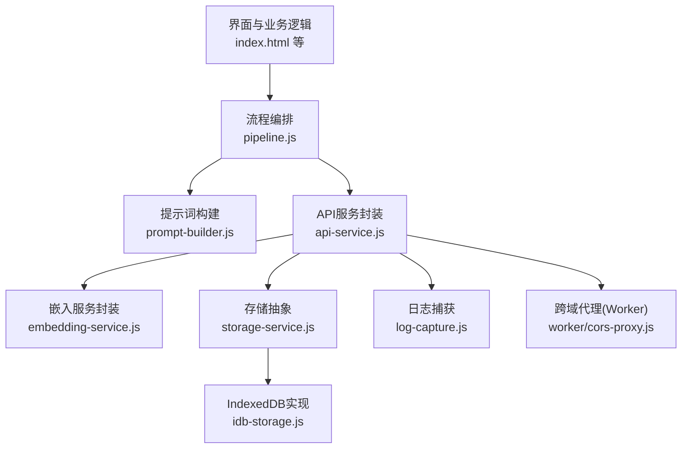
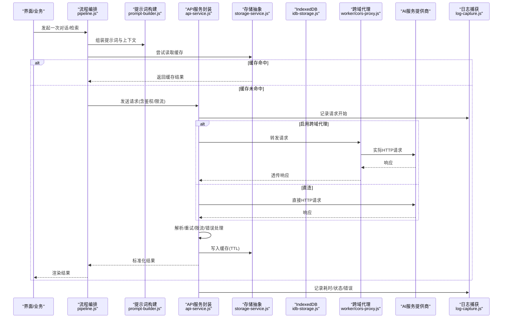
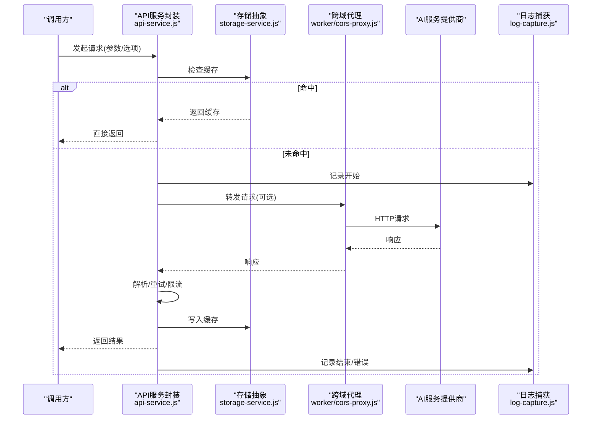
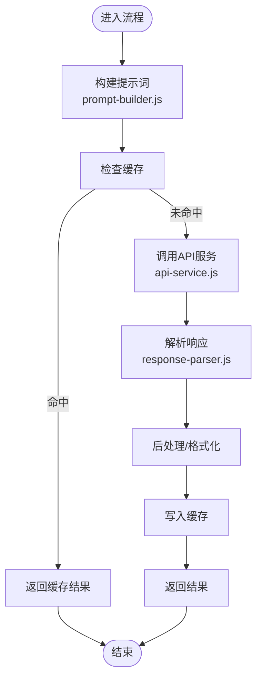
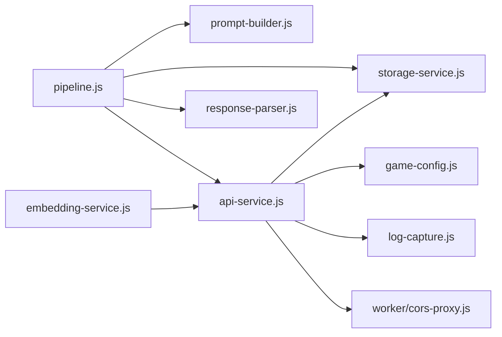

# API服务集成

<cite>
**本文引用的文件**   
- [api-service.js](file://module/api-service.js)
- [cors-proxy.js](file://worker/cors-proxy.js)
- [embedding-service.js](file://module/embedding-service.js)
- [pipeline.js](file://module/pipeline.js)
- [prompt-builder.js](file://module/prompt-builder.js)
- [response-parser.js](file://module/response-parser.js)
- [storage-service.js](file://module/storage-service.js)
- [idb-storage.js](file://module/idb-storage.js)
- [log-capture.js](file://module/log-capture.js)
- [game-config.js](file://module/game-config.js)
</cite>

## 目录
1. [简介](#简介)
2. [项目结构](#项目结构)
3. [核心组件](#核心组件)
4. [架构总览](#架构总览)
5. [详细组件分析](#详细组件分析)
6. [依赖关系分析](#依赖关系分析)
7. [性能与缓存](#性能与缓存)
8. [监控、日志与故障排查](#监控日志与故障排查)
9. [结论](#结论)
10. [附录：多提供商配置与迁移指南](#附录多提供商配置与迁移指南)

## 简介
本技术文档围绕“姬侠传”前端应用中的API服务集成展开，重点解释以下方面：
- API服务层封装：请求构建、响应处理、错误重试等核心能力
- 跨域代理服务：解决浏览器安全限制与网络访问问题
- 认证与安全：API密钥管理、请求签名、限流控制
- 缓存策略与离线支持：利用本地存储提升响应速度与用户体验
- 多AI服务提供商的集成与迁移
- 网络请求监控、日志记录与故障排查方法

## 项目结构
本项目采用模块化组织方式，API相关能力集中在 module/ 与 worker/ 目录下：
- api-service.js：统一的HTTP请求封装、重试、鉴权、限流、缓存等
- embedding-service.js：面向向量嵌入服务的专用封装（可复用通用能力）
- pipeline.js：编排调用链（提示词构建→模型调用→解析→后处理）
- prompt-builder.js：提示词组装与上下文注入
- response-parser.js：结构化解析与容错
- storage-service.js / idb-storage.js：统一存储接口与IndexedDB实现
- log-capture.js：日志捕获与上报
- game-config.js：全局配置与开关
- cors-proxy.js：Worker内跨域代理，规避CORS限制

图表来源
- [pipeline.js](file://module/pipeline.js)
- [prompt-builder.js](file://module/prompt-builder.js)
- [api-service.js](file://module/api-service.js)
- [embedding-service.js](file://module/embedding-service.js)
- [storage-service.js](file://module/storage-service.js)
- [idb-storage.js](file://module/idb-storage.js)
- [log-capture.js](file://module/log-capture.js)
- [cors-proxy.js](file://worker/cors-proxy.js)

章节来源
- [api-service.js](file://module/api-service.js)
- [pipeline.js](file://module/pipeline.js)
- [prompt-builder.js](file://module/prompt-builder.js)
- [response-parser.js](file://module/response-parser.js)
- [storage-service.js](file://module/storage-service.js)
- [idb-storage.js](file://module/idb-storage.js)
- [log-capture.js](file://module/log-capture.js)
- [game-config.js](file://module/game-config.js)
- [cors-proxy.js](file://worker/cors-proxy.js)

## 核心组件
- API服务封装（api-service.js）
  - 职责：统一发起HTTP请求、拼接URL与参数、设置请求头、处理响应体、错误分类与重试、限流与退避、缓存读写、日志埋点。
  - 关键特性：
    - 请求构建：合并基础URL、路径、查询参数、表单或JSON载荷；自动附加鉴权头与追踪ID。
    - 响应处理：统一解析JSON/文本/二进制；标准化成功/失败结果对象；异常转译为业务错误码。
    - 错误重试：对瞬时错误（如网络抖动、5xx）进行指数退避重试；支持最大次数与超时控制。
    - 限流控制：令牌桶或滑动窗口策略，避免突发流量触发服务端限流。
    - 缓存策略：按请求键命中本地缓存；支持TTL与失效策略；优先返回缓存以提升体验。
    - 日志与监控：记录请求耗时、状态码、错误堆栈、用户会话标识等。
- 跨域代理（worker/cors-proxy.js）
  - 职责：在Web Worker中转发请求至目标服务，绕过浏览器同源策略与CORS限制。
  - 关键点：仅用于受控场景；需配合后端白名单与最小权限原则；避免泄露敏感信息。
- 嵌入服务封装（embedding-service.js）
  - 职责：为向量检索提供专用接口，复用通用API封装，增加批量、分页、索引管理等能力。
- 流程编排（pipeline.js）
  - 职责：串联提示词构建、模型调用、结果解析、后处理与缓存落盘。
- 提示词构建（prompt-builder.js）
  - 职责：根据游戏状态、世界书、对话历史等动态拼装提示词模板。
- 响应解析（response-parser.js）
  - 职责：将模型输出解析为结构化数据，包含字段校验、默认值填充与降级策略。
- 存储抽象（storage-service.js / idb-storage.js）
  - 职责：统一KV/对象存储接口；底层使用IndexedDB，提供事务、版本升级与错误恢复。
- 日志捕获（log-capture.js）
  - 职责：集中捕获console输出、未捕获异常、网络错误，并持久化或上报。
- 全局配置（game-config.js）
  - 职责：集中管理API端点、密钥、重试策略、缓存TTL、功能开关等。

章节来源
- [api-service.js](file://module/api-service.js)
- [cors-proxy.js](file://worker/cors-proxy.js)
- [embedding-service.js](file://module/embedding-service.js)
- [pipeline.js](file://module/pipeline.js)
- [prompt-builder.js](file://module/prompt-builder.js)
- [response-parser.js](file://module/response-parser.js)
- [storage-service.js](file://module/storage-service.js)
- [idb-storage.js](file://module/idb-storage.js)
- [log-capture.js](file://module/log-capture.js)
- [game-config.js](file://module/game-config.js)

## 架构总览
下图展示了从UI到外部AI服务的完整调用链路，以及缓存、代理、日志等横切能力的介入点。

图表来源
- [pipeline.js](file://module/pipeline.js)
- [prompt-builder.js](file://module/prompt-builder.js)
- [api-service.js](file://module/api-service.js)
- [storage-service.js](file://module/storage-service.js)
- [idb-storage.js](file://module/idb-storage.js)
- [cors-proxy.js](file://worker/cors-proxy.js)
- [log-capture.js](file://module/log-capture.js)

## 详细组件分析

### API服务封装（api-service.js）
- 设计要点
  - 请求构建器：合并基础URL、路径、查询参数、请求体；自动注入鉴权头、追踪ID、内容类型。
  - 响应处理器：统一解析JSON/文本/流式响应；标准化成功/失败对象；错误映射为业务码。
  - 重试机制：针对瞬时错误（网络中断、5xx）执行指数退避；支持最大重试次数、超时、取消。
  - 限流控制：基于令牌桶或滑动窗口，维护并发与速率上限；超限时排队或快速失败。
  - 缓存策略：以请求键（URL+参数+必要头部）作为缓存键；支持TTL、条件失效、写穿透。
  - 日志与监控：记录请求起止时间、状态码、错误堆栈、用户标识、重试次数等。
- 典型调用序列

图表来源
- [api-service.js](file://module/api-service.js)
- [storage-service.js](file://module/storage-service.js)
- [cors-proxy.js](file://worker/cors-proxy.js)
- [log-capture.js](file://module/log-capture.js)

章节来源
- [api-service.js](file://module/api-service.js)
- [storage-service.js](file://module/storage-service.js)
- [cors-proxy.js](file://worker/cors-proxy.js)
- [log-capture.js](file://module/log-capture.js)

### 跨域代理服务（worker/cors-proxy.js）
- 作用原理
  - 在Web Worker中发起网络请求，规避主线程CORS限制；适用于需要跨域访问且无法修改服务端头的场景。
  - 建议结合服务端白名单与最小权限，避免暴露敏感接口。
- 使用建议
  - 仅在必要时启用；对大体积响应谨慎使用；注意Worker生命周期与内存占用。
  - 对敏感参数进行脱敏与加密传输。

章节来源
- [cors-proxy.js](file://worker/cors-proxy.js)

### 嵌入服务封装（embedding-service.js）
- 职责
  - 封装向量嵌入API，支持批量生成、分页拉取、索引更新等。
  - 复用通用API封装的重试、限流、缓存与日志能力。
- 扩展性
  - 通过配置切换不同提供商的嵌入端点与参数格式。

章节来源
- [embedding-service.js](file://module/embedding-service.js)
- [api-service.js](file://module/api-service.js)

### 流程编排（pipeline.js）
- 职责
  - 串联提示词构建、模型调用、结果解析、后处理与缓存落盘。
  - 提供统一的错误处理与降级策略（例如回退到本地规则）。
- 关键流程

图表来源
- [pipeline.js](file://module/pipeline.js)
- [prompt-builder.js](file://module/prompt-builder.js)
- [api-service.js](file://module/api-service.js)
- [response-parser.js](file://module/response-parser.js)
- [storage-service.js](file://module/storage-service.js)

章节来源
- [pipeline.js](file://module/pipeline.js)
- [prompt-builder.js](file://module/prompt-builder.js)
- [response-parser.js](file://module/response-parser.js)
- [storage-service.js](file://module/storage-service.js)

### 提示词构建（prompt-builder.js）
- 职责
  - 根据游戏状态、世界书、对话历史、角色卡等动态拼装提示词。
  - 支持模板变量替换、片段裁剪、长度控制与优先级排序。
- 注意事项
  - 避免过长导致超出模型上下文；对敏感信息进行脱敏。

章节来源
- [prompt-builder.js](file://module/prompt-builder.js)

### 响应解析（response-parser.js）
- 职责
  - 将模型输出解析为结构化数据；包含字段校验、默认值填充、缺失字段降级。
  - 支持多种输出格式（纯文本、JSON、Markdown片段）。
- 健壮性
  - 对异常格式进行容错处理，保证上层稳定。

章节来源
- [response-parser.js](file://module/response-parser.js)

### 存储抽象与IndexedDB（storage-service.js / idb-storage.js）
- 职责
  - 提供统一的KV/对象存储接口；底层使用IndexedDB，支持事务、版本升级与错误恢复。
  - 负责缓存数据的序列化、压缩、过期清理。
- 性能优化
  - 批量写入、分片存储、懒加载；避免阻塞主线程。

章节来源
- [storage-service.js](file://module/storage-service.js)
- [idb-storage.js](file://module/idb-storage.js)

### 日志捕获（log-capture.js）
- 职责
  - 集中捕获console输出、未捕获异常、网络错误；持久化或上报。
  - 支持分级日志、采样上报、敏感信息过滤。
- 使用建议
  - 生产环境降低日志级别；对错误进行聚合与去重。

章节来源
- [log-capture.js](file://module/log-capture.js)

### 全局配置（game-config.js）
- 职责
  - 集中管理API端点、密钥、重试策略、缓存TTL、功能开关等。
  - 支持运行时覆盖与环境区分（开发/测试/生产）。

章节来源
- [game-config.js](file://module/game-config.js)

## 依赖关系分析
- 模块耦合
  - pipeline.js 依赖 prompt-builder.js、api-service.js、response-parser.js、storage-service.js
  - api-service.js 依赖 storage-service.js、log-capture.js、game-config.js，可选依赖 cors-proxy.js
  - embedding-service.js 复用 api-service.js 的能力
- 潜在风险
  - 循环依赖应避免；当前结构清晰，未见明显环。
  - 跨域代理需谨慎使用，避免引入安全风险。

图表来源
- [pipeline.js](file://module/pipeline.js)
- [prompt-builder.js](file://module/prompt-builder.js)
- [api-service.js](file://module/api-service.js)
- [response-parser.js](file://module/response-parser.js)
- [storage-service.js](file://module/storage-service.js)
- [log-capture.js](file://module/log-capture.js)
- [game-config.js](file://module/game-config.js)
- [cors-proxy.js](file://worker/cors-proxy.js)
- [embedding-service.js](file://module/embedding-service.js)

章节来源
- [pipeline.js](file://module/pipeline.js)
- [api-service.js](file://module/api-service.js)
- [embedding-service.js](file://module/embedding-service.js)
- [storage-service.js](file://module/storage-service.js)
- [log-capture.js](file://module/log-capture.js)
- [game-config.js](file://module/game-config.js)
- [cors-proxy.js](file://worker/cors-proxy.js)

## 性能与缓存
- 缓存策略
  - 读优先：先查缓存，命中则直接返回，减少网络开销。
  - TTL与失效：按资源重要性设置不同TTL；支持主动失效与增量更新。
  - 写穿透：首次成功后写入缓存，后续请求走缓存。
- 重试与退避
  - 指数退避：在网络抖动或临时不可用时自动重试，避免雪崩。
  - 熔断与降级：连续失败时快速失败，回退到本地规则或上次有效结果。
- 限流控制
  - 令牌桶/滑动窗口：平滑请求速率，避免触发服务端限流。
- 存储优化
  - IndexedDB批量操作、分片存储、压缩与懒加载，降低I/O压力。

[本节为通用性能指导，不直接分析具体文件]

## 监控、日志与故障排查
- 监控指标
  - 请求成功率、平均延迟、P95/P99延迟、重试次数、缓存命中率、错误分布。
- 日志规范
  - 统一日志格式：时间戳、用户ID、请求ID、端点、状态码、耗时、错误码、堆栈摘要。
  - 敏感信息脱敏：密钥、Token、个人信息等不得明文记录。
- 常见问题定位
  - CORS错误：检查是否启用跨域代理或后端CORS配置是否正确。
  - 鉴权失败：核对API密钥、签名算法、时间戳与随机数。
  - 限流触发：调整限流阈值或增加重试间隔；观察服务端限流告警。
  - 缓存污染：检查缓存键生成逻辑与TTL设置；必要时强制刷新。
  - 解析失败：查看响应格式与解析器容错；补充默认值与降级逻辑。

章节来源
- [log-capture.js](file://module/log-capture.js)
- [api-service.js](file://module/api-service.js)
- [response-parser.js](file://module/response-parser.js)
- [game-config.js](file://module/game-config.js)

## 结论
本方案通过统一的API服务封装、跨域代理、缓存与重试机制，构建了高可用、可扩展的前端AI服务集成层。配合流程编排与解析器，实现了从提示词构建到结果渲染的端到端闭环。在生产环境中，应重点关注鉴权安全、限流与监控告警，确保系统稳定与用户体验。

[本节为总结性内容，不直接分析具体文件]

## 附录：多提供商配置与迁移指南
- 配置项建议
  - 基础URL、API版本、鉴权头名、签名算法、重试策略、缓存TTL、功能开关。
- 迁移步骤
  - 新增提供商适配器：定义端点、参数映射、响应解析。
  - 接入统一API封装：复用重试、限流、缓存、日志能力。
  - 灰度发布：按用户比例或A/B测试逐步切换。
  - 回滚预案：保留旧版配置与路由，快速回退。
- 安全实践
  - 密钥管理：使用环境变量或安全存储，禁止硬编码。
  - 请求签名：采用HMAC-SHA256等算法，附带时间戳与随机数防重放。
  - 最小权限：仅开放必要接口，启用IP白名单与速率限制。

[本节为通用指导，不直接分析具体文件]