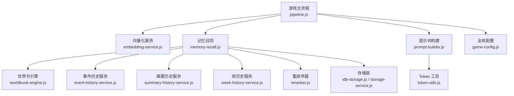
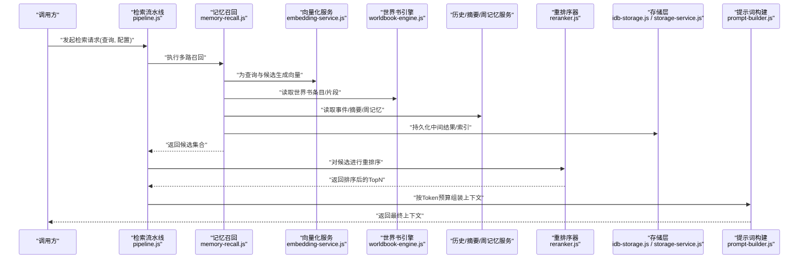
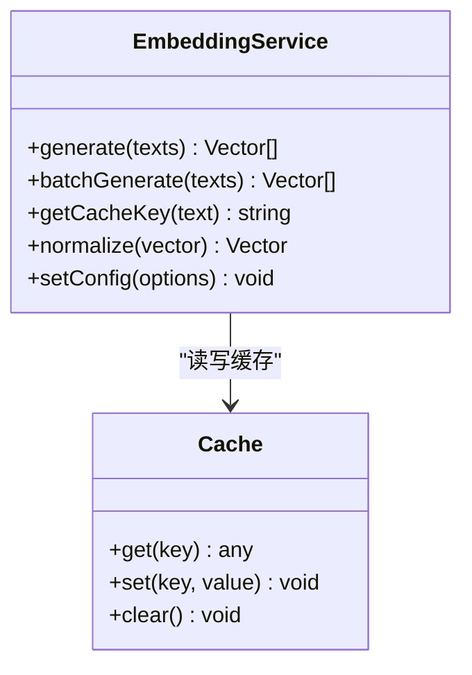
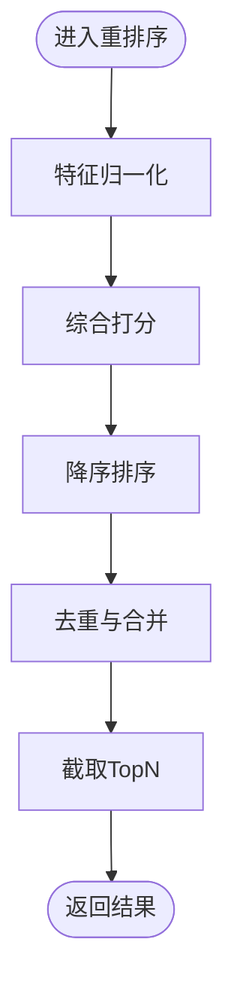
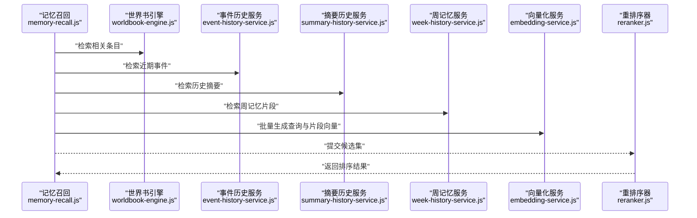
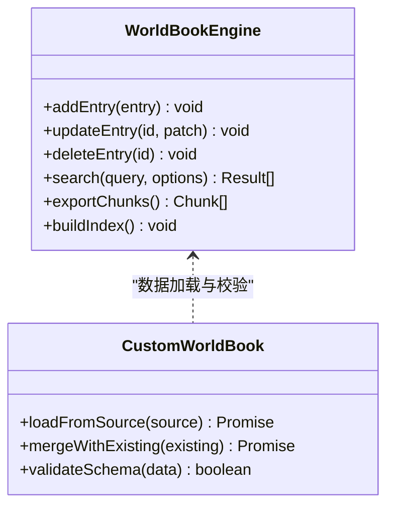
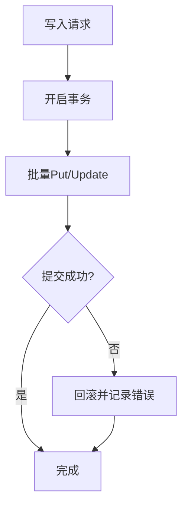
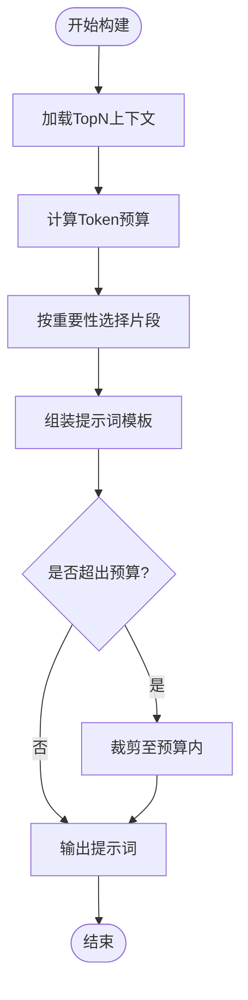
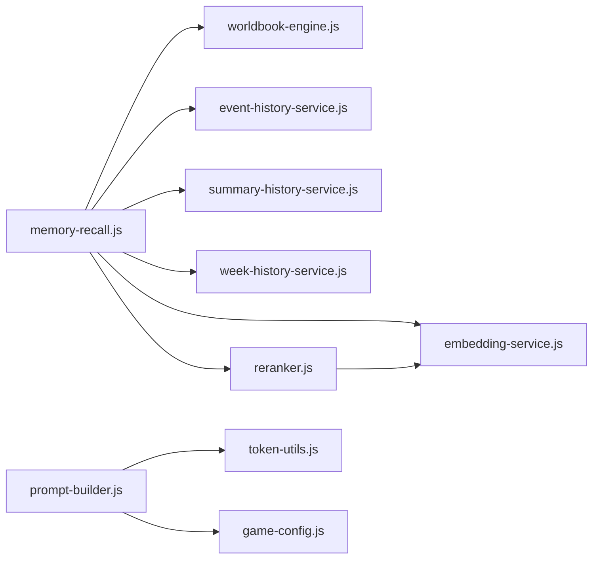

# 向量检索与记忆系统

<cite>
**本文引用的文件**   
- [embedding-service.js](file://module/embedding-service.js)
- [reranker.js](file://module/reranker.js)
- [memory-recall.js](file://module/memory-recall.js)
- [custom-worldbook.js](file://module/custom-worldbook.js)
- [worldbook-engine.js](file://module/worldbook-engine.js)
- [pipeline.js](file://module/pipeline.js)
- [prompt-builder.js](file://module/prompt-builder.js)
- [idb-storage.js](file://module/idb-storage.js)
- [storage-service.js](file://module/storage-service.js)
- [event-history-service.js](file://module/event-history-service.js)
- [summary-history-service.js](file://module/summary-history-service.js)
- [week-history-service.js](file://module/week-history-service.js)
- [token-utils.js](file://module/token-utils.js)
- [game-config.js](file://module/game-config.js)
</cite>

## 目录
1. [简介](#简介)
2. [项目结构](#项目结构)
3. [核心组件](#核心组件)
4. [架构总览](#架构总览)
5. [详细组件分析](#详细组件分析)
6. [依赖关系分析](#依赖关系分析)
7. [性能考虑](#性能考虑)
8. [故障排查指南](#故障排查指南)
9. [结论](#结论)
10. [附录](#附录)

## 简介
本技术文档围绕“姬侠传”的向量检索与记忆系统，系统性阐述以下方面：
- 文本向量化服务：嵌入模型选择、向量生成流程、相似度计算策略
- 重排序器：在召回基础上进行相关性精排，提升结果质量
- 记忆召回系统：历史对话管理、上下文压缩、长期记忆存储与检索
- 自定义世界书系统：动态构建与管理知识库，支撑语义检索
- 向量数据库配置与优化：本地持久化、索引与查询调优
- 评估方法与调优技巧：如何衡量检索效果并持续改进

## 项目结构
与向量检索和记忆相关的模块主要位于 module 目录下，关键文件包括：
- embedding-service.js：向量化服务封装
- reranker.js：重排序器实现
- memory-recall.js：记忆召回编排
- custom-worldbook.js / worldbook-engine.js：世界书（知识库）构建与引擎
- pipeline.js：检索流水线编排
- prompt-builder.js：提示词组装（将检索结果注入上下文）
- idb-storage.js / storage-service.js：IndexedDB 与通用存储抽象
- event-history-service.js / summary-history-service.js / week-history-service.js：历史与摘要管理
- token-utils.js：Token 计数与预算控制
- game-config.js：全局配置项

图表来源
- [pipeline.js](file://module/pipeline.js)
- [embedding-service.js](file://module/embedding-service.js)
- [memory-recall.js](file://module/memory-recall.js)
- [worldbook-engine.js](file://module/worldbook-engine.js)
- [event-history-service.js](file://module/event-history-service.js)
- [summary-history-service.js](file://module/summary-history-service.js)
- [week-history-service.js](file://module/week-history-service.js)
- [reranker.js](file://module/reranker.js)
- [idb-storage.js](file://module/idb-storage.js)
- [storage-service.js](file://module/storage-service.js)
- [prompt-builder.js](file://module/prompt-builder.js)
- [token-utils.js](file://module/token-utils.js)
- [game-config.js](file://module/game-config.js)

章节来源
- [pipeline.js](file://module/pipeline.js)
- [embedding-service.js](file://module/embedding-service.js)
- [memory-recall.js](file://module/memory-recall.js)
- [worldbook-engine.js](file://module/worldbook-engine.js)
- [custom-worldbook.js](file://module/custom-worldbook.js)
- [reranker.js](file://module/reranker.js)
- [prompt-builder.js](file://module/prompt-builder.js)
- [idb-storage.js](file://module/idb-storage.js)
- [storage-service.js](file://module/storage-service.js)
- [event-history-service.js](file://module/event-history-service.js)
- [summary-history-service.js](file://module/summary-history-service.js)
- [week-history-service.js](file://module/week-history-service.js)
- [token-utils.js](file://module/token-utils.js)
- [game-config.js](file://module/game-config.js)

## 核心组件
- 向量化服务：负责将用户输入或候选片段转换为向量，支持多种后端与缓存策略。
- 重排序器：对初召回结果进行二次打分与排序，结合语义与规则信号提升相关性。
- 记忆召回：统一调度历史、摘要、世界书等数据源，完成多路召回与融合。
- 世界书系统：提供知识条目增删改查、分块与索引能力，支持动态更新。
- 存储层：基于 IndexedDB 的本地持久化，兼顾容量与查询效率。
- 提示词构建：将检索到的上下文按 Token 预算裁剪后注入提示词模板。
- 配置与工具：集中管理模型、阈值、窗口大小、TopK 等参数；提供 Token 统计与截断辅助。

章节来源
- [embedding-service.js](file://module/embedding-service.js)
- [reranker.js](file://module/reranker.js)
- [memory-recall.js](file://module/memory-recall.js)
- [worldbook-engine.js](file://module/worldbook-engine.js)
- [custom-worldbook.js](file://module/custom-worldbook.js)
- [idb-storage.js](file://module/idb-storage.js)
- [storage-service.js](file://module/storage-service.js)
- [prompt-builder.js](file://module/prompt-builder.js)
- [token-utils.js](file://module/token-utils.js)
- [game-config.js](file://module/game-config.js)

## 架构总览
整体采用“召回 + 精排”的两阶段检索范式：
- 第一阶段：多路召回（世界书、事件历史、摘要、周记忆），通过向量化与相似度匹配快速筛选候选集
- 第二阶段：重排序器对候选集进行细粒度打分与排序，输出最终 TopN 上下文
- 上下文注入：由提示词构建器根据 Token 预算组织最终上下文，供大模型使用

图表来源
- [pipeline.js](file://module/pipeline.js)
- [memory-recall.js](file://module/memory-recall.js)
- [embedding-service.js](file://module/embedding-service.js)
- [worldbook-engine.js](file://module/worldbook-engine.js)
- [reranker.js](file://module/reranker.js)
- [idb-storage.js](file://module/idb-storage.js)
- [storage-service.js](file://module/storage-service.js)
- [prompt-builder.js](file://module/prompt-builder.js)

## 详细组件分析

### 向量化服务（embedding-service.js）
- 功能要点
  - 统一的向量化接口，屏蔽不同后端差异
  - 支持批量生成与缓存命中，减少重复计算
  - 可选归一化与维度对齐，便于后续相似度计算
- 设计模式
  - 适配器模式：对不同嵌入后端进行适配
  - 缓存策略：以文本指纹为键，避免重复调用
- 复杂度与性能
  - 时间复杂度：O(N·D)，N 为样本数，D 为向量维度
  - 空间复杂度：O(D) 每向量，缓存命中可显著降低网络开销
- 错误处理
  - 网络异常重试与降级策略
  - 无效输入校验与日志记录

图表来源
- [embedding-service.js](file://module/embedding-service.js)

章节来源
- [embedding-service.js](file://module/embedding-service.js)

### 重排序器（reranker.js）
- 工作机制
  - 输入：初召回候选集（含文本片段与基础分数）
  - 特征：语义相似度、位置权重、时效性、领域匹配度等
  - 评分：加权线性组合或轻量模型打分
  - 输出：TopN 排序结果
- 算法要点
  - 归一化各特征到统一量纲
  - 可调权重与阈值，适应不同场景
  - 去重与冲突合并，避免冗余上下文
- 性能考量
  - 候选规模控制，避免 O(N^2) 比较
  - 并行打分与批处理优化

图表来源
- [reranker.js](file://module/reranker.js)

章节来源
- [reranker.js](file://module/reranker.js)

### 记忆召回系统（memory-recall.js）
- 职责
  - 统一调度世界书、事件历史、摘要、周记忆等多路数据源
  - 执行向量化与相似度检索，合并候选集
  - 协调重排序与上下文裁剪
- 历史管理
  - 事件历史：按会话与时间线维护
  - 摘要历史：周期性总结，保留关键信息
  - 周记忆：滚动窗口聚合，平衡新鲜度与稳定性
- 上下文压缩
  - 基于 Token 预算的动态裁剪
  - 重要性评分与代表性片段优先保留

图表来源
- [memory-recall.js](file://module/memory-recall.js)
- [worldbook-engine.js](file://module/worldbook-engine.js)
- [event-history-service.js](file://module/event-history-service.js)
- [summary-history-service.js](file://module/summary-history-service.js)
- [week-history-service.js](file://module/week-history-service.js)
- [embedding-service.js](file://module/embedding-service.js)
- [reranker.js](file://module/reranker.js)

章节来源
- [memory-recall.js](file://module/memory-recall.js)
- [event-history-service.js](file://module/event-history-service.js)
- [summary-history-service.js](file://module/summary-history-service.js)
- [week-history-service.js](file://module/week-history-service.js)

### 自定义世界书系统（custom-worldbook.js / worldbook-engine.js）
- 目标
  - 动态构建与管理知识库，支持词条增删改查、分块与索引
- 核心能力
  - 条目结构化：标题、内容、标签、元数据
  - 分块策略：按段落/主题切分，保持语义完整性
  - 索引机制：向量索引与倒排索引结合，加速检索
  - 版本与快照：支持回滚与增量更新
- 与检索集成
  - 提供批量导出与增量同步接口
  - 与记忆召回协同，作为重要知识源

图表来源
- [worldbook-engine.js](file://module/worldbook-engine.js)
- [custom-worldbook.js](file://module/custom-worldbook.js)

章节来源
- [worldbook-engine.js](file://module/worldbook-engine.js)
- [custom-worldbook.js](file://module/custom-worldbook.js)

### 存储层（idb-storage.js / storage-service.js）
- 职责
  - 基于 IndexedDB 的本地持久化，提供键值与对象存储
  - 事务与并发安全，保证数据一致性
  - 通用存储抽象，便于替换后端
- 优化策略
  - 批量写入与延迟提交
  - 索引字段合理设计，提高查询效率
  - 定期清理过期数据，控制体积增长

图表来源
- [idb-storage.js](file://module/idb-storage.js)
- [storage-service.js](file://module/storage-service.js)

章节来源
- [idb-storage.js](file://module/idb-storage.js)
- [storage-service.js](file://module/storage-service.js)

### 提示词构建与Token预算（prompt-builder.js / token-utils.js）
- 职责
  - 将检索上下文按模板注入提示词
  - 依据 Token 预算进行截断与优先级选择
- 策略
  - 先高价值片段，再补充背景
  - 保留必要元数据（如时间、来源）
  - 失败回退：当预算不足时，仅保留最核心片段

图表来源
- [prompt-builder.js](file://module/prompt-builder.js)
- [token-utils.js](file://module/token-utils.js)

章节来源
- [prompt-builder.js](file://module/prompt-builder.js)
- [token-utils.js](file://module/token-utils.js)

## 依赖关系分析
- 组件耦合
  - 记忆召回强依赖世界书引擎与各类历史服务
  - 重排序器依赖向量化服务提供的向量与基础分数
  - 提示词构建依赖 Token 工具与全局配置
- 外部依赖
  - 浏览器 IndexedDB API
  - 可能的远程嵌入服务（可配置）
- 潜在循环依赖
  - 通过接口解耦与服务化编排避免循环引用

图表来源
- [memory-recall.js](file://module/memory-recall.js)
- [worldbook-engine.js](file://module/worldbook-engine.js)
- [event-history-service.js](file://module/event-history-service.js)
- [summary-history-service.js](file://module/summary-history-service.js)
- [week-history-service.js](file://module/week-history-service.js)
- [embedding-service.js](file://module/embedding-service.js)
- [reranker.js](file://module/reranker.js)
- [prompt-builder.js](file://module/prompt-builder.js)
- [token-utils.js](file://module/token-utils.js)
- [game-config.js](file://module/game-config.js)

章节来源
- [pipeline.js](file://module/pipeline.js)
- [memory-recall.js](file://module/memory-recall.js)
- [reranker.js](file://module/reranker.js)
- [prompt-builder.js](file://module/prompt-builder.js)
- [token-utils.js](file://module/token-utils.js)
- [game-config.js](file://module/game-config.js)

## 性能考虑
- 向量化
  - 批量生成与缓存命中，减少网络往返
  - 向量归一化与维度对齐，提升相似度计算效率
- 检索
  - 控制候选规模，避免大规模全量比较
  - 使用近似最近邻或预索引结构（若后端支持）
- 重排序
  - 特征计算尽量向量化与批处理
  - 权重与阈值预热，减少在线计算
- 存储
  - 合理索引字段，避免全表扫描
  - 定期清理与归档，控制数据库体积
- 提示词
  - 严格 Token 预算，避免超限导致失败
  - 分段构建与增量拼接，降低内存峰值

[本节为通用指导，不直接分析具体文件]

## 故障排查指南
- 常见问题
  - 向量化失败：检查网络连通性与后端可用性，确认输入格式与长度限制
  - 检索结果为空：确认索引是否构建完成，检查过滤条件与阈值设置
  - 重排序异常：核对特征归一化与权重配置，验证候选集非空
  - 提示词超长：调整 TopK 与片段长度，启用更激进的裁剪策略
- 定位方法
  - 查看存储层事务日志与错误码
  - 打印向量化与相似度计算的中间结果
  - 逐步关闭召回源，隔离问题范围
- 恢复策略
  - 重建索引与缓存
  - 回滚到上一快照
  - 降级为关键词检索或固定上下文

章节来源
- [idb-storage.js](file://module/idb-storage.js)
- [storage-service.js](file://module/storage-service.js)
- [embedding-service.js](file://module/embedding-service.js)
- [reranker.js](file://module/reranker.js)
- [prompt-builder.js](file://module/prompt-builder.js)

## 结论
本系统通过“多路召回 + 重排序 + 上下文预算控制”的整体方案，有效提升了姬侠传中检索结果的准确性与相关性。世界书系统与记忆服务的协同，使得长期知识与短期情境得以有机结合。配合合理的存储与性能优化策略，可在资源受限环境下稳定运行。建议持续完善评估体系与自动化调参，以应对复杂多变的游戏叙事需求。

[本节为总结性内容，不直接分析具体文件]

## 附录
- 配置项建议
  - 嵌入模型：根据语言与领域选择合适模型，权衡精度与速度
  - 相似度度量：余弦相似度为主，必要时引入点积或欧氏距离
  - TopK 与阈值：根据业务场景调节召回数量与最低分数
  - 重排序权重：按领域经验与离线评测调优
- 评估方法
  - 离线指标：命中率、平均倒数排名、NDCG
  - 在线指标：用户满意度、响应时延、Token 消耗
  - 回归测试：变更前后对比，确保稳定性
- 调优技巧
  - 数据侧：优化条目结构与分块策略，增强标签与元数据
  - 模型侧：尝试不同嵌入模型与维度，进行蒸馏或量化
  - 工程侧：缓存热点查询，异步构建索引，批处理重排序

[本节为通用指导，不直接分析具体文件]