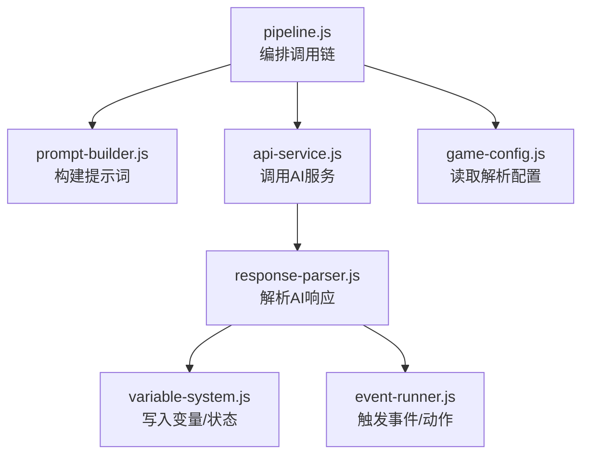
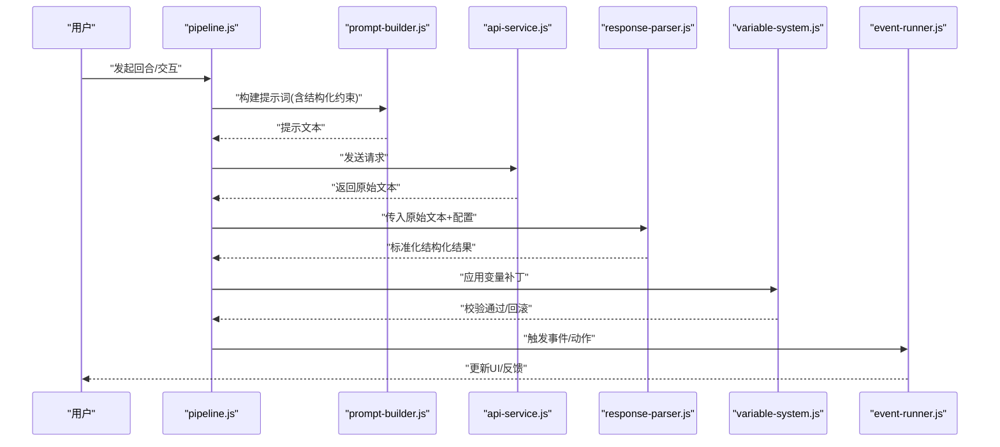
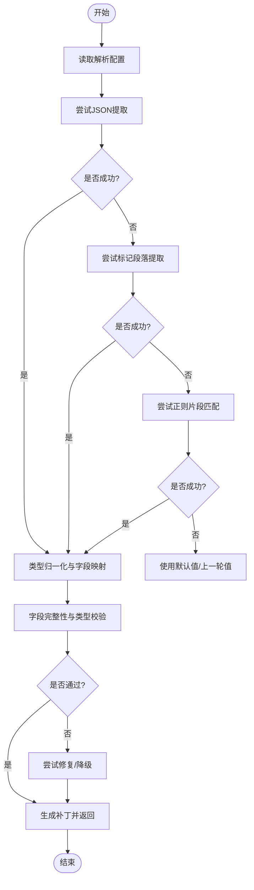
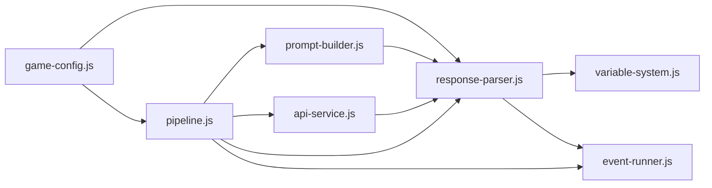

# 响应解析系统

<cite>
**本文引用的文件**   
- [response-parser.js](file://module/response-parser.js)
- [variable-system.js](file://module/variable-system.js)
- [pipeline.js](file://module/pipeline.js)
- [prompt-builder.js](file://module/prompt-builder.js)
- [game-config.js](file://module/game-config.js)
- [event-runner.js](file://module/event-runner.js)
- [api-service.js](file://module/api-service.js)
</cite>

## 目录
1. [简介](#简介)
2. [项目结构](#项目结构)
3. [核心组件](#核心组件)
4. [架构总览](#架构总览)
5. [详细组件分析](#详细组件分析)
6. [依赖关系分析](#依赖关系分析)
7. [性能考量](#性能考量)
8. [故障排查指南](#故障排查指南)
9. [结论](#结论)
10. [附录](#附录)

## 简介
本技术文档聚焦于“姬侠传”AI响应解析系统，围绕从大模型返回的原始文本中稳定、可配置地提取结构化信息（如游戏状态更新、对话内容、行动结果等）展开。文档深入解释解析器的核心算法与流程，包括JSON格式提取、正则表达式匹配、结构化数据转换、错误处理与容错机制，以及与变量系统的集成方式。同时提供解析规则的配置方法与自定义解析器开发指南，并给出常见问题解决方案。

## 项目结构
与响应解析相关的核心模块位于 module 目录下：
- response-parser.js：实现AI响应的解析主逻辑，包含多种提取策略与规范化输出。
- variable-system.js：提供变量的读写、作用域与类型校验能力，供解析结果应用至游戏状态。
- pipeline.js：编排调用链，串联提示构建、API请求、响应解析与事件执行。
- prompt-builder.js：负责构造发送给AI的提示词，影响AI返回的结构化程度。
- game-config.js：集中管理全局配置，包括解析规则开关、默认值、重试策略等。
- event-runner.js：将解析得到的动作或事件应用到游戏世界。
- api-service.js：封装对外部AI服务的调用，统一异常与超时处理。

图表来源
- [pipeline.js](file://module/pipeline.js)
- [prompt-builder.js](file://module/prompt-builder.js)
- [api-service.js](file://module/api-service.js)
- [response-parser.js](file://module/response-parser.js)
- [variable-system.js](file://module/variable-system.js)
- [event-runner.js](file://module/event-runner.js)
- [game-config.js](file://module/game-config.js)

章节来源
- [pipeline.js](file://module/pipeline.js)
- [response-parser.js](file://module/response-parser.js)
- [variable-system.js](file://module/variable-system.js)
- [prompt-builder.js](file://module/prompt-builder.js)
- [game-config.js](file://module/game-config.js)
- [event-runner.js](file://module/event-runner.js)
- [api-service.js](file://module/api-service.js)

## 核心组件
- 响应解析器（response-parser.js）
  - 职责：接收AI返回的原始文本，按优先级尝试多种提取策略（JSON块、标记段、正则片段），产出统一的标准化对象；对缺失字段进行默认填充与类型归一化；记录诊断信息以便调试。
  - 关键能力：
    - JSON提取：定位代码块或最外层JSON，支持多候选与回退。
    - 正则匹配：针对特定字段（如对话、行动、数值变化）进行稳健抽取。
    - 结构化转换：将字符串型数值、布尔、枚举转换为强类型；合并增量更新与全量覆盖。
    - 容错与降级：在部分字段缺失时采用默认值或上一轮有效值；失败时保留上下文继续推进。
- 变量系统（variable-system.js）
  - 职责：维护游戏状态与角色属性，提供命名空间、类型校验、原子更新与快照能力。
  - 与解析器协作：解析器输出的变更以“补丁”形式提交，变量系统进行合并、校验与持久化。
- 管线编排（pipeline.js）
  - 职责：协调提示构建、网络请求、解析与应用的全链路；管理重试、超时与错误传播。
- 提示构建（prompt-builder.js）
  - 职责：根据当前上下文生成结构化要求明确的提示词，提升AI返回的可解析性。
- 配置中心（game-config.js）
  - 职责：集中管理解析规则、默认值、重试次数、日志级别等。
- 事件执行（event-runner.js）
  - 职责：将解析出的动作或事件应用到世界状态，驱动UI与后续流程。
- API服务（api-service.js）
  - 职责：封装外部AI接口，统一异常、重试与限流。

章节来源
- [response-parser.js](file://module/response-parser.js)
- [variable-system.js](file://module/variable-system.js)
- [pipeline.js](file://module/pipeline.js)
- [prompt-builder.js](file://module/prompt-builder.js)
- [game-config.js](file://module/game-config.js)
- [event-runner.js](file://module/event-runner.js)
- [api-service.js](file://module/api-service.js)

## 架构总览
下图展示了从用户输入到状态更新的完整流程，突出解析器在其中的位置与职责。

图表来源
- [pipeline.js](file://module/pipeline.js)
- [prompt-builder.js](file://module/prompt-builder.js)
- [api-service.js](file://module/api-service.js)
- [response-parser.js](file://module/response-parser.js)
- [variable-system.js](file://module/variable-system.js)
- [event-runner.js](file://module/event-runner.js)

## 详细组件分析

### 响应解析器（response-parser.js）
- 设计要点
  - 多阶段提取：优先尝试JSON块提取，其次尝试标记段落，最后使用正则片段匹配。
  - 字段映射：将AI返回的键名映射到内部标准字段，支持别名与路径选择。
  - 类型归一化：自动识别数字、布尔、枚举、时间戳等并进行转换。
  - 增量合并：支持patch式更新，避免覆盖未变更字段。
  - 诊断日志：记录各阶段命中情况、失败原因与修复动作，便于问题定位。
- 关键流程（概念图）

图表来源
- [response-parser.js](file://module/response-parser.js)
- [game-config.js](file://module/game-config.js)

章节来源
- [response-parser.js](file://module/response-parser.js)
- [game-config.js](file://module/game-config.js)

### 变量系统（variable-system.js）
- 设计要点
  - 命名空间与作用域：支持全局、角色、场景等层级隔离。
  - 类型约束：为每个变量定义类型与可选范围，写入前进行校验。
  - 原子更新：批量补丁在一次事务内合并，失败则整体回滚。
  - 快照与回溯：支持保存历史快照，便于调试与回滚。
- 与解析器的集成
  - 解析器输出“补丁”，变量系统负责合并、校验与持久化。
  - 对于缺失字段，变量系统可按配置注入默认值或沿用旧值。

章节来源
- [variable-system.js](file://module/variable-system.js)

### 管线编排（pipeline.js）
- 职责
  - 串联提示构建、网络请求、解析与应用。
  - 管理重试、超时、错误传播与降级策略。
- 与解析器的协作
  - 将AI返回的原始文本交给解析器，并根据配置决定是否需要二次尝试或回退。
  - 将解析结果交由变量系统与事件执行器处理。

章节来源
- [pipeline.js](file://module/pipeline.js)

### 提示构建（prompt-builder.js）
- 职责
  - 根据当前上下文生成结构化要求明确的提示词，引导AI返回易于解析的内容。
  - 注入解析规则说明与示例，提高成功率。
- 与解析器的协作
  - 提示词越规范，解析器越容易命中JSON或标记段落，降低正则匹配成本。

章节来源
- [prompt-builder.js](file://module/prompt-builder.js)

### 配置中心（game-config.js）
- 职责
  - 集中管理解析规则开关、默认值、重试次数、日志级别等。
  - 提供运行时可热更新的配置项，便于A/B测试与调优。
- 与解析器的协作
  - 解析器在启动与每次解析时读取相关配置，动态调整行为。

章节来源
- [game-config.js](file://module/game-config.js)

### 事件执行（event-runner.js）
- 职责
  - 将解析出的动作或事件应用到世界状态，驱动UI与后续流程。
- 与解析器的协作
  - 解析器产出的“动作清单”由事件执行器逐一派发，确保顺序与幂等。

章节来源
- [event-runner.js](file://module/event-runner.js)

### API服务（api-service.js）
- 职责
  - 封装外部AI接口，统一异常、重试与限流。
- 与解析器的协作
  - 当网络异常或超时，管线层可触发重试；若仍失败，进入降级流程（例如使用缓存或默认回复）。

章节来源
- [api-service.js](file://module/api-service.js)

## 依赖关系分析
- 耦合与内聚
  - 解析器与变量系统解耦良好，通过“补丁”契约交互，便于替换与扩展。
  - 管线编排作为中枢，聚合各模块，保持单一职责。
- 外部依赖
  - 外部AI服务通过api-service抽象，便于切换供应商或本地模型。
- 潜在循环依赖
  - 当前模块间为单向依赖，未发现循环引用风险。

图表来源
- [pipeline.js](file://module/pipeline.js)
- [prompt-builder.js](file://module/prompt-builder.js)
- [api-service.js](file://module/api-service.js)
- [response-parser.js](file://module/response-parser.js)
- [variable-system.js](file://module/variable-system.js)
- [event-runner.js](file://module/event-runner.js)
- [game-config.js](file://module/game-config.js)

章节来源
- [pipeline.js](file://module/pipeline.js)
- [response-parser.js](file://module/response-parser.js)
- [variable-system.js](file://module/variable-system.js)
- [prompt-builder.js](file://module/prompt-builder.js)
- [game-config.js](file://module/game-config.js)
- [event-runner.js](file://module/event-runner.js)
- [api-service.js](file://module/api-service.js)

## 性能考量
- 解析策略优先级
  - 优先JSON与标记段落，减少正则计算开销。
- 增量合并
  - 仅对变更字段进行类型转换与校验，降低CPU与内存占用。
- 批处理与节流
  - 对高频事件进行批处理，避免频繁触发UI重绘与持久化。
- 缓存与复用
  - 对稳定的上下文与模板进行缓存，减少重复计算。
- 超时与重试
  - 合理设置超时阈值与重试次数，避免雪崩效应。

[本节为通用指导，不直接分析具体文件]

## 故障排查指南
- 常见错误与对策
  - JSON无法解析：检查提示词是否强制要求JSON块；启用备用正则策略；查看诊断日志中的失败原因。
  - 字段缺失：确认变量系统默认值配置；必要时回退到上一轮有效值。
  - 类型不匹配：检查变量类型约束与解析器的类型归一化规则；必要时增加显式转换。
  - 网络异常：检查api-service的重试与熔断配置；观察超时与限流日志。
- 定位步骤
  - 开启更详细的解析日志，关注各阶段命中情况。
  - 复现最小用例，逐步关闭解析策略以定位问题来源。
  - 对比不同提示词模板下的解析成功率，优化提示构建。

章节来源
- [response-parser.js](file://module/response-parser.js)
- [variable-system.js](file://module/variable-system.js)
- [api-service.js](file://module/api-service.js)
- [game-config.js](file://module/game-config.js)

## 结论
本解析系统通过多阶段提取、严格类型归一化与变量系统原子更新，实现了从非结构化AI文本到稳定游戏状态的可靠转换。配合提示构建与配置中心，可在不同AI供应商与业务场景下快速适配与调优。建议持续完善诊断日志与回归测试，以提升鲁棒性与可维护性。

[本节为总结，不直接分析具体文件]

## 附录

### 解析规则配置方法
- 在配置中心新增或修改解析规则项，包括：
  - 是否启用JSON提取、标记段落提取、正则匹配。
  - 字段映射表与别名。
  - 默认值与回退策略。
  - 重试次数与超时阈值。
- 运行时可通过配置接口热更新，无需重启服务。

章节来源
- [game-config.js](file://module/game-config.js)

### 自定义解析器开发指南
- 目标
  - 在不改动管线核心的前提下，插入新的解析策略或替换现有策略。
- 步骤
  - 实现与现有解析器一致的输入输出契约（原始文本→标准化对象）。
  - 注册新策略到管线，指定优先级与适用条件。
  - 在配置中心添加对应开关与参数。
  - 编写单元测试，覆盖正常、异常与边界用例。
- 注意事项
  - 保证幂等与可回滚。
  - 输出必须通过变量系统的类型校验。
  - 记录诊断信息，便于问题追踪。

章节来源
- [pipeline.js](file://module/pipeline.js)
- [response-parser.js](file://module/response-parser.js)
- [variable-system.js](file://module/variable-system.js)
- [game-config.js](file://module/game-config.js)

### 实际代码示例路径
- 解析主流程入口与策略编排
  - [response-parser.js](file://module/response-parser.js)
- 变量写入与校验
  - [variable-system.js](file://module/variable-system.js)
- 管线编排与重试
  - [pipeline.js](file://module/pipeline.js)
- 提示词构建与结构化约束
  - [prompt-builder.js](file://module/prompt-builder.js)
- 配置项与默认值
  - [game-config.js](file://module/game-config.js)
- 事件派发与动作执行
  - [event-runner.js](file://module/event-runner.js)
- AI服务调用与异常处理
  - [api-service.js](file://module/api-service.js)