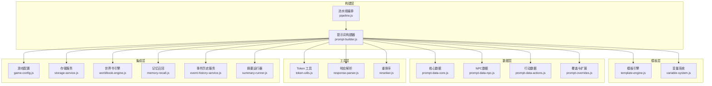
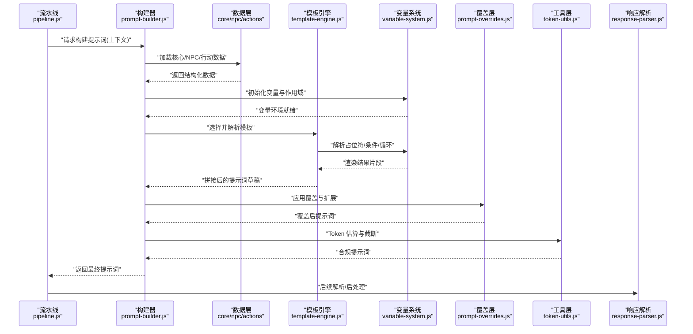
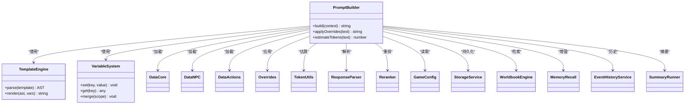

# 提示词工程系统

<cite>
**本文引用的文件**   
- [prompt-builder.js](file://module/prompt-builder.js)
- [template-engine.js](file://module/template-engine.js)
- [variable-system.js](file://module/variable-system.js)
- [prompt-data-core.js](file://module/prompt-data-core.js)
- [prompt-data-npc.js](file://module/prompt-data-npc.js)
- [prompt-data-actions.js](file://module/prompt-data-actions.js)
- [prompt-overrides.js](file://module/prompt-overrides.js)
- [pipeline.js](file://module/pipeline.js)
- [token-utils.js](file://module/token-utils.js)
- [response-parser.js](file://module/response-parser.js)
- [game-config.js](file://module/game-config.js)
- [storage-service.js](file://module/storage-service.js)
- [worldbook-engine.js](file://module/worldbook-engine.js)
- [memory-recall.js](file://module/memory-recall.js)
- [event-history-service.js](file://module/event-history-service.js)
- [summary-runner.js](file://module/summary-runner.js)
- [reranker.js](file://module/reranker.js)
</cite>

## 目录
1. [简介](#简介)
2. [项目结构](#项目结构)
3. [核心组件](#核心组件)
4. [架构总览](#架构总览)
5. [详细组件分析](#详细组件分析)
6. [依赖关系分析](#依赖关系分析)
7. [性能考虑](#性能考虑)
8. [故障排查指南](#故障排查指南)
9. [结论](#结论)
10. [附录](#附录)

## 简介
本技术文档围绕“姬侠传”的提示词工程系统，系统性阐述提示词构建器、模板引擎、变量系统与数据层的设计与实现。重点覆盖：
- 动态模板生成与上下文管理
- 变量替换机制与占位符解析
- 条件渲染与循环处理
- 提示词覆盖机制与自定义扩展点
- 数据层组织（核心数据、NPC数据、行动数据）及加载机制
- 优化实践与性能调优建议
- 调试技巧与可观测性

## 项目结构
提示词工程相关模块集中于 module 目录，采用分层与职责分离的组织方式：
- 构建层：负责组装最终提示词，协调数据、模板与上下文
- 模板层：提供模板解析、占位符替换、条件与循环渲染
- 变量层：维护运行时变量与作用域，支持嵌套与合并
- 数据层：核心数据、NPC数据、行动数据的结构化组织与加载
- 覆盖层：提供覆盖策略与扩展点
- 工具层：Token 统计、响应解析、重排序等辅助能力
- 集成层：与游戏配置、存储、世界书、记忆召回、事件历史、摘要流水线等交互

图表来源
- [prompt-builder.js](file://module/prompt-builder.js)
- [template-engine.js](file://module/template-engine.js)
- [variable-system.js](file://module/variable-system.js)
- [prompt-data-core.js](file://module/prompt-data-core.js)
- [prompt-data-npc.js](file://module/prompt-data-npc.js)
- [prompt-data-actions.js](file://module/prompt-data-actions.js)
- [prompt-overrides.js](file://module/prompt-overrides.js)
- [pipeline.js](file://module/pipeline.js)
- [token-utils.js](file://module/token-utils.js)
- [response-parser.js](file://module/response-parser.js)
- [reranker.js](file://module/reranker.js)
- [game-config.js](file://module/game-config.js)
- [storage-service.js](file://module/storage-service.js)
- [worldbook-engine.js](file://module/worldbook-engine.js)
- [memory-recall.js](file://module/memory-recall.js)
- [event-history-service.js](file://module/event-history-service.js)
- [summary-runner.js](file://module/summary-runner.js)

章节来源
- [prompt-builder.js](file://module/prompt-builder.js)
- [template-engine.js](file://module/template-engine.js)
- [variable-system.js](file://module/variable-system.js)
- [prompt-data-core.js](file://module/prompt-data-core.js)
- [prompt-data-npc.js](file://module/prompt-data-npc.js)
- [prompt-data-actions.js](file://module/prompt-data-actions.js)
- [prompt-overrides.js](file://module/prompt-overrides.js)
- [pipeline.js](file://module/pipeline.js)
- [token-utils.js](file://module/token-utils.js)
- [response-parser.js](file://module/response-parser.js)
- [reranker.js](file://module/reranker.js)
- [game-config.js](file://module/game-config.js)
- [storage-service.js](file://module/storage-service.js)
- [worldbook-engine.js](file://module/worldbook-engine.js)
- [memory-recall.js](file://module/memory-recall.js)
- [event-history-service.js](file://module/event-history-service.js)
- [summary-runner.js](file://module/summary-runner.js)

## 核心组件
- 提示词构建器：统一入口，负责收集上下文、调用模板引擎、执行变量替换、应用覆盖策略、进行 Token 估算与截断、输出最终提示词。
- 模板引擎：解析模板字符串，支持占位符、条件块、循环块、片段复用与组合。
- 变量系统：维护作用域链、变量合并、默认值与惰性求值，提供安全的访问与错误回退。
- 数据层：核心数据、NPC数据、行动数据以结构化对象形式组织，并提供按需加载与缓存。
- 覆盖与扩展：通过覆盖策略注入或替换特定片段，支持插件式扩展点。
- 工具与集成：Token 统计、响应解析、重排序、配置读取、持久化、世界书检索、记忆召回、事件历史与摘要流水线。

章节来源
- [prompt-builder.js](file://module/prompt-builder.js)
- [template-engine.js](file://module/template-engine.js)
- [variable-system.js](file://module/variable-system.js)
- [prompt-data-core.js](file://module/prompt-data-core.js)
- [prompt-data-npc.js](file://module/prompt-data-npc.js)
- [prompt-data-actions.js](file://module/prompt-data-actions.js)
- [prompt-overrides.js](file://module/prompt-overrides.js)
- [token-utils.js](file://module/token-utils.js)
- [response-parser.js](file://module/response-parser.js)
- [reranker.js](file://module/reranker.js)
- [game-config.js](file://module/game-config.js)
- [storage-service.js](file://module/storage-service.js)
- [worldbook-engine.js](file://module/worldbook-engine.js)
- [memory-recall.js](file://module/memory-recall.js)
- [event-history-service.js](file://module/event-history-service.js)
- [summary-runner.js](file://module/summary-runner.js)

## 架构总览
提示词构建流程从上层流水线触发，由构建器协调数据层、模板引擎与变量系统完成动态生成，并通过覆盖层注入个性化内容，最后经工具层进行 Token 控制与输出。

图表来源
- [pipeline.js](file://module/pipeline.js)
- [prompt-builder.js](file://module/prompt-builder.js)
- [prompt-data-core.js](file://module/prompt-data-core.js)
- [prompt-data-npc.js](file://module/prompt-data-npc.js)
- [prompt-data-actions.js](file://module/prompt-data-actions.js)
- [template-engine.js](file://module/template-engine.js)
- [variable-system.js](file://module/variable-system.js)
- [prompt-overrides.js](file://module/prompt-overrides.js)
- [token-utils.js](file://module/token-utils.js)
- [response-parser.js](file://module/response-parser.js)

## 详细组件分析

### 提示词构建器（Prompt Builder）
- 职责
  - 聚合上下文：玩家状态、场景信息、NPC关系、近期事件、世界书片段等
  - 驱动模板引擎：按场景/动作选择对应模板
  - 管理变量作用域：合并全局、局部与运行时变量
  - 应用覆盖策略：允许外部注入或替换片段
  - Token 控制：估算长度、安全截断、保留关键段
  - 输出：标准化提示词文本与元数据（如使用的模板、变量键集合）
- 关键流程
  - 初始化上下文与变量
  - 加载数据层（核心/NPC/行动）
  - 解析模板与渲染
  - 覆盖与扩展
  - Token 校验与裁剪
  - 返回结果
- 设计要点
  - 幂等性与可重复构建：相同输入应得到一致输出
  - 可扩展：通过覆盖层与钩子函数接入新逻辑
  - 容错：缺失变量或数据时提供默认值与降级路径

章节来源
- [prompt-builder.js](file://module/prompt-builder.js)
- [prompt-data-core.js](file://module/prompt-data-core.js)
- [prompt-data-npc.js](file://module/prompt-data-npc.js)
- [prompt-data-actions.js](file://module/prompt-data-actions.js)
- [prompt-overrides.js](file://module/prompt-overrides.js)
- [token-utils.js](file://module/token-utils.js)

### 模板引擎（Template Engine）
- 功能
  - 占位符解析：将变量键映射为实际值
  - 条件渲染：根据布尔表达式或存在性判断是否输出片段
  - 循环处理：对数组型数据进行迭代拼接
  - 片段复用：支持包含与组合，减少重复模板
- 实现要点
  - 解析阶段：识别语法节点（占位符、条件、循环、片段）
  - 渲染阶段：在变量作用域内求值并拼接
  - 错误处理：未定义变量、类型不匹配时的回退策略
  - 性能：避免重复解析，缓存已编译模板
- 最佳实践
  - 模板保持简洁，复杂逻辑下沉到变量系统或数据层
  - 使用命名空间化的变量键，降低冲突风险
  - 条件与循环尽量基于确定性数据，避免副作用

章节来源
- [template-engine.js](file://module/template-engine.js)
- [variable-system.js](file://module/variable-system.js)

### 变量系统（Variable System）
- 作用域模型
  - 全局作用域：跨会话共享的基础变量
  - 局部作用域：单次构建的上下文变量
  - 临时作用域：片段级或循环内的中间变量
- 合并策略
  - 优先级：局部 > 临时 > 全局
  - 冲突处理：显式覆盖或命名空间隔离
- 特性
  - 惰性求值：仅在需要时计算昂贵变量
  - 默认值与回退：缺失键时返回默认或空片段
  - 类型安全：对数值、布尔、字符串等进行校验
- 性能
  - 缓存最近使用的变量值
  - 批量更新与增量刷新

章节来源
- [variable-system.js](file://module/variable-system.js)

### 数据层（Core / NPC / Actions）
- 核心数据（Core）
  - 组织：角色基础属性、世界观常量、系统规则
  - 加载：启动时预加载，支持热更新与版本兼容
- NPC 数据（NPC）
  - 组织：角色画像、关系网、好感度、行为偏好
  - 加载：按需加载，结合记忆召回与事件历史动态增强
- 行动数据（Actions）
  - 组织：可选行动列表、前置条件、效果描述、模板关联
  - 加载：根据当前场景与玩家状态筛选可用行动
- 数据结构与复杂度
  - 查找：基于 ID 或名称的索引结构，O(1) 或 O(log n)
  - 过滤：条件筛选与排序，时间复杂度与数据规模线性相关
- 加载机制
  - 懒加载与缓存：首次访问加载，后续命中缓存
  - 增量更新：差异合并，避免全量重建
  - 失败回退：网络或存储异常时使用本地备份

章节来源
- [prompt-data-core.js](file://module/prompt-data-core.js)
- [prompt-data-npc.js](file://module/prompt-data-npc.js)
- [prompt-data-actions.js](file://module/prompt-data-actions.js)
- [storage-service.js](file://module/storage-service.js)
- [memory-recall.js](file://module/memory-recall.js)
- [event-history-service.js](file://module/event-history-service.js)

### 覆盖与扩展（Overrides & Extensions）
- 覆盖机制
  - 片段级覆盖：针对特定模板片段进行替换
  - 条件覆盖：依据运行时条件动态启用覆盖
  - 优先级：覆盖层高于默认模板，但低于用户强制设置
- 扩展点
  - 钩子函数：在构建前后插入自定义逻辑
  - 插件注册：声明式扩展模板片段与变量提供者
  - 策略模式：不同覆盖策略可插拔切换
- 安全性
  - 白名单机制：仅允许覆盖受信任片段
  - 审计日志：记录覆盖来源与变更内容

章节来源
- [prompt-overrides.js](file://module/prompt-overrides.js)

### 工具与集成（Tools & Integrations）
- Token 工具
  - 估算：近似计数，支持多模型差异
  - 截断：优先保留系统指令、关键上下文与最新对话
- 响应解析
  - 结构化提取：从模型输出中抽取字段
  - 容错：部分失败时回退到默认结构
- 重排序
  - 相关性评分：结合语义与规则进行排序
  - 去重与压缩：减少冗余信息
- 配置与存储
  - 配置读取：集中化管理参数与开关
  - 持久化：本地存储快照与增量同步
- 世界书与记忆
  - 世界书：主题化知识片段检索与注入
  - 记忆召回：基于事件历史的上下文增强

章节来源
- [token-utils.js](file://module/token-utils.js)
- [response-parser.js](file://module/response-parser.js)
- [reranker.js](file://module/reranker.js)
- [game-config.js](file://module/game-config.js)
- [storage-service.js](file://module/storage-service.js)
- [worldbook-engine.js](file://module/worldbook-engine.js)
- [memory-recall.js](file://module/memory-recall.js)
- [event-history-service.js](file://module/event-history-service.js)
- [summary-runner.js](file://module/summary-runner.js)

## 依赖关系分析
构建器作为中心枢纽，依赖数据层、模板引擎、变量系统、覆盖层与工具层；同时与配置、存储、世界书、记忆、事件历史与摘要流水线集成。

图表来源
- [prompt-builder.js](file://module/prompt-builder.js)
- [template-engine.js](file://module/template-engine.js)
- [variable-system.js](file://module/variable-system.js)
- [prompt-data-core.js](file://module/prompt-data-core.js)
- [prompt-data-npc.js](file://module/prompt-data-npc.js)
- [prompt-data-actions.js](file://module/prompt-data-actions.js)
- [prompt-overrides.js](file://module/prompt-overrides.js)
- [token-utils.js](file://module/token-utils.js)
- [response-parser.js](file://module/response-parser.js)
- [reranker.js](file://module/reranker.js)
- [game-config.js](file://module/game-config.js)
- [storage-service.js](file://module/storage-service.js)
- [worldbook-engine.js](file://module/worldbook-engine.js)
- [memory-recall.js](file://module/memory-recall.js)
- [event-history-service.js](file://module/event-history-service.js)
- [summary-runner.js](file://module/summary-runner.js)

章节来源
- [prompt-builder.js](file://module/prompt-builder.js)
- [template-engine.js](file://module/template-engine.js)
- [variable-system.js](file://module/variable-system.js)
- [prompt-data-core.js](file://module/prompt-data-core.js)
- [prompt-data-npc.js](file://module/prompt-data-npc.js)
- [prompt-data-actions.js](file://module/prompt-data-actions.js)
- [prompt-overrides.js](file://module/prompt-overrides.js)
- [token-utils.js](file://module/token-utils.js)
- [response-parser.js](file://module/response-parser.js)
- [reranker.js](file://module/reranker.js)
- [game-config.js](file://module/game-config.js)
- [storage-service.js](file://module/storage-service.js)
- [worldbook-engine.js](file://module/worldbook-engine.js)
- [memory-recall.js](file://module/memory-recall.js)
- [event-history-service.js](file://module/event-history-service.js)
- [summary-runner.js](file://module/summary-runner.js)

## 性能考虑
- 模板与变量
  - 缓存已编译模板与常用变量片段，避免重复解析
  - 惰性计算昂贵变量，按需加载大对象
  - 使用命名空间与最小作用域，减少变量合并开销
- 数据层
  - 建立索引结构，提升查找与过滤效率
  - 增量更新与差异合并，避免全量重建
  - 懒加载与分页加载大型数据集
- Token 控制
  - 早期估算与快速截断，防止超长提示词
  - 分段保留策略：系统指令 > 关键上下文 > 最新对话
- 并发与异步
  - 并行加载独立数据源（NPC、行动、世界书片段）
  - 超时与重试机制，保障稳定性
- 监控与度量
  - 记录构建耗时、Token 用量、命中率与错误率
  - 采样日志，避免高负载下日志风暴

[本节为通用指导，无需具体文件引用]

## 故障排查指南
- 常见问题
  - 变量未定义：检查作用域链与键名拼写，确认默认值与回退逻辑
  - 模板解析失败：验证语法节点是否正确闭合，查看错误位置与上下文
  - 数据加载异常：确认存储可用性、网络连通性与版本兼容性
  - Token 超限：调整截断策略，精简非必要片段
  - 覆盖冲突：检查覆盖优先级与白名单配置
- 调试技巧
  - 开启构建链路日志，记录各阶段输入输出
  - 打印变量快照与模板 AST，定位渲染问题
  - 使用最小复现用例，逐步缩小范围
  - 对比覆盖前后的提示词差异，确认覆盖生效范围
- 恢复策略
  - 回退到上一版本模板与数据
  - 启用离线缓存与本地备份
  - 降级模式：关闭非关键增强（如世界书、记忆召回）

章节来源
- [prompt-builder.js](file://module/prompt-builder.js)
- [template-engine.js](file://module/template-engine.js)
- [variable-system.js](file://module/variable-system.js)
- [prompt-data-core.js](file://module/prompt-data-core.js)
- [prompt-data-npc.js](file://module/prompt-data-npc.js)
- [prompt-data-actions.js](file://module/prompt-data-actions.js)
- [prompt-overrides.js](file://module/prompt-overrides.js)
- [token-utils.js](file://module/token-utils.js)
- [storage-service.js](file://module/storage-service.js)

## 结论
该提示词工程系统通过清晰的层次划分与模块化设计，实现了动态模板生成、灵活的变量替换、强大的覆盖与扩展能力，并结合 Token 控制与多种集成点，满足复杂叙事与交互需求。遵循本文的最佳实践与性能建议，可进一步提升系统的稳定性、可维护性与用户体验。

[本节为总结，无需具体文件引用]

## 附录
- 术语表
  - 占位符：模板中的变量标记，用于运行时替换
  - 条件渲染：根据布尔表达式决定是否输出片段
  - 循环处理：对数组数据进行迭代拼接
  - 覆盖：用自定义片段替换默认片段
  - Token：模型输入输出的基本计量单位
- 参考路径
  - 构建器入口：[prompt-builder.js](file://module/prompt-builder.js)
  - 模板引擎：[template-engine.js](file://module/template-engine.js)
  - 变量系统：[variable-system.js](file://module/variable-system.js)
  - 数据层：[prompt-data-core.js](file://module/prompt-data-core.js)、[prompt-data-npc.js](file://module/prompt-data-npc.js)、[prompt-data-actions.js](file://module/prompt-data-actions.js)
  - 覆盖与扩展：[prompt-overrides.js](file://module/prompt-overrides.js)
  - 工具与集成：[token-utils.js](file://module/token-utils.js)、[response-parser.js](file://module/response-parser.js)、[reranker.js](file://module/reranker.js)、[game-config.js](file://module/game-config.js)、[storage-service.js](file://module/storage-service.js)、[worldbook-engine.js](file://module/worldbook-engine.js)、[memory-recall.js](file://module/memory-recall.js)、[event-history-service.js](file://module/event-history-service.js)、[summary-runner.js](file://module/summary-runner.js)