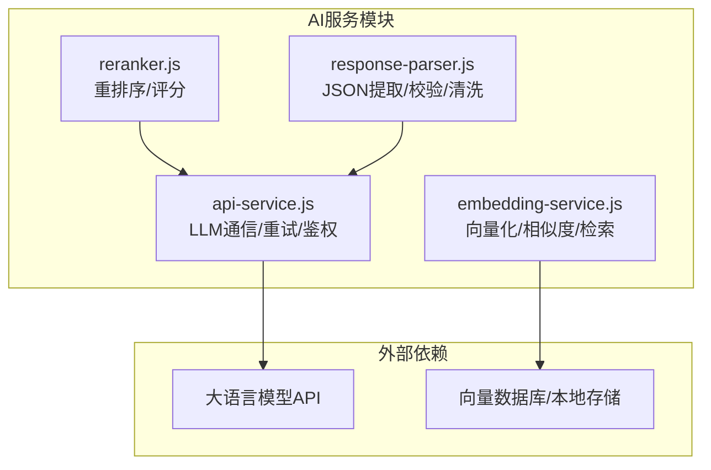
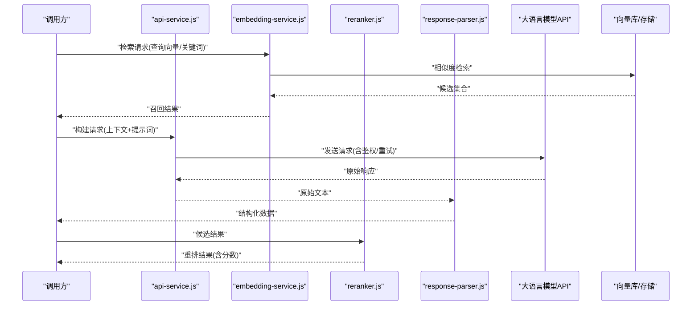
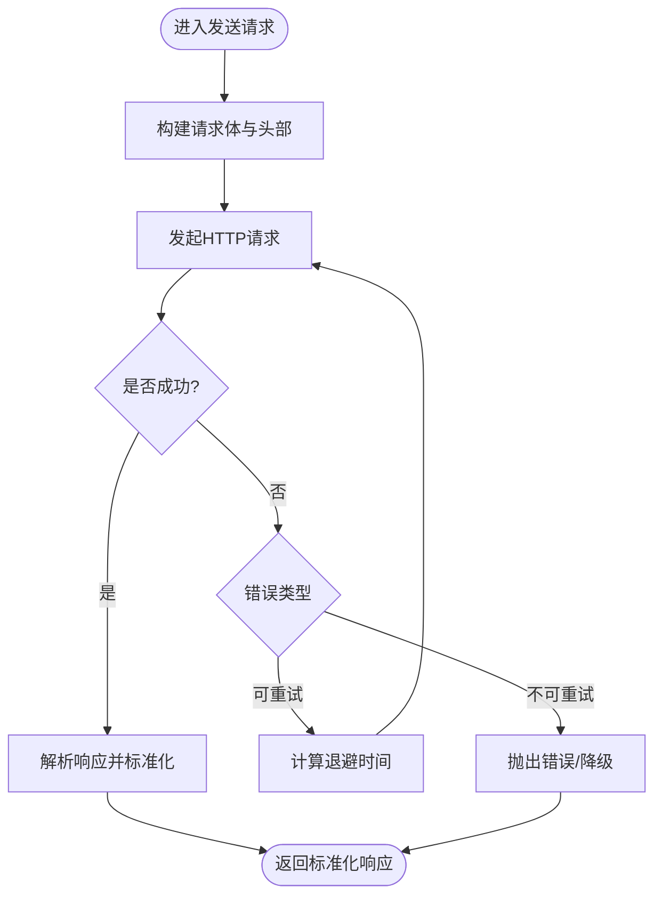
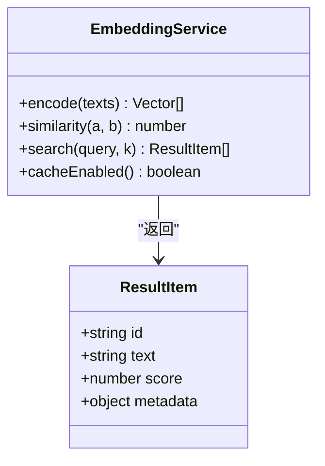
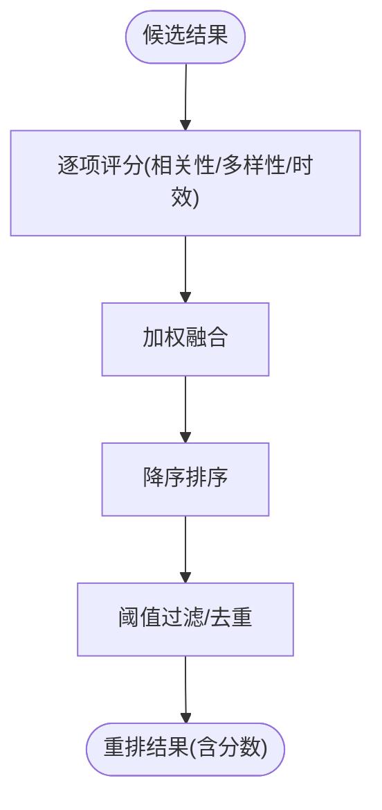
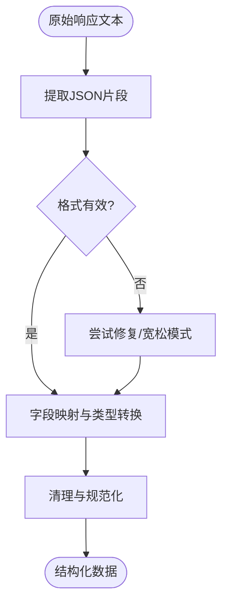
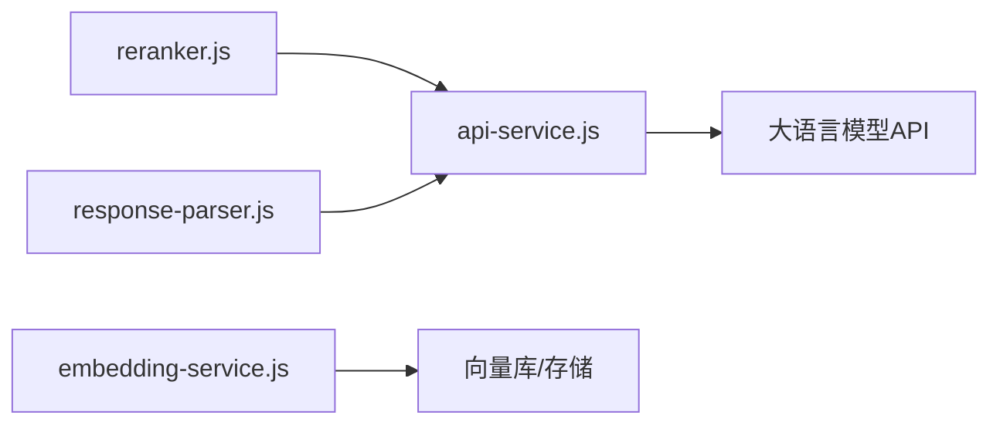

# AI服务API

<cite>
**本文引用的文件**   
- [api-service.js](file://module/api-service.js)
- [embedding-service.js](file://module/embedding-service.js)
- [reranker.js](file://module/reranker.js)
- [response-parser.js](file://module/response-parser.js)
</cite>

## 目录
1. [简介](#简介)
2. [项目结构](#项目结构)
3. [核心组件](#核心组件)
4. [架构总览](#架构总览)
5. [详细组件分析](#详细组件分析)
6. [依赖分析](#依赖分析)
7. [性能考虑](#性能考虑)
8. [故障排查指南](#故障排查指南)
9. [结论](#结论)
10. [附录](#附录)

## 简介
本文件为“姬侠传AI集成系统”的API参考文档，聚焦以下四个核心模块：
- api-service.js：大语言模型通信接口（请求构建、响应处理、错误重试）
- embedding-service.js：向量嵌入服务（文本向量化、相似度计算、检索）
- reranker.js：重排序算法接口（结果优化与评分机制）
- response-parser.js：响应解析API（JSON提取、格式验证、内容处理）

文档提供完整的HTTP接口规范、消息格式定义、认证方法、限流策略、缓存机制与性能调优建议。

## 项目结构
本项目采用模块化组织方式，AI相关能力集中在 module 目录下，按职责拆分为独立脚本：
- api-service.js：负责对外部大模型的HTTP调用、鉴权、重试与超时控制
- embedding-service.js：封装文本到向量、相似度计算与检索流程
- reranker.js：对召回结果进行二次打分与重排
- response-parser.js：从LLM原始输出中抽取结构化数据并校验

图表来源
- [api-service.js](file://module/api-service.js)
- [embedding-service.js](file://module/embedding-service.js)
- [reranker.js](file://module/reranker.js)
- [response-parser.js](file://module/response-parser.js)

章节来源
- [api-service.js](file://module/api-service.js)
- [embedding-service.js](file://module/embedding-service.js)
- [reranker.js](file://module/reranker.js)
- [response-parser.js](file://module/response-parser.js)

## 核心组件
本节概述各模块的职责边界与对外暴露的主要能力，便于快速定位API入口。

- api-service.js
  - 统一封装HTTP请求，支持多后端配置与动态切换
  - 内置鉴权头注入、重试退避、超时与熔断保护
  - 标准化请求体与响应体转换，屏蔽底层差异
- embedding-service.js
  - 文本分块与编码，批量向量化
  - 相似度度量（余弦等），Top-K检索
  - 可选缓存命中与去重
- reranker.js
  - 基于规则或轻量模型的二次打分
  - 融合相关性、多样性与时效性权重
  - 输出稳定排序与置信度
- response-parser.js
  - 从非结构化或半结构化文本中提取JSON片段
  - 严格模式校验与容错修复
  - 字段映射与类型转换

章节来源
- [api-service.js](file://module/api-service.js)
- [embedding-service.js](file://module/embedding-service.js)
- [reranker.js](file://module/reranker.js)
- [response-parser.js](file://module/response-parser.js)

## 架构总览
下图展示一次典型对话的端到端流程：用户输入经提示词组装后通过api-service发起LLM调用；同时embedding-service对知识库进行检索召回；reranker对候选结果重排；response-parser将LLM返回内容解析为结构化数据供上层使用。

图表来源
- [api-service.js](file://module/api-service.js)
- [embedding-service.js](file://module/embedding-service.js)
- [reranker.js](file://module/reranker.js)
- [response-parser.js](file://module/response-parser.js)

## 详细组件分析

### api-service.js：大语言模型通信接口
- 功能要点
  - 请求构建：合并系统提示、历史上下文、工具参数，生成标准请求体
  - 响应处理：统一包装成功/失败状态，提取关键信息（如token用量、延迟）
  - 错误重试：指数退避、抖动、最大重试次数、可配置超时与熔断阈值
  - 鉴权：自动注入Authorization或其他必要头部
- 关键接口（概念说明）
  - 发送请求：接收上下文、模型选择、参数，返回标准化响应
  - 重试策略：根据错误码/异常类型决定是否重试及等待时间
  - 健康检查：探测后端可用性，切换备用端点
- 错误分类与处理
  - 网络错误、超时、鉴权失败、速率限制、服务端错误
  - 针对不同错误采取不同策略（重试、降级、告警）

图表来源
- [api-service.js](file://module/api-service.js)

章节来源
- [api-service.js](file://module/api-service.js)

### embedding-service.js：向量嵌入服务API
- 功能要点
  - 文本向量化：支持单条与批量，自动分块与长度截断
  - 相似度计算：默认余弦相似度，可扩展其他度量
  - 检索：Top-K检索，支持过滤条件与分页
  - 缓存：对重复查询与相似文本进行缓存命中
- 关键接口（概念说明）
  - 向量化：输入文本，返回向量数组
  - 相似度：输入两向量或向量与查询，返回相似度分数
  - 检索：输入查询向量/文本，返回Top-K结果
- 数据结构
  - 向量：浮点数组，维度固定
  - 结果项：包含ID、文本片段、相似度分数、元数据

图表来源
- [embedding-service.js](file://module/embedding-service.js)

章节来源
- [embedding-service.js](file://module/embedding-service.js)

### reranker.js：重排序算法接口
- 功能要点
  - 评分机制：融合相关性、多样性、时效性等特征
  - 结果优化：去重、打散、阈值过滤
  - 可配置权重：允许按场景调整各项权重
- 关键接口（概念说明）
  - 重排：输入候选列表与查询上下文，输出排序后的结果
  - 评分：对单个结果计算综合得分
- 复杂度与稳定性
  - 时间复杂度近似O(n log n)，适合中等规模候选集
  - 分数归一化保证跨批次可比性

图表来源
- [reranker.js](file://module/reranker.js)

章节来源
- [reranker.js](file://module/reranker.js)

### response-parser.js：响应解析API
- 功能要点
  - JSON提取：从混合文本中定位并提取JSON片段
  - 格式验证：严格模式校验，必要时尝试修复
  - 内容处理：字段映射、类型转换、缺失值处理
- 关键接口（概念说明）
  - 解析：输入原始文本，返回结构化对象或错误
  - 校验：对关键字段进行存在性与类型检查
  - 清理：去除多余标记、转义字符与噪声
- 错误处理
  - 解析失败时返回明确错误信息与部分结果
  - 支持回退策略（宽松模式/默认值）

图表来源
- [response-parser.js](file://module/response-parser.js)

章节来源
- [response-parser.js](file://module/response-parser.js)

## 依赖分析
- 内部依赖
  - reranker.js 与 response-parser.js 均可能依赖 api-service.js 提供的标准化响应
  - embedding-service.js 通常独立于LLM，仅与向量存储交互
- 外部依赖
  - api-service.js 依赖HTTP客户端与大模型API
  - embedding-service.js 依赖向量库或本地持久化
- 耦合与内聚
  - 模块间通过清晰的数据契约交互，降低耦合
  - 每个模块职责单一，内聚度高

图表来源
- [api-service.js](file://module/api-service.js)
- [embedding-service.js](file://module/embedding-service.js)
- [reranker.js](file://module/reranker.js)
- [response-parser.js](file://module/response-parser.js)

章节来源
- [api-service.js](file://module/api-service.js)
- [embedding-service.js](file://module/embedding-service.js)
- [reranker.js](file://module/reranker.js)
- [response-parser.js](file://module/response-parser.js)

## 性能考虑
- 限流策略
  - 令牌桶/滑动窗口限流，避免突发流量压垮后端
  - 针对鉴权失败与速率限制错误进行自适应退避
- 缓存机制
  - 向量检索缓存：相同或相似查询直接命中
  - 响应缓存：对幂等请求短期缓存，减少重复调用
- 并发与批处理
  - 批量向量化与并行请求提升吞吐
  - 合理设置并发上限与队列长度
- 超时与熔断
  - 短超时+快速失败，避免雪崩
  - 熔断器在连续失败后暂停请求，逐步恢复
- 资源监控
  - 记录耗时、成功率、错误分布与缓存命中率
  - 指标上报与告警联动

[本节为通用指导，不直接分析具体文件]

## 故障排查指南
- 常见问题
  - 鉴权失败：检查密钥、签名与过期时间
  - 超时：评估网络质量与后端负载，调整超时与重试
  - 解析失败：确认LLM输出格式，启用宽松模式或增加提示约束
  - 检索空结果：检查索引更新、分块策略与相似度阈值
- 诊断步骤
  - 开启详细日志，记录请求体、响应体与中间状态
  - 隔离问题模块，分别测试API、嵌入、重排与解析
  - 使用最小复现用例验证修复效果

章节来源
- [api-service.js](file://module/api-service.js)
- [embedding-service.js](file://module/embedding-service.js)
- [reranker.js](file://module/reranker.js)
- [response-parser.js](file://module/response-parser.js)

## 结论
通过将LLM通信、向量检索、重排序与响应解析解耦为独立模块，系统在可维护性、扩展性与稳定性方面具备良好基础。配合合理的限流、缓存与监控策略，可在复杂业务场景中保持高可用与高性能。

[本节为总结性内容，不直接分析具体文件]

## 附录

### HTTP接口规范（概览）
- 通用要求
  - 协议：HTTPS
  - 内容类型：application/json
  - 字符集：UTF-8
- 认证方法
  - 头部：Authorization: Bearer <token>
  - 可选：X-API-Key、X-Request-ID
- 请求示例（概念）
  - POST /v1/chat/completions
  - 请求体包含模型、消息列表、参数
- 响应示例（概念）
  - 成功：包含choices、usage、id等字段
  - 失败：包含error.code、error.message

[本节为通用规范说明，不直接分析具体文件]

### 消息格式定义（概念）
- 消息角色：system、user、assistant
- 字段：role、content、metadata（可选）
- 参数：temperature、top_p、max_tokens、stop等

[本节为通用规范说明，不直接分析具体文件]

### 向量检索接口（概念）
- 向量化
  - POST /v1/embeddings
  - 输入：texts[]
  - 输出：embeddings[][]
- 相似度
  - POST /v1/similarity
  - 输入：vector_a[], vector_b[]
  - 输出：score
- 检索
  - POST /v1/search
  - 输入：query_vector[] 或 query_text
  - 输出：results[{id, text, score, metadata}]

[本节为通用规范说明，不直接分析具体文件]

### 重排序接口（概念）
- 输入：candidates[{id, text, score}], query_context
- 输出：ranked[{id, text, score, rank}]

[本节为通用规范说明，不直接分析具体文件]

### 响应解析接口（概念）
- 输入：raw_text
- 输出：{data, errors[]}
- 行为：提取JSON、校验、映射、清理

[本节为通用规范说明，不直接分析具体文件]