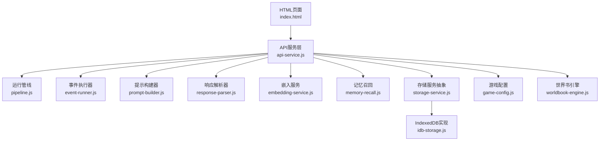
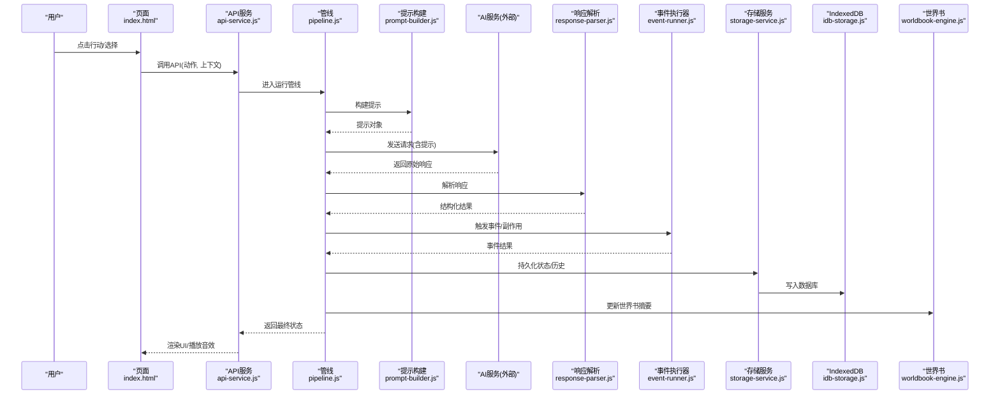
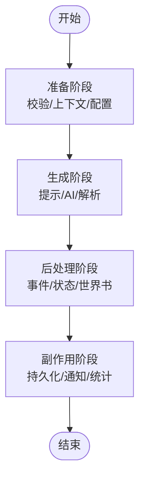
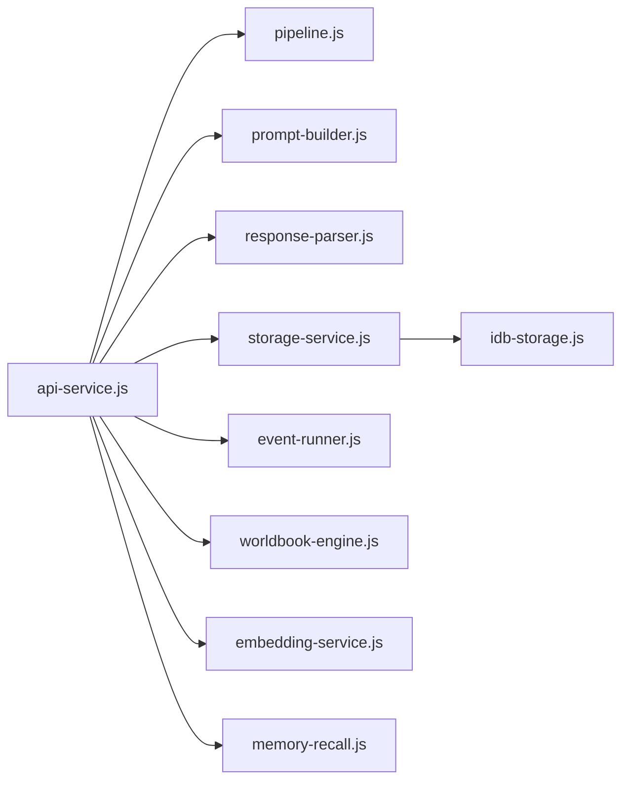

# API参考文档

<cite>
**本文档引用的文件**   
- [api-service.js](file://module/api-service.js)
- [storage-service.js](file://module/storage-service.js)
- [idb-storage.js](file://module/idb-storage.js)
- [pipeline.js](file://module/pipeline.js)
- [prompt-builder.js](file://module/prompt-builder.js)
- [response-parser.js](file://module/response-parser.js)
- [game-config.js](file://module/game-config.js)
- [event-runner.js](file://module/event-runner.js)
- [worldbook-engine.js](file://module/worldbook-engine.js)
- [embedding-service.js](file://module/embedding-service.js)
- [memory-recall.js](file://module/memory-recall.js)
- [index.html](file://index.html)
</cite>

## 目录
1. [简介](#简介)
2. [项目结构](#项目结构)
3. [核心组件](#核心组件)
4. [架构总览](#架构总览)
5. [详细组件分析](#详细组件分析)
6. [依赖关系分析](#依赖关系分析)
7. [性能考虑](#性能考虑)
8. [故障排查指南](#故障排查指南)
9. [结论](#结论)
10. [附录](#附录)

## 简介
本API参考文档面向姬侠传游戏的前端模块与运行时，聚焦以下目标：
- 系统化梳理公共接口的方法签名、参数说明、返回值类型与使用示例路径
- 深入解释游戏引擎API的状态管理与流程控制接口
- 阐述存储服务API的数据操作与查询方法
- 说明AI服务API的请求格式与响应处理
- 提供第三方集成的接口规范与最佳实践
- 给出错误码定义与异常处理指南
- 为API使用者提供完整的技术参考手册

## 项目结构
本项目采用模块化前端架构，核心能力分布在 module 目录下，按职责划分：
- 运行管线与编排：pipeline.js、event-runner.js
- AI交互与提示工程：prompt-builder.js、response-parser.js、embedding-service.js、memory-recall.js
- 存储与持久化：storage-service.js、idb-storage.js
- 配置与上下文：game-config.js、worldbook-engine.js
- 对外暴露的API入口：api-service.js
- 应用入口与页面集成：index.html

图表来源
- [index.html](file://index.html)
- [api-service.js](file://module/api-service.js)
- [pipeline.js](file://module/pipeline.js)
- [event-runner.js](file://module/event-runner.js)
- [prompt-builder.js](file://module/prompt-builder.js)
- [response-parser.js](file://module/response-parser.js)
- [embedding-service.js](file://module/embedding-service.js)
- [memory-recall.js](file://module/memory-recall.js)
- [storage-service.js](file://module/storage-service.js)
- [idb-storage.js](file://module/idb-storage.js)
- [game-config.js](file://module/game-config.js)
- [worldbook-engine.js](file://module/worldbook-engine.js)

章节来源
- [index.html](file://index.html)
- [api-service.js](file://module/api-service.js)
- [pipeline.js](file://module/pipeline.js)
- [storage-service.js](file://module/storage-service.js)
- [idb-storage.js](file://module/idb-storage.js)
- [prompt-builder.js](file://module/prompt-builder.js)
- [response-parser.js](file://module/response-parser.js)
- [embedding-service.js](file://module/embedding-service.js)
- [memory-recall.js](file://module/memory-recall.js)
- [game-config.js](file://module/game-config.js)
- [worldbook-engine.js](file://module/worldbook-engine.js)

## 核心组件
本节概述各核心模块的职责与对外能力边界，便于快速定位API。

- API服务层（api-service.js）
  - 职责：统一对外暴露API；协调管线、事件、提示、响应、存储、配置与世界书等子系统
  - 典型能力：会话初始化、回合推进、动作提交、状态读取/写入、历史与快照管理、AI调用封装

- 运行管线（pipeline.js）
  - 职责：串联“输入预处理→提示构建→AI请求→响应解析→状态更新→事件触发”的端到端流程
  - 关键阶段：准备阶段、生成阶段、后处理阶段、副作用阶段

- 事件执行器（event-runner.js）
  - 职责：根据当前状态与规则触发场景事件、NPC互动、战斗分支等
  - 输出：事件结果、状态变更、UI反馈指令

- 提示构建器（prompt-builder.js）
  - 职责：组装系统提示、角色设定、世界书摘要、对话历史、行动选项等
  - 输入：玩家意图、上下文、变量、技能、地点信息
  - 输出：结构化提示对象

- 响应解析器（response-parser.js）
  - 职责：将AI返回文本解析为结构化数据（如动作、对话、状态变更）
  - 策略：正则/模板匹配、JSON提取、容错回退

- 存储服务抽象（storage-service.js）
  - 职责：提供统一的CRUD、查询、事务、快照、同步接口
  - 后端：IndexedDB（idb-storage.js）

- IndexedDB实现（idb-storage.js）
  - 职责：基于浏览器IndexedDB的持久化实现
  - 能力：对象库管理、索引、批量读写、版本迁移

- 嵌入服务（embedding-service.js）
  - 职责：对文本进行向量化，供检索增强或语义搜索使用
  - 集成：本地模型或远程向量服务

- 记忆召回（memory-recall.js）
  - 职责：基于嵌入相似度召回相关记忆片段，辅助提示构建
  - 策略：Top-K检索、去重、时间衰减

- 游戏配置（game-config.js）
  - 职责：加载并缓存全局配置（AI端点、超时、重试、UI主题、功能开关）

- 世界书引擎（worldbook-engine.js）
  - 职责：维护动态知识图谱/摘要，支持增量更新与检索

章节来源
- [api-service.js](file://module/api-service.js)
- [pipeline.js](file://module/pipeline.js)
- [event-runner.js](file://module/event-runner.js)
- [prompt-builder.js](file://module/prompt-builder.js)
- [response-parser.js](file://module/response-parser.js)
- [storage-service.js](file://module/storage-service.js)
- [idb-storage.js](file://module/idb-storage.js)
- [embedding-service.js](file://module/embedding-service.js)
- [memory-recall.js](file://module/memory-recall.js)
- [game-config.js](file://module/game-config.js)
- [worldbook-engine.js](file://module/worldbook-engine.js)

## 架构总览
下图展示从用户交互到AI生成与状态落盘的完整链路，以及关键中间件与数据流。

图表来源
- [index.html](file://index.html)
- [api-service.js](file://module/api-service.js)
- [pipeline.js](file://module/pipeline.js)
- [prompt-builder.js](file://module/prompt-builder.js)
- [response-parser.js](file://module/response-parser.js)
- [event-runner.js](file://module/event-runner.js)
- [storage-service.js](file://module/storage-service.js)
- [idb-storage.js](file://module/idb-storage.js)
- [worldbook-engine.js](file://module/worldbook-engine.js)

## 详细组件分析

### API服务层（api-service.js）
- 设计要点
  - 作为统一门面，屏蔽内部模块差异，提供稳定契约
  - 负责参数校验、错误包装、日志记录、重试与降级
- 典型接口类别
  - 会话管理：创建/恢复/销毁会话
  - 回合推进：提交玩家动作，获取下一回合状态
  - 状态读写：读取/更新角色属性、好感度、库存、位置等
  - 历史与快照：追加对话历史、创建/恢复快照
  - AI调用：封装提示、网络请求、超时重试、错误分类
  - 存储操作：通过存储服务抽象进行持久化
- 使用建议
  - 所有业务逻辑尽量通过API服务层调用，避免直接耦合底层模块
  - 对异步操作统一使用Promise/Async-Await模式，做好错误捕获

章节来源
- [api-service.js](file://module/api-service.js)

### 运行管线（pipeline.js）
- 流程阶段
  - 准备阶段：校验输入、加载上下文、合并配置
  - 生成阶段：构建提示、调用AI、解析响应
  - 后处理阶段：事件触发、状态更新、世界书摘要更新
  - 副作用阶段：持久化、通知UI、统计上报
- 关键特性
  - 可插拔处理器：允许扩展新的步骤（如Reranker、Embedding）
  - 幂等与重试：对网络失败与解析失败具备重试与回退策略
  - 可观测性：阶段打点、耗时统计、错误埋点

图表来源
- [pipeline.js](file://module/pipeline.js)

章节来源
- [pipeline.js](file://module/pipeline.js)

### 事件执行器（event-runner.js）
- 职责
  - 根据当前状态与规则表判定是否触发事件
  - 执行事件脚本，产出状态变更与UI指令
- 常见事件类型
  - 剧情事件、随机遭遇、NPC互动、战斗分支、资源变化
- 输出
  - 事件结果对象、状态补丁、渲染指令

章节来源
- [event-runner.js](file://module/event-runner.js)

### 提示构建器（prompt-builder.js）
- 输入
  - 玩家意图、对话历史、角色设定、世界书摘要、变量与技能
- 输出
  - 结构化提示对象（系统提示、用户消息、工具/函数调用等）
- 策略
  - 模板拼接、条件注入、长度裁剪、敏感词过滤

章节来源
- [prompt-builder.js](file://module/prompt-builder.js)

### 响应解析器（response-parser.js）
- 任务
  - 将AI返回文本解析为结构化数据（动作、对话、状态变更）
- 策略
  - 正则/模板匹配、JSON块提取、容错回退至默认动作
- 输出
  - 标准化结果对象，供后续事件与状态更新使用

章节来源
- [response-parser.js](file://module/response-parser.js)

### 存储服务抽象（storage-service.js）
- 能力
  - CRUD：增删改查
  - 查询：条件筛选、分页、排序
  - 事务：批量操作的原子性
  - 快照：保存/恢复关键状态
  - 同步：跨标签页/进程的事件广播
- 约定
  - 统一错误对象与状态码
  - 回调/Promise双模兼容

章节来源
- [storage-service.js](file://module/storage-service.js)

### IndexedDB实现（idb-storage.js）
- 能力
  - 对象库管理、索引创建与维护
  - 批量读写、游标遍历、事务隔离
  - 版本迁移与兼容性处理
- 注意事项
  - 大对象分片存储
  - 定期清理过期数据
  - 错误重试与降级策略

章节来源
- [idb-storage.js](file://module/idb-storage.js)

### 嵌入服务（embedding-service.js）
- 职责
  - 对文本进行向量化，用于语义检索与记忆召回
- 集成方式
  - 本地模型或远程API
  - 批处理与缓存策略

章节来源
- [embedding-service.js](file://module/embedding-service.js)

### 记忆召回（memory-recall.js）
- 职责
  - 基于向量相似度召回相关记忆片段
- 策略
  - Top-K检索、去重、时间衰减、相关性打分
- 输出
  - 召回片段列表，供提示构建器注入

章节来源
- [memory-recall.js](file://module/memory-recall.js)

### 游戏配置（game-config.js）
- 内容
  - AI端点、超时、重试次数、UI主题、功能开关、语言包
- 行为
  - 启动时加载、热更新、默认值兜底

章节来源
- [game-config.js](file://module/game-config.js)

### 世界书引擎（worldbook-engine.js）
- 职责
  - 维护动态知识摘要，支持增量更新与检索
- 能力
  - 摘要生成、冲突合并、版本回溯

章节来源
- [worldbook-engine.js](file://module/worldbook-engine.js)

## 依赖关系分析
- 内聚与耦合
  - api-service.js 作为门面，低耦合地组合 pipeline、prompt-builder、response-parser、storage-service、event-runner、worldbook-engine
  - storage-service 与 idb-storage 解耦，便于替换后端
  - embedding-service 与 memory-recall 松耦合，可通过配置切换实现
- 外部依赖
  - AI服务（HTTP/WS）、浏览器IndexedDB、可选本地向量模型

图表来源
- [api-service.js](file://module/api-service.js)
- [pipeline.js](file://module/pipeline.js)
- [prompt-builder.js](file://module/prompt-builder.js)
- [response-parser.js](file://module/response-parser.js)
- [storage-service.js](file://module/storage-service.js)
- [idb-storage.js](file://module/idb-storage.js)
- [event-runner.js](file://module/event-runner.js)
- [worldbook-engine.js](file://module/worldbook-engine.js)
- [embedding-service.js](file://module/embedding-service.js)
- [memory-recall.js](file://module/memory-recall.js)

章节来源
- [api-service.js](file://module/api-service.js)
- [pipeline.js](file://module/pipeline.js)
- [storage-service.js](file://module/storage-service.js)
- [idb-storage.js](file://module/idb-storage.js)
- [prompt-builder.js](file://module/prompt-builder.js)
- [response-parser.js](file://module/response-parser.js)
- [embedding-service.js](file://module/embedding-service.js)
- [memory-recall.js](file://module/memory-recall.js)
- [event-runner.js](file://module/event-runner.js)
- [worldbook-engine.js](file://module/worldbook-engine.js)

## 性能考虑
- 提示构建优化
  - 按需注入世界书摘要与记忆片段，控制提示长度
  - 复用已构建的静态部分，减少重复计算
- 网络与并发
  - 合理设置超时与重试上限，避免雪崩
  - 对长响应采用流式或分段处理
- 存储与IO
  - 批量写入与事务合并，减少磁盘抖动
  - 定期清理过期历史与临时数据
- 内存与渲染
  - 大对象分片与懒加载
  - 避免在高频回调中创建重型对象

[本节为通用指导，不直接分析具体文件]

## 故障排查指南
- 常见问题定位
  - AI请求失败：检查网络、超时、重试、鉴权与限流
  - 解析异常：查看响应格式是否符合预期，启用容错回退
  - 存储失败：确认IndexedDB可用、对象库存在、权限正常
  - 事件未触发：核对规则表与当前状态字段
- 诊断手段
  - 开启调试日志，记录关键阶段耗时与错误堆栈
  - 导出快照与历史，复现问题
  - 使用最小提示与固定种子进行回归测试
- 错误码与异常
  - 统一错误对象包含：code、message、details、retryable
  - 分类：客户端参数错误、服务端错误、网络错误、解析错误、存储错误
  - 建议：上层仅消费code与message，details用于调试

章节来源
- [api-service.js](file://module/api-service.js)
- [pipeline.js](file://module/pipeline.js)
- [response-parser.js](file://module/response-parser.js)
- [storage-service.js](file://module/storage-service.js)
- [idb-storage.js](file://module/idb-storage.js)

## 结论
本参考文档围绕姬侠传游戏的核心API与运行时模块，提供了从架构到细节的系统化说明。通过统一的服务层与清晰的管线设计，系统在可扩展性、可观测性与稳定性方面具备良好的基础。建议在实际使用中遵循本文的接口约定与最佳实践，以获得一致且可靠的体验。

[本节为总结，不直接分析具体文件]

## 附录

### 常用API清单（概览）
- 会话管理
  - 创建会话：初始化角色、世界书、配置与存储
  - 恢复会话：从快照或历史重建状态
  - 销毁会话：释放资源与清理数据
- 回合推进
  - 提交动作：携带玩家意图与上下文
  - 获取结果：返回结构化状态与事件
- 状态读写
  - 读取状态：角色属性、位置、库存、好感度等
  - 更新状态：局部补丁或全量覆盖
- 历史与快照
  - 追加历史：对话与事件记录
  - 创建/恢复快照：关键节点备份与回滚
- AI调用
  - 构建提示：自动注入必要上下文
  - 发起请求：带超时、重试与错误分类
  - 解析响应：转换为结构化结果
- 存储操作
  - CRUD与查询：统一接口，支持条件与分页
  - 事务与同步：保证一致性与跨标签页同步
- 世界书与记忆
  - 更新摘要：增量合并与冲突解决
  - 记忆召回：相似度检索与Top-K返回

章节来源
- [api-service.js](file://module/api-service.js)
- [pipeline.js](file://module/pipeline.js)
- [prompt-builder.js](file://module/prompt-builder.js)
- [response-parser.js](file://module/response-parser.js)
- [storage-service.js](file://module/storage-service.js)
- [idb-storage.js](file://module/idb-storage.js)
- [worldbook-engine.js](file://module/worldbook-engine.js)
- [memory-recall.js](file://module/memory-recall.js)

### 第三方集成规范与最佳实践
- AI服务
  - 协议：HTTP/REST或WebSocket
  - 鉴权：Bearer Token或API Key
  - 超时与重试：指数退避、最大重试次数
  - 限流：令牌桶或滑动窗口
- 向量服务
  - 批量嵌入：限制批次大小与并发
  - 缓存：相似文本指纹缓存
  - 降级：无向量时回退关键词检索
- 存储后端
  - 迁移：版本化对象库与数据迁移脚本
  - 备份：定期导出与校验
  - 安全：敏感字段加密与访问控制

章节来源
- [embedding-service.js](file://module/embedding-service.js)
- [idb-storage.js](file://module/idb-storage.js)
- [game-config.js](file://module/game-config.js)