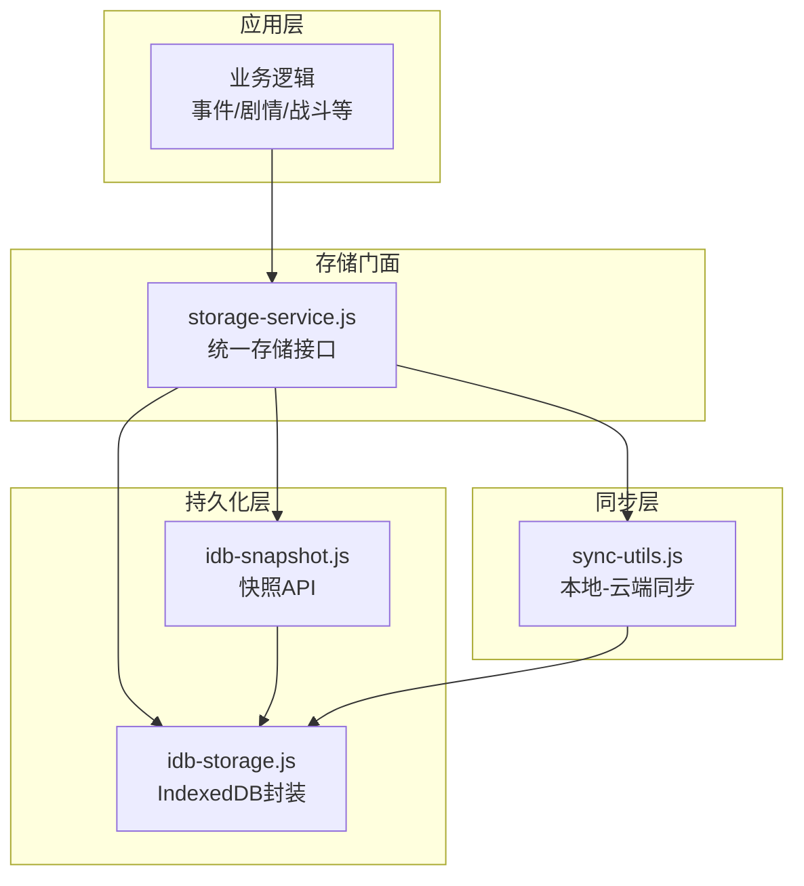
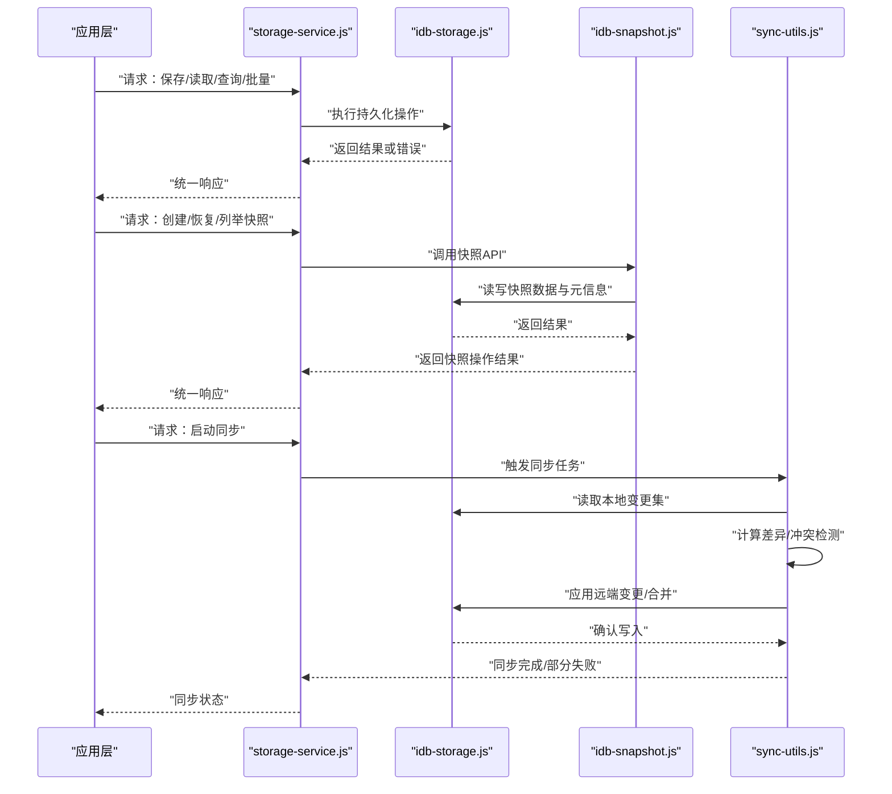
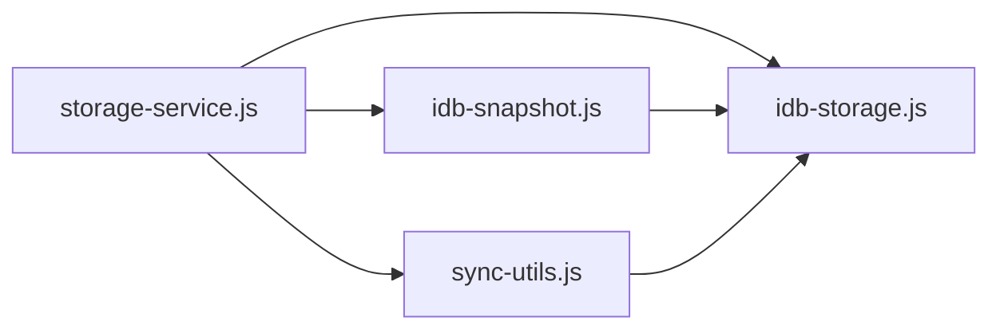
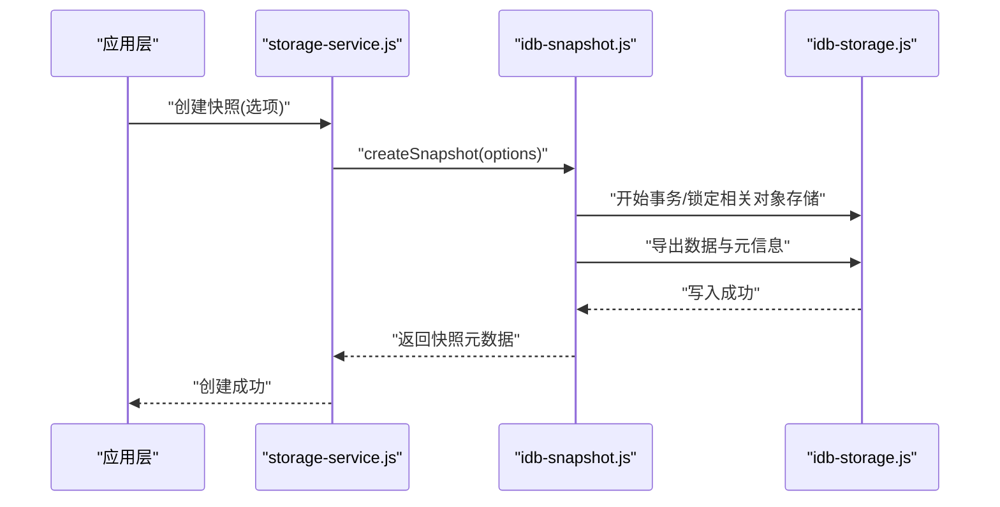
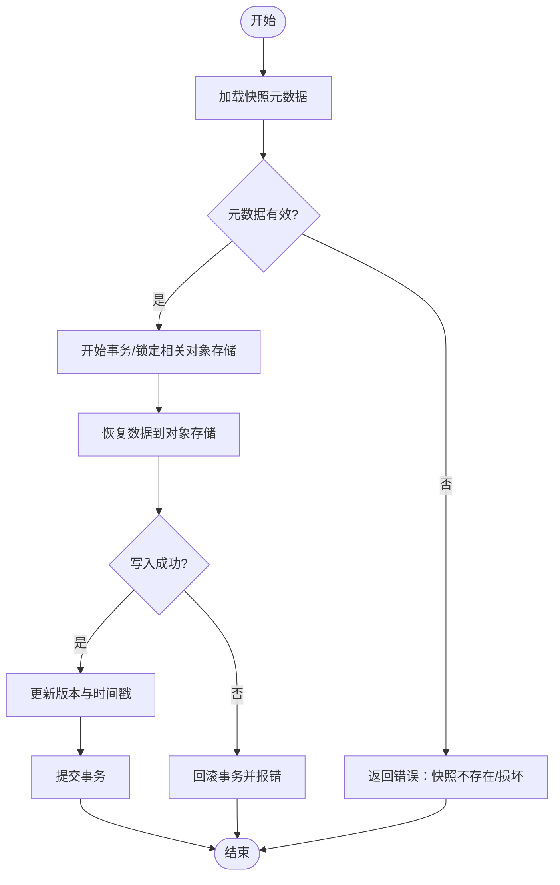
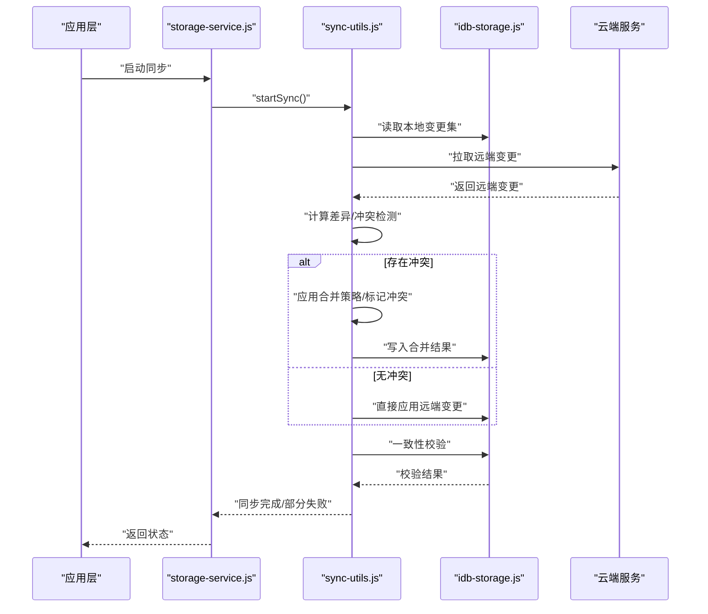

# 存储服务API

<cite>
**本文引用的文件**   
- [storage-service.js](file://module/storage-service.js)
- [idb-storage.js](file://module/idb-storage.js)
- [idb-snapshot.js](file://module/idb-snapshot.js)
- [sync-utils.js](file://module/sync-utils.js)
</cite>

## 目录
1. [简介](#简介)
2. [项目结构](#项目结构)
3. [核心组件](#核心组件)
4. [架构总览](#架构总览)
5. [详细组件分析](#详细组件分析)
6. [依赖关系分析](#依赖关系分析)
7. [性能考虑](#性能考虑)
8. [故障排查指南](#故障排查指南)
9. [结论](#结论)
10. [附录](#附录)

## 简介
本文件为“姬侠传”数据存储系统的API参考文档，聚焦以下四个模块：
- storage-service.js：统一存储接口，提供数据CRUD、查询与批量处理。
- idb-storage.js：IndexedDB封装，提供数据库连接、表操作与事务处理。
- idb-snapshot.js：存档快照API，支持快照创建、恢复与版本管理。
- sync-utils.js：数据同步工具，实现本地与云端同步、冲突解决与一致性保证。

目标读者包括前端开发者、游戏逻辑开发者与维护人员。文档以“从概念到代码”的方式组织，既提供高层架构图，也给出面向实现的调用序列与流程图，并附带错误码、数据类型定义、性能优化建议与最佳实践。

## 项目结构
与存储服务相关的核心文件位于 module 目录下，彼此职责清晰、分层明确：
- storage-service.js：对外暴露的统一存储门面（Facade），屏蔽底层差异，提供稳定API。
- idb-storage.js：基于IndexedDB的持久化层，负责库/表/索引/事务等基础能力。
- idb-snapshot.js：在持久化层之上提供快照能力，用于存档/回滚/版本管理。
- sync-utils.js：在持久化层之上提供同步能力，协调本地与云端状态。

图表来源
- [storage-service.js](file://module/storage-service.js)
- [idb-storage.js](file://module/idb-storage.js)
- [idb-snapshot.js](file://module/idb-snapshot.js)
- [sync-utils.js](file://module/sync-utils.js)

章节来源
- [storage-service.js](file://module/storage-service.js)
- [idb-storage.js](file://module/idb-storage.js)
- [idb-snapshot.js](file://module/idb-snapshot.js)
- [sync-utils.js](file://module/sync-utils.js)

## 核心组件
本节概述四大组件的职责与边界，便于快速定位问题与扩展功能。

- storage-service.js
  - 职责：对外提供统一的存储API；对上层屏蔽底层实现细节；聚合查询、批量操作与错误归一化。
  - 典型能力：增删改查、条件查询、分页/排序、批量写入、事务包装、错误码映射。
- idb-storage.js
  - 职责：封装IndexedDB的打开、对象存储（表）管理、索引、读写事务、并发控制。
  - 典型能力：初始化/升级、单条/多条读写、游标遍历、事务重试、异常捕获。
- idb-snapshot.js
  - 职责：在持久化层之上提供快照能力，支持导出/导入、版本记录、增量/全量策略。
  - 典型能力：创建快照、列出快照、恢复指定快照、删除旧快照、版本元数据维护。
- sync-utils.js
  - 职责：协调本地与云端的数据同步，处理冲突、断点续传、幂等与一致性。
  - 典型能力：拉取远端变更、推送本地变更、合并策略、冲突标记与人工介入、最终一致性校验。

章节来源
- [storage-service.js](file://module/storage-service.js)
- [idb-storage.js](file://module/idb-storage.js)
- [idb-snapshot.js](file://module/idb-snapshot.js)
- [sync-utils.js](file://module/sync-utils.js)

## 架构总览
下图展示从应用层到持久化层与同步层的整体交互路径，以及关键流程的时序。

图表来源
- [storage-service.js](file://module/storage-service.js)
- [idb-storage.js](file://module/idb-storage.js)
- [idb-snapshot.js](file://module/idb-snapshot.js)
- [sync-utils.js](file://module/sync-utils.js)

## 详细组件分析

### storage-service.js：统一存储接口
- 设计要点
  - 门面模式：将底层多实现（如IndexedDB、未来可能的其他后端）抽象为一致API。
  - 错误归一化：将底层异常转换为标准错误码与消息，便于上层统一处理。
  - 批量与事务：对多次写操作进行批处理与事务包装，提升吞吐与一致性。
- 主要能力
  - CRUD：按实体类型进行新增、更新、删除、获取。
  - 查询：条件过滤、分页、排序、计数。
  - 批量：批量插入/更新/删除，支持原子性。
  - 快照：委托给快照模块，提供创建/恢复/列举/删除。
  - 同步：委托给同步模块，提供启动/停止/状态查询。
- 错误处理
  - 统一错误码：例如参数无效、资源不存在、权限不足、网络错误、存储不可用等。
  - 重试策略：对可重试错误（如网络抖动、临时锁竞争）进行指数退避重试。
- 使用建议
  - 优先使用批量接口减少往返。
  - 对关键路径开启事务包装。
  - 对查询尽量使用索引字段，避免全表扫描。

章节来源
- [storage-service.js](file://module/storage-service.js)

### idb-storage.js：IndexedDB封装
- 设计要点
  - 连接池与复用：避免频繁打开/关闭数据库连接。
  - 对象存储（表）与索引：自动建库/升级，声明式索引配置。
  - 事务模型：读/写事务分离，支持嵌套事务语义（通过队列串行化）。
- 主要能力
  - 初始化/升级：根据schema自动创建/迁移对象存储与索引。
  - 单条操作：get/set/delete。
  - 批量操作：putMany/getMany/delMany。
  - 游标遍历：范围查询、前缀匹配、分页游标。
  - 事务与重试：失败自动重试、超时保护。
- 数据结构约定
  - 对象存储名称：采用小写下划线命名，如 game_state、player_profile、scene_log。
  - 主键：建议使用自增或业务唯一键（如 UUID）。
  - 索引：常用查询字段建立索引，避免复合索引过度使用。
- 错误处理
  - 区分浏览器限制（配额、QuotaExceededError）、版本冲突、事务中止等。
  - 提供降级策略：当存储不可用时返回明确错误码，由上层决定行为。

章节来源
- [idb-storage.js](file://module/idb-storage.js)

### idb-snapshot.js：存档快照API
- 设计要点
  - 快照粒度：可按全局存档或按实体集合（如角色、场景、对话历史）组合。
  - 版本管理：每个快照包含时间戳、版本号、摘要哈希、大小等元数据。
  - 增量/全量：支持全量快照与增量快照，结合压缩与去重降低体积。
- 主要能力
  - 创建快照：导出当前状态至独立对象存储，生成元数据。
  - 列举快照：按时间/版本排序，支持分页。
  - 恢复快照：将指定快照数据恢复到当前状态，必要时先清理冲突数据。
  - 删除快照：保留最近N个快照，释放空间。
- 一致性保障
  - 快照创建期间锁定相关对象存储，确保一致性。
  - 恢复时采用事务包裹，失败回滚。
- 错误处理
  - 快照不存在、版本不兼容、空间不足、恢复中断等错误分类与提示。

章节来源
- [idb-snapshot.js](file://module/idb-snapshot.js)

### sync-utils.js：数据同步接口
- 设计要点
  - 双向同步：本地变更推送到云端，云端变更拉取到本地。
  - 冲突检测：基于时间戳、版本号或内容哈希识别冲突。
  - 合并策略：默认“服务端优先”，也可配置“客户端优先”或“手动合并”。
- 主要能力
  - 启动/停止同步：支持定时轮询与长连接两种模式。
  - 增量同步：仅传输变更集，减少带宽与CPU消耗。
  - 幂等与去重：利用唯一键与操作日志避免重复应用。
  - 一致性校验：完成后对比本地与云端摘要，必要时修复不一致。
- 错误处理
  - 网络异常、认证失败、服务端版本不兼容、限流等错误分类与重试策略。
  - 冲突上报：将需要人工处理的冲突项收集，供UI提示或后台仲裁。

章节来源
- [sync-utils.js](file://module/sync-utils.js)

## 依赖关系分析
- 耦合关系
  - storage-service.js 依赖 idb-storage.js、idb-snapshot.js、sync-utils.js，作为门面聚合能力。
  - idb-snapshot.js 与 sync-utils.js 均依赖 idb-storage.js 提供的持久化能力。
- 潜在循环依赖
  - 当前分层清晰，未见循环依赖；若后续引入缓存层需确保单向依赖。
- 外部依赖
  - IndexedDB（浏览器环境）；HTTP/WebSocket（云端同步）。
- 接口契约
  - 所有模块对外暴露Promise风格异步接口，错误通过reject或统一错误对象返回。

图表来源
- [storage-service.js](file://module/storage-service.js)
- [idb-storage.js](file://module/idb-storage.js)
- [idb-snapshot.js](file://module/idb-snapshot.js)
- [sync-utils.js](file://module/sync-utils.js)

章节来源
- [storage-service.js](file://module/storage-service.js)
- [idb-storage.js](file://module/idb-storage.js)
- [idb-snapshot.js](file://module/idb-snapshot.js)
- [sync-utils.js](file://module/sync-utils.js)

## 性能考虑
- 批量与事务
  - 将多次写操作合并为批量写入，并使用事务包裹，减少磁盘I/O与锁竞争。
- 索引与查询
  - 为高频查询字段建立索引；避免在索引列上使用函数导致索引失效。
  - 分页使用游标而非偏移，提高大数据集遍历性能。
- 快照优化
  - 增量快照配合去重与压缩，降低体积与IO压力。
  - 定期清理旧快照，避免存储空间膨胀。
- 同步优化
  - 增量同步与差量合并，减少网络传输与CPU计算。
  - 合理设置重试退避与超时，避免雪崩。
- 内存与并发
  - 大对象分块处理，避免一次性加载过多数据。
  - 控制并发事务数量，防止IndexedDB内部队列拥塞。

[本节为通用性能指导，无需特定文件引用]

## 故障排查指南
- 常见问题
  - 存储不可用：检查浏览器是否支持IndexedDB、是否被禁用或配额不足。
  - 版本冲突：数据库schema升级后未正确迁移，需检查升级脚本。
  - 同步失败：网络异常、鉴权过期、服务端版本不兼容。
  - 快照损坏：恢复失败或数据不一致，检查快照元数据与完整性校验。
- 诊断步骤
  - 查看错误码与堆栈，定位具体模块。
  - 检查对象存储是否存在与索引是否正确。
  - 验证快照元数据与版本兼容性。
  - 观察同步日志，确认冲突项与重试次数。
- 恢复策略
  - 使用最近可用快照进行恢复。
  - 重新触发同步，必要时清空本地变更集后全量拉取。

章节来源
- [storage-service.js](file://module/storage-service.js)
- [idb-storage.js](file://module/idb-storage.js)
- [idb-snapshot.js](file://module/idb-snapshot.js)
- [sync-utils.js](file://module/sync-utils.js)

## 结论
本存储服务通过门面模式整合持久化、快照与同步三大能力，形成清晰的分层架构。上层只需调用统一接口即可完成复杂的数据操作。建议在开发中遵循批量与事务原则、合理使用索引、谨慎管理快照与同步策略，以获得稳定且高性能的数据体验。

[本节为总结性内容，无需特定文件引用]

## 附录

### 接口规范与数据类型定义
- 统一错误码（示例）
  - PARAM_INVALID：参数无效
  - RESOURCE_NOT_FOUND：资源不存在
  - PERMISSION_DENIED：权限不足
  - STORAGE_UNAVAILABLE：存储不可用
  - NETWORK_ERROR：网络错误
  - QUOTA_EXCEEDED：配额超限
  - VERSION_CONFLICT：版本冲突
  - SNAPSHOT_NOT_FOUND：快照不存在
  - SNAPSHOT_CORRUPTED：快照损坏
  - SYNC_FAILED：同步失败
  - CONFLICT_DETECTED：检测到冲突
- 通用响应结构
  - { code, message, data }
  - code：错误码
  - message：人类可读的错误描述
  - data：成功时的数据负载
- 常见实体类型（示例）
  - game_state：全局游戏状态
  - player_profile：玩家档案
  - scene_log：场景日志
  - npc_relation：NPC关系
  - inventory：背包物品
- 查询参数（示例）
  - filter：条件对象
  - sort：排序规则
  - page：页码
  - size：每页大小
  - cursor：游标（用于分页）
- 快照元数据（示例）
  - id：快照标识
  - version：版本号
  - timestamp：创建时间
  - summary：摘要哈希
  - size：快照大小
  - tags：标签集合

[本节为通用规范说明，无需特定文件引用]

### 关键流程时序图（示例）

#### 创建快照流程

图表来源
- [storage-service.js](file://module/storage-service.js)
- [idb-snapshot.js](file://module/idb-snapshot.js)
- [idb-storage.js](file://module/idb-storage.js)

#### 恢复快照流程

图表来源
- [storage-service.js](file://module/storage-service.js)
- [idb-snapshot.js](file://module/idb-snapshot.js)
- [idb-storage.js](file://module/idb-storage.js)

#### 同步流程（含冲突处理）

图表来源
- [storage-service.js](file://module/storage-service.js)
- [sync-utils.js](file://module/sync-utils.js)
- [idb-storage.js](file://module/idb-storage.js)