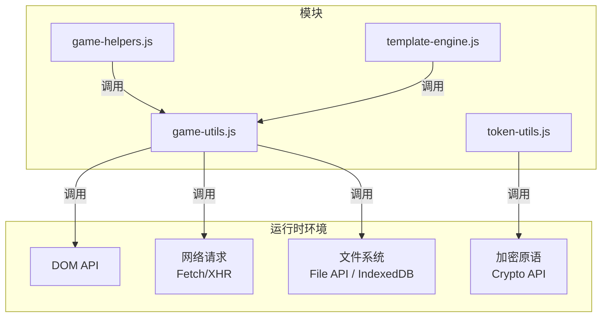
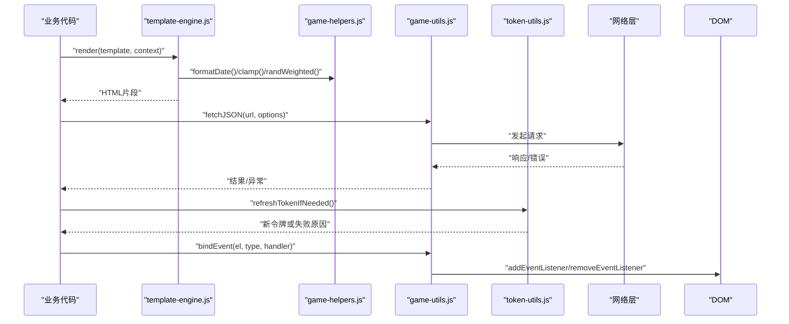
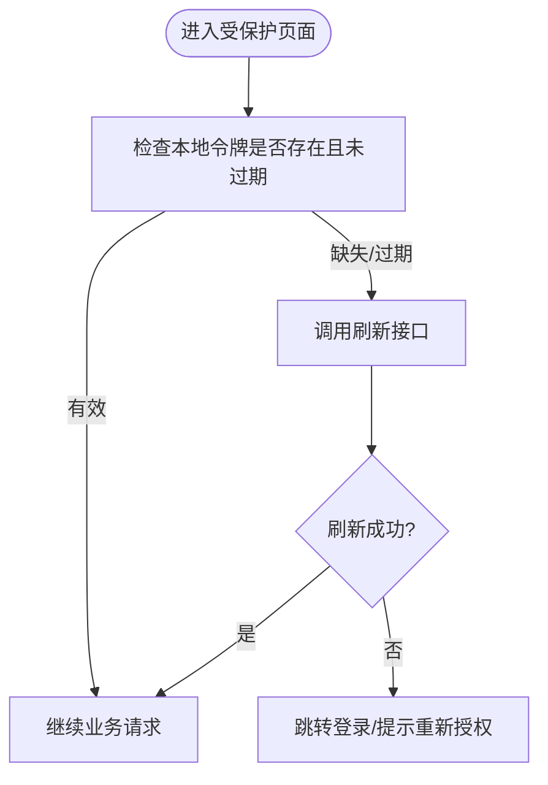
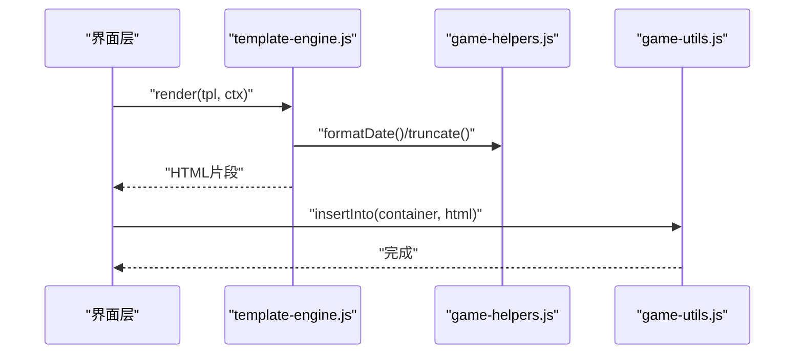
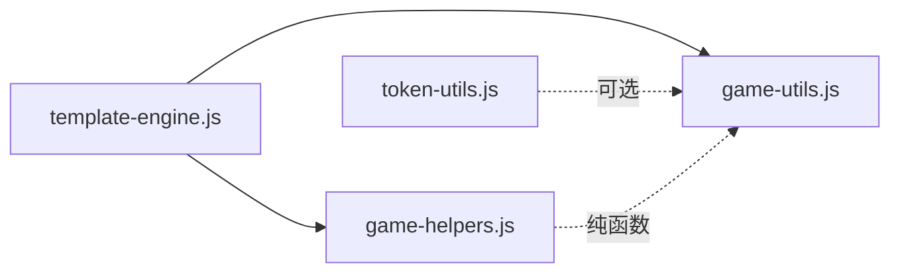

# 工具函数API

<cite>
**本文引用的文件**   
- [game-helpers.js](file://module/game-helpers.js)
- [game-utils.js](file://module/game-utils.js)
- [token-utils.js](file://module/token-utils.js)
- [template-engine.js](file://module/template-engine.js)
</cite>

## 目录
1. [简介](#简介)
2. [项目结构](#项目结构)
3. [核心组件](#核心组件)
4. [架构总览](#架构总览)
5. [详细组件分析](#详细组件分析)
6. [依赖关系分析](#依赖关系分析)
7. [性能考虑](#性能考虑)
8. [故障排查指南](#故障排查指南)
9. [结论](#结论)
10. [附录](#附录)

## 简介
本文件为姬侠传游戏的通用工具函数API文档，聚焦以下四个模块：
- game-helpers.js：游戏辅助函数（日期时间处理、字符串格式化、数学计算与随机数生成）
- game-utils.js：通用工具方法（DOM操作、事件处理、网络请求与文件操作）
- token-utils.js：令牌管理API（Token生成、验证与刷新机制）
- template-engine.js：模板引擎接口（模板渲染、变量替换与条件逻辑）

文档提供完整的方法列表、参数说明、返回值类型与使用示例路径，并包含注意事项与性能优化建议。

## 项目结构
上述四个模块均位于 module 目录下，彼此职责清晰、边界明确：
- game-helpers.js：纯函数集合，专注数据与数值处理
- game-utils.js：浏览器能力封装，统一交互与I/O
- token-utils.js：安全相关令牌生命周期管理
- template-engine.js：轻量模板渲染与变量注入

图表来源
- [game-helpers.js](file://module/game-helpers.js)
- [game-utils.js](file://module/game-utils.js)
- [token-utils.js](file://module/token-utils.js)
- [template-engine.js](file://module/template-engine.js)

章节来源
- [game-helpers.js](file://module/game-helpers.js)
- [game-utils.js](file://module/game-utils.js)
- [token-utils.js](file://module/token-utils.js)
- [template-engine.js](file://module/template-engine.js)

## 核心组件
本节概述各模块的职责与对外暴露的API类别，便于快速定位所需功能。

- game-helpers.js
  - 日期时间：本地化格式化、时区转换、相对时间描述等
  - 字符串：截断、转义、富文本清理、编码/解码
  - 数学：四舍五入、范围限制、概率权重计算
  - 随机：均匀分布、加权随机、洗牌算法

- game-utils.js
  - DOM：元素查找、属性读写、样式切换、节点克隆与插入
  - 事件：监听器注册/移除、冒泡控制、节流防抖
  - 网络：GET/POST封装、超时重试、错误分类
  - 文件：读取/写入、二进制与文本、进度回调

- token-utils.js
  - 生成：基于时间戳与随机源的令牌构造
  - 验证：签名校验、过期检查、格式规范
  - 刷新：自动续期策略、降级回退

- template-engine.js
  - 渲染：模板解析与输出
  - 变量：上下文注入、默认值、嵌套访问
  - 条件：分支渲染、循环展开

章节来源
- [game-helpers.js](file://module/game-helpers.js)
- [game-utils.js](file://module/game-utils.js)
- [token-utils.js](file://module/token-utils.js)
- [template-engine.js](file://module/template-engine.js)

## 架构总览
下图展示四个模块在运行时的协作关系与外部依赖。

图表来源
- [template-engine.js](file://module/template-engine.js)
- [game-helpers.js](file://module/game-helpers.js)
- [game-utils.js](file://module/game-utils.js)
- [token-utils.js](file://module/token-utils.js)

## 详细组件分析

### game-helpers.js：游戏辅助函数
- 日期时间处理
  - 常用方法：本地化格式化、相对时间、时区偏移、时间差计算
  - 输入：时间戳/ISO字符串/Date对象；可选locale、格式串
  - 输出：格式化后的字符串或数值差
  - 注意：跨时区场景需显式传入时区信息；避免频繁创建Date实例

- 字符串格式化
  - 常用方法：截断与省略号、HTML转义、富文本清洗、大小写与全半角转换
  - 输入：原始字符串、长度阈值、是否保留换行
  - 输出：安全可展示的字符串
  - 注意：对不可信内容务必先转义再插入DOM

- 数学计算
  - 常用方法：四舍五入到指定小数位、区间裁剪、百分比换算、概率权重采样
  - 输入：数值、上下界、精度
  - 输出：规范化后的数值或布尔判定
  - 注意：浮点误差需用epsilon比较；大数组加权采样应预归一化

- 随机数生成
  - 常用方法：均匀随机、加权随机、序列洗牌、去重抽样
  - 输入：范围、权重数组、目标数量
  - 输出：随机数/索引/子集
  - 注意：保证种子可控以便复现；避免在热路径重复分配内存

使用示例路径
- [日期时间示例](file://module/game-helpers.js)
- [字符串示例](file://module/game-helpers.js)
- [数学与随机示例](file://module/game-helpers.js)

章节来源
- [game-helpers.js](file://module/game-helpers.js)

### game-utils.js：通用工具方法
- DOM操作
  - 常用方法：按选择器获取、批量设置属性/样式、节点插入/删除、克隆与缓存
  - 输入：选择器/节点、键值对配置
  - 输出：节点引用或操作结果
  - 注意：批量更新时使用DocumentFragment减少回流

- 事件处理
  - 常用方法：绑定/解绑、事件委托、节流/防抖、一次性触发
  - 输入：目标节点、事件名、处理器、选项
  - 输出：取消函数或状态标记
  - 注意：及时移除监听器防止内存泄漏；长任务用requestIdleCallback

- 网络请求
  - 常用方法：GET/POST封装、超时与重试、错误分类、CORS代理
  - 输入：URL、请求体、超时、重试次数
  - 输出：Promise结果或错误对象
  - 注意：敏感请求携带令牌；失败指数退避

- 文件操作
  - 常用方法：读取文本/二进制、下载保存、进度回调、类型检测
  - 输入：文件对象/路径、模式、回调
  - 输出：数据或错误
  - 注意：大文件分块读取；严格校验MIME类型

使用示例路径
- [DOM示例](file://module/game-utils.js)
- [事件示例](file://module/game-utils.js)
- [网络示例](file://module/game-utils.js)
- [文件示例](file://module/game-utils.js)

章节来源
- [game-utils.js](file://module/game-utils.js)

### token-utils.js：令牌管理API
- Token生成
  - 输入：用户标识、有效期、附加声明
  - 输出：令牌字符串
  - 注意：结合时间戳与随机源；避免硬编码密钥

- Token验证
  - 输入：待验令牌、期望字段、当前时间
  - 输出：校验结果与载荷
  - 注意：同时检查签名与过期；拒绝空/非法格式

- Token刷新
  - 输入：旧令牌、刷新策略
  - 输出：新令牌或失败原因
  - 注意：幂等刷新；失败回退至登录流程

图表来源
- [token-utils.js](file://module/token-utils.js)

使用示例路径
- [生成与验证示例](file://module/token-utils.js)
- [刷新流程示例](file://module/token-utils.js)

章节来源
- [token-utils.js](file://module/token-utils.js)

### template-engine.js：模板引擎接口
- 模板渲染
  - 输入：模板字符串、上下文对象
  - 输出：渲染后的HTML片段
  - 注意：对动态内容进行转义，避免XSS

- 变量替换
  - 支持：简单键、嵌套访问、默认值、空值合并
  - 输入：模板表达式、上下文
  - 输出：替换后的片段
  - 注意：复杂表达式应在JS侧预处理

- 条件逻辑
  - 支持：if/else、循环遍历、局部变量
  - 输入：模板语法、数据源
  - 输出：最终片段
  - 注意：避免深层嵌套导致性能下降

图表来源
- [template-engine.js](file://module/template-engine.js)
- [game-helpers.js](file://module/game-helpers.js)
- [game-utils.js](file://module/game-utils.js)

使用示例路径
- [基础渲染示例](file://module/template-engine.js)
- [变量与条件示例](file://module/template-engine.js)

章节来源
- [template-engine.js](file://module/template-engine.js)

## 依赖关系分析
- 内聚性
  - game-helpers.js：高内聚的数据与数值处理，无副作用
  - game-utils.js：中内聚的浏览器能力封装，关注I/O与交互
  - token-utils.js：高内聚的安全令牌生命周期
  - template-engine.js：中内聚的模板解析与渲染

- 耦合度
  - template-engine.js 依赖 game-helpers.js 进行数据格式化
  - game-utils.js 作为基础设施被其他模块复用
  - token-utils.js 独立于渲染与I/O，仅与安全相关

图表来源
- [template-engine.js](file://module/template-engine.js)
- [game-helpers.js](file://module/game-helpers.js)
- [game-utils.js](file://module/game-utils.js)
- [token-utils.js](file://module/token-utils.js)

章节来源
- [template-engine.js](file://module/template-engine.js)
- [game-helpers.js](file://module/game-helpers.js)
- [game-utils.js](file://module/game-utils.js)
- [token-utils.js](file://module/token-utils.js)

## 性能考虑
- 避免在热路径重复创建对象与正则，尽量复用实例
- 批量DOM更新使用DocumentFragment或批处理API
- 网络请求增加重试与超时，采用指数退避与熔断
- 模板渲染前对数据进行预处理，减少模板内复杂逻辑
- 随机与加权采样预先归一化权重，避免每次O(n)归一化
- 事件监听器及时移除，防止内存泄漏
- 大文件读取分块处理，配合进度回调提升体验

## 故障排查指南
- 网络请求失败
  - 检查CORS与代理配置
  - 查看错误分类与重试计数
  - 确认令牌是否过期并触发刷新

- 模板渲染异常
  - 确认变量存在性与默认值
  - 检查表达式复杂度与嵌套层级
  - 对动态内容执行转义

- 令牌问题
  - 校验签名与过期时间
  - 观察刷新失败的回退路径
  - 记录关键日志但不泄露敏感信息

- DOM与事件
  - 确认节点存在性与作用域
  - 检查事件冒泡与捕获顺序
  - 确保监听器正确解绑

章节来源
- [game-utils.js](file://module/game-utils.js)
- [template-engine.js](file://module/template-engine.js)
- [token-utils.js](file://module/token-utils.js)

## 结论
这四个模块构成了姬侠传前端的基础设施层：
- game-helpers.js提供稳定可靠的数值与文本处理能力
- game-utils.js屏蔽浏览器差异，统一交互与I/O
- token-utils.js保障会话安全与可用性
- template-engine.js简化视图拼装与数据绑定

遵循本文档的使用建议与性能优化实践，可在保证可维护性的同时获得良好的用户体验。

## 附录
- 术语
  - 令牌：用于鉴权的短期凭证
  - 模板：带占位符与条件的文本片段
  - 节流/防抖：控制高频事件触发的策略
- 参考路径
  - [game-helpers.js](file://module/game-helpers.js)
  - [game-utils.js](file://module/game-utils.js)
  - [token-utils.js](file://module/token-utils.js)
  - [template-engine.js](file://module/template-engine.js)