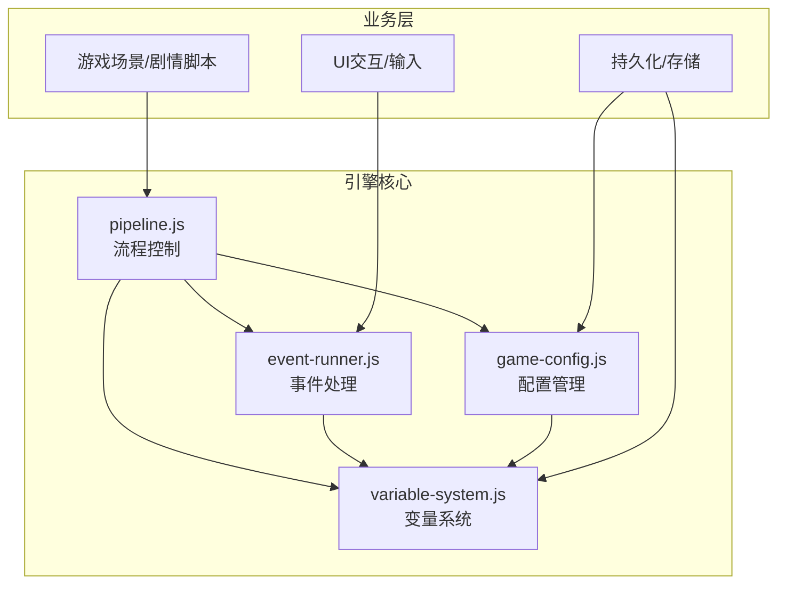
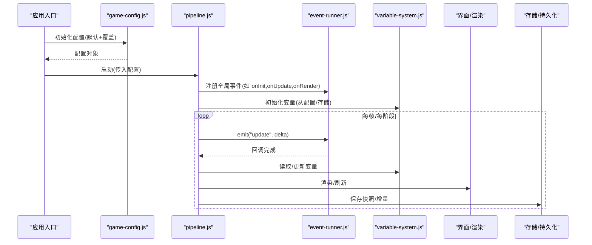
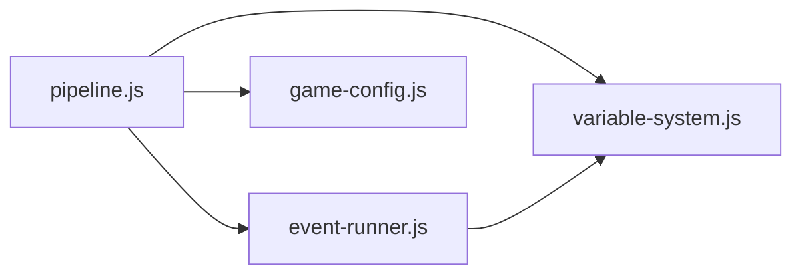
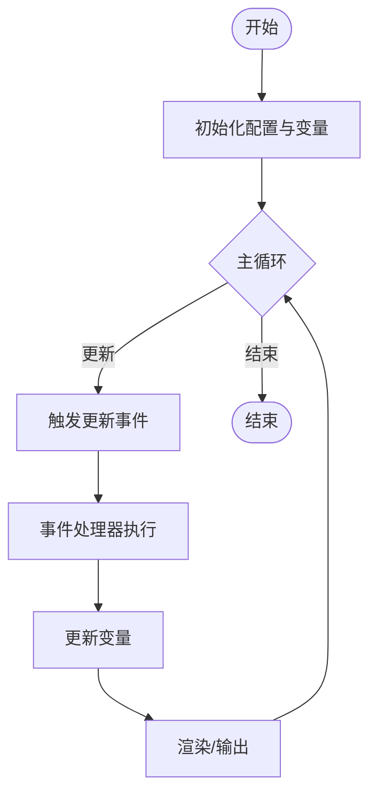

# 游戏引擎API

<cite>
**本文引用的文件**   
- [pipeline.js](file://module/pipeline.js)
- [event-runner.js](file://module/event-runner.js)
- [game-config.js](file://module/game-config.js)
- [variable-system.js](file://module/variable-system.js)
</cite>

## 目录
1. [简介](#简介)
2. [项目结构](#项目结构)
3. [核心组件](#核心组件)
4. [架构总览](#架构总览)
5. [详细组件分析](#详细组件分析)
6. [依赖分析](#依赖分析)
7. [性能考虑](#性能考虑)
8. [故障排查指南](#故障排查指南)
9. [结论](#结论)
10. [附录](#附录)

## 简介
本文件为姬侠传游戏引擎的核心API文档，聚焦以下四个关键模块：
- pipeline.js：游戏流程控制接口，涵盖游戏状态管理、事件驱动机制与配置系统。
- event-runner.js：事件处理API，包括事件注册、触发与监听机制。
- game-config.js：配置管理接口，支持参数设置与动态加载。
- variable-system.js：变量系统API，提供变量定义、获取、更新与生命周期管理。

文档以“方法签名—参数类型—返回值—使用示例—错误处理”的结构化方式呈现，帮助开发者快速集成与扩展。

## 项目结构
本项目的核心逻辑集中在 module 目录下，上述四个文件分别承担流程编排、事件调度、配置管理与变量管理的职责。它们通过清晰的接口边界相互协作，形成“配置驱动 + 事件驱动 + 变量驱动”的引擎骨架。

图表来源 
- [pipeline.js](file://module/pipeline.js)
- [event-runner.js](file://module/event-runner.js)
- [game-config.js](file://module/game-config.js)
- [variable-system.js](file://module/variable-system.js)

章节来源
- [pipeline.js](file://module/pipeline.js)
- [event-runner.js](file://module/event-runner.js)
- [game-config.js](file://module/game-config.js)
- [variable-system.js](file://module/variable-system.js)

## 核心组件
本节对四个核心模块的职责与对外API进行概述，后续章节将给出更详细的接口说明与调用时序图。

- pipeline.js
  - 负责游戏主循环、阶段切换、全局状态维护、事件总线接入与配置初始化。
  - 典型能力：启动/暂停/恢复、阶段推进、事件订阅与派发、配置热更新。
- event-runner.js
  - 实现事件注册、触发、监听与优先级调度，支持异步回调与错误隔离。
  - 典型能力：on/off/emit、批量触发、条件过滤、重试与超时。
- game-config.js
  - 集中管理游戏配置项，支持默认值、覆盖、校验与动态加载。
  - 典型能力：get/set、合并策略、版本兼容、远程/本地加载。
- variable-system.js
  - 提供命名空间化的变量存取、类型约束、变更通知与生命周期钩子。
  - 典型能力：define/get/set/update、作用域、快照/回滚、监听器。

章节来源
- [pipeline.js](file://module/pipeline.js)
- [event-runner.js](file://module/event-runner.js)
- [game-config.js](file://module/game-config.js)
- [variable-system.js](file://module/variable-system.js)

## 架构总览
下图展示了引擎在运行时的主要交互路径：配置初始化后，流程控制器按阶段驱动事件流，事件处理器根据变量状态执行动作并更新变量，最终反馈到UI或持久化层。

图表来源 
- [pipeline.js](file://module/pipeline.js)
- [event-runner.js](file://module/event-runner.js)
- [game-config.js](file://module/game-config.js)
- [variable-system.js](file://module/variable-system.js)

## 详细组件分析

### pipeline.js：游戏流程控制接口
- 职责
  - 管理游戏生命周期（初始化、运行、暂停、恢复、销毁）。
  - 维护全局状态机（如菜单、战斗、对话、过场等）。
  - 接入事件总线，协调事件驱动的子系统。
  - 加载并合并配置，必要时触发配置热更新。
- 关键API（概念性描述）
  - 启动/停止
    - 启动：接收配置对象，初始化变量系统与事件总线，进入主循环。
    - 停止：清理定时器、释放资源、保存状态。
  - 状态管理
    - 设置/查询当前阶段；阶段切换时触发前后钩子。
  - 事件驱动
    - 订阅/取消订阅引擎级事件；支持优先级与一次性监听。
  - 配置系统
    - 读取/写入配置；支持按需重载与差异合并。
- 使用示例（步骤）
  - 初始化配置并调用启动。
  - 在相应阶段注册事件监听。
  - 在事件中读写变量并触发UI更新。
  - 退出前调用停止以释放资源。
- 错误处理
  - 非法阶段切换抛出明确异常。
  - 事件回调异常被捕获并上报，不影响主循环。
  - 配置加载失败回退到默认值并记录日志。

章节来源
- [pipeline.js](file://module/pipeline.js)

### event-runner.js：事件处理API
- 职责
  - 提供统一的事件注册、触发与监听机制。
  - 支持异步回调、错误隔离、优先级与条件过滤。
- 关键API（概念性描述）
  - 注册监听
    - on(event, handler, options?)：注册事件处理器，支持优先级、一次性、条件函数。
  - 触发事件
    - emit(event, payload?, context?)：同步/异步触发，返回Promise以便等待所有处理器完成。
  - 移除监听
    - off(event, handler?)：精确移除或按事件名批量移除。
  - 高级特性
    - once(event, handler)：一次性监听。
    - priority(event, handler, level)：按优先级排序执行。
    - filter(event, predicate)：条件过滤处理器。
- 使用示例（步骤）
  - 注册“玩家移动”事件处理器。
  - 在移动逻辑中触发事件并携带坐标。
  - 处理器内更新变量并请求UI重绘。
- 错误处理
  - 单个处理器抛错不会中断其他处理器执行。
  - 提供错误回调或全局错误监听用于调试。

章节来源
- [event-runner.js](file://module/event-runner.js)

### game-config.js：配置管理接口
- 职责
  - 统一管理游戏配置，提供默认值、覆盖、校验与动态加载。
- 关键API（概念性描述）
  - 基础操作
    - get(key)：读取配置项。
    - set(key, value)：设置配置项，支持链式调用。
    - merge(partial)：合并部分配置，保留未覆盖项。
  - 动态加载
    - load(source)：从本地/远程源加载配置并合并。
    - reload()：重新加载并应用差异。
  - 校验与版本
    - validate(schema)：按Schema校验配置。
    - migrate(version)：迁移旧版配置到新版。
- 使用示例（步骤）
  - 定义默认配置。
  - 加载用户覆盖配置。
  - 校验通过后应用到引擎。
- 错误处理
  - 键不存在时返回默认值或抛出可捕获异常（取决于模式）。
  - 类型不匹配时抛出明确错误并提供修复建议。
  - 网络加载失败时降级到本地缓存或默认值。

章节来源
- [game-config.js](file://module/game-config.js)

### variable-system.js：变量系统API
- 职责
  - 提供命名空间化的变量存取、类型约束、变更通知与生命周期钩子。
- 关键API（概念性描述）
  - 定义与范围
    - define(namespace, schema)：定义变量及其类型、默认值、作用域。
    - scope(name)：创建/切换到命名空间。
  - 存取与更新
    - get(path)：按路径读取变量。
    - set(path, value)：按路径设置变量，触发变更通知。
    - update(path, updater)：基于旧值进行原子更新。
  - 生命周期与监听
    - onChange(path, listener)：监听变量变化。
    - snapshot()/restore(snapshot)：快照与回滚。
    - destroy()：销毁变量实例并释放监听。
- 使用示例（步骤）
  - 定义角色属性与场景变量。
  - 在事件处理器中读取/更新变量。
  - 监听关键变量变化以驱动UI或AI决策。
- 错误处理
  - 访问未定义路径时抛出明确异常或返回占位值。
  - 类型不匹配时拒绝写入并记录错误。
  - 循环引用或深度过大时限制递归并报错。

章节来源
- [variable-system.js](file://module/variable-system.js)

## 依赖分析
- 耦合关系
  - pipeline.js 依赖 event-runner.js、game-config.js、variable-system.js。
  - event-runner.js 依赖 variable-system.js（用于事件上下文与状态判断）。
  - game-config.js 与 variable-system.js 相对独立，但可通过 pipeline.js 协同。
- 外部集成点
  - UI/渲染：由 pipeline.js 在阶段推进时触发。
  - 存储/持久化：由 pipeline.js 在关键节点保存快照。
- 潜在循环依赖
  - 通过事件总线解耦，避免直接互相引用导致的循环依赖。

图表来源 
- [pipeline.js](file://module/pipeline.js)
- [event-runner.js](file://module/event-runner.js)
- [game-config.js](file://module/game-config.js)
- [variable-system.js](file://module/variable-system.js)

章节来源
- [pipeline.js](file://module/pipeline.js)
- [event-runner.js](file://module/event-runner.js)
- [game-config.js](file://module/game-config.js)
- [variable-system.js](file://module/variable-system.js)

## 性能考虑
- 事件分发
  - 使用优先级队列减少不必要的处理器执行。
  - 批量触发事件以减少主线程阻塞。
- 配置加载
  - 懒加载与增量合并，避免全量解析。
  - 缓存已加载的配置与校验结果。
- 变量系统
  - 路径解析采用哈希映射，提升查找效率。
  - 变更通知采用观察者模式，避免轮询。
- 主循环
  - 分帧任务拆分，保证渲染帧率稳定。
  - 长耗时任务放入后台队列或Web Worker（若可用）。

## 故障排查指南
- 常见问题
  - 事件未触发：检查是否重复移除监听、事件名是否一致、优先级是否导致顺序问题。
  - 配置未生效：确认加载顺序与覆盖策略，检查校验失败原因。
  - 变量读取为空：确认命名空间与作用域是否正确，是否存在异步赋值未完成。
- 定位手段
  - 启用事件追踪日志，记录事件名、参数与处理器执行时间。
  - 输出配置差异与变量快照，对比期望与实际值。
  - 在关键阶段插入断点，观察状态机流转。

章节来源
- [pipeline.js](file://module/pipeline.js)
- [event-runner.js](file://module/event-runner.js)
- [game-config.js](file://module/game-config.js)
- [variable-system.js](file://module/variable-system.js)

## 结论
本引擎以 pipeline.js 为核心编排器，结合 event-runner.js 的事件驱动、game-config.js 的配置管理与 variable-system.js 的变量系统，形成了高内聚、低耦合的可扩展架构。通过统一的API与严格的错误处理，开发者可以高效地构建复杂的游戏逻辑与交互体验。

## 附录
- 最佳实践
  - 将业务逻辑封装为事件处理器，保持与流程控制解耦。
  - 使用变量系统的命名空间组织数据，避免全局污染。
  - 配置项尽量提供默认值与校验规则，增强鲁棒性。
- 参考流程图（概念）
