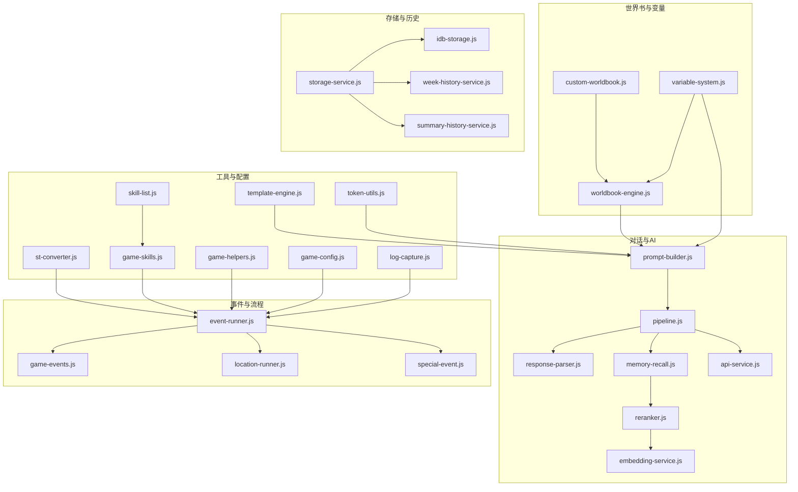
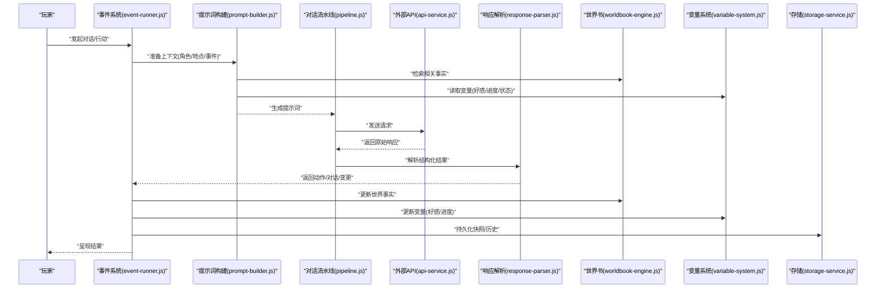
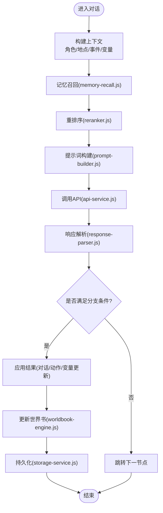
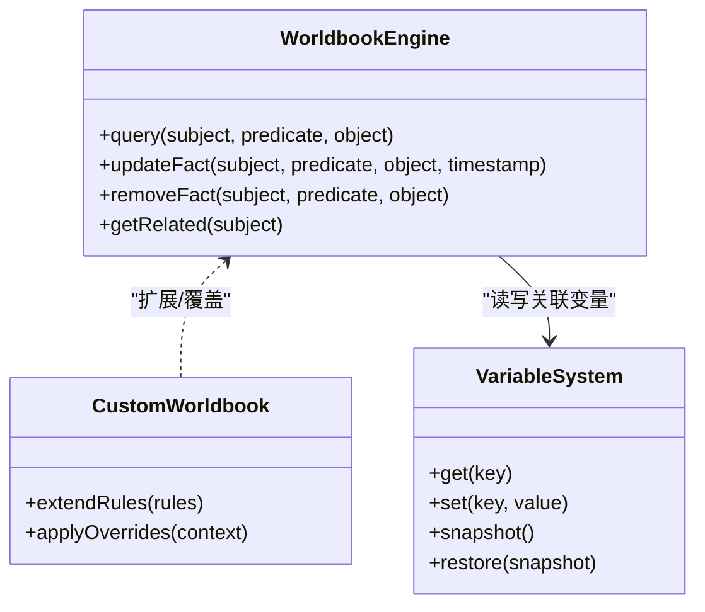
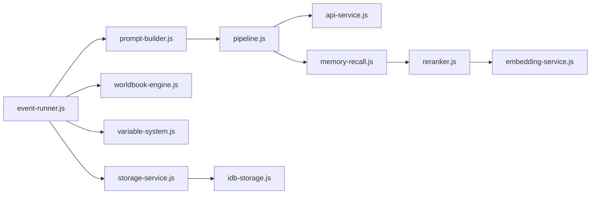

# NPC与角色系统

<cite>
**本文引用的文件**   
- [prompt-data-npc.js](file://module/prompt-data-npc.js)
- [worldbook-engine.js](file://module/worldbook-engine.js)
- [custom-worldbook.js](file://module/custom-worldbook.js)
- [variable-system.js](file://module/variable-system.js)
- [event-runner.js](file://module/event-runner.js)
- [game-events.js](file://module/game-events.js)
- [pipeline.js](file://module/pipeline.js)
- [prompt-builder.js](file://module/prompt-builder.js)
- [response-parser.js](file://module/response-parser.js)
- [memory-recall.js](file://module/memory-recall.js)
- [reranker.js](file://module/reranker.js)
- [storage-service.js](file://module/storage-service.js)
- [idb-storage.js](file://module/idb-storage.js)
- [week-history-service.js](file://module/week-history-service.js)
- [summary-history-service.js](file://module/summary-history-service.js)
- [template-engine.js](file://module/template-engine.js)
- [token-utils.js](file://module/token-utils.js)
- [api-service.js](file://module/api-service.js)
- [embedding-service.js](file://module/embedding-service.js)
- [sync-utils.js](file://module/sync-utils.js)
- [st-converter.js](file://module/st-converter.js)
- [location-runner.js](file://module/location-runner.js)
- [special-event.js](file://module/special-event.js)
- [skill-list.js](file://module/skill-list.js)
- [game-skills.js](file://module/game-skills.js)
- [game-helpers.js](file://module/game-helpers.js)
- [game-config.js](file://module/game-config.js)
- [log-capture.js](file://module/log-capture.js)
- [030NPC唐沐梨.txt](file://char_card_information/030NPC唐沐梨.txt)
- [030NPC安慕.txt](file://char_card_information/030NPC安慕.txt)
- [030NPC施延年.txt](file://char_card_information/030NPC施延年.txt)
- [030NPC玄天青.txt](file://char_card_information/030NPC玄天青.txt)
- [040主角属性.txt](file://char_card_information/040主角属性.txt)
- [110格式规范_精简版.txt](file://char_card_information/110格式规范_精简版.txt)
- [200COT思考引导 - 鲸鱼版.txt](file://char_card_information/200COT思考引导 - 鲸鱼版.txt)
- [200COT思考引导.txt](file://char_card_information/200COT思考引导.txt)
</cite>

## 目录
1. [引言](#引言)
2. [项目结构](#项目结构)
3. [核心组件](#核心组件)
4. [架构总览](#架构总览)
5. [详细组件分析](#详细组件分析)
6. [依赖分析](#依赖分析)
7. [性能考虑](#性能考虑)
8. [故障排查指南](#故障排查指南)
9. [结论](#结论)
10. [附录](#附录)

## 引言
本技术文档聚焦姬侠传的NPC与角色系统，围绕以下目标展开：
- 解释NPC角色的数据结构设计与属性管理系统
- 阐述对话系统的实现原理：对话树构建、AI对话生成、好感度计算等
- 详细说明角色属性系统：基础属性、成长系统、装备系统等机制
- 解释世界书（Worldbook）系统在NPC行为控制中的作用
- 提供新NPC添加与自定义对话逻辑的开发指南
- 解析角色关系网络与剧情推进机制的实现细节

## 项目结构
本项目采用模块化前端架构，核心逻辑集中在 module 目录下，NPC与角色相关能力由多个子系统协作完成：
- prompt-data-npc.js：NPC提示词数据组装与模板化
- worldbook-engine.js / custom-worldbook.js：世界书引擎与扩展
- variable-system.js：全局变量与状态管理
- event-runner.js / game-events.js：事件驱动与流程编排
- pipeline.js / prompt-builder.js / response-parser.js：AI对话流水线
- memory-recall.js / reranker.js：记忆召回与重排序
- storage-service.js / idb-storage.js / week-history-service.js / summary-history-service.js：持久化与历史摘要
- template-engine.js / token-utils.js：模板渲染与Token统计
- api-service.js / embedding-service.js / sync-utils.js：外部API与向量化检索
- st-converter.js / location-runner.js / special-event.js / skill-list.js / game-skills.js / game-helpers.js / game-config.js / log-capture.js：辅助与运行时工具

图表来源
- [prompt-builder.js](file://module/prompt-builder.js)
- [pipeline.js](file://module/pipeline.js)
- [response-parser.js](file://module/response-parser.js)
- [memory-recall.js](file://module/memory-recall.js)
- [reranker.js](file://module/reranker.js)
- [api-service.js](file://module/api-service.js)
- [embedding-service.js](file://module/embedding-service.js)
- [worldbook-engine.js](file://module/worldbook-engine.js)
- [custom-worldbook.js](file://module/custom-worldbook.js)
- [variable-system.js](file://module/variable-system.js)
- [event-runner.js](file://module/event-runner.js)
- [game-events.js](file://module/game-events.js)
- [location-runner.js](file://module/location-runner.js)
- [special-event.js](file://module/special-event.js)
- [storage-service.js](file://module/storage-service.js)
- [idb-storage.js](file://module/idb-storage.js)
- [week-history-service.js](file://module/week-history-service.js)
- [summary-history-service.js](file://module/summary-history-service.js)
- [template-engine.js](file://module/template-engine.js)
- [token-utils.js](file://module/token-utils.js)
- [st-converter.js](file://module/st-converter.js)
- [skill-list.js](file://module/skill-list.js)
- [game-skills.js](file://module/game-skills.js)
- [game-helpers.js](file://module/game-helpers.js)
- [game-config.js](file://module/game-config.js)
- [log-capture.js](file://module/log-capture.js)

章节来源
- [prompt-data-npc.js](file://module/prompt-data-npc.js)
- [worldbook-engine.js](file://module/worldbook-engine.js)
- [custom-worldbook.js](file://module/custom-worldbook.js)
- [variable-system.js](file://module/variable-system.js)
- [event-runner.js](file://module/event-runner.js)
- [game-events.js](file://module/game-events.js)
- [pipeline.js](file://module/pipeline.js)
- [prompt-builder.js](file://module/prompt-builder.js)
- [response-parser.js](file://module/response-parser.js)
- [memory-recall.js](file://module/memory-recall.js)
- [reranker.js](file://module/reranker.js)
- [storage-service.js](file://module/storage-service.js)
- [idb-storage.js](file://module/idb-storage.js)
- [week-history-service.js](file://module/week-history-service.js)
- [summary-history-service.js](file://module/summary-history-service.js)
- [template-engine.js](file://module/template-engine.js)
- [token-utils.js](file://module/token-utils.js)
- [api-service.js](file://module/api-service.js)
- [embedding-service.js](file://module/embedding-service.js)
- [sync-utils.js](file://module/sync-utils.js)
- [st-converter.js](file://module/st-converter.js)
- [location-runner.js](file://module/location-runner.js)
- [special-event.js](file://module/special-event.js)
- [skill-list.js](file://module/skill-list.js)
- [game-skills.js](file://module/game-skills.js)
- [game-helpers.js](file://module/game-helpers.js)
- [game-config.js](file://module/game-config.js)
- [log-capture.js](file://module/log-capture.js)

## 核心组件
本节从数据与流程两个维度梳理NPC与角色系统的核心组件。

- NPC提示词数据层（prompt-data-npc.js）
  - 负责将NPC角色信息、背景、关系、当前情境等结构化数据拼装为提示词上下文
  - 支持按角色ID或名称选择对应模板，并注入变量系统提供的动态值
  - 与模板引擎协同，确保输出稳定且可追踪

- 世界书引擎（worldbook-engine.js, custom-worldbook.js）
  - 维护“世界事实”与“角色认知”，包括地点、事件、人物关系、时间线等
  - 提供查询接口供对话生成时检索相关事实，影响NPC语气、立场与话题倾向
  - 支持自定义扩展（custom-worldbook.js），允许在运行时追加或覆盖规则

- 变量系统（variable-system.js）
  - 统一存取游戏内变量，如好感度、声望、任务进度、状态标志等
  - 提供范围隔离与版本快照，便于回滚与调试
  - 与事件系统联动，在关键节点更新变量并触发后续流程

- 事件与流程（event-runner.js, game-events.js, location-runner.js, special-event.js）
  - 以事件为中心驱动对话、行动与世界变化
  - 支持条件分支、延迟执行、循环与并发处理
  - 与技能系统（skill-list.js, game-skills.js）结合，形成“事件→动作→结果”的闭环

- AI对话流水线（pipeline.js, prompt-builder.js, response-parser.js）
  - 构建提示词、调用API、解析响应、抽取结构化结果
  - 集成记忆召回（memory-recall.js）与重排序（reranker.js），提升对话连贯性与相关性
  - 通过模板引擎（template-engine.js）与Token统计（token-utils.js）保障稳定性与成本可控

- 存储与历史（storage-service.js, idb-storage.js, week-history-service.js, summary-history-service.js）
  - 本地IndexedDB持久化，周级历史压缩与摘要生成
  - 支持快照与增量同步（sync-utils.js），保证断点续玩与跨端一致性

- 工具与配置（template-engine.js, token-utils.js, st-converter.js, skill-list.js, game-skills.js, game-helpers.js, game-config.js, log-capture.js）
  - 提供通用能力：模板渲染、Token估算、存档转换、技能表、辅助函数、配置加载、日志捕获

章节来源
- [prompt-data-npc.js](file://module/prompt-data-npc.js)
- [worldbook-engine.js](file://module/worldbook-engine.js)
- [custom-worldbook.js](file://module/custom-worldbook.js)
- [variable-system.js](file://module/variable-system.js)
- [event-runner.js](file://module/event-runner.js)
- [game-events.js](file://module/game-events.js)
- [location-runner.js](file://module/location-runner.js)
- [special-event.js](file://module/special-event.js)
- [pipeline.js](file://module/pipeline.js)
- [prompt-builder.js](file://module/prompt-builder.js)
- [response-parser.js](file://module/response-parser.js)
- [memory-recall.js](file://module/memory-recall.js)
- [reranker.js](file://module/reranker.js)
- [storage-service.js](file://module/storage-service.js)
- [idb-storage.js](file://module/idb-storage.js)
- [week-history-service.js](file://module/week-history-service.js)
- [summary-history-service.js](file://module/summary-history-service.js)
- [template-engine.js](file://module/template-engine.js)
- [token-utils.js](file://module/token-utils.js)
- [api-service.js](file://module/api-service.js)
- [embedding-service.js](file://module/embedding-service.js)
- [sync-utils.js](file://module/sync-utils.js)
- [st-converter.js](file://module/st-converter.js)
- [skill-list.js](file://module/skill-list.js)
- [game-skills.js](file://module/game-skills.js)
- [game-helpers.js](file://module/game-helpers.js)
- [game-config.js](file://module/game-config.js)
- [log-capture.js](file://module/log-capture.js)

## 架构总览
下图展示NPC对话与角色系统的关键交互路径：玩家输入经事件系统路由至对话流水线，世界书与变量系统提供上下文，AI生成后由解析器提取结构化结果，最终写入存储并更新世界书与变量。

图表来源
- [event-runner.js](file://module/event-runner.js)
- [prompt-builder.js](file://module/prompt-builder.js)
- [pipeline.js](file://module/pipeline.js)
- [api-service.js](file://module/api-service.js)
- [response-parser.js](file://module/response-parser.js)
- [worldbook-engine.js](file://module/worldbook-engine.js)
- [variable-system.js](file://module/variable-system.js)
- [storage-service.js](file://module/storage-service.js)

## 详细组件分析

### NPC数据结构与属性管理
- 角色卡片与模板
  - 使用文本型角色卡定义NPC基本信息、背景、性格、关系与初始变量
  - 参考示例：[030NPC唐沐梨.txt](file://char_card_information/030NPC唐沐梨.txt)、[030NPC安慕.txt](file://char_card_information/030NPC安慕.txt)、[030NPC施延年.txt](file://char_card_information/030NPC施延年.txt)、[030NPC玄天青.txt](file://char_card_information/030NPC玄天青.txt)
  - 格式规范见：[110格式规范_精简版.txt](file://char_card_information/110格式规范_精简版.txt)

- 属性系统与成长
  - 主角属性定义与成长规则参考：[040主角属性.txt](file://char_card_information/040主角属性.txt)
  - 属性通过变量系统统一管理，支持随事件、战斗、社交等行为增长或衰减
  - 成长曲线与阈值可通过事件脚本与技能系统组合实现

- 装备系统
  - 装备作为特殊属性集合，受技能列表与游戏技能模块约束
  - 装备效果通过事件与技能系统联动，改变角色能力与对话选项

- 关系网络
  - 关系以变量与事实共同表达：好感度、信任度、敌对度等数值，以及“认识/结盟/仇视”等标签
  - 关系变化由事件驱动，并在世界书中记录关键互动事件，用于后续对话与剧情分支

章节来源
- [030NPC唐沐梨.txt](file://char_card_information/030NPC唐沐梨.txt)
- [030NPC安慕.txt](file://char_card_information/030NPC安慕.txt)
- [030NPC施延年.txt](file://char_card_information/030NPC施延年.txt)
- [030NPC玄天青.txt](file://char_card_information/030NPC玄天青.txt)
- [040主角属性.txt](file://char_card_information/040主角属性.txt)
- [110格式规范_精简版.txt](file://char_card_information/110格式规范_精简版.txt)
- [variable-system.js](file://module/variable-system.js)
- [skill-list.js](file://module/skill-list.js)
- [game-skills.js](file://module/game-skills.js)
- [event-runner.js](file://module/event-runner.js)

### 对话系统：对话树、AI生成与好感度计算
- 对话树构建
  - 基于事件系统（event-runner.js）与游戏事件（game-events.js）组织对话节点
  - 每个节点包含条件判断、前置要求、可选分支与结果动作
  - 地点运行器（location-runner.js）与特殊事件（special-event.js）提供场景化对话入口

- AI对话生成
  - 提示词构建（prompt-builder.js）整合NPC角色卡、世界书事实、变量状态与最近记忆
  - 流水线（pipeline.js）负责调用API（api-service.js）、重试与超时控制
  - 响应解析（response-parser.js）将自然语言输出转换为结构化动作与对话内容

- 记忆召回与重排序
  - 记忆召回（memory-recall.js）根据当前情境检索相关历史片段
  - 重排序（reranker.js）依据相关性、时效性与重要性进行排序，减少无关信息干扰

- 好感度计算
  - 好感度作为变量（variable-system.js）参与对话权重与分支选择
  - 事件与行为（赠送、帮助、冲突）会调整好感度，世界书记录关键事件用于长期影响

图表来源
- [event-runner.js](file://module/event-runner.js)
- [prompt-builder.js](file://module/prompt-builder.js)
- [pipeline.js](file://module/pipeline.js)
- [api-service.js](file://module/api-service.js)
- [response-parser.js](file://module/response-parser.js)
- [memory-recall.js](file://module/memory-recall.js)
- [reranker.js](file://module/reranker.js)
- [worldbook-engine.js](file://module/worldbook-engine.js)
- [variable-system.js](file://module/variable-system.js)
- [storage-service.js](file://module/storage-service.js)

章节来源
- [event-runner.js](file://module/event-runner.js)
- [game-events.js](file://module/game-events.js)
- [location-runner.js](file://module/location-runner.js)
- [special-event.js](file://module/special-event.js)
- [prompt-builder.js](file://module/prompt-builder.js)
- [pipeline.js](file://module/pipeline.js)
- [api-service.js](file://module/api-service.js)
- [response-parser.js](file://module/response-parser.js)
- [memory-recall.js](file://module/memory-recall.js)
- [reranker.js](file://module/reranker.js)
- [worldbook-engine.js](file://module/worldbook-engine.js)
- [variable-system.js](file://module/variable-system.js)
- [storage-service.js](file://module/storage-service.js)

### 世界书（Worldbook）在NPC行为控制中的作用
- 世界书维护“客观事实”与“主观认知”两类信息
  - 客观事实：地点、时间线、事件发生、物品归属等
  - 主观认知：NPC对某人的看法、态度、秘密、承诺等
- 行为控制机制
  - 对话生成前检索世界书，决定话题倾向与可用选项
  - 事件执行后更新世界书，影响后续对话与剧情分支
  - 自定义扩展（custom-worldbook.js）允许注入领域特定规则，如门派规矩、江湖传闻等

图表来源
- [worldbook-engine.js](file://module/worldbook-engine.js)
- [custom-worldbook.js](file://module/custom-worldbook.js)
- [variable-system.js](file://module/variable-system.js)

章节来源
- [worldbook-engine.js](file://module/worldbook-engine.js)
- [custom-worldbook.js](file://module/custom-worldbook.js)
- [variable-system.js](file://module/variable-system.js)

### 角色属性系统：基础属性、成长与装备
- 基础属性
  - 通过变量系统集中管理，包括体力、内力、悟性、魅力等
  - 属性影响对话选项、技能释放成功率与事件结果

- 成长系统
  - 事件驱动的成长：学习、历练、社交、战斗等
  - 阈值与阶段：达到一定属性解锁新对话或技能
  - 参考：[040主角属性.txt](file://char_card_information/040主角属性.txt)

- 装备系统
  - 装备作为属性加成与特效载体，受技能列表与游戏技能模块约束
  - 装备获取、更换、强化与分解均通过事件与技能系统联动

章节来源
- [040主角属性.txt](file://char_card_information/040主角属性.txt)
- [variable-system.js](file://module/variable-system.js)
- [skill-list.js](file://module/skill-list.js)
- [game-skills.js](file://module/game-skills.js)
- [event-runner.js](file://module/event-runner.js)

### 新NPC添加与自定义对话逻辑开发指南
- 新增NPC步骤
  - 创建角色卡：参照现有NPC模板与格式规范
    - 参考：[030NPC唐沐梨.txt](file://char_card_information/030NPC唐沐梨.txt)、[110格式规范_精简版.txt](file://char_card_information/110格式规范_精简版.txt)
  - 注册到提示词数据层：在prompt-data-npc.js中增加对应条目与模板
  - 初始化世界书事实：在custom-worldbook.js或启动事件中设定初始关系与背景
  - 编写事件与对话节点：在event-runner.js与game-events.js中定义分支与条件
  - 测试与调试：使用日志捕获（log-capture.js）与变量快照进行验证

- 自定义对话逻辑
  - 使用模板引擎（template-engine.js）定制输出风格与格式
  - 通过记忆召回（memory-recall.js）与重排序（reranker.js）优化上下文质量
  - 利用变量系统（variable-system.js）控制分支与难度

章节来源
- [prompt-data-npc.js](file://module/prompt-data-npc.js)
- [custom-worldbook.js](file://module/custom-worldbook.js)
- [event-runner.js](file://module/event-runner.js)
- [game-events.js](file://module/game-events.js)
- [template-engine.js](file://module/template-engine.js)
- [memory-recall.js](file://module/memory-recall.js)
- [reranker.js](file://module/reranker.js)
- [variable-system.js](file://module/variable-system.js)
- [log-capture.js](file://module/log-capture.js)
- [030NPC唐沐梨.txt](file://char_card_information/030NPC唐沐梨.txt)
- [110格式规范_精简版.txt](file://char_card_information/110格式规范_精简版.txt)

### 角色关系网络与剧情推进机制
- 关系网络
  - 以变量与事实共同表达：数值型（好感/信任/敌对）与标签型（认识/结盟/仇视）
  - 世界书记录关键互动事件，支撑长期影响与回溯

- 剧情推进
  - 事件系统驱动主线与支线，条件分支基于变量与世界书事实
  - 地点运行器与特殊事件提供场景化推进
  - 历史服务（week-history-service.js, summary-history-service.js）提供阶段性总结与回顾

章节来源
- [variable-system.js](file://module/variable-system.js)
- [worldbook-engine.js](file://module/worldbook-engine.js)
- [event-runner.js](file://module/event-runner.js)
- [game-events.js](file://module/game-events.js)
- [location-runner.js](file://module/location-runner.js)
- [special-event.js](file://module/special-event.js)
- [week-history-service.js](file://module/week-history-service.js)
- [summary-history-service.js](file://module/summary-history-service.js)

## 依赖分析
- 组件耦合与内聚
  - 对话流水线高度内聚：提示词构建、API调用、响应解析紧密协作
  - 世界书与变量系统解耦良好，通过接口访问，便于扩展与替换
  - 事件系统作为中枢，协调各子系统，避免直接强耦合

- 外部依赖与集成点
  - API服务（api-service.js）与嵌入服务（embedding-service.js）为外部依赖
  - 同步工具（sync-utils.js）与存储（idb-storage.js）保障数据一致性与持久化

- 潜在循环依赖
  - 事件系统不应直接依赖提示词构建，应通过接口传递上下文
  - 世界书与变量系统应保持单向依赖，避免双向引用

图表来源
- [event-runner.js](file://module/event-runner.js)
- [prompt-builder.js](file://module/prompt-builder.js)
- [pipeline.js](file://module/pipeline.js)
- [api-service.js](file://module/api-service.js)
- [memory-recall.js](file://module/memory-recall.js)
- [reranker.js](file://module/reranker.js)
- [embedding-service.js](file://module/embedding-service.js)
- [worldbook-engine.js](file://module/worldbook-engine.js)
- [variable-system.js](file://module/variable-system.js)
- [storage-service.js](file://module/storage-service.js)
- [idb-storage.js](file://module/idb-storage.js)

章节来源
- [event-runner.js](file://module/event-runner.js)
- [prompt-builder.js](file://module/prompt-builder.js)
- [pipeline.js](file://module/pipeline.js)
- [api-service.js](file://module/api-service.js)
- [memory-recall.js](file://module/memory-recall.js)
- [reranker.js](file://module/reranker.js)
- [embedding-service.js](file://module/embedding-service.js)
- [worldbook-engine.js](file://module/worldbook-engine.js)
- [variable-system.js](file://module/variable-system.js)
- [storage-service.js](file://module/storage-service.js)
- [idb-storage.js](file://module/idb-storage.js)

## 性能考虑
- 提示词长度控制
  - 使用模板引擎与Token统计工具限制上下文大小，避免超限与高成本
- 记忆召回优化
  - 合理设置召回窗口与重排序策略，减少无关信息
- 异步与重试
  - 对外部API调用实施超时与重试策略，提升鲁棒性
- 存储与历史压缩
  - 周级历史压缩与摘要生成降低存储压力与加载时间

## 故障排查指南
- 常见问题定位
  - 对话无响应：检查API服务与流水线状态，查看日志捕获
  - 变量未更新：确认事件执行顺序与变量作用域
  - 世界书不一致：核对事实更新与删除操作的时间戳
- 调试工具
  - 日志捕获（log-capture.js）：记录关键节点与错误堆栈
  - 变量快照（variable-system.js）：对比前后状态差异
  - 历史服务（week-history-service.js, summary-history-service.js）：回溯近期变化

章节来源
- [log-capture.js](file://module/log-capture.js)
- [variable-system.js](file://module/variable-system.js)
- [week-history-service.js](file://module/week-history-service.js)
- [summary-history-service.js](file://module/summary-history-service.js)
- [api-service.js](file://module/api-service.js)
- [pipeline.js](file://module/pipeline.js)

## 结论
姬侠传的NPC与角色系统以事件驱动为核心，结合世界书与变量系统实现动态叙事与个性化对话。通过模块化设计，系统在可扩展性、可维护性与性能之间取得平衡。开发者可基于现有模板与工具快速添加新NPC与自定义对话逻辑，同时借助记忆召回与重排序提升对话质量。

## 附录
- 思考引导与COT
  - 参考：[200COT思考引导 - 鲸鱼版.txt](file://char_card_information/200COT思考引导 - 鲸鱼版.txt)、[200COT思考引导.txt](file://char_card_information/200COT思考引导.txt)
- 存档与转换
  - 存档转换工具：[st-converter.js](file://module/st-converter.js)
- 辅助工具
  - 游戏辅助函数与配置：[game-helpers.js](file://module/game-helpers.js)、[game-config.js](file://module/game-config.js)

章节来源
- [200COT思考引导 - 鲸鱼版.txt](file://char_card_information/200COT思考引导 - 鲸鱼版.txt)
- [200COT思考引导.txt](file://char_card_information/200COT思考引导.txt)
- [st-converter.js](file://module/st-converter.js)
- [game-helpers.js](file://module/game-helpers.js)
- [game-config.js](file://module/game-config.js)