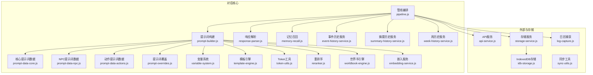
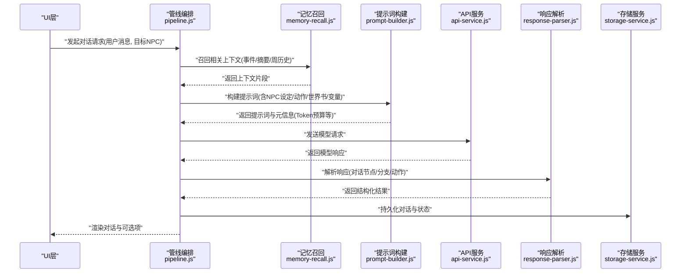
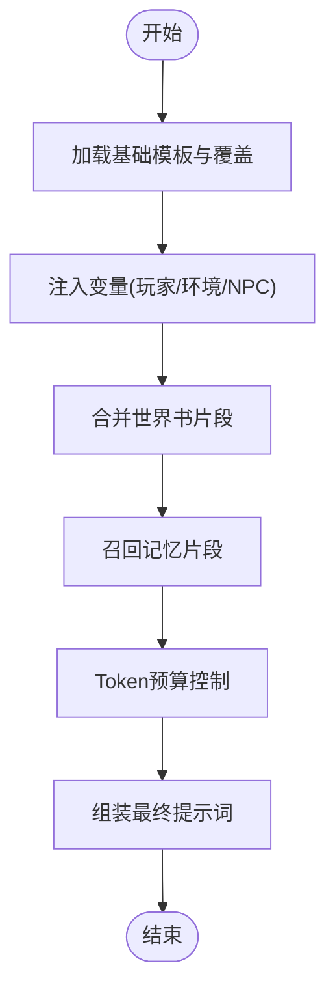
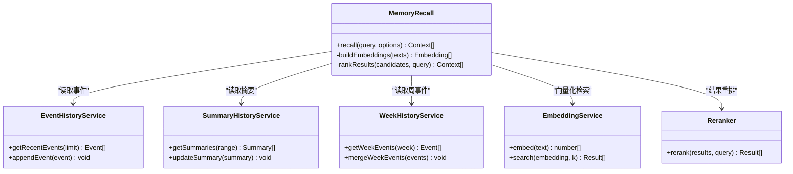
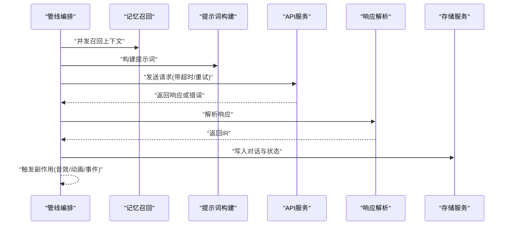
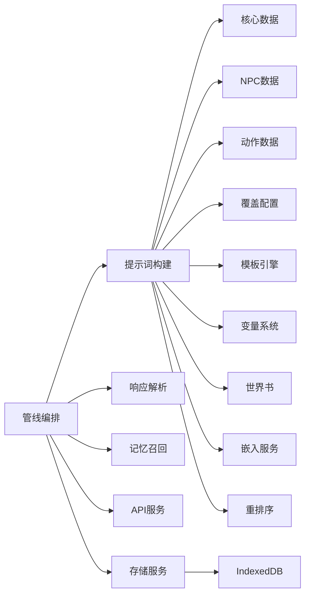

# NPC对话系统

<cite>
**本文引用的文件**   
- [prompt-builder.js](file://module/prompt-builder.js)
- [prompt-data-core.js](file://module/prompt-data-core.js)
- [prompt-data-npc.js](file://module/prompt-data-npc.js)
- [prompt-data-actions.js](file://module/prompt-data-actions.js)
- [prompt-overrides.js](file://module/prompt-overrides.js)
- [response-parser.js](file://module/response-parser.js)
- [memory-recall.js](file://module/memory-recall.js)
- [event-history-service.js](file://module/event-history-service.js)
- [summary-history-service.js](file://module/summary-history-service.js)
- [week-history-service.js](file://module/week-history-service.js)
- [variable-system.js](file://module/variable-system.js)
- [pipeline.js](file://module/pipeline.js)
- [template-engine.js](file://module/template-engine.js)
- [token-utils.js](file://module/token-utils.js)
- [reranker.js](file://module/reranker.js)
- [api-service.js](file://module/api-service.js)
- [storage-service.js](file://module/storage-service.js)
- [idb-storage.js](file://module/idb-storage.js)
- [game-config.js](file://module/game-config.js)
- [worldbook-engine.js](file://module/worldbook-engine.js)
- [embedding-service.js](file://module/embedding-service.js)
- [sync-utils.js](file://module/sync-utils.js)
- [log-capture.js](file://module/log-capture.js)
- [generate-prompt-data.js](file://tools/generate-prompt-data.js)
- [config-modal.js](file://ui/config-modal.js)
- [prompt-manager-modal.js](file://ui/prompt-manager-modal.js)
</cite>

## 目录
1. [简介](#简介)
2. [项目结构](#项目结构)
3. [核心组件](#核心组件)
4. [架构总览](#架构总览)
5. [详细组件分析](#详细组件分析)
6. [依赖关系分析](#依赖关系分析)
7. [性能考量](#性能考量)
8. [故障排查指南](#故障排查指南)
9. [结论](#结论)
10. [附录](#附录)

## 简介
本技术文档面向“姬侠传”NPC对话系统的开发者与维护者，系统性阐述对话树设计、AI对话生成流程、状态与记忆管理、新角色接入方法以及调试测试手段。文档以模块化为视角，结合代码级流程图与时序图，帮助读者快速理解并扩展对话能力。

## 项目结构
对话系统主要位于前端资源目录的 module 子目录中，围绕“提示词构建—上下文召回—模型调用—响应解析—状态更新”的主链路组织。关键目录与职责如下：
- module：对话核心逻辑（提示词、解析、记忆、检索、管线编排等）
- tools：辅助工具（提示词数据生成、保存转换等）
- ui：配置与提示词管理界面
- storage：持久化存储（IndexedDB、通用存储服务）
- api：外部服务接口封装



图表来源
- [prompt-builder.js:1-200](file://module/prompt-builder.js#L1-L200)
- [prompt-data-core.js:1-200](file://module/prompt-data-core.js#L1-L200)
- [prompt-data-npc.js:1-200](file://module/prompt-data-npc.js#L1-L200)
- [prompt-data-actions.js:1-200](file://module/prompt-data-actions.js#L1-L200)
- [prompt-overrides.js:1-200](file://module/prompt-overrides.js#L1-L200)
- [response-parser.js:1-200](file://module/response-parser.js#L1-L200)
- [memory-recall.js:1-200](file://module/memory-recall.js#L1-L200)
- [event-history-service.js:1-200](file://module/event-history-service.js#L1-L200)
- [summary-history-service.js:1-200](file://module/summary-history-service.js#L1-L200)
- [week-history-service.js:1-200](file://module/week-history-service.js#L1-L200)
- [variable-system.js:1-200](file://module/variable-system.js#L1-L200)
- [template-engine.js:1-200](file://module/template-engine.js#L1-L200)
- [token-utils.js:1-200](file://module/token-utils.js#L1-L200)
- [reranker.js:1-200](file://module/reranker.js#L1-L200)
- [worldbook-engine.js:1-200](file://module/worldbook-engine.js#L1-L200)
- [embedding-service.js:1-200](file://module/embedding-service.js#L1-L200)
- [pipeline.js:1-200](file://module/pipeline.js#L1-L200)
- [api-service.js:1-200](file://module/api-service.js#L1-L200)
- [storage-service.js:1-200](file://module/storage-service.js#L1-L200)
- [idb-storage.js:1-200](file://module/idb-storage.js#L1-L200)
- [sync-utils.js:1-200](file://module/sync-utils.js#L1-L200)
- [log-capture.js:1-200](file://module/log-capture.js#L1-L200)

章节来源
- [prompt-builder.js:1-200](file://module/prompt-builder.js#L1-L200)
- [pipeline.js:1-200](file://module/pipeline.js#L1-L200)
- [api-service.js:1-200](file://module/api-service.js#L1-L200)
- [storage-service.js:1-200](file://module/storage-service.js#L1-L200)
- [idb-storage.js:1-200](file://module/idb-storage.js#L1-L200)

## 核心组件
- 提示词构建器：负责拼装系统提示词、NPC设定、动作选项、世界书片段、变量替换与Token预算控制。
- 响应解析器：将模型返回的结构化内容解析为对话节点、分支条件、动作执行指令等。
- 记忆与检索：基于事件历史、摘要历史与周历史的召回策略，结合嵌入向量进行相关性排序。
- 管线编排：统一调度提示词构建、上下文召回、模型调用、结果解析与状态落盘。
- 变量系统与模板引擎：提供运行时变量注入与文本模板渲染。
- 存储与同步：持久化对话历史、会话状态与配置项，支持跨端同步。

章节来源
- [prompt-builder.js:1-200](file://module/prompt-builder.js#L1-L200)
- [response-parser.js:1-200](file://module/response-parser.js#L1-L200)
- [memory-recall.js:1-200](file://module/memory-recall.js#L1-L200)
- [pipeline.js:1-200](file://module/pipeline.js#L1-L200)
- [variable-system.js:1-200](file://module/variable-system.js#L1-L200)
- [template-engine.js:1-200](file://module/template-engine.js#L1-L200)
- [storage-service.js:1-200](file://module/storage-service.js#L1-L200)
- [idb-storage.js:1-200](file://module/idb-storage.js#L1-L200)

## 架构总览
对话系统采用“管线式”架构：输入用户消息后，依次经过上下文召回、提示词构建、模型调用、响应解析、状态更新与持久化。各阶段通过明确接口契约协作，便于替换实现与扩展。



图表来源
- [pipeline.js:1-200](file://module/pipeline.js#L1-L200)
- [memory-recall.js:1-200](file://module/memory-recall.js#L1-L200)
- [prompt-builder.js:1-200](file://module/prompt-builder.js#L1-L200)
- [api-service.js:1-200](file://module/api-service.js#L1-L200)
- [response-parser.js:1-200](file://module/response-parser.js#L1-L200)
- [storage-service.js:1-200](file://module/storage-service.js#L1-L200)

## 详细组件分析

### 提示词构建与数据源
- 核心数据源
  - 核心提示词数据：系统规则、输出格式约束、安全与风格要求。
  - NPC提示词数据：角色人设、语气、知识边界、偏好与禁忌。
  - 动作提示词数据：可选动作列表、触发条件、效果说明。
  - 提示词覆盖：按场景或会话覆盖默认行为。
- 构建过程
  - 加载基础模板与覆盖项。
  - 注入变量（玩家属性、当前时间、地点、关系值等）。
  - 合并世界书片段与检索到的记忆片段。
  - 计算Token预算并进行截断或摘要。
  - 输出最终提示词与元信息（如温度、最大长度等）。



图表来源
- [prompt-builder.js:1-200](file://module/prompt-builder.js#L1-L200)
- [prompt-data-core.js:1-200](file://module/prompt-data-core.js#L1-L200)
- [prompt-data-npc.js:1-200](file://module/prompt-data-npc.js#L1-L200)
- [prompt-data-actions.js:1-200](file://module/prompt-data-actions.js#L1-L200)
- [prompt-overrides.js:1-200](file://module/prompt-overrides.js#L1-L200)
- [worldbook-engine.js:1-200](file://module/worldbook-engine.js#L1-L200)
- [memory-recall.js:1-200](file://module/memory-recall.js#L1-L200)
- [variable-system.js:1-200](file://module/variable-system.js#L1-L200)
- [template-engine.js:1-200](file://module/template-engine.js#L1-L200)
- [token-utils.js:1-200](file://module/token-utils.js#L1-L200)

章节来源
- [prompt-builder.js:1-200](file://module/prompt-builder.js#L1-L200)
- [prompt-data-core.js:1-200](file://module/prompt-data-core.js#L1-L200)
- [prompt-data-npc.js:1-200](file://module/prompt-data-npc.js#L1-L200)
- [prompt-data-actions.js:1-200](file://module/prompt-data-actions.js#L1-L200)
- [prompt-overrides.js:1-200](file://module/prompt-overrides.js#L1-L200)
- [worldbook-engine.js:1-200](file://module/worldbook-engine.js#L1-L200)
- [memory-recall.js:1-200](file://module/memory-recall.js#L1-L200)
- [variable-system.js:1-200](file://module/variable-system.js#L1-L200)
- [template-engine.js:1-200](file://module/template-engine.js#L1-L200)
- [token-utils.js:1-200](file://module/token-utils.js#L1-L200)

### 响应解析与对话节点
- 解析目标
  - 将模型返回转换为统一的对话节点结构，包含：
    - 对话文本
    - 表情/立绘切换指令
    - 分支选项与跳转目标
    - 条件判断表达式
    - 动作执行指令（变量变更、事件触发、好感度调整等）
- 解析流程
  - 校验JSON结构与字段完整性。
  - 规范化分支与条件表达式。
  - 提取动作清单并去重。
  - 输出供UI渲染与后续状态更新的中间表示。

```mermaid
flowchart TD
RStart(["接收模型响应"]) --> Validate["校验结构与字段"]
Validate --> ParseNodes["解析对话节点"]
ParseNodes --> NormalizeBranches["规范化分支与条件"]
NormalizeBranches --> ExtractActions["提取动作清单"]
ExtractActions --> OutputIR["输出中间表示(IR)"]
Output IR --> REnd(["结束"])
```

图表来源
- [response-parser.js:1-200](file://module/response-parser.js#L1-L200)

章节来源
- [response-parser.js:1-200](file://module/response-parser.js#L1-L200)

### 记忆召回与上下文管理
- 多粒度记忆
  - 事件历史：最近对话事件序列。
  - 摘要历史：长程语义摘要，用于压缩上下文。
  - 周历史：按周聚合的关键事件，用于长期连贯性。
- 召回策略
  - 关键词匹配与语义相似度混合。
  - 嵌入向量检索（embedding-service）与重排序（reranker）。
  - 上下文窗口限制下的优先级裁剪。



图表来源
- [memory-recall.js:1-200](file://module/memory-recall.js#L1-L200)
- [event-history-service.js:1-200](file://module/event-history-service.js#L1-L200)
- [summary-history-service.js:1-200](file://module/summary-history-service.js#L1-L200)
- [week-history-service.js:1-200](file://module/week-history-service.js#L1-L200)
- [embedding-service.js:1-200](file://module/embedding-service.js#L1-L200)
- [reranker.js:1-200](file://module/reranker.js#L1-L200)

章节来源
- [memory-recall.js:1-200](file://module/memory-recall.js#L1-L200)
- [event-history-service.js:1-200](file://module/event-history-service.js#L1-L200)
- [summary-history-service.js:1-200](file://module/summary-history-service.js#L1-L200)
- [week-history-service.js:1-200](file://module/week-history-service.js#L1-L200)
- [embedding-service.js:1-200](file://module/embedding-service.js#L1-L200)
- [reranker.js:1-200](file://module/reranker.js#L1-L200)

### 管线编排与状态更新
- 管线步骤
  - 前置校验与参数归一化。
  - 并行召回上下文与预取必要数据。
  - 构建提示词并估算Token。
  - 调用API获取响应。
  - 解析响应并应用动作。
  - 更新会话状态与持久化。
- 错误处理与重试
  - 网络异常重试与降级策略。
  - 解析失败回退到默认分支。
  - 记录诊断日志以便定位问题。



图表来源
- [pipeline.js:1-200](file://module/pipeline.js#L1-L200)
- [api-service.js:1-200](file://module/api-service.js#L1-L200)
- [storage-service.js:1-200](file://module/storage-service.js#L1-L200)

章节来源
- [pipeline.js:1-200](file://module/pipeline.js#L1-L200)
- [api-service.js:1-200](file://module/api-service.js#L1-L200)
- [storage-service.js:1-200](file://module/storage-service.js#L1-L200)

### 变量系统与模板引擎
- 变量系统
  - 提供全局与局部作用域的变量读写。
  - 支持类型检查与默认值。
  - 与游戏配置联动（如难度、语言、主题）。
- 模板引擎
  - 基于占位符的文本渲染。
  - 支持条件片段与循环片段。
  - 与提示词构建器深度集成。

章节来源
- [variable-system.js:1-200](file://module/variable-system.js#L1-L200)
- [template-engine.js:1-200](file://module/template-engine.js#L1-L200)
- [game-config.js:1-200](file://module/game-config.js#L1-L200)

### 存储与同步
- 存储抽象
  - 存储服务提供统一读写接口。
  - IndexedDB作为底层实现，支持大对象与事务。
- 同步机制
  - 增量同步与冲突解决。
  - 离线优先与网络恢复后的自动同步。

章节来源
- [storage-service.js:1-200](file://module/storage-service.js#L1-L200)
- [idb-storage.js:1-200](file://module/idb-storage.js#L1-L200)
- [sync-utils.js:1-200](file://module/sync-utils.js#L1-L200)

## 依赖关系分析
- 低耦合高内聚
  - 提示词构建仅依赖数据源、模板与变量系统。
  - 响应解析独立于上游构建，关注IR标准化。
  - 记忆召回对历史服务与嵌入服务解耦，可通过重排序插件扩展。
- 外部依赖
  - API服务封装网络请求与鉴权。
  - 存储服务屏蔽底层存储差异。
  - 日志捕获贯穿全链路，便于追踪。



图表来源
- [prompt-builder.js:1-200](file://module/prompt-builder.js#L1-L200)
- [prompt-data-core.js:1-200](file://module/prompt-data-core.js#L1-L200)
- [prompt-data-npc.js:1-200](file://module/prompt-data-npc.js#L1-L200)
- [prompt-data-actions.js:1-200](file://module/prompt-data-actions.js#L1-L200)
- [prompt-overrides.js:1-200](file://module/prompt-overrides.js#L1-L200)
- [template-engine.js:1-200](file://module/template-engine.js#L1-L200)
- [variable-system.js:1-200](file://module/variable-system.js#L1-L200)
- [worldbook-engine.js:1-200](file://module/worldbook-engine.js#L1-L200)
- [embedding-service.js:1-200](file://module/embedding-service.js#L1-L200)
- [reranker.js:1-200](file://module/reranker.js#L1-L200)
- [pipeline.js:1-200](file://module/pipeline.js#L1-L200)
- [response-parser.js:1-200](file://module/response-parser.js#L1-L200)
- [memory-recall.js:1-200](file://module/memory-recall.js#L1-L200)
- [api-service.js:1-200](file://module/api-service.js#L1-L200)
- [storage-service.js:1-200](file://module/storage-service.js#L1-L200)
- [idb-storage.js:1-200](file://module/idb-storage.js#L1-L200)

章节来源
- [prompt-builder.js:1-200](file://module/prompt-builder.js#L1-L200)
- [pipeline.js:1-200](file://module/pipeline.js#L1-L200)
- [api-service.js:1-200](file://module/api-service.js#L1-L200)
- [storage-service.js:1-200](file://module/storage-service.js#L1-L200)
- [idb-storage.js:1-200](file://module/idb-storage.js#L1-L200)

## 性能考量
- Token预算与上下文裁剪
  - 在提示词构建阶段进行Token估算与动态裁剪，避免超限。
  - 使用摘要历史与周历史降低长程上下文成本。
- 并发与缓存
  - 记忆召回与数据预取并行执行，减少端到端延迟。
  - 对频繁访问的世界书片段与NPC设定进行内存缓存。
- 重排序优化
  - 先粗筛再精排，平衡召回质量与耗时。
- 存储I/O
  - 批量写入与事务提交，减少磁盘抖动。
  - 异步持久化，避免阻塞主线程。

[本节为通用指导，不直接分析具体文件]

## 故障排查指南
- 常见问题定位
  - 提示词构建失败：检查覆盖配置与变量注入是否完整。
  - 解析异常：确认模型输出是否符合约定结构，必要时启用回退分支。
  - 记忆召回为空：验证嵌入索引与检索参数，检查历史服务可用性。
  - 存储写入失败：检查IndexedDB权限与存储空间，查看同步队列。
- 调试工具
  - 日志捕获：开启全链路日志，过滤对话相关关键字。
  - 提示词数据生成：使用工具脚本生成与校验提示词数据。
  - UI配置面板：在线修改覆盖项与变量，实时观察影响。

章节来源
- [log-capture.js:1-200](file://module/log-capture.js#L1-L200)
- [generate-prompt-data.js:1-200](file://tools/generate-prompt-data.js#L1-L200)
- [config-modal.js:1-200](file://ui/config-modal.js#L1-L200)
- [prompt-manager-modal.js:1-200](file://ui/prompt-manager-modal.js#L1-L200)

## 结论
本对话系统以模块化与管线化为核心，实现了从提示词构建到状态更新的闭环。通过多粒度记忆与检索增强，NPC对话具备更强的连贯性与个性化。建议在新角色接入时严格遵循数据规范，配合调试工具与测试用例，确保质量与稳定性。

[本节为总结，不直接分析具体文件]

## 附录

### 新NPC角色添加指南
- 角色卡片配置
  - 在NPC提示词数据文件中新增角色条目，包含：名称、人设、语气、知识边界、偏好与禁忌、初始关系值等。
  - 如需覆盖默认行为，可在提示词覆盖文件中定义对应场景的策略。
- 对话脚本编写
  - 定义初始对话节点与分支选项，明确跳转目标与条件表达式。
  - 为每个动作指定效果（变量变更、事件触发、好感度调整等）。
- 触发条件设置
  - 使用变量系统与模板引擎组合条件，如时间、地点、玩家属性、关系阈值等。
  - 通过世界书引擎引入背景知识，提升对话贴合度。
- 测试与验证
  - 使用提示词数据生成工具校验数据结构。
  - 在UI配置面板中模拟对话流程，观察分支与动作生效情况。
  - 结合日志捕获定位问题，逐步收敛。

章节来源
- [prompt-data-npc.js:1-200](file://module/prompt-data-npc.js#L1-L200)
- [prompt-overrides.js:1-200](file://module/prompt-overrides.js#L1-L200)
- [variable-system.js:1-200](file://module/variable-system.js#L1-L200)
- [template-engine.js:1-200](file://module/template-engine.js#L1-L200)
- [worldbook-engine.js:1-200](file://module/worldbook-engine.js#L1-L200)
- [generate-prompt-data.js:1-200](file://tools/generate-prompt-data.js#L1-L200)
- [config-modal.js:1-200](file://ui/config-modal.js#L1-L200)
- [prompt-manager-modal.js:1-200](file://ui/prompt-manager-modal.js#L1-L200)