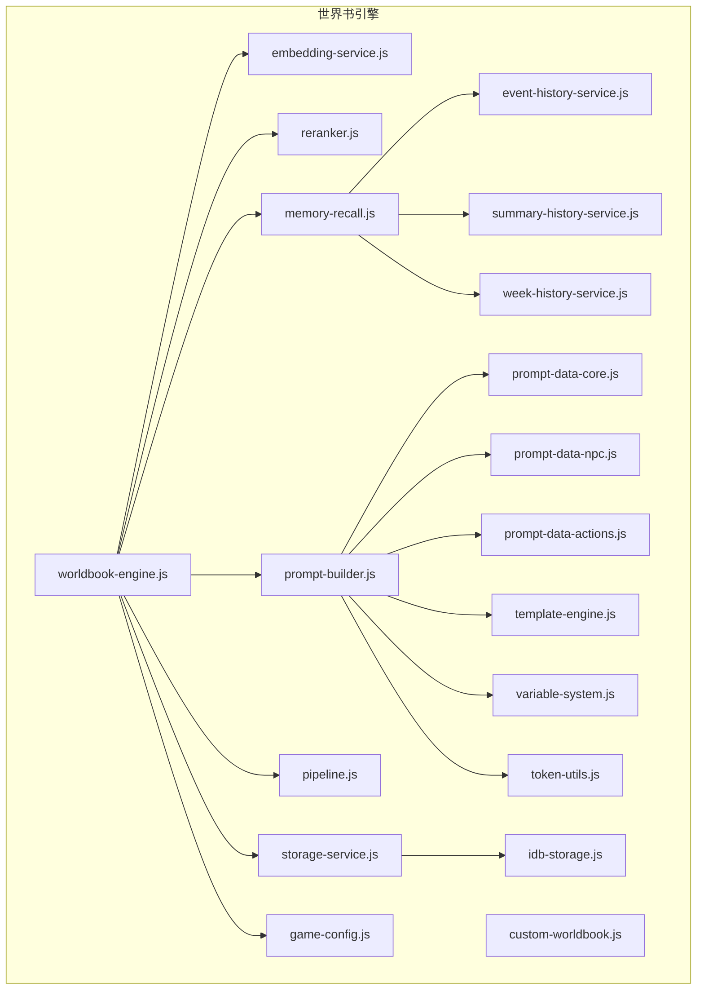
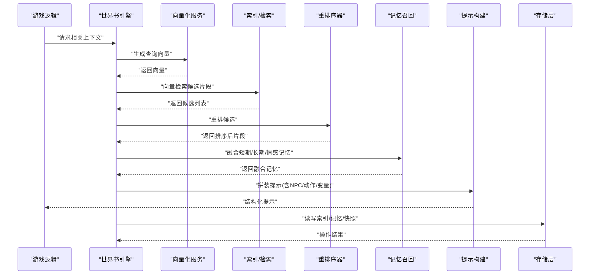
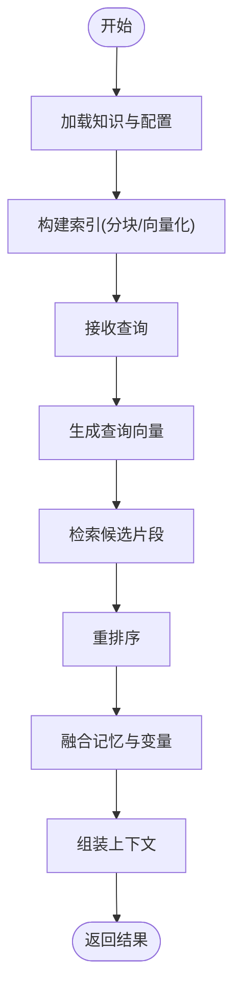
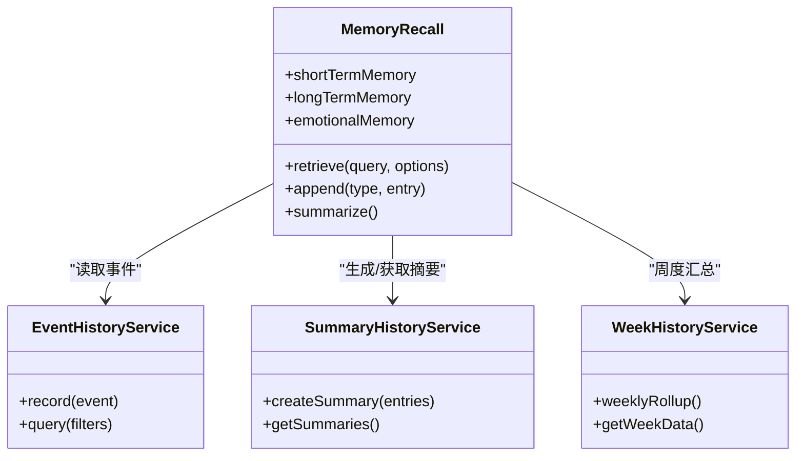
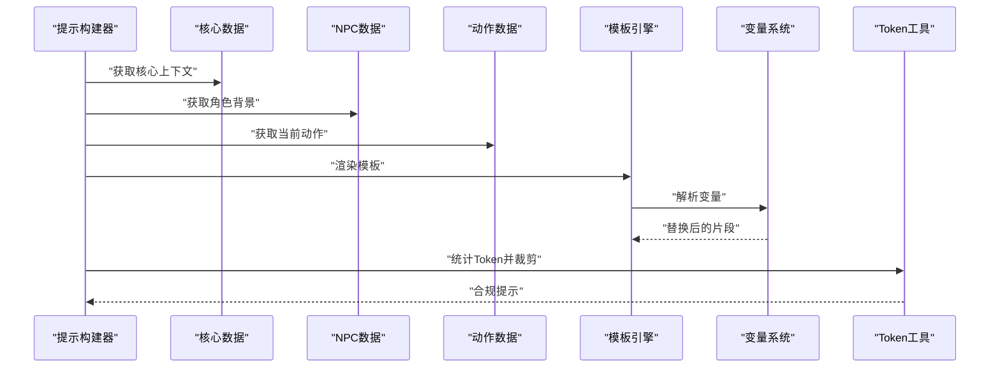
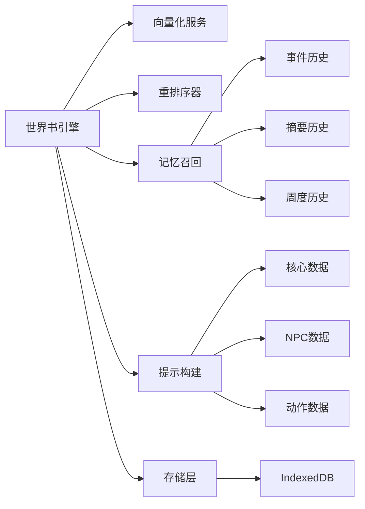

# 世界书引擎

<cite>
**本文引用的文件**   
- [worldbook-engine.js](file://module/worldbook-engine.js)
- [custom-worldbook.js](file://module/custom-worldbook.js)
- [embedding-service.js](file://module/embedding-service.js)
- [reranker.js](file://module/reranker.js)
- [memory-recall.js](file://module/memory-recall.js)
- [prompt-builder.js](file://module/prompt-builder.js)
- [prompt-data-core.js](file://module/prompt-data-core.js)
- [prompt-data-npc.js](file://module/prompt-data-npc.js)
- [prompt-data-actions.js](file://module/prompt-data-actions.js)
- [pipeline.js](file://module/pipeline.js)
- [storage-service.js](file://module/storage-service.js)
- [idb-storage.js](file://module/idb-storage.js)
- [template-engine.js](file://module/template-engine.js)
- [variable-system.js](file://module/variable-system.js)
- [token-utils.js](file://module/token-utils.js)
- [game-config.js](file://module/game-config.js)
- [event-history-service.js](file://module/event-history-service.js)
- [summary-history-service.js](file://module/summary-history-service.js)
- [week-history-service.js](file://module/week-history-service.js)
</cite>

## 目录
1. [引言](#引言)
2. [项目结构](#项目结构)
3. [核心组件](#核心组件)
4. [架构总览](#架构总览)
5. [详细组件分析](#详细组件分析)
6. [依赖关系分析](#依赖关系分析)
7. [性能与内存管理](#性能与内存管理)
8. [故障排查指南](#故障排查指南)
9. [结论](#结论)
10. [附录：编辑与管理工具使用](#附录编辑与管理工具使用)

## 引言
本文件面向“姬侠传”世界书引擎的开发者与维护者，系统性阐述世界书的概念、设计原理与实现要点。内容覆盖知识图谱构建、信息检索机制、上下文管理、NPC行为控制（角色背景注入、情境感知、决策辅助）、记忆召回系统（短期/长期/情感记忆）以及内容编辑与管理工具使用方法，并提供性能优化策略与内存管理最佳实践。

## 项目结构
围绕世界书引擎的核心模块主要位于 module 目录下，关键职责如下：
- worldbook-engine.js：世界书主引擎，负责编排知识加载、索引、检索、重排与上下文组装。
- custom-worldbook.js：自定义世界书扩展点，允许运行时注入额外知识或改写检索策略。
- embedding-service.js：向量化服务封装，提供文本嵌入生成与缓存。
- reranker.js：结果重排序器，对候选片段进行二次打分与筛选。
- memory-recall.js：记忆召回子系统，维护短期、长期与情感记忆的存取与融合。
- prompt-builder.js / prompt-data-*.js：提示词构建与数据拼装，将世界书内容与游戏状态组合为模型输入。
- pipeline.js：通用处理管线，串联多阶段处理逻辑（如清洗、分块、索引、检索）。
- storage-service.js / idb-storage.js：持久化存储抽象与 IndexedDB 实现。
- template-engine.js / variable-system.js：模板渲染与变量替换，支撑动态上下文拼接。
- token-utils.js：Token 计数与预算控制，保障提示词长度在模型限制内。
- game-config.js：全局配置项，驱动各子系统的阈值与开关。
- event-history-service.js / summary-history-service.js / week-history-service.js：事件与摘要历史服务，用于长期记忆与周度总结。

图表来源
- [worldbook-engine.js](file://module/worldbook-engine.js)
- [custom-worldbook.js](file://module/custom-worldbook.js)
- [embedding-service.js](file://module/embedding-service.js)
- [reranker.js](file://module/reranker.js)
- [memory-recall.js](file://module/memory-recall.js)
- [prompt-builder.js](file://module/prompt-builder.js)
- [prompt-data-core.js](file://module/prompt-data-core.js)
- [prompt-data-npc.js](file://module/prompt-data-npc.js)
- [prompt-data-actions.js](file://module/prompt-data-actions.js)
- [pipeline.js](file://module/pipeline.js)
- [storage-service.js](file://module/storage-service.js)
- [idb-storage.js](file://module/idb-storage.js)
- [template-engine.js](file://module/template-engine.js)
- [variable-system.js](file://module/variable-system.js)
- [token-utils.js](file://module/token-utils.js)
- [game-config.js](file://module/game-config.js)
- [event-history-service.js](file://module/event-history-service.js)
- [summary-history-service.js](file://module/summary-history-service.js)
- [week-history-service.js](file://module/week-history-service.js)

章节来源
- [worldbook-engine.js](file://module/worldbook-engine.js)
- [custom-worldbook.js](file://module/custom-worldbook.js)
- [embedding-service.js](file://module/embedding-service.js)
- [reranker.js](file://module/reranker.js)
- [memory-recall.js](file://module/memory-recall.js)
- [prompt-builder.js](file://module/prompt-builder.js)
- [prompt-data-core.js](file://module/prompt-data-core.js)
- [prompt-data-npc.js](file://module/prompt-data-npc.js)
- [prompt-data-actions.js](file://module/prompt-data-actions.js)
- [pipeline.js](file://module/pipeline.js)
- [storage-service.js](file://module/storage-service.js)
- [idb-storage.js](file://module/idb-storage.js)
- [template-engine.js](file://module/template-engine.js)
- [variable-system.js](file://module/variable-system.js)
- [token-utils.js](file://module/token-utils.js)
- [game-config.js](file://module/game-config.js)
- [event-history-service.js](file://module/event-history-service.js)
- [summary-history-service.js](file://module/summary-history-service.js)
- [week-history-service.js](file://module/week-history-service.js)

## 核心组件
- 世界书主引擎：统一入口，协调知识加载、索引、检索、重排与上下文组装；暴露对外 API 供 NPC 行为系统与对话流程调用。
- 向量化服务：封装文本到向量表示的生成与缓存，支持批量与增量更新。
- 重排序器：基于规则或轻量模型对检索候选进行二次评分，提升相关性。
- 记忆召回：维护短期会话记忆、长期事实记忆与情感记忆，提供融合检索接口。
- 提示词构建：将世界书片段、NPC 背景、当前动作与变量上下文拼装为结构化提示。
- 存储层：通过存储抽象与 IndexedDB 实现，保证跨会话持久化与快照能力。
- 模板与变量：模板引擎与变量系统协同，完成动态占位符替换与条件渲染。
- Token 工具：统计与裁剪，确保最终提示不超过模型上下文窗口。
- 历史服务：事件、摘要与周度总结，支撑长期记忆与回溯。

章节来源
- [worldbook-engine.js](file://module/worldbook-engine.js)
- [embedding-service.js](file://module/embedding-service.js)
- [reranker.js](file://module/reranker.js)
- [memory-recall.js](file://module/memory-recall.js)
- [prompt-builder.js](file://module/prompt-builder.js)
- [prompt-data-core.js](file://module/prompt-data-core.js)
- [prompt-data-npc.js](file://module/prompt-data-npc.js)
- [prompt-data-actions.js](file://module/prompt-data-actions.js)
- [storage-service.js](file://module/storage-service.js)
- [idb-storage.js](file://module/idb-storage.js)
- [template-engine.js](file://module/template-engine.js)
- [variable-system.js](file://module/variable-system.js)
- [token-utils.js](file://module/token-utils.js)
- [event-history-service.js](file://module/event-history-service.js)
- [summary-history-service.js](file://module/summary-history-service.js)
- [week-history-service.js](file://module/week-history-service.js)

## 架构总览
世界书引擎采用分层与管线式架构：上层由主引擎编排，中层包含检索、重排、记忆与提示构建，底层为存储与向量化服务。历史服务贯穿生命周期，提供长期记忆素材。

图表来源
- [worldbook-engine.js](file://module/worldbook-engine.js)
- [embedding-service.js](file://module/embedding-service.js)
- [reranker.js](file://module/reranker.js)
- [memory-recall.js](file://module/memory-recall.js)
- [prompt-builder.js](file://module/prompt-builder.js)
- [prompt-data-core.js](file://module/prompt-data-core.js)
- [prompt-data-npc.js](file://module/prompt-data-npc.js)
- [prompt-data-actions.js](file://module/prompt-data-actions.js)
- [storage-service.js](file://module/storage-service.js)
- [idb-storage.js](file://module/idb-storage.js)

## 详细组件分析

### 世界书主引擎
- 职责：初始化知识库、构建索引、执行检索、触发重排、聚合上下文、暴露统一 API。
- 关键点：
  - 知识加载：从配置与外部源读取条目，经管道清洗、分块、向量化并写入存储。
  - 检索策略：支持关键词与向量混合检索，按权重合并。
  - 上下文组装：结合 NPC 背景、当前动作与变量，生成最小必要上下文。
  - 错误恢复：当某阶段失败时回退至降级策略（如仅关键词检索）。

图表来源
- [worldbook-engine.js](file://module/worldbook-engine.js)
- [pipeline.js](file://module/pipeline.js)
- [embedding-service.js](file://module/embedding-service.js)
- [reranker.js](file://module/reranker.js)
- [memory-recall.js](file://module/memory-recall.js)
- [prompt-builder.js](file://module/prompt-builder.js)
- [variable-system.js](file://module/variable-system.js)

章节来源
- [worldbook-engine.js](file://module/worldbook-engine.js)
- [pipeline.js](file://module/pipeline.js)

### 向量化服务
- 职责：文本嵌入生成、批量处理、缓存命中与失效策略。
- 关键点：
  - 缓存键：基于内容哈希与模型版本，避免重复计算。
  - 批处理：合并多次插入以减少网络开销。
  - 容错：网络异常时回退本地缓存或延迟重试。

章节来源
- [embedding-service.js](file://module/embedding-service.js)

### 重排序器
- 职责：对检索候选进行二次打分，考虑语义相似度、时间衰减、来源可信度等。
- 关键点：
  - 可插拔策略：支持规则与轻量模型两种模式。
  - 阈值过滤：剔除低质量片段，减少噪声。

章节来源
- [reranker.js](file://module/reranker.js)

### 记忆召回系统
- 职责：维护短期会话记忆、长期事实记忆与情感记忆，提供融合检索与写入。
- 数据结构：
  - 短期记忆：最近交互片段，带时间戳与重要性评分。
  - 长期记忆：经过摘要与压缩的事实条目，持久化存储。
  - 情感记忆：与情绪标签关联的记忆片段，影响后续行为倾向。
- 检索流程：
  - 并行检索三类记忆，按权重合并，去重与截断。

图表来源
- [memory-recall.js](file://module/memory-recall.js)
- [event-history-service.js](file://module/event-history-service.js)
- [summary-history-service.js](file://module/summary-history-service.js)
- [week-history-service.js](file://module/week-history-service.js)

章节来源
- [memory-recall.js](file://module/memory-recall.js)
- [event-history-service.js](file://module/event-history-service.js)
- [summary-history-service.js](file://module/summary-history-service.js)
- [week-history-service.js](file://module/week-history-service.js)

### 提示词构建与数据拼装
- 职责：将世界书片段、NPC 背景、当前动作与变量上下文拼装为结构化提示。
- 关键点：
  - 模块化数据：core/npc/actions 三段数据分别拼装，便于复用与测试。
  - 模板与变量：模板引擎渲染，变量系统注入运行时值。
  - Token 预算：根据上限裁剪与优先级选择片段。

图表来源
- [prompt-builder.js](file://module/prompt-builder.js)
- [prompt-data-core.js](file://module/prompt-data-core.js)
- [prompt-data-npc.js](file://module/prompt-data-npc.js)
- [prompt-data-actions.js](file://module/prompt-data-actions.js)
- [template-engine.js](file://module/template-engine.js)
- [variable-system.js](file://module/variable-system.js)
- [token-utils.js](file://module/token-utils.js)

章节来源
- [prompt-builder.js](file://module/prompt-builder.js)
- [prompt-data-core.js](file://module/prompt-data-core.js)
- [prompt-data-npc.js](file://module/prompt-data-npc.js)
- [prompt-data-actions.js](file://module/prompt-data-actions.js)
- [template-engine.js](file://module/template-engine.js)
- [variable-system.js](file://module/variable-system.js)
- [token-utils.js](file://module/token-utils.js)

### 存储层与持久化
- 职责：提供统一的存储接口，底层以 IndexedDB 实现，支持快照与增量同步。
- 关键点：
  - 事务与并发：保证读写一致性。
  - 压缩与归档：长期记忆定期压缩，释放空间。
  - 快照：关键节点保存快照，便于回滚。

章节来源
- [storage-service.js](file://module/storage-service.js)
- [idb-storage.js](file://module/idb-storage.js)

### 自定义世界书扩展
- 职责：允许在运行时注入额外知识、改写检索策略或添加重排规则。
- 关键点：
  - 钩子点：加载前、检索后、重排前后。
  - 安全沙箱：限制访问范围，防止越权。

章节来源
- [custom-worldbook.js](file://module/custom-worldbook.js)

## 依赖关系分析
- 松耦合：主引擎通过接口与模块通信，降低直接依赖。
- 可插拔：重排序器、记忆召回策略可通过配置切换。
- 潜在循环：应避免提示构建与记忆召回互相强引用，建议通过回调或事件解耦。

图表来源
- [worldbook-engine.js](file://module/worldbook-engine.js)
- [embedding-service.js](file://module/embedding-service.js)
- [reranker.js](file://module/reranker.js)
- [memory-recall.js](file://module/memory-recall.js)
- [prompt-builder.js](file://module/prompt-builder.js)
- [prompt-data-core.js](file://module/prompt-data-core.js)
- [prompt-data-npc.js](file://module/prompt-data-npc.js)
- [prompt-data-actions.js](file://module/prompt-data-actions.js)
- [storage-service.js](file://module/storage-service.js)
- [idb-storage.js](file://module/idb-storage.js)
- [event-history-service.js](file://module/event-history-service.js)
- [summary-history-service.js](file://module/summary-history-service.js)
- [week-history-service.js](file://module/week-history-service.js)

章节来源
- [worldbook-engine.js](file://module/worldbook-engine.js)
- [game-config.js](file://module/game-config.js)

## 性能与内存管理
- 向量化缓存：基于内容哈希与模型版本缓存，避免重复计算；设置 TTL 与容量上限。
- 批量处理：合并多次写入与检索，减少 I/O 与网络开销。
- 结果裁剪：按 Token 预算与相关性阈值裁剪片段，控制上下文大小。
- 异步与节流：检索与重排异步执行，必要时节流高频调用。
- 存储压缩：长期记忆定期压缩与归档，清理过期条目。
- 内存回收：及时释放大对象引用，避免闭包持有长生命周期对象。
- 监控与指标：记录检索耗时、命中率、Token 使用量与错误率，指导调优。

[本节为通用指导，不直接分析具体文件]

## 故障排查指南
- 常见问题定位：
  - 检索为空：检查向量化缓存是否命中、索引是否构建成功、查询向量维度是否正确。
  - 结果不相关：调整重排权重、增加关键词匹配、优化分块粒度。
  - 提示过长：启用 Token 裁剪、提高片段优先级、减少冗余背景。
  - 存储异常：确认 IndexedDB 权限、事务是否提交、磁盘空间是否充足。
- 日志与调试：
  - 开启详细日志，记录关键步骤输入输出。
  - 使用快照对比差异，快速定位变更引入的问题。

章节来源
- [storage-service.js](file://module/storage-service.js)
- [idb-storage.js](file://module/idb-storage.js)
- [token-utils.js](file://module/token-utils.js)
- [reranker.js](file://module/reranker.js)
- [embedding-service.js](file://module/embedding-service.js)

## 结论
世界书引擎通过分层与管线式架构，将知识检索、重排、记忆融合与提示构建有机结合，为 NPC 行为控制与对话系统提供稳定高效的上下文支撑。合理的缓存、批处理与 Token 预算策略是保障性能的关键。建议持续完善监控与自动化测试，确保系统在复杂场景下的稳定性与可扩展性。

[本节为总结性内容，不直接分析具体文件]

## 附录：编辑与管理工具使用
- 内容编辑：
  - 使用模板引擎与变量系统进行结构化编辑，确保占位符与变量命名规范。
  - 通过提示数据模块（核心/NPC/动作）拆分内容，便于维护与复用。
- 索引管理：
  - 定期重建索引，验证向量化与缓存一致性。
  - 使用快照功能保存关键版本，支持回滚。
- 性能调优：
  - 调整重排阈值与 Token 预算，平衡准确性与响应速度。
  - 监控检索命中率与错误率，针对性优化分块与检索策略。

章节来源
- [template-engine.js](file://module/template-engine.js)
- [variable-system.js](file://module/variable-system.js)
- [prompt-data-core.js](file://module/prompt-data-core.js)
- [prompt-data-npc.js](file://module/prompt-data-npc.js)
- [prompt-data-actions.js](file://module/prompt-data-actions.js)
- [worldbook-engine.js](file://module/worldbook-engine.js)
- [storage-service.js](file://module/storage-service.js)
- [idb-storage.js](file://module/idb-storage.js)
- [reranker.js](file://module/reranker.js)
- [token-utils.js](file://module/token-utils.js)