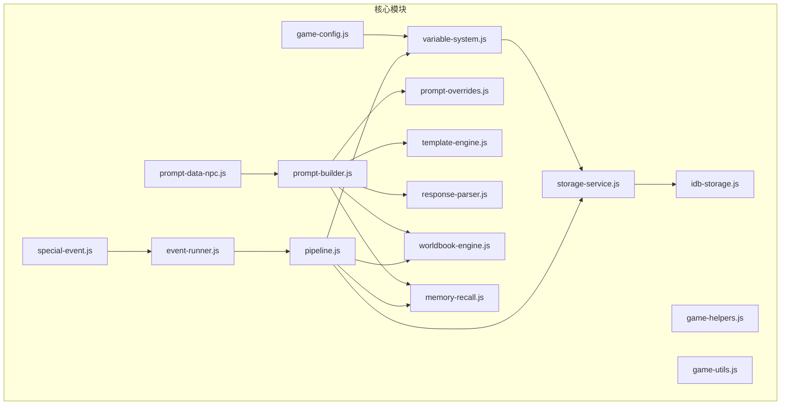
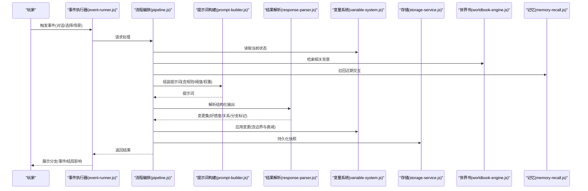
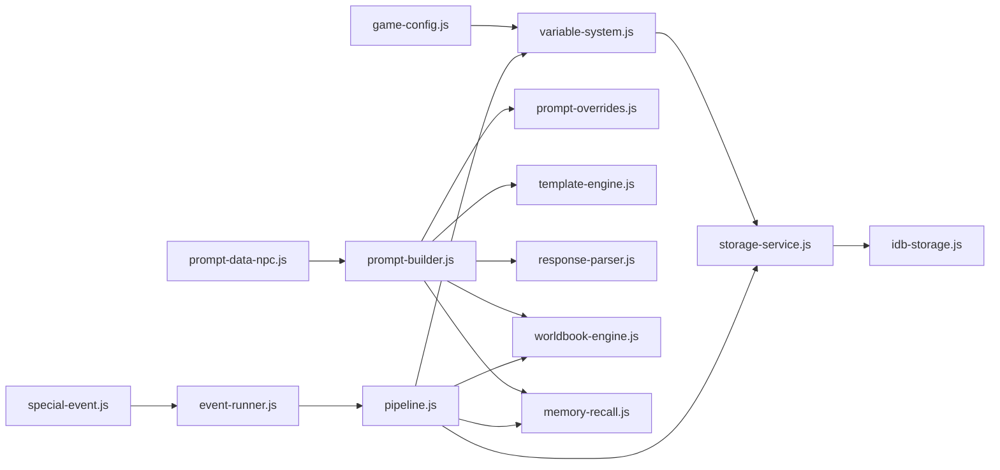

# 好感度与关系系统

<cite>
**本文引用的文件**   
- [module/game-config.js](file://module/game-config.js)
- [module/variable-system.js](file://module/variable-system.js)
- [module/prompt-data-npc.js](file://module/prompt-data-npc.js)
- [module/special-event.js](file://module/special-event.js)
- [module/event-runner.js](file://module/event-runner.js)
- [module/pipeline.js](file://module/pipeline.js)
- [module/storage-service.js](file://module/storage-service.js)
- [module/idb-storage.js](file://module/idb-storage.js)
- [module/worldbook-engine.js](file://module/worldbook-engine.js)
- [module/memory-recall.js](file://module/memory-recall.js)
- [module/template-engine.js](file://module/template-engine.js)
- [module/response-parser.js](file://module/response-parser.js)
- [module/prompt-builder.js](file://module/prompt-builder.js)
- [module/prompt-overrides.js](file://module/prompt-overrides.js)
- [module/game-helpers.js](file://module/game-helpers.js)
- [module/game-utils.js](file://module/game-utils.js)
- [tools/generate-prompt-data.js](file://tools/generate-prompt-data.js)
</cite>

## 目录
1. [引言](#引言)
2. [项目结构](#项目结构)
3. [核心组件](#核心组件)
4. [架构总览](#架构总览)
5. [详细组件分析](#详细组件分析)
6. [依赖分析](#依赖分析)
7. [性能考虑](#性能考虑)
8. [故障排查指南](#故障排查指南)
9. [结论](#结论)
10. [附录](#附录)

## 引言
本技术文档围绕“姬侠传”中的好感度与关系系统，系统性阐述其设计目标、算法原理、数据模型、流程控制、扩展接口与测试调优方法。文档面向关系系统与剧情开发者，提供从高层架构到代码级实现的完整参考，帮助快速理解并扩展该系统。

## 项目结构
本项目采用模块化前端架构，核心逻辑集中在 module 目录下，工具脚本位于 tools 目录，UI 与页面入口在根目录 HTML 文件中。与好感度与关系系统直接相关的模块包括：
- 配置与变量：game-config.js、variable-system.js
- NPC 与事件：prompt-data-npc.js、special-event.js、event-runner.js
- 流程编排：pipeline.js
- 存储与持久化：storage-service.js、idb-storage.js
- 世界书与记忆：worldbook-engine.js、memory-recall.js
- 提示词构建与解析：prompt-builder.js、response-parser.js、prompt-overrides.js
- 模板与辅助：template-engine.js、game-helpers.js、game-utils.js
- 工具：generate-prompt-data.js

图表来源
- [module/game-config.js](file://module/game-config.js)
- [module/variable-system.js](file://module/variable-system.js)
- [module/prompt-data-npc.js](file://module/prompt-data-npc.js)
- [module/special-event.js](file://module/special-event.js)
- [module/event-runner.js](file://module/event-runner.js)
- [module/pipeline.js](file://module/pipeline.js)
- [module/storage-service.js](file://module/storage-service.js)
- [module/idb-storage.js](file://module/idb-storage.js)
- [module/worldbook-engine.js](file://module/worldbook-engine.js)
- [module/memory-recall.js](file://module/memory-recall.js)
- [module/prompt-builder.js](file://module/prompt-builder.js)
- [module/response-parser.js](file://module/response-parser.js)
- [module/prompt-overrides.js](file://module/prompt-overrides.js)
- [module/template-engine.js](file://module/template-engine.js)
- [module/game-helpers.js](file://module/game-helpers.js)
- [module/game-utils.js](file://module/game-utils.js)

章节来源
- [module/game-config.js](file://module/game-config.js)
- [module/variable-system.js](file://module/variable-system.js)
- [module/prompt-data-npc.js](file://module/prompt-data-npc.js)
- [module/special-event.js](file://module/special-event.js)
- [module/event-runner.js](file://module/event-runner.js)
- [module/pipeline.js](file://module/pipeline.js)
- [module/storage-service.js](file://module/storage-service.js)
- [module/idb-storage.js](file://module/idb-storage.js)
- [module/worldbook-engine.js](file://module/worldbook-engine.js)
- [module/memory-recall.js](file://module/memory-recall.js)
- [module/prompt-builder.js](file://module/prompt-builder.js)
- [module/response-parser.js](file://module/response-parser.js)
- [module/prompt-overrides.js](file://module/prompt-overrides.js)
- [module/template-engine.js](file://module/template-engine.js)
- [module/game-helpers.js](file://module/game-helpers.js)
- [module/game-utils.js](file://module/game-utils.js)

## 核心组件
本节聚焦好感度与关系系统的核心能力与职责划分：
- 配置与变量层（game-config.js、variable-system.js）：定义全局常量、阈值、权重、NPC 元信息；提供变量的读写、校验、快照与回滚能力。
- NPC 与事件层（prompt-data-npc.js、special-event.js、event-runner.js）：维护 NPC 基础信息与关系图谱；定义特殊事件及其触发条件；驱动事件执行与分支。
- 流程编排层（pipeline.js）：串联读取状态、构建提示词、调用解析器、更新变量与持久化等步骤。
- 世界书与记忆层（worldbook-engine.js、memory-recall.js）：维护可检索的世界知识、近期交互摘要与关键事实，为好感度计算提供上下文。
- 提示词构建与解析层（prompt-builder.js、response-parser.js、prompt-overrides.js、template-engine.js）：将当前状态与规则注入提示词，并将结构化结果解析回变量。
- 存储层（storage-service.js、idb-storage.js）：负责本地持久化、版本兼容与迁移。
- 工具与辅助（game-helpers.js、game-utils.js、tools/generate-prompt-data.js）：通用函数、调试工具与批量生成提示词数据。

章节来源
- [module/game-config.js](file://module/game-config.js)
- [module/variable-system.js](file://module/variable-system.js)
- [module/prompt-data-npc.js](file://module/prompt-data-npc.js)
- [module/special-event.js](file://module/special-event.js)
- [module/event-runner.js](file://module/event-runner.js)
- [module/pipeline.js](file://module/pipeline.js)
- [module/worldbook-engine.js](file://module/worldbook-engine.js)
- [module/memory-recall.js](file://module/memory-recall.js)
- [module/prompt-builder.js](file://module/prompt-builder.js)
- [module/response-parser.js](file://module/response-parser.js)
- [module/prompt-overrides.js](file://module/prompt-overrides.js)
- [module/template-engine.js](file://module/template-engine.js)
- [module/storage-service.js](file://module/storage-service.js)
- [module/idb-storage.js](file://module/idb-storage.js)
- [module/game-helpers.js](file://module/game-helpers.js)
- [module/game-utils.js](file://module/game-utils.js)
- [tools/generate-prompt-data.js](file://tools/generate-prompt-data.js)

## 架构总览
好感度与关系系统以“配置驱动 + 事件驱动 + 世界书增强”的架构运行。玩家行动或时间推进触发事件，事件通过流程编排读取当前变量与世界书，构建提示词，由解析器产出结构化结果，最终更新变量并持久化。

图表来源
- [module/event-runner.js](file://module/event-runner.js)
- [module/pipeline.js](file://module/pipeline.js)
- [module/prompt-builder.js](file://module/prompt-builder.js)
- [module/response-parser.js](file://module/response-parser.js)
- [module/variable-system.js](file://module/variable-system.js)
- [module/storage-service.js](file://module/storage-service.js)
- [module/worldbook-engine.js](file://module/worldbook-engine.js)
- [module/memory-recall.js](file://module/memory-recall.js)

## 详细组件分析

### 配置与变量层（game-config.js、variable-system.js）
- 职责
  - 集中管理全局常量：好感度范围、阈值区间、衰减系数、权重表、NPC 元数据。
  - 提供变量读写 API：支持原子更新、批量提交、校验与回滚、快照对比。
- 关键机制
  - 阈值判定：基于配置的等级区间进行阶段判定（如陌生、熟悉、知己、挚友）。
  - 权重聚合：对多因素（行为、礼物、共同经历、冲突）加权求和，结合非线性变换（如分段线性或平滑曲线）得到净变化。
  - 衰减与上限：按时间步长或事件间隔施加自然衰减，防止无限增长；设置硬上限与软上限。
- 数据结构建议
  - npc_meta：包含角色属性、初始偏好、关系标签。
  - affinity_rules：包含各因素权重、阈值表、衰减策略。
  - thresholds：等级区间映射与效果开关。
- 复杂度
  - 单次变量更新 O(n)，n 为受影响变量数量；批量提交使用差异合并降低写入开销。

章节来源
- [module/game-config.js](file://module/game-config.js)
- [module/variable-system.js](file://module/variable-system.js)

### NPC 与事件层（prompt-data-npc.js、special-event.js、event-runner.js）
- 职责
  - prompt-data-npc.js：维护 NPC 基础信息、关系标签、初始关系强度、专属偏好与禁忌。
  - special-event.js：定义特殊事件（告白、误会、和解、背叛等）及其前置条件与后果。
  - event-runner.js：根据条件匹配与优先级调度事件，驱动分支与结局路径。
- 关系网络管理
  - 人际关系图谱：以邻接表或边列表表示 NPC-NPC 与玩家-NPC 的关系，记录类型、强度、最近互动时间。
  - 关系强度计算：综合历史互动频率、情感倾向、冲突次数、共同任务完成度等指标。
  - 冲突检测：当双方关系低于负阈值或存在互斥标签时，触发冲突事件或限制交互。
- 事件触发流程
  - 条件评估 → 权重排序 → 唯一性检查 → 执行副作用（变量更新、世界书写入、记忆追加）→ 通知上层。

章节来源
- [module/prompt-data-npc.js](file://module/prompt-data-npc.js)
- [module/special-event.js](file://module/special-event.js)
- [module/event-runner.js](file://module/event-runner.js)

### 流程编排层（pipeline.js）
- 职责
  - 统一编排：读取状态、检索世界书、构建提示词、解析结果、应用变更、持久化。
  - 错误恢复：捕获异常、降级策略（如回退到默认分支）、重试与日志。
- 关键步骤
  - 状态快照：在进入流程前创建只读快照，用于失败回滚。
  - 提示词注入：将规则、阈值、权重、NPC 偏好、世界书片段注入提示词模板。
  - 结果校验：对解析结果进行格式与范围校验，确保不越界。
  - 变更合并：按优先级与应用顺序合并多个变更源（事件、系统、外部输入）。

章节来源
- [module/pipeline.js](file://module/pipeline.js)

### 世界书与记忆层（worldbook-engine.js、memory-recall.js）
- 职责
  - worldbook-engine.js：维护可检索的知识库（地点、人物、组织、事件），支持关键词与语义检索。
  - memory-recall.js：维护短期记忆（近期对话、关键决策、情绪波动），用于动态调整权重与阈值。
- 与好感度的耦合
  - 世界书提供背景约束（如门派立场、地域偏见），影响权重分配。
  - 记忆提供时序特征（如连续友好/冲突），触发非线性增益或惩罚。

章节来源
- [module/worldbook-engine.js](file://module/worldbook-engine.js)
- [module/memory-recall.js](file://module/memory-recall.js)

### 提示词构建与解析层（prompt-builder.js、response-parser.js、prompt-overrides.js、template-engine.js）
- 职责
  - prompt-builder.js：组合模板、注入上下文、生成最终提示词。
  - response-parser.js：将 LLM 或规则引擎的结构化输出解析为内部变更集。
  - prompt-overrides.js：覆盖默认提示词策略，支持 A/B 测试与实验。
  - template-engine.js：渲染模板变量，支持条件分支与循环。
- 与好感度的耦合
  - 模板中包含好感度计算规则、阈值判定、关系强度更新指令。
  - 解析器严格校验字段类型与取值范围，避免脏数据污染。

章节来源
- [module/prompt-builder.js](file://module/prompt-builder.js)
- [module/response-parser.js](file://module/response-parser.js)
- [module/prompt-overrides.js](file://module/prompt-overrides.js)
- [module/template-engine.js](file://module/template-engine.js)

### 存储层（storage-service.js、idb-storage.js）
- 职责
  - storage-service.js：封装存储抽象，提供版本兼容、迁移、备份与恢复。
  - idb-storage.js：基于 IndexedDB 的持久化实现，支持大对象与事务。
- 与好感度的耦合
  - 每次流程完成后落盘快照，支持回溯与对比。
  - 增量更新减少 IO 压力，保证高并发下的稳定性。

章节来源
- [module/storage-service.js](file://module/storage-service.js)
- [module/idb-storage.js](file://module/idb-storage.js)

### 工具与辅助（game-helpers.js、game-utils.js、tools/generate-prompt-data.js）
- 职责
  - game-helpers.js：通用函数（随机、概率、格式化、调试打印）。
  - game-utils.js：工具函数（时间戳、哈希、序列化）。
  - generate-prompt-data.js：批量生成提示词数据，用于回归测试与平衡性验证。
- 与好感度的耦合
  - 提供模拟输入与期望输出，便于自动化测试与调参。

章节来源
- [module/game-helpers.js](file://module/game-helpers.js)
- [module/game-utils.js](file://module/game-utils.js)
- [tools/generate-prompt-data.js](file://tools/generate-prompt-data.js)

## 依赖分析
好感度与关系系统的关键依赖关系如下：

图表来源
- [module/game-config.js](file://module/game-config.js)
- [module/variable-system.js](file://module/variable-system.js)
- [module/storage-service.js](file://module/storage-service.js)
- [module/idb-storage.js](file://module/idb-storage.js)
- [module/prompt-data-npc.js](file://module/prompt-data-npc.js)
- [module/prompt-builder.js](file://module/prompt-builder.js)
- [module/prompt-overrides.js](file://module/prompt-overrides.js)
- [module/template-engine.js](file://module/template-engine.js)
- [module/response-parser.js](file://module/response-parser.js)
- [module/worldbook-engine.js](file://module/worldbook-engine.js)
- [module/memory-recall.js](file://module/memory-recall.js)
- [module/special-event.js](file://module/special-event.js)
- [module/event-runner.js](file://module/event-runner.js)
- [module/pipeline.js](file://module/pipeline.js)

章节来源
- [module/game-config.js](file://module/game-config.js)
- [module/variable-system.js](file://module/variable-system.js)
- [module/storage-service.js](file://module/storage-service.js)
- [module/idb-storage.js](file://module/idb-storage.js)
- [module/prompt-data-npc.js](file://module/prompt-data-npc.js)
- [module/prompt-builder.js](file://module/prompt-builder.js)
- [module/prompt-overrides.js](file://module/prompt-overrides.js)
- [module/template-engine.js](file://module/template-engine.js)
- [module/response-parser.js](file://module/response-parser.js)
- [module/worldbook-engine.js](file://module/worldbook-engine.js)
- [module/memory-recall.js](file://module/memory-recall.js)
- [module/special-event.js](file://module/special-event.js)
- [module/event-runner.js](file://module/event-runner.js)
- [module/pipeline.js](file://module/pipeline.js)

## 性能考虑
- 变量更新批量化：合并多次小变更，减少存储写入次数。
- 世界书索引优化：对高频检索字段建立倒排索引，提升召回速度。
- 记忆窗口滑动：仅保留最近 N 条关键交互，控制内存占用。
- 提示词裁剪：按需注入上下文，避免过长导致解析延迟。
- 异步与缓存：对非关键路径采用异步执行与结果缓存，降低主线程阻塞。

[本节为通用性能建议，无需具体文件引用]

## 故障排查指南
- 常见问题
  - 变量越界：检查阈值与边界保护逻辑，确认解析器校验是否生效。
  - 事件未触发：核对事件前置条件、优先级与唯一性检查。
  - 持久化失败：查看存储层日志与版本兼容性，必要时回滚到上一快照。
  - 提示词解析异常：检查模板变量注入是否正确，确认 overrides 是否覆盖预期。
- 定位手段
  - 启用详细日志：在 pipeline 与 parser 中增加关键节点日志。
  - 回放快照：加载历史快照复现问题，对比差异。
  - 最小用例：构造最小输入复现场景，隔离外部依赖。

章节来源
- [module/pipeline.js](file://module/pipeline.js)
- [module/response-parser.js](file://module/response-parser.js)
- [module/storage-service.js](file://module/storage-service.js)
- [module/idb-storage.js](file://module/idb-storage.js)

## 结论
好感度与关系系统通过配置驱动、事件驱动与世界书增强的方式，实现了可扩展、可测试、可回滚的动态关系管理。借助清晰的模块职责与严格的校验机制，系统在复杂剧情分支与多因素影响下仍能保持稳定与可控。未来可通过更精细的权重学习、A/B 测试与可视化调参进一步提升体验。

[本节为总结性内容，无需具体文件引用]

## 附录

### 好感度算法设计与实现要点
- 影响因素与权重
  - 行为贡献：对话选择、任务协助、礼物赠送、战斗配合等。
  - 关系背景：门派立场、地域偏见、历史恩怨。
  - 时序特征：连续友好/冲突、冷却期、衰减周期。
- 阈值判定与阶段切换
  - 等级区间映射：低、中、高、极高对应不同解锁内容与行为反馈。
  - 过渡平滑：使用分段线性或平滑函数避免突变。
- 冲突检测与化解
  - 冲突阈值：低于某值触发冲突事件或限制交互。
  - 化解路径：道歉、第三方调解、共同任务等正向事件抵消负面累积。

章节来源
- [module/game-config.js](file://module/game-config.js)
- [module/prompt-data-npc.js](file://module/prompt-data-npc.js)
- [module/special-event.js](file://module/special-event.js)
- [module/pipeline.js](file://module/pipeline.js)

### 剧情影响机制
- 分支触发：根据好感度等级与关系标签决定可选对话与行动。
- 特殊事件解锁：达到阈值后解锁专属事件链，改变后续走向。
- 结局变化：汇总各 NPC 关系强度与关键事件，计算结局权重。

章节来源
- [module/special-event.js](file://module/special-event.js)
- [module/event-runner.js](file://module/event-runner.js)
- [module/pipeline.js](file://module/pipeline.js)

### 调优工具与测试方法
- 批量生成提示词数据：使用工具脚本生成多样化输入，覆盖边界与极端情况。
- 回归测试：固定种子与输入，比较输出差异，确保变更不影响既有行为。
- 平衡性验证：统计分布与阈值命中率，调整权重与衰减参数。
- 可视化监控：绘制好感度随时间变化曲线，识别异常峰值与平台期。

章节来源
- [tools/generate-prompt-data.js](file://tools/generate-prompt-data.js)
- [module/game-helpers.js](file://module/game-helpers.js)
- [module/game-utils.js](file://module/game-utils.js)

### 扩展接口与自定义规则配置
- 新增影响因素
  - 在配置层添加新因素与权重，并在提示词模板中声明计算规则。
  - 在解析器中增加字段校验与默认值处理。
- 自定义阈值与阶段
  - 修改阈值映射，定义新的阶段效果与解锁条件。
- 事件扩展
  - 在特殊事件表中注册新事件，定义前置条件与副作用。
- 世界书与记忆扩展
  - 扩展知识库条目与记忆维度，丰富上下文与动态调整依据。

章节来源
- [module/game-config.js](file://module/game-config.js)
- [module/prompt-builder.js](file://module/prompt-builder.js)
- [module/response-parser.js](file://module/response-parser.js)
- [module/special-event.js](file://module/special-event.js)
- [module/worldbook-engine.js](file://module/worldbook-engine.js)
- [module/memory-recall.js](file://module/memory-recall.js)