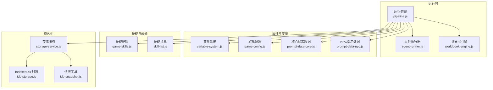
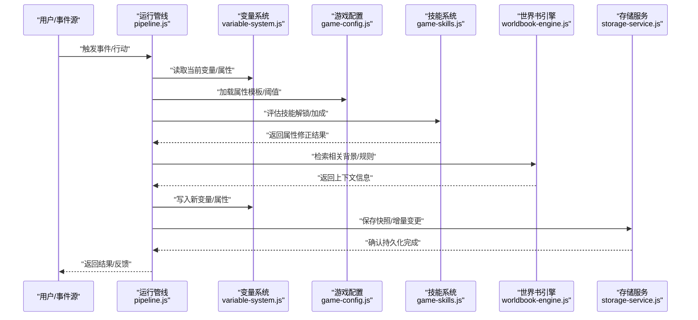
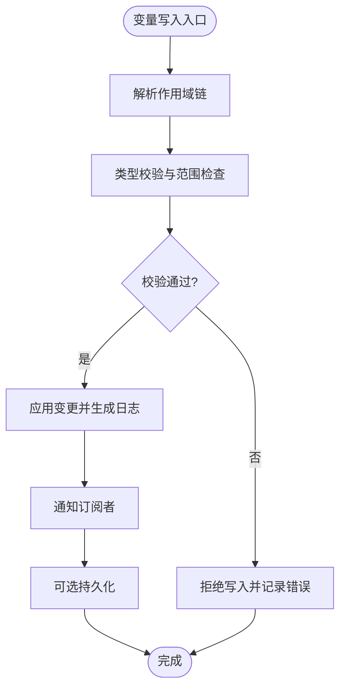
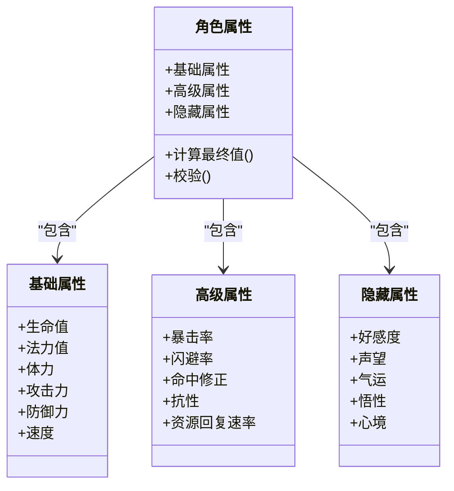
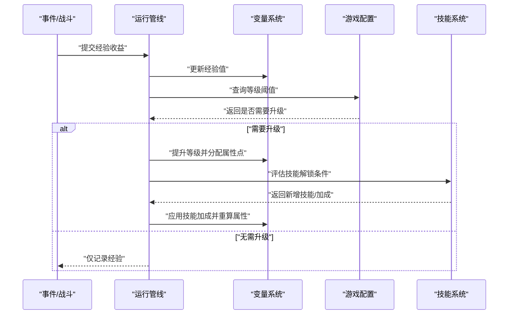
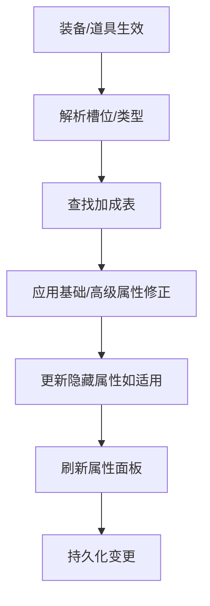
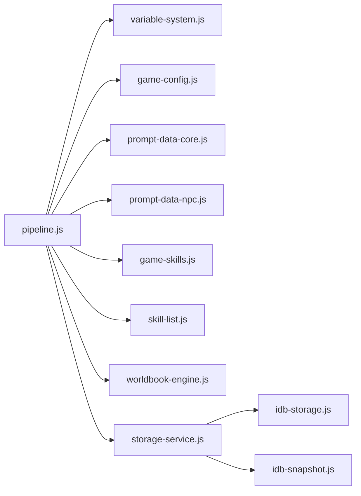

# 角色属性管理系统

<cite>
**本文引用的文件**   
- [variable-system.js](file://module/variable-system.js)
- [game-config.js](file://module/game-config.js)
- [prompt-data-core.js](file://module/prompt-data-core.js)
- [prompt-data-npc.js](file://module/prompt-data-npc.js)
- [game-skills.js](file://module/game-skills.js)
- [skill-list.js](file://module/skill-list.js)
- [pipeline.js](file://module/pipeline.js)
- [storage-service.js](file://module/storage-service.js)
- [idb-storage.js](file://module/idb-storage.js)
- [idb-snapshot.js](file://module/idb-snapshot.js)
- [event-runner.js](file://module/event-runner.js)
- [worldbook-engine.js](file://module/worldbook-engine.js)
- [game-helpers.js](file://module/game-helpers.js)
- [040主角属性.txt](file://char_card_information/040主角属性.txt)
</cite>

## 目录
1. [简介](#简介)
2. [项目结构](#项目结构)
3. [核心组件](#核心组件)
4. [架构总览](#架构总览)
5. [详细组件分析](#详细组件分析)
6. [依赖关系分析](#依赖关系分析)
7. [性能考虑](#性能考虑)
8. [故障排查指南](#故障排查指南)
9. [结论](#结论)
10. [附录](#附录)

## 简介
本技术文档围绕“姬侠传”的角色属性管理系统，系统性阐述以下方面：
- 角色属性的数据结构设计：基础属性、高级属性与隐藏属性的定义与管理机制
- 变量系统的实现原理：变量类型、作用域管理、生命周期控制
- 角色成长系统：经验值计算、等级提升、技能解锁等机制
- 装备系统与道具系统对角色属性的影响方式
- 角色数据验证与平衡性检查工具的使用方法
- 角色属性修改的最佳实践与性能优化建议
- 面向开发者完整的属性管理参考

## 项目结构
本项目采用模块化前端架构，角色属性相关能力主要分布在以下模块：
- 变量系统：负责变量的类型、作用域、生命周期与读写访问
- 配置与提示数据：集中定义角色属性、NPC属性、成长曲线与校验规则
- 技能系统：提供技能列表、解锁条件与属性加成
- 运行管线：串联事件执行、世界书检索、快照与存储
- 持久化：IndexedDB 存储、快照与回滚

图表来源
- [pipeline.js](file://module/pipeline.js)
- [variable-system.js](file://module/variable-system.js)
- [game-config.js](file://module/game-config.js)
- [prompt-data-core.js](file://module/prompt-data-core.js)
- [prompt-data-npc.js](file://module/prompt-data-npc.js)
- [game-skills.js](file://module/game-skills.js)
- [skill-list.js](file://module/skill-list.js)
- [worldbook-engine.js](file://module/worldbook-engine.js)
- [event-runner.js](file://module/event-runner.js)
- [storage-service.js](file://module/storage-service.js)
- [idb-storage.js](file://module/idb-storage.js)
- [idb-snapshot.js](file://module/idb-snapshot.js)

章节来源
- [pipeline.js](file://module/pipeline.js)
- [variable-system.js](file://module/variable-system.js)
- [game-config.js](file://module/game-config.js)
- [prompt-data-core.js](file://module/prompt-data-core.js)
- [prompt-data-npc.js](file://module/prompt-data-npc.js)
- [game-skills.js](file://module/game-skills.js)
- [skill-list.js](file://module/skill-list.js)
- [worldbook-engine.js](file://module/worldbook-engine.js)
- [event-runner.js](file://module/event-runner.js)
- [storage-service.js](file://module/storage-service.js)
- [idb-storage.js](file://module/idb-storage.js)
- [idb-snapshot.js](file://module/idb-snapshot.js)

## 核心组件
本节聚焦角色属性管理的核心组件及其职责边界。

- 变量系统（variable-system.js）
  - 提供统一的变量命名空间与作用域栈
  - 支持多种变量类型（数值、布尔、字符串、集合、时间戳等）
  - 提供生命周期钩子（创建、更新、销毁）与变更日志
  - 暴露安全读写接口，避免越权修改

- 游戏配置（game-config.js）
  - 集中维护角色属性模板、成长曲线、阈值与常量
  - 定义属性分类：基础属性、高级属性、隐藏属性
  - 提供默认值与校验规则

- 提示数据（prompt-data-core.js, prompt-data-npc.js）
  - 将属性与文本提示绑定，驱动 UI 展示与剧情分支
  - 为 NPC 与主角分别维护属性映射与初始状态

- 技能系统（game-skills.js, skill-list.js）
  - 维护技能清单、解锁条件与属性加成表
  - 在升级或达成条件时触发属性重算

- 运行管线（pipeline.js）
  - 编排事件、变量更新、技能判定、世界书检索与持久化
  - 作为属性变更的协调者，确保一致性

- 持久化（storage-service.js, idb-storage.js, idb-snapshot.js）
  - 将角色属性与变量快照落盘
  - 支持版本迁移与回滚

章节来源
- [variable-system.js](file://module/variable-system.js)
- [game-config.js](file://module/game-config.js)
- [prompt-data-core.js](file://module/prompt-data-core.js)
- [prompt-data-npc.js](file://module/prompt-data-npc.js)
- [game-skills.js](file://module/game-skills.js)
- [skill-list.js](file://module/skill-list.js)
- [pipeline.js](file://module/pipeline.js)
- [storage-service.js](file://module/storage-service.js)
- [idb-storage.js](file://module/idb-storage.js)
- [idb-snapshot.js](file://module/idb-snapshot.js)

## 架构总览
下图展示了角色属性在运行时的调用链路与数据流向。

图表来源
- [pipeline.js](file://module/pipeline.js)
- [variable-system.js](file://module/variable-system.js)
- [game-config.js](file://module/game-config.js)
- [game-skills.js](file://module/game-skills.js)
- [worldbook-engine.js](file://module/worldbook-engine.js)
- [storage-service.js](file://module/storage-service.js)

## 详细组件分析

### 变量系统（variable-system.js）
变量系统是角色属性管理的基石，承担类型约束、作用域隔离与生命周期管理。

- 变量类型
  - 数值型：整数、浮点，支持范围校验与溢出保护
  - 布尔型：开关类属性（如是否已解锁某技能）
  - 字符串型：标签、名称、描述等
  - 集合型：数组/字典，用于记录装备槽位、技能树节点等
  - 时间戳型：用于冷却、计时与周期性事件

- 作用域管理
  - 全局作用域：跨场景共享的属性（如角色等级、经验值）
  - 局部作用域：单次事件或对话内的临时变量
  - 嵌套作用域：支持函数式或块级作用域，便于复杂逻辑隔离

- 生命周期控制
  - 创建：初始化默认值并注册变更监听
  - 更新：原子写入，附带原因与来源，便于审计
  - 销毁：清理引用与缓存，释放内存

- 变更追踪与审计
  - 变更记录包含：变量名、旧值、新值、来源、时间戳
  - 支持回放与对比，辅助调试与平衡性分析

图表来源
- [variable-system.js](file://module/variable-system.js)

章节来源
- [variable-system.js](file://module/variable-system.js)

### 角色属性数据结构（基础/高级/隐藏）
属性按用途分层组织，便于扩展与维护。

- 基础属性
  - 示例：生命值、法力值、体力、攻击力、防御力、速度
  - 特点：直接参与战斗与交互计算，变化频繁

- 高级属性
  - 示例：暴击率、闪避率、命中修正、抗性、资源回复速率
  - 特点：由基础属性与外部加成综合得出，通常有上限与衰减

- 隐藏属性
  - 示例：好感度、声望、气运、悟性、心境
  - 特点：不直接显示，影响剧情分支、掉落概率与隐藏事件

- 数据来源
  - 默认模板来自配置与提示数据
  - 动态修正来自技能、装备、道具与事件

图表来源
- [game-config.js](file://module/game-config.js)
- [prompt-data-core.js](file://module/prompt-data-core.js)
- [prompt-data-npc.js](file://module/prompt-data-npc.js)
- [040主角属性.txt](file://char_card_information/040主角属性.txt)

章节来源
- [game-config.js](file://module/game-config.js)
- [prompt-data-core.js](file://module/prompt-data-core.js)
- [prompt-data-npc.js](file://module/prompt-data-npc.js)
- [040主角属性.txt](file://char_card_information/040主角属性.txt)

### 角色成长系统（经验值、等级、技能解锁）
成长系统以变量系统为核心，结合配置与技能清单进行统一调度。

- 经验值计算
  - 输入：事件奖励、战斗结算、任务完成
  - 处理：累加至当前经验，触发升级检测
  - 输出：等级提升、属性点分配、技能解锁

- 等级提升
  - 依据配置中的等级曲线计算所需经验
  - 提升后重新计算基础与高级属性
  - 触发隐藏属性变化（如心境提升）

- 技能解锁
  - 条件：等级、前置技能、隐藏属性阈值
  - 效果：增加被动加成或解锁主动技能
  - 联动：更新属性面板与提示数据

图表来源
- [pipeline.js](file://module/pipeline.js)
- [variable-system.js](file://module/variable-system.js)
- [game-config.js](file://module/game-config.js)
- [game-skills.js](file://module/game-skills.js)
- [skill-list.js](file://module/skill-list.js)

章节来源
- [pipeline.js](file://module/pipeline.js)
- [variable-system.js](file://module/variable-system.js)
- [game-config.js](file://module/game-config.js)
- [game-skills.js](file://module/game-skills.js)
- [skill-list.js](file://module/skill-list.js)

### 装备系统与道具系统对属性的影响
- 装备系统
  - 槽位管理：武器、防具、饰品等
  - 属性加成：基础属性提升、高级属性修正
  - 特殊效果：触发技能、改变隐藏属性（如声望）

- 道具系统
  - 一次性效果：恢复生命/法力、临时增益
  - 持续性效果：Buff/Debuff，随时间衰减
  - 消耗与库存：通过集合型变量管理

- 影响流程
  - 穿戴/使用 -> 计算加成 -> 更新属性 -> 持久化

图表来源
- [variable-system.js](file://module/variable-system.js)
- [game-config.js](file://module/game-config.js)
- [prompt-data-core.js](file://module/prompt-data-core.js)

章节来源
- [variable-system.js](file://module/variable-system.js)
- [game-config.js](file://module/game-config.js)
- [prompt-data-core.js](file://module/prompt-data-core.js)

### 数据验证与平衡性检查工具
- 数据验证
  - 类型与范围：确保属性值在合法区间
  - 依赖关系：检查前置条件与解锁顺序
  - 冲突检测：识别重复或互斥属性

- 平衡性检查
  - 经验曲线：验证升级难度是否合理
  - 属性增长：监控长期增长趋势
  - 技能强度：评估加成幅度与覆盖率

- 使用方法
  - 在开发阶段批量导入配置与数据
  - 运行校验脚本，查看报告与告警
  - 根据报告调整阈值与公式

章节来源
- [game-config.js](file://module/game-config.js)
- [prompt-data-core.js](file://module/prompt-data-core.js)

### 最佳实践与性能优化建议
- 最佳实践
  - 使用变量系统进行统一读写，避免直接操作底层对象
  - 将属性模板与业务逻辑解耦，便于迭代
  - 变更前先做校验，失败快速失败并记录日志
  - 对关键路径（升级、装备切换）进行幂等处理

- 性能优化
  - 批量更新：合并多次属性变更，减少持久化次数
  - 懒加载：按需加载技能与属性数据
  - 缓存热点：对常用计算结果进行短期缓存
  - 异步持久化：非阻塞写入，避免主线程卡顿

章节来源
- [variable-system.js](file://module/variable-system.js)
- [pipeline.js](file://module/pipeline.js)
- [storage-service.js](file://module/storage-service.js)

## 依赖关系分析
角色属性管理涉及多模块协作，以下为关键依赖图。

图表来源
- [pipeline.js](file://module/pipeline.js)
- [variable-system.js](file://module/variable-system.js)
- [game-config.js](file://module/game-config.js)
- [prompt-data-core.js](file://module/prompt-data-core.js)
- [prompt-data-npc.js](file://module/prompt-data-npc.js)
- [game-skills.js](file://module/game-skills.js)
- [skill-list.js](file://module/skill-list.js)
- [worldbook-engine.js](file://module/worldbook-engine.js)
- [storage-service.js](file://module/storage-service.js)
- [idb-storage.js](file://module/idb-storage.js)
- [idb-snapshot.js](file://module/idb-snapshot.js)

章节来源
- [pipeline.js](file://module/pipeline.js)
- [variable-system.js](file://module/variable-system.js)
- [game-config.js](file://module/game-config.js)
- [prompt-data-core.js](file://module/prompt-data-core.js)
- [prompt-data-npc.js](file://module/prompt-data-npc.js)
- [game-skills.js](file://module/game-skills.js)
- [skill-list.js](file://module/skill-list.js)
- [worldbook-engine.js](file://module/worldbook-engine.js)
- [storage-service.js](file://module/storage-service.js)
- [idb-storage.js](file://module/idb-storage.js)
- [idb-snapshot.js](file://module/idb-snapshot.js)

## 性能考虑
- 属性重算频率控制：仅在必要时机触发（升级、装备切换、技能解锁）
- 增量持久化：只保存差异，降低 I/O 压力
- 计算缓存：对复杂公式的结果进行短期缓存
- 异步与批处理：将耗时操作移出主线程，合并写入

[本节为通用指导，不涉及具体文件分析]

## 故障排查指南
- 常见问题
  - 属性异常：检查变量类型与范围校验
  - 升级卡住：核对经验阈值与等级曲线
  - 技能未解锁：确认前置条件与隐藏属性阈值
  - 持久化失败：检查 IndexedDB 权限与容量

- 定位方法
  - 启用变更日志，回溯最近一次属性写入
  - 使用快照对比，定位差异点
  - 在关键路径添加断点与日志

章节来源
- [variable-system.js](file://module/variable-system.js)
- [idb-snapshot.js](file://module/idb-snapshot.js)
- [storage-service.js](file://module/storage-service.js)

## 结论
本系统通过变量系统统一管理角色属性，结合配置与技能清单实现成长与加成，借助运行管线与世界书引擎保障一致性与可解释性，并通过持久化与快照机制确保数据安全与可回溯。遵循本文的最佳实践与性能建议，可有效提升系统的稳定性与可维护性。

[本节为总结，不涉及具体文件分析]

## 附录
- 术语表
  - 基础属性：直接影响战斗与交互的核心数值
  - 高级属性：由基础属性与外部加成推导出的复合指标
  - 隐藏属性：不直接显示但影响剧情与概率的内在指标
  - 变量作用域：变量的可见范围与生命周期
  - 快照：某一时刻的全量或增量数据备份

- 参考文件
  - 主角属性模板：[040主角属性.txt](file://char_card_information/040主角属性.txt)

[本节为补充说明，不涉及具体文件分析]