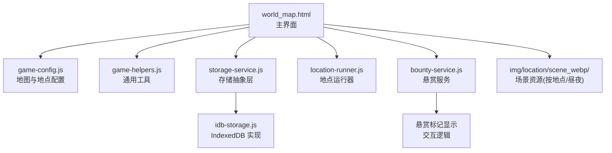
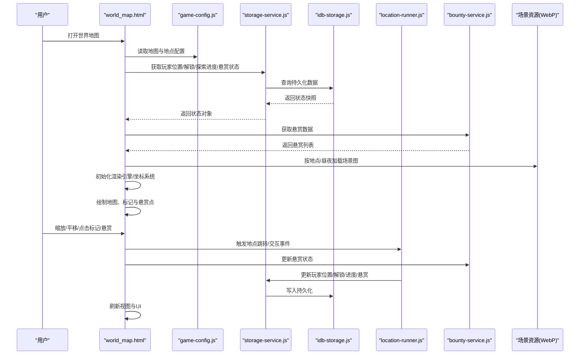
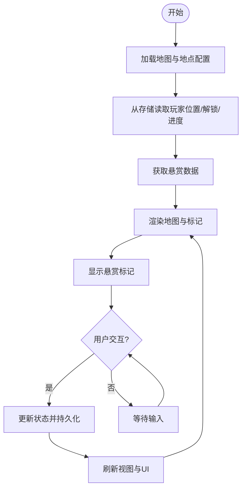
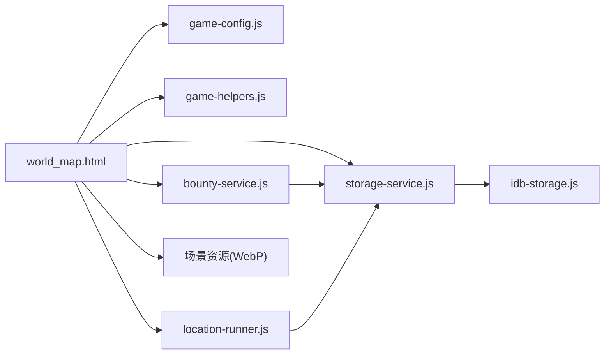

# 世界地图

<cite>
**本文引用的文件**   
- [world_map.html](file://world_map.html)
- [game-config.js](file://module/game-config.js)
- [game-helpers.js](file://module/game-helpers.js)
- [storage-service.js](file://module/storage-service.js)
- [idb-storage.js](file://module/idb-storage.js)
- [location-runner.js](file://module/location-runner.js)
- [bounty-service.js](file://module/bounty-service.js)
- [scene_webp/伊州/昼/背景.webp](file://img/location/scene_webp/伊州/昼/背景.webp)
- [scene_webp/伊州/夜/背景.webp](file://img/location/scene_webp/伊州/夜/背景.webp)
</cite>

## 更新摘要
**所做更改**   
- 新增悬赏系统地图显示功能，集成28行新代码
- 添加悬赏标记类型和交互逻辑
- 扩展地图标记系统以支持悬赏任务可视化
- 更新状态同步机制以处理悬赏数据

## 目录
1. [简介](#简介)
2. [项目结构](#项目结构)
3. [核心组件](#核心组件)
4. [架构总览](#架构总览)
5. [详细组件分析](#详细组件分析)
6. [依赖关系分析](#依赖关系分析)
7. [性能考虑](#性能考虑)
8. [故障排查指南](#故障排查指南)
9. [结论](#结论)
10. [附录](#附录)

## 简介
本技术文档围绕"姬侠传"的世界地图系统，系统性阐述其实现架构与关键技术点。内容涵盖：
- 地图渲染引擎、坐标系统与缩放平移交互
- 地图标记系统（位置图标、路径显示、导航提示、悬赏标记）
- 地图与游戏状态同步（玩家位置更新、解锁区域显示、探索进度追踪、悬赏状态同步）
- 资源组织与优化（场景图片、WebP格式、响应式适配）
- 自定义开发指南（新地图添加、标记配置、事件绑定）
- 性能优化策略（懒加载、缓存机制、内存管理）

## 项目结构
世界地图由一个主页面与若干模块组成，核心入口为 world_map.html；地图数据与配置集中于 game-config.js；通用工具与存储逻辑位于 game-helpers.js、storage-service.js、idb-storage.js；地点运行与流程控制由 location-runner.js 负责；悬赏系统集成通过 bounty-service.js 实现；场景资源以 WebP 形式按地点与昼夜分类存放于 img/location/scene_webp 下。

图表来源
- [world_map.html](file://world_map.html)
- [game-config.js](file://module/game-config.js)
- [game-helpers.js](file://module/game-helpers.js)
- [storage-service.js](file://module/storage-service.js)
- [idb-storage.js](file://module/idb-storage.js)
- [location-runner.js](file://module/location-runner.js)
- [bounty-service.js](file://module/bounty-service.js)
- [scene_webp/伊州/昼/背景.webp](file://img/location/scene_webp/伊州/昼/背景.webp)
- [scene_webp/伊州/夜/背景.webp](file://img/location/scene_webp/伊州/夜/背景.webp)

章节来源
- [world_map.html](file://world_map.html)
- [game-config.js](file://module/game-config.js)
- [game-helpers.js](file://module/game-helpers.js)
- [storage-service.js](file://module/storage-service.js)
- [idb-storage.js](file://module/idb-storage.js)
- [location-runner.js](file://module/location-runner.js)
- [bounty-service.js](file://module/bounty-service.js)

## 核心组件
- 地图渲染引擎
  - 基于 HTML/CSS/JS 的 Canvas 或 DOM 图层叠加方案，负责瓦片/大图绘制、视口变换与重绘调度。
  - 支持多分辨率资源切换与按需加载，结合 CSS transform 实现平滑缩放和平移。
- 坐标系统
  - 采用"世界坐标-屏幕坐标"双坐标系映射，统一处理缩放因子与偏移量，保证点击命中检测与 UI 元素对齐。
- 缩放与平移交互
  - 通过指针事件（鼠标/触摸）捕获拖拽与滚轮缩放，使用节流/防抖与 requestAnimationFrame 合成帧，避免卡顿。
- 地图标记系统
  - 标记类型包括：当前位置、可进入地点、已解锁/未解锁区域、路径连线、导航箭头、悬赏标记等。
  - 标记层级与可见性随缩放级别动态调整，避免重叠与遮挡。
- 悬赏系统集成
  - 通过 bounty-service.js 提供悬赏数据的获取、显示和交互功能。
  - 支持悬赏任务的地图标注、状态更新和完成反馈。
- 状态同步
  - 玩家位置、区域解锁、探索进度、悬赏状态等持久化到 IndexedDB，并在地图打开时拉取最新状态进行渲染。
- 资源组织
  - 场景图按"地点/昼夜"分目录，优先使用 WebP 提升压缩比与加载速度；提供白天/夜晚两套资源。

章节来源
- [world_map.html](file://world_map.html)
- [game-config.js](file://module/game-config.js)
- [game-helpers.js](file://module/game-helpers.js)
- [storage-service.js](file://module/storage-service.js)
- [idb-storage.js](file://module/idb-storage.js)
- [location-runner.js](file://module/location-runner.js)
- [bounty-service.js](file://module/bounty-service.js)

## 架构总览
下图展示世界地图系统的整体架构与关键数据流：页面初始化后从配置加载地图元数据，根据当前地点与昼夜选择场景资源；读取存储中的玩家位置、解锁状态和悬赏信息；在渲染循环中计算视口并绘制地图与标记；用户交互触发状态变更并持久化。

图表来源
- [world_map.html](file://world_map.html)
- [game-config.js](file://module/game-config.js)
- [storage-service.js](file://module/storage-service.js)
- [idb-storage.js](file://module/idb-storage.js)
- [location-runner.js](file://module/location-runner.js)
- [bounty-service.js](file://module/bounty-service.js)

## 详细组件分析

### 地图渲染引擎
- 设计要点
  - 视口矩阵：维护缩放比例与偏移，将世界坐标转换为屏幕坐标。
  - 分层绘制：底层为场景大图，上层为标记与路径矢量图形。
  - 增量重绘：仅重绘变化区域，减少 CPU/GPU 压力。
- 交互处理
  - 拖拽平移：记录起始位置与移动差值，更新偏移量。
  - 滚轮缩放：限制最小/最大缩放范围，以光标为中心缩放。
  - 命中检测：根据缩放与偏移反算点击落点，判断是否命中标记。
- 错误与边界
  - 资源缺失回退：若指定 WebP 不可用，自动降级至 PNG/JPG。
  - 越界保护：防止缩放过小导致像素模糊或过大导致溢出。

章节来源
- [world_map.html](file://world_map.html)
- [game-helpers.js](file://module/game-helpers.js)

### 坐标系统与变换
- 坐标定义
  - 世界坐标：地图原点在左上角，X向右、Y向下。
  - 屏幕坐标：浏览器窗口坐标系，原点左上角。
- 变换公式
  - 屏幕坐标 = (世界坐标 × 缩放) + 偏移
  - 反向映射用于点击命中与标记定位。
- 精度与性能
  - 使用浮点数保持高精度，必要时对坐标取整以减少抖动。
  - 批量更新变换属性，避免频繁回流。

章节来源
- [world_map.html](file://world_map.html)
- [game-helpers.js](file://module/game-helpers.js)

### 缩放与平移交互
- 事件模型
  - PointerEvent 统一处理鼠标与触摸，简化跨设备兼容。
  - 滚轮事件用于缩放，长按+拖动用于平移。
- 动画与节流
  - 使用 requestAnimationFrame 驱动平滑过渡。
  - 对高频事件进行节流，降低主线程负载。
- 用户体验
  - 缩放中心跟随光标，提升操作直觉性。
  - 双击快速缩放至合适级别，便于查看细节。

章节来源
- [world_map.html](file://world_map.html)
- [game-helpers.js](file://module/game-helpers.js)

### 地图标记系统
- 标记类型
  - 当前位置：高亮显示，带呼吸动效。
  - 可进入地点：点击后触发跳转或对话。
  - 已解锁/未解锁区域：不同样式区分，未解锁显示锁形图标。
  - 路径与导航：虚线连接相邻节点，箭头指示方向。
  - 悬赏标记：特殊样式标识悬赏任务位置，支持状态变化显示。
- 可见性与层级
  - 根据缩放级别动态显示/隐藏低优先级标记。
  - 标记层级高于地图底图，低于 UI 控件。
  - 悬赏标记具有特殊视觉样式，便于玩家识别。
- 交互反馈
  - 悬停显示名称与简要信息。
  - 点击弹出详情面板或执行动作。
  - 悬赏标记点击后显示任务详情和完成选项。

章节来源
- [world_map.html](file://world_map.html)
- [game-config.js](file://module/game-config.js)
- [bounty-service.js](file://module/bounty-service.js)

### 悬赏系统集成
- 数据获取
  - 通过 bounty-service.js 接口获取当前可用的悬赏任务列表。
  - 支持按地区筛选和状态过滤。
- 地图显示
  - 在对应地理位置显示悬赏标记点。
  - 根据悬赏等级和状态调整标记样式。
- 交互逻辑
  - 点击悬赏标记显示任务详情。
  - 支持直接接受悬赏任务或跳转到相关NPC。
- 状态同步
  - 悬赏完成状态实时更新到地图显示。
  - 支持悬赏任务的取消和重新发布。

图表来源
- [world_map.html](file://world_map.html)
- [storage-service.js](file://module/storage-service.js)
- [idb-storage.js](file://module/idb-storage.js)
- [bounty-service.js](file://module/bounty-service.js)

章节来源
- [storage-service.js](file://module/storage-service.js)
- [idb-storage.js](file://module/idb-storage.js)
- [world_map.html](file://world_map.html)
- [bounty-service.js](file://module/bounty-service.js)

### 地图与游戏状态同步
- 数据模型
  - 玩家位置：当前所在地点与子区域。
  - 解锁状态：各地点是否已解锁。
  - 探索进度：访问次数、完成度百分比。
  - 悬赏状态：已完成/进行中/未接取的悬赏任务。
- 持久化
  - 通过 storage-service.js 抽象接口，底层 idb-storage.js 使用 IndexedDB 存储。
  - 变更合并策略：本地优先，冲突时保留最近修改。
- 同步时机
  - 地图打开时拉取最新状态。
  - 玩家移动、解锁区域、完成任务后即时写入。
  - 悬赏状态变更时实时更新。
  - 定时快照：周期性保存，防止丢失。

章节来源
- [storage-service.js](file://module/storage-service.js)
- [idb-storage.js](file://module/idb-storage.js)
- [world_map.html](file://world_map.html)
- [bounty-service.js](file://module/bounty-service.js)

### 资源组织与优化
- 目录结构
  - 按地点与昼夜划分，如"伊州/昼"、"伊州/夜"，便于按需加载。
- 格式与压缩
  - 优先使用 WebP，兼顾质量与体积；提供降级路径。
  - 预生成多分辨率缩略图，加速首屏渲染。
- 响应式适配
  - 根据设备像素比与屏幕尺寸选择合适资源。
  - 使用 CSS 媒体查询与 JS 动态加载组合策略。

章节来源
- [scene_webp/伊州/昼/背景.webp](file://img/location/scene_webp/伊州/昼/背景.webp)
- [scene_webp/伊州/夜/背景.webp](file://img/location/scene_webp/伊州/夜/背景.webp)
- [world_map.html](file://world_map.html)

### 自定义开发指南
- 新增地图与地点
  - 在配置文件中注册新地点元数据（名称、坐标、资源路径、昼夜变体）。
  - 准备对应场景资源，遵循"地点/昼夜"命名规范。
- 配置标记点
  - 在地点配置中添加标记项，指定类型、坐标、交互行为。
  - 为不同类型标记设置样式与可见性规则。
  - 支持悬赏标记的特殊配置。
- 绑定交互事件
  - 在页面初始化阶段注册点击/悬停回调。
  - 调用 runner 方法触发地点跳转或剧情流程。
  - 集成悬赏服务的交互回调。
- 状态扩展
  - 如需新增字段（如任务进度），在存储层增加读写接口，并确保迁移兼容。
  - 扩展悬赏状态的数据结构和同步逻辑。

章节来源
- [game-config.js](file://module/game-config.js)
- [location-runner.js](file://module/location-runner.js)
- [world_map.html](file://world_map.html)
- [bounty-service.js](file://module/bounty-service.js)

## 依赖关系分析
- 模块耦合
  - world_map.html 作为入口，依赖配置、工具、存储与地点运行器。
  - storage-service.js 解耦具体存储实现，idb-storage.js 提供持久化能力。
  - bounty-service.js 独立提供悬赏功能，与地图系统松耦合集成。
- 外部依赖
  - 浏览器原生 API：Canvas/DOM、PointerEvent、IndexedDB。
  - 资源加载：Image/WebP 解码与缓存。
- 潜在风险
  - 循环依赖需避免，确保单向依赖链。
  - 大资源加载失败时的回退与重试策略要完善。
  - 悬赏服务异常时的容错处理。

图表来源
- [world_map.html](file://world_map.html)
- [game-config.js](file://module/game-config.js)
- [game-helpers.js](file://module/game-helpers.js)
- [storage-service.js](file://module/storage-service.js)
- [idb-storage.js](file://module/idb-storage.js)
- [location-runner.js](file://module/location-runner.js)
- [bounty-service.js](file://module/bounty-service.js)

章节来源
- [world_map.html](file://world_map.html)
- [game-config.js](file://module/game-config.js)
- [game-helpers.js](file://module/game-helpers.js)
- [storage-service.js](file://module/storage-service.js)
- [idb-storage.js](file://module/idb-storage.js)
- [location-runner.js](file://module/location-runner.js)
- [bounty-service.js](file://module/bounty-service.js)

## 性能考虑
- 懒加载
  - 仅加载当前视口内的标记与邻近资源，滚动/缩放时动态补充。
  - 悬赏标记按需加载，避免初始加载过多数据。
- 缓存机制
  - 图像与配置结果缓存，避免重复请求与解析。
  - 使用内存缓存与 IndexedDB 二级缓存，平衡速度与容量。
  - 悬赏数据缓存，减少重复查询。
- 内存管理
  - 及时释放不再使用的纹理与对象引用。
  - 监控内存峰值，必要时主动清理历史快照。
  - 悬赏标记的动态创建和销毁。
- 渲染优化
  - 批量更新 DOM/CSS 属性，减少重排重绘。
  - 使用离屏渲染与合成层，提升移动端流畅度。
  - 悬赏标记的批量渲染优化。

## 故障排查指南
- 常见问题
  - 场景资源加载失败：检查路径与 MIME 类型，确认 WebP 可用性并提供降级。
  - 坐标错位：核对缩放与偏移计算，验证点击命中逻辑。
  - 状态不同步：确认存储读写接口返回值与键名一致，检查事务提交。
  - 悬赏标记不显示：检查悬赏数据获取是否正常，确认标记配置正确。
- 调试建议
  - 打印关键变量（缩放、偏移、坐标转换结果）。
  - 使用浏览器开发者工具的 Performance 面板分析帧率与耗时。
  - 在存储层增加日志，观察写入与读取时序。
  - 监控悬赏服务的API调用和数据返回。

章节来源
- [world_map.html](file://world_map.html)
- [storage-service.js](file://module/storage-service.js)
- [idb-storage.js](file://module/idb-storage.js)
- [bounty-service.js](file://module/bounty-service.js)

## 结论
世界地图系统以模块化架构为基础，结合高效的渲染与交互机制，实现了可扩展、高性能的地图体验。通过清晰的资源组织与完善的同步策略，系统在功能与性能之间取得良好平衡。新增的悬赏系统集成进一步丰富了地图的功能性，为玩家提供了更丰富的游戏互动体验。后续可在标记丰富度、路径规划与多人协作方面持续演进。

## 附录
- 术语表
  - 世界坐标：地图全局坐标系。
  - 屏幕坐标：浏览器窗口坐标系。
  - 视口：当前可见的地图区域。
  - 标记：地图上表示地点、路径、状态的可视化元素。
  - 悬赏标记：特殊类型的地图标记，用于显示悬赏任务位置。
- 参考资源
  - 场景资源示例：img/location/scene_webp/伊州/昼/背景.webp、img/location/scene_webp/伊州/夜/背景.webp
  - 悬赏服务接口：bounty-service.js