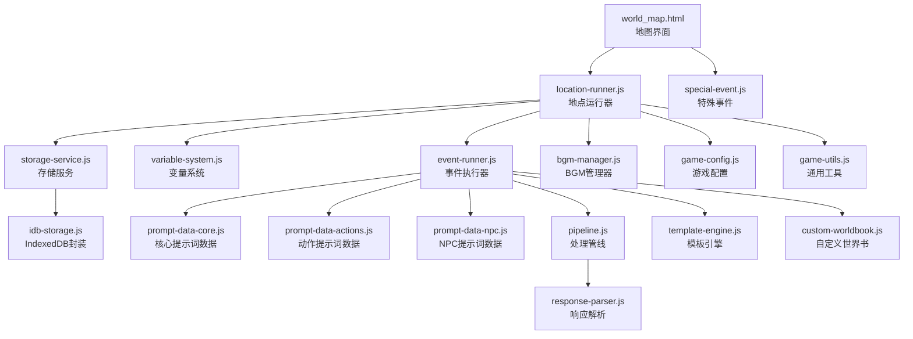
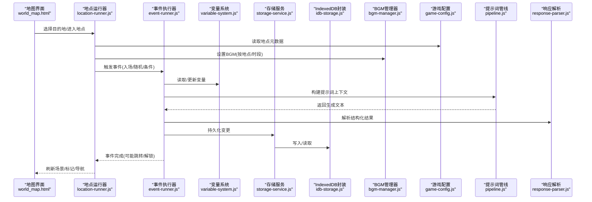
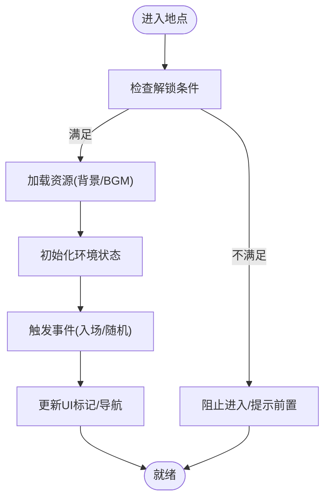
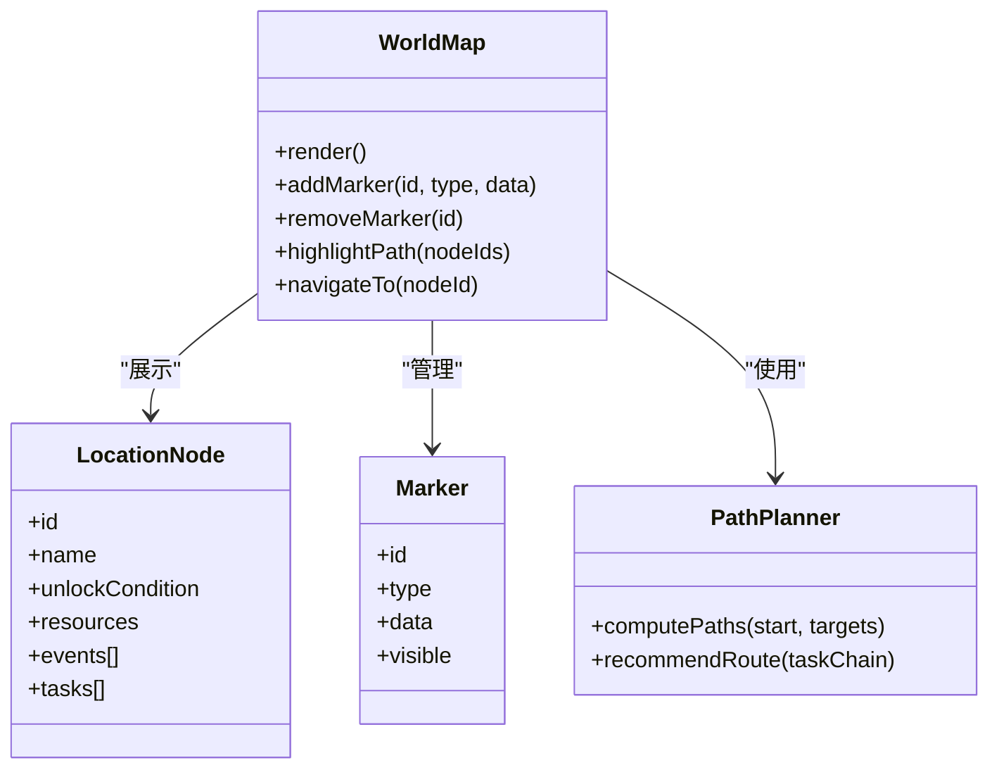
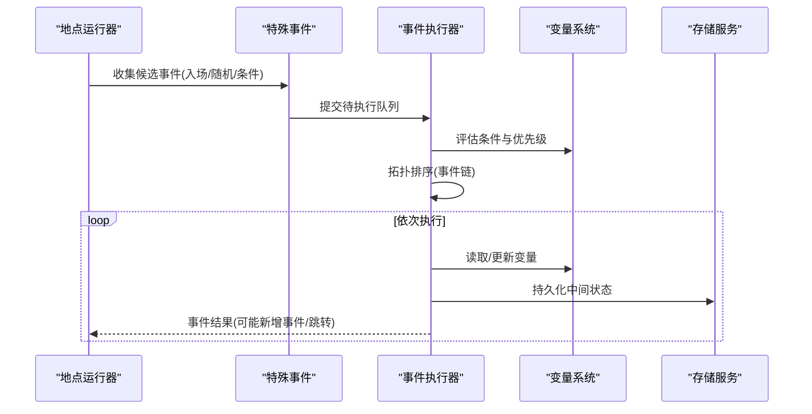
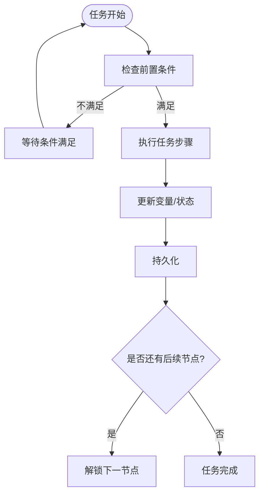
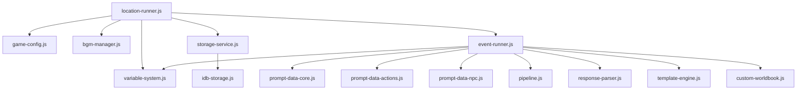

# 世界探索系统

<cite>
**本文引用的文件**   
- [world_map.html](file://world_map.html)
- [location-runner.js](file://module/location-runner.js)
- [special-event.js](file://module/special-event.js)
- [game-events.js](file://module/game-events.js)
- [event-runner.js](file://module/event-runner.js)
- [variable-system.js](file://module/variable-system.js)
- [storage-service.js](file://module/storage-service.js)
- [idb-storage.js](file://module/idb-storage.js)
- [game-config.js](file://module/game-config.js)
- [bgm-manager.js](file://module/bgm-manager.js)
- [game-utils.js](file://module/game-utils.js)
- [prompt-data-core.js](file://module/prompt-data-core.js)
- [prompt-data-actions.js](file://module/prompt-data-actions.js)
- [prompt-data-npc.js](file://module/prompt-data-npc.js)
- [pipeline.js](file://module/pipeline.js)
- [response-parser.js](file://module/response-parser.js)
- [template-engine.js](file://module/template-engine.js)
- [custom-worldbook.js](file://module/custom-worldbook.js)
- [index - SR.html](file://index - SR.html)
</cite>

## 目录
1. [简介](#简介)
2. [项目结构](#项目结构)
3. [核心组件](#核心组件)
4. [架构总览](#架构总览)
5. [详细组件分析](#详细组件分析)
6. [依赖关系分析](#依赖关系分析)
7. [性能考量](#性能考量)
8. [故障排查指南](#故障排查指南)
9. [结论](#结论)
10. [附录：开发指南与资源组织](#附录开发指南与资源组织)

## 简介
本技术文档面向“姬侠传”开放世界探索系统的开发者与维护者，聚焦地点系统、世界地图、特殊事件、任务与剧情推进等核心模块。文档从数据模型、场景切换、环境状态管理、交互设计到扩展开发进行系统化说明，并提供可视化架构图与流程图，帮助读者快速理解并高效迭代。

## 项目结构
围绕世界探索系统的关键代码主要分布在以下位置：
- 前端入口与地图页面：world_map.html、index - SR.html
- 地点运行器与事件系统：module/location-runner.js、module/special-event.js、module/event-runner.js
- 全局事件总线与变量系统：module/game-events.js、module/variable-system.js
- 存储与配置：module/storage-service.js、module/idb-storage.js、module/game-config.js
- 音频与环境：module/bgm-manager.js
- 工具与模板：module/game-utils.js、module/template-engine.js
- 提示词与内容编排：module/prompt-data-core.js、module/prompt-data-actions.js、module/prompt-data-npc.js、module/pipeline.js、module/response-parser.js、module/custom-worldbook.js

图表来源
- [world_map.html](file://world_map.html)
- [location-runner.js](file://module/location-runner.js)
- [special-event.js](file://module/special-event.js)
- [event-runner.js](file://module/event-runner.js)
- [variable-system.js](file://module/variable-system.js)
- [storage-service.js](file://module/storage-service.js)
- [idb-storage.js](file://module/idb-storage.js)
- [bgm-manager.js](file://module/bgm-manager.js)
- [game-config.js](file://module/game-config.js)
- [game-utils.js](file://module/game-utils.js)
- [prompt-data-core.js](file://module/prompt-data-core.js)
- [prompt-data-actions.js](file://module/prompt-data-actions.js)
- [prompt-data-npc.js](file://module/prompt-data-npc.js)
- [pipeline.js](file://module/pipeline.js)
- [response-parser.js](file://module/response-parser.js)
- [template-engine.js](file://module/template-engine.js)
- [custom-worldbook.js](file://module/custom-worldbook.js)

章节来源
- [world_map.html](file://world_map.html)
- [index - SR.html](file://index - SR.html)

## 核心组件
- 地点运行器（location-runner.js）：负责加载地点元数据、渲染场景、驱动事件循环、维护环境状态（昼夜、天气、区域解锁）、触发特殊事件与任务分支。
- 特殊事件系统（special-event.js）：定义可插拔的事件类型、条件判定、优先级与链式触发逻辑，支持一次性事件与周期性事件。
- 事件执行器（event-runner.js）：统一调度事件生命周期，协调变量系统、提示词数据、模板引擎与响应解析，确保事件结果持久化。
- 变量系统（variable-system.js）：提供全局/局部变量读写、表达式求值、条件判断与副作用回调，支撑剧情与任务状态机。
- 存储服务（storage-service.js / idb-storage.js）：抽象持久化接口，默认基于 IndexedDB，提供快照、增量同步与回滚能力。
- 配置与工具（game-config.js / game-utils.js）：集中管理地点清单、资源路径、默认参数与常用算法。
- 音频与环境（bgm-manager.js）：按地点与时间维度播放背景音乐，支持淡入淡出与中断恢复。
- 提示词与内容编排（prompt-data-*、pipeline.js、response-parser.js、template-engine.js、custom-worldbook.js）：将地点上下文、玩家状态、NPC信息组装为结构化提示词，交由后端或本地引擎生成文本，再由解析器抽取结构化结果。

章节来源
- [location-runner.js](file://module/location-runner.js)
- [special-event.js](file://module/special-event.js)
- [event-runner.js](file://module/event-runner.js)
- [variable-system.js](file://module/variable-system.js)
- [storage-service.js](file://module/storage-service.js)
- [idb-storage.js](file://module/idb-storage.js)
- [game-config.js](file://module/game-config.js)
- [game-utils.js](file://module/game-utils.js)
- [bgm-manager.js](file://module/bgm-manager.js)
- [prompt-data-core.js](file://module/prompt-data-core.js)
- [prompt-data-actions.js](file://module/prompt-data-actions.js)
- [prompt-data-npc.js](file://module/prompt-data-npc.js)
- [pipeline.js](file://module/pipeline.js)
- [response-parser.js](file://module/response-parser.js)
- [template-engine.js](file://module/template-engine.js)
- [custom-worldbook.js](file://module/custom-worldbook.js)

## 架构总览
世界探索系统采用“页面-运行器-事件-数据-存储”的分层架构。地图页面作为交互入口，调用地点运行器完成场景切换；运行器通过事件执行器驱动事件链，借助变量系统与存储实现状态持久化；提示词与模板引擎负责内容生成与解析，最终反馈至UI与状态。

图表来源
- [world_map.html](file://world_map.html)
- [location-runner.js](file://module/location-runner.js)
- [event-runner.js](file://module/event-runner.js)
- [variable-system.js](file://module/variable-system.js)
- [storage-service.js](file://module/storage-service.js)
- [idb-storage.js](file://module/idb-storage.js)
- [bgm-manager.js](file://module/bgm-manager.js)
- [game-config.js](file://module/game-config.js)
- [pipeline.js](file://module/pipeline.js)
- [response-parser.js](file://module/response-parser.js)

## 详细组件分析

### 地点系统（数据结构、场景切换、环境状态）
- 数据结构
  - 地点元数据：包含名称、坐标、资源路径（背景图、BGM）、解锁条件、关联事件列表、任务节点、昼夜/天气变体等。
  - 环境状态：当前地点、时间片（昼/夜）、天气、已解锁子区域、访客限制、动态标记集合。
- 场景切换逻辑
  - 校验解锁条件与前置任务进度。
  - 加载对应资源（图片、音频），初始化环境状态。
  - 触发入场事件与随机事件，更新UI标记与导航。
- 环境状态管理
  - 通过变量系统维护全局/局部状态，支持表达式与副作用。
  - 使用存储服务进行增量保存与快照，支持回滚与跨会话恢复。

图表来源
- [location-runner.js](file://module/location-runner.js)
- [game-config.js](file://module/game-config.js)
- [variable-system.js](file://module/variable-system.js)
- [storage-service.js](file://module/storage-service.js)
- [idb-storage.js](file://module/idb-storage.js)
- [bgm-manager.js](file://module/bgm-manager.js)

章节来源
- [location-runner.js](file://module/location-runner.js)
- [game-config.js](file://module/game-config.js)
- [variable-system.js](file://module/variable-system.js)
- [storage-service.js](file://module/storage-service.js)
- [idb-storage.js](file://module/idb-storage.js)
- [bgm-manager.js](file://module/bgm-manager.js)

### 世界地图（导航界面、位置标记、路径规划）
- 导航界面
  - 以地图画布承载地点节点与连线，支持缩放与拖拽。
  - 根据解锁状态与任务进度高亮可用路径。
- 位置标记
  - 动态标记：事件触发点、任务目标、隐藏线索等，支持点击查看详情。
  - 状态标记：已访问、已完成、进行中、失败。
- 路径规划
  - 基于地点连通性与解锁条件计算可达路径。
  - 支持一键导航至最近可用节点，或按任务线推荐路线。

图表来源
- [world_map.html](file://world_map.html)
- [location-runner.js](file://module/location-runner.js)
- [game-config.js](file://module/game-config.js)

章节来源
- [world_map.html](file://world_map.html)
- [location-runner.js](file://module/location-runner.js)
- [game-config.js](file://module/game-config.js)

### 特殊事件系统（触发机制与事件链管理）
- 事件类型
  - 一次性事件：仅触发一次，完成后记录状态。
  - 周期事件：按时间片或条件重复触发。
  - 条件事件：依赖变量表达式与前置任务进度。
- 触发机制
  - 入场触发：进入地点时立即评估。
  - 随机触发：在特定时间段或行为后概率触发。
  - 任务触发：由任务节点推进引发。
- 事件链管理
  - 事件间存在先后依赖，形成有向无环图（DAG）。
  - 执行器按拓扑顺序调度，保证前置条件满足后再执行后续事件。
  - 支持中断与回滚，异常时保留一致状态。

图表来源
- [special-event.js](file://module/special-event.js)
- [event-runner.js](file://module/event-runner.js)
- [variable-system.js](file://module/variable-system.js)
- [storage-service.js](file://module/storage-service.js)

章节来源
- [special-event.js](file://module/special-event.js)
- [event-runner.js](file://module/event-runner.js)
- [variable-system.js](file://module/variable-system.js)
- [storage-service.js](file://module/storage-service.js)

### 任务系统与剧情推进（地点相关）
- 任务节点
  - 每个地点可绑定若干任务节点，节点包含目标、前置条件、奖励与后续节点。
- 推进逻辑
  - 事件执行完成后更新任务状态，自动解锁下一节点。
  - 任务失败或超时可通过重试机制恢复。
- 剧情编排
  - 结合提示词管线与模板引擎，将地点上下文、角色关系与玩家选择注入故事生成流程。
  - 解析器抽取关键剧情要素，反哺变量系统与UI表现。

图表来源
- [event-runner.js](file://module/event-runner.js)
- [variable-system.js](file://module/variable-system.js)
- [prompt-data-core.js](file://module/prompt-data-core.js)
- [prompt-data-actions.js](file://module/prompt-data-actions.js)
- [prompt-data-npc.js](file://module/prompt-data-npc.js)
- [pipeline.js](file://module/pipeline.js)
- [response-parser.js](file://module/response-parser.js)
- [template-engine.js](file://module/template-engine.js)
- [custom-worldbook.js](file://module/custom-worldbook.js)

章节来源
- [event-runner.js](file://module/event-runner.js)
- [variable-system.js](file://module/variable-system.js)
- [prompt-data-core.js](file://module/prompt-data-core.js)
- [prompt-data-actions.js](file://module/prompt-data-actions.js)
- [prompt-data-npc.js](file://module/prompt-data-npc.js)
- [pipeline.js](file://module/pipeline.js)
- [response-parser.js](file://module/response-parser.js)
- [template-engine.js](file://module/template-engine.js)
- [custom-worldbook.js](file://module/custom-worldbook.js)

## 依赖关系分析
- 低耦合分层
  - 页面层仅负责交互与渲染，业务逻辑下沉至运行器与执行器。
  - 事件与变量解耦，通过服务接口通信，便于替换实现。
- 直接依赖
  - location-runner.js 依赖 game-config.js、bgm-manager.js、variable-system.js、storage-service.js、event-runner.js。
  - event-runner.js 依赖 variable-system.js、prompt-data-*、pipeline.js、response-parser.js、template-engine.js、custom-worldbook.js、storage-service.js。
- 外部集成点
  - storage-service.js 抽象底层存储，默认使用 idb-storage.js（IndexedDB）。
  - bgm-manager.js 与媒体资源路径由 game-config.js 管理。

图表来源
- [location-runner.js](file://module/location-runner.js)
- [event-runner.js](file://module/event-runner.js)
- [game-config.js](file://module/game-config.js)
- [bgm-manager.js](file://module/bgm-manager.js)
- [variable-system.js](file://module/variable-system.js)
- [storage-service.js](file://module/storage-service.js)
- [idb-storage.js](file://module/idb-storage.js)
- [prompt-data-core.js](file://module/prompt-data-core.js)
- [prompt-data-actions.js](file://module/prompt-data-actions.js)
- [prompt-data-npc.js](file://module/prompt-data-npc.js)
- [pipeline.js](file://module/pipeline.js)
- [response-parser.js](file://module/response-parser.js)
- [template-engine.js](file://module/template-engine.js)
- [custom-worldbook.js](file://module/custom-worldbook.js)

章节来源
- [location-runner.js](file://module/location-runner.js)
- [event-runner.js](file://module/event-runner.js)
- [game-config.js](file://module/game-config.js)
- [bgm-manager.js](file://module/bgm-manager.js)
- [variable-system.js](file://module/variable-system.js)
- [storage-service.js](file://module/storage-service.js)
- [idb-storage.js](file://module/idb-storage.js)
- [prompt-data-core.js](file://module/prompt-data-core.js)
- [prompt-data-actions.js](file://module/prompt-data-actions.js)
- [prompt-data-npc.js](file://module/prompt-data-npc.js)
- [pipeline.js](file://module/pipeline.js)
- [response-parser.js](file://module/response-parser.js)
- [template-engine.js](file://module/template-engine.js)
- [custom-worldbook.js](file://module/custom-worldbook.js)

## 性能考量
- 资源加载
  - 按需加载地点资源，避免一次性载入全部场景图片与音频。
  - 对大图与长音频进行懒加载与缓存策略优化。
- 事件调度
  - 事件链采用拓扑排序与批处理，减少频繁状态写盘。
  - 条件评估尽量使用常量折叠与索引加速。
- 存储I/O
  - 合并多次写入为批量操作，降低IndexedDB压力。
  - 定期生成快照，缩短恢复时间。
- UI渲染
  - 地图节点与标记采用虚拟列表或分页渲染，控制DOM数量。
  - 动画与过渡使用requestAnimationFrame节流。

[本节为通用指导，无需具体文件引用]

## 故障排查指南
- 常见问题
  - 地点无法进入：检查解锁条件与前置任务变量是否正确设置。
  - 事件未触发：确认事件条件表达式与优先级，查看事件链拓扑是否有环。
  - 状态丢失：验证存储服务是否成功持久化，检查IndexedDB权限与配额。
  - BGM异常：核对资源路径与格式，确认播放器状态与中断恢复逻辑。
- 调试建议
  - 启用日志捕获，记录事件执行序列与变量变化。
  - 使用快照对比定位差异，必要时回滚到稳定版本。
  - 针对提示词生成问题，输出中间上下文与模板渲染结果。

章节来源
- [storage-service.js](file://module/storage-service.js)
- [idb-storage.js](file://module/idb-storage.js)
- [bgm-manager.js](file://module/bgm-manager.js)
- [event-runner.js](file://module/event-runner.js)
- [variable-system.js](file://module/variable-system.js)

## 结论
世界探索系统通过清晰的层次划分与模块化设计，实现了地点管理、事件驱动、任务推进与内容生成的完整闭环。依托变量系统与存储服务，系统在可扩展性与稳定性方面具备良好基础。配合地图导航与路径规划，可为玩家提供流畅的开放世界体验。

[本节为总结性内容，无需具体文件引用]

## 附录：开发指南与资源组织

### 新地点添加流程
- 准备地点元数据
  - 在配置中登记地点基本信息、资源路径、解锁条件与事件/任务绑定。
- 准备场景资源
  - 放置背景图与BGM到指定目录，确保路径与配置一致。
- 编写事件与任务
  - 在特殊事件文件中定义事件类型、条件与效果；在任务系统中创建节点与前后置关系。
- 注册与测试
  - 在地图界面注册地点节点，验证解锁、切换、事件触发与状态持久化。

章节来源
- [game-config.js](file://module/game-config.js)
- [special-event.js](file://module/special-event.js)
- [event-runner.js](file://module/event-runner.js)
- [world_map.html](file://world_map.html)

### 自定义探索内容
- 自定义事件类型
  - 在特殊事件模块中扩展事件类型，定义触发条件与副作用。
- 自定义任务节点
  - 在任务系统中增加节点类型，支持多分支与条件跳转。
- 自定义提示词模板
  - 在模板引擎中新增模板，结合提示词数据与上下文生成内容。
- 自定义解析规则
  - 在响应解析器中增加抽取规则，将生成文本转换为结构化结果。

章节来源
- [special-event.js](file://module/special-event.js)
- [event-runner.js](file://module/event-runner.js)
- [template-engine.js](file://module/template-engine.js)
- [prompt-data-core.js](file://module/prompt-data-core.js)
- [prompt-data-actions.js](file://module/prompt-data-actions.js)
- [prompt-data-npc.js](file://module/prompt-data-npc.js)
- [pipeline.js](file://module/pipeline.js)
- [response-parser.js](file://module/response-parser.js)
- [custom-worldbook.js](file://module/custom-worldbook.js)

### 地理位置数据与场景资源组织
- 地理数据
  - 地点坐标、连通边、解锁条件与任务绑定集中在配置中管理。
- 场景资源
  - 背景图按地点与昼夜分目录存放，BGM按地点分类，确保命名规范与路径一致性。
- 资源加载策略
  - 使用懒加载与缓存，避免首屏过大；对热点资源预取以提升体验。

章节来源
- [game-config.js](file://module/game-config.js)
- [bgm-manager.js](file://module/bgm-manager.js)
- [location-runner.js](file://module/location-runner.js)