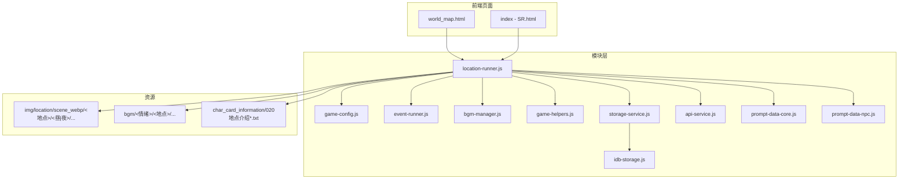
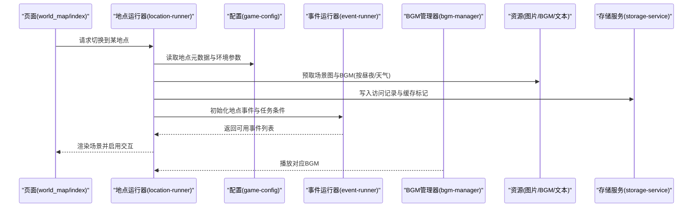
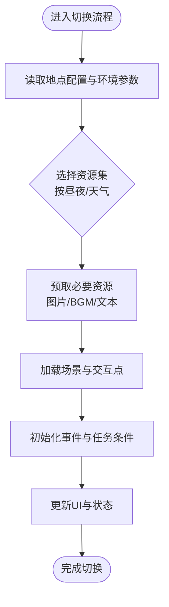
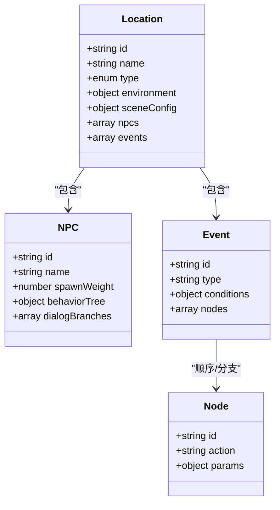
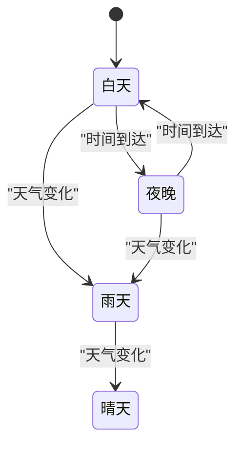
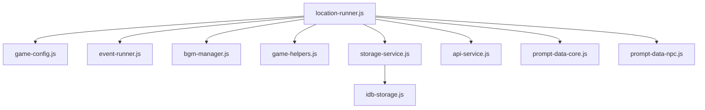

# 地点系统

<cite>
**本文引用的文件**   
- [location-runner.js](file://module/location-runner.js)
- [game-config.js](file://module/game-config.js)
- [world_map.html](file://world_map.html)
- [index - SR.html](file://index - SR.html)
- [prompt-data-core.js](file://module/prompt-data-core.js)
- [prompt-data-npc.js](file://module/prompt-data-npc.js)
- [event-runner.js](file://module/event-runner.js)
- [bgm-manager.js](file://module/bgm-manager.js)
- [game-helpers.js](file://module/game-helpers.js)
- [storage-service.js](file://module/storage-service.js)
- [idb-storage.js](file://module/idb-storage.js)
- [api-service.js](file://module/api-service.js)
- [020地点介绍.txt](file://char_card_information/020地点介绍.txt)
- [博斯坦村.txt](file://char_card_information/020地点介绍草稿/博斯坦村.txt)
- [崆峒派.txt](file://char_card_information/020地点介绍草稿/崆峒派.txt)
- [拜火教总坛.txt](file://char_card_information/020地点介绍草稿/拜火教总坛.txt)
- [昆仑派.txt](file://char_card_information/020地点介绍草稿/昆仑派.txt)
- [月牙泉.txt](file://char_card_information/020地点介绍草稿/月牙泉.txt)
- [沙洲城.txt](file://char_card_information/020地点介绍草稿/沙洲城.txt)
- [白驼山.txt](file://char_card_information/020地点介绍草稿/白驼山.txt)
- [高昌城.txt](file://char_card_information/020地点介绍草稿/高昌城.txt)
- [龟兹城.txt](file://char_card_information/020地点介绍草稿/龟兹城.txt)
</cite>

## 目录
1. [简介](#简介)
2. [项目结构](#项目结构)
3. [核心组件](#核心组件)
4. [架构总览](#架构总览)
5. [详细组件分析](#详细组件分析)
6. [依赖关系分析](#依赖关系分析)
7. [性能考虑](#性能考虑)
8. [故障排查指南](#故障排查指南)
9. [结论](#结论)
10. [附录](#附录)

## 简介
本技术文档聚焦“姬侠传”的地点系统，围绕以下目标展开：
- 地点数据结构设计：地点属性、环境参数、场景配置等核心字段定义与组织方式。
- 地点切换实现逻辑：场景加载、资源预取、状态管理等关键技术流程。
- NPC分布、任务触发条件与剧情节点：在地点维度上的数据与运行时联动机制。
- 昼夜系统与天气变化对地点的影响：渲染、音效、事件与交互的差异化表现。
- 新地点添加开发流程：数据格式规范、资源组织结构、测试验证方法。
- 性能优化策略与内存管理最佳实践：面向移动端与Web端的优化建议。
- 内容创作标准化指南：为策划与美术提供可操作的落地规范。

## 项目结构
从仓库结构可见，地点相关资源与代码主要分布在以下位置：
- 模块层（JavaScript）：负责地点运行期逻辑、配置读取、事件驱动、音频与存储等。
- 页面入口：世界地图与主界面用于承载地点切换与展示。
- 素材资源：按地点分目录存放背景图、BGM、昼夜分层图片等。
- 文案与设定：地点介绍与草稿文本，作为内容来源与校验依据。

图表来源
- [location-runner.js](file://module/location-runner.js)
- [game-config.js](file://module/game-config.js)
- [world_map.html](file://world_map.html)
- [index - SR.html](file://index - SR.html)
- [event-runner.js](file://module/event-runner.js)
- [bgm-manager.js](file://module/bgm-manager.js)
- [game-helpers.js](file://module/game-helpers.js)
- [storage-service.js](file://module/storage-service.js)
- [idb-storage.js](file://module/idb-storage.js)
- [api-service.js](file://module/api-service.js)
- [prompt-data-core.js](file://module/prompt-data-core.js)
- [prompt-data-npc.js](file://module/prompt-data-npc.js)

章节来源
- [world_map.html](file://world_map.html)
- [index - SR.html](file://index - SR.html)
- [location-runner.js](file://module/location-runner.js)
- [game-config.js](file://module/game-config.js)

## 核心组件
- 地点运行器（location-runner.js）：封装地点生命周期、切换流程、资源调度、事件绑定与UI更新。
- 游戏配置（game-config.js）：集中管理地点元数据、默认值、常量与全局开关。
- 事件运行器（event-runner.js）：驱动地点内事件、任务触发与剧情节点执行。
- 背景音乐管理器（bgm-manager.js）：根据地点与昼夜切换BGM，控制音量与淡入淡出。
- 通用工具（game-helpers.js）：提供路径解析、时间计算、随机选择等辅助能力。
- 存储服务（storage-service.js / idb-storage.js）：持久化玩家进度、地点访问记录与缓存策略。
- 外部接口（api-service.js）：按需拉取远程配置或增量内容。
- 提示词数据（prompt-data-core.js / prompt-data-npc.js）：将地点上下文注入到对话与AI生成流程中。

章节来源
- [location-runner.js](file://module/location-runner.js)
- [game-config.js](file://module/game-config.js)
- [event-runner.js](file://module/event-runner.js)
- [bgm-manager.js](file://module/bgm-manager.js)
- [game-helpers.js](file://module/game-helpers.js)
- [storage-service.js](file://module/storage-service.js)
- [idb-storage.js](file://module/idb-storage.js)
- [api-service.js](file://module/api-service.js)
- [prompt-data-core.js](file://module/prompt-data-core.js)
- [prompt-data-npc.js](file://module/prompt-data-npc.js)

## 架构总览
地点系统采用“配置驱动 + 事件驱动”的双引擎模式：
- 配置驱动：通过配置对象描述地点属性、环境参数、场景资源与行为规则。
- 事件驱动：基于事件运行器在特定条件下触发NPC互动、任务推进与剧情节点。

图表来源
- [location-runner.js](file://module/location-runner.js)
- [game-config.js](file://module/game-config.js)
- [event-runner.js](file://module/event-runner.js)
- [bgm-manager.js](file://module/bgm-manager.js)
- [storage-service.js](file://module/storage-service.js)

## 详细组件分析

### 地点数据结构设计
- 地点属性
  - 标识与名称：唯一ID、显示名、别名与排序权重。
  - 类型与归属：城镇/野外/门派/秘境等分类，所属区域或主线阶段。
  - 安全等级与限制：是否允许战斗、是否受昼夜影响、是否需前置条件解锁。
- 环境参数
  - 昼夜时段：白天/夜晚/黄昏等时段集合，决定背景图与光照效果。
  - 天气状态：晴/雨/雪/风沙等，影响视觉滤镜与事件概率。
  - 声音环境：环境音、BGM情绪标签、音量曲线。
- 场景配置
  - 资源映射：昼/夜两套或多套背景图、动态图层、粒子特效。
  - 交互点：传送点、可探索区域、隐藏入口、收集物位置。
  - 事件模板：NPC分布、任务触发条件、剧情节点序列。
- 数据组织建议
  - 以JSON或JS模块形式维护，便于热更新与版本管理。
  - 使用相对路径引用资源，避免硬编码绝对路径。
  - 引入校验脚本确保必填字段与枚举值合法。

章节来源
- [game-config.js](file://module/game-config.js)
- [020地点介绍.txt](file://char_card_information/020地点介绍.txt)

### 地点切换实现逻辑
- 场景加载
  - 根据目标地点与当前时段/天气，选择对应的背景图与BGM。
  - 支持懒加载与分片加载，优先加载首帧与关键交互元素。
- 资源预取
  - 预取相邻地点或高频切换地点的资源，降低切换延迟。
  - 对大图进行压缩与WebP转换，结合CDN与缓存策略。
- 状态管理
  - 维护当前地点、上次停留时间、已触发事件集合、玩家状态快照。
  - 与存储服务同步，保证断线重连后恢复一致。
- 错误处理
  - 资源缺失回退至默认场景；网络异常降级本地缓存；事件失败重试与日志上报。

图表来源
- [location-runner.js](file://module/location-runner.js)
- [game-helpers.js](file://module/game-helpers.js)
- [storage-service.js](file://module/storage-service.js)

章节来源
- [location-runner.js](file://module/location-runner.js)
- [game-helpers.js](file://module/game-helpers.js)
- [storage-service.js](file://module/storage-service.js)

### NPC分布、任务触发与剧情节点
- NPC分布
  - 按地点配置NPC清单，包含出现时段、概率权重、行为树与对话分支。
  - 支持动态刷新与刷新冷却，避免重复触发。
- 任务触发条件
  - 基于玩家属性、声望、物品持有量、已完成事件等条件组合。
  - 条件表达式可配置，便于策划快速调整。
- 剧情节点
  - 以有向图或序列形式编排，支持分支与回溯。
  - 与事件运行器联动，自动推进或回滚状态。

图表来源
- [prompt-data-npc.js](file://module/prompt-data-npc.js)
- [event-runner.js](file://module/event-runner.js)

章节来源
- [prompt-data-npc.js](file://module/prompt-data-npc.js)
- [event-runner.js](file://module/event-runner.js)

### 昼夜系统与天气变化的影响机制
- 昼夜系统
  - 根据游戏内时间与地点配置切换背景图与光照效果。
  - 影响NPC活动范围、事件概率与BGM情绪。
- 天气变化
  - 随机或事件驱动的天气状态，叠加滤镜与粒子效果。
  - 改变移动速度、视野范围与某些任务的可用性。
- 联动策略
  - 统一由环境参数驱动，避免分散逻辑。
  - 提供调试开关与手动切换，便于测试与演示。

图表来源
- [bgm-manager.js](file://module/bgm-manager.js)
- [game-helpers.js](file://module/game-helpers.js)

章节来源
- [bgm-manager.js](file://module/bgm-manager.js)
- [game-helpers.js](file://module/game-helpers.js)

### 新地点添加完整开发流程
- 数据准备
  - 编写地点介绍与设定，参考现有文案模板。
  - 定义地点元数据与环境参数，明确昼夜/天气差异。
- 资源组织
  - 在img/location/scene_webp下按地点创建昼/夜子目录，放置背景图。
  - 在bgm/<情绪>/<地点>下放置对应BGM，命名遵循统一规范。
- 配置注册
  - 在游戏配置中新增地点条目，关联资源路径与事件模板。
  - 设置NPC分布、任务条件与剧情节点。
- 集成与测试
  - 在世界地图或主界面增加入口，验证切换流畅度。
  - 检查资源加载、BGM播放、事件触发与存档一致性。
- 发布与迭代
  - 提交变更并运行校验脚本，确保无缺失字段与路径错误。
  - 灰度发布并监控性能指标与用户反馈。

章节来源
- [020地点介绍.txt](file://char_card_information/020地点介绍.txt)
- [博斯坦村.txt](file://char_card_information/020地点介绍草稿/博斯坦村.txt)
- [崆峒派.txt](file://char_card_information/020地点介绍草稿/崆峒派.txt)
- [拜火教总坛.txt](file://char_card_information/020地点介绍草稿/拜火教总坛.txt)
- [昆仑派.txt](file://char_card_information/020地点介绍草稿/昆仑派.txt)
- [月牙泉.txt](file://char_card_information/020地点介绍草稿/月牙泉.txt)
- [沙洲城.txt](file://char_card_information/020地点介绍草稿/沙洲城.txt)
- [白驼山.txt](file://char_card_information/020地点介绍草稿/白驼山.txt)
- [高昌城.txt](file://char_card_information/020地点介绍草稿/高昌城.txt)
- [龟兹城.txt](file://char_card_information/020地点介绍草稿/龟兹城.txt)

## 依赖关系分析
- 模块耦合
  - 地点运行器依赖配置、事件、音频与存储模块，形成松耦合的高内聚单元。
  - 提示词数据模块与地点上下文解耦，通过参数注入实现灵活扩展。
- 外部依赖
  - 存储服务基于IndexedDB，提升离线体验与持久化能力。
  - 外部接口用于增量内容与远程配置，具备降级策略。

图表来源
- [location-runner.js](file://module/location-runner.js)
- [game-config.js](file://module/game-config.js)
- [event-runner.js](file://module/event-runner.js)
- [bgm-manager.js](file://module/bgm-manager.js)
- [game-helpers.js](file://module/game-helpers.js)
- [storage-service.js](file://module/storage-service.js)
- [idb-storage.js](file://module/idb-storage.js)
- [api-service.js](file://module/api-service.js)
- [prompt-data-core.js](file://module/prompt-data-core.js)
- [prompt-data-npc.js](file://module/prompt-data-npc.js)

章节来源
- [location-runner.js](file://module/location-runner.js)
- [storage-service.js](file://module/storage-service.js)
- [idb-storage.js](file://module/idb-storage.js)
- [api-service.js](file://module/api-service.js)

## 性能考虑
- 资源加载
  - 使用WebP与自适应分辨率，减少带宽与解码压力。
  - 实施分片加载与优先级队列，保障首帧渲染速度。
- 内存管理
  - 及时释放不再使用的纹理与音频缓冲，避免内存泄漏。
  - 对大型场景进行实例化与复用，降低GC频率。
- 网络与缓存
  - 利用浏览器缓存与IndexedDB，提高离线可用性。
  - 对远程配置进行版本校验与增量更新，减少全量下载。
- 事件与渲染
  - 批量更新UI，减少重排与重绘。
  - 事件去抖与节流，避免频繁触发导致的卡顿。

[本节为通用性能指导，不直接分析具体文件]

## 故障排查指南
- 常见问题
  - 资源缺失：检查路径与文件名大小写，确认资源存在且可访问。
  - BGM未播放：确认音频权限与格式兼容，检查播放器状态。
  - 事件不触发：核对条件表达式与玩家状态，查看日志输出。
  - 存档不一致：比对本地与云端快照，修复冲突数据。
- 定位手段
  - 开启调试日志，记录切换流程与关键变量。
  - 使用控制台模拟不同昼夜/天气，复现问题。
  - 对比正常与异常场景的差异，逐步缩小范围。

章节来源
- [storage-service.js](file://module/storage-service.js)
- [idb-storage.js](file://module/idb-storage.js)
- [api-service.js](file://module/api-service.js)

## 结论
地点系统通过配置驱动与事件驱动相结合，实现了可扩展、可维护的场景管理与内容呈现。合理的资源组织、严格的校验流程与完善的性能优化策略，是保障用户体验的关键。建议在新地点开发中严格遵循标准化流程，持续迭代与优化，以提升整体品质与稳定性。

[本节为总结性内容，不直接分析具体文件]

## 附录
- 术语表
  - 地点：游戏中的可探索区域，具有独特环境与交互。
  - 昼夜：游戏内时间划分，影响视觉与事件表现。
  - 天气：环境状态，影响玩法与氛围。
  - 事件：可触发的剧情或任务片段。
  - 节点：事件中的最小执行单元。
- 参考模板
  - 地点介绍模板与草稿文本，供策划与文案参考。

章节来源
- [020地点介绍.txt](file://char_card_information/020地点介绍.txt)
- [博斯坦村.txt](file://char_card_information/020地点介绍草稿/博斯坦村.txt)
- [崆峒派.txt](file://char_card_information/020地点介绍草稿/崆峒派.txt)
- [拜火教总坛.txt](file://char_card_information/020地点介绍草稿/拜火教总坛.txt)
- [昆仑派.txt](file://char_card_information/020地点介绍草稿/昆仑派.txt)
- [月牙泉.txt](file://char_card_information/020地点介绍草稿/月牙泉.txt)
- [沙洲城.txt](file://char_card_information/020地点介绍草稿/沙洲城.txt)
- [白驼山.txt](file://char_card_information/020地点介绍草稿/白驼山.txt)
- [高昌城.txt](file://char_card_information/020地点介绍草稿/高昌城.txt)
- [龟兹城.txt](file://char_card_information/020地点介绍草稿/龟兹城.txt)