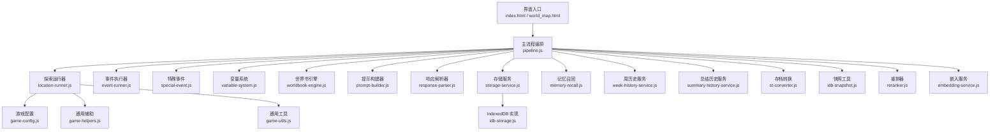
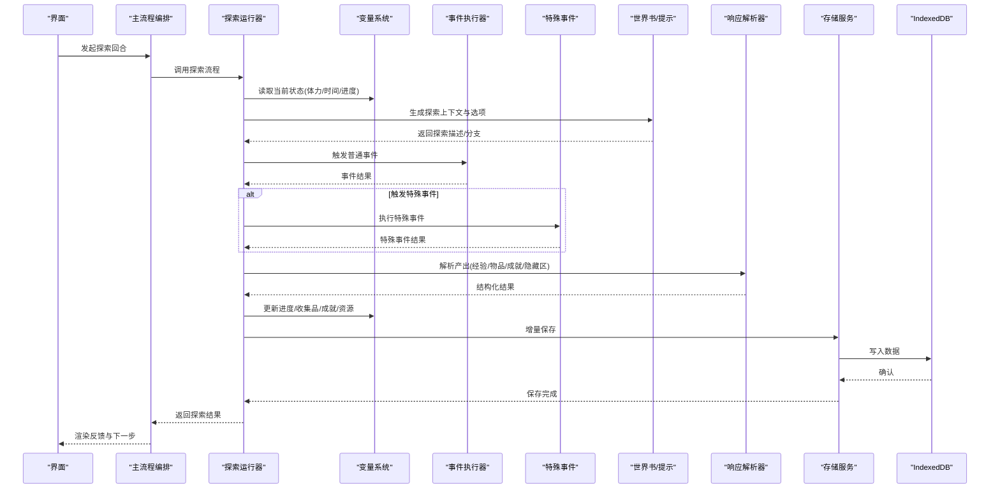
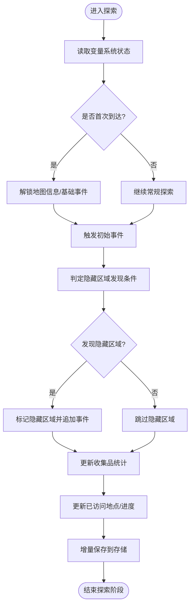
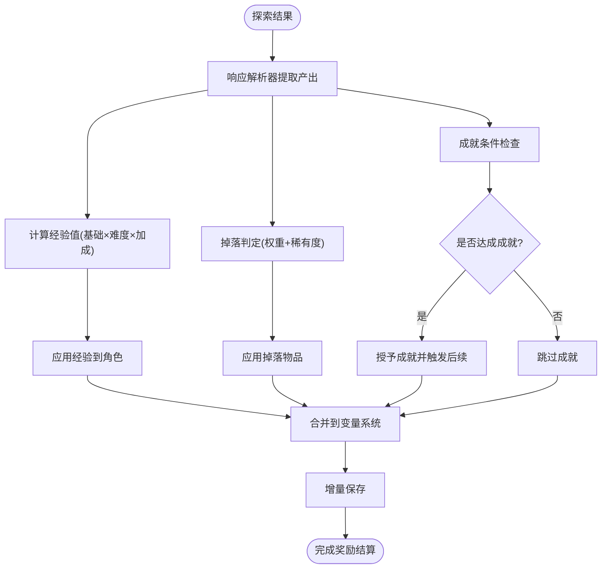
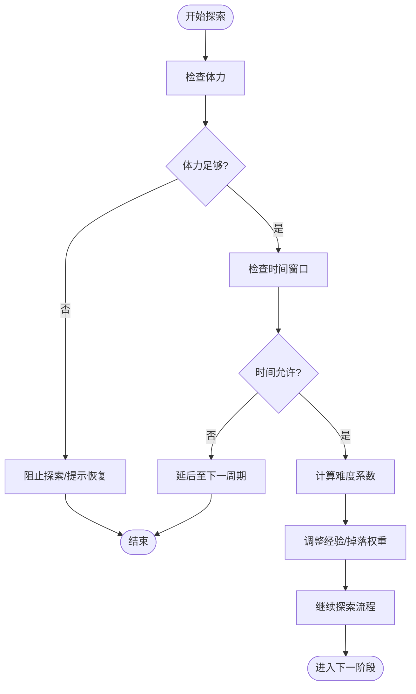
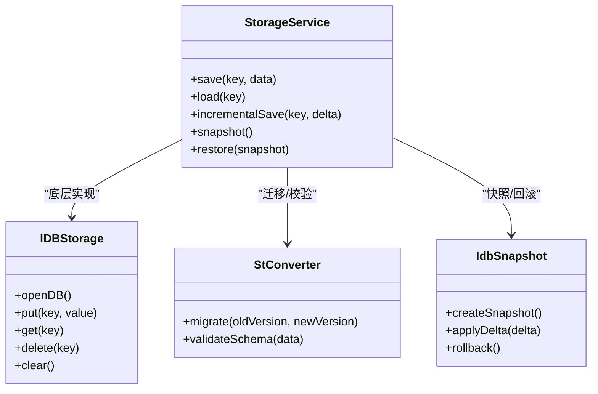
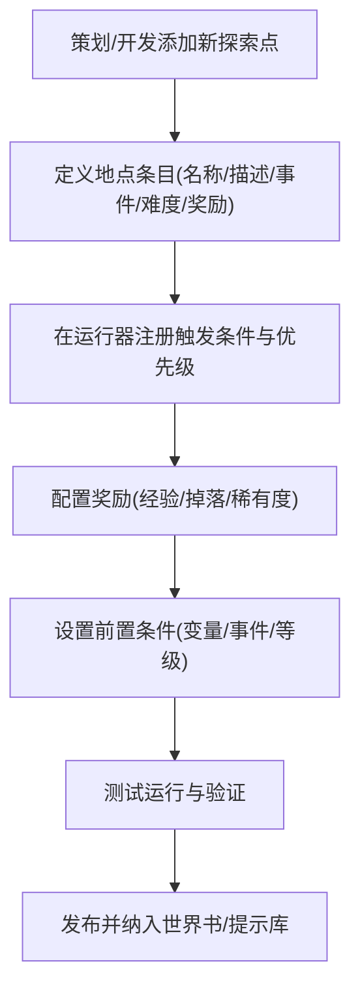
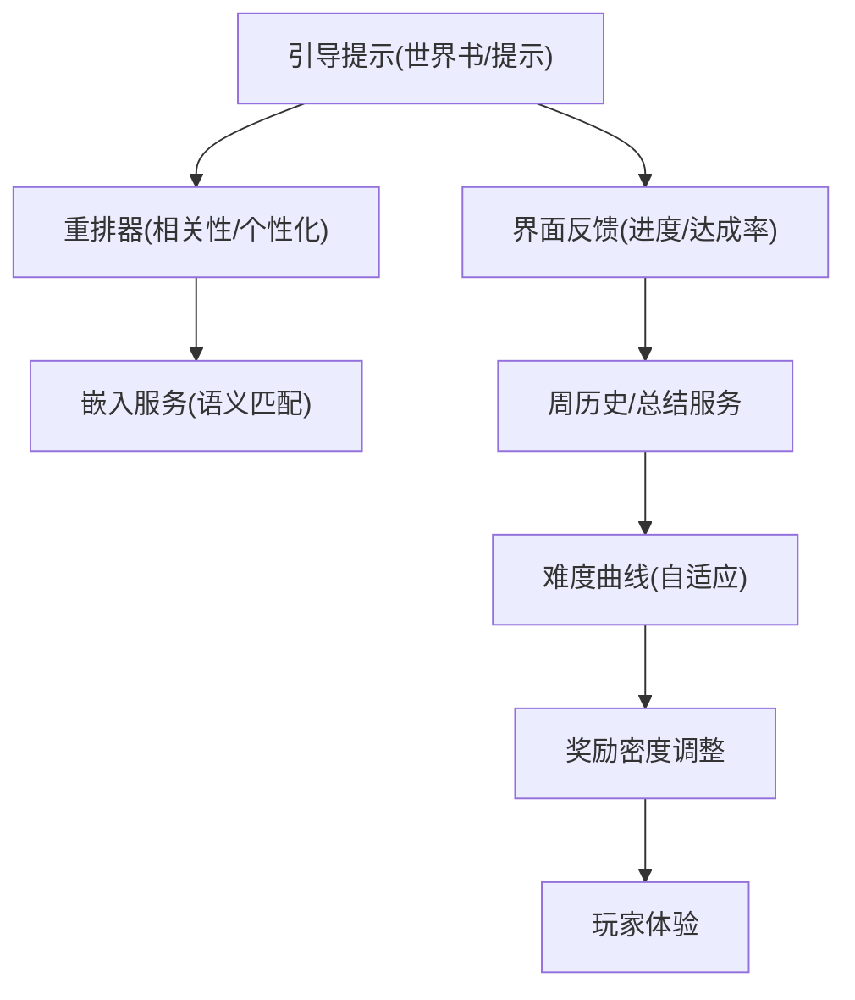
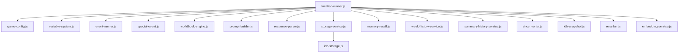

# 探索机制

<cite>
**本文引用的文件**   
- [module/location-runner.js](file://module/location-runner.js)
- [module/game-config.js](file://module/game-config.js)
- [module/storage-service.js](file://module/storage-service.js)
- [module/idb-storage.js](file://module/idb-storage.js)
- [module/pipeline.js](file://module/pipeline.js)
- [module/event-runner.js](file://module/event-runner.js)
- [module/special-event.js](file://module/special-event.js)
- [module/variable-system.js](file://module/variable-system.js)
- [module/worldbook-engine.js](file://module/worldbook-engine.js)
- [module/prompt-data-core.js](file://module/prompt-data-core.js)
- [module/prompt-data-actions.js](file://module/prompt-data-actions.js)
- [module/prompt-builder.js](file://module/prompt-builder.js)
- [module/response-parser.js](file://module/response-parser.js)
- [module/template-engine.js](file://module/template-engine.js)
- [module/game-helpers.js](file://module/game-helpers.js)
- [module/game-utils.js](file://module/game-utils.js)
- [module/memory-recall.js](file://module/memory-recall.js)
- [module/week-history-service.js](file://module/week-history-service.js)
- [module/summary-history-service.js](file://module/summary-history-service.js)
- [module/st-converter.js](file://module/st-converter.js)
- [module/idb-snapshot.js](file://module/idb-snapshot.js)
- [module/reranker.js](file://module/reranker.js)
- [module/embedding-service.js](file://module/embedding-service.js)
- [index.html](file://index.html)
- [world_map.html](file://world_map.html)
</cite>

## 目录
1. [简介](#简介)
2. [项目结构](#项目结构)
3. [核心组件](#核心组件)
4. [架构总览](#架构总览)
5. [详细组件分析](#详细组件分析)
6. [依赖关系分析](#依赖关系分析)
7. [性能考量](#性能考量)
8. [故障排查指南](#故障排查指南)
9. [结论](#结论)
10. [附录](#附录)

## 简介
本技术文档聚焦“姬侠传”的探索机制，围绕以下目标展开：
- 探索进度追踪系统：已访问地点记录、隐藏区域发现、收集品统计等。
- 探索奖励机制：经验值分配、物品掉落、成就解锁等算法与流程。
- 探索限制与约束：体力系统、时间限制、难度调节等平衡性设计。
- 数据持久化：存档格式、增量更新、版本兼容方案。
- 内容扩展开发指南：新增探索点、奖励配置、条件设置方法。
- 体验优化策略：引导提示、进度反馈、难度曲线等技术要点。

## 项目结构
本项目为前端驱动的网页/混合应用形态，探索相关逻辑主要位于 module 目录下的若干脚本中，UI 入口在 index.html 与 world_map.html 中。关键模块职责如下：
- location-runner.js：探索运行器，负责地点切换、探索事件触发、结果汇总与状态推进。
- game-config.js：全局配置（含探索相关常量、权重、阈值等）。
- storage-service.js / idb-storage.js：存储抽象与 IndexedDB 实现，用于存档读写与快照。
- pipeline.js：主流程编排，串联探索、事件、记忆、总结等阶段。
- event-runner.js / special-event.js：通用事件与特殊事件执行器。
- variable-system.js：变量系统，承载探索进度、收集品、成就等状态。
- worldbook-engine.js / prompt-* / template-engine.js：世界书与提示构建，驱动探索内容与文本生成。
- response-parser.js：解析探索产出（经验、物品、成就等）。
- memory-recall.js / week-history-service.js / summary-history-service.js：记忆与历史服务，辅助探索回溯与总结。
- st-converter.js / idb-snapshot.js：存档转换与快照工具。
- reranker.js / embedding-service.js：检索与排序能力，可用于探索推荐与引导。

图表来源
- [module/pipeline.js](file://module/pipeline.js)
- [module/location-runner.js](file://module/location-runner.js)
- [module/event-runner.js](file://module/event-runner.js)
- [module/special-event.js](file://module/special-event.js)
- [module/variable-system.js](file://module/variable-system.js)
- [module/worldbook-engine.js](file://module/worldbook-engine.js)
- [module/prompt-builder.js](file://module/prompt-builder.js)
- [module/response-parser.js](file://module/response-parser.js)
- [module/storage-service.js](file://module/storage-service.js)
- [module/idb-storage.js](file://module/idb-storage.js)
- [module/memory-recall.js](file://module/memory-recall.js)
- [module/week-history-service.js](file://module/week-history-service.js)
- [module/summary-history-service.js](file://module/summary-history-service.js)
- [module/st-converter.js](file://module/st-converter.js)
- [module/idb-snapshot.js](file://module/idb-snapshot.js)
- [module/reranker.js](file://module/reranker.js)
- [module/embedding-service.js](file://module/embedding-service.js)
- [module/game-config.js](file://module/game-config.js)
- [module/game-helpers.js](file://module/game-helpers.js)
- [module/game-utils.js](file://module/game-utils.js)
- [index.html](file://index.html)
- [world_map.html](file://world_map.html)

章节来源
- [module/pipeline.js](file://module/pipeline.js)
- [module/location-runner.js](file://module/location-runner.js)
- [module/storage-service.js](file://module/storage-service.js)
- [module/idb-storage.js](file://module/idb-storage.js)
- [module/game-config.js](file://module/game-config.js)
- [index.html](file://index.html)
- [world_map.html](file://world_map.html)

## 核心组件
- 探索运行器（location-runner.js）
  - 负责选择下一个探索点、判定是否首次到达、触发探索事件、计算并结算奖励、更新进度与收集品、处理隐藏区域发现。
  - 与变量系统交互以持久化探索进度；与事件执行器协作触发普通/特殊事件；与响应解析器对接产出物。
- 变量系统（variable-system.js）
  - 维护探索相关键空间：已访问地点集合、隐藏区域标记、收集品清单、成就标志、体力与时间计数器等。
  - 提供增删改查接口，支持批量合并与校验。
- 存储服务（storage-service.js / idb-storage.js）
  - 统一存档读写接口；底层使用 IndexedDB 进行结构化存储；支持增量写入与快照对比。
- 主流程编排（pipeline.js）
  - 将探索阶段与其他阶段（战斗、对话、总结等）串接，确保状态一致性与顺序正确。
- 世界书与提示（worldbook-engine.js / prompt-builder.js / prompt-data-core.js / prompt-data-actions.js）
  - 根据当前探索上下文动态生成探索描述、线索与分支选项，影响探索体验与难度。
- 响应解析（response-parser.js）
  - 从探索结果中提取经验、物品、成就、隐藏区域信息等结构化数据。
- 记忆与历史（memory-recall.js / week-history-service.js / summary-history-service.js）
  - 提供探索回溯、周度回顾与总结归档，支撑长期进度与成就判定。
- 存档转换与快照（st-converter.js / idb-snapshot.js）
  - 负责旧版存档迁移、增量差异保存与回滚恢复。
- 重排与检索（reranker.js / embedding-service.js）
  - 基于语义或规则对探索点进行排序与推荐，提升探索效率与引导效果。

章节来源
- [module/location-runner.js](file://module/location-runner.js)
- [module/variable-system.js](file://module/variable-system.js)
- [module/storage-service.js](file://module/storage-service.js)
- [module/idb-storage.js](file://module/idb-storage.js)
- [module/pipeline.js](file://module/pipeline.js)
- [module/worldbook-engine.js](file://module/worldbook-engine.js)
- [module/prompt-builder.js](file://module/prompt-builder.js)
- [module/prompt-data-core.js](file://module/prompt-data-core.js)
- [module/prompt-data-actions.js](file://module/prompt-data-actions.js)
- [module/response-parser.js](file://module/response-parser.js)
- [module/memory-recall.js](file://module/memory-recall.js)
- [module/week-history-service.js](file://module/week-history-service.js)
- [module/summary-history-service.js](file://module/summary-history-service.js)
- [module/st-converter.js](file://module/st-converter.js)
- [module/idb-snapshot.js](file://module/idb-snapshot.js)
- [module/reranker.js](file://module/reranker.js)
- [module/embedding-service.js](file://module/embedding-service.js)

## 架构总览
探索机制由“运行器 + 变量系统 + 存储服务 + 事件系统 + 世界书/提示 + 解析器 + 历史/记忆 + 转换/快照 + 重排/检索”构成闭环。主流程按阶段推进，探索阶段完成后进入结算与持久化。

图表来源
- [module/pipeline.js](file://module/pipeline.js)
- [module/location-runner.js](file://module/location-runner.js)
- [module/variable-system.js](file://module/variable-system.js)
- [module/event-runner.js](file://module/event-runner.js)
- [module/special-event.js](file://module/special-event.js)
- [module/worldbook-engine.js](file://module/worldbook-engine.js)
- [module/prompt-builder.js](file://module/prompt-builder.js)
- [module/response-parser.js](file://module/response-parser.js)
- [module/storage-service.js](file://module/storage-service.js)
- [module/idb-storage.js](file://module/idb-storage.js)

## 详细组件分析

### 探索进度追踪系统
- 已访问地点记录
  - 通过变量系统维护集合型字段，记录玩家抵达过的地点标识。
  - 首次到达时触发“新地点”逻辑，包括解锁地图信息、初始事件与基础奖励。
- 隐藏区域发现
  - 结合世界书/提示生成的线索与随机判定，当满足特定条件（如技能、道具、前置事件）时标记隐藏区域为已发现。
  - 隐藏区域可包含额外事件链与专属奖励。
- 收集品统计
  - 维护收集品清单与计数，支持分类统计与达成率计算。
  - 与成就系统联动，达到阈值自动解锁对应成就。

图表来源
- [module/location-runner.js](file://module/location-runner.js)
- [module/variable-system.js](file://module/variable-system.js)
- [module/worldbook-engine.js](file://module/worldbook-engine.js)
- [module/storage-service.js](file://module/storage-service.js)
- [module/idb-storage.js](file://module/idb-storage.js)

章节来源
- [module/location-runner.js](file://module/location-runner.js)
- [module/variable-system.js](file://module/variable-system.js)
- [module/worldbook-engine.js](file://module/worldbook-engine.js)
- [module/storage-service.js](file://module/storage-service.js)
- [module/idb-storage.js](file://module/idb-storage.js)

### 探索奖励机制
- 经验值分配
  - 依据探索类型、地点等级、事件复杂度与难度系数计算经验收益。
  - 可能叠加加成（如成就、道具、世界书提示质量）。
- 物品掉落
  - 采用概率表与权重池，结合玩家属性与事件条件决定掉落种类与数量。
  - 支持稀有度分层与保底机制，避免极端低概率导致的挫败感。
- 成就解锁
  - 基于收集品达成率、隐藏区域发现数、累计探索次数等指标判定。
  - 成就解锁后触发后续剧情或解锁新的探索分支。

图表来源
- [module/response-parser.js](file://module/response-parser.js)
- [module/variable-system.js](file://module/variable-system.js)
- [module/storage-service.js](file://module/storage-service.js)
- [module/idb-storage.js](file://module/idb-storage.js)

章节来源
- [module/response-parser.js](file://module/response-parser.js)
- [module/variable-system.js](file://module/variable-system.js)
- [module/storage-service.js](file://module/storage-service.js)
- [module/idb-storage.js](file://module/idb-storage.js)

### 探索限制与约束条件
- 体力系统
  - 每次探索消耗固定或动态体力，体力不足时阻止探索或降低收益。
  - 体力可通过休息、道具或事件恢复。
- 时间限制
  - 以周/日为周期的时间推进，探索占用时间单位，超时触发事件或惩罚。
  - 时间窗口影响某些探索点的开放与事件可用性。
- 难度调节
  - 基于玩家等级、装备、技能与世界书提示质量动态调整事件难度与掉落权重。
  - 支持手动难度开关与自适应难度曲线。

图表来源
- [module/location-runner.js](file://module/location-runner.js)
- [module/game-config.js](file://module/game-config.js)
- [module/variable-system.js](file://module/variable-system.js)

章节来源
- [module/location-runner.js](file://module/location-runner.js)
- [module/game-config.js](file://module/game-config.js)
- [module/variable-system.js](file://module/variable-system.js)

### 探索数据的持久化存储
- 存档格式
  - 采用结构化 JSON 对象，包含探索进度、收集品、成就、资源与元数据（版本号、时间戳）。
- 增量更新
  - 仅写入变更字段，减少 IO 开销；支持差异合并与冲突解决。
- 版本兼容
  - 通过存档转换工具进行旧版迁移，确保向后兼容；快照机制支持回滚与恢复。

图表来源
- [module/storage-service.js](file://module/storage-service.js)
- [module/idb-storage.js](file://module/idb-storage.js)
- [module/st-converter.js](file://module/st-converter.js)
- [module/idb-snapshot.js](file://module/idb-snapshot.js)

章节来源
- [module/storage-service.js](file://module/storage-service.js)
- [module/idb-storage.js](file://module/idb-storage.js)
- [module/st-converter.js](file://module/st-converter.js)
- [module/idb-snapshot.js](file://module/idb-snapshot.js)

### 探索内容扩展开发指南
- 新增探索点
  - 在世界书/提示数据中添加新地点条目，定义名称、描述、事件链、难度与奖励配置。
  - 在运行器中注册该地点的触发条件与优先级，确保被正确选择。
- 奖励配置
  - 在配置文件中定义经验基数、掉落权重、稀有度分布与保底规则。
  - 支持按地点/事件维度覆盖默认配置。
- 条件设置
  - 使用变量系统预设前置条件（如已完成某事件、拥有某道具、达到某等级）。
  - 通过世界书/提示生成差异化描述与分支，增强可玩性。

图表来源
- [module/location-runner.js](file://module/location-runner.js)
- [module/game-config.js](file://module/game-config.js)
- [module/worldbook-engine.js](file://module/worldbook-engine.js)
- [module/prompt-builder.js](file://module/prompt-builder.js)
- [module/variable-system.js](file://module/variable-system.js)

章节来源
- [module/location-runner.js](file://module/location-runner.js)
- [module/game-config.js](file://module/game-config.js)
- [module/worldbook-engine.js](file://module/worldbook-engine.js)
- [module/prompt-builder.js](file://module/prompt-builder.js)
- [module/variable-system.js](file://module/variable-system.js)

### 探索体验优化策略
- 引导提示
  - 利用世界书/提示生成线索与方向性建议，帮助玩家快速定位高价值探索点。
  - 结合重排器与嵌入服务，对候选探索点进行相关性排序与个性化推荐。
- 进度反馈
  - 在界面层展示已访问地点比例、收集品达成率、隐藏区域发现数等可视化反馈。
  - 通过周历史与总结服务提供阶段性回顾与成就提醒。
- 难度曲线
  - 基于玩家表现动态调整事件难度与奖励密度，保持挑战性与正反馈平衡。
  - 引入自适应机制，避免长时间卡关或过于简单导致无聊。

图表来源
- [module/worldbook-engine.js](file://module/worldbook-engine.js)
- [module/prompt-builder.js](file://module/prompt-builder.js)
- [module/reranker.js](file://module/reranker.js)
- [module/embedding-service.js](file://module/embedding-service.js)
- [module/week-history-service.js](file://module/week-history-service.js)
- [module/summary-history-service.js](file://module/summary-history-service.js)

章节来源
- [module/worldbook-engine.js](file://module/worldbook-engine.js)
- [module/prompt-builder.js](file://module/prompt-builder.js)
- [module/reranker.js](file://module/reranker.js)
- [module/embedding-service.js](file://module/embedding-service.js)
- [module/week-history-service.js](file://module/week-history-service.js)
- [module/summary-history-service.js](file://module/summary-history-service.js)

## 依赖关系分析
探索机制的核心依赖如下：
- 运行器依赖配置、变量系统与事件执行器。
- 世界书/提示驱动探索内容与分支，影响事件与奖励。
- 存储服务与 IndexedDB 提供持久化能力。
- 历史/记忆服务支撑长期进度与成就判定。
- 转换/快照保障存档兼容与恢复。
- 重排/嵌入服务提升探索引导与个性化。

图表来源
- [module/location-runner.js](file://module/location-runner.js)
- [module/game-config.js](file://module/game-config.js)
- [module/variable-system.js](file://module/variable-system.js)
- [module/event-runner.js](file://module/event-runner.js)
- [module/special-event.js](file://module/special-event.js)
- [module/worldbook-engine.js](file://module/worldbook-engine.js)
- [module/prompt-builder.js](file://module/prompt-builder.js)
- [module/response-parser.js](file://module/response-parser.js)
- [module/storage-service.js](file://module/storage-service.js)
- [module/idb-storage.js](file://module/idb-storage.js)
- [module/memory-recall.js](file://module/memory-recall.js)
- [module/week-history-service.js](file://module/week-history-service.js)
- [module/summary-history-service.js](file://module/summary-history-service.js)
- [module/st-converter.js](file://module/st-converter.js)
- [module/idb-snapshot.js](file://module/idb-snapshot.js)
- [module/reranker.js](file://module/reranker.js)
- [module/embedding-service.js](file://module/embedding-service.js)

章节来源
- [module/location-runner.js](file://module/location-runner.js)
- [module/game-config.js](file://module/game-config.js)
- [module/variable-system.js](file://module/variable-system.js)
- [module/event-runner.js](file://module/event-runner.js)
- [module/special-event.js](file://module/special-event.js)
- [module/worldbook-engine.js](file://module/worldbook-engine.js)
- [module/prompt-builder.js](file://module/prompt-builder.js)
- [module/response-parser.js](file://module/response-parser.js)
- [module/storage-service.js](file://module/storage-service.js)
- [module/idb-storage.js](file://module/idb-storage.js)
- [module/memory-recall.js](file://module/memory-recall.js)
- [module/week-history-service.js](file://module/week-history-service.js)
- [module/summary-history-service.js](file://module/summary-history-service.js)
- [module/st-converter.js](file://module/st-converter.js)
- [module/idb-snapshot.js](file://module/idb-snapshot.js)
- [module/reranker.js](file://module/reranker.js)
- [module/embedding-service.js](file://module/embedding-service.js)

## 性能考量
- 增量保存优先：仅写入变更字段，降低 IndexedDB 写入压力。
- 批量操作：合并多次变量更新为一次持久化，减少 IO 次数。
- 异步处理：探索事件与网络请求（如嵌入服务）采用异步，避免阻塞主线程。
- 缓存策略：对世界书/提示数据进行本地缓存，提高生成速度。
- 内存管理：及时释放临时对象，避免大对象常驻内存。

[本节为通用性能指导，不直接分析具体文件]

## 故障排查指南
- 存档损坏或不兼容
  - 使用存档转换工具进行迁移与校验；必要时通过快照回滚至最近可用版本。
- 探索无法触发或卡住
  - 检查变量系统中的前置条件与资源（体力/时间）；确认运行器是否正确注册地点与事件。
- 奖励异常或丢失
  - 核对响应解析器的输出结构与变量系统的更新逻辑；查看存储服务的增量保存日志。
- 引导与推荐失效
  - 验证重排器与嵌入服务的输入数据与相似度计算；检查世界书/提示的数据完整性。

章节来源
- [module/st-converter.js](file://module/st-converter.js)
- [module/idb-snapshot.js](file://module/idb-snapshot.js)
- [module/location-runner.js](file://module/location-runner.js)
- [module/variable-system.js](file://module/variable-system.js)
- [module/response-parser.js](file://module/response-parser.js)
- [module/storage-service.js](file://module/storage-service.js)
- [module/reranker.js](file://module/reranker.js)
- [module/embedding-service.js](file://module/embedding-service.js)
- [module/worldbook-engine.js](file://module/worldbook-engine.js)
- [module/prompt-builder.js](file://module/prompt-builder.js)

## 结论
探索机制通过运行器、变量系统、存储服务、事件系统与世界书/提示的协同工作，实现了完整的探索进度追踪、奖励结算与持久化。配合历史/记忆、转换/快照与重排/嵌入服务，系统在可扩展性、兼容性、引导性与体验上具备良好基础。建议在后续迭代中持续优化难度曲线与反馈机制，以提升玩家的探索动机与满意度。

[本节为总结性内容，不直接分析具体文件]

## 附录
- 界面入口参考
  - 主页入口：index.html
  - 世界地图入口：world_map.html
- 通用辅助工具
  - game-helpers.js / game-utils.js：提供常用函数与工具方法，供探索模块复用。

章节来源
- [index.html](file://index.html)
- [world_map.html](file://world_map.html)
- [module/game-helpers.js](file://module/game-helpers.js)
- [module/game-utils.js](file://module/game-utils.js)