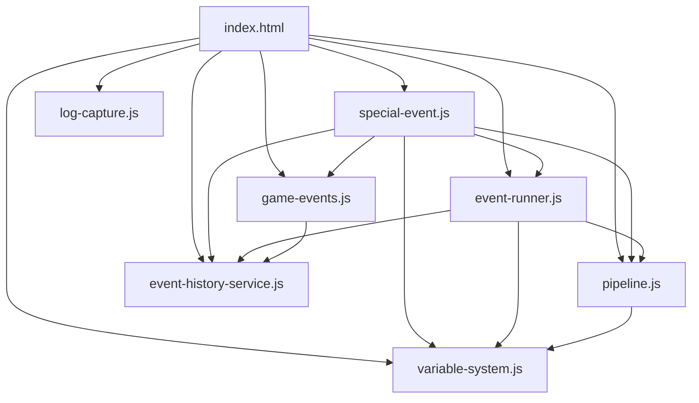
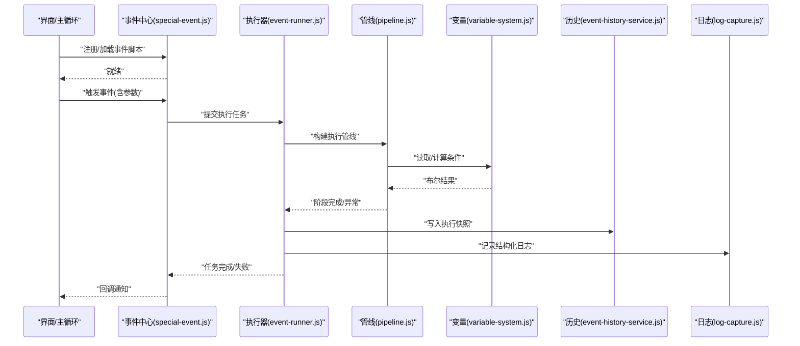
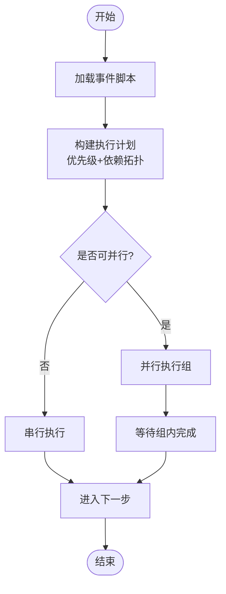
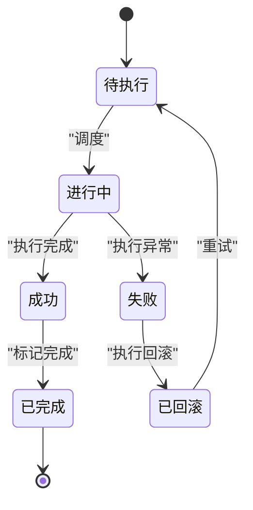
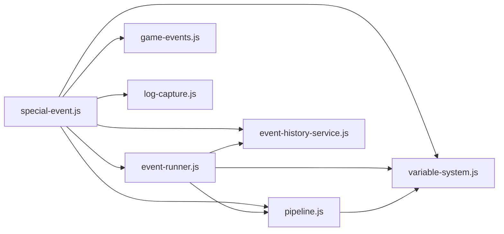

# 特殊事件系统

<cite>
**本文引用的文件**   
- [special-event.js](file://module/special-event.js)
- [event-runner.js](file://module/event-runner.js)
- [game-events.js](file://module/game-events.js)
- [pipeline.js](file://module/pipeline.js)
- [variable-system.js](file://module/variable-system.js)
- [event-history-service.js](file://module/event-history-service.js)
- [log-capture.js](file://module/log-capture.js)
- [index.html](file://apk/android/app/src/main/assets/public/index.html)
</cite>

## 目录
1. [引言](#引言)
2. [项目结构](#项目结构)
3. [核心组件](#核心组件)
4. [架构总览](#架构总览)
5. [详细组件分析](#详细组件分析)
6. [依赖关系分析](#依赖关系分析)
7. [性能考量](#性能考量)
8. [故障排查指南](#故障排查指南)
9. [结论](#结论)
10. [附录](#附录)

## 引言
本技术文档聚焦姬侠传“特殊事件系统”，围绕事件触发机制、事件链管理、事件类型分类、与游戏主循环集成、自定义事件开发以及调试与日志等主题，提供从架构到实现细节的系统性说明。目标读者包括引擎开发者、脚本作者与游戏设计师，旨在帮助其高效构建、维护与扩展事件内容。

## 项目结构
特殊事件系统主要位于前端模块中，关键文件如下：
- special-event.js：事件定义、注册、调度与生命周期管理的核心
- event-runner.js：事件执行器，负责按优先级与依赖顺序运行事件链
- game-events.js：全局事件总线与广播分发
- pipeline.js：通用处理管线，用于串联条件检测、副作用执行与结果汇总
- variable-system.js：变量系统与表达式求值，支撑条件判断与状态读写
- event-history-service.js：事件历史与回放服务，支持审计与回滚辅助
- log-capture.js：日志捕获与上报，便于问题定位
- index.html：页面入口，加载并初始化各模块



图表来源
- [index.html](file://apk/android/app/src/main/assets/public/index.html)
- [special-event.js](file://module/special-event.js)
- [event-runner.js](file://module/event-runner.js)
- [game-events.js](file://module/game-events.js)
- [pipeline.js](file://module/pipeline.js)
- [variable-system.js](file://module/variable-system.js)
- [event-history-service.js](file://module/event-history-service.js)
- [log-capture.js](file://module/log-capture.js)

章节来源
- [index.html](file://apk/android/app/src/main/assets/public/index.html)
- [special-event.js](file://module/special-event.js)
- [event-runner.js](file://module/event-runner.js)
- [game-events.js](file://module/game-events.js)
- [pipeline.js](file://module/pipeline.js)
- [variable-system.js](file://module/variable-system.js)
- [event-history-service.js](file://module/event-history-service.js)
- [log-capture.js](file://module/log-capture.js)

## 核心组件
- 事件定义与注册中心（special-event.js）
  - 职责：声明事件元数据、条件表达式、动作序列、依赖关系、优先级；提供注册、查询、批量导入接口
  - 关键点：事件ID唯一性校验、重复注册保护、运行时上下文注入
- 事件执行器（event-runner.js）
  - 职责：根据优先级与依赖拓扑排序生成执行计划；并发控制；错误恢复与重试；完成回调
  - 关键点：依赖解析、环检测、失败短路、可插拔策略
- 全局事件总线（game-events.js）
  - 职责：发布/订阅模型，跨模块通信；事件生命周期钩子
  - 关键点：去重订阅、异步派发、错误隔离
- 处理管线（pipeline.js）
  - 职责：将条件检测、副作用、结果聚合串成可组合的管道
  - 关键点：中间件式调用、短路返回、统一错误封装
- 变量系统（variable-system.js）
  - 职责：变量读写、作用域、表达式求值、函数库
  - 关键点：安全求值、缓存、不可变快照
- 事件历史服务（event-history-service.js）
  - 职责：记录事件执行轨迹、快照对比、回滚辅助
  - 关键点：增量快照、时间旅行、一致性保证
- 日志捕获（log-capture.js）
  - 职责：拦截console输出、结构化日志、上报与导出
  - 关键点：分级过滤、采样、脱敏

章节来源
- [special-event.js](file://module/special-event.js)
- [event-runner.js](file://module/event-runner.js)
- [game-events.js](file://module/game-events.js)
- [pipeline.js](file://module/pipeline.js)
- [variable-system.js](file://module/variable-system.js)
- [event-history-service.js](file://module/event-history-service.js)
- [log-capture.js](file://module/log-capture.js)

## 架构总览
特殊事件系统采用“定义-调度-执行-记录”的分层架构：
- 定义层：事件脚本集中声明事件类型、条件、动作与依赖
- 调度层：根据优先级与依赖生成执行计划，支持并发与重试
- 执行层：通过管线逐段执行条件检测与副作用，保持幂等与可观测
- 记录层：持久化事件历史与日志，支持回放与回滚



图表来源
- [special-event.js](file://module/special-event.js)
- [event-runner.js](file://module/event-runner.js)
- [pipeline.js](file://module/pipeline.js)
- [variable-system.js](file://module/variable-system.js)
- [event-history-service.js](file://module/event-history-service.js)
- [log-capture.js](file://module/log-capture.js)

## 详细组件分析

### 事件触发机制
- 条件检测
  - 基于变量系统的表达式求值，支持内置函数与上下文变量
  - 管线中间件对条件进行短路评估，避免不必要的副作用
- 优先级排序
  - 事件具备数值型优先级；同优先级时按依赖深度或注册顺序稳定排序
  - 执行前由执行器生成拓扑序，确保依赖前置
- 并发处理
  - 无依赖的事件可并行执行；共享资源访问通过锁或队列序列化
  - 失败事件可配置重试策略与退避间隔



图表来源
- [event-runner.js](file://module/event-runner.js)
- [pipeline.js](file://module/pipeline.js)
- [variable-system.js](file://module/variable-system.js)

章节来源
- [event-runner.js](file://module/event-runner.js)
- [pipeline.js](file://module/pipeline.js)
- [variable-system.js](file://module/variable-system.js)

### 事件链管理系统
- 依赖关系
  - 以有向图表示，节点为事件，边为依赖；执行前进行环检测
  - 支持可选依赖与强制依赖两种语义
- 状态流转
  - 事件状态机：待执行→进行中→成功/失败→已完成
  - 失败分支可配置补偿动作或跳过后续依赖
- 回滚机制
  - 基于增量快照与操作日志，支持撤销最近N步或恢复到指定检查点
  - 回滚需满足幂等约束，避免二次副作用



图表来源
- [event-runner.js](file://module/event-runner.js)
- [event-history-service.js](file://module/event-history-service.js)

章节来源
- [event-runner.js](file://module/event-runner.js)
- [event-history-service.js](file://module/event-history-service.js)

### 事件类型分类与实现
- 随机事件
  - 特点：概率权重、冷却时间、互斥组
  - 实现：在条件检测阶段引入随机数与权重计算；使用事件历史服务统计冷却与互斥
- 剧情事件
  - 特点：强顺序、多分支、角色状态影响
  - 实现：依赖图表达顺序；变量系统维护角色状态；管线中插入对话与演出步骤
- 战斗事件
  - 特点：回合制、技能联动、场地效果
  - 实现：与战斗子系统通过事件总线交互；事件作为回合钩子触发
- 对话事件
  - 特点：选项分支、好感度变化、文本渲染
  - 实现：对话树作为事件动作序列；选择项映射到后续事件ID

章节来源
- [special-event.js](file://module/special-event.js)
- [game-events.js](file://module/game-events.js)
- [variable-system.js](file://module/variable-system.js)
- [event-history-service.js](file://module/event-history-service.js)

### 与游戏主循环的集成
- 事件调度
  - 主循环每帧/每回合轮询可触发事件集合，交由事件中心入队
  - 支持批处理与节流，避免阻塞渲染
- 异步处理
  - 事件执行器内部使用异步队列；长耗时动作放入后台任务
  - 通过Promise/回调通知主循环更新UI
- 错误恢复
  - 捕获未处理异常，记录日志并降级执行
  - 提供“快速失败”和“继续执行”两种模式

```mermaid
sequenceDiagram
participant Loop as "主循环"
participant SE as "事件中心"
participant ER as "执行器"
participant UI as "界面"
Loop->>SE : "收集本轮候选事件"
SE->>ER : "提交任务队列"
ER-->>SE : "阶段性进度"
SE-->>Loop : "进度回调"
ER-->>SE : "全部完成/部分失败"
SE-->>UI : "刷新UI/播放反馈"
```

图表来源
- [special-event.js](file://module/special-event.js)
- [event-runner.js](file://module/event-runner.js)

章节来源
- [special-event.js](file://module/special-event.js)
- [event-runner.js](file://module/event-runner.js)

### 自定义事件开发指南
- 事件脚本编写
  - 在事件脚本中声明事件ID、名称、描述、优先级、依赖列表、条件表达式与动作序列
  - 遵循命名规范与版本兼容策略
- 条件表达式语法
  - 使用变量系统提供的函数与运算符；支持逻辑运算、比较、字符串与数组操作
  - 推荐将复杂条件拆分为多个小步骤，便于调试
- 回调函数注册
  - 通过事件中心注册生命周期回调（如onStart、onSuccess、onFailure）
  - 回调中避免阻塞主线程，必要时使用异步API
- 最佳实践
  - 幂等设计：同一事件多次执行不产生副作用累积
  - 可观测性：在关键路径记录结构化日志与快照
  - 可测试性：提供最小复现用例与断言

章节来源
- [special-event.js](file://module/special-event.js)
- [variable-system.js](file://module/variable-system.js)
- [event-history-service.js](file://module/event-history-service.js)
- [log-capture.js](file://module/log-capture.js)

### 调试工具与日志记录
- 日志级别与过滤
  - 支持DEBUG/INFO/WARN/ERROR四级；可按模块或事件ID过滤
- 结构化日志
  - 包含事件ID、时间戳、上下文变量快照、调用栈
- 导出与分析
  - 支持本地导出与上传；提供基础统计（成功率、平均耗时、失败原因分布）
- 回放与断点
  - 结合事件历史服务，回放特定事件执行过程；可在关键步骤设置断点

章节来源
- [log-capture.js](file://module/log-capture.js)
- [event-history-service.js](file://module/event-history-service.js)

## 依赖关系分析
- 组件耦合
  - 事件中心依赖执行器、管线、变量系统、历史服务与日志
  - 执行器依赖管线与变量系统，并通过历史服务记录状态
- 外部集成
  - 通过全局事件总线与其他子系统（战斗、对话、地图）解耦
- 潜在风险
  - 循环依赖需在构建期检测
  - 高并发场景下需关注锁粒度与内存占用



图表来源
- [special-event.js](file://module/special-event.js)
- [event-runner.js](file://module/event-runner.js)
- [game-events.js](file://module/game-events.js)
- [pipeline.js](file://module/pipeline.js)
- [variable-system.js](file://module/variable-system.js)
- [event-history-service.js](file://module/event-history-service.js)
- [log-capture.js](file://module/log-capture.js)

章节来源
- [special-event.js](file://module/special-event.js)
- [event-runner.js](file://module/event-runner.js)
- [game-events.js](file://module/game-events.js)
- [pipeline.js](file://module/pipeline.js)
- [variable-system.js](file://module/variable-system.js)
- [event-history-service.js](file://module/event-history-service.js)
- [log-capture.js](file://module/log-capture.js)

## 性能考量
- 条件求值优化
  - 缓存热点变量与表达式结果；惰性求值减少无用计算
- 执行计划优化
  - 合并相邻无副作用步骤；按依赖分组并行
- 内存与GC
  - 限制快照大小与保留步数；及时释放临时对象
- I/O与网络
  - 日志与历史写入采用批处理与异步落盘

[本节为通用指导，无需源码引用]

## 故障排查指南
- 常见问题
  - 事件未触发：检查优先级、依赖是否满足、条件表达式是否为真
  - 执行卡死：确认是否存在循环依赖或锁竞争
  - 回滚失败：验证幂等性与快照一致性
- 定位方法
  - 开启DEBUG日志，筛选事件ID
  - 使用历史回放定位失败步骤
  - 缩小范围至最小复现用例
- 恢复策略
  - 启用“继续执行”模式跳过非关键失败
  - 回滚到最近检查点并重试

章节来源
- [log-capture.js](file://module/log-capture.js)
- [event-history-service.js](file://module/event-history-service.js)
- [event-runner.js](file://module/event-runner.js)

## 结论
特殊事件系统通过清晰的层次划分与可扩展的管线模型，实现了高内聚低耦合的事件驱动架构。借助变量系统与历史服务，系统在条件判定、状态管理与可观测性方面具备良好工程实践。建议在设计新事件时遵循幂等、可观测与可测试原则，以获得更稳定的体验与更高的迭代效率。

[本节为总结，无需源码引用]

## 附录
- 术语表
  - 事件：具有明确触发条件与副作用的可执行单元
  - 事件链：由依赖关系连接的一组事件
  - 快照：某一时刻的状态副本，用于回滚与回放
- 参考文件
  - 事件定义与注册：[special-event.js](file://module/special-event.js)
  - 执行与调度：[event-runner.js](file://module/event-runner.js)
  - 条件与变量：[variable-system.js](file://module/variable-system.js)
  - 管线与中间件：[pipeline.js](file://module/pipeline.js)
  - 历史与回滚：[event-history-service.js](file://module/event-history-service.js)
  - 日志与调试：[log-capture.js](file://module/log-capture.js)
  - 页面入口：[index.html](file://apk/android/app/src/main/assets/public/index.html)