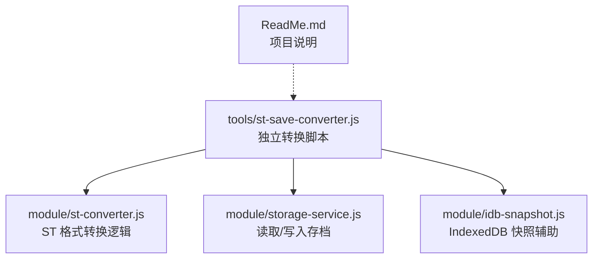
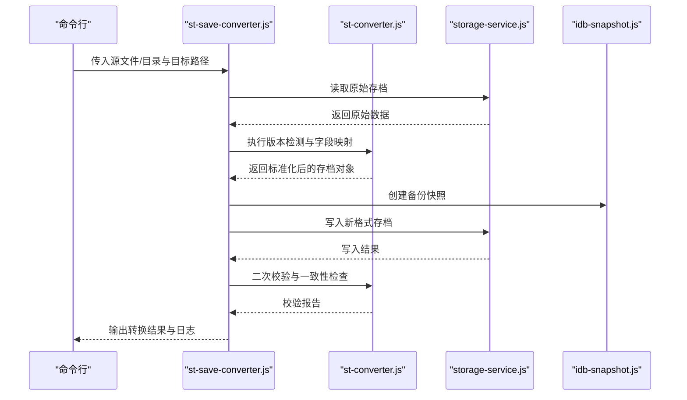
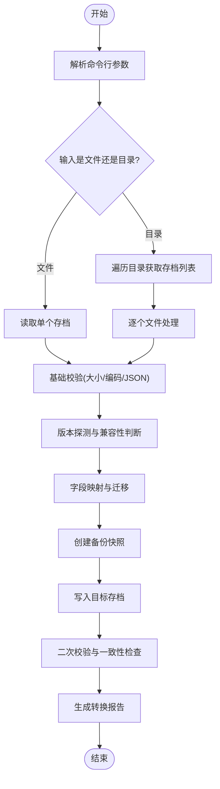
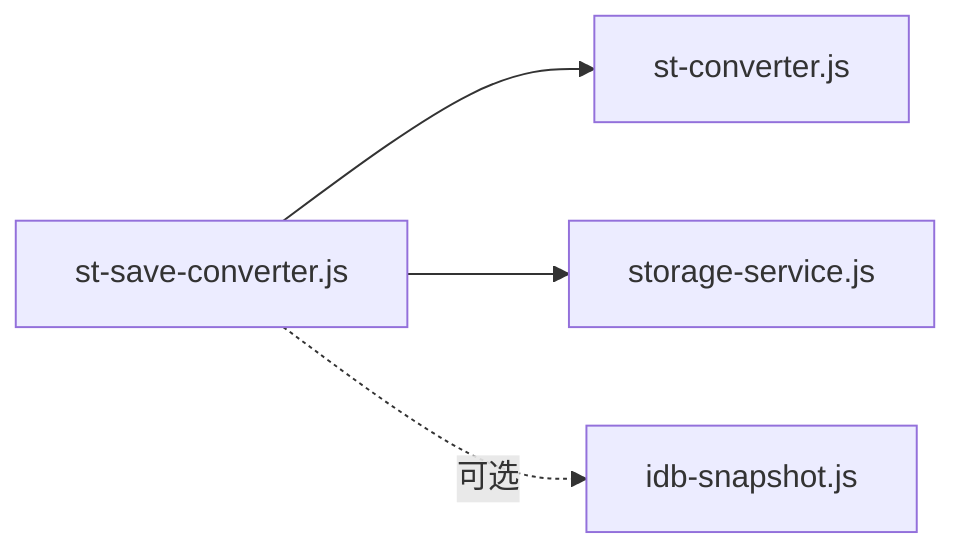

# 存档转换工具

<cite>
**本文引用的文件**   
- [st-save-converter.js](file://tools/st-save-converter.js)
- [st-converter.js](file://module/st-converter.js)
- [storage-service.js](file://module/storage-service.js)
- [idb-snapshot.js](file://module/idb-snapshot.js)
- [ReadMe.md](file://ReadMe.md)
</cite>

## 目录
1. [简介](#简介)
2. [项目结构](#项目结构)
3. [核心组件](#核心组件)
4. [架构总览](#架构总览)
5. [详细组件分析](#详细组件分析)
6. [依赖关系分析](#依赖关系分析)
7. [性能与兼容性](#性能与兼容性)
8. [故障排查指南](#故障排查指南)
9. [结论](#结论)
10. [附录](#附录)

## 简介
本文件为“存档转换工具”的完整使用与维护文档，聚焦于 tools/st-save-converter.js 脚本的功能、数据格式转换规则、多版本存档兼容性与迁移策略、ST 格式与其他存档格式的互转方法、批量转换与命令行参数说明、数据完整性校验与错误恢复机制，以及存档结构解析与字段映射关系。目标是帮助开发者快速理解并安全地升级和维护存档系统。

## 项目结构
与存档转换相关的代码主要分布在以下位置：
- 独立转换脚本（Node 环境）：tools/st-save-converter.js
- 浏览器端 ST 转换器：module/st-converter.js
- 存储与快照服务：module/storage-service.js、module/idb-snapshot.js
- 项目概览与使用说明：ReadMe.md

图表来源
- [st-save-converter.js](file://tools/st-save-converter.js)
- [st-converter.js](file://module/st-converter.js)
- [storage-service.js](file://module/storage-service.js)
- [idb-snapshot.js](file://module/idb-snapshot.js)
- [ReadMe.md](file://ReadMe.md)

章节来源
- [st-save-converter.js](file://tools/st-save-converter.js)
- [st-converter.js](file://module/st-converter.js)
- [storage-service.js](file://module/storage-service.js)
- [idb-snapshot.js](file://module/idb-snapshot.js)
- [ReadMe.md](file://ReadMe.md)

## 核心组件
- 独立转换脚本（tools/st-save-converter.js）
  - 提供命令行入口，支持单文件或批量转换
  - 负责输入输出路径解析、日志输出、错误处理与重试
  - 调用底层转换模块完成具体格式转换
- ST 格式转换模块（module/st-converter.js）
  - 定义 ST 存档的结构与字段映射
  - 实现不同版本间的迁移与降级/升级逻辑
  - 提供通用校验与规范化函数
- 存储与快照服务（module/storage-service.js、module/idb-snapshot.js）
  - 封装本地文件读写与 IndexedDB 快照能力
  - 提供一致性保障与回滚点创建

章节来源
- [st-save-converter.js](file://tools/st-save-converter.js)
- [st-converter.js](file://module/st-converter.js)
- [storage-service.js](file://module/storage-service.js)
- [idb-snapshot.js](file://module/idb-snapshot.js)

## 架构总览
整体流程分为“解析—校验—转换—落盘—验证”五个阶段，确保存档在跨版本迁移过程中的完整性与可追溯性。

图表来源
- [st-save-converter.js](file://tools/st-save-converter.js)
- [st-converter.js](file://module/st-converter.js)
- [storage-service.js](file://module/storage-service.js)
- [idb-snapshot.js](file://module/idb-snapshot.js)

## 详细组件分析

### 独立转换脚本（tools/st-save-converter.js）
- 功能要点
  - 解析命令行参数：输入路径、输出路径、是否覆盖、是否生成备份、并发度等
  - 支持单文件与目录遍历批量转换
  - 对每个文件执行“读取→转换→备份→写入→校验”的流水线
  - 记录详细日志，包含成功/失败统计与错误摘要
- 关键行为
  - 遇到不可读或损坏文件时跳过并记录错误，继续处理其他文件
  - 转换前自动创建备份快照，失败时可一键回滚
  - 提供进度提示与最终汇总报告

章节来源
- [st-save-converter.js](file://tools/st-save-converter.js)

### ST 格式转换模块（module/st-converter.js）
- 功能要点
  - 定义 ST 存档的数据模型与字段清单
  - 实现版本探测与迁移策略（升版/降版）
  - 提供字段映射表与默认值填充规则
  - 提供结构化校验器，用于发现缺失字段、类型不匹配、枚举越界等问题
- 关键行为
  - 对未知字段采用“保留+警告”策略，避免破坏旧数据
  - 对必填字段进行存在性与合法性校验，必要时按规则补全
  - 输出转换差异摘要，便于审计与回溯

章节来源
- [st-converter.js](file://module/st-converter.js)

### 存储与快照服务（module/storage-service.js、module/idb-snapshot.js）
- 功能要点
  - 统一文件 I/O 接口，屏蔽平台差异
  - 提供 IndexedDB 快照能力，用于临时保存中间状态
  - 支持事务式写入与原子替换，降低部分写入风险
- 关键行为
  - 写入失败时自动清理临时文件
  - 快照命名带时间戳，便于定位与恢复
  - 提供“列出快照”“删除过期快照”等管理操作

章节来源
- [storage-service.js](file://module/storage-service.js)
- [idb-snapshot.js](file://module/idb-snapshot.js)

### 转换流程图（算法级）

图表来源
- [st-save-converter.js](file://tools/st-save-converter.js)
- [st-converter.js](file://module/st-converter.js)
- [storage-service.js](file://module/storage-service.js)
- [idb-snapshot.js](file://module/idb-snapshot.js)

## 依赖关系分析
- 直接依赖
  - st-save-converter.js 依赖 st-converter.js 的核心转换逻辑
  - st-save-converter.js 通过 storage-service.js 进行文件读写
  - 可选依赖 idb-snapshot.js 以启用 IndexedDB 快照
- 间接依赖
  - 若运行于 Node 环境，可能依赖文件系统 API；若在浏览器环境，则通过 Web API 访问
- 潜在循环依赖
  - 当前设计将“转换逻辑”与“I/O 操作”解耦，避免循环依赖

图表来源
- [st-save-converter.js](file://tools/st-save-converter.js)
- [st-converter.js](file://module/st-converter.js)
- [storage-service.js](file://module/storage-service.js)
- [idb-snapshot.js](file://module/idb-snapshot.js)

章节来源
- [st-save-converter.js](file://tools/st-save-converter.js)
- [st-converter.js](file://module/st-converter.js)
- [storage-service.js](file://module/storage-service.js)
- [idb-snapshot.js](file://module/idb-snapshot.js)

## 性能与兼容性
- 性能建议
  - 批量转换时合理设置并发度，避免磁盘 I/O 瓶颈
  - 大文件优先进行轻量校验，再进入重计算迁移
  - 使用增量写入与原子替换减少锁竞争
- 兼容性策略
  - 向后兼容：新版本能读取旧版本存档
  - 向前兼容：旧版本尽量忽略新增字段而不报错
  - 版本探测失败时，采用保守模式（仅做最小必要变更）

[本节为通用指导，无需特定文件引用]

## 故障排查指南
- 常见问题
  - 无法读取源文件：检查路径权限与文件是否存在
  - JSON 解析失败：确认文件编码与格式正确
  - 字段缺失或类型不匹配：查看转换报告的差异摘要
  - 写入失败：检查目标路径权限与磁盘空间
- 恢复步骤
  - 使用快照列表定位最近一次成功备份
  - 执行回滚操作，将目标存档恢复至快照状态
  - 修正输入数据后重新执行转换
- 日志与诊断
  - 开启详细日志，关注“版本探测”“字段映射”“写入”“校验”四个阶段的错误信息
  - 对重复失败的样本归档，便于后续修复

章节来源
- [st-save-converter.js](file://tools/st-save-converter.js)
- [storage-service.js](file://module/storage-service.js)
- [idb-snapshot.js](file://module/idb-snapshot.js)

## 结论
通过将“转换逻辑”与“I/O 操作”解耦，并提供完善的备份、校验与回滚机制，该存档转换工具能够在多版本共存的环境下安全地完成 ST 存档的升级与迁移。建议在生产环境中结合自动化测试与回归用例，持续完善字段映射与兼容性矩阵。

[本节为总结性内容，无需特定文件引用]

## 附录

### 命令行参数说明（示例）
- 输入路径：指定单个存档文件或目录
- 输出路径：指定转换后的存档存放位置
- 覆盖选项：是否允许覆盖已存在的目标文件
- 备份开关：是否在转换前创建备份快照
- 并发度：批量转换时的并行任务数
- 日志级别：控制输出详细程度

章节来源
- [st-save-converter.js](file://tools/st-save-converter.js)

### 数据完整性验证与错误恢复
- 验证项
  - 结构完整性：必需字段存在且类型正确
  - 业务约束：枚举值合法、数值范围合理
  - 一致性：关联键一致、无孤立条目
- 恢复策略
  - 基于快照的回滚
  - 失败重试与断点续转
  - 差异对比与人工复核

章节来源
- [st-converter.js](file://module/st-converter.js)
- [storage-service.js](file://module/storage-service.js)
- [idb-snapshot.js](file://module/idb-snapshot.js)

### 存档结构解析与字段映射
- 结构解析
  - 识别版本号与元数据
  - 提取核心实体与关联关系
- 字段映射
  - 旧字段到新字段的映射表
  - 缺失字段的默认值与推导规则
  - 废弃字段的保留策略（只读/隐藏）

章节来源
- [st-converter.js](file://module/st-converter.js)

### 参考与扩展
- 项目说明与背景信息可参见 ReadMe.md，了解整体设计与使用场景。

章节来源
- [ReadMe.md](file://ReadMe.md)