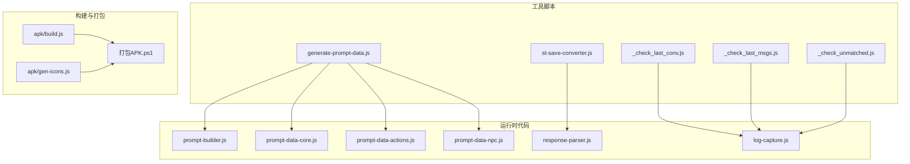
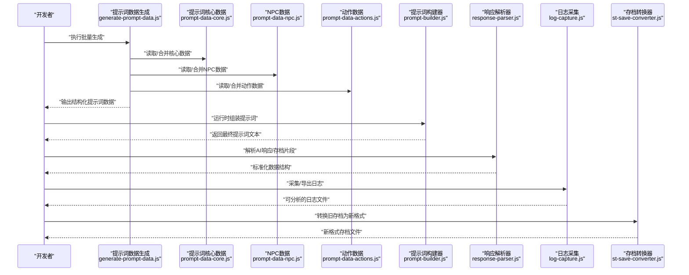
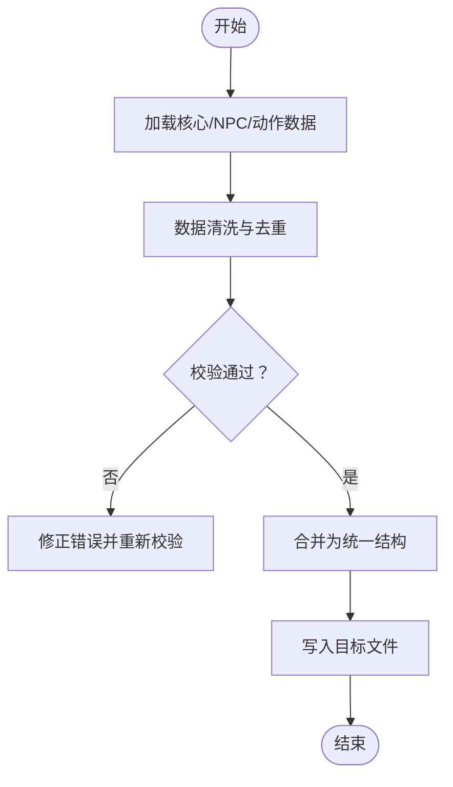
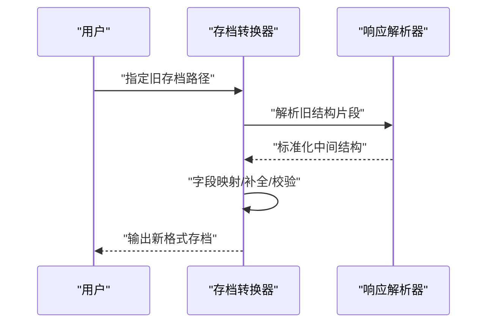
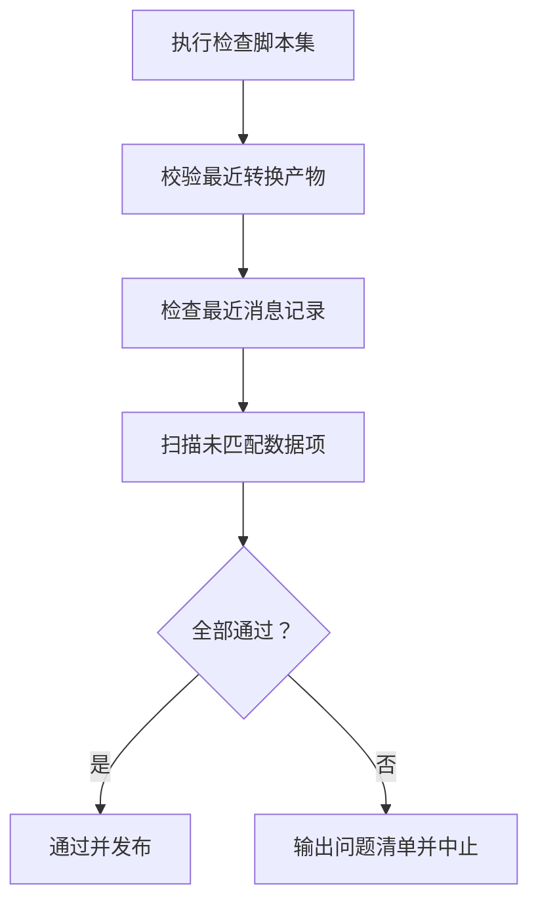
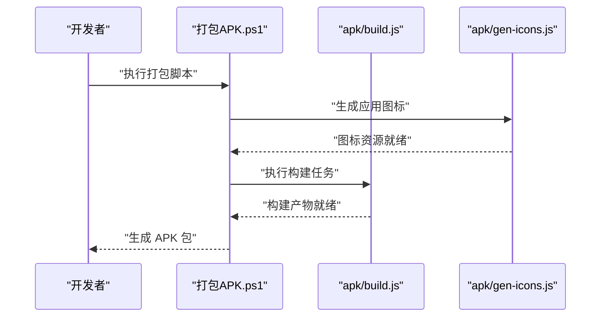
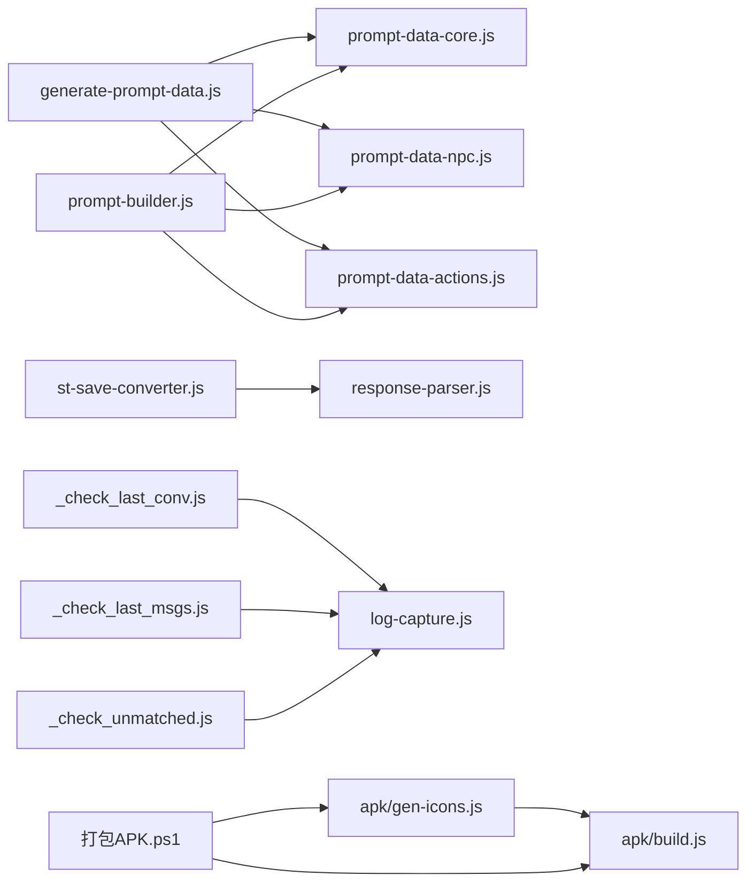

# 开发工具

<cite>
**本文引用的文件**   
- [tools/generate-prompt-data.js](file://tools/generate-prompt-data.js)
- [tools/st-save-converter.js](file://tools/st-save-converter.js)
- [tools/_check_last_conv.js](file://tools/_check_last_conv.js)
- [tools/_check_last_msgs.js](file://tools/_check_last_msgs.js)
- [tools/_check_unmatched.js](file://tools/_check_unmatched.js)
- [module/prompt-builder.js](file://module/prompt-builder.js)
- [module/prompt-data-core.js](file://module/prompt-data-core.js)
- [module/prompt-data-actions.js](file://module/prompt-data-actions.js)
- [module/prompt-data-npc.js](file://module/prompt-data-npc.js)
- [module/response-parser.js](file://module/response-parser.js)
- [module/log-capture.js](file://module/log-capture.js)
- [apk/build.js](file://apk/build.js)
- [apk/gen-icons.js](file://apk/gen-icons.js)
- [打包APK.ps1](file://打包APK.ps1)
- [ReadMe.md](file://ReadMe.md)
</cite>

## 目录
1. [简介](#简介)
2. [项目结构](#项目结构)
3. [核心组件](#核心组件)
4. [架构总览](#架构总览)
5. [详细组件分析](#详细组件分析)
6. [依赖关系分析](#依赖关系分析)
7. [性能与效率建议](#性能与效率建议)
8. [故障排查指南](#故障排查指南)
9. [结论](#结论)
10. [附录](#附录)

## 简介
本文件面向姬侠传项目的开发者，系统化梳理并说明开发辅助脚本、提示词数据生成工具、存档转换器、测试辅助脚本以及构建打包工具的使用方法。文档旨在帮助开发者快速上手工具链，理解数据流转与处理逻辑，并提供调试与排错技巧，从而提升整体开发与迭代效率。

## 项目结构
本项目采用“前端模块 + 工具脚本 + 资源”的清晰分层：
- module：运行时前端模块（提示词构建、响应解析、日志捕获等）
- tools：开发期脚本（提示词数据生成、存档转换、检查脚本）
- apk：Capacitor/Android 打包相关脚本与配置
- assets/img/bgm 等：游戏资源
- 根目录 HTML：各页面入口

图表来源
- [tools/generate-prompt-data.js](file://tools/generate-prompt-data.js)
- [tools/st-save-converter.js](file://tools/st-save-converter.js)
- [tools/_check_last_conv.js](file://tools/_check_last_conv.js)
- [tools/_check_last_msgs.js](file://tools/_check_last_msgs.js)
- [tools/_check_unmatched.js](file://tools/_check_unmatched.js)
- [module/prompt-builder.js](file://module/prompt-builder.js)
- [module/prompt-data-core.js](file://module/prompt-data-core.js)
- [module/prompt-data-actions.js](file://module/prompt-data-actions.js)
- [module/prompt-data-npc.js](file://module/prompt-data-npc.js)
- [module/response-parser.js](file://module/response-parser.js)
- [module/log-capture.js](file://module/log-capture.js)
- [apk/build.js](file://apk/build.js)
- [apk/gen-icons.js](file://apk/gen-icons.js)
- [打包APK.ps1](file://打包APK.ps1)

章节来源
- [ReadMe.md](file://ReadMe.md)

## 核心组件
本节聚焦三大类开发工具：提示词数据生成、存档转换、检查与自动化脚本，并给出典型使用流程与注意事项。

- 提示词数据生成工具
  - 作用：将原始设定与素材批量转换为运行时可用的提示词数据结构，供 prompt-builder 组合成最终提示词。
  - 关键输入：角色/NPC/动作等原始数据源（由生成脚本读取）。
  - 关键输出：结构化提示词数据（JSON/JS 对象），供运行时加载。
  - 典型用法：在仓库根或 tools 目录下执行 Node 脚本；支持批量处理与覆盖写入。
  - 参考实现位置：[tools/generate-prompt-data.js](file://tools/generate-prompt-data.js)，运行时依赖：[module/prompt-builder.js](file://module/prompt-builder.js)、[module/prompt-data-core.js](file://module/prompt-data-core.js)、[module/prompt-data-actions.js](file://module/prompt-data-actions.js)、[module/prompt-data-npc.js](file://module/prompt-data-npc.js)。

- 存档转换器
  - 作用：将旧版存档格式转换为新版格式，确保升级后仍可继续游玩。
  - 关键输入：旧版存档文件路径。
  - 关键输出：新格式存档文件（原地覆盖或另存为）。
  - 典型用法：命令行指定输入/输出路径；失败时保留原文件以便回滚。
  - 参考实现位置：[tools/st-save-converter.js](file://tools/st-save-converter.js)，运行时解析依赖：[module/response-parser.js](file://module/response-parser.js)。

- 检查与自动化脚本
  - _check_last_conv.js：校验最近一次转换结果的关键字段是否完整。
  - _check_last_msgs.js：检查最近消息记录是否存在异常或缺失。
  - _check_unmatched.js：检测未匹配的数据项（如引用缺失、ID 不一致等）。
  - 参考实现位置：
    - [tools/_check_last_conv.js](file://tools/_check_last_conv.js)
    - [tools/_check_last_msgs.js](file://tools/_check_last_msgs.js)
    - [tools/_check_unmatched.js](file://tools/_check_unmatched.js)
  - 日志采集依赖：[module/log-capture.js](file://module/log-capture.js)

章节来源
- [tools/generate-prompt-data.js](file://tools/generate-prompt-data.js)
- [tools/st-save-converter.js](file://tools/st-save-converter.js)
- [tools/_check_last_conv.js](file://tools/_check_last_conv.js)
- [tools/_check_last_msgs.js](file://tools/_check_last_msgs.js)
- [tools/_check_unmatched.js](file://tools/_check_unmatched.js)
- [module/prompt-builder.js](file://module/prompt-builder.js)
- [module/prompt-data-core.js](file://module/prompt-data-core.js)
- [module/prompt-data-actions.js](file://module/prompt-data-actions.js)
- [module/prompt-data-npc.js](file://module/prompt-data-npc.js)
- [module/response-parser.js](file://module/response-parser.js)
- [module/log-capture.js](file://module/log-capture.js)

## 架构总览
下图展示了从“数据准备 → 提示词构建 → 运行解析 → 日志采集”的整体链路，以及“存档转换”和“构建打包”两条并行工作流。

图表来源
- [tools/generate-prompt-data.js](file://tools/generate-prompt-data.js)
- [module/prompt-data-core.js](file://module/prompt-data-core.js)
- [module/prompt-data-npc.js](file://module/prompt-data-npc.js)
- [module/prompt-data-actions.js](file://module/prompt-data-actions.js)
- [module/prompt-builder.js](file://module/prompt-builder.js)
- [module/response-parser.js](file://module/response-parser.js)
- [module/log-capture.js](file://module/log-capture.js)
- [tools/st-save-converter.js](file://tools/st-save-converter.js)

## 详细组件分析

### 提示词数据生成工具（generate-prompt-data.js）
- 功能要点
  - 批量读取多源数据（核心、NPC、动作等），进行清洗、去重、合并。
  - 输出统一结构的提示词数据，便于运行时高效拼装。
  - 支持增量更新与幂等执行（重复执行不产生脏数据）。
- 典型流程
  - 初始化参数与路径
  - 加载核心数据与扩展数据
  - 执行映射与校验
  - 写入目标文件
- 与运行时的协作
  - 生成的数据被 prompt-builder 消费，按场景动态组合提示词。
  - 若新增数据类型，需同步更新 prompt-data-* 模块以保持一致性。

图表来源
- [tools/generate-prompt-data.js](file://tools/generate-prompt-data.js)
- [module/prompt-data-core.js](file://module/prompt-data-core.js)
- [module/prompt-data-npc.js](file://module/prompt-data-npc.js)
- [module/prompt-data-actions.js](file://module/prompt-data-actions.js)

章节来源
- [tools/generate-prompt-data.js](file://tools/generate-prompt-data.js)
- [module/prompt-data-core.js](file://module/prompt-data-core.js)
- [module/prompt-data-npc.js](file://module/prompt-data-npc.js)
- [module/prompt-data-actions.js](file://module/prompt-data-actions.js)

### 存档转换器（st-save-converter.js）
- 使用场景
  - 版本升级后，旧存档无法直接加载。
  - 需要迁移字段、修复损坏条目、补齐默认值。
- 转换规则要点
  - 识别旧版关键字段并进行映射到新版结构。
  - 对缺失字段填充默认值，保证运行时稳定。
  - 提供安全模式：转换失败时保留原文件。
- 与解析器的协作
  - 借助 response-parser 对复杂片段进行解析与规范化。

图表来源
- [tools/st-save-converter.js](file://tools/st-save-converter.js)
- [module/response-parser.js](file://module/response-parser.js)

章节来源
- [tools/st-save-converter.js](file://tools/st-save-converter.js)
- [module/response-parser.js](file://module/response-parser.js)

### 检查与自动化脚本（_check_last_conv.js / _check_last_msgs.js / _check_unmatched.js）
- 职责分工
  - _check_last_conv.js：验证最近一次转换产物完整性。
  - _check_last_msgs.js：检查最近消息记录的连续性与一致性。
  - _check_unmatched.js：扫描未匹配项（如 ID 引用缺失、名称不一致等）。
- 与日志系统的集成
  - 通过 log-capture 采集运行期日志，辅助定位问题。
- 推荐用法
  - 在每次数据变更或转换后依次执行，形成质量门禁。

图表来源
- [tools/_check_last_conv.js](file://tools/_check_last_conv.js)
- [tools/_check_last_msgs.js](file://tools/_check_last_msgs.js)
- [tools/_check_unmatched.js](file://tools/_check_unmatched.js)
- [module/log-capture.js](file://module/log-capture.js)

章节来源
- [tools/_check_last_conv.js](file://tools/_check_last_conv.js)
- [tools/_check_last_msgs.js](file://tools/_check_last_msgs.js)
- [tools/_check_unmatched.js](file://tools/_check_unmatched.js)
- [module/log-capture.js](file://module/log-capture.js)

### 构建与打包工具（apk/build.js / apk/gen-icons.js / 打包APK.ps1）
- 功能概览
  - build.js：负责前端资源预处理与打包。
  - gen-icons.js：根据资源生成应用图标。
  - 打包APK.ps1：一键调用构建与打包流程，适配 Windows 环境。
- 典型流程
  - 清理旧产物 → 生成图标 → 构建前端 → 生成 APK。
- 适用人群
  - 需要本地构建 Android 包或分发预发布版本的开发者。

图表来源
- [apk/build.js](file://apk/build.js)
- [apk/gen-icons.js](file://apk/gen-icons.js)
- [打包APK.ps1](file://打包APK.ps1)

章节来源
- [apk/build.js](file://apk/build.js)
- [apk/gen-icons.js](file://apk/gen-icons.js)
- [打包APK.ps1](file://打包APK.ps1)

## 依赖关系分析
- 提示词数据生成对运行时模块存在强耦合：
  - generate-prompt-data.js 依赖 prompt-data-core/npc/actions 的结构定义。
  - 运行时 prompt-builder 消费生成产物，二者需保持契约一致。
- 存档转换器依赖 response-parser 的解析能力，用于兼容不同历史格式。
- 检查脚本依赖 log-capture 提供的日志能力，便于回溯问题。
- 构建脚本之间顺序依赖：gen-icons 先于 build，ps1 编排两者。

图表来源
- [tools/generate-prompt-data.js](file://tools/generate-prompt-data.js)
- [module/prompt-data-core.js](file://module/prompt-data-core.js)
- [module/prompt-data-npc.js](file://module/prompt-data-npc.js)
- [module/prompt-data-actions.js](file://module/prompt-data-actions.js)
- [module/prompt-builder.js](file://module/prompt-builder.js)
- [tools/st-save-converter.js](file://tools/st-save-converter.js)
- [module/response-parser.js](file://module/response-parser.js)
- [tools/_check_last_conv.js](file://tools/_check_last_conv.js)
- [tools/_check_last_msgs.js](file://tools/_check_last_msgs.js)
- [tools/_check_unmatched.js](file://tools/_check_unmatched.js)
- [module/log-capture.js](file://module/log-capture.js)
- [apk/gen-icons.js](file://apk/gen-icons.js)
- [apk/build.js](file://apk/build.js)
- [打包APK.ps1](file://打包APK.ps1)

## 性能与效率建议
- 提示词数据生成
  - 优先增量更新：仅处理变更的数据源，减少 I/O 与 CPU 开销。
  - 缓存中间结果：对耗时映射/校验步骤引入缓存键，避免重复计算。
  - 并行化：对独立数据块（如不同 NPC 组）并发处理，注意控制并发度以避免锁竞争。
- 存档转换
  - 分块读取大存档：避免一次性载入导致内存峰值过高。
  - 失败重试与断点续转：记录已转换进度，出错后可恢复。
- 检查脚本
  - 将检查纳入 CI：每次提交自动执行，尽早发现问题。
  - 输出结构化报告：便于后续统计与趋势分析。
- 构建打包
  - 缓存依赖与中间产物：缩短二次构建时间。
  - 按需生成图标：仅在资源变化时触发，减少不必要操作。

## 故障排查指南
- 常见问题定位
  - 提示词数据不完整：运行 _check_last_conv.js 与 _check_unmatched.js，对照输出清单逐项修复。
  - 消息记录异常：使用 _check_last_msgs.js 检查连续性，结合 log-capture 导出的日志定位具体时间点。
  - 存档转换失败：确认旧格式关键字段是否存在；必要时回退到备份存档，逐步缩小问题范围。
- 日志分析技巧
  - 关注错误堆栈与上下文信息，优先定位首次异常。
  - 使用关键词过滤（如“error”、“warn”、“unmatched”）快速收敛问题域。
  - 对比正常与异常两次运行的日志差异，提取变更影响面。
- 构建问题
  - 图标生成失败：检查资源路径与命名规范。
  - 打包中断：查看 ps1 脚本输出，确认前置步骤是否成功完成。

章节来源
- [tools/_check_last_conv.js](file://tools/_check_last_conv.js)
- [tools/_check_last_msgs.js](file://tools/_check_last_msgs.js)
- [tools/_check_unmatched.js](file://tools/_check_unmatched.js)
- [module/log-capture.js](file://module/log-capture.js)

## 结论
通过系统化的工具链组织，姬侠传项目在数据准备、存档迁移、质量检查与构建打包方面形成了闭环。遵循本文档的流程与建议，开发者可以显著提升迭代效率与稳定性。建议在团队内推广这些脚本作为标准工作流的一部分，并结合 CI/CD 持续改进。

## 附录
- 常用命令速查
  - 生成提示词数据：在 tools 目录执行 generate-prompt-data.js
  - 转换存档：在 tools 目录执行 st-save-converter.js 并传入输入/输出路径
  - 执行检查脚本：依次运行 _check_last_conv.js、_check_last_msgs.js、_check_unmatched.js
  - 构建与打包：在根目录执行 打包APK.ps1
- 参考入口
  - 项目说明：[ReadMe.md](file://ReadMe.md)