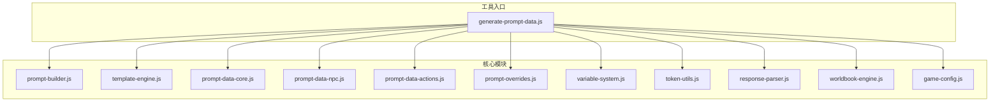
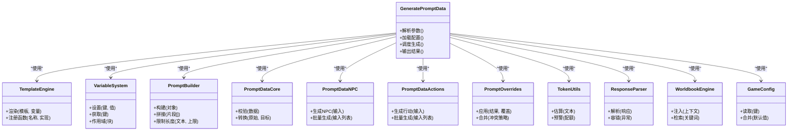
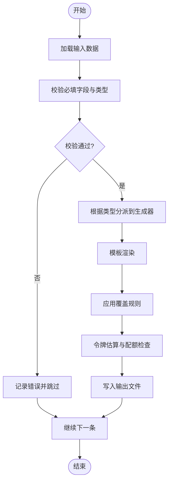

# 提示词数据生成工具

<cite>
**本文引用的文件**   
- [generate-prompt-data.js](file://tools/generate-prompt-data.js)
- [prompt-builder.js](file://module/prompt-builder.js)
- [template-engine.js](file://module/template-engine.js)
- [prompt-data-core.js](file://module/prompt-data-core.js)
- [prompt-data-npc.js](file://module/prompt-data-npc.js)
- [prompt-data-actions.js](file://module/prompt-data-actions.js)
- [prompt-overrides.js](file://module/prompt-overrides.js)
- [variable-system.js](file://module/variable-system.js)
- [token-utils.js](file://module/token-utils.js)
- [response-parser.js](file://module/response-parser.js)
- [worldbook-engine.js](file://module/worldbook-engine.js)
- [game-config.js](file://module/game-config.js)
</cite>

## 目录
1. [简介](#简介)
2. [项目结构](#项目结构)
3. [核心组件](#核心组件)
4. [架构总览](#架构总览)
5. [详细组件分析](#详细组件分析)
6. [依赖关系分析](#依赖关系分析)
7. [性能与扩展性](#性能与扩展性)
8. [故障排查指南](#故障排查指南)
9. [结论](#结论)
10. [附录：输入输出规范与最佳实践](#附录输入输出规范与最佳实践)

## 简介
本工具面向内容创作者，提供批量生成“NPC对话数据、角色属性、场景描述”等提示词相关数据的能力。通过统一的脚本入口与可插拔的模板引擎，支持从结构化输入快速产出标准化输出，便于后续在运行时进行检索、拼接与渲染。

## 项目结构
与提示词数据生成相关的代码主要分布在 tools 与 module 两个目录中：
- tools/generate-prompt-data.js：命令行脚本入口，负责参数解析、流程编排与结果落盘。
- module/*：通用能力与业务模块，包括模板引擎、变量系统、提示词构建器、NPC/动作/覆盖层、世界书、响应解析、令牌统计等。



图表来源
- [generate-prompt-data.js](file://tools/generate-prompt-data.js)
- [prompt-builder.js](file://module/prompt-builder.js)
- [template-engine.js](file://module/template-engine.js)
- [prompt-data-core.js](file://module/prompt-data-core.js)
- [prompt-data-npc.js](file://module/prompt-data-npc.js)
- [prompt-data-actions.js](file://module/prompt-data-actions.js)
- [prompt-overrides.js](file://module/prompt-overrides.js)
- [variable-system.js](file://module/variable-system.js)
- [token-utils.js](file://module/token-utils.js)
- [response-parser.js](file://module/response-parser.js)
- [worldbook-engine.js](file://module/worldbook-engine.js)
- [game-config.js](file://module/game-config.js)

章节来源
- [generate-prompt-data.js](file://tools/generate-prompt-data.js)
- [prompt-builder.js](file://module/prompt-builder.js)
- [template-engine.js](file://module/template-engine.js)
- [prompt-data-core.js](file://module/prompt-data-core.js)
- [prompt-data-npc.js](file://module/prompt-data-npc.js)
- [prompt-data-actions.js](file://module/prompt-data-actions.js)
- [prompt-overrides.js](file://module/prompt-overrides.js)
- [variable-system.js](file://module/variable-system.js)
- [token-utils.js](file://module/token-utils.js)
- [response-parser.js](file://module/response-parser.js)
- [worldbook-engine.js](file://module/worldbook-engine.js)
- [game-config.js](file://module/game-config.js)

## 核心组件
- 脚本入口 generate-prompt-data.js
  - 职责：解析命令行参数、加载配置与输入数据、调度各模块完成生成、汇总统计并写入输出文件。
  - 关键行为：读取输入源（如 JSON/CSV）、按任务类型（NPC/属性/场景）分发处理、调用模板引擎渲染、执行覆盖策略、记录令牌用量与错误日志。
- 模板引擎 template-engine.js
  - 职责：提供模板语法解析与变量替换，支持嵌套、条件与循环等常用能力。
- 变量系统 variable-system.js
  - 职责：维护上下文变量与作用域，提供变量解析、默认值与校验。
- 提示词构建器 prompt-builder.js
  - 职责：将业务对象（NPC/属性/场景）转换为最终提示词片段或结构化数据块。
- 数据层模块
  - prompt-data-core.js：通用数据结构定义、校验与转换。
  - prompt-data-npc.js：NPC 对话与属性生成逻辑。
  - prompt-data-actions.js：行动/事件类数据生成逻辑。
  - prompt-overrides.js：覆盖规则与优先级控制。
- 辅助与集成
  - token-utils.js：令牌估算与配额管理。
  - response-parser.js：外部响应解析与容错。
  - worldbook-engine.js：世界书/知识库注入。
  - game-config.js：游戏运行期配置读取。

章节来源
- [generate-prompt-data.js](file://tools/generate-prompt-data.js)
- [template-engine.js](file://module/template-engine.js)
- [variable-system.js](file://module/variable-system.js)
- [prompt-builder.js](file://module/prompt-builder.js)
- [prompt-data-core.js](file://module/prompt-data-core.js)
- [prompt-data-npc.js](file://module/prompt-data-npc.js)
- [prompt-data-actions.js](file://module/prompt-data-actions.js)
- [prompt-overrides.js](file://module/prompt-overrides.js)
- [token-utils.js](file://module/token-utils.js)
- [response-parser.js](file://module/response-parser.js)
- [worldbook-engine.js](file://module/worldbook-engine.js)
- [game-config.js](file://module/game-config.js)

## 架构总览
整体采用“入口脚本 + 模块化能力”的分层架构：入口负责编排，模块各司其职并通过清晰的接口协作。

```mermaid
sequenceDiagram
participant CLI as "命令行用户"
participant Entry as "generate-prompt-data.js"
participant Core as "prompt-data-core.js"
participant NPC as "prompt-data-npc.js"
participant Act as "prompt-data-actions.js"
participant Tpl as "template-engine.js"
participant Var as "variable-system.js"
participant Build as "prompt-builder.js"
participant Over as "prompt-overrides.js"
participant Tok as "token-utils.js"
participant Rsp as "response-parser.js"
participant Wb as "worldbook-engine.js"
participant Cfg as "game-config.js"
CLI->>Entry : 传入参数与输入路径
Entry->>Cfg : 读取运行配置
Entry->>Core : 初始化数据结构/校验
Entry->>Tpl : 准备模板集
Entry->>Var : 初始化变量作用域
alt 任务=生成NPC
Entry->>NPC : 批量生成NPC对话/属性
NPC->>Tpl : 渲染模板
NPC->>Build : 组装提示词片段
NPC->>Over : 应用覆盖规则
NPC->>Tok : 统计令牌
NPC-->>Entry : 返回结果集合
else 任务=生成行动/事件
Entry->>Act : 批量生成行动数据
Act->>Tpl : 渲染模板
Act->>Build : 组装提示词片段
Act->>Over : 应用覆盖规则
Act->>Tok : 统计令牌
Act-->>Entry : 返回结果集合
end
Entry->>Wb : 可选注入世界书上下文
Entry->>Rsp : 解析/清洗外部响应
Entry-->>CLI : 输出文件与统计报告
```

图表来源
- [generate-prompt-data.js](file://tools/generate-prompt-data.js)
- [prompt-data-core.js](file://module/prompt-data-core.js)
- [prompt-data-npc.js](file://module/prompt-data-npc.js)
- [prompt-data-actions.js](file://module/prompt-data-actions.js)
- [template-engine.js](file://module/template-engine.js)
- [variable-system.js](file://module/variable-system.js)
- [prompt-builder.js](file://module/prompt-builder.js)
- [prompt-overrides.js](file://module/prompt-overrides.js)
- [token-utils.js](file://module/token-utils.js)
- [response-parser.js](file://module/response-parser.js)
- [worldbook-engine.js](file://module/worldbook-engine.js)
- [game-config.js](file://module/game-config.js)

## 详细组件分析

### 脚本入口：generate-prompt-data.js
- 功能要点
  - 参数解析：支持指定输入文件、输出目录、任务类型、模板选择、是否启用覆盖、并发度等。
  - 数据流：读取输入 -> 校验 -> 分派到对应生成器 -> 模板渲染 -> 覆盖合并 -> 令牌统计 -> 落盘。
  - 错误处理：对缺失字段、模板渲染失败、IO 异常等进行捕获与记录，支持继续模式与失败聚合。
- 典型流程
  - 初始化配置与变量作用域
  - 加载模板与覆盖规则
  - 遍历输入条目，按类型调用 NPC/行动生成器
  - 汇总统计并输出结果与日志

章节来源
- [generate-prompt-data.js](file://tools/generate-prompt-data.js)

### 模板引擎：template-engine.js
- 能力说明
  - 模板语法：支持变量占位、条件分支、列表循环、子模板包含等。
  - 渲染管线：解析 -> 绑定变量 -> 递归渲染 -> 缓存命中优化。
- 扩展点
  - 自定义函数注册：可在渲染时注入业务函数。
  - 模板加载器：支持多目录、版本化模板。

章节来源
- [template-engine.js](file://module/template-engine.js)

### 变量系统：variable-system.js
- 能力说明
  - 作用域链：全局/局部变量隔离与继承。
  - 解析与校验：类型检查、默认值填充、缺失告警。
- 与模板引擎协作
  - 为模板渲染提供统一变量访问接口。

章节来源
- [variable-system.js](file://module/variable-system.js)

### 提示词构建器：prompt-builder.js
- 能力说明
  - 将业务对象（NPC/属性/场景）转换为提示词片段或结构化数据块。
  - 支持分段拼接、去重、排序与长度限制。
- 与覆盖层协作
  - 在构建后应用覆盖规则，确保最终一致性。

章节来源
- [prompt-builder.js](file://module/prompt-builder.js)

### 数据层：prompt-data-core.js / prompt-data-npc.js / prompt-data-actions.js
- core
  - 定义通用数据结构、校验器与转换器。
- npc
  - 基于输入生成 NPC 对话与属性，支持批量与增量更新。
- actions
  - 基于输入生成行动/事件数据，支持条件触发与权重。

章节来源
- [prompt-data-core.js](file://module/prompt-data-core.js)
- [prompt-data-npc.js](file://module/prompt-data-npc.js)
- [prompt-data-actions.js](file://module/prompt-data-actions.js)

### 覆盖层：prompt-overrides.js
- 能力说明
  - 定义覆盖优先级与冲突解决策略。
  - 支持按标签、区域、版本等维度匹配覆盖项。

章节来源
- [prompt-overrides.js](file://module/prompt-overrides.js)

### 辅助与集成：token-utils.js / response-parser.js / worldbook-engine.js / game-config.js
- token-utils
  - 估算令牌用量，提供配额预警与截断建议。
- response-parser
  - 解析外部服务响应，做容错与规范化。
- worldbook-engine
  - 注入世界书/知识库上下文，增强生成一致性。
- game-config
  - 读取运行期配置，影响生成行为与输出格式。

章节来源
- [token-utils.js](file://module/token-utils.js)
- [response-parser.js](file://module/response-parser.js)
- [worldbook-engine.js](file://module/worldbook-engine.js)
- [game-config.js](file://module/game-config.js)

## 依赖关系分析


图表来源
- [generate-prompt-data.js](file://tools/generate-prompt-data.js)
- [template-engine.js](file://module/template-engine.js)
- [variable-system.js](file://module/variable-system.js)
- [prompt-builder.js](file://module/prompt-builder.js)
- [prompt-data-core.js](file://module/prompt-data-core.js)
- [prompt-data-npc.js](file://module/prompt-data-npc.js)
- [prompt-data-actions.js](file://module/prompt-data-actions.js)
- [prompt-overrides.js](file://module/prompt-overrides.js)
- [token-utils.js](file://module/token-utils.js)
- [response-parser.js](file://module/response-parser.js)
- [worldbook-engine.js](file://module/worldbook-engine.js)
- [game-config.js](file://module/game-config.js)

## 性能与扩展性
- 性能要点
  - 模板渲染缓存：避免重复解析相同模板。
  - 变量作用域复用：减少创建开销。
  - 令牌估算批量化：降低频繁估算带来的额外成本。
  - I/O 批写：合并落盘操作，减少磁盘抖动。
- 扩展建议
  - 新增任务类型：在入口增加分派分支，并在数据层新增对应生成器。
  - 新增模板族：在模板引擎注册新模板目录与命名空间。
  - 新增覆盖策略：在覆盖层添加新的匹配与合并规则。

[本节为通用指导，不直接分析具体文件]

## 故障排查指南
- 常见问题
  - 输入字段缺失：查看校验日志，确认必填字段与类型。
  - 模板渲染失败：检查模板语法与变量名拼写，确认作用域是否正确。
  - 覆盖冲突：调整覆盖优先级或冲突策略，定位具体覆盖项。
  - 令牌超限：启用截断或拆分策略，必要时分批生成。
  - 外部响应异常：查看解析器的容错日志，重试或降级。
- 定位步骤
  - 开启详细日志，定位失败节点。
  - 缩小输入范围，复现最小用例。
  - 逐步禁用覆盖与外部注入，验证问题边界。

章节来源
- [prompt-data-core.js](file://module/prompt-data-core.js)
- [template-engine.js](file://module/template-engine.js)
- [prompt-overrides.js](file://module/prompt-overrides.js)
- [token-utils.js](file://module/token-utils.js)
- [response-parser.js](file://module/response-parser.js)

## 结论
该工具以模块化设计实现了提示词数据的批量生成，具备高可扩展性与良好的错误处理能力。通过模板引擎与覆盖层的解耦，内容创作者可以高效地定制与迭代生成流程，满足多样化业务需求。

[本节为总结性内容，不直接分析具体文件]

## 附录：输入输出规范与最佳实践

### 输入数据格式要求
- 通用字段
  - id：唯一标识
  - type：数据类型（如 npc、action、scene）
  - content：主体内容（字符串或结构化对象）
  - tags：标签数组，用于覆盖与检索
  - version：版本号，用于覆盖优先级
- 示例结构（概念示意）
  - 单个条目：{ id, type, content, tags, version }
  - 批量输入：条目数组或按类型分组的对象映射

章节来源
- [prompt-data-core.js](file://module/prompt-data-core.js)

### 输出数据结构规范
- 通用字段
  - id：与输入一致
  - type：数据类型
  - text：生成的提示词文本或片段
  - meta：元信息（令牌数、来源模板、覆盖项等）
  - errors：错误与警告列表
- 示例结构（概念示意）
  - 单条输出：{ id, type, text, meta, errors }
  - 批量输出：输出数组或按类型分组的对象映射

章节来源
- [prompt-data-core.js](file://module/prompt-data-core.js)

### 自定义模板配置方法
- 模板组织
  - 按类型划分目录（npc、action、scene），每个模板文件对应一个渲染单元。
- 变量绑定
  - 在变量系统中预置上下文，模板中使用占位符引用。
- 覆盖规则
  - 在覆盖层定义匹配条件与替换策略，支持按标签与版本生效。

章节来源
- [template-engine.js](file://module/template-engine.js)
- [variable-system.js](file://module/variable-system.js)
- [prompt-overrides.js](file://module/prompt-overrides.js)

### 实际使用示例（概念流程）
- 生成 NPC 对话
  - 准备 NPC 输入清单 -> 指定模板族 -> 运行脚本 -> 查看输出与令牌统计
- 生成角色属性
  - 准备属性清单 -> 选择属性模板 -> 运行脚本 -> 校验输出完整性
- 生成场景描述
  - 准备场景清单 -> 注入世界书上下文 -> 运行脚本 -> 审查覆盖效果

章节来源
- [generate-prompt-data.js](file://tools/generate-prompt-data.js)
- [prompt-data-npc.js](file://module/prompt-data-npc.js)
- [prompt-data-actions.js](file://module/prompt-data-actions.js)
- [worldbook-engine.js](file://module/worldbook-engine.js)

### 数据处理流程（流程图）


图表来源
- [generate-prompt-data.js](file://tools/generate-prompt-data.js)
- [prompt-data-core.js](file://module/prompt-data-core.js)
- [template-engine.js](file://module/template-engine.js)
- [prompt-overrides.js](file://module/prompt-overrides.js)
- [token-utils.js](file://module/token-utils.js)

### 最佳实践建议
- 输入侧
  - 保持 id 稳定，便于增量更新与覆盖追踪。
  - 合理使用 tags 与 version，提升覆盖命中率与可控性。
- 模板侧
  - 模板尽量短小且可组合，避免过长导致渲染缓慢。
  - 为复杂逻辑引入自定义函数，提高可读性与复用性。
- 覆盖侧
  - 明确覆盖优先级，避免隐性冲突。
  - 使用版本化覆盖，便于回滚与审计。
- 运行侧
  - 合理设置并发度与批大小，平衡吞吐与内存占用。
  - 关注令牌统计，及时截断或拆分长文本。

[本节为通用指导，不直接分析具体文件]