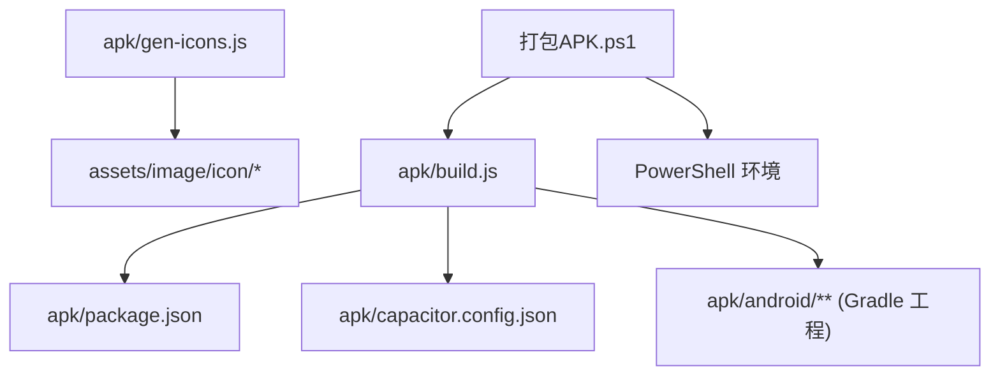
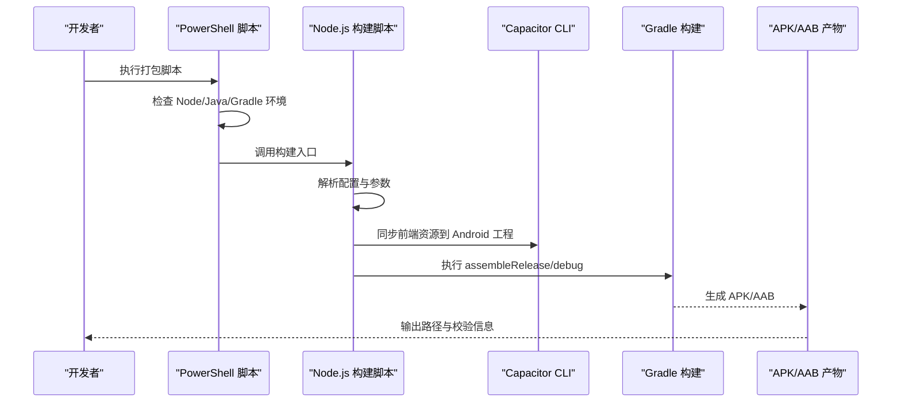
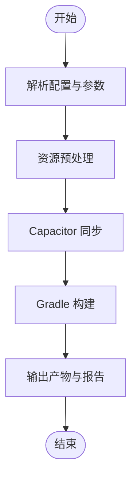
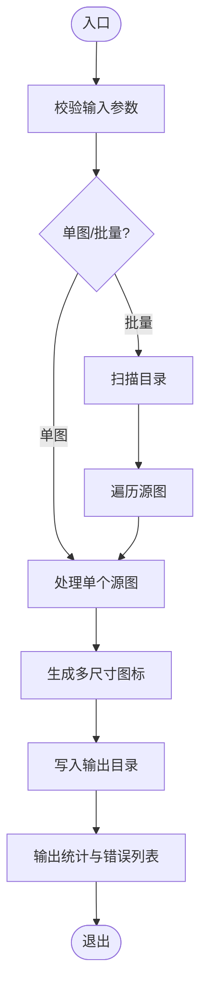
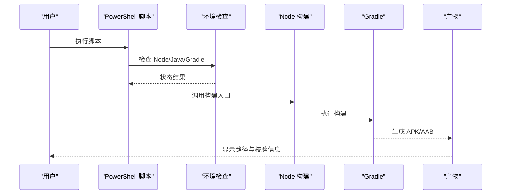
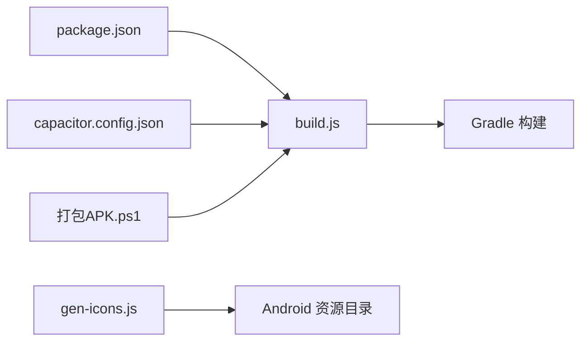

# 构建与部署工具

<cite>
**本文引用的文件**   
- [apk/build.js](file://apk/build.js)
- [apk/gen-icons.js](file://apk/gen-icons.js)
- [apk/package.json](file://apk/package.json)
- [apk/capacitor.config.json](file://apk/capacitor.config.json)
- [apk/android/app/build.gradle](file://apk/android/app/build.gradle)
- [apk/android/gradle.properties](file://apk/android/gradle.properties)
- [apk/android/local.properties](file://apk/android/local.properties)
- [打包APK.ps1](file://打包APK.ps1)
</cite>

## 目录
1. [简介](#简介)
2. [项目结构](#项目结构)
3. [核心组件](#核心组件)
4. [架构总览](#架构总览)
5. [详细组件分析](#详细组件分析)
6. [依赖关系分析](#依赖关系分析)
7. [性能考虑](#性能考虑)
8. [故障排查指南](#故障排查指南)
9. [结论](#结论)
10. [附录](#附录)

## 简介
本文件面向开发者与维护者，系统化说明项目的构建与部署工具链，重点覆盖：
- Android 应用构建流程（基于 Capacitor + Gradle）
- 图标生成工具 gen-icons.js 的使用与批量处理
- PowerShell 打包脚本的执行环境与依赖要求
- 自动化构建管道与 CI/CD 集成建议
- 多平台打包与签名配置要点
- 构建优化与性能调优技巧
- 从代码到应用的完整发布流程

## 项目结构
与构建和部署相关的核心目录与文件如下：
- apk/build.js：Node.js 构建入口，负责资源预处理、Capacitor 同步、Android 构建等步骤
- apk/gen-icons.js：图标生成工具，支持批量处理与尺寸输出
- apk/package.json：构建脚本与依赖声明
- apk/capacitor.config.json：Capacitor 工程配置（如 Web 根目录、包名等）
- apk/android/**：Android 工程与 Gradle 构建配置
- 打包APK.ps1：PowerShell 打包脚本，封装本地构建流程

图表来源
- [apk/build.js](file://apk/build.js)
- [apk/gen-icons.js](file://apk/gen-icons.js)
- [apk/package.json](file://apk/package.json)
- [apk/capacitor.config.json](file://apk/capacitor.config.json)
- [打包APK.ps1](file://打包APK.ps1)

章节来源
- [apk/build.js](file://apk/build.js)
- [apk/gen-icons.js](file://apk/gen-icons.js)
- [apk/package.json](file://apk/package.json)
- [apk/capacitor.config.json](file://apk/capacitor.config.json)
- [打包APK.ps1](file://打包APK.ps1)

## 核心组件
- 构建入口（apk/build.js）
  - 职责：读取配置、执行资源预处理、调用 Capacitor 同步、触发 Gradle 构建、输出产物
  - 关键能力：参数解析、错误处理、日志输出、可选的并行任务
- 图标生成器（apk/gen-icons.js）
  - 职责：根据源图生成多分辨率图标，支持批量处理与覆盖策略
  - 关键能力：输入校验、尺寸映射、并发写入、失败重试
- 打包脚本（打包APK.ps1）
  - 职责：在 Windows 环境下统一执行 Node 构建与 Gradle 打包，管理环境变量与依赖检查
  - 关键能力：环境检测、命令封装、错误码传播、用户提示
- 构建配置
  - package.json：定义脚本与依赖
  - capacitor.config.json：定义 Web 根目录、包名、版本等
  - android/**：Gradle 构建、签名、ProGuard 规则等

章节来源
- [apk/build.js](file://apk/build.js)
- [apk/gen-icons.js](file://apk/gen-icons.js)
- [打包APK.ps1](file://打包APK.ps1)
- [apk/package.json](file://apk/package.json)
- [apk/capacitor.config.json](file://apk/capacitor.config.json)
- [apk/android/app/build.gradle](file://apk/android/app/build.gradle)

## 架构总览
整体构建链路从 Node.js 脚本驱动，协调前端资源、Capacitor 桥接与 Android Gradle 构建。PowerShell 脚本作为 Windows 用户的便捷入口，统一封装执行环境。

图表来源
- [打包APK.ps1](file://打包APK.ps1)
- [apk/build.js](file://apk/build.js)
- [apk/capacitor.config.json](file://apk/capacitor.config.json)
- [apk/android/app/build.gradle](file://apk/android/app/build.gradle)

## 详细组件分析

### 构建入口：apk/build.js
- 功能概述
  - 读取并合并配置（来自 package.json 与 capacitor.config.json）
  - 执行资源预处理（如图片压缩、字体子集化等，视实现而定）
  - 调用 Capacitor 同步，将 web 资源复制到 Android 工程
  - 调用 Gradle 完成构建，支持 debug/release 模式
  - 输出构建产物与统计信息（大小、耗时）
- 关键流程
  - 参数解析：支持指定构建目标、是否清理中间产物、是否启用缓存
  - 错误处理：捕获异常并返回非零退出码，便于 CI 识别失败
  - 日志输出：结构化日志，包含阶段、耗时与关键指标
- 典型使用方式
  - 直接运行：node apk/build.js
  - 通过 npm 脚本：npm run build（由 package.json 定义）
  - 带参数：例如指定 release 构建或跳过某些步骤

图表来源
- [apk/build.js](file://apk/build.js)
- [apk/package.json](file://apk/package.json)
- [apk/capacitor.config.json](file://apk/capacitor.config.json)

章节来源
- [apk/build.js](file://apk/build.js)
- [apk/package.json](file://apk/package.json)
- [apk/capacitor.config.json](file://apk/capacitor.config.json)

### 图标生成器：apk/gen-icons.js
- 功能概述
  - 根据源图标生成多分辨率适配图（mipmap-*、drawable-* 等）
  - 支持批量处理多个源图，自动创建输出目录
  - 提供覆盖策略与增量更新选项
- 使用方法
  - 基本用法：node apk/gen-icons.js --input <源图路径>
  - 批量处理：node apk/gen-icons.js --dir <源图目录>
  - 输出控制：指定输出目录、缩放算法、质量参数
- 注意事项
  - 源图格式与最小尺寸要求
  - 避免覆盖已有资源时的安全策略
  - 大目录处理的内存与并发限制

图表来源
- [apk/gen-icons.js](file://apk/gen-icons.js)

章节来源
- [apk/gen-icons.js](file://apk/gen-icons.js)

### PowerShell 打包脚本：打包APK.ps1
- 执行环境
  - 操作系统：Windows（推荐 PowerShell 5.1+ 或 PowerShell Core）
  - 运行时：Node.js（用于执行构建脚本）
  - Java：JDK 17（与 Gradle 版本匹配）
  - Gradle：通过 Android SDK 或独立安装均可
- 主要职责
  - 环境自检：Node、Java、Gradle、Android SDK 路径
  - 调用 Node 构建入口，传递必要参数
  - 捕获错误码并输出友好提示
  - 可选：清理临时文件、生成构建摘要
- 使用方式
  - 双击或在终端执行：.\打包APK.ps1
  - 可附加参数：如 --release、--clean、--no-cache 等（取决于脚本实现）

图表来源
- [打包APK.ps1](file://打包APK.ps1)
- [apk/build.js](file://apk/build.js)

章节来源
- [打包APK.ps1](file://打包APK.ps1)
- [apk/build.js](file://apk/build.js)

### 构建配置与签名
- Capacitor 配置（apk/capacitor.config.json）
  - 定义 Web 根目录、包名、版本号、插件配置等
  - 影响构建时资源复制与 AndroidManifest 注入
- Gradle 配置（apk/android/app/build.gradle）
  - 构建变体：debug/release
  - 签名配置：keystore 路径、别名、密码（建议使用环境变量）
  - ProGuard/R8 规则：混淆与体积优化
- 环境变量与属性
  - gradle.properties：Gradle 全局属性（如并行构建、内存设置）
  - local.properties：Android SDK 路径、NDK 路径等

章节来源
- [apk/capacitor.config.json](file://apk/capacitor.config.json)
- [apk/android/app/build.gradle](file://apk/android/app/build.gradle)
- [apk/android/gradle.properties](file://apk/android/gradle.properties)
- [apk/android/local.properties](file://apk/android/local.properties)

## 依赖关系分析
- 运行时依赖
  - Node.js：执行构建脚本与图标生成器
  - Capacitor CLI：同步前端资源到 Android 工程
  - Gradle：Android 构建系统
  - JDK：与 Gradle 版本匹配的 Java 开发工具
- 内部依赖
  - build.js 依赖 package.json 中的脚本与依赖声明
  - build.js 依赖 capacitor.config.json 的工程配置
  - gen-icons.js 独立运行，但输出需符合 Android 资源目录规范

图表来源
- [apk/package.json](file://apk/package.json)
- [apk/build.js](file://apk/build.js)
- [apk/capacitor.config.json](file://apk/capacitor.config.json)
- [apk/gen-icons.js](file://apk/gen-icons.js)
- [打包APK.ps1](file://打包APK.ps1)

章节来源
- [apk/package.json](file://apk/package.json)
- [apk/build.js](file://apk/build.js)
- [apk/capacitor.config.json](file://apk/capacitor.config.json)
- [apk/gen-icons.js](file://apk/gen-icons.js)
- [打包APK.ps1](file://打包APK.ps1)

## 性能考虑
- 构建加速
  - 启用 Gradle 并行构建与守护进程（参考 gradle.properties）
  - 合理分配 JVM 堆内存，避免频繁 GC
  - 使用增量构建与缓存（避免重复下载依赖）
- 资源优化
  - 图片压缩与格式选择（WebP/AVIF）
  - 字体子集化与按需加载
  - 音频与视频流式加载与分片
- 产物瘦身
  - 启用 R8/ProGuard 混淆与无用代码移除
  - 仅保留需要的 ABI 与资源密度
  - 拆分 APK 或使用 AAB 提升分发效率

[本节为通用指导，不直接分析具体文件]

## 故障排查指南
- 常见环境问题
  - Node.js 版本不兼容：确保与构建脚本要求的版本一致
  - JDK 与 Gradle 版本不匹配：检查 gradle.properties 与 Android 文档
  - Android SDK 路径未正确配置：确认 local.properties 中 sdk.dir
- 构建失败定位
  - 查看构建日志中的错误阶段与行号
  - 逐步禁用资源预处理或并行任务以定位瓶颈
  - 清理缓存后重试（删除 node_modules/.cache、.gradle 缓存）
- 签名问题
  - keystore 路径与权限
  - 别名与密码是否正确
  - 调试与发布签名的区分

章节来源
- [apk/android/gradle.properties](file://apk/android/gradle.properties)
- [apk/android/local.properties](file://apk/android/local.properties)
- [apk/android/app/build.gradle](file://apk/android/app/build.gradle)

## 结论
本项目通过 Node.js 脚本与 PowerShell 包装，形成了一套从资源预处理、Capacitor 同步到 Gradle 构建的完整流水线。配合图标生成器与合理的构建配置，可实现高效、稳定的 Android 应用打包。建议在团队内统一环境版本与脚本参数，结合 CI/CD 实现自动化构建与发布。

[本节为总结性内容，不直接分析具体文件]

## 附录

### 快速上手清单
- 安装依赖
  - Node.js、JDK、Android SDK、Gradle
- 生成图标
  - 使用 gen-icons.js 批量处理源图
- 本地构建
  - 使用 PowerShell 脚本或直接运行 Node 构建入口
- 签名与发布
  - 配置 keystore 与签名变量，执行 release 构建

章节来源
- [apk/gen-icons.js](file://apk/gen-icons.js)
- [打包APK.ps1](file://打包APK.ps1)
- [apk/build.js](file://apk/build.js)
- [apk/android/app/build.gradle](file://apk/android/app/build.gradle)