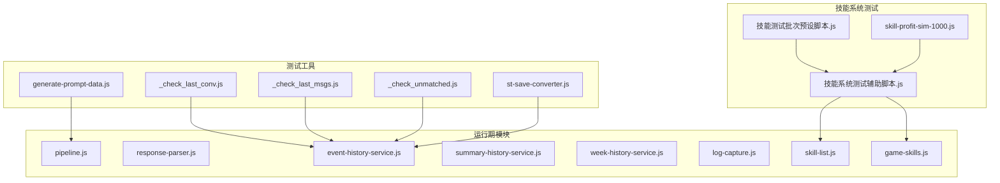
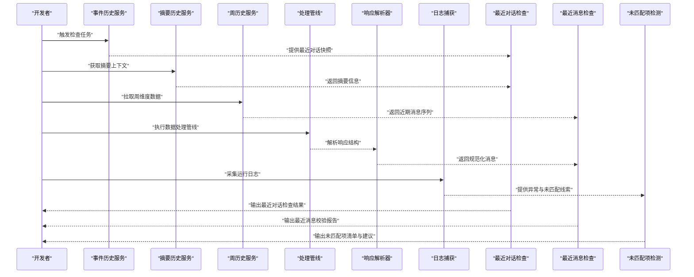
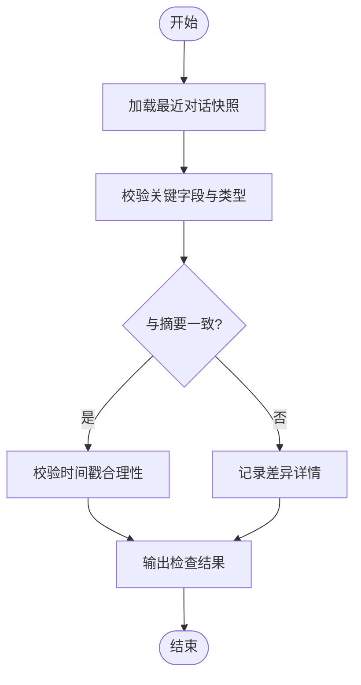
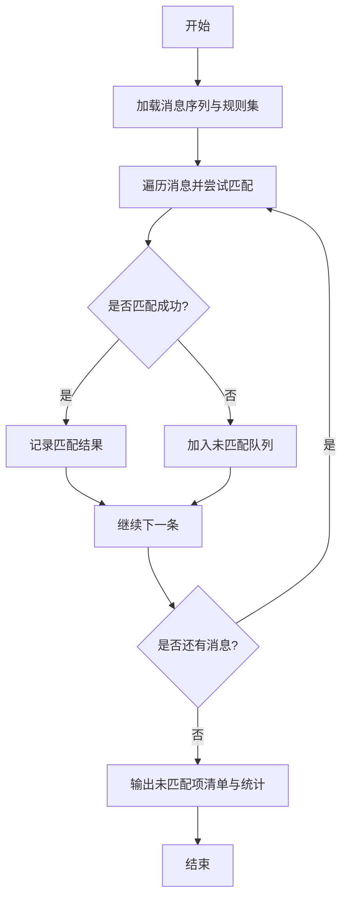
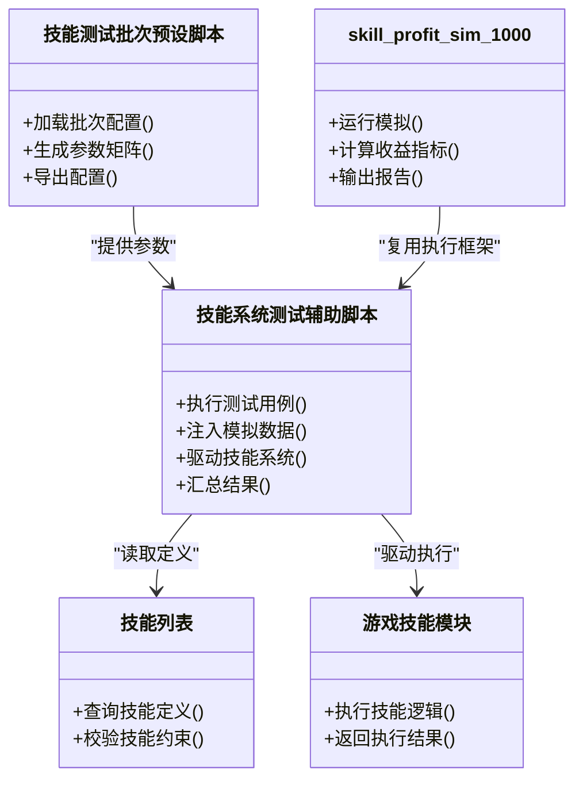
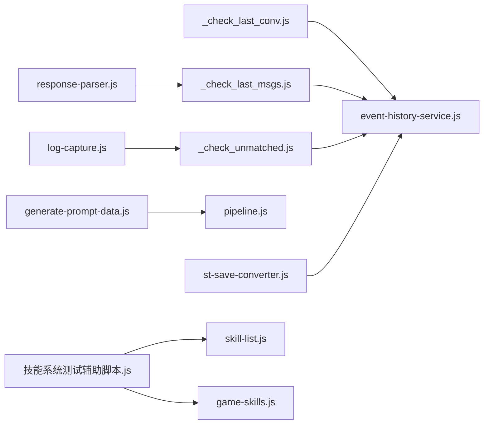

# 测试辅助工具

<cite>
**本文引用的文件**   
- [tools/_check_last_conv.js](file://tools/_check_last_conv.js)
- [tools/_check_last_msgs.js](file://tools/_check_last_msgs.js)
- [tools/_check_unmatched.js](file://tools/_check_unmatched.js)
- [tools/generate-prompt-data.js](file://tools/generate-prompt-data.js)
- [tools/st-save-converter.js](file://tools/st-save-converter.js)
- [module/pipeline.js](file://module/pipeline.js)
- [module/response-parser.js](file://module/response-parser.js)
- [module/skill-list.js](file://module/skill-list.js)
- [module/game-skills.js](file://module/game-skills.js)
- [module/event-history-service.js](file://module/event-history-service.js)
- [module/summary-history-service.js](file://module/summary-history-service.js)
- [module/week-history-service.js](file://module/week-history-service.js)
- [module/log-capture.js](file://module/log-capture.js)
- [开发文档/技能系统相关脚本/技能系统测试辅助脚本.js](file://开发文档/技能系统相关脚本/技能系统测试辅助脚本.js)
- [开发文档/技能系统相关脚本/技能测试批次预设脚本.js](file://开发文档/技能系统相关脚本/技能测试批次预设脚本.js)
- [开发文档/技能系统相关脚本/skill-profit-sim-1000.js](file://开发文档/技能系统相关脚本/skill-profit-sim-1000.js)
</cite>

## 目录
1. [简介](#简介)
2. [项目结构](#项目结构)
3. [核心组件](#核心组件)
4. [架构总览](#架构总览)
5. [详细组件分析](#详细组件分析)
6. [依赖关系分析](#依赖关系分析)
7. [性能考虑](#性能考虑)
8. [故障排查指南](#故障排查指南)
9. [结论](#结论)
10. [附录](#附录)

## 简介
本文件面向开发者与测试工程师，系统化梳理仓库中的“测试辅助工具”与自动化检查脚本，覆盖对话历史检查、消息一致性验证、未匹配项检测、提示词数据生成、存档转换以及技能系统测试脚本的参数配置与结果分析。文档同时提供单元测试与集成测试最佳实践、测试数据准备与模拟环境搭建指南，帮助构建完整的测试工作流与质量保证方案。

## 项目结构
测试相关能力主要分布在以下位置：
- tools 目录：通用检查与转换脚本（对话历史、消息一致性、未匹配项、提示词数据生成、存档转换）
- module 目录：运行时服务与解析器（事件历史、摘要历史、周历史、响应解析、日志捕获等），为测试提供数据源与断言依据
- 开发文档/技能系统相关脚本：技能系统测试辅助脚本、批次预设脚本、收益模拟脚本及输出报告

图表来源
- [tools/_check_last_conv.js](file://tools/_check_last_conv.js)
- [tools/_check_last_msgs.js](file://tools/_check_last_msgs.js)
- [tools/_check_unmatched.js](file://tools/_check_unmatched.js)
- [tools/generate-prompt-data.js](file://tools/generate-prompt-data.js)
- [tools/st-save-converter.js](file://tools/st-save-converter.js)
- [module/pipeline.js](file://module/pipeline.js)
- [module/response-parser.js](file://module/response-parser.js)
- [module/event-history-service.js](file://module/event-history-service.js)
- [module/summary-history-service.js](file://module/summary-history-service.js)
- [module/week-history-service.js](file://module/week-history-service.js)
- [module/log-capture.js](file://module/log-capture.js)
- [module/skill-list.js](file://module/skill-list.js)
- [module/game-skills.js](file://module/game-skills.js)
- [开发文档/技能系统相关脚本/技能系统测试辅助脚本.js](file://开发文档/技能系统相关脚本/技能系统测试辅助脚本.js)
- [开发文档/技能系统相关脚本/技能测试批次预设脚本.js](file://开发文档/技能系统相关脚本/技能测试批次预设脚本.js)
- [开发文档/技能系统相关脚本/skill-profit-sim-1000.js](file://开发文档/技能系统相关脚本/skill-profit-sim-1000.js)

章节来源
- [tools/_check_last_conv.js](file://tools/_check_last_conv.js)
- [tools/_check_last_msgs.js](file://tools/_check_last_msgs.js)
- [tools/_check_unmatched.js](file://tools/_check_unmatched.js)
- [tools/generate-prompt-data.js](file://tools/generate-prompt-data.js)
- [tools/st-save-converter.js](file://tools/st-save-converter.js)
- [module/pipeline.js](file://module/pipeline.js)
- [module/response-parser.js](file://module/response-parser.js)
- [module/event-history-service.js](file://module/event-history-service.js)
- [module/summary-history-service.js](file://module/summary-history-service.js)
- [module/week-history-service.js](file://module/week-history-service.js)
- [module/log-capture.js](file://module/log-capture.js)
- [module/skill-list.js](file://module/skill-list.js)
- [module/game-skills.js](file://module/game-skills.js)
- [开发文档/技能系统相关脚本/技能系统测试辅助脚本.js](file://开发文档/技能系统相关脚本/技能系统测试辅助脚本.js)
- [开发文档/技能系统相关脚本/技能测试批次预设脚本.js](file://开发文档/技能系统相关脚本/技能测试批次预设脚本.js)
- [开发文档/技能系统相关脚本/skill-profit-sim-1000.js](file://开发文档/技能系统相关脚本/skill-profit-sim-1000.js)

## 核心组件
本节聚焦各测试辅助脚本的职责、输入输出与典型使用方式。为避免泄露实现细节，本节仅描述功能边界与调用约定，具体参数与字段以对应源码为准。

- 最近一轮对话检查（_check_last_conv.js）
  - 目标：校验最近一轮对话的完整性与一致性，包括用户输入、模型回复、关键元数据是否齐全。
  - 输入：本地会话快照或导出文件（由历史服务维护）。
  - 输出：检查结果与异常明细（如缺失字段、类型不符、顺序错误）。
  - 适用场景：回归测试、发布前快速自检。

- 最近消息检查（_check_last_msgs.js）
  - 目标：对最近若干条消息进行格式与内容校验，确保消息体结构稳定、关键字段存在且可被下游消费。
  - 输入：消息列表或最近 N 条记录。
  - 输出：不一致项清单、统计摘要。
  - 适用场景：接口变更后的兼容性验证。

- 未匹配项检测（_check_unmatched.js）
  - 目标：识别未被任何规则/模板/分支匹配的消息或事件，定位潜在漏网之鱼。
  - 输入：待检测的数据集与匹配规则集合。
  - 输出：未匹配项列表、分类统计、建议修复方向。
  - 适用场景：规则覆盖率评估、冷启动数据治理。

- 提示词数据生成（generate-prompt-data.js）
  - 目标：从原始素材或配置中批量生成提示词数据，供训练或评测使用。
  - 输入：原始语料、模板、映射表。
  - 输出：标准化提示词数据集（结构化字段、版本标记）。
  - 适用场景：数据流水线、A/B 评测基线构建。

- 存档转换（st-save-converter.js）
  - 目标：将旧版存档格式转换为新版格式，保证迁移后数据可用。
  - 输入：旧版存档文件。
  - 输出：新版存档文件、转换日志、差异报告。
  - 适用场景：版本升级、数据迁移。

章节来源
- [tools/_check_last_conv.js](file://tools/_check_last_conv.js)
- [tools/_check_last_msgs.js](file://tools/_check_last_msgs.js)
- [tools/_check_unmatched.js](file://tools/_check_unmatched.js)
- [tools/generate-prompt-data.js](file://tools/generate-prompt-data.js)
- [tools/st-save-converter.js](file://tools/st-save-converter.js)

## 架构总览
测试工具通过读取运行期模块产出的数据与服务接口，完成端到端的质量保障闭环。下图展示从数据源到检查脚本再到结果输出的整体流程。

图表来源
- [module/event-history-service.js](file://module/event-history-service.js)
- [module/summary-history-service.js](file://module/summary-history-service.js)
- [module/week-history-service.js](file://module/week-history-service.js)
- [module/pipeline.js](file://module/pipeline.js)
- [module/response-parser.js](file://module/response-parser.js)
- [module/log-capture.js](file://module/log-capture.js)
- [tools/_check_last_conv.js](file://tools/_check_last_conv.js)
- [tools/_check_last_msgs.js](file://tools/_check_last_msgs.js)
- [tools/_check_unmatched.js](file://tools/_check_unmatched.js)

## 详细组件分析

### 对话历史检查工具（_check_last_conv.js）
- 功能要点
  - 校验最近一轮对话的关键字段是否存在、类型是否正确、时间戳是否合理。
  - 对比上游事件与下游摘要的一致性，避免数据漂移。
  - 输出失败用例与定位信息，便于快速回归。
- 使用方法
  - 在本地 Node 环境中直接执行脚本，传入必要的输入路径或标识符。
  - 结合 CI 定时任务，自动拉取最新快照并执行检查。
- 问题诊断技巧
  - 若出现字段缺失，优先检查事件历史服务的写入逻辑与序列化过程。
  - 若时间戳异常，关注时钟同步与跨时区处理。
  - 若与摘要不一致，核对摘要生成策略与截断规则。

图表来源
- [tools/_check_last_conv.js](file://tools/_check_last_conv.js)
- [module/event-history-service.js](file://module/event-history-service.js)
- [module/summary-history-service.js](file://module/summary-history-service.js)

章节来源
- [tools/_check_last_conv.js](file://tools/_check_last_conv.js)
- [module/event-history-service.js](file://module/event-history-service.js)
- [module/summary-history-service.js](file://module/summary-history-service.js)

### 消息一致性验证与未匹配项检测（_check_last_msgs.js 与 _check_unmatched.js）
- 功能要点
  - 最近消息检查：对消息序列进行结构校验、去重、排序与必要字段补齐。
  - 未匹配项检测：基于规则集扫描数据，识别未被任何分支或模板覆盖的记录。
- 使用方法
  - 指定待检数据集与规则配置文件；支持增量模式（仅检查新增部分）。
  - 输出包含未匹配项明细、分类统计与修复建议。
- 问题诊断技巧
  - 若大量未匹配项集中出现在某类消息，优先完善规则覆盖或引入兜底策略。
  - 若消息结构频繁变化，建议在解析层增加兼容桥接与版本路由。

图表来源
- [tools/_check_last_msgs.js](file://tools/_check_last_msgs.js)
- [tools/_check_unmatched.js](file://tools/_check_unmatched.js)
- [module/response-parser.js](file://module/response-parser.js)

章节来源
- [tools/_check_last_msgs.js](file://tools/_check_last_msgs.js)
- [tools/_check_unmatched.js](file://tools/_check_unmatched.js)
- [module/response-parser.js](file://module/response-parser.js)

### 提示词数据生成（generate-prompt-data.js）
- 功能要点
  - 从原始素材与模板中批量合成提示词数据，统一字段命名与版本标记。
  - 支持过滤、采样与打乱，便于构建训练/评测集。
- 使用方法
  - 指定输入目录、模板目录与输出路径；可选参数控制采样比例与随机种子。
  - 生成完成后，可使用一致性检查脚本验证输出质量。
- 注意事项
  - 模板变更需同步更新校验规则，避免脏数据进入下游。
  - 大数据量生成建议分片并行，减少内存峰值。

章节来源
- [tools/generate-prompt-data.js](file://tools/generate-prompt-data.js)
- [module/pipeline.js](file://module/pipeline.js)

### 存档转换（st-save-converter.js）
- 功能要点
  - 将旧版存档迁移至新版格式，保留必要字段并进行类型归一化。
  - 输出转换日志与差异报告，便于审计与回滚。
- 使用方法
  - 指定旧存档路径与新存档输出路径；支持批量转换与断点续转。
  - 转换后可用历史检查脚本验证新存档可用性。
- 风险与回滚
  - 转换前备份原文件；转换失败保留中间状态以便重试。
  - 差异报告用于确认关键属性是否丢失或变更。

章节来源
- [tools/st-save-converter.js](file://tools/st-save-converter.js)
- [module/event-history-service.js](file://module/event-history-service.js)

### 技能系统测试脚本（参数配置与结果分析）
- 测试辅助脚本（技能系统测试辅助脚本.js）
  - 负责编排测试用例、注入模拟数据、驱动技能系统与解析器交互，汇总测试结果。
  - 支持按标签筛选用例、并发执行与失败重试。
- 批次预设脚本（技能测试批次预设脚本.js）
  - 定义多组测试批次与参数组合，便于在不同环境下复现实验。
  - 支持导入/导出批次配置，方便团队协作与版本管理。
- 收益模拟脚本（skill-profit-sim-1000.js）
  - 基于大规模样本进行收益估算与稳定性分析，输出 CSV/JSON 报告。
  - 报告包含胜率、期望收益、方差与极端情况分布。

图表来源
- [开发文档/技能系统相关脚本/技能系统测试辅助脚本.js](file://开发文档/技能系统相关脚本/技能系统测试辅助脚本.js)
- [开发文档/技能系统相关脚本/技能测试批次预设脚本.js](file://开发文档/技能系统相关脚本/技能测试批次预设脚本.js)
- [开发文档/技能系统相关脚本/skill-profit-sim-1000.js](file://开发文档/技能系统相关脚本/skill-profit-sim-1000.js)
- [module/skill-list.js](file://module/skill-list.js)
- [module/game-skills.js](file://module/game-skills.js)

章节来源
- [开发文档/技能系统相关脚本/技能系统测试辅助脚本.js](file://开发文档/技能系统相关脚本/技能系统测试辅助脚本.js)
- [开发文档/技能系统相关脚本/技能测试批次预设脚本.js](file://开发文档/技能系统相关脚本/技能测试批次预设脚本.js)
- [开发文档/技能系统相关脚本/skill-profit-sim-1000.js](file://开发文档/技能系统相关脚本/skill-profit-sim-1000.js)
- [module/skill-list.js](file://module/skill-list.js)
- [module/game-skills.js](file://module/game-skills.js)

## 依赖关系分析
测试工具与运行期模块之间的耦合关系如下：
- 数据依赖：历史服务（事件、摘要、周）为检查脚本提供输入；解析器为消息校验提供规范化结构。
- 控制依赖：测试辅助脚本编排执行流程，调用技能系统与解析器完成业务断言。
- 外部依赖：文件系统（存档、报告）、日志系统（调试与回溯）。

图表来源
- [tools/_check_last_conv.js](file://tools/_check_last_conv.js)
- [tools/_check_last_msgs.js](file://tools/_check_last_msgs.js)
- [tools/_check_unmatched.js](file://tools/_check_unmatched.js)
- [tools/generate-prompt-data.js](file://tools/generate-prompt-data.js)
- [tools/st-save-converter.js](file://tools/st-save-converter.js)
- [module/pipeline.js](file://module/pipeline.js)
- [module/response-parser.js](file://module/response-parser.js)
- [module/skill-list.js](file://module/skill-list.js)
- [module/game-skills.js](file://module/game-skills.js)
- [module/event-history-service.js](file://module/event-history-service.js)
- [module/log-capture.js](file://module/log-capture.js)
- [开发文档/技能系统相关脚本/技能系统测试辅助脚本.js](file://开发文档/技能系统相关脚本/技能系统测试辅助脚本.js)

章节来源
- [tools/_check_last_conv.js](file://tools/_check_last_conv.js)
- [tools/_check_last_msgs.js](file://tools/_check_last_msgs.js)
- [tools/_check_unmatched.js](file://tools/_check_unmatched.js)
- [tools/generate-prompt-data.js](file://tools/generate-prompt-data.js)
- [tools/st-save-converter.js](file://tools/st-save-converter.js)
- [module/pipeline.js](file://module/pipeline.js)
- [module/response-parser.js](file://module/response-parser.js)
- [module/skill-list.js](file://module/skill-list.js)
- [module/game-skills.js](file://module/game-skills.js)
- [module/event-history-service.js](file://module/event-history-service.js)
- [module/log-capture.js](file://module/log-capture.js)
- [开发文档/技能系统相关脚本/技能系统测试辅助脚本.js](file://开发文档/技能系统相关脚本/技能系统测试辅助脚本.js)

## 性能考虑
- 批处理与分片：对大规模数据（提示词生成、收益模拟）采用分片并行，降低内存占用与单次执行时长。
- 增量检查：消息与未匹配项检测支持增量模式，仅处理新增数据，提升回归效率。
- 缓存与复用：历史快照与解析结果可缓存，避免重复 IO 与解析开销。
- 资源隔离：长时间运行的模拟任务应限制并发度，避免阻塞主线程或其他测试任务。

[本节为通用指导，不直接分析具体文件]

## 故障排查指南
- 常见错误与定位
  - 字段缺失或类型不符：检查历史服务写入与序列化逻辑，确认字段契约是否变更。
  - 时间戳异常：核查系统时钟、时区设置与跨进程传递。
  - 未匹配项激增：审查规则集覆盖范围与优先级，必要时引入兜底分支。
  - 存档转换失败：查看转换日志与差异报告，确认版本兼容性与字段映射。
- 调试手段
  - 启用日志捕获，收集关键步骤的输入输出快照。
  - 使用最小可复现数据集缩小问题范围。
  - 对解析器与规则集添加白盒断言，快速定位分歧点。

章节来源
- [module/log-capture.js](file://module/log-capture.js)
- [module/response-parser.js](file://module/response-parser.js)
- [tools/_check_unmatched.js](file://tools/_check_unmatched.js)
- [tools/st-save-converter.js](file://tools/st-save-converter.js)

## 结论
通过将检查脚本、数据服务与解析器整合为统一的测试工作流，团队可在日常开发与发布前快速发现数据不一致、规则遗漏与格式退化等问题。配合技能系统测试脚本与收益模拟，能够形成从单元到集成、从功能到性能的完整质量保障体系。

[本节为总结性内容，不直接分析具体文件]

## 附录

### 单元测试与集成测试最佳实践
- 单元测试
  - 针对解析器、规则匹配与数据转换函数编写小粒度用例，覆盖正常路径与异常分支。
  - 使用固定随机种子与确定性输入，确保可重复性。
- 集成测试
  - 以真实历史快照与存档为输入，端到端验证检查脚本的输出正确性。
  - 在 CI 中定期执行，防止回归。
- 测试数据准备
  - 构造边界用例（空值、超长文本、特殊字符、缺失字段）。
  - 使用提示词数据生成脚本批量合成多样化样本。
- 模拟环境搭建
  - 隔离文件系统与网络请求，使用本地快照与静态规则集。
  - 对耗时操作（模拟、渲染）使用轻量替代或跳过。

[本节为通用指导，不直接分析具体文件]