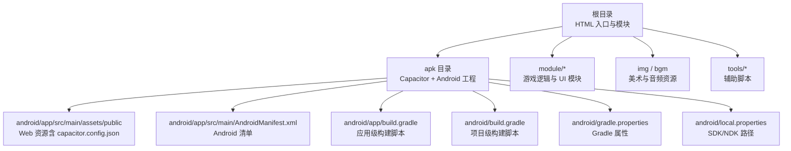
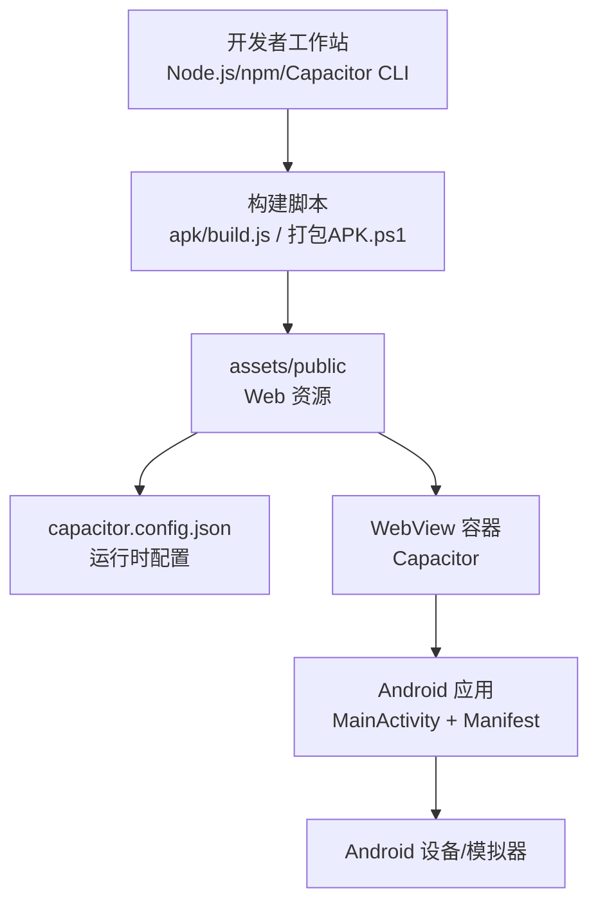
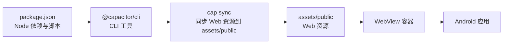

# 快速开始

<cite>
**本文引用的文件**   
- [ReadMe.md](file://ReadMe.md)
- [apk/package.json](file://apk/package.json)
- [apk/build.js](file://apk/build.js)
- [apk/capacitor.config.json](file://apk/capacitor.config.json)
- [apk/android/app/src/main/assets/public/capacitor.config.json](file://apk/android/app/src/main/assets/public/capacitor.config.json)
- [apk/android/app/src/main/AndroidManifest.xml](file://apk/android/app/src/main/AndroidManifest.xml)
- [apk/android/app/build.gradle](file://apk/android/app/build.gradle)
- [apk/android/build.gradle](file://apk/android/build.gradle)
- [apk/android/gradle.properties](file://apk/android/gradle.properties)
- [apk/android/local.properties](file://apk/android/local.properties)
- [打包APK.ps1](file://打包APK.ps1)
- [index - SR.html](file://index - SR.html)
- [start-screen.html](file://start-screen.html)
- [game-config.js](file://module/game-config.js)
</cite>

## 目录
1. [简介](#简介)
2. [项目结构](#项目结构)
3. [核心组件](#核心组件)
4. [架构总览](#架构总览)
5. [详细组件分析](#详细组件分析)
6. [依赖分析](#依赖分析)
7. [性能考虑](#性能考虑)
8. [故障排除指南](#故障排除指南)
9. [结论](#结论)
10. [附录](#附录)

## 简介
本指南面向首次接触“姬侠传”项目的开发者，提供从零到一的环境搭建、本地运行、调试与 Android 打包部署的完整流程。项目采用 Web 前端 + Capacitor 封装为 Android 应用的方式，便于在浏览器中快速验证并在移动端发布。

## 项目结构
- 根目录包含多个 HTML 入口（如 index - SR.html、start-screen.html），以及游戏逻辑模块（module）、资源（img、bgm）和工具脚本（tools）。
- apk 子目录为 Android 工程与构建脚本，使用 Capacitor 将 Web 内容打包进原生容器。
- 关键配置文件：
  - apk/package.json：定义 Node 依赖与构建脚本。
  - apk/capacitor.config.json：Capacitor 配置（Web 资源路径、应用标识等）。
  - apk/android/app/src/main/assets/public/capacitor.config.json：运行时注入到 Web 容器的 Capacitor 配置。
  - apk/android/app/src/main/AndroidManifest.xml：Android 清单（包名、权限、启动页等）。
  - apk/android/app/build.gradle 与 apk/android/build.gradle：Gradle 构建配置。
  - apk/android/gradle.properties：Gradle 全局属性（JDK、内存等）。
  - apk/android/local.properties：Android SDK/NDK 路径。
  - 打包APK.ps1：一键打包 PowerShell 脚本。

图表来源
- [apk/package.json:1-200](file://apk/package.json#L1-L200)
- [apk/capacitor.config.json:1-200](file://apk/capacitor.config.json#L1-L200)
- [apk/android/app/src/main/assets/public/capacitor.config.json:1-200](file://apk/android/app/src/main/assets/public/capacitor.config.json#L1-L200)
- [apk/android/app/src/main/AndroidManifest.xml:1-200](file://apk/android/app/src/main/AndroidManifest.xml#L1-L200)
- [apk/android/app/build.gradle:1-200](file://apk/android/app/build.gradle#L1-L200)
- [apk/android/build.gradle:1-200](file://apk/android/build.gradle#L1-L200)
- [apk/android/gradle.properties:1-200](file://apk/android/gradle.properties#L1-L200)
- [apk/android/local.properties:1-200](file://apk/android/local.properties#L1-L200)

章节来源
- [ReadMe.md:1-200](file://ReadMe.md#L1-L200)
- [apk/package.json:1-200](file://apk/package.json#L1-L200)
- [apk/capacitor.config.json:1-200](file://apk/capacitor.config.json#L1-L200)
- [apk/android/app/src/main/assets/public/capacitor.config.json:1-200](file://apk/android/app/src/main/assets/public/capacitor.config.json#L1-L200)
- [apk/android/app/src/main/AndroidManifest.xml:1-200](file://apk/android/app/src/main/AndroidManifest.xml#L1-L200)
- [apk/android/app/build.gradle:1-200](file://apk/android/app/build.gradle#L1-L200)
- [apk/android/build.gradle:1-200](file://apk/android/build.gradle#L1-L200)
- [apk/android/gradle.properties:1-200](file://apk/android/gradle.properties#L1-L200)
- [apk/android/local.properties:1-200](file://apk/android/local.properties#L1-L200)

## 核心组件
- 前端入口与页面
  - index - SR.html：主游戏入口之一。
  - start-screen.html：启动界面。
- 游戏逻辑与系统
  - module/game-config.js：游戏基础配置（如版本、默认选项等）。
  - module 下其他 JS 文件：事件、提示词、技能、存储、世界书等子系统。
- 构建与打包
  - apk/build.js：Node 侧构建脚本（用于准备资源或调用 Capacitor）。
  - 打包APK.ps1：PowerShell 一键打包脚本。
- Capacitor 与 Android
  - apk/capacitor.config.json：Capacitor 配置。
  - android/app/src/main/assets/public/capacitor.config.json：运行时注入到 Web 的 Capacitor 配置。
  - AndroidManifest.xml、build.gradle、gradle.properties、local.properties：Android 工程与 Gradle 构建相关。

章节来源
- [index - SR.html:1-200](file://index - SR.html#L1-L200)
- [start-screen.html:1-200](file://start-screen.html#L1-L200)
- [game-config.js:1-200](file://module/game-config.js#L1-L200)
- [apk/build.js:1-200](file://apk/build.js#L1-L200)
- [打包APK.ps1:1-200](file://打包APK.ps1#L1-L200)
- [apk/capacitor.config.json:1-200](file://apk/capacitor.config.json#L1-L200)
- [apk/android/app/src/main/assets/public/capacitor.config.json:1-200](file://apk/android/app/src/main/assets/public/capacitor.config.json#L1-L200)
- [apk/android/app/src/main/AndroidManifest.xml:1-200](file://apk/android/app/src/main/AndroidManifest.xml#L1-L200)
- [apk/android/app/build.gradle:1-200](file://apk/android/app/build.gradle#L1-L200)
- [apk/android/build.gradle:1-200](file://apk/android/build.gradle#L1-L200)
- [apk/android/gradle.properties:1-200](file://apk/android/gradle.properties#L1-L200)
- [apk/android/local.properties:1-200](file://apk/android/local.properties#L1-L200)

## 架构总览
整体采用“Web 前端 + Capacitor 容器 + Android 原生壳”的架构。开发阶段可直接在浏览器打开 HTML 入口进行调试；发布阶段通过 Capacitor 将 Web 资源复制到 assets/public，并生成 Android 工程进行打包。

图表来源
- [apk/build.js:1-200](file://apk/build.js#L1-L200)
- [打包APK.ps1:1-200](file://打包APK.ps1#L1-L200)
- [apk/capacitor.config.json:1-200](file://apk/capacitor.config.json#L1-L200)
- [apk/android/app/src/main/assets/public/capacitor.config.json:1-200](file://apk/android/app/src/main/assets/public/capacitor.config.json#L1-L200)
- [apk/android/app/src/main/AndroidManifest.xml:1-200](file://apk/android/app/src/main/AndroidManifest.xml#L1-L200)

## 详细组件分析

### 环境准备与安装
- 必需工具
  - Node.js（建议长期支持版本）
  - npm（随 Node.js 安装）
  - Capacitor CLI（用于同步与构建 Android 工程）
  - Android Studio（含命令行工具、Gradle、Java JDK）
- 安装步骤（示例命令）
  - 安装 Node.js 与 npm：从官网下载安装器或使用包管理器。
  - 安装 Capacitor CLI：npm install -g @capacitor/cli
  - 验证安装：node -v、npm -v、npx cap --version
- 常见坑
  - 若 npm 下载缓慢，可切换国内镜像源。
  - 确保 PATH 中包含 Node.js 与 npm。

章节来源
- [ReadMe.md:1-200](file://ReadMe.md#L1-L200)
- [apk/package.json:1-200](file://apk/package.json#L1-L200)

### 克隆与初始化
- 克隆仓库
  - git clone <仓库地址>
  - cd 项目根目录
- 进入 apk 目录并安装依赖
  - cd apk
  - npm install
- 初始化 Capacitor（若尚未初始化）
  - npx cap init <应用名称> <包名>
- 添加 Android 平台（若尚未添加）
  - npx cap add android

章节来源
- [apk/package.json:1-200](file://apk/package.json#L1-L200)
- [apk/capacitor.config.json:1-200](file://apk/capacitor.config.json#L1-L200)

### 本地开发与预览
- 直接浏览器运行
  - 在项目根目录双击打开 index - SR.html 或 start-screen.html 即可预览。
- 使用 Capacitor 同步并运行
  - 在 apk 目录下执行：
    - npx cap sync
    - npx cap open android
  - 在 Android Studio 中点击运行，选择设备或模拟器。

章节来源
- [index - SR.html:1-200](file://index - SR.html#L1-L200)
- [start-screen.html:1-200](file://start-screen.html#L1-L200)
- [apk/capacitor.config.json:1-200](file://apk/capacitor.config.json#L1-L200)

### 首次运行游戏
- 浏览器端
  - 打开 index - SR.html，确认页面加载正常，检查控制台无报错。
- 移动端
  - 完成 npx cap sync 后，在 Android Studio 中运行至真机或模拟器。
  - 若出现白屏，检查 assets/public 是否包含最新构建产物与 capacitor.config.json。

章节来源
- [apk/android/app/src/main/assets/public/capacitor.config.json:1-200](file://apk/android/app/src/main/assets/public/capacitor.config.json#L1-L200)
- [apk/android/app/src/main/AndroidManifest.xml:1-200](file://apk/android/app/src/main/AndroidManifest.xml#L1-L200)

### Android 打包与部署
- 构建 APK/AAB
  - 方式一：使用脚本
    - 在项目根目录执行：.\打包APK.ps1
  - 方式二：手动 Gradle 构建
    - cd apk/android
    - ./gradlew assembleRelease 或 ./gradlew bundleRelease
- 签名与发布
  - 在 app/build.gradle 中配置签名信息（keystore、alias、密码等）。
  - 生成签名后的 APK/AAB 后上传到应用商店或分发。
- 常见问题
  - 找不到 SDK/NDK：检查 local.properties 中的 sdk.dir 与 ndk.dir。
  - Gradle 构建失败：检查 gradle.properties 中的 JDK 路径与内存参数。

章节来源
- [打包APK.ps1:1-200](file://打包APK.ps1#L1-L200)
- [apk/android/app/build.gradle:1-200](file://apk/android/app/build.gradle#L1-L200)
- [apk/android/build.gradle:1-200](file://apk/android/build.gradle#L1-L200)
- [apk/android/gradle.properties:1-200](file://apk/android/gradle.properties#L1-L200)
- [apk/android/local.properties:1-200](file://apk/android/local.properties#L1-L200)

### 关键配置文件说明
- apk/capacitor.config.json
  - 作用：定义应用标识、Web 资源路径、插件配置等。
  - 注意：修改后需重新执行 npx cap sync。
- apk/android/app/src/main/assets/public/capacitor.config.json
  - 作用：运行时注入到 WebView 的配置，供前端读取。
  - 注意：确保与顶层配置一致，避免运行时行为不一致。
- apk/android/app/src/main/AndroidManifest.xml
  - 作用：声明包名、权限、启动 Activity 等。
  - 注意：修改包名或权限后需重新构建。
- apk/android/app/build.gradle 与 apk/android/build.gradle
  - 作用：应用级与项目级构建脚本，管理依赖、编译选项、签名等。
- apk/android/gradle.properties
  - 作用：Gradle 全局属性（JDK 路径、内存、并行构建等）。
- apk/android/local.properties
  - 作用：指向本机 Android SDK/NDK 路径。

章节来源
- [apk/capacitor.config.json:1-200](file://apk/capacitor.config.json#L1-L200)
- [apk/android/app/src/main/assets/public/capacitor.config.json:1-200](file://apk/android/app/src/main/assets/public/capacitor.config.json#L1-L200)
- [apk/android/app/src/main/AndroidManifest.xml:1-200](file://apk/android/app/src/main/AndroidManifest.xml#L1-L200)
- [apk/android/app/build.gradle:1-200](file://apk/android/app/build.gradle#L1-L200)
- [apk/android/build.gradle:1-200](file://apk/android/build.gradle#L1-L200)
- [apk/android/gradle.properties:1-200](file://apk/android/gradle.properties#L1-L200)
- [apk/android/local.properties:1-200](file://apk/android/local.properties#L1-L200)

## 依赖分析
- Node 层
  - package.json 定义了构建与开发所需依赖（如 Capacitor CLI、可能的构建工具）。
- Android 层
  - build.gradle 与 gradle.properties 管理 Android 构建链与依赖。
- 运行时
  - assets/public 下的 Web 资源由 Capacitor 注入到 WebView。

图表来源
- [apk/package.json:1-200](file://apk/package.json#L1-L200)
- [apk/capacitor.config.json:1-200](file://apk/capacitor.config.json#L1-L200)
- [apk/android/app/src/main/assets/public/capacitor.config.json:1-200](file://apk/android/app/src/main/assets/public/capacitor.config.json#L1-L200)

章节来源
- [apk/package.json:1-200](file://apk/package.json#L1-L200)
- [apk/android/app/build.gradle:1-200](file://apk/android/app/build.gradle#L1-L200)
- [apk/android/build.gradle:1-200](file://apk/android/build.gradle#L1-L200)

## 性能考虑
- 资源体积
  - img、bgm 等资源较大，建议在发布前进行压缩与按需加载。
- 构建缓存
  - 合理使用 Gradle 缓存与增量构建，提升打包速度。
- 运行时优化
  - 减少首屏资源大小，启用静态资源缓存策略。
  - 对长列表或复杂场景进行懒加载与分页渲染。

[本节为通用指导，不直接分析具体文件]

## 故障排除指南
- 无法找到 Android SDK/NDK
  - 检查 local.properties 中的 sdk.dir 与 ndk.dir 是否正确。
  - 在 Android Studio 中设置 SDK 路径后重新同步。
- Gradle 构建失败
  - 检查 gradle.properties 中的 JDK 路径与内存参数。
  - 清理构建缓存：./gradlew clean 后重试。
- 运行时白屏或资源缺失
  - 确认 assets/public 存在且包含最新构建产物。
  - 检查 capacitor.config.json 的路径配置是否与资源目录一致。
- 权限问题导致功能异常
  - 检查 AndroidManifest.xml 中声明的权限是否符合需求。

章节来源
- [apk/android/local.properties:1-200](file://apk/android/local.properties#L1-L200)
- [apk/android/gradle.properties:1-200](file://apk/android/gradle.properties#L1-L200)
- [apk/android/app/src/main/assets/public/capacitor.config.json:1-200](file://apk/android/app/src/main/assets/public/capacitor.config.json#L1-L200)
- [apk/android/app/src/main/AndroidManifest.xml:1-200](file://apk/android/app/src/main/AndroidManifest.xml#L1-L200)

## 结论
通过本指南，你可以快速完成姬侠传项目的开发环境搭建、本地运行与 Android 打包。建议先以浏览器模式进行功能验证，再切换到 Capacitor + Android Studio 进行移动端调试与发布。遇到构建或运行时问题时，优先检查配置文件与资源路径的一致性。

[本节为总结性内容，不直接分析具体文件]

## 附录
- 常用命令速查
  - 安装依赖：cd apk && npm install
  - 同步资源：npx cap sync
  - 打开 Android Studio：npx cap open android
  - 构建 APK：cd apk/android && ./gradlew assembleRelease
  - 一键打包：.\打包APK.ps1
- 参考文档
  - ReadMe.md：项目概述与使用说明
  - 开发文档/apk打包方案.md：打包流程与注意事项

章节来源
- [ReadMe.md:1-200](file://ReadMe.md#L1-L200)
- [打包APK.ps1:1-200](file://打包APK.ps1#L1-L200)