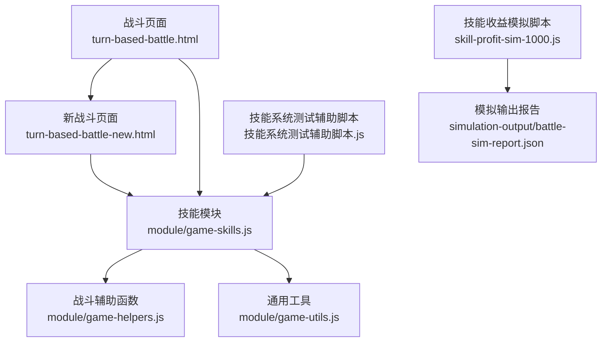
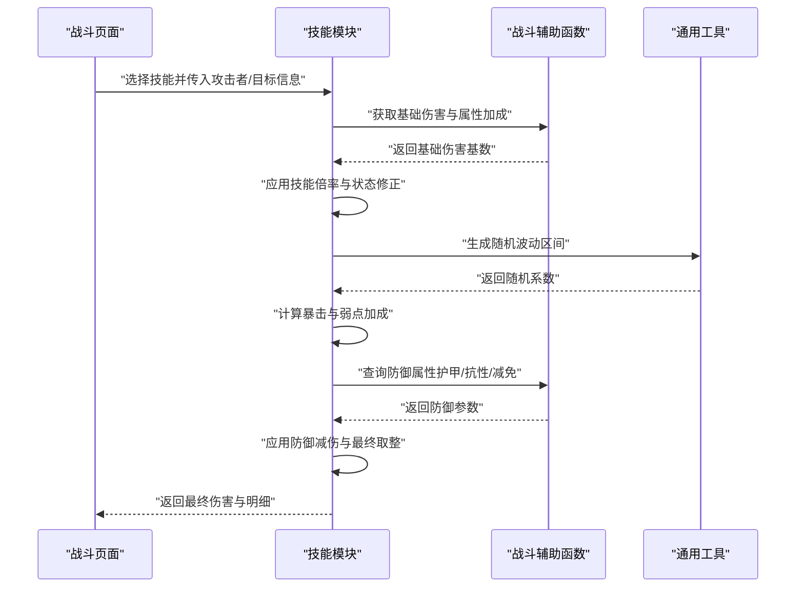
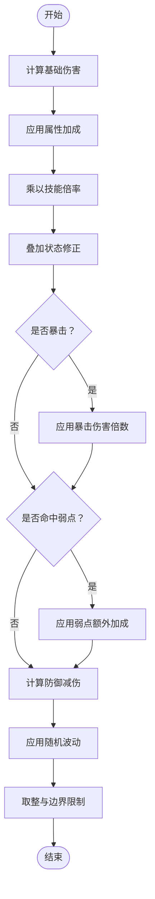
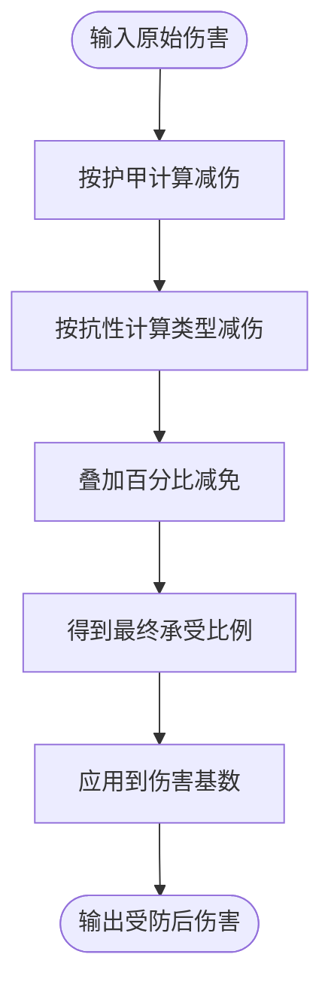
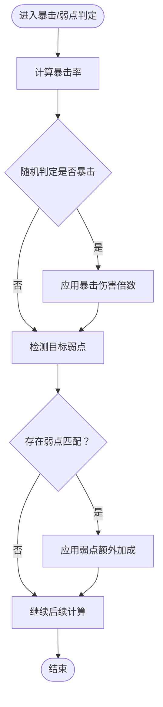
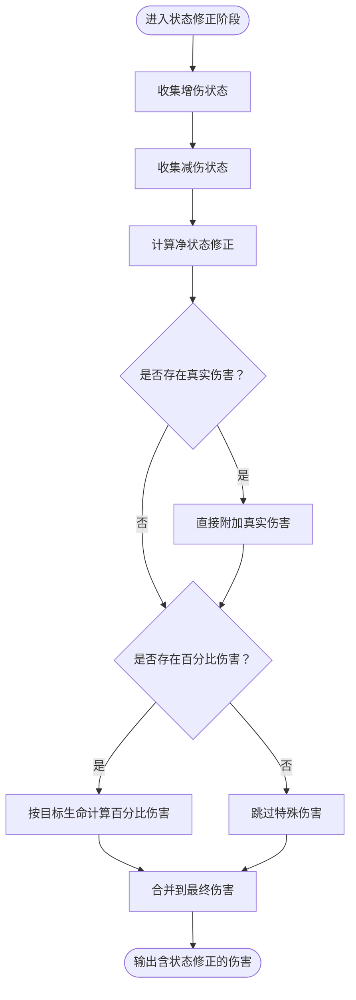
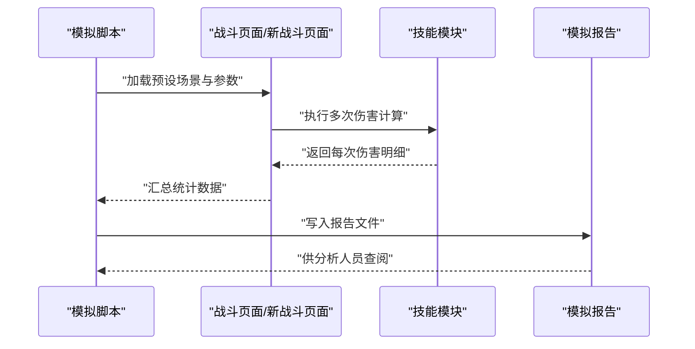
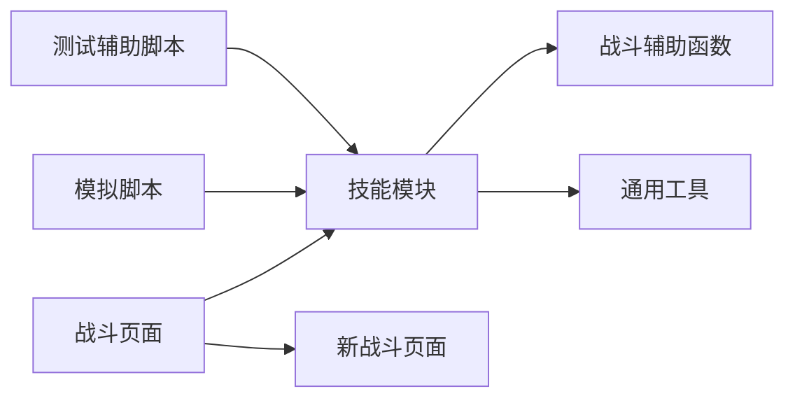

# 伤害计算系统

<cite>
**本文引用的文件**   
- [turn-based-battle.html](file://turn-based-battle.html)
- [turn-based-battle-new.html](file://turn-based-battle-new.html)
- [game-skills.js](file://module/game-skills.js)
- [game-helpers.js](file://module/game-helpers.js)
- [game-utils.js](file://module/game-utils.js)
- [skill-profit-sim-1000.js](file://开发文档/技能系统相关文档和脚本/skill-profit-sim-1000.js)
- [技能系统测试辅助脚本.js](file://开发文档/技能系统相关文档和脚本/技能系统测试辅助脚本.js)
- [battle-sim-report.json](file://开发文档/技能系统相关文档和脚本/simulation-output/battle-sim-report.json)
</cite>

## 目录
1. [简介](#简介)
2. [项目结构](#项目结构)
3. [核心组件](#核心组件)
4. [架构总览](#架构总览)
5. [详细组件分析](#详细组件分析)
6. [依赖关系分析](#依赖关系分析)
7. [性能考虑](#性能考虑)
8. [故障排查指南](#故障排查指南)
9. [结论](#结论)
10. [附录](#附录)

## 简介
本技术文档聚焦于“姬侠传”回合制战斗中的伤害计算系统，覆盖以下关键主题：
- 伤害计算公式与因子：基础伤害、属性加成、技能倍率、随机波动等
- 防御减伤机制：护甲值、抗性属性、伤害减免百分比的作用方式
- 暴击系统与弱点打击：暴击率、暴击伤害倍数、弱点识别与额外伤害加成
- 状态效果对伤害的影响：增伤、减伤、真实伤害、百分比伤害等类型处理逻辑
- 数值平衡原则与调整方法
- 调试工具与测试用例

## 项目结构
围绕伤害计算的核心代码主要分布在以下位置：
- 前端战斗页面：负责触发战斗流程与渲染结果
- 技能与战斗辅助模块：封装技能数据、战斗辅助函数与通用工具
- 模拟与测试脚本：用于批量模拟、统计分析与回归验证

图表来源
- [turn-based-battle.html](file://turn-based-battle.html)
- [turn-based-battle-new.html](file://turn-based-battle-new.html)
- [game-skills.js](file://module/game-skills.js)
- [game-helpers.js](file://module/game-helpers.js)
- [game-utils.js](file://module/game-utils.js)
- [skill-profit-sim-1000.js](file://开发文档/技能系统相关文档和脚本/skill-profit-sim-1000.js)
- [battle-sim-report.json](file://开发文档/技能系统相关文档和脚本/simulation-output/battle-sim-report.json)

章节来源
- [turn-based-battle.html](file://turn-based-battle.html)
- [turn-based-battle-new.html](file://turn-based-battle-new.html)
- [game-skills.js](file://module/game-skills.js)
- [game-helpers.js](file://module/game-helpers.js)
- [game-utils.js](file://module/game-utils.js)
- [skill-profit-sim-1000.js](file://开发文档/技能系统相关文档和脚本/skill-profit-sim-1000.js)
- [battle-sim-report.json](file://开发文档/技能系统相关文档和脚本/simulation-output/battle-sim-report.json)

## 核心组件
- 战斗页面层：发起攻击动作、读取角色与技能配置、调用计算逻辑并展示结果
- 技能与战斗辅助层：提供技能倍率、属性加成、随机波动、防御减伤、暴击与弱点判定、状态效果修正等计算能力
- 工具与模拟层：提供随机数生成、数值校验、批量模拟与统计输出

章节来源
- [turn-based-battle.html](file://turn-based-battle.html)
- [turn-based-battle-new.html](file://turn-based-battle-new.html)
- [game-skills.js](file://module/game-skills.js)
- [game-helpers.js](file://module/game-helpers.js)
- [game-utils.js](file://module/game-utils.js)

## 架构总览
伤害计算的整体流程从战斗页面发起，经由技能与辅助模块完成多阶段计算，最终返回可显示的伤害结果。

图表来源
- [turn-based-battle.html](file://turn-based-battle.html)
- [turn-based-battle-new.html](file://turn-based-battle-new.html)
- [game-skills.js](file://module/game-skills.js)
- [game-helpers.js](file://module/game-helpers.js)
- [game-utils.js](file://module/game-utils.js)

## 详细组件分析

### 伤害计算公式与因子
- 基础伤害：由攻击方主属性（如力量/灵力等）与武器/装备基础伤害构成
- 属性加成：根据攻击方与目标属性差值或比例进行乘算或加算修正
- 技能倍率：不同技能拥有独立倍率，可能随等级、连携或环境条件变化
- 随机波动：在固定范围内引入随机系数，提升战斗不确定性
- 状态修正：增伤/减伤状态按阶段叠加，影响最终乘区
- 最终伤害：经防御减伤后取整，确保数值稳定与可读性

图表来源
- [game-skills.js](file://module/game-skills.js)
- [game-helpers.js](file://module/game-helpers.js)
- [game-utils.js](file://module/game-utils.js)

章节来源
- [game-skills.js](file://module/game-skills.js)
- [game-helpers.js](file://module/game-helpers.js)
- [game-utils.js](file://module/game-utils.js)

### 防御减伤机制
- 护甲值：降低物理类伤害的绝对或比例部分
- 抗性属性：针对特定元素或伤害类型提供额外减免
- 伤害减免百分比：全局或类型专属的最终减伤乘区
- 综合公式：先按护甲与抗性计算中间减伤，再叠加百分比减免，最后得到实际承受比例

图表来源
- [game-helpers.js](file://module/game-helpers.js)
- [game-skills.js](file://module/game-skills.js)

章节来源
- [game-helpers.js](file://module/game-helpers.js)
- [game-skills.js](file://module/game-skills.js)

### 暴击系统与弱点打击
- 暴击率：基于攻守双方属性、技能特性与状态修正计算
- 暴击伤害倍数：暴击时伤害乘以独立乘区
- 弱点识别：根据目标弱点标签或类型匹配，命中时追加额外加成
- 优先级：通常暴击优先于弱点，二者可叠加；具体顺序以实现为准

图表来源
- [game-skills.js](file://module/game-skills.js)
- [game-helpers.js](file://module/game-helpers.js)

章节来源
- [game-skills.js](file://module/game-skills.js)
- [game-helpers.js](file://module/game-helpers.js)

### 状态效果对伤害的影响
- 增伤状态：在相应阶段提高伤害乘区
- 减伤状态：在相应阶段降低伤害乘区
- 真实伤害：绕过防御与抗性，直接作用于生命值
- 百分比伤害：基于目标当前生命或最大生命的固定比例伤害
- 叠加规则：同类型状态按加法叠加，不同类型按乘法组合，避免无限放大

图表来源
- [game-skills.js](file://module/game-skills.js)
- [game-helpers.js](file://module/game-helpers.js)

章节来源
- [game-skills.js](file://module/game-skills.js)
- [game-helpers.js](file://module/game-helpers.js)

### 数值平衡设计原则与调整方法
- 乘区分层：将基础、属性、倍率、状态、暴击、弱点、防御等拆分为独立乘区，便于单独调参
- 边际递减：对高阈值属性采用非线性加成，防止后期数值膨胀
- 随机波动范围：控制在合理区间，保证体验稳定同时保留惊喜感
- 保底与封顶：为极端情况设置下限与上限，避免破坏性结果
- 迭代验证：通过模拟脚本进行大规模抽样，观察期望值与方差，逐步微调参数

章节来源
- [skill-profit-sim-1000.js](file://开发文档/技能系统相关文档和脚本/skill-profit-sim-1000.js)
- [battle-sim-report.json](file://开发文档/技能系统相关文档和脚本/simulation-output/battle-sim-report.json)

### 调试工具与测试用例
- 批量模拟：使用技能收益模拟脚本进行千次级抽样，输出期望伤害、分布与异常点
- 测试辅助：利用测试辅助脚本构造典型场景（高防低抗、弱点集中、强增伤状态等），快速验证边界
- 报告分析：查看模拟输出报告，定位数值失衡或概率异常的技能组合

图表来源
- [turn-based-battle.html](file://turn-based-battle.html)
- [turn-based-battle-new.html](file://turn-based-battle-new.html)
- [game-skills.js](file://module/game-skills.js)
- [skill-profit-sim-1000.js](file://开发文档/技能系统相关文档和脚本/skill-profit-sim-1000.js)
- [battle-sim-report.json](file://开发文档/技能系统相关文档和脚本/simulation-output/battle-sim-report.json)

章节来源
- [skill-profit-sim-1000.js](file://开发文档/技能系统相关文档和脚本/skill-profit-sim-1000.js)
- [技能系统测试辅助脚本.js](file://开发文档/技能系统相关文档和脚本/技能系统测试辅助脚本.js)
- [battle-sim-report.json](file://开发文档/技能系统相关文档和脚本/simulation-output/battle-sim-report.json)

## 依赖关系分析
- 战斗页面依赖技能模块与辅助函数，形成“界面—逻辑—工具”的分层
- 技能模块内部耦合度较高，建议将各计算因子解耦为独立函数，便于替换与扩展
- 模拟脚本与战斗页面解耦，通过统一接口驱动计算，利于回归测试

图表来源
- [turn-based-battle.html](file://turn-based-battle.html)
- [turn-based-battle-new.html](file://turn-based-battle-new.html)
- [game-skills.js](file://module/game-skills.js)
- [game-helpers.js](file://module/game-helpers.js)
- [game-utils.js](file://module/game-utils.js)
- [skill-profit-sim-1000.js](file://开发文档/技能系统相关文档和脚本/skill-profit-sim-1000.js)
- [技能系统测试辅助脚本.js](file://开发文档/技能系统相关文档和脚本/技能系统测试辅助脚本.js)

章节来源
- [turn-based-battle.html](file://turn-based-battle.html)
- [turn-based-battle-new.html](file://turn-based-battle-new.html)
- [game-skills.js](file://module/game-skills.js)
- [game-helpers.js](file://module/game-helpers.js)
- [game-utils.js](file://module/game-utils.js)
- [skill-profit-sim-1000.js](file://开发文档/技能系统相关文档和脚本/skill-profit-sim-1000.js)
- [技能系统测试辅助脚本.js](file://开发文档/技能系统相关文档和脚本/技能系统测试辅助脚本.js)

## 性能考虑
- 计算复杂度：单次伤害计算为常数时间，适合高频调用
- 随机数生成：建议使用轻量伪随机源，避免阻塞主线程
- 批量模拟：分批次输出中间结果，减少内存占用与I/O压力
- 缓存策略：对重复场景的参数组合可缓存中间结果，加速回归测试

[本节为通用指导，不直接分析具体文件]

## 故障排查指南
- 常见异常
  - 伤害为负或零：检查防御减伤是否超过100%、随机波动下界是否过低
  - 暴击率异常：确认暴击率上限与状态修正叠加是否正确
  - 弱点未生效：核对弱点标签与伤害类型的匹配逻辑
- 定位步骤
  - 启用日志记录：在关键计算节点输出中间变量
  - 最小复现：使用测试辅助脚本构造单一变量场景
  - 对比报告：与历史模拟报告比对期望值与方差

章节来源
- [技能系统测试辅助脚本.js](file://开发文档/技能系统相关文档和脚本/技能系统测试辅助脚本.js)
- [battle-sim-report.json](file://开发文档/技能系统相关文档和脚本/simulation-output/battle-sim-report.json)

## 结论
本伤害计算系统通过分层乘区与模块化实现，兼顾了可调性与可维护性。借助模拟与测试工具，可在保持玩法多样性的同时，持续优化数值体验。建议在后续迭代中进一步细化状态叠加规则与防御模型，完善可视化调试面板，以提升平衡效率与问题定位速度。

[本节为总结性内容，不直接分析具体文件]

## 附录
- 术语表
  - 基础伤害：由角色与装备提供的初始伤害基数
  - 属性加成：基于攻守属性的比例或差值修正
  - 技能倍率：技能特有的伤害乘区
  - 随机波动：在设定范围内的随机系数
  - 防御减伤：护甲、抗性、减免百分比共同作用后的最终减伤
  - 暴击：概率触发的额外伤害倍数
  - 弱点：目标对特定伤害类型的脆弱面，命中时获得额外加成
  - 真实伤害：无视防御的直接伤害
  - 百分比伤害：基于目标生命值的固定比例伤害

[本节为概念说明，不直接分析具体文件]