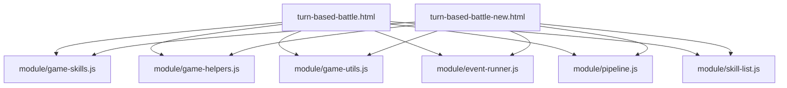
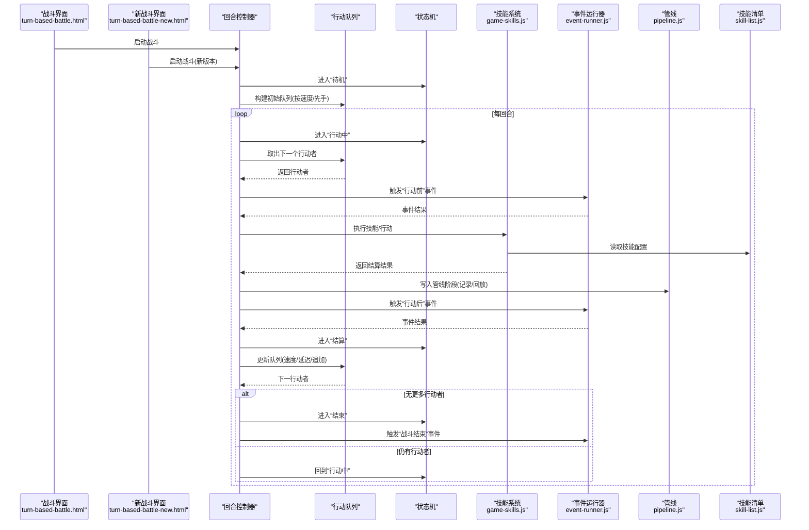
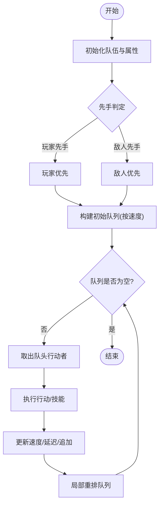
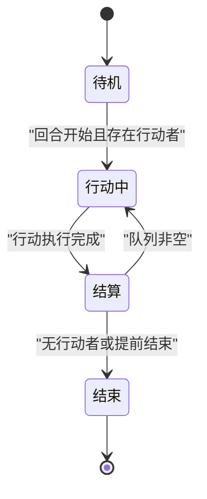
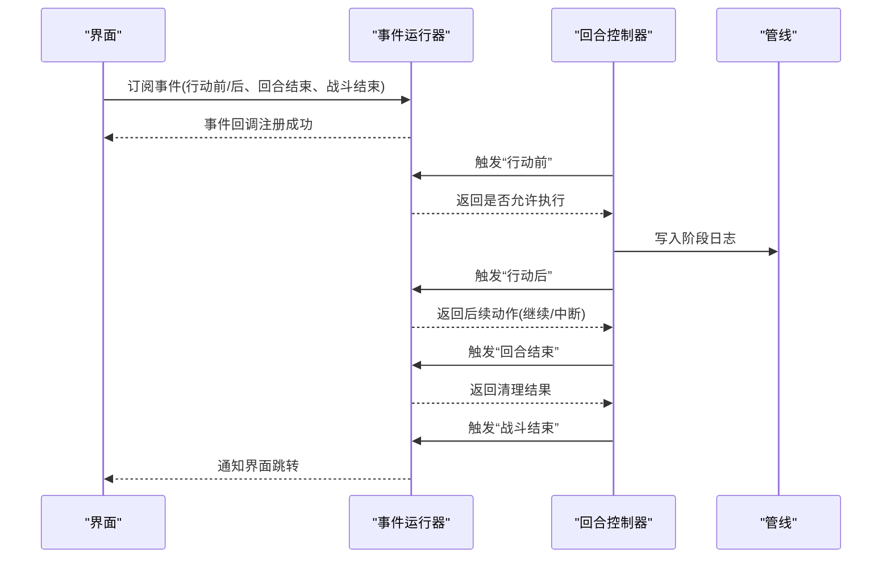
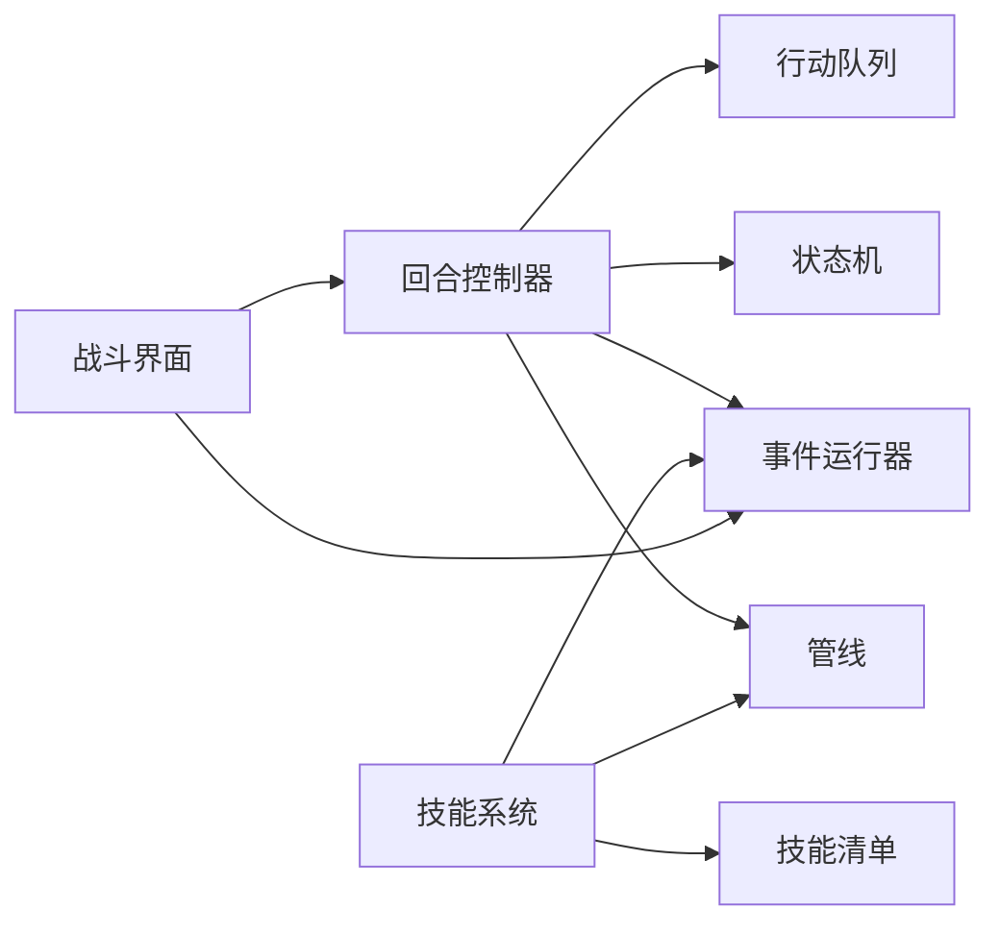

# 回合制逻辑

<cite>
**本文引用的文件**   
- [turn-based-battle.html](file://turn-based-battle.html)
- [turn-based-battle-new.html](file://turn-based-battle-new.html)
- [game-skills.js](file://module/game-skills.js)
- [game-helpers.js](file://module/game-helpers.js)
- [game-utils.js](file://module/game-utils.js)
- [event-runner.js](file://module/event-runner.js)
- [pipeline.js](file://module/pipeline.js)
- [skill-list.js](file://module/skill-list.js)
</cite>

## 目录
1. [简介](#简介)
2. [项目结构](#项目结构)
3. [核心组件](#核心组件)
4. [架构总览](#架构总览)
5. [详细组件分析](#详细组件分析)
6. [依赖分析](#依赖分析)
7. [性能考虑](#性能考虑)
8. [故障排查指南](#故障排查指南)
9. [结论](#结论)
10. [附录](#附录)

## 简介
本技术文档聚焦“姬侠传”的回合制战斗逻辑，围绕以下目标展开：
- 回合管理机制：回合开始/结束条件、行动顺序计算等核心算法
- 行动轮转：先手判定、速度属性影响、行动队列管理
- 状态机：待机、行动中、结算、结束等状态的转换规则
- 流程控制：事件触发时机、异步处理、错误恢复机制
- 扩展开发：自定义行动类型与特殊规则的实现方法
- 性能优化与调试技巧

## 项目结构
回合制战斗相关代码主要分布在两个入口页面与若干模块脚本中：
- 入口页面
  - turn-based-battle.html：传统回合战斗界面与主循环
  - turn-based-battle-new.html：新版回合战斗界面（可能包含新流程或UI差异）
- 核心模块
  - module/game-skills.js：技能定义、效果执行、伤害/治疗/状态等通用结算
  - module/game-helpers.js：辅助函数（如随机数、概率、格式化等）
  - module/game-utils.js：工具函数（如数据校验、序列化、日志等）
  - module/event-runner.js：事件驱动与回调编排
  - module/pipeline.js：可插拔的处理管线（用于串联准备、选择、执行、结算阶段）
  - module/skill-list.js：技能清单与配置

图表来源
- [turn-based-battle.html](file://turn-based-battle.html)
- [turn-based-battle-new.html](file://turn-based-battle-new.html)
- [game-skills.js](file://module/game-skills.js)
- [game-helpers.js](file://module/game-helpers.js)
- [game-utils.js](file://module/game-utils.js)
- [event-runner.js](file://module/event-runner.js)
- [pipeline.js](file://module/pipeline.js)
- [skill-list.js](file://module/skill-list.js)

章节来源
- [turn-based-battle.html](file://turn-based-battle.html)
- [turn-based-battle-new.html](file://turn-based-battle-new.html)
- [game-skills.js](file://module/game-skills.js)
- [game-helpers.js](file://module/game-helpers.js)
- [game-utils.js](file://module/game-utils.js)
- [event-runner.js](file://module/event-runner.js)
- [pipeline.js](file://module/pipeline.js)
- [skill-list.js](file://module/skill-list.js)

## 核心组件
- 回合控制器（Turn Controller）
  - 负责回合生命周期：初始化、行动顺序计算、逐个执行行动、回合结束判断与清理
  - 维护当前行动者、行动队列、回合计数、状态标志
- 行动队列（Action Queue）
  - 基于速度属性的排序队列；支持优先级、延迟、打断、追加等策略
  - 提供入队、出队、重排、清空等操作
- 状态机（Battle State Machine）
  - 状态包括：待机、行动中、结算、结束
  - 明确各状态间的转换条件与守卫条件
- 技能系统（Skill System）
  - 技能注册、参数解析、效果执行、副作用处理（状态、Buff/Debuff、资源消耗）
- 事件与管线（Event & Pipeline）
  - 通过事件钩子与管线阶段组织流程，便于扩展与调试

章节来源
- [turn-based-battle.html](file://turn-based-battle.html)
- [turn-based-battle-new.html](file://turn-based-battle-new.html)
- [game-skills.js](file://module/game-skills.js)
- [game-helpers.js](file://module/game-helpers.js)
- [game-utils.js](file://module/game-utils.js)
- [event-runner.js](file://module/event-runner.js)
- [pipeline.js](file://module/pipeline.js)
- [skill-list.js](file://module/skill-list.js)

## 架构总览
下图展示了从界面到核心逻辑的数据与控制流。

图表来源
- [turn-based-battle.html](file://turn-based-battle.html)
- [turn-based-battle-new.html](file://turn-based-battle-new.html)
- [game-skills.js](file://module/game-skills.js)
- [event-runner.js](file://module/event-runner.js)
- [pipeline.js](file://module/pipeline.js)
- [skill-list.js](file://module/skill-list.js)

## 详细组件分析

### 回合管理与行动顺序算法
- 回合开始
  - 重置回合内临时状态（如行动标记、冷却、连击计数）
  - 根据全局速度与先手规则生成初始行动队列
- 行动顺序计算
  - 基础排序键：速度属性越高越靠前
  - 修正项：先手加成、增益/减益、延迟/加速、优先级标签
  - 稳定排序：相同速度时保持插入顺序或按ID稳定排序
- 回合结束条件
  - 所有存活单位均已完成一次行动
  - 或满足提前结束条件（如强制退场、剧情中断）
- 关键实现要点
  - 使用稳定的比较器以避免抖动
  - 对动态变更（追加行动、打断）进行局部重排而非全量重建
  - 将“行动点(AP)”或“冷却(CD)”纳入排序键或过滤条件

章节来源
- [turn-based-battle.html](file://turn-based-battle.html)
- [turn-based-battle-new.html](file://turn-based-battle-new.html)
- [game-helpers.js](file://module/game-helpers.js)
- [game-utils.js](file://module/game-utils.js)

### 玩家与敌人行动轮转
- 先手判定
  - 依据阵营先手权重与速度阈值决定首动方
  - 若平局，采用固定偏置或随机化打破
- 速度属性影响
  - 速度作为主排序键，辅以“速度倍率”、“延迟系数”
  - 支持“额外行动”与“跳过行动”的动态调整
- 行动队列管理
  - 入队：行动开始时加入队列尾部
  - 出队：取队头并执行
  - 重排：当速度变化或获得/失去行动机会时触发
  - 清理：死亡/退场单位移除

图表来源
- [turn-based-battle.html](file://turn-based-battle.html)
- [turn-based-battle-new.html](file://turn-based-battle-new.html)
- [game-helpers.js](file://module/game-helpers.js)
- [game-utils.js](file://module/game-utils.js)

章节来源
- [turn-based-battle.html](file://turn-based-battle.html)
- [turn-based-battle-new.html](file://turn-based-battle-new.html)
- [game-helpers.js](file://module/game-helpers.js)
- [game-utils.js](file://module/game-utils.js)

### 战斗状态机
- 状态定义
  - 待机：等待回合开始或输入
  - 行动中：正在执行某个单位的行动
  - 结算：处理伤害、状态、掉落、动画等
  - 结束：战斗终止，输出结果
- 转换规则
  - 待机 → 行动中：回合开始且存在可行动单位
  - 行动中 → 结算：当前行动执行完毕
  - 结算 → 行动中：队列非空，继续下一行动
  - 结算 → 结束：无剩余行动者或满足结束条件
- 守卫与副作用
  - 每个转换需检查前置条件（存活、可用行动、冷却就绪）
  - 副作用包括日志记录、UI刷新、事件广播

图表来源
- [turn-based-battle.html](file://turn-based-battle.html)
- [turn-based-battle-new.html](file://turn-based-battle-new.html)
- [event-runner.js](file://module/event-runner.js)

章节来源
- [turn-based-battle.html](file://turn-based-battle.html)
- [turn-based-battle-new.html](file://turn-based-battle-new.html)
- [event-runner.js](file://module/event-runner.js)

### 战斗流程控制与事件机制
- 事件触发时机
  - 行动前：允许修改行动参数、取消或替换行动
  - 行动中：播放动画、显示提示、锁定交互
  - 行动后：统计伤害、应用状态、触发连锁
  - 回合结束：清理回合级Buff/Debuff、更新全局计时器
  - 战斗结束：结算奖励、保存进度、跳转场景
- 异步处理
  - 使用事件与回调链避免阻塞主线程
  - 长耗时操作（如AI决策、网络请求）放入任务队列
- 错误恢复
  - 捕获异常并降级为默认行为
  - 保留最近N步快照以便回滚
  - 失败重试与幂等设计

图表来源
- [event-runner.js](file://module/event-runner.js)
- [pipeline.js](file://module/pipeline.js)
- [turn-based-battle.html](file://turn-based-battle.html)
- [turn-based-battle-new.html](file://turn-based-battle-new.html)

章节来源
- [event-runner.js](file://module/event-runner.js)
- [pipeline.js](file://module/pipeline.js)
- [turn-based-battle.html](file://turn-based-battle.html)
- [turn-based-battle-new.html](file://turn-based-battle-new.html)

### 技能系统与结算
- 技能注册与查找
  - 通过技能清单集中管理，支持版本兼容与热更新
  - 运行时按ID快速定位技能定义
- 执行流程
  - 参数校验 → 预检（冷却、资源、目标合法性）→ 效果执行 → 副作用处理
- 常见效果
  - 伤害计算（基础值、倍率、抗性、暴击、闪避）
  - 治疗与护盾
  - 状态与Buff/Debuff（持续回合、层数、触发条件）
  - 资源消耗与返还（AP、能量、怒气等）
- 扩展方式
  - 新增技能类型：在清单中注册，并在执行分支中实现对应逻辑
  - 组合效果：通过模块化效果函数拼装复杂行为

章节来源
- [game-skills.js](file://module/game-skills.js)
- [skill-list.js](file://module/skill-list.js)
- [game-helpers.js](file://module/game-helpers.js)
- [game-utils.js](file://module/game-utils.js)

## 依赖分析
- 低耦合高内聚
  - 回合控制器依赖队列与状态机，但不直接访问UI细节
  - 技能系统独立于流程控制，通过事件与管线暴露扩展点
- 外部依赖
  - 事件运行器提供解耦的事件总线
  - 管线用于统一记录与回放
- 潜在风险
  - 避免在技能执行中直接调用UI渲染，应通过事件/管线上报
  - 注意循环依赖：技能系统不应反向强依赖回合控制器

图表来源
- [turn-based-battle.html](file://turn-based-battle.html)
- [turn-based-battle-new.html](file://turn-based-battle-new.html)
- [event-runner.js](file://module/event-runner.js)
- [pipeline.js](file://module/pipeline.js)
- [game-skills.js](file://module/game-skills.js)
- [skill-list.js](file://module/skill-list.js)

章节来源
- [turn-based-battle.html](file://turn-based-battle.html)
- [turn-based-battle-new.html](file://turn-based-battle-new.html)
- [event-runner.js](file://module/event-runner.js)
- [pipeline.js](file://module/pipeline.js)
- [game-skills.js](file://module/game-skills.js)
- [skill-list.js](file://module/skill-list.js)

## 性能考虑
- 队列重排优化
  - 局部重排优于全量重建；仅在速度变化或追加行动时触发
  - 使用堆或分段桶减少排序开销
- 批量更新
  - 合并多次状态变更，统一刷新UI与日志
- 对象复用
  - 重用临时对象（如结果结构体），减少GC压力
- 异步与分帧
  - 将长耗时计算拆分至微任务或Web Worker
  - 动画与渲染走UI线程，逻辑运算走后台
- 缓存与索引
  - 对常用查询（如目标筛选、技能匹配）建立索引
- 日志与回放
  - 仅记录必要字段，压缩存储；回放按需加载

[本节为通用指导，不直接分析具体文件]

## 故障排查指南
- 常见问题定位
  - 行动顺序异常：检查速度属性、先手权重、延迟/加速修正
  - 技能未生效：确认技能清单注册、参数校验、目标合法性
  - 状态卡死：核对状态机转换守卫条件与事件回调返回值
- 调试建议
  - 启用详细日志：记录每次入队/出队、状态转换、事件触发
  - 快照与回滚：在关键节点保存快照，失败时回滚并重放
  - 断点与可视化：在事件运行器与管线处设置断点，观察调用栈
- 恢复策略
  - 失败重试：对幂等操作进行有限次重试
  - 降级模式：缺失配置时使用默认行为，保证流程继续

章节来源
- [event-runner.js](file://module/event-runner.js)
- [pipeline.js](file://module/pipeline.js)
- [game-utils.js](file://module/game-utils.js)
- [game-helpers.js](file://module/game-helpers.js)

## 结论
本方案以“回合控制器 + 行动队列 + 状态机 + 事件/管线 + 技能系统”为核心，实现了可扩展、可观测、易维护的回合制战斗逻辑。通过稳定的排序算法、清晰的转换规则与完善的错误恢复机制，能够在保证体验的同时支撑丰富的玩法扩展。

[本节为总结性内容，不直接分析具体文件]

## 附录
- 扩展开发指南
  - 自定义行动类型
    - 在技能清单中注册新类型
    - 在技能系统中添加执行分支与副作用处理
    - 通过事件钩子接入UI与管线
  - 特殊规则
    - 在队列重排逻辑中加入规则判定
    - 在状态机转换守卫中添加前置条件
  - 测试与验证
    - 编写用例覆盖边界情况（同速、零速度、负延迟等）
    - 使用回放功能复现问题

[本节为概念性内容，不直接分析具体文件]