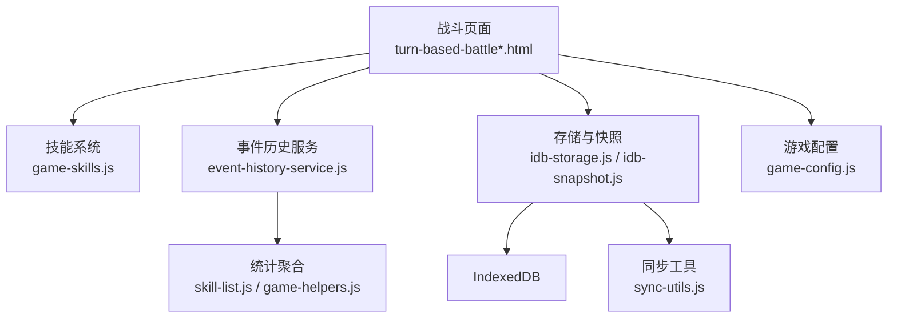
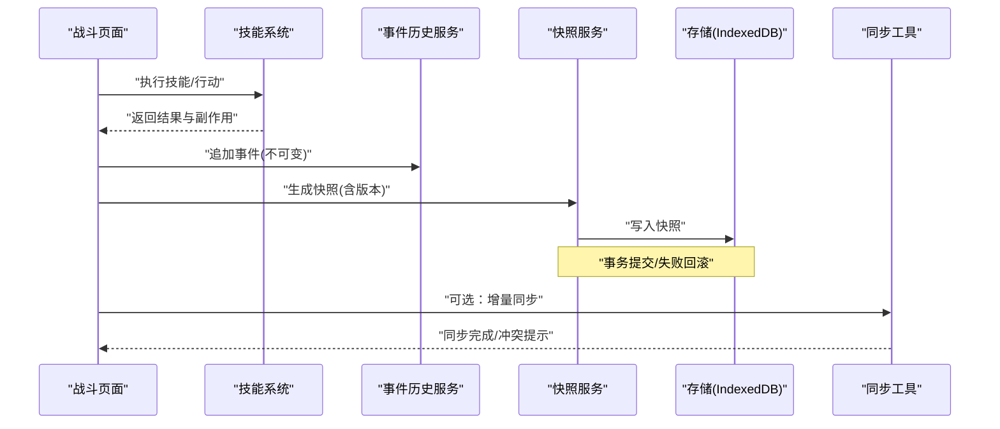
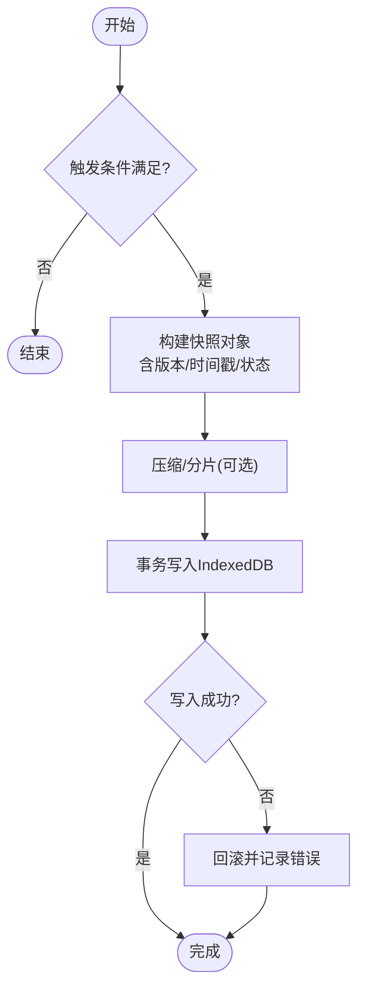
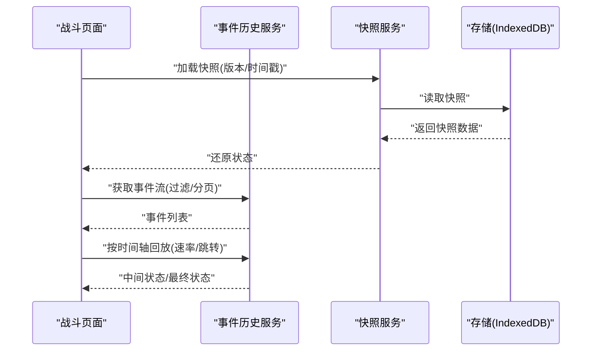
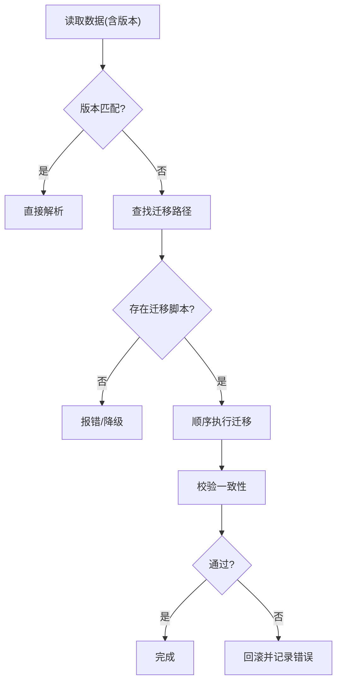
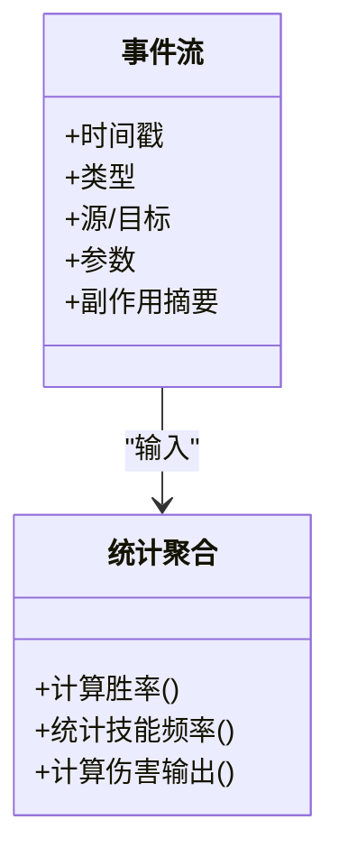
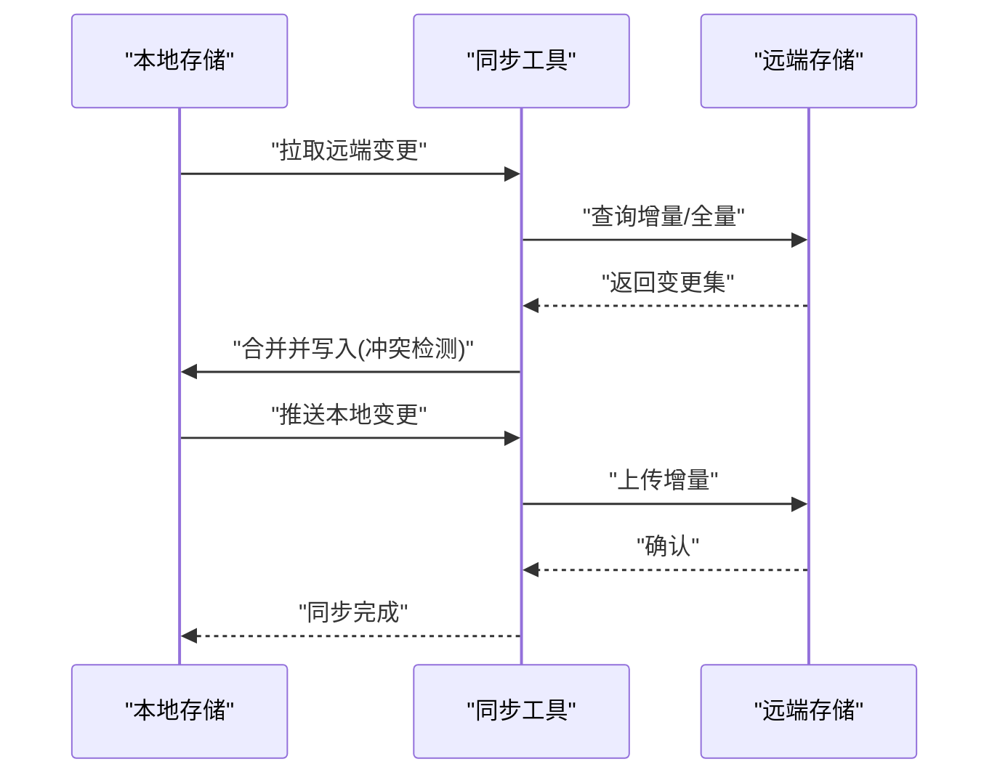
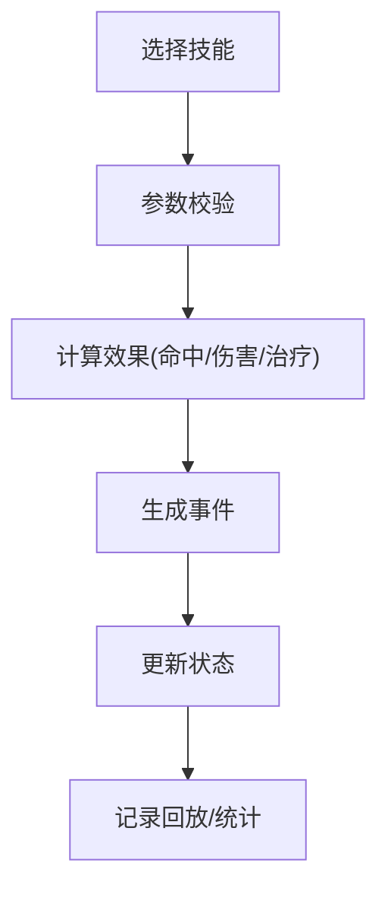
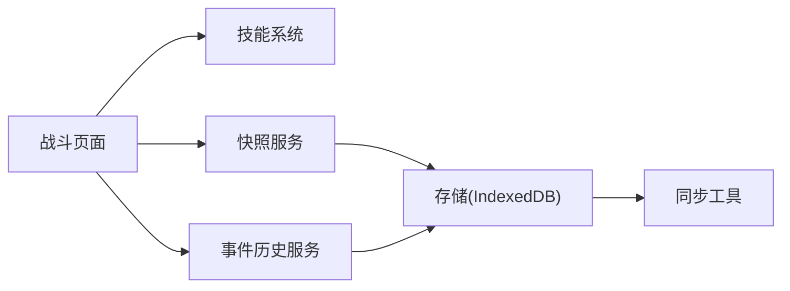

# 战斗数据管理

<cite>
**本文引用的文件**   
- [turn-based-battle.html](file://turn-based-battle.html)
- [turn-based-battle-new.html](file://turn-based-battle-new.html)
- [game-skills.js](file://module/game-skills.js)
- [event-history-service.js](file://module/event-history-service.js)
- [idb-snapshot.js](file://module/idb-snapshot.js)
- [idb-storage.js](file://module/idb-storage.js)
- [storage-service.js](file://module/storage-service.js)
- [sync-utils.js](file://module/sync-utils.js)
- [skill-list.js](file://module/skill-list.js)
- [game-helpers.js](file://module/game-helpers.js)
- [game-config.js](file://module/game-config.js)
</cite>

## 目录
1. [简介](#简介)
2. [项目结构](#项目结构)
3. [核心组件](#核心组件)
4. [架构总览](#架构总览)
5. [详细组件分析](#详细组件分析)
6. [依赖关系分析](#依赖关系分析)
7. [性能考虑](#性能考虑)
8. [故障排查指南](#故障排查指南)
9. [结论](#结论)
10. [附录](#附录)

## 简介
本技术文档聚焦“姬侠传”回合制战斗的数据管理，围绕以下目标展开：
- 战斗数据的持久化存储：战斗快照的生成、保存与加载生命周期。
- 战斗回放机制：记录序列化/反序列化、时间轴控制等回放能力。
- 版本兼容性：数据结构升级、向后兼容与迁移工具方案。
- 战斗统计：胜率、技能使用频率、伤害输出等统计与分析。
- 备份与同步：本地与云端（或跨设备）的备份与同步实现指南。
- 大数据量优化：针对海量战斗记录的存储与回放性能优化策略。

## 项目结构
本项目为前端为主的 Web 应用，战斗相关逻辑集中在若干模块中：
- 战斗页面入口：回合制战斗页面负责发起战斗、驱动回合推进、渲染界面。
- 技能系统：定义技能、效果、命中/闪避/暴击等计算规则。
- 事件历史服务：收集并维护战斗事件流，支撑回放与统计。
- 快照与存储：基于 IndexedDB 的快照与通用存储封装，提供持久化能力。
- 同步工具：提供增量/全量同步辅助能力。
- 配置与工具：全局配置、通用工具函数。

图示来源
- [turn-based-battle.html:1-200](file://turn-based-battle.html#L1-L200)
- [turn-based-battle-new.html:1-200](file://turn-based-battle-new.html#L1-L200)
- [game-skills.js:1-200](file://module/game-skills.js#L1-L200)
- [event-history-service.js:1-200](file://module/event-history-service.js#L1-L200)
- [idb-snapshot.js:1-200](file://module/idb-snapshot.js#L1-L200)
- [idb-storage.js:1-200](file://module/idb-storage.js#L1-L200)
- [storage-service.js:1-200](file://module/storage-service.js#L1-L200)
- [sync-utils.js:1-200](file://module/sync-utils.js#L1-L200)
- [skill-list.js:1-200](file://module/skill-list.js#L1-L200)
- [game-helpers.js:1-200](file://module/game-helpers.js#L1-L200)
- [game-config.js:1-200](file://module/game-config.js#L1-L200)

章节来源
- [turn-based-battle.html:1-200](file://turn-based-battle.html#L1-L200)
- [turn-based-battle-new.html:1-200](file://turn-based-battle-new.html#L1-L200)
- [game-skills.js:1-200](file://module/game-skills.js#L1-L200)
- [event-history-service.js:1-200](file://module/event-history-service.js#L1-L200)
- [idb-snapshot.js:1-200](file://module/idb-snapshot.js#L1-L200)
- [idb-storage.js:1-200](file://module/idb-storage.js#L1-L200)
- [storage-service.js:1-200](file://module/storage-service.js#L1-L200)
- [sync-utils.js:1-200](file://module/sync-utils.js#L1-L200)
- [skill-list.js:1-200](file://module/skill-list.js#L1-L200)
- [game-helpers.js:1-200](file://module/game-helpers.js#L1-L200)
- [game-config.js:1-200](file://module/game-config.js#L1-L200)

## 核心组件
- 战斗页面（UI 层）
  - 职责：初始化战斗、驱动回合推进、触发技能释放、渲染结果、调用回放与快照接口。
  - 关键流程：创建战斗上下文 → 选择行动 → 执行技能 → 更新状态 → 记录事件 → 生成快照。
- 技能系统（业务逻辑层）
  - 职责：定义技能元数据、判定逻辑、伤害/治疗/增益/减益计算、命中与抗性处理。
  - 关键点：技能参数校验、随机性控制、副作用顺序、可重入性。
- 事件历史服务（回放与统计）
  - 职责：以不可变事件流形式记录战斗过程；支持按时间轴回放、过滤、导出。
  - 关键点：事件模型设计、去重与合并、索引与分页、回放速度控制。
- 快照与存储（持久化层）
  - 职责：将战斗状态序列化为快照对象，落盘到 IndexedDB；提供读取、覆盖、对比与回滚。
  - 关键点：快照版本字段、压缩与分片、事务与一致性、并发安全。
- 同步工具（扩展能力）
  - 职责：在本地与远端之间进行增量/全量同步，冲突检测与合并。
  - 关键点：版本号/时间戳、操作日志、幂等性与重试。
- 配置与工具（支撑层）
  - 职责：全局常量、默认值、通用算法与格式化。
  - 关键点：环境差异适配、调试开关、性能探针。

章节来源
- [turn-based-battle.html:1-200](file://turn-based-battle.html#L1-L200)
- [turn-based-battle-new.html:1-200](file://turn-based-battle-new.html#L1-L200)
- [game-skills.js:1-200](file://module/game-skills.js#L1-L200)
- [event-history-service.js:1-200](file://module/event-history-service.js#L1-L200)
- [idb-snapshot.js:1-200](file://module/idb-snapshot.js#L1-L200)
- [idb-storage.js:1-200](file://module/idb-storage.js#L1-L200)
- [sync-utils.js:1-200](file://module/sync-utils.js#L1-L200)
- [game-config.js:1-200](file://module/game-config.js#L1-L200)

## 架构总览
从数据视角看，战斗数据在运行期以“事件流 + 状态快照”双轨并行：
- 事件流：用于回放与审计，具备时间顺序与不可变性。
- 快照：用于快速恢复与存档，具备版本与一致性约束。

图示来源
- [turn-based-battle.html:1-200](file://turn-based-battle.html#L1-L200)
- [game-skills.js:1-200](file://module/game-skills.js#L1-L200)
- [event-history-service.js:1-200](file://module/event-history-service.js#L1-L200)
- [idb-snapshot.js:1-200](file://module/idb-snapshot.js#L1-L200)
- [idb-storage.js:1-200](file://module/idb-storage.js#L1-L200)
- [sync-utils.js:1-200](file://module/sync-utils.js#L1-L200)

## 详细组件分析

### 战斗快照生命周期（生成/保存/加载）
- 生成时机
  - 每回合结束、关键节点（如 Boss 阶段切换）、玩家主动存档时。
- 生成内容
  - 包含当前战斗状态、双方属性、场上 Buff/Debuff、回合计数、随机种子（如需确定性回放）。
  - 附带版本号与时间戳，便于后续兼容与排序。
- 保存策略
  - 使用事务写入 IndexedDB，确保原子性；失败则回滚。
  - 对大快照采用压缩与分片，避免单次写入过大。
- 加载策略
  - 根据版本字段选择对应解析器，缺失字段走默认值或迁移脚本。
  - 加载后重建事件流（可选），保证回放一致性。

图示来源
- [idb-snapshot.js:1-200](file://module/idb-snapshot.js#L1-L200)
- [idb-storage.js:1-200](file://module/idb-storage.js#L1-L200)
- [turn-based-battle.html:1-200](file://turn-based-battle.html#L1-L200)

章节来源
- [idb-snapshot.js:1-200](file://module/idb-snapshot.js#L1-L200)
- [idb-storage.js:1-200](file://module/idb-storage.js#L1-L200)
- [turn-based-battle.html:1-200](file://turn-based-battle.html#L1-L200)

### 战斗回放机制（序列化/反序列化/时间轴控制）
- 事件模型
  - 每个事件包含：时间戳、类型、源/目标、参数、副作用摘要。
  - 事件不可变，追加式写入，支持哈希校验防篡改。
- 序列化/反序列化
  - 序列化：将事件流转换为紧凑格式（JSON/二进制），必要时压缩。
  - 反序列化：按版本解析，缺失字段走兼容逻辑。
- 时间轴控制
  - 播放：按时间戳顺序重放事件，驱动状态机回到指定时刻。
  - 快进/慢放：通过速率控制与批量事件合并减少开销。
  - 跳转：基于索引定位到最近的关键帧，再逐步推进至目标时间点。

图示来源
- [event-history-service.js:1-200](file://module/event-history-service.js#L1-L200)
- [idb-snapshot.js:1-200](file://module/idb-snapshot.js#L1-L200)
- [idb-storage.js:1-200](file://module/idb-storage.js#L1-L200)
- [turn-based-battle.html:1-200](file://turn-based-battle.html#L1-L200)

章节来源
- [event-history-service.js:1-200](file://module/event-history-service.js#L1-L200)
- [idb-snapshot.js:1-200](file://module/idb-snapshot.js#L1-L200)
- [idb-storage.js:1-200](file://module/idb-storage.js#L1-L200)
- [turn-based-battle.html:1-200](file://turn-based-battle.html#L1-L200)

### 版本兼容与迁移（数据结构升级/向后兼容/迁移工具）
- 版本字段
  - 快照与事件均携带版本标识，解析前进行版本检查。
- 向后兼容
  - 旧版字段缺失时提供默认值；新增字段不影响旧客户端。
- 迁移工具
  - 提供按版本升序的迁移管线，逐版本转换数据结构。
  - 迁移前后进行一致性校验（如字段完整性、数值范围）。
- 回滚策略
  - 迁移失败保留原始数据，记录错误日志，允许重试或降级。

图示来源
- [idb-snapshot.js:1-200](file://module/idb-snapshot.js#L1-L200)
- [event-history-service.js:1-200](file://module/event-history-service.js#L1-L200)

章节来源
- [idb-snapshot.js:1-200](file://module/idb-snapshot.js#L1-L200)
- [event-history-service.js:1-200](file://module/event-history-service.js#L1-L200)

### 战斗统计数据（胜率/技能使用频率/伤害输出）
- 数据来源
  - 事件流中的行动、命中、伤害、治疗、Buff/Debuff 变更等。
- 指标定义
  - 胜率：按场次统计胜负比例。
  - 技能使用频率：各技能被调用次数与占比。
  - 伤害输出：总伤害、平均伤害、峰值伤害、有效伤害（穿透/减免后）。
- 聚合方式
  - 基于事件流离线批处理，生成汇总报表；也可在线增量聚合。
  - 支持按角色、地图、难度、时间段等多维度筛选。

图示来源
- [event-history-service.js:1-200](file://module/event-history-service.js#L1-L200)
- [skill-list.js:1-200](file://module/skill-list.js#L1-L200)
- [game-helpers.js:1-200](file://module/game-helpers.js#L1-L200)

章节来源
- [event-history-service.js:1-200](file://module/event-history-service.js#L1-L200)
- [skill-list.js:1-200](file://module/skill-list.js#L1-L200)
- [game-helpers.js:1-200](file://module/game-helpers.js#L1-L200)

### 备份与同步（本地与云端）
- 备份
  - 定期导出快照与事件流，支持压缩与加密。
  - 多份副本策略（本地磁盘/云盘），保留历史版本。
- 同步
  - 增量同步：仅传输变更事件与最新快照。
  - 冲突解决：基于版本号/时间戳的合并策略，必要时人工介入。
  - 幂等与重试：网络异常自动重试，重复请求幂等处理。

图示来源
- [sync-utils.js:1-200](file://module/sync-utils.js#L1-L200)
- [idb-storage.js:1-200](file://module/idb-storage.js#L1-L200)
- [storage-service.js:1-200](file://module/storage-service.js#L1-L200)

章节来源
- [sync-utils.js:1-200](file://module/sync-utils.js#L1-L200)
- [idb-storage.js:1-200](file://module/idb-storage.js#L1-L200)
- [storage-service.js:1-200](file://module/storage-service.js#L1-L200)

### 技能系统与战斗数据耦合
- 技能元数据
  - 定义技能名称、冷却、消耗、效果类型、参数范围。
- 执行流程
  - 校验 → 计算 → 副作用 → 记录事件 → 更新状态。
- 数据产出
  - 每次技能释放产生事件，影响统计与回放。

图示来源
- [game-skills.js:1-200](file://module/game-skills.js#L1-L200)
- [event-history-service.js:1-200](file://module/event-history-service.js#L1-L200)

章节来源
- [game-skills.js:1-200](file://module/game-skills.js#L1-L200)
- [event-history-service.js:1-200](file://module/event-history-service.js#L1-L200)

## 依赖关系分析
- 低耦合高内聚
  - 战斗页面仅依赖高层接口（技能、事件、快照、存储），不关心底层实现细节。
- 关键依赖链
  - 战斗页面 → 技能系统 → 事件历史服务 → 快照服务 → 存储 → 同步工具。
- 外部依赖
  - IndexedDB 作为主要持久化后端；网络层由同步工具抽象。

图示来源
- [turn-based-battle.html:1-200](file://turn-based-battle.html#L1-L200)
- [game-skills.js:1-200](file://module/game-skills.js#L1-L200)
- [event-history-service.js:1-200](file://module/event-history-service.js#L1-L200)
- [idb-snapshot.js:1-200](file://module/idb-snapshot.js#L1-L200)
- [idb-storage.js:1-200](file://module/idb-storage.js#L1-L200)
- [sync-utils.js:1-200](file://module/sync-utils.js#L1-L200)

章节来源
- [turn-based-battle.html:1-200](file://turn-based-battle.html#L1-L200)
- [game-skills.js:1-200](file://module/game-skills.js#L1-L200)
- [event-history-service.js:1-200](file://module/event-history-service.js#L1-L200)
- [idb-snapshot.js:1-200](file://module/idb-snapshot.js#L1-L200)
- [idb-storage.js:1-200](file://module/idb-storage.js#L1-L200)
- [sync-utils.js:1-200](file://module/sync-utils.js#L1-L200)

## 性能考虑
- 事件流优化
  - 批量写入与异步队列，降低主线程阻塞。
  - 事件压缩与去重，减少存储体积。
  - 索引与分页，提升回放与查询效率。
- 快照优化
  - 分片存储，避免单条记录过大。
  - 增量快照与差异比较，减少重复数据。
  - 读写分离与缓存热点快照，加速加载。
- 回放优化
  - 关键帧+差值回放，跳过无关事件。
  - 速率控制与批量推进，平滑播放体验。
- 同步优化
  - 增量同步与断点续传，降低带宽占用。
  - 冲突检测前置，减少无效传输。

[本节为通用性能建议，不直接分析具体文件]

## 故障排查指南
- 常见问题
  - 快照加载失败：检查版本字段与迁移脚本是否齐全；查看错误日志。
  - 回放卡顿：评估事件数量与压缩率；启用关键帧与分页。
  - 同步冲突：核对版本号/时间戳；确认合并策略与幂等性。
- 诊断手段
  - 开启调试模式，输出事件流与快照大小。
  - 使用工具验证事件哈希与一致性。
  - 监控 IndexedDB 空间与写入延迟。

章节来源
- [idb-snapshot.js:1-200](file://module/idb-snapshot.js#L1-L200)
- [event-history-service.js:1-200](file://module/event-history-service.js#L1-L200)
- [sync-utils.js:1-200](file://module/sync-utils.js#L1-L200)

## 结论
通过“事件流 + 快照”的双轨设计，战斗数据实现了可靠的回放与高效的持久化。配合版本兼容与迁移工具，系统在演进过程中保持向后兼容；借助统计聚合与同步工具，形成完整的数据闭环。在大体量场景下，通过压缩、分片、索引与回放优化，可显著提升性能与用户体验。

[本节为总结性内容，不直接分析具体文件]

## 附录
- 术语表
  - 快照：某一时刻的战斗状态序列化对象。
  - 事件：描述一次行为及其影响的不可变记录。
  - 关键帧：回放时可跳过的里程碑状态。
  - 增量同步：仅传输变更部分的数据同步方式。
- 最佳实践
  - 明确版本字段与迁移路径，避免破坏性变更。
  - 事件设计遵循最小必要原则，兼顾可读性与体积。
  - 回放与统计解耦，分别优化各自性能瓶颈。

[本节为概念性内容，不直接分析具体文件]