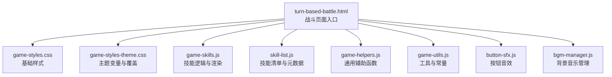
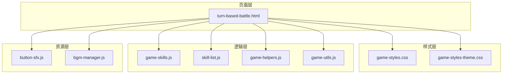
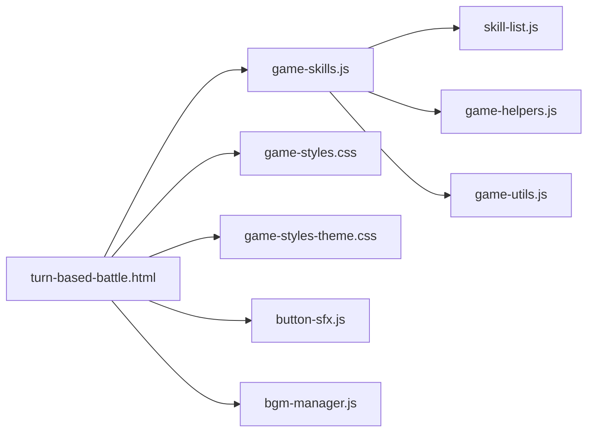

# 战斗界面

<cite>
**本文引用的文件**   
- [turn-based-battle.html](file://turn-based-battle.html)
- [turn-based-battle-new.html](file://turn-based-battle-new.html)
- [game-styles.css](file://module/game-styles.css)
- [game-styles-theme.css](file://module/game-styles-theme.css)
- [game-skills.js](file://module/game-skills.js)
- [skill-list.js](file://module/skill-list.js)
- [game-helpers.js](file://module/game-helpers.js)
- [game-utils.js](file://module/game-utils.js)
- [button-sfx.js](file://module/button-sfx.js)
- [bgm-manager.js](file://module/bgm-manager.js)
</cite>

## 目录
1. [简介](#简介)
2. [项目结构](#项目结构)
3. [核心组件](#核心组件)
4. [架构总览](#架构总览)
5. [详细组件分析](#详细组件分析)
6. [依赖分析](#依赖分析)
7. [性能考虑](#性能考虑)
8. [故障排查指南](#故障排查指南)
9. [结论](#结论)
10. [附录](#附录)

## 简介
本技术文档聚焦“姬侠传”回合制战斗界面的前端实现，围绕HTML结构与CSS样式、用户交互逻辑、动画与特效系统、响应式适配以及主题定制展开。目标是帮助开发者快速理解并扩展战斗UI，包括角色立绘展示、技能按钮布局、状态信息面板、点击/键盘/触摸事件处理、伤害数字显示、横竖屏切换优化等。

## 项目结构
战斗界面由一个主HTML页面承载，配合全局样式与主题样式、技能数据与渲染逻辑、辅助工具与音效管理模块共同构成。关键文件职责如下：
- 战斗页面入口：提供DOM骨架与脚本加载
- 样式层：基础样式与主题变量
- 技能与数据：技能列表、技能行为与渲染
- 交互与工具：事件绑定、通用工具、音效与BGM控制

图表来源
- [turn-based-battle.html](file://turn-based-battle.html)
- [game-styles.css](file://module/game-styles.css)
- [game-styles-theme.css](file://module/game-styles-theme.css)
- [game-skills.js](file://module/game-skills.js)
- [skill-list.js](file://module/skill-list.js)
- [game-helpers.js](file://module/game-helpers.js)
- [game-utils.js](file://module/game-utils.js)
- [button-sfx.js](file://module/button-sfx.js)
- [bgm-manager.js](file://module/bgm-manager.js)

章节来源
- [turn-based-battle.html](file://turn-based-battle.html)
- [turn-based-battle-new.html](file://turn-based-battle-new.html)
- [game-styles.css](file://module/game-styles.css)
- [game-styles-theme.css](file://module/game-styles-theme.css)
- [game-skills.js](file://module/game-skills.js)
- [skill-list.js](file://module/skill-list.js)
- [game-helpers.js](file://module/game-helpers.js)
- [game-utils.js](file://module/game-utils.js)
- [button-sfx.js](file://module/button-sfx.js)
- [bgm-manager.js](file://module/bgm-manager.js)

## 核心组件
- 角色立绘展示区：用于呈现玩家与敌方角色的立绘、表情差分与动作帧序列
- 技能按钮面板：按回合或条件动态生成可点击的技能按钮，支持快捷键与触摸手势
- 状态信息面板：显示生命值、法力值、Buff/Debuff、回合计数等信息
- 日志与提示区域：滚动记录战斗事件、伤害数值、状态变化
- 特效与动画层：叠加在场景之上的粒子、光效、震动、伤害飘字等

章节来源
- [turn-based-battle.html](file://turn-based-battle.html)
- [game-styles.css](file://module/game-styles.css)
- [game-styles-theme.css](file://module/game-styles-theme.css)
- [game-skills.js](file://module/game-skills.js)
- [skill-list.js](file://module/skill-list.js)
- [game-helpers.js](file://module/game-helpers.js)
- [game-utils.js](file://module/game-utils.js)

## 架构总览
战斗界面采用“页面容器 + 样式层 + 逻辑层 + 资源层”的分层组织方式。页面负责挂载DOM与引入脚本；样式层提供基础布局与主题变量；逻辑层封装技能、交互与动画；资源层提供音效与背景音。

图表来源
- [turn-based-battle.html](file://turn-based-battle.html)
- [game-styles.css](file://module/game-styles.css)
- [game-styles-theme.css](file://module/game-styles-theme.css)
- [game-skills.js](file://module/game-skills.js)
- [skill-list.js](file://module/skill-list.js)
- [game-helpers.js](file://module/game-helpers.js)
- [game-utils.js](file://module/game-utils.js)
- [button-sfx.js](file://module/button-sfx.js)
- [bgm-manager.js](file://module/bgm-manager.js)

## 详细组件分析

### HTML结构与UI组件组织
- 根容器：包含背景层、场景层、UI层（顶部状态栏、中部立绘与特效、底部技能栏）
- 角色立绘区：左右分栏，分别放置玩家与敌方立绘，支持表情差分与动作切换
- 技能按钮区：网格或弹性布局，根据当前可用技能动态渲染，支持禁用态与冷却提示
- 状态面板：以卡片形式展示HP/MP、护盾、异常状态、回合数等
- 日志面板：固定高度滚动区域，追加文本与高亮标记
- 特效层：绝对定位的浮层，承载粒子、光晕、震动、伤害飘字等

章节来源
- [turn-based-battle.html](file://turn-based-battle.html)
- [game-styles.css](file://module/game-styles.css)
- [game-styles-theme.css](file://module/game-styles-theme.css)

### CSS样式设计与主题替换
- 基础样式：定义布局、排版、颜色、阴影、圆角、过渡动效等
- 主题变量：通过CSS自定义属性集中管理主色、强调色、字体、间距等
- 组件样式：为立绘、按钮、面板、日志等提供统一风格
- 主题覆盖：通过主题样式文件覆盖默认变量，实现一键换肤

章节来源
- [game-styles.css](file://module/game-styles.css)
- [game-styles-theme.css](file://module/game-styles-theme.css)

### 用户交互逻辑（点击、键盘、触摸）
- 点击事件：为技能按钮绑定点击处理器，触发技能选择、确认与执行流程
- 键盘快捷键：监听常用按键（如数字键、回车、空格）映射到技能或操作
- 触摸适配：支持移动端长按、滑动、缩放等手势，提升触控体验
- 焦点与无障碍：为按钮设置焦点顺序与ARIA标签，便于键盘导航与读屏器

章节来源
- [turn-based-battle.html](file://turn-based-battle.html)
- [game-skills.js](file://module/game-skills.js)
- [game-helpers.js](file://module/game-helpers.js)
- [game-utils.js](file://module/game-utils.js)

### 战斗动画系统与视觉效果
- 技能特效播放：根据技能类型触发对应特效（光效、粒子、屏幕震动）
- 角色动作动画：切换立绘帧或表情差分，表现攻击、受击、防御等动作
- 伤害数字显示：在目标位置弹出伤害数值，带渐隐与位移动画
- 时序控制：使用队列或时间轴协调多段动画，避免冲突与卡顿

章节来源
- [game-skills.js](file://module/game-skills.js)
- [game-helpers.js](file://module/game-helpers.js)
- [game-utils.js](file://module/game-utils.js)

### 响应式设计与移动端优化
- 断点策略：针对手机、平板、桌面端设置不同布局与字号
- 横竖屏切换：监听方向变化，调整技能栏与状态面板排布
- 触控优化：增大按钮热区、减少误触、优化滚动与拖拽
- 性能优化：按需加载图片、压缩资源、减少重排重绘

章节来源
- [game-styles.css](file://module/game-styles.css)
- [game-styles-theme.css](file://module/game-styles-theme.css)
- [game-helpers.js](file://module/game-helpers.js)
- [game-utils.js](file://module/game-utils.js)

### 界面定制与主题开发指南
- 新增主题：复制主题样式文件，修改CSS变量与组件覆盖
- 替换素材：更新立绘、图标、音效路径，保持命名规范
- 配置开关：通过全局配置对象启用/禁用特定功能（如音效、动画强度）
- 测试验证：在不同设备与浏览器下验证主题一致性与性能

章节来源
- [game-styles-theme.css](file://module/game-styles-theme.css)
- [game-config.js](file://module/game-config.js)

## 依赖分析
战斗界面各模块之间的依赖关系清晰，页面作为入口引入样式与脚本，逻辑层之间通过工具与辅助函数协作，资源层提供音效与BGM能力。

图表来源
- [turn-based-battle.html](file://turn-based-battle.html)
- [game-skills.js](file://module/game-skills.js)
- [skill-list.js](file://module/skill-list.js)
- [game-helpers.js](file://module/game-helpers.js)
- [game-utils.js](file://module/game-utils.js)
- [game-styles.css](file://module/game-styles.css)
- [game-styles-theme.css](file://module/game-styles-theme.css)
- [button-sfx.js](file://module/button-sfx.js)
- [bgm-manager.js](file://module/bgm-manager.js)

章节来源
- [turn-based-battle.html](file://turn-based-battle.html)
- [game-skills.js](file://module/game-skills.js)
- [skill-list.js](file://module/skill-list.js)
- [game-helpers.js](file://module/game-helpers.js)
- [game-utils.js](file://module/game-utils.js)
- [game-styles.css](file://module/game-styles.css)
- [game-styles-theme.css](file://module/game-styles-theme.css)
- [button-sfx.js](file://module/button-sfx.js)
- [bgm-manager.js](file://module/bgm-manager.js)

## 性能考虑
- 资源加载：优先加载首屏必要资源，延迟加载非关键图片与音效
- 动画性能：使用CSS transform与opacity进行动画，避免频繁读写布局属性
- 事件节流：对高频事件（滚动、触摸移动）进行节流与防抖
- 内存管理：及时移除不再使用的DOM节点与事件监听器，防止泄漏
- 渲染优化：批量更新UI，减少重排重绘次数

[本节为通用指导，不直接分析具体文件]

## 故障排查指南
- 技能无法释放：检查技能可用性判定逻辑与冷却状态
- 动画不同步：核对动画队列与回调顺序，确保无竞态条件
- 音效缺失：确认音效文件路径与权限，检查音频上下文是否已初始化
- 主题错乱：验证CSS变量覆盖优先级与类名冲突
- 移动端触控异常：检查触摸事件捕获与默认行为阻止

章节来源
- [game-skills.js](file://module/game-skills.js)
- [button-sfx.js](file://module/button-sfx.js)
- [bgm-manager.js](file://module/bgm-manager.js)
- [game-styles-theme.css](file://module/game-styles-theme.css)

## 结论
战斗界面通过清晰的层次化结构与模块化设计，实现了良好的可扩展性与可维护性。借助CSS变量与主题覆盖机制，能够快速完成视觉定制；通过完善的交互与动画系统，提升了用户体验。建议在后续迭代中持续优化性能与无障碍特性，进一步丰富技能与特效表现。

[本节为总结性内容，不直接分析具体文件]

## 附录
- 版本差异：对比新旧战斗页面的改动与迁移建议
- 最佳实践：推荐的事件绑定模式、动画编排策略与主题开发流程
- 参考示例：结合现有文件路径查看具体实现细节

章节来源
- [turn-based-battle.html](file://turn-based-battle.html)
- [turn-based-battle-new.html](file://turn-based-battle-new.html)