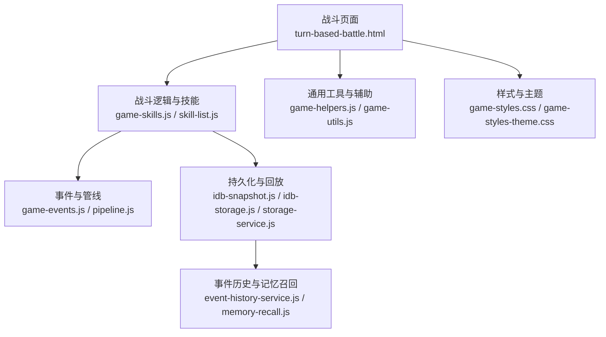
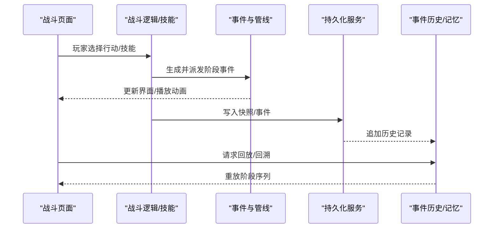
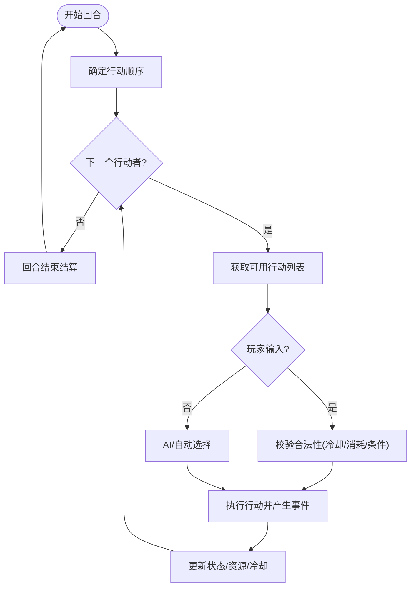
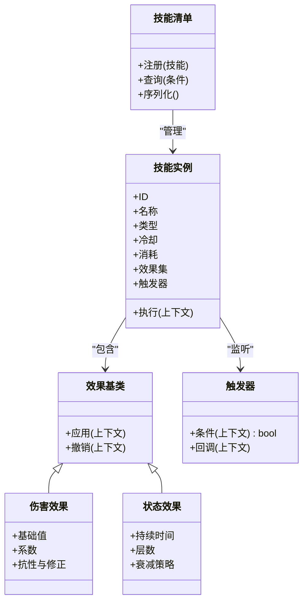
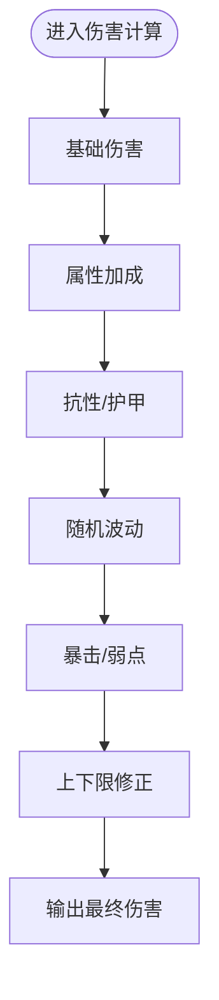
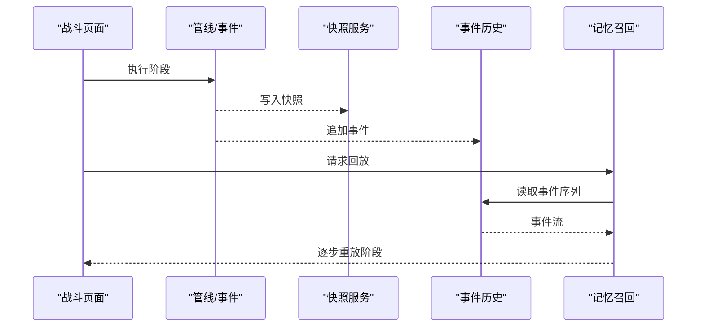
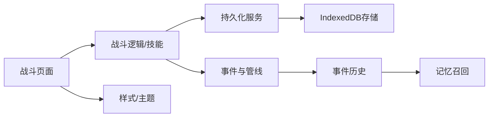

# 战斗系统

<cite>
**本文引用的文件**   
- [turn-based-battle.html](file://turn-based-battle.html)
- [turn-based-battle-new.html](file://turn-based-battle-new.html)
- [game-skills.js](file://module/game-skills.js)
- [skill-list.js](file://module/skill-list.js)
- [game-helpers.js](file://module/game-helpers.js)
- [game-utils.js](file://module/game-utils.js)
- [idb-snapshot.js](file://module/idb-snapshot.js)
- [idb-storage.js](file://module/idb-storage.js)
- [storage-service.js](file://module/storage-service.js)
- [event-history-service.js](file://module/event-history-service.js)
- [memory-recall.js](file://module/memory-recall.js)
- [pipeline.js](file://module/pipeline.js)
- [game-events.js](file://module/game-events.js)
- [game-config.js](file://module/game-config.js)
- [game-styles.css](file://module/game-styles.css)
- [game-styles-theme.css](file://module/game-styles-theme.css)
</cite>

## 目录
1. [简介](#简介)
2. [项目结构](#项目结构)
3. [核心组件](#核心组件)
4. [架构总览](#架构总览)
5. [详细组件分析](#详细组件分析)
6. [依赖关系分析](#依赖关系分析)
7. [性能考虑](#性能考虑)
8. [故障排查指南](#故障排查指南)
9. [结论](#结论)
10. [附录](#附录)

## 简介
本技术文档面向“姬侠传”回合制战斗系统的开发者与维护者，系统性阐述以下主题：
- 回合管理、行动选择、伤害计算与状态效果等核心机制
- 技能系统的实现（定义、冷却、消耗、触发）
- 战斗界面交互设计与动画效果
- 战斗数据的持久化与回放机制
- 新技能添加与自定义战斗逻辑的开发指南
- 战斗平衡性调整与性能优化最佳实践

## 项目结构
围绕战斗系统的关键代码主要分布在以下位置：
- 战斗页面入口与UI：turn-based-battle.html、turn-based-battle-new.html
- 战斗逻辑与技能系统：module/game-skills.js、module/skill-list.js、module/game-helpers.js、module/game-utils.js
- 数据持久化与回放：module/idb-snapshot.js、module/idb-storage.js、module/storage-service.js、module/event-history-service.js、module/memory-recall.js
- 事件与管线：module/game-events.js、module/pipeline.js
- 配置与样式：module/game-config.js、module/game-styles.css、module/game-styles-theme.css

图表来源
- [turn-based-battle.html](file://turn-based-battle.html)
- [turn-based-battle-new.html](file://turn-based-battle-new.html)
- [game-skills.js](file://module/game-skills.js)
- [skill-list.js](file://module/skill-list.js)
- [game-helpers.js](file://module/game-helpers.js)
- [game-utils.js](file://module/game-utils.js)
- [game-events.js](file://module/game-events.js)
- [pipeline.js](file://module/pipeline.js)
- [idb-snapshot.js](file://module/idb-snapshot.js)
- [idb-storage.js](file://module/idb-storage.js)
- [storage-service.js](file://module/storage-service.js)
- [event-history-service.js](file://module/event-history-service.js)
- [memory-recall.js](file://module/memory-recall.js)
- [game-styles.css](file://module/game-styles.css)
- [game-styles-theme.css](file://module/game-styles-theme.css)

章节来源
- [turn-based-battle.html](file://turn-based-battle.html)
- [turn-based-battle-new.html](file://turn-based-battle-new.html)
- [game-skills.js](file://module/game-skills.js)
- [skill-list.js](file://module/skill-list.js)
- [game-helpers.js](file://module/game-helpers.js)
- [game-utils.js](file://module/game-utils.js)
- [game-events.js](file://module/game-events.js)
- [pipeline.js](file://module/pipeline.js)
- [idb-snapshot.js](file://module/idb-snapshot.js)
- [idb-storage.js](file://module/idb-storage.js)
- [storage-service.js](file://module/storage-service.js)
- [event-history-service.js](file://module/event-history-service.js)
- [memory-recall.js](file://module/memory-recall.js)
- [game-styles.css](file://module/game-styles.css)
- [game-styles-theme.css](file://module/game-styles-theme.css)

## 核心组件
- 战斗页面与UI层
  - 负责渲染战斗场景、角色立绘/差分、行动面板、日志与回放控件。
  - 通过事件总线与管线协调各子系统。
- 战斗逻辑与技能系统
  - 回合调度、行动判定、伤害计算、状态效果应用、技能冷却与消耗管理。
  - 技能注册表与动态加载。
- 事件与管线
  - 将战斗步骤抽象为可编排的“阶段”，支持顺序执行、条件分支与副作用。
- 持久化与回放
  - 快照存储、事件历史记录、记忆回溯与重放。
- 配置与样式
  - 全局战斗参数、主题切换与视觉表现。

章节来源
- [turn-based-battle.html](file://turn-based-battle.html)
- [turn-based-battle-new.html](file://turn-based-battle-new.html)
- [game-skills.js](file://module/game-skills.js)
- [skill-list.js](file://module/skill-list.js)
- [game-helpers.js](file://module/game-helpers.js)
- [game-utils.js](file://module/game-utils.js)
- [game-events.js](file://module/game-events.js)
- [pipeline.js](file://module/pipeline.js)
- [idb-snapshot.js](file://module/idb-snapshot.js)
- [idb-storage.js](file://module/idb-storage.js)
- [storage-service.js](file://module/storage-service.js)
- [event-history-service.js](file://module/event-history-service.js)
- [memory-recall.js](file://module/memory-recall.js)
- [game-config.js](file://module/game-config.js)
- [game-styles.css](file://module/game-styles.css)
- [game-styles-theme.css](file://module/game-styles-theme.css)

## 架构总览
战斗系统采用“页面-逻辑-事件-持久化”的分层架构，关键交互如下：

图表来源
- [turn-based-battle.html](file://turn-based-battle.html)
- [turn-based-battle-new.html](file://turn-based-battle-new.html)
- [game-skills.js](file://module/game-skills.js)
- [game-events.js](file://module/game-events.js)
- [pipeline.js](file://module/pipeline.js)
- [idb-snapshot.js](file://module/idb-snapshot.js)
- [idb-storage.js](file://module/idb-storage.js)
- [storage-service.js](file://module/storage-service.js)
- [event-history-service.js](file://module/event-history-service.js)
- [memory-recall.js](file://module/memory-recall.js)

## 详细组件分析

### 回合管理与行动选择
- 回合推进
  - 按队伍顺序依次处理行动，支持跳过、等待、强制行动等控制。
  - 每回合结束时进行结算（如持续状态、回合结束回调）。
- 行动可用性
  - 基于当前状态、资源与冷却判断是否可用。
  - 提供“自动/快捷”选项以简化操作。
- 冲突与优先级
  - 多目标/范围技能时，依据规则确定目标集合与命中顺序。
  - 打断/反制/先手判定在管线中作为前置阶段执行。

图表来源
- [turn-based-battle.html](file://turn-based-battle.html)
- [turn-based-battle-new.html](file://turn-based-battle-new.html)
- [game-skills.js](file://module/game-skills.js)
- [game-helpers.js](file://module/game-helpers.js)
- [game-utils.js](file://module/game-utils.js)
- [game-events.js](file://module/game-events.js)
- [pipeline.js](file://module/pipeline.js)

章节来源
- [turn-based-battle.html](file://turn-based-battle.html)
- [turn-based-battle-new.html](file://turn-based-battle-new.html)
- [game-skills.js](file://module/game-skills.js)
- [game-helpers.js](file://module/game-helpers.js)
- [game-utils.js](file://module/game-utils.js)
- [game-events.js](file://module/game-events.js)
- [pipeline.js](file://module/pipeline.js)

### 技能系统（定义、冷却、消耗、触发）
- 技能注册与清单
  - 集中式技能清单用于注册、查询与序列化。
  - 支持按标签/类型筛选，便于UI展示与AI决策。
- 技能生命周期
  - 准备阶段：检查冷却、消耗、前置条件。
  - 执行阶段：计算目标、伤害/治疗、附加状态、触发连锁。
  - 收尾阶段：更新冷却、刷新状态、记录事件。
- 冷却与消耗
  - 冷却可按回合或时间维度管理；消耗包括资源点、能量、次数等。
  - 支持共享冷却与条件豁免。
- 触发器与复合效果
  - 内置常见触发器（受击、击杀、回合开始/结束、状态变化等）。
  - 组合多个子效果形成复杂技能。

图表来源
- [skill-list.js](file://module/skill-list.js)
- [game-skills.js](file://module/game-skills.js)
- [game-helpers.js](file://module/game-helpers.js)
- [game-utils.js](file://module/game-utils.js)

章节来源
- [skill-list.js](file://module/skill-list.js)
- [game-skills.js](file://module/game-skills.js)
- [game-helpers.js](file://module/game-helpers.js)
- [game-utils.js](file://module/game-utils.js)

### 伤害计算与状态效果
- 伤害计算流程
  - 基础伤害 → 属性加成 → 抗性/护甲减免 → 随机波动 → 暴击/弱点 → 最终伤害。
  - 支持多段伤害与分阶段结算。
- 状态效果
  - 增益/减益、持续伤害/治疗、免疫/反射、行动条加速/减速等。
  - 状态叠加、优先级与清除策略。
- 异常与边界
  - 溢出保护、负值归零、最小伤害保底、伤害上限封顶。

图表来源
- [game-skills.js](file://module/game-skills.js)
- [game-helpers.js](file://module/game-helpers.js)
- [game-utils.js](file://module/game-utils.js)

章节来源
- [game-skills.js](file://module/game-skills.js)
- [game-helpers.js](file://module/game-helpers.js)
- [game-utils.js](file://module/game-utils.js)

### 战斗界面交互与动画
- 交互设计
  - 行动面板、目标选择、确认/取消、提示与反馈。
  - 快捷键与无障碍支持。
- 动画与表现
  - 动作帧、特效、镜头抖动、音效同步。
  - 使用CSS/Canvas/WebGL按需启用，避免阻塞主线程。
- 主题与皮肤
  - 通过主题变量与样式覆盖实现换肤。

章节来源
- [turn-based-battle.html](file://turn-based-battle.html)
- [turn-based-battle-new.html](file://turn-based-battle-new.html)
- [game-styles.css](file://module/game-styles.css)
- [game-styles-theme.css](file://module/game-styles-theme.css)

### 数据持久化与回放
- 快照机制
  - 周期性或关键节点保存战斗快照，支持断点续战。
- 事件历史
  - 将每个阶段/行动记录为不可变事件，便于回放与调试。
- 记忆回溯
  - 从历史事件重建状态，支持快进/慢放/跳转。
- 存储后端
  - 基于IndexedDB的本地存储与服务封装，保证一致性。

图表来源
- [idb-snapshot.js](file://module/idb-snapshot.js)
- [idb-storage.js](file://module/idb-storage.js)
- [storage-service.js](file://module/storage-service.js)
- [event-history-service.js](file://module/event-history-service.js)
- [memory-recall.js](file://module/memory-recall.js)
- [pipeline.js](file://module/pipeline.js)

章节来源
- [idb-snapshot.js](file://module/idb-snapshot.js)
- [idb-storage.js](file://module/idb-storage.js)
- [storage-service.js](file://module/storage-service.js)
- [event-history-service.js](file://module/event-history-service.js)
- [memory-recall.js](file://module/memory-recall.js)
- [pipeline.js](file://module/pipeline.js)

### 开发指南：新增技能与自定义逻辑
- 新增技能步骤
  - 在技能清单中注册新技能元数据（ID、名称、类型、冷却、消耗、描述等）。
  - 实现技能效果（伤害、治疗、状态、触发器等），并在执行阶段挂载。
  - 在UI中暴露该技能的图标与说明，绑定点击事件到执行管线。
- 自定义战斗逻辑
  - 扩展管线阶段：在事件管线中插入新的阶段（如“预结算”、“后处理”）。
  - 扩展状态效果：新增状态类型及其生命周期钩子。
  - 扩展伤害模型：增加新的修正项或公式模块。
- 测试与验证
  - 使用回放功能验证确定性。
  - 结合模拟脚本与报告进行平衡性评估。

章节来源
- [skill-list.js](file://module/skill-list.js)
- [game-skills.js](file://module/game-skills.js)
- [game-helpers.js](file://module/game-helpers.js)
- [game-utils.js](file://module/game-utils.js)
- [pipeline.js](file://module/pipeline.js)
- [turn-based-battle.html](file://turn-based-battle.html)
- [turn-based-battle-new.html](file://turn-based-battle-new.html)

### 平衡性调整与性能优化最佳实践
- 平衡性
  - 建立数值基准与回归测试，关注极端情况与连招收益。
  - 引入“期望伤害/期望生存率”指标监控。
- 性能
  - 批量更新UI，减少重排重绘。
  - 动画与特效异步化，避免主线程阻塞。
  - 事件与快照压缩与增量更新。
  - 对热点路径进行采样分析与缓存优化。

[本节为通用指导，不直接分析具体文件]

## 依赖关系分析
战斗系统内部模块耦合度适中，遵循“低内聚、高内聚”原则：
- 战斗页面依赖逻辑与样式，但不直接访问持久化细节。
- 逻辑层通过事件与管线解耦，降低与UI和存储的耦合。
- 持久化层独立于业务逻辑，仅接收不可变事件与快照。

图表来源
- [turn-based-battle.html](file://turn-based-battle.html)
- [turn-based-battle-new.html](file://turn-based-battle-new.html)
- [game-skills.js](file://module/game-skills.js)
- [game-events.js](file://module/game-events.js)
- [pipeline.js](file://module/pipeline.js)
- [idb-snapshot.js](file://module/idb-snapshot.js)
- [idb-storage.js](file://module/idb-storage.js)
- [storage-service.js](file://module/storage-service.js)
- [event-history-service.js](file://module/event-history-service.js)
- [memory-recall.js](file://module/memory-recall.js)
- [game-styles.css](file://module/game-styles.css)
- [game-styles-theme.css](file://module/game-styles-theme.css)

章节来源
- [turn-based-battle.html](file://turn-based-battle.html)
- [turn-based-battle-new.html](file://turn-based-battle-new.html)
- [game-skills.js](file://module/game-skills.js)
- [game-events.js](file://module/game-events.js)
- [pipeline.js](file://module/pipeline.js)
- [idb-snapshot.js](file://module/idb-snapshot.js)
- [idb-storage.js](file://module/idb-storage.js)
- [storage-service.js](file://module/storage-service.js)
- [event-history-service.js](file://module/event-history-service.js)
- [memory-recall.js](file://module/memory-recall.js)
- [game-styles.css](file://module/game-styles.css)
- [game-styles-theme.css](file://module/game-styles-theme.css)

## 性能考虑
- 渲染优化
  - 合并DOM更新，使用虚拟滚动或分页显示长日志。
  - 动画使用requestAnimationFrame，必要时降级为CSS过渡。
- 计算优化
  - 伤害与状态计算尽量纯函数化，便于缓存与并行化。
  - 大对象深拷贝改为浅拷贝+差异更新。
- 存储优化
  - 快照去重与压缩，事件批量化写入。
  - 定期清理过期快照与历史。

[本节为通用指导，不直接分析具体文件]

## 故障排查指南
- 常见问题定位
  - 技能未生效：检查注册表、冷却与消耗、触发条件。
  - 回放不一致：确认事件不可变性与快照一致性。
  - UI卡顿：排查重排重绘热点与动画队列。
- 调试建议
  - 开启详细日志，记录关键阶段与状态变更。
  - 使用回放快速复现问题，定位事件序列。
  - 针对特定场景编写最小复现用例。

章节来源
- [event-history-service.js](file://module/event-history-service.js)
- [memory-recall.js](file://module/memory-recall.js)
- [pipeline.js](file://module/pipeline.js)
- [game-skills.js](file://module/game-skills.js)
- [game-helpers.js](file://module/game-helpers.js)
- [game-utils.js](file://module/game-utils.js)

## 结论
本战斗系统以清晰的模块化与事件驱动为核心，实现了可扩展的技能体系、稳定的回放能力与良好的用户体验。通过合理的数值与性能策略，可在保持玩法深度的同时确保流畅运行。建议在新内容开发中严格遵循事件不可变与快照一致性原则，并以回放与模拟数据驱动平衡性迭代。

[本节为总结性内容，不直接分析具体文件]

## 附录
- 术语
  - 阶段：管线中的一个原子步骤，包含输入、处理与副作用。
  - 快照：某一时刻的系统状态序列化。
  - 事件：描述一次状态变更的不可变记录。
- 参考文件
  - 战斗页面与UI：turn-based-battle.html、turn-based-battle-new.html
  - 技能与逻辑：game-skills.js、skill-list.js、game-helpers.js、game-utils.js
  - 事件与回放：game-events.js、pipeline.js、event-history-service.js、memory-recall.js
  - 持久化：idb-snapshot.js、idb-storage.js、storage-service.js
  - 配置与样式：game-config.js、game-styles.css、game-styles-theme.css

[本节为索引性内容，不直接分析具体文件]