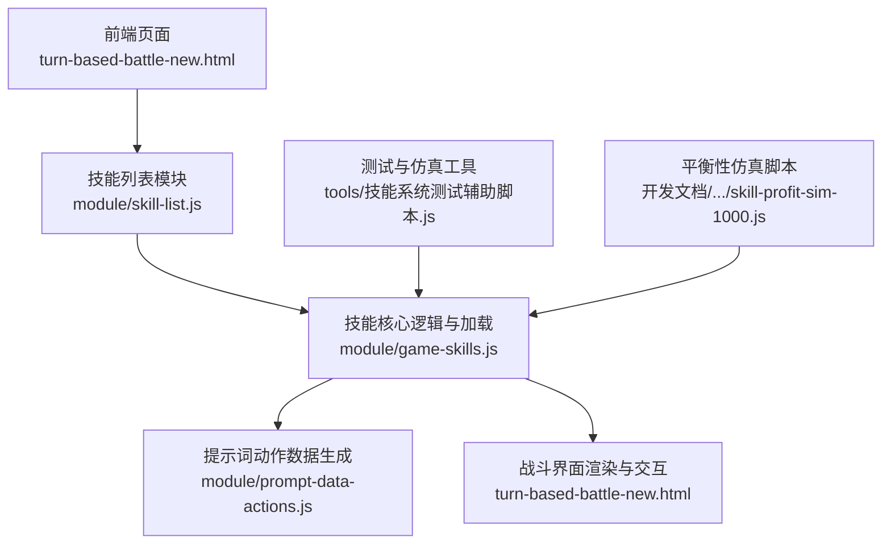
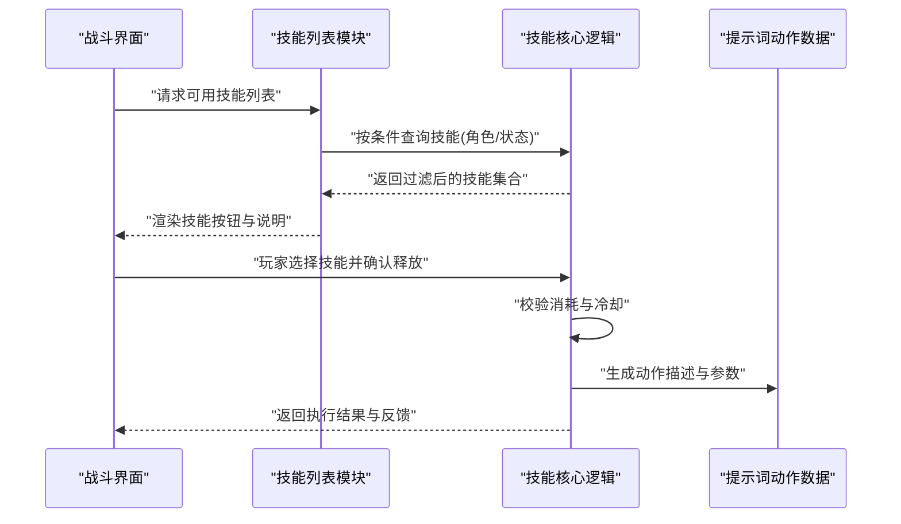
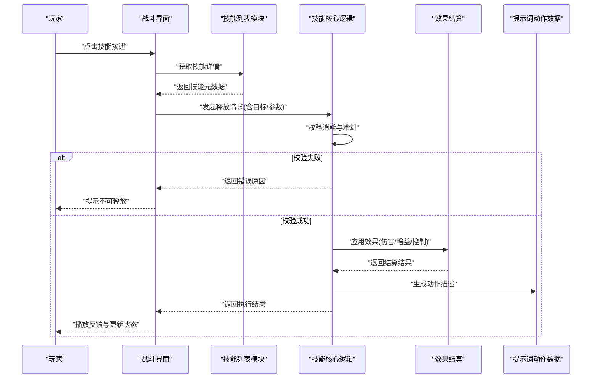
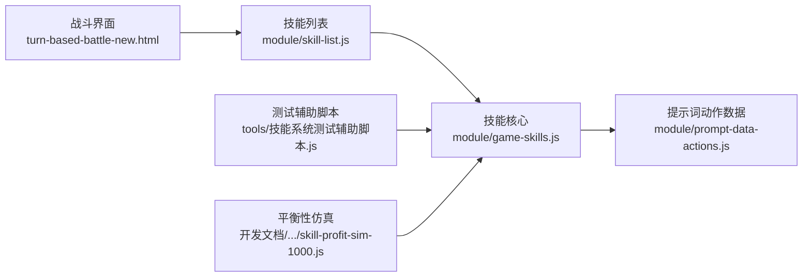

# 技能定义与配置

<cite>
**本文引用的文件**   
- [module/game-skills.js](file://module/game-skills.js)
- [module/skill-list.js](file://module/skill-list.js)
- [module/prompt-data-actions.js](file://module/prompt-data-actions.js)
- [turn-based-battle-new.html](file://turn-based-battle-new.html)
- [tools/技能系统测试辅助脚本.js](file://tools/技能系统测试辅助脚本.js)
- [开发文档/技能系统相关文档和脚本/技能系统手工测试checklist.md](file://开发文档/技能系统相关文档和脚本/技能系统手工测试checklist.md)
- [开发文档/技能系统相关文档和脚本/skill-profit-sim-1000.js](file://开发文档/技能系统相关文档和脚本/skill-profit-sim-1000.js)
</cite>

## 目录
1. [简介](#简介)
2. [项目结构](#项目结构)
3. [核心组件](#核心组件)
4. [架构总览](#架构总览)
5. [详细组件分析](#详细组件分析)
6. [依赖分析](#依赖分析)
7. [性能考虑](#性能考虑)
8. [故障排查指南](#故障排查指南)
9. [结论](#结论)
10. [附录](#附录)

## 简介
本文件面向“姬侠传”项目的技能系统与配置规范，目标是帮助策划、程序与测试人员统一理解并扩展技能体系。内容涵盖：
- 技能数据结构设计（ID、名称、描述、类型、消耗、冷却、伤害等）
- 技能分类体系（攻击、防御、辅助、特殊）及适用场景
- 配置文件格式（JSON）、字段校验规则与默认值策略
- 新增技能的完整流程（从创建到测试验证）
- 技能平衡性原则与数值调整建议

## 项目结构
与技能系统直接相关的代码与文档主要位于以下位置：
- 运行时逻辑与数据加载：module/game-skills.js、module/skill-list.js
- 战斗界面集成：turn-based-battle-new.html
- 提示词与AI交互：module/prompt-data-actions.js
- 测试与仿真：tools/技能系统测试辅助脚本.js、开发文档/技能系统相关文档和脚本/*

图表来源
- [module/game-skills.js](file://module/game-skills.js)
- [module/skill-list.js](file://module/skill-list.js)
- [module/prompt-data-actions.js](file://module/prompt-data-actions.js)
- [turn-based-battle-new.html](file://turn-based-battle-new.html)
- [tools/技能系统测试辅助脚本.js](file://tools/技能系统测试辅助脚本.js)
- [开发文档/技能系统相关文档和脚本/skill-profit-sim-1000.js](file://开发文档/技能系统相关文档和脚本/skill-profit-sim-1000.js)

章节来源
- [module/game-skills.js](file://module/game-skills.js)
- [module/skill-list.js](file://module/skill-list.js)
- [module/prompt-data-actions.js](file://module/prompt-data-actions.js)
- [turn-based-battle-new.html](file://turn-based-battle-new.html)
- [tools/技能系统测试辅助脚本.js](file://tools/技能系统测试辅助脚本.js)
- [开发文档/技能系统相关文档和脚本/skill-profit-sim-1000.js](file://开发文档/技能系统相关文档和脚本/skill-profit-sim-1000.js)

## 核心组件
- 技能数据模型与加载器
  - 负责解析技能配置、提供查询接口、维护全局索引与缓存
  - 关键职责：读取JSON配置、校验字段、构建内存结构、暴露API供战斗与UI调用
- 技能列表与展示
  - 将技能数据映射为可交互的列表项，支持筛选、排序与分页
  - 关键职责：根据当前角色/状态过滤可用技能、渲染按钮与提示
- 战斗集成与执行
  - 在回合制战斗中触发技能、计算消耗与冷却、应用效果（伤害、增益/减益、治疗等）
  - 关键职责：参数校验、资源扣减、冷却计时、效果结算、日志记录
- 提示词与AI联动
  - 将技能信息转换为AI可读的结构化描述，驱动剧情或战斗决策
  - 关键职责：序列化技能元数据、生成动作模板、注入上下文变量

章节来源
- [module/game-skills.js](file://module/game-skills.js)
- [module/skill-list.js](file://module/skill-list.js)
- [module/prompt-data-actions.js](file://module/prompt-data-actions.js)
- [turn-based-battle-new.html](file://turn-based-battle-new.html)

## 架构总览
技能系统采用“配置驱动 + 模块化”的架构：
- 配置层：以JSON形式定义技能属性与行为参数
- 数据层：加载并校验配置，构建内存索引
- 业务层：战斗逻辑、冷却管理、资源结算、效果应用
- 表现层：UI列表、战斗面板、提示词输出

图表来源
- [module/skill-list.js](file://module/skill-list.js)
- [module/game-skills.js](file://module/game-skills.js)
- [module/prompt-data-actions.js](file://module/prompt-data-actions.js)
- [turn-based-battle-new.html](file://turn-based-battle-new.html)

## 详细组件分析

### 技能数据模型与字段规范
- 标识与基础信息
  - 技能ID：唯一字符串或数字标识，用于全局索引与跨模块引用
  - 名称：显示用标题，需简洁明确
  - 描述：对技能效果的简要说明，便于UI与AI使用
- 类型与分类
  - 类型：如攻击、防御、辅助、特殊
  - 子类：可按机制进一步细分（例如单体/群体、即时/持续、物理/法术等）
- 资源与限制
  - 消耗：资源类型与数量（如内力、怒气、能量），可为固定值或表达式
  - 冷却时间：单位秒或回合数，支持全局/目标维度
  - 前置条件：等级、装备、状态、位置等
- 效果与数值
  - 伤害值：基础值、成长系数、随机区间、抗性与护甲修正
  - 附加效果：治疗、护盾、控制、穿透、溅射、概率触发等
  - 持续时间与刷新：适用于持续类效果
- 行为与优先级
  - 目标选择：自身、友方、敌方、随机、范围
  - 打断与优先级：是否可被中断、与其他技能的优先级关系
- 兼容与扩展
  - 版本标记：用于向后兼容与灰度发布
  - 自定义字段：预留扩展点，避免破坏既有逻辑

章节来源
- [module/game-skills.js](file://module/game-skills.js)
- [module/skill-list.js](file://module/skill-list.js)

### 技能分类体系与适用场景
- 攻击技能
  - 特点：以伤害为核心，可能附带控制或穿透
  - 适用：主力输出、爆发窗口、清场
  - 平衡要点：基础伤害、命中/暴击、冷却与消耗的比例
- 防御技能
  - 特点：护盾、减伤、闪避、反伤
  - 适用：生存保障、保护核心、反打节奏
  - 平衡要点：减伤幅度、持续时间、冷却与资源成本
- 辅助技能
  - 特点：增益、治疗、加速、解控
  - 适用：团队续航、战术配合、翻盘手段
  - 平衡要点：增益强度、作用范围、冷却与资源成本
- 特殊技能
  - 特点：机制型（位移、召唤、领域、连携）
  - 适用：策略深度、组合技、剧情演出
  - 平衡要点：机制复杂度、收益上限、风险与代价

章节来源
- [module/game-skills.js](file://module/game-skills.js)
- [module/skill-list.js](file://module/skill-list.js)

### 配置文件格式（JSON）与校验规则
- 文件组织
  - 建议按类别或角色拆分多个JSON文件，统一由加载器聚合
  - 命名约定：id.json、category_id.json、role_id.json
- 顶层结构
  - skills数组：包含所有技能条目
  - 每个条目遵循字段规范（见上节）
- 字段校验规则
  - 必填字段：ID、名称、类型、消耗、冷却、效果
  - 取值范围：数值型字段需有上下界；百分比需在0~1之间
  - 唯一性：ID全局唯一，禁止重复
  - 引用完整性：若存在外部引用（如特效、音效），需确保路径有效
- 默认值设置
  - 未提供的可选字段应赋予安全默认值（如冷却=0、概率=0、范围=单体）
  - 默认值不得改变核心语义，仅用于简化配置

章节来源
- [module/game-skills.js](file://module/game-skills.js)

### 新增技能完整步骤指南
- 准备阶段
  - 确定技能定位与分类，评估对现有体系的侵入程度
  - 预估数值范围，参考同类技能与仿真报告
- 创建配置
  - 在对应JSON文件中添加新条目，填写必填字段与必要扩展字段
  - 为复杂效果补充结构化参数（如多段伤害、阈值触发）
- 加载与校验
  - 运行加载器，检查是否有校验错误或缺失引用
  - 通过单元测试或辅助脚本进行静态检查
- 集成与渲染
  - 在技能列表中注册新技能，确保筛选与排序正确
  - 在战斗界面绑定点击事件与反馈动画
- 测试与验证
  - 使用手工测试清单逐项验证（见下节）
  - 运行仿真脚本，观察胜率、期望收益与稳定性
- 上线与监控
  - 灰度发布，收集实战数据
  - 根据反馈微调数值与体验细节

章节来源
- [tools/技能系统测试辅助脚本.js](file://tools/技能系统测试辅助脚本.js)
- [开发文档/技能系统相关文档和脚本/技能系统手工测试checklist.md](file://开发文档/技能系统相关文档和脚本/技能系统手工测试checklist.md)
- [开发文档/技能系统相关文档和脚本/skill-profit-sim-1000.js](file://开发文档/技能系统相关文档和脚本/skill-profit-sim-1000.js)

### 技能执行流程（序列图）

图表来源
- [module/skill-list.js](file://module/skill-list.js)
- [module/game-skills.js](file://module/game-skills.js)
- [module/prompt-data-actions.js](file://module/prompt-data-actions.js)
- [turn-based-battle-new.html](file://turn-based-battle-new.html)

### 数值与平衡性设计原则
- 一致性
  - 同类型技能保持相近的“强度/成本/冷却”比例
  - 伤害公式与抗性修正统一，避免隐性乘区叠加
- 可控性
  - 关键数值（基础伤害、概率、持续时间）提供可调参数
  - 保留调试开关与日志输出，便于定位问题
- 可测性
  - 通过仿真脚本进行大规模抽样，关注期望收益与方差
  - 建立基准数据集，回归测试时对比差异
- 渐进式迭代
  - 小步快跑，先灰度后全量
  - 依据实战数据与玩家反馈动态调整

章节来源
- [开发文档/技能系统相关文档和脚本/skill-profit-sim-1000.js](file://开发文档/技能系统相关文档和脚本/skill-profit-sim-1000.js)

## 依赖分析
- 模块耦合
  - 技能列表模块依赖核心逻辑提供查询与过滤能力
  - 战斗界面依赖列表与核心逻辑完成交互与执行
  - 提示词模块依赖核心逻辑输出的结构化数据
- 外部依赖
  - JSON配置文件的完整性与可用性
  - 仿真与测试工具的数据输入与输出格式

图表来源
- [module/game-skills.js](file://module/game-skills.js)
- [module/skill-list.js](file://module/skill-list.js)
- [module/prompt-data-actions.js](file://module/prompt-data-actions.js)
- [turn-based-battle-new.html](file://turn-based-battle-new.html)
- [tools/技能系统测试辅助脚本.js](file://tools/技能系统测试辅助脚本.js)
- [开发文档/技能系统相关文档和脚本/skill-profit-sim-1000.js](file://开发文档/技能系统相关文档和脚本/skill-profit-sim-1000.js)

章节来源
- [module/game-skills.js](file://module/game-skills.js)
- [module/skill-list.js](file://module/skill-list.js)
- [module/prompt-data-actions.js](file://module/prompt-data-actions.js)
- [turn-based-battle-new.html](file://turn-based-battle-new.html)
- [tools/技能系统测试辅助脚本.js](file://tools/技能系统测试辅助脚本.js)
- [开发文档/技能系统相关文档和脚本/skill-profit-sim-1000.js](file://开发文档/技能系统相关文档和脚本/skill-profit-sim-1000.js)

## 性能考虑
- 配置加载
  - 预解析与缓存：启动时一次性加载并构建索引，运行时直接查表
  - 增量更新：热重载时仅替换变更条目，避免全量重建
- 查询与过滤
  - 基于索引的多级过滤（类型、标签、状态），减少遍历开销
  - 批量渲染：合并UI更新，降低重排重绘次数
- 战斗执行
  - 效果结算批处理：同一回合内合并多次修改，减少中间态
  - 异步与分帧：长耗时计算拆分为多帧，避免卡顿

[本节为通用指导，不直接分析具体文件]

## 故障排查指南
- 常见问题
  - 配置缺失或字段类型错误：检查JSON结构与必填字段
  - ID冲突导致覆盖：确保全局唯一性
  - 冷却与消耗异常：核对默认值与边界条件
  - UI无法显示：确认列表模块是否正确注册与渲染
- 定位方法
  - 启用调试日志，记录关键节点（加载、校验、执行、结算）
  - 使用测试辅助脚本进行最小复现
  - 结合手工测试清单逐项比对预期与实际
- 恢复策略
  - 回滚至上一稳定版本配置
  - 逐步缩小变更范围，隔离问题源

章节来源
- [tools/技能系统测试辅助脚本.js](file://tools/技能系统测试辅助脚本.js)
- [开发文档/技能系统相关文档和脚本/技能系统手工测试checklist.md](file://开发文档/技能系统相关文档和脚本/技能系统手工测试checklist.md)

## 结论
通过统一的技能数据模型、严格的配置校验与完善的测试仿真体系，“姬侠传”的技能系统具备良好的可扩展性与可维护性。建议在后续迭代中持续完善数值基准库与自动化回归流程，以提升平衡性调优效率与质量。

[本节为总结性内容，不直接分析具体文件]

## 附录
- 术语表
  - 技能ID：全局唯一标识符
  - 冷却时间：技能再次可用的等待时长
  - 消耗：释放技能所需的资源
  - 效果：技能产生的实际影响（伤害、增益、控制等）
- 参考链接
  - 手工测试清单：[开发文档/技能系统相关文档和脚本/技能系统手工测试checklist.md](file://开发文档/技能系统相关文档和脚本/技能系统手工测试checklist.md)
  - 平衡性仿真脚本：[开发文档/技能系统相关文档和脚本/skill-profit-sim-1000.js](file://开发文档/技能系统相关文档和脚本/skill-profit-sim-1000.js)