# 技能执行流程

<cite>
**本文引用的文件**   
- [module/game-skills.js](file://module/game-skills.js)
- [module/skill-list.js](file://module/skill-list.js)
- [module/event-runner.js](file://module/event-runner.js)
- [module/pipeline.js](file://module/pipeline.js)
- [module/log-capture.js](file://module/log-capture.js)
- [module/variable-system.js](file://module/variable-system.js)
- [module/game-helpers.js](file://module/game-helpers.js)
- [module/game-config.js](file://module/game-config.js)
- [module/response-parser.js](file://module/response-parser.js)
- [module/template-engine.js](file://module/template-engine.js)
- [turn-based-battle.html](file://turn-based-battle.html)
</cite>

## 目录
1. [简介](#简介)
2. [项目结构](#项目结构)
3. [核心组件](#核心组件)
4. [架构总览](#架构总览)
5. [详细组件分析](#详细组件分析)
6. [依赖关系分析](#依赖关系分析)
7. [性能考量](#性能考量)
8. [故障排查指南](#故障排查指南)
9. [结论](#结论)
10. [附录](#附录)

## 简介
本技术文档聚焦“姬侠传”的技能执行流程，系统化阐述从技能触发、验证检查、资源扣除、效果计算、动画播放到状态更新的全生命周期；深入解释多技能并发触发的优先级与冲突解决机制；说明全局冷却、个人冷却、条件冷却的实现方式；并提供调试与日志记录的方法，包括执行追踪、错误诊断与性能监控。

## 项目结构
围绕技能系统的关键模块分布如下：
- 技能定义与清单：skill-list.js、game-skills.js
- 事件与流水线调度：event-runner.js、pipeline.js
- 变量与配置：variable-system.js、game-config.js
- 辅助工具与模板：game-helpers.js、template-engine.js
- 响应解析（AI/外部输入）：response-parser.js
- 日志捕获：log-capture.js
- 战斗页面入口：turn-based-battle.html

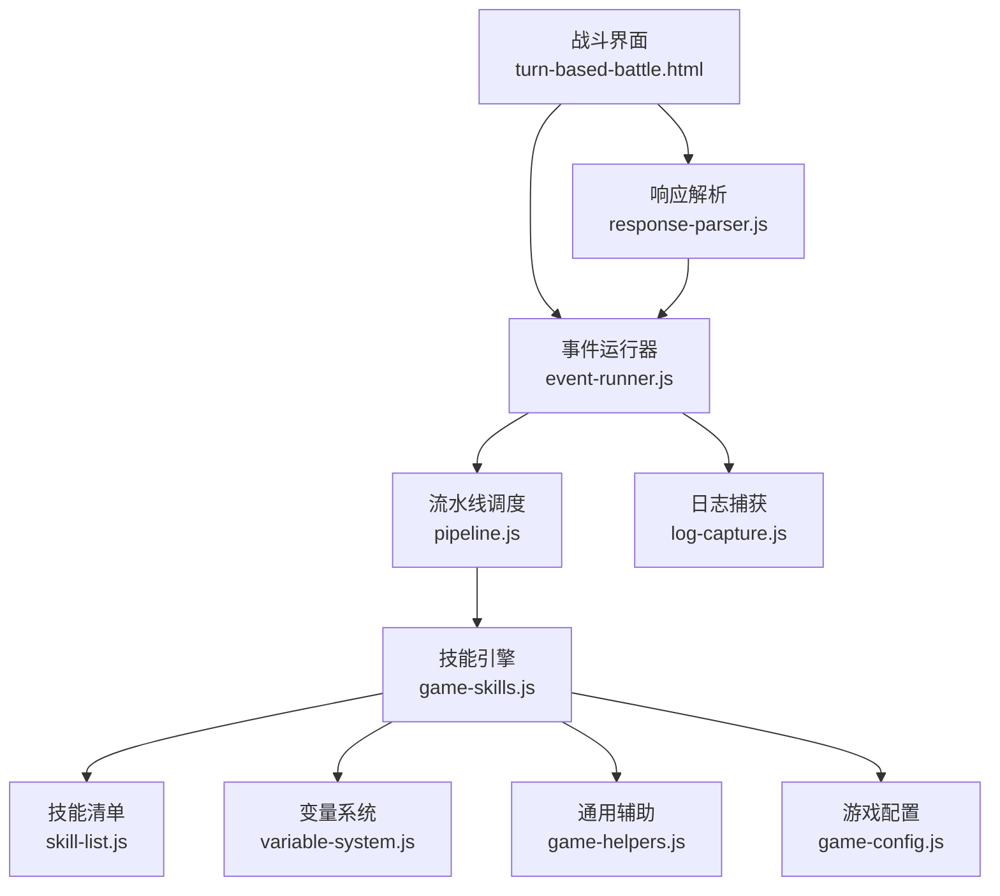

图表来源
- [module/event-runner.js](file://module/event-runner.js)
- [module/pipeline.js](file://module/pipeline.js)
- [module/game-skills.js](file://module/game-skills.js)
- [module/skill-list.js](file://module/skill-list.js)
- [module/variable-system.js](file://module/variable-system.js)
- [module/game-helpers.js](file://module/game-helpers.js)
- [module/game-config.js](file://module/game-config.js)
- [module/log-capture.js](file://module/log-capture.js)
- [module/response-parser.js](file://module/response-parser.js)
- [turn-based-battle.html](file://turn-based-battle.html)

章节来源
- [module/game-skills.js](file://module/game-skills.js)
- [module/skill-list.js](file://module/skill-list.js)
- [module/event-runner.js](file://module/event-runner.js)
- [module/pipeline.js](file://module/pipeline.js)
- [module/log-capture.js](file://module/log-capture.js)
- [module/variable-system.js](file://module/variable-system.js)
- [module/game-helpers.js](file://module/game-helpers.js)
- [module/game-config.js](file://module/game-config.js)
- [module/response-parser.js](file://module/response-parser.js)
- [turn-based-battle.html](file://turn-based-battle.html)

## 核心组件
- 技能清单与注册：集中维护技能元数据、标签、分类、默认参数等，供引擎在运行时查询与实例化。
- 技能引擎：负责技能生命周期管理，包括触发判定、优先级排序、冷却校验、资源检查、效果计算、副作用应用与结果回写。
- 事件运行器：统一接收来自UI或外部输入的指令，转换为内部事件并交由流水线处理。
- 流水线调度：按阶段编排执行步骤（如准备、校验、执行、结算、回放），保证顺序与可观测性。
- 变量系统：提供运行时读写角色属性、战场状态、临时标记等，支撑条件判断与数值计算。
- 辅助工具：封装常用逻辑（如随机、范围选择、伤害公式、状态转换）。
- 配置中心：集中存放平衡性参数、阈值、开关等可调项。
- 日志捕获：统一收集关键节点日志，便于追踪与排障。
- 响应解析：将外部输入（如AI生成动作）解析为结构化事件，进入技能管线。

章节来源
- [module/skill-list.js](file://module/skill-list.js)
- [module/game-skills.js](file://module/game-skills.js)
- [module/event-runner.js](file://module/event-runner.js)
- [module/pipeline.js](file://module/pipeline.js)
- [module/variable-system.js](file://module/variable-system.js)
- [module/game-helpers.js](file://module/game-helpers.js)
- [module/game-config.js](file://module/game-config.js)
- [module/log-capture.js](file://module/log-capture.js)
- [module/response-parser.js](file://module/response-parser.js)

## 架构总览
下图展示一次典型技能执行的端到端流程：用户或AI输入经解析后进入事件运行器，由流水线分派至技能引擎，完成校验、资源扣除、效果计算、动画与状态更新，最终输出结果并记录日志。

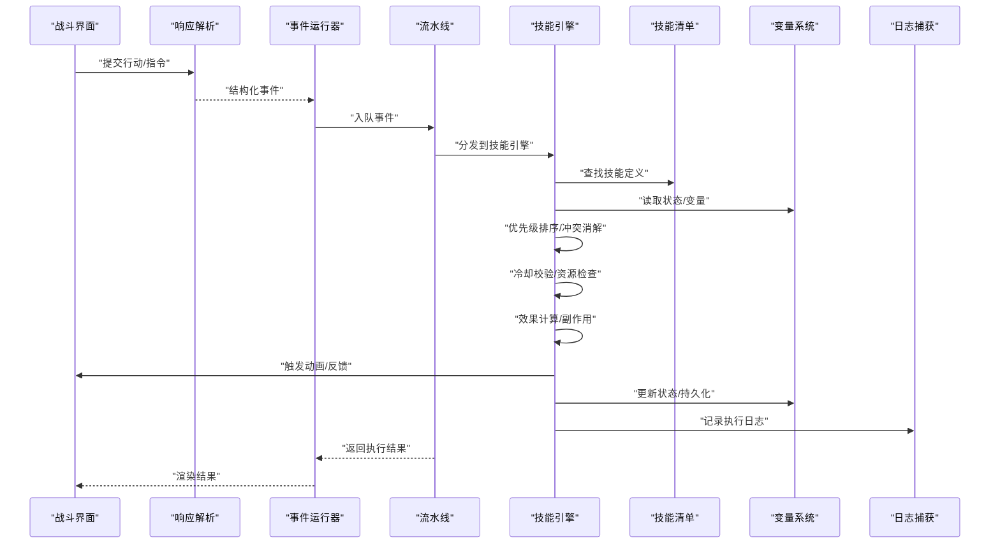

图表来源
- [module/response-parser.js](file://module/response-parser.js)
- [module/event-runner.js](file://module/event-runner.js)
- [module/pipeline.js](file://module/pipeline.js)
- [module/game-skills.js](file://module/game-skills.js)
- [module/skill-list.js](file://module/skill-list.js)
- [module/variable-system.js](file://module/variable-system.js)
- [module/log-capture.js](file://module/log-capture.js)
- [turn-based-battle.html](file://turn-based-battle.html)

## 详细组件分析

### 技能生命周期与阶段
- 触发阶段：监听输入事件，结合上下文（回合、目标、位置、队伍状态）筛选候选技能。
- 验证检查：校验前置条件（等级、解锁、装备、Buff/Debuff）、目标合法性、距离/范围、可见性等。
- 资源扣除：消耗法力、体力、弹药、材料等，失败则回滚并提示。
- 效果计算：命中判定、伤害/治疗/护盾/控制等数值计算，考虑抗性、暴击、连击、环境加成。
- 动画播放：播放施法前摇、命中特效、受击反馈、音效与镜头切换。
- 状态更新：更新角色属性、战场标记、持续效果、回合计数、胜负判定。
- 结果回写：向UI输出结果，写入日志与统计，必要时触发后续事件链。

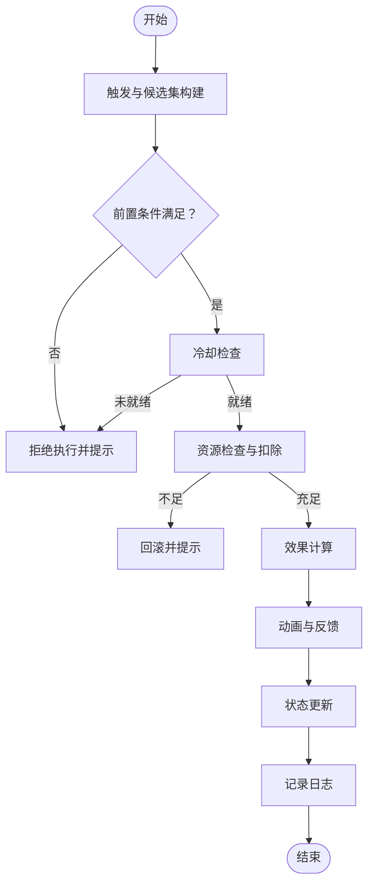

图表来源
- [module/game-skills.js](file://module/game-skills.js)
- [module/skill-list.js](file://module/skill-list.js)
- [module/variable-system.js](file://module/variable-system.js)
- [module/game-helpers.js](file://module/game-helpers.js)
- [module/log-capture.js](file://module/log-capture.js)

章节来源
- [module/game-skills.js](file://module/game-skills.js)
- [module/skill-list.js](file://module/skill-list.js)
- [module/variable-system.js](file://module/variable-system.js)
- [module/game-helpers.js](file://module/game-helpers.js)
- [module/log-capture.js](file://module/log-capture.js)

### 优先级系统与并发处理
- 优先级维度：技能类型（必中/打断/护盾/爆发）、来源（玩家/AI/被动）、时机（先手/后手/反击）、标签权重（控制优先于伤害等）。
- 排序策略：稳定排序+时间戳，确保同优先级下先进先出；支持动态权重调整（Buff/Debuff影响）。
- 冲突解决：
  - 互斥组：同一组内仅允许一个生效，按优先级最高者胜出。
  - 覆盖规则：某些状态可被更高优先级状态覆盖或刷新持续时间。
  - 目标唯一性：对同一目标的控制类效果采用“最强控制”原则。
- 执行顺序控制：通过流水线阶段划分，将高优技能置于更早阶段执行，低优技能延后至结算阶段。

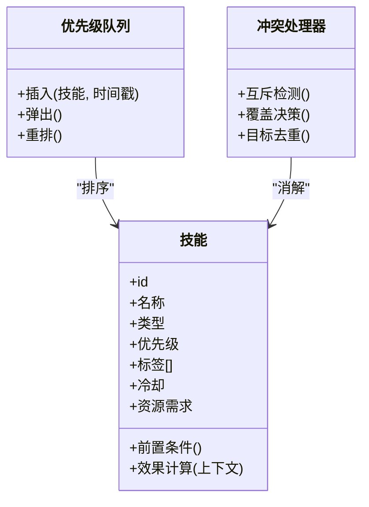

图表来源
- [module/game-skills.js](file://module/game-skills.js)
- [module/skill-list.js](file://module/skill-list.js)
- [module/pipeline.js](file://module/pipeline.js)

章节来源
- [module/game-skills.js](file://module/game-skills.js)
- [module/skill-list.js](file://module/skill-list.js)
- [module/pipeline.js](file://module/pipeline.js)

### 冷却管理机制
- 全局冷却：针对某类技能或全局窗口期，防止高频滥用。
- 个人冷却：每个角色独立计时，支持分段冷却（主技能/分支技能）。
- 条件冷却：基于场景或状态的条件冷却（例如“目标处于隐身时不可用”、“Boss阶段禁用”）。
- 实现要点：
  - 使用变量系统存储冷却时间戳与剩余时长。
  - 在冷却检查阶段统一扣减与判定。
  - 支持冷却缩短/延长（Buff/Debuff）。
  - 冷却失败需明确提示原因（全局/个人/条件）。

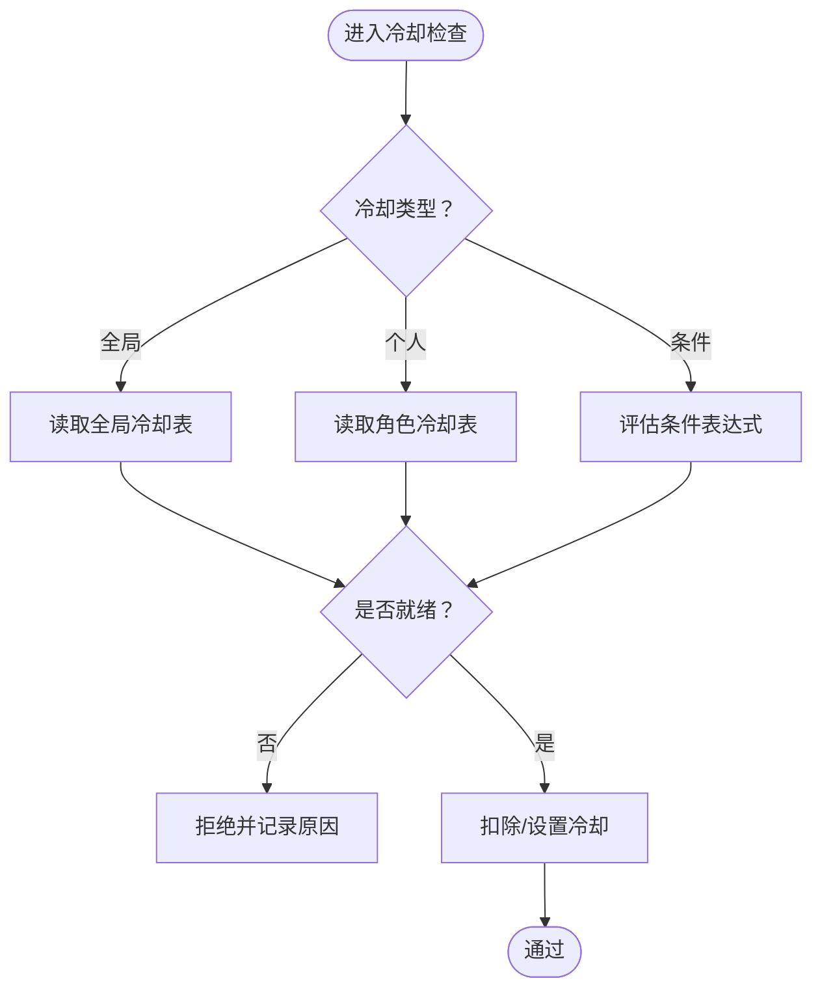

图表来源
- [module/game-skills.js](file://module/game-skills.js)
- [module/variable-system.js](file://module/variable-system.js)
- [module/game-config.js](file://module/game-config.js)

章节来源
- [module/game-skills.js](file://module/game-skills.js)
- [module/variable-system.js](file://module/variable-system.js)
- [module/game-config.js](file://module/game-config.js)

### 资源扣除与回滚
- 资源类型：法力、体力、弹药、材料、特殊点数等。
- 扣除流程：预检→锁定→实际扣除→失败回滚→成功确认。
- 回滚策略：若后续阶段失败（如命中失败、目标无效），应回退已扣除资源与中间状态。
- 日志记录：记录每次扣除与回滚的明细，便于审计与复现。

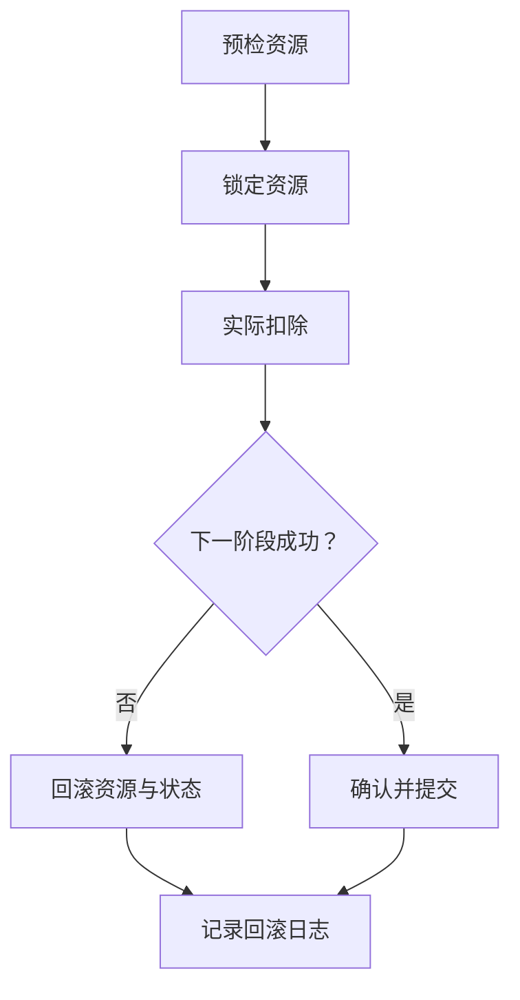

图表来源
- [module/game-skills.js](file://module/game-skills.js)
- [module/log-capture.js](file://module/log-capture.js)

章节来源
- [module/game-skills.js](file://module/game-skills.js)
- [module/log-capture.js](file://module/log-capture.js)

### 效果计算与动画播放
- 效果计算：包含命中概率、伤害/治疗/护盾/控制强度、抗性与修正、连击与连锁反应。
- 动画播放：根据技能类型与命中结果触发不同特效序列，支持异步等待与回调。
- 同步与异步：计算阶段尽量同步以保证一致性，动画阶段异步进行，避免阻塞主循环。

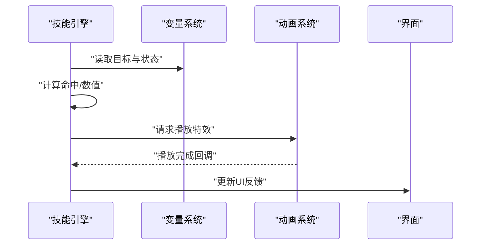

图表来源
- [module/game-skills.js](file://module/game-skills.js)
- [module/variable-system.js](file://module/variable-system.js)
- [turn-based-battle.html](file://turn-based-battle.html)

章节来源
- [module/game-skills.js](file://module/game-skills.js)
- [module/variable-system.js](file://module/variable-system.js)
- [turn-based-battle.html](file://turn-based-battle.html)

### 状态更新与持久化
- 状态更新：角色属性、Buff/Debuff、战场标记、回合计数、胜负标志等。
- 持久化：关键状态变更写入存档或快照，支持回溯与回放。
- 一致性：批量更新时使用事务式提交，失败整体回滚。

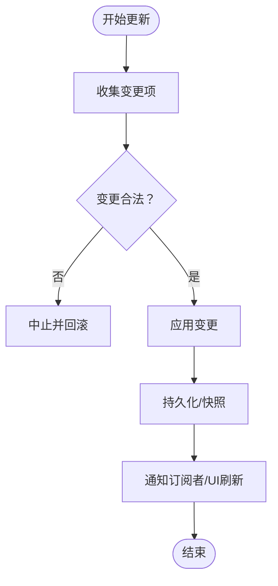

图表来源
- [module/game-skills.js](file://module/game-skills.js)
- [module/variable-system.js](file://module/variable-system.js)

章节来源
- [module/game-skills.js](file://module/game-skills.js)
- [module/variable-system.js](file://module/variable-system.js)

### 事件与流水线编排
- 事件运行器：统一接入输入源，标准化事件格式，分发到流水线。
- 流水线：按阶段组织执行（准备→校验→执行→结算→回放），支持钩子与拦截。
- 可扩展性：新增阶段或插件无需改动核心逻辑。

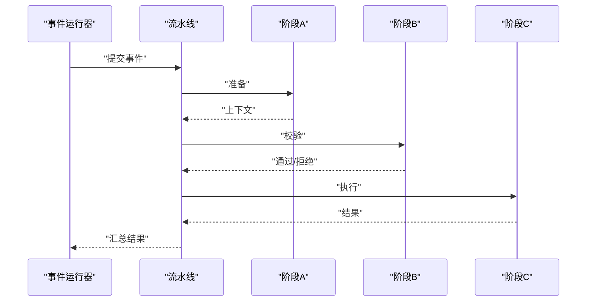

图表来源
- [module/event-runner.js](file://module/event-runner.js)
- [module/pipeline.js](file://module/pipeline.js)

章节来源
- [module/event-runner.js](file://module/event-runner.js)
- [module/pipeline.js](file://module/pipeline.js)

### 外部输入与响应解析
- 输入来源：玩家操作、AI建议、脚本驱动。
- 解析流程：文本/JSON→结构化事件→字段校验→映射到技能ID与参数。
- 容错：非法输入降级为默认行为或拒绝执行，并记录警告日志。

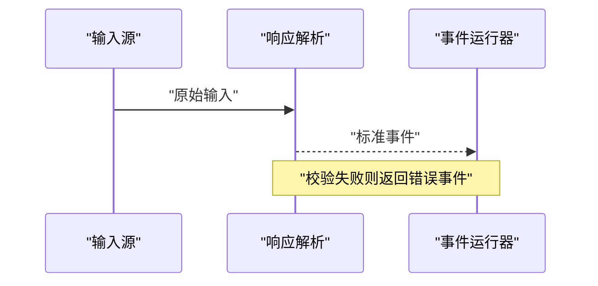

图表来源
- [module/response-parser.js](file://module/response-parser.js)
- [module/event-runner.js](file://module/event-runner.js)

章节来源
- [module/response-parser.js](file://module/response-parser.js)
- [module/event-runner.js](file://module/event-runner.js)

### 模板与配置
- 模板引擎：用于生成描述、提示、日志文案，支持变量替换与格式化。
- 配置中心：集中管理平衡性参数、阈值、开关，便于热更与测试。

章节来源
- [module/template-engine.js](file://module/template-engine.js)
- [module/game-config.js](file://module/game-config.js)

## 依赖关系分析
- 松耦合设计：技能引擎依赖清单与变量系统，不直接耦合UI与动画。
- 单向依赖：事件运行器→流水线→技能引擎→工具/配置/日志。
- 潜在环风险：避免在工具层反向引用引擎，保持调用方向清晰。

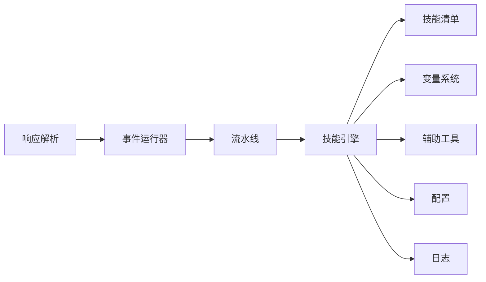

图表来源
- [module/event-runner.js](file://module/event-runner.js)
- [module/pipeline.js](file://module/pipeline.js)
- [module/game-skills.js](file://module/game-skills.js)
- [module/skill-list.js](file://module/skill-list.js)
- [module/variable-system.js](file://module/variable-system.js)
- [module/game-helpers.js](file://module/game-helpers.js)
- [module/game-config.js](file://module/game-config.js)
- [module/log-capture.js](file://module/log-capture.js)
- [module/response-parser.js](file://module/response-parser.js)

章节来源
- [module/event-runner.js](file://module/event-runner.js)
- [module/pipeline.js](file://module/pipeline.js)
- [module/game-skills.js](file://module/game-skills.js)
- [module/skill-list.js](file://module/skill-list.js)
- [module/variable-system.js](file://module/variable-system.js)
- [module/game-helpers.js](file://module/game-helpers.js)
- [module/game-config.js](file://module/game-config.js)
- [module/log-capture.js](file://module/log-capture.js)
- [module/response-parser.js](file://module/response-parser.js)

## 性能考量
- 批量处理：合并多次状态更新，减少UI刷新频率。
- 惰性计算：仅在需要时计算复杂效果，缓存中间结果。
- 异步动画：将动画与音效异步化，避免阻塞主线程。
- 日志分级：生产环境降低日志级别，关键路径保留必要信息。
- 内存管理：及时释放临时对象，避免长生命周期引用导致泄漏。

## 故障排查指南
- 常见问题定位：
  - 技能未触发：检查触发条件、优先级、冷却与资源。
  - 效果异常：核对变量值、计算公式、Buff/Debuff叠加规则。
  - 动画不同步：确认异步回调与阶段边界。
- 日志与追踪：
  - 启用详细日志，记录事件ID、阶段、耗时、关键变量快照。
  - 使用统一日志捕获模块聚合输出，便于检索与分析。
- 性能监控：
  - 统计各阶段耗时，识别瓶颈。
  - 监控内存占用与GC频率，优化对象分配。

章节来源
- [module/log-capture.js](file://module/log-capture.js)
- [module/game-skills.js](file://module/game-skills.js)
- [module/variable-system.js](file://module/variable-system.js)

## 结论
本技术文档梳理了姬侠传技能系统的完整执行流程与关键机制，涵盖生命周期、优先级与冲突、冷却管理、资源与状态更新、以及调试与性能监控方法。通过模块化设计与清晰的阶段编排，系统在可扩展性与可维护性方面具备良好基础，建议在后续迭代中持续完善日志粒度与性能指标采集，以提升问题定位效率与用户体验。

## 附录
- 术语表：
  - 技能：具有触发条件、资源消耗与效果计算的战术单元。
  - 冷却：限制技能重复使用的计时机制。
  - 流水线：按阶段编排执行的可扩展管道。
- 参考文件：
  - 技能清单与定义：[module/skill-list.js](file://module/skill-list.js)、[module/game-skills.js](file://module/game-skills.js)
  - 事件与流水线：[module/event-runner.js](file://module/event-runner.js)、[module/pipeline.js](file://module/pipeline.js)
  - 变量与配置：[module/variable-system.js](file://module/variable-system.js)、[module/game-config.js](file://module/game-config.js)
  - 辅助与模板：[module/game-helpers.js](file://module/game-helpers.js)、[module/template-engine.js](file://module/template-engine.js)
  - 日志与解析：[module/log-capture.js](file://module/log-capture.js)、[module/response-parser.js](file://module/response-parser.js)
  - 战斗界面：[turn-based-battle.html](file://turn-based-battle.html)