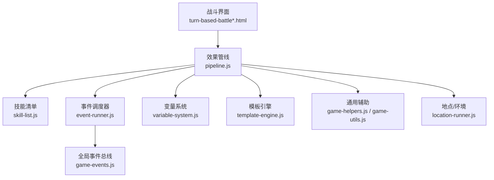
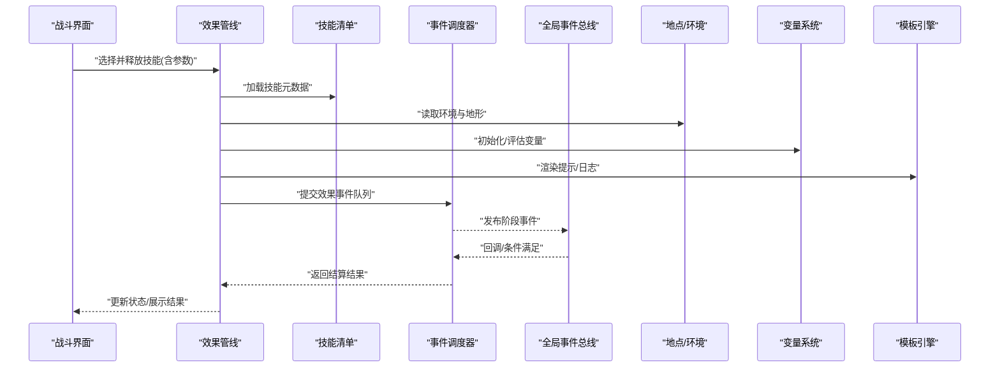
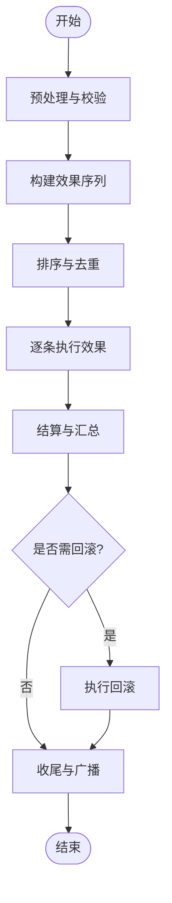
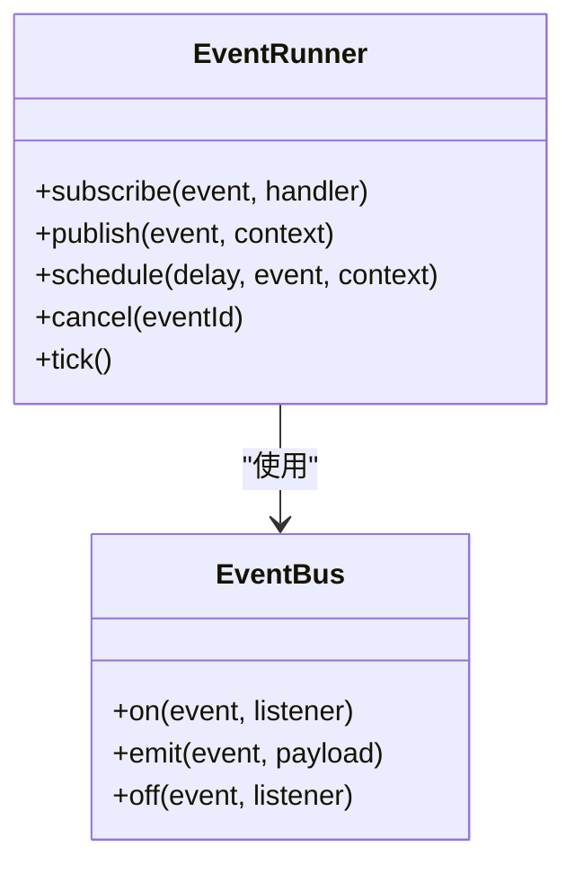
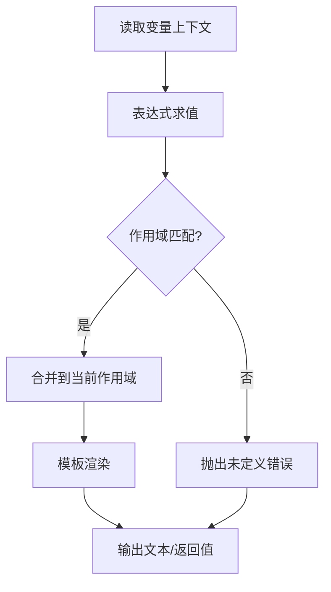
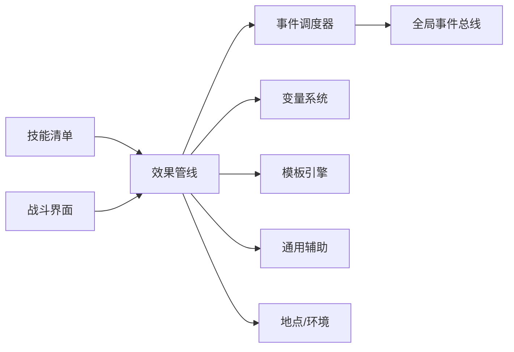

# 技能效果系统

<cite>
**本文引用的文件**   
- [module/game-skills.js](file://module/game-skills.js)
- [module/skill-list.js](file://module/skill-list.js)
- [module/pipeline.js](file://module/pipeline.js)
- [module/event-runner.js](file://module/event-runner.js)
- [module/variable-system.js](file://module/variable-system.js)
- [module/template-engine.js](file://module/template-engine.js)
- [module/game-helpers.js](file://module/game-helpers.js)
- [module/game-utils.js](file://module/game-utils.js)
- [module/game-events.js](file://module/game-events.js)
- [module/location-runner.js](file://module/location-runner.js)
- [turn-based-battle-new.html](file://turn-based-battle-new.html)
- [turn-based-battle.html](file://turn-based-battle.html)
- [开发文档/技能系统相关脚本/技能测试批次预设脚本.js](file://开发文档/技能系统相关脚本/技能测试批次预设脚本.js)
- [开发文档/技能系统相关脚本/技能系统测试辅助脚本.js](file://开发文档/技能系统相关脚本/技能系统测试辅助脚本.js)
</cite>

## 目录
1. [简介](#简介)
2. [项目结构](#项目结构)
3. [核心组件](#核心组件)
4. [架构总览](#架构总览)
5. [详细组件分析](#详细组件分析)
6. [依赖关系分析](#依赖关系分析)
7. [性能考量](#性能考量)
8. [故障排查指南](#故障排查指南)
9. [结论](#结论)
10. [附录](#附录)

## 简介
本文件系统化梳理“姬侠传”技能效果系统的实现原理与运行机制，覆盖伤害计算、属性修改、状态施加、Buff/Debuff管理、治疗效果等核心机制；深入阐述效果叠加规则（同名处理、强度叠加算法、持续时间管理、优先级判定）；说明技能与环境和其他技能的交互（地形影响、天气效果、连锁反应）；并提供自定义效果的开发指南（效果脚本编写、参数配置、测试方法）。

## 项目结构
技能效果系统主要位于前端模块中，围绕“技能定义—效果管线—事件驱动—变量与模板—战斗界面”的链路组织。关键文件职责如下：
- 技能清单与数据：skill-list.js
- 技能执行管线：pipeline.js
- 事件调度器：event-runner.js
- 变量系统：variable-system.js
- 模板引擎：template-engine.js
- 通用工具与辅助：game-helpers.js、game-utils.js
- 全局事件总线：game-events.js
- 地点/环境运行器：location-runner.js
- 战斗页面入口：turn-based-battle-new.html、turn-based-battle.html
- 测试与模拟：开发文档/技能系统相关脚本/*

图表来源
- [module/pipeline.js](file://module/pipeline.js)
- [module/skill-list.js](file://module/skill-list.js)
- [module/event-runner.js](file://module/event-runner.js)
- [module/variable-system.js](file://module/variable-system.js)
- [module/template-engine.js](file://module/template-engine.js)
- [module/game-helpers.js](file://module/game-helpers.js)
- [module/game-utils.js](file://module/game-utils.js)
- [module/game-events.js](file://module/game-events.js)
- [module/location-runner.js](file://module/location-runner.js)
- [turn-based-battle-new.html](file://turn-based-battle-new.html)
- [turn-based-battle.html](file://turn-based-battle.html)

章节来源
- [module/skill-list.js](file://module/skill-list.js)
- [module/pipeline.js](file://module/pipeline.js)
- [module/event-runner.js](file://module/event-runner.js)
- [module/variable-system.js](file://module/variable-system.js)
- [module/template-engine.js](file://module/template-engine.js)
- [module/game-helpers.js](file://module/game-helpers.js)
- [module/game-utils.js](file://module/game-utils.js)
- [module/game-events.js](file://module/game-events.js)
- [module/location-runner.js](file://module/location-runner.js)
- [turn-based-battle-new.html](file://turn-based-battle-new.html)
- [turn-based-battle.html](file://turn-based-battle.html)

## 核心组件
- 技能清单与元数据：集中维护技能ID、名称、描述、基础数值、标签、前置条件、目标类型、范围、冷却、消耗等。
- 效果管线：将“技能→效果序列→结算阶段”串联起来，负责解析、排序、派发、回滚与日志记录。
- 事件调度器：以事件为中心驱动效果执行，支持订阅/发布、延迟触发、条件触发、循环与终止。
- 变量系统：提供运行时变量读写、表达式求值、作用域隔离与快照能力。
- 模板引擎：用于文本渲染、提示构建、日志输出与调试信息格式化。
- 通用辅助：封装常用数学运算、随机、边界检查、对象合并、深拷贝等。
- 全局事件总线：跨模块广播/监听事件，解耦各子系统。
- 地点/环境：提供地形、天气、区域增益/减益等环境上下文。
- 战斗界面：用户交互入口，发起技能选择与确认，展示结果与反馈。

章节来源
- [module/skill-list.js](file://module/skill-list.js)
- [module/pipeline.js](file://module/pipeline.js)
- [module/event-runner.js](file://module/event-runner.js)
- [module/variable-system.js](file://module/variable-system.js)
- [module/template-engine.js](file://module/template-engine.js)
- [module/game-helpers.js](file://module/game-helpers.js)
- [module/game-utils.js](file://module/game-utils.js)
- [module/game-events.js](file://module/game-events.js)
- [module/location-runner.js](file://module/location-runner.js)
- [turn-based-battle-new.html](file://turn-based-battle-new.html)
- [turn-based-battle.html](file://turn-based-battle.html)

## 架构总览
整体采用“数据驱动 + 事件驱动 + 管线编排”的架构。技能数据声明式配置，管线按阶段顺序执行，事件驱动复杂逻辑与副作用，变量与模板贯穿全链路。

图表来源
- [module/pipeline.js](file://module/pipeline.js)
- [module/skill-list.js](file://module/skill-list.js)
- [module/event-runner.js](file://module/event-runner.js)
- [module/game-events.js](file://module/game-events.js)
- [module/location-runner.js](file://module/location-runner.js)
- [module/variable-system.js](file://module/variable-system.js)
- [module/template-engine.js](file://module/template-engine.js)
- [turn-based-battle-new.html](file://turn-based-battle-new.html)

## 详细组件分析

### 技能清单与元数据模型
- 设计要点
  - 每个技能包含唯一标识、名称、描述、标签、目标类型、范围、冷却、消耗、前置条件、效果列表等。
  - 效果列表为有序数组，每项指定效果类型、目标、参数、权重/优先级、条件、持续时长、叠加策略等。
- 典型字段语义
  - 效果类型：伤害、治疗、护盾、属性修改、状态施加、Buff/Debuff、位移、召唤、环境交互等。
  - 目标：单体、群体、自身、随机、扇形、直线、环形、区域等。
  - 参数：基础值、成长系数、随机区间、阈值、比例、上限/下限、衰减曲线等。
  - 条件：命中判定、抗性/免疫、距离/朝向、回合阶段、资源是否足够等。
  - 叠加：替换、累加、取最大、分段叠加、互斥、层数限制等。
  - 持续：回合制或时间制，刷新策略，到期清理。
- 扩展方式
  - 新增效果类型时，在清单中注册新条目，并在管线中注册对应处理器。
  - 通过标签与条件组合实现复杂行为，避免硬编码分支。

章节来源
- [module/skill-list.js](file://module/skill-list.js)

### 效果管线（Pipeline）
- 职责
  - 解析技能与参数，构建可执行的效果序列。
  - 按阶段排序与派发，处理回滚与补偿。
  - 统一日志与调试输出。
- 关键流程
  - 预处理：校验前置条件、资源消耗、目标合法性。
  - 构建阶段：生成效果项，注入变量与模板上下文。
  - 排序阶段：依据优先级、权重、目标类型、阶段进行稳定排序。
  - 执行阶段：逐个执行效果，收集中间结果与副作用。
  - 结算阶段：汇总伤害/治疗/护盾、应用属性修正、施加状态/Buff/Debuff。
  - 收尾阶段：更新UI、广播事件、记录日志、清理临时状态。
- 错误与回滚
  - 对副作用较大的效果采用“先计算后应用”的策略，失败时回滚已变更的状态。
  - 提供最小化回滚单元，保证一致性。

图表来源
- [module/pipeline.js](file://module/pipeline.js)
- [module/game-helpers.js](file://module/game-helpers.js)
- [module/game-utils.js](file://module/game-utils.js)

章节来源
- [module/pipeline.js](file://module/pipeline.js)
- [module/game-helpers.js](file://module/game-helpers.js)
- [module/game-utils.js](file://module/game-utils.js)

### 事件调度器（Event Runner）
- 设计要点
  - 基于订阅/发布模式，支持一次性与周期性事件。
  - 事件携带上下文（源、目标、阶段、变量快照），便于条件判断与联动。
- 常见事件
  - 阶段事件：准备、施放、命中、伤害结算、治疗结算、状态更新、回合结束等。
  - 外部事件：环境变化、地点切换、天气生效、连锁触发等。
- 执行模型
  - 事件入队 → 条件过滤 → 异步/同步执行 → 结果上报 → 后续事件派生。

图表来源
- [module/event-runner.js](file://module/event-runner.js)
- [module/game-events.js](file://module/game-events.js)

章节来源
- [module/event-runner.js](file://module/event-runner.js)
- [module/game-events.js](file://module/game-events.js)

### 变量系统与模板引擎
- 变量系统
  - 提供命名空间与作用域，支持表达式求值、函数调用、条件分支。
  - 支持快照与对比，便于调试与回放。
- 模板引擎
  - 将变量与静态文案组合成可读的提示、日志与UI文本。
  - 支持占位符、条件渲染、迭代与格式化。

图表来源
- [module/variable-system.js](file://module/variable-system.js)
- [module/template-engine.js](file://module/template-engine.js)

章节来源
- [module/variable-system.js](file://module/variable-system.js)
- [module/template-engine.js](file://module/template-engine.js)

### 通用辅助与工具
- 数学与概率：四则运算、加权随机、分布采样、截断与舍入。
- 数据结构：对象合并、深拷贝、集合操作、栈/队列。
- 输入校验：类型检查、范围校验、必填字段验证。
- 日志与调试：结构化日志、分级输出、快照导出。

章节来源
- [module/game-helpers.js](file://module/game-helpers.js)
- [module/game-utils.js](file://module/game-utils.js)

### 地点与环境
- 地点/地形
  - 提供区域加成/减益、移动惩罚、视野/射程修正、特殊交互（陷阱、机关）。
- 天气
  - 全局被动效果（如雨天降低远程命中、晴天提升火系伤害）、周期性刷新。
- 交互点
  - 技能可查询环境状态，动态调整参数或附加额外效果。

章节来源
- [module/location-runner.js](file://module/location-runner.js)

### 战斗界面与交互
- 用户操作：选择技能、确认目标、查看提示与预览。
- 反馈展示：伤害数字、治疗量、护盾、状态图标、回合进度。
- 错误提示：前置不满足、资源不足、目标非法时的友好提示。

章节来源
- [turn-based-battle-new.html](file://turn-based-battle-new.html)
- [turn-based-battle.html](file://turn-based-battle.html)

## 依赖关系分析
- 低耦合高内聚
  - 管线仅依赖清单、事件、变量、模板与工具，不直接耦合具体业务细节。
  - 事件总线作为横切关注点，解耦各子系统。
- 可能的环依赖
  - 若事件回调反向调用管线，需注意避免递归与死锁，建议单向数据流。
- 外部集成点
  - 地点/环境、UI、存储与网络（如有）均通过接口抽象接入。

图表来源
- [module/skill-list.js](file://module/skill-list.js)
- [module/pipeline.js](file://module/pipeline.js)
- [module/event-runner.js](file://module/event-runner.js)
- [module/game-events.js](file://module/game-events.js)
- [module/variable-system.js](file://module/variable-system.js)
- [module/template-engine.js](file://module/template-engine.js)
- [module/game-helpers.js](file://module/game-helpers.js)
- [module/game-utils.js](file://module/game-utils.js)
- [module/location-runner.js](file://module/location-runner.js)
- [turn-based-battle-new.html](file://turn-based-battle-new.html)

章节来源
- [module/skill-list.js](file://module/skill-list.js)
- [module/pipeline.js](file://module/pipeline.js)
- [module/event-runner.js](file://module/event-runner.js)
- [module/game-events.js](file://module/game-events.js)
- [module/variable-system.js](file://module/variable-system.js)
- [module/template-engine.js](file://module/template-engine.js)
- [module/game-helpers.js](file://module/game-helpers.js)
- [module/game-utils.js](file://module/game-utils.js)
- [module/location-runner.js](file://module/location-runner.js)
- [turn-based-battle-new.html](file://turn-based-battle-new.html)

## 性能考量
- 批量处理
  - 对群体目标采用批处理与向量化计算，减少重复开销。
- 缓存与复用
  - 对频繁计算的表达式与模板结果进行缓存，注意失效策略。
- 事件节流
  - 高频事件合并与节流，避免主线程阻塞。
- 内存管理
  - 及时释放临时对象，避免长生命周期引用导致泄漏。
- 日志级别
  - 生产环境降低日志粒度，仅在异常或关键路径输出。

[本节为通用指导，无需代码来源]

## 故障排查指南
- 常见问题定位
  - 技能未生效：检查前置条件、资源消耗、目标合法性、冷却与阶段。
  - 数值异常：核对变量取值、表达式求值、随机种子、上限/下限。
  - 状态未叠加：确认叠加策略、互斥规则、层数上限与刷新时机。
  - 环境无影响：确认地点/天气状态、技能是否读取环境上下文。
- 调试手段
  - 启用详细日志，观察管线阶段与事件流转。
  - 导出变量快照与事件时序，复现问题。
  - 使用测试脚本构造边界用例，逐步缩小范围。

章节来源
- [module/pipeline.js](file://module/pipeline.js)
- [module/event-runner.js](file://module/event-runner.js)
- [module/variable-system.js](file://module/variable-system.js)
- [module/template-engine.js](file://module/template-engine.js)
- [module/game-helpers.js](file://module/game-helpers.js)
- [module/game-utils.js](file://module/game-utils.js)
- [module/game-events.js](file://module/game-events.js)
- [module/location-runner.js](file://module/location-runner.js)

## 结论
本系统以“清单驱动 + 管线编排 + 事件驱动”为核心，实现了可扩展、可观测、可回滚的技能效果体系。通过变量与模板贯穿全链路，结合地点/环境的上下文，能够灵活表达复杂的战斗机制。配合完善的测试与调试工具，开发者可以快速迭代与验证自定义效果。

[本节为总结性内容，无需代码来源]

## 附录

### 自定义效果开发指南
- 步骤概览
  - 在技能清单中注册新效果类型与默认参数。
  - 在管线中注册该效果的处理器，明确其阶段、排序与副作用。
  - 如需条件与联动，通过事件订阅与变量表达式实现。
  - 使用模板引擎渲染提示与日志，便于调试。
- 参数配置建议
  - 所有数值型参数提供默认值与范围约束。
  - 使用变量与表达式替代硬编码，提高可配置性。
  - 对随机与概率类效果提供种子与统计开关。
- 测试方法
  - 使用测试脚本构造典型与边界用例，覆盖成功、失败与异常路径。
  - 利用日志与快照对比预期与实际差异。
  - 针对叠加与持续时间场景，设计多轮次与并发事件用例。

章节来源
- [module/skill-list.js](file://module/skill-list.js)
- [module/pipeline.js](file://module/pipeline.js)
- [module/event-runner.js](file://module/event-runner.js)
- [module/variable-system.js](file://module/variable-system.js)
- [module/template-engine.js](file://module/template-engine.js)
- [开发文档/技能系统相关脚本/技能测试批次预设脚本.js](file://开发文档/技能系统相关脚本/技能测试批次预设脚本.js)
- [开发文档/技能系统相关脚本/技能系统测试辅助脚本.js](file://开发文档/技能系统相关脚本/技能系统测试辅助脚本.js)

### 效果叠加规则与优先级
- 同名效果处理
  - 替换：新效果覆盖旧效果（常用于同类型Buff）。
  - 累加：数值相加（常用于百分比加成）。
  - 取最大：保留更高强度（常用于冲突效果）。
  - 互斥：同类效果不可共存，后发覆盖先发。
- 强度叠加算法
  - 线性叠加：直接相加。
  - 乘法叠加：按比例复合，注意顺序与归一化。
  - 分段叠加：不同区间采用不同公式。
- 持续时间管理
  - 回合制：每回合末递减，刷新策略支持延长或重置。
  - 时间制：基于帧或毫秒计时，支持暂停与加速。
- 优先级判定
  - 阶段优先：准备 > 施放 > 命中 > 结算 > 收尾。
  - 权重优先：同阶段内按权重降序执行。
  - 稳定性：相同权重保持插入顺序。

章节来源
- [module/pipeline.js](file://module/pipeline.js)
- [module/event-runner.js](file://module/event-runner.js)
- [module/variable-system.js](file://module/variable-system.js)

### 技能与环境/其他技能的交互
- 地形影响
  - 根据所在格子/区域读取加成/减益，动态调整命中率、伤害、移速等。
- 天气效果
  - 全局被动生效，技能可检测天气并附加额外效果或改变数值。
- 连锁反应
  - 通过事件触发后续效果，如点燃引燃、冰冻碎裂、中毒扩散等。
  - 控制链路与终止条件，防止无限循环。

章节来源
- [module/location-runner.js](file://module/location-runner.js)
- [module/event-runner.js](file://module/event-runner.js)
- [module/game-events.js](file://module/game-events.js)

### 核心机制速查
- 伤害计算
  - 基础值 × 成长系数 × 环境修正 × 抗性/减免 − 护盾吸收，最终截断至非负。
- 属性修改
  - 支持瞬时与持续两类，持续类纳入Buff/Debuff管理。
- 状态施加
  - 状态类型、层数、持续时间、刷新策略、互斥规则。
- Buff/Debuff管理
  - 统一的生命周期管理，支持排序、筛选、到期清理与快照。
- 治疗效果
  - 与伤害类似，但受护盾、过量治疗、上限限制与目标状态影响。

章节来源
- [module/pipeline.js](file://module/pipeline.js)
- [module/event-runner.js](file://module/event-runner.js)
- [module/variable-system.js](file://module/variable-system.js)
- [module/game-helpers.js](file://module/game-helpers.js)
- [module/game-utils.js](file://module/game-utils.js)