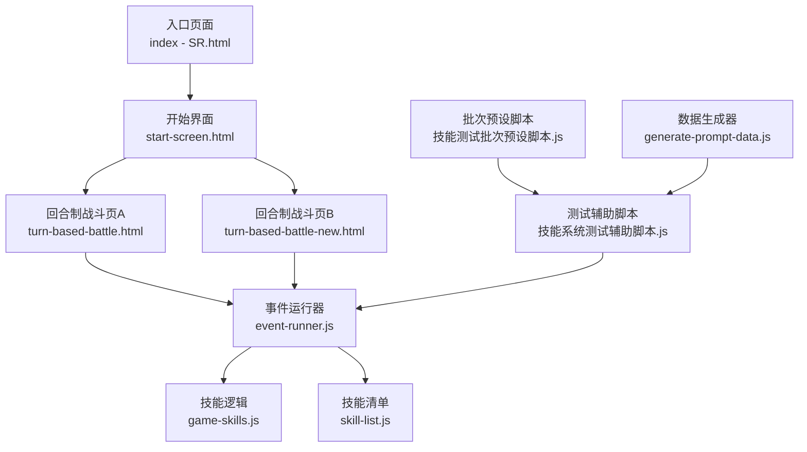
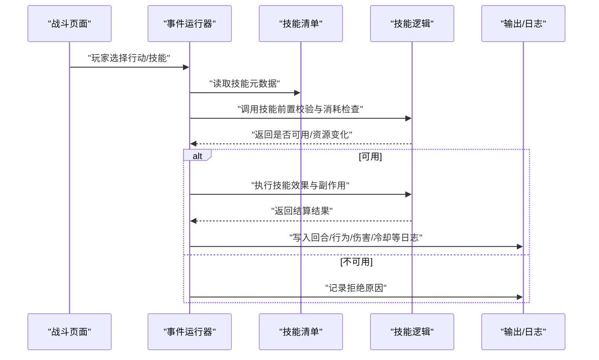
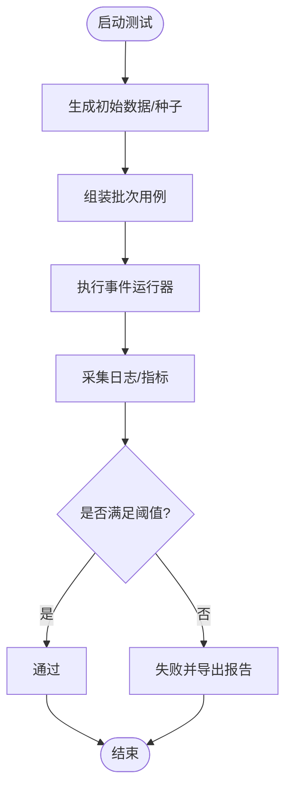
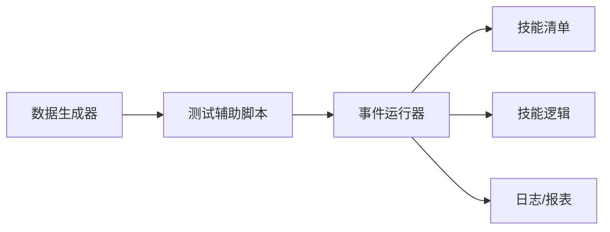

# 技能测试与调试

<cite>
**本文引用的文件**   
- [game-skills.js](file://module/game-skills.js)
- [skill-list.js](file://module/skill-list.js)
- [event-runner.js](file://module/event-runner.js)
- [turn-based-battle-new.html](file://turn-based-battle-new.html)
- [turn-based-battle.html](file://turn-based-battle.html)
- [index - SR.html](file://index - SR.html)
- [start-screen.html](file://start-screen.html)
- [tools/generate-prompt-data.js](file://tools/generate-prompt-data.js)
- [开发文档/技能系统相关脚本/技能系统测试辅助脚本.js](file://开发文档/技能系统相关脚本/技能系统测试辅助脚本.js)
- [开发文档/技能系统相关脚本/技能测试批次预设脚本.js](file://开发文档/技能系统相关脚本/技能测试批次预设脚本.js)
- [开发文档/技能系统相关脚本/技能系统手工测试checklist.md](file://开发文档/技能系统相关脚本/技能系统手工测试checklist.md)
- [开发文档/技能系统相关脚本/simulation-output/battle-sim-report.json](file://开发文档/技能系统相关脚本/simulation-output/battle-sim-report.json)
- [开发文档/技能系统相关脚本/simulation-output/skill-profit-report.csv](file://开发文档/技能系统相关脚本/simulation-output/skill-profit-report.csv)
- [开发文档/技能系统相关脚本/simulation-output/skill-profit-report.json](file://开发文档/技能系统相关脚本/simulation-output/skill-profit-report.json)
</cite>

## 目录
1. [简介](#简介)
2. [项目结构](#项目结构)
3. [核心组件](#核心组件)
4. [架构总览](#架构总览)
5. [详细组件分析](#详细组件分析)
6. [依赖关系分析](#依赖关系分析)
7. [性能考量](#性能考量)
8. [故障排查指南](#故障排查指南)
9. [结论](#结论)
10. [附录](#附录)

## 简介
本指南面向“姬侠传”项目的技能系统与战斗模块，提供从单元测试、集成测试到性能与平衡性验证的完整测试与调试方法。内容涵盖：
- 测试分层策略与执行方式（单元、集成、性能）
- 自动化测试工具与模拟战斗环境的使用技巧
- 数据生成器与批量批次的组织方法
- 技能平衡性评估的关键指标与流程
- 常见问题定位与修复建议

## 项目结构
围绕技能测试与调试，仓库中与技能相关的核心位置如下：
- 前端战斗页面与入口：用于集成测试与可视化验证
- 技能逻辑与列表：承载技能定义、触发与结算
- 事件运行器：驱动回合制流程与事件编排
- 开发文档中的测试辅助脚本与模拟输出：用于自动化与回归

图表来源
- [index - SR.html](file://index - SR.html)
- [start-screen.html](file://start-screen.html)
- [turn-based-battle.html](file://turn-based-battle.html)
- [turn-based-battle-new.html](file://turn-based-battle-new.html)
- [event-runner.js](file://module/event-runner.js)
- [game-skills.js](file://module/game-skills.js)
- [skill-list.js](file://module/skill-list.js)
- [开发文档/技能系统相关脚本/技能系统测试辅助脚本.js](file://开发文档/技能系统相关脚本/技能系统测试辅助脚本.js)
- [开发文档/技能系统相关脚本/技能测试批次预设脚本.js](file://开发文档/技能系统相关脚本/技能测试批次预设脚本.js)
- [tools/generate-prompt-data.js](file://tools/generate-prompt-data.js)

章节来源
- [index - SR.html](file://index - SR.html)
- [start-screen.html](file://start-screen.html)
- [turn-based-battle.html](file://turn-based-battle.html)
- [turn-based-battle-new.html](file://turn-based-battle-new.html)
- [event-runner.js](file://module/event-runner.js)
- [game-skills.js](file://module/game-skills.js)
- [skill-list.js](file://module/skill-list.js)
- [开发文档/技能系统相关脚本/技能系统测试辅助脚本.js](file://开发文档/技能系统相关脚本/技能系统测试辅助脚本.js)
- [开发文档/技能系统相关脚本/技能测试批次预设脚本.js](file://开发文档/技能系统相关脚本/技能测试批次预设脚本.js)
- [tools/generate-prompt-data.js](file://tools/generate-prompt-data.js)

## 核心组件
- 技能逻辑层（game-skills.js）
  - 负责技能的判定、消耗、效果计算与副作用处理
  - 与事件运行器协作，在合适的时机被调用
- 技能清单（skill-list.js）
  - 集中维护技能元数据、标签、关联规则等
  - 为测试提供稳定的输入源
- 事件运行器（event-runner.js）
  - 驱动回合、行动选择、状态流转与日志记录
  - 作为集成测试的编排中枢
- 战斗页面（turn-based-battle*.html）
  - 提供可视化交互与手动验证入口
  - 便于快速复现问题与观察结果
- 测试辅助脚本与批次预设
  - 自动化构造场景、批量执行用例、汇总报告
- 数据生成器（generate-prompt-data.js）
  - 生成可重复的初始状态与随机种子，支撑回归与压力测试

章节来源
- [game-skills.js](file://module/game-skills.js)
- [skill-list.js](file://module/skill-list.js)
- [event-runner.js](file://module/event-runner.js)
- [turn-based-battle.html](file://turn-based-battle.html)
- [turn-based-battle-new.html](file://turn-based-battle-new.html)
- [开发文档/技能系统相关脚本/技能系统测试辅助脚本.js](file://开发文档/技能系统相关脚本/技能系统测试辅助脚本.js)
- [开发文档/技能系统相关脚本/技能测试批次预设脚本.js](file://开发文档/技能系统相关脚本/技能测试批次预设脚本.js)
- [tools/generate-prompt-data.js](file://tools/generate-prompt-data.js)

## 架构总览
以下序列图展示一次典型技能释放与结算的端到端流程，适用于集成测试与回归验证。

图表来源
- [turn-based-battle.html](file://turn-based-battle.html)
- [turn-based-battle-new.html](file://turn-based-battle-new.html)
- [event-runner.js](file://module/event-runner.js)
- [skill-list.js](file://module/skill-list.js)
- [game-skills.js](file://module/game-skills.js)

## 详细组件分析

### 技能逻辑与清单（单元级）
- 目标
  - 验证单个技能的判定条件、资源消耗、伤害/增益公式、冷却与持续时间
- 方法
  - 使用测试辅助脚本构造最小化输入（角色属性、敌方状态、场地效果），直接调用技能逻辑并断言输出
  - 对边界值进行覆盖（零资源、满冷却、极限数值）
- 关键断言点
  - 资源扣减正确且不会为负
  - 冷却时间更新符合预期
  - 伤害/护盾/治疗等数值落在合理区间
  - 副作用（如标记、易伤、护甲穿透）生效顺序正确

章节来源
- [game-skills.js](file://module/game-skills.js)
- [skill-list.js](file://module/skill-list.js)
- [开发文档/技能系统相关脚本/技能系统测试辅助脚本.js](file://开发文档/技能系统相关脚本/技能系统测试辅助脚本.js)

### 事件运行器与战斗页面（集成级）
- 目标
  - 验证多技能组合、回合推进、状态同步与UI一致性
- 方法
  - 通过战斗页面或测试脚本驱动事件运行器，回放标准流程与异常分支
  - 对比日志与期望路径，确保无死循环、无状态不一致
- 关注点
  - 并发/异步渲染导致的时序差异
  - 多次释放同一技能的叠加与互斥
  - 中断、取消、切换目标时的回滚与清理

章节来源
- [event-runner.js](file://module/event-runner.js)
- [turn-based-battle.html](file://turn-based-battle.html)
- [turn-based-battle-new.html](file://turn-based-battle-new.html)
- [开发文档/技能系统相关脚本/技能系统测试辅助脚本.js](file://开发文档/技能系统相关脚本/技能系统测试辅助脚本.js)

### 自动化测试与数据生成（工程化）
- 测试辅助脚本
  - 提供批量用例组织、参数化输入、结果收集与简单断言
- 批次预设脚本
  - 将常用场景固化为“批次”，支持一键回归
- 数据生成器
  - 生成稳定种子下的随机配置，保证可重复性与覆盖面

图表来源
- [开发文档/技能系统相关脚本/技能系统测试辅助脚本.js](file://开发文档/技能系统相关脚本/技能系统测试辅助脚本.js)
- [开发文档/技能系统相关脚本/技能测试批次预设脚本.js](file://开发文档/技能系统相关脚本/技能测试批次预设脚本.js)
- [tools/generate-prompt-data.js](file://tools/generate-prompt-data.js)
- [event-runner.js](file://module/event-runner.js)

章节来源
- [开发文档/技能系统相关脚本/技能系统测试辅助脚本.js](file://开发文档/技能系统相关脚本/技能系统测试辅助脚本.js)
- [开发文档/技能系统相关脚本/技能测试批次预设脚本.js](file://开发文档/技能系统相关脚本/技能测试批次预设脚本.js)
- [tools/generate-prompt-data.js](file://tools/generate-prompt-data.js)

### 模拟输出与平衡性报告
- 模拟报告
  - 包含总体统计、关键回合摘要、行为矩阵等，用于定位极端情况与不平衡点
- 收益报表
  - 按技能维度聚合收益/成本，识别超模或弱势技能

章节来源
- [开发文档/技能系统相关脚本/simulation-output/battle-sim-report.json](file://开发文档/技能系统相关脚本/simulation-output/battle-sim-report.json)
- [开发文档/技能系统相关脚本/simulation-output/skill-profit-report.csv](file://开发文档/技能系统相关脚本/simulation-output/skill-profit-report.csv)
- [开发文档/技能系统相关脚本/simulation-output/skill-profit-report.json](file://开发文档/技能系统相关脚本/simulation-output/skill-profit-report.json)

## 依赖关系分析
- 低耦合设计
  - 事件运行器仅依赖技能清单与技能逻辑接口，便于替换实现与注入测试桩
- 数据流向
  - 数据生成器 → 测试辅助脚本 → 事件运行器 → 技能逻辑 → 日志/报表
- 潜在风险
  - 若技能清单与逻辑约定不一致，会导致集成阶段出现大量误报
  - 随机种子未固定时，回归稳定性下降

图表来源
- [tools/generate-prompt-data.js](file://tools/generate-prompt-data.js)
- [开发文档/技能系统相关脚本/技能系统测试辅助脚本.js](file://开发文档/技能系统相关脚本/技能系统测试辅助脚本.js)
- [event-runner.js](file://module/event-runner.js)
- [skill-list.js](file://module/skill-list.js)
- [game-skills.js](file://module/game-skills.js)

章节来源
- [tools/generate-prompt-data.js](file://tools/generate-prompt-data.js)
- [开发文档/技能系统相关脚本/技能系统测试辅助脚本.js](file://开发文档/技能系统相关脚本/技能系统测试辅助脚本.js)
- [event-runner.js](file://module/event-runner.js)
- [skill-list.js](file://module/skill-list.js)
- [game-skills.js](file://module/game-skills.js)

## 性能考量
- 基准与压测
  - 使用批次脚本在固定种子下连续执行N轮，统计平均耗时、峰值内存与卡顿帧率
- 热点定位
  - 聚焦高频释放技能与复杂复合效果的链路，结合日志采样定位慢点
- 优化建议
  - 减少不必要的对象创建与深拷贝
  - 缓存只读的技能元数据与常量表
  - 将重计算延迟到必要时刻，避免每回合全量刷新

[本节为通用指导，不直接分析具体文件]

## 故障排查指南
- 症状：技能不生效
  - 核查前置条件与资源消耗是否满足
  - 确认事件运行器是否正确调度该技能
  - 检查技能清单中是否存在缺失或冲突标签
- 症状：效果异常（数值错误/副作用未触发）
  - 核对伤害/增益公式与修正项的顺序
  - 验证冷却与持续时间的更新时机
  - 使用最小用例复现，逐步缩小范围
- 症状：性能问题（卡顿/掉帧）
  - 定位长耗时函数与频繁GC点
  - 降低每回合计算复杂度，拆分大任务
- 症状：回归不稳定
  - 固定随机种子与初始状态
  - 统一日志格式，增加关键断言

章节来源
- [game-skills.js](file://module/game-skills.js)
- [skill-list.js](file://module/skill-list.js)
- [event-runner.js](file://module/event-runner.js)
- [turn-based-battle.html](file://turn-based-battle.html)
- [turn-based-battle-new.html](file://turn-based-battle-new.html)
- [开发文档/技能系统相关脚本/技能系统手工测试checklist.md](file://开发文档/技能系统相关脚本/技能系统手工测试checklist.md)

## 结论
通过分层测试（单元/集成/性能）、自动化脚本与模拟输出的配合，可以高效保障“姬侠传”技能系统的正确性、稳定性与平衡性。建议在每次改动后执行回归批次，并结合平衡性报表进行微调，形成闭环迭代。

[本节为总结性内容，不直接分析具体文件]

## 附录
- 手工测试清单
  - 参考手工检查项，覆盖基础功能、边界条件与异常路径
- 报告解读
  - 利用模拟报告与收益报表，识别不平衡点与回归风险

章节来源
- [开发文档/技能系统相关脚本/技能系统手工测试checklist.md](file://开发文档/技能系统相关脚本/技能系统手工测试checklist.md)
- [开发文档/技能系统相关脚本/simulation-output/battle-sim-report.json](file://开发文档/技能系统相关脚本/simulation-output/battle-sim-report.json)
- [开发文档/技能系统相关脚本/simulation-output/skill-profit-report.csv](file://开发文档/技能系统相关脚本/simulation-output/skill-profit-report.csv)
- [开发文档/技能系统相关脚本/simulation-output/skill-profit-report.json](file://开发文档/技能系统相关脚本/simulation-output/skill-profit-report.json)