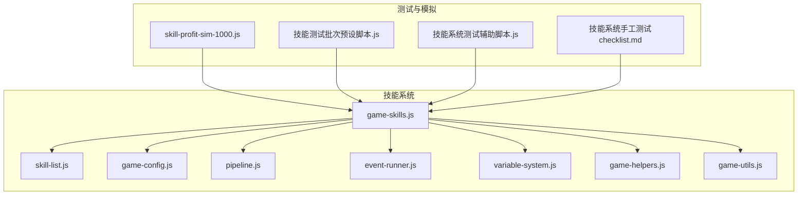
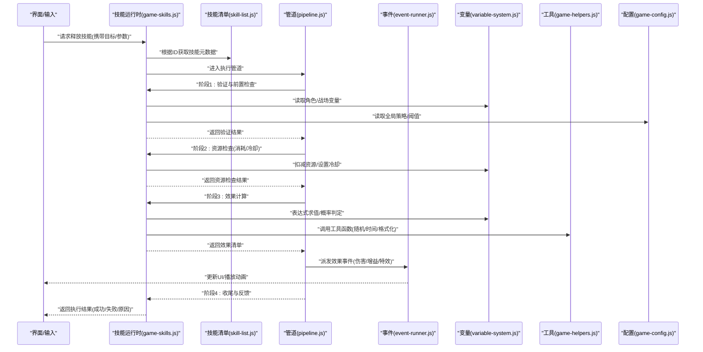
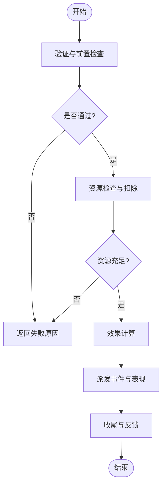
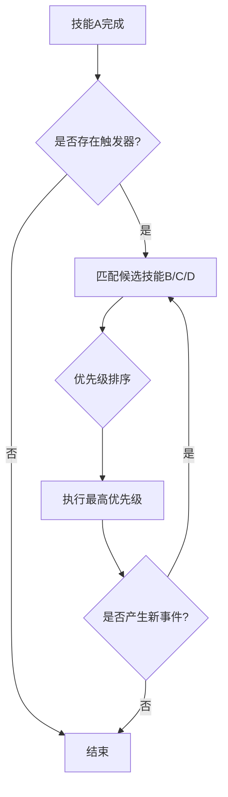
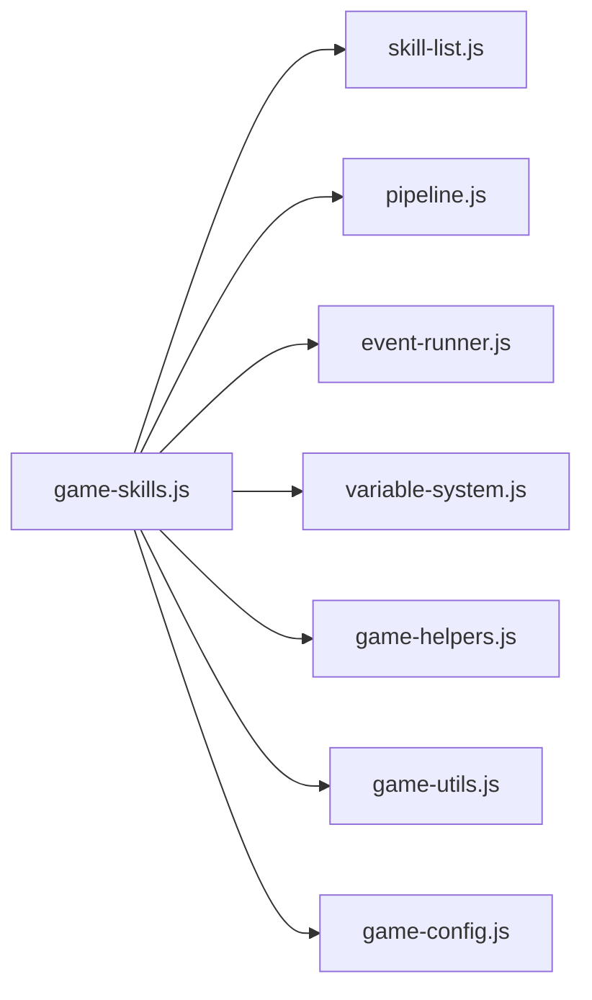

# 技能系统

<cite>
**本文引用的文件**   
- [module/game-skills.js](file://module/game-skills.js)
- [module/skill-list.js](file://module/skill-list.js)
- [module/pipeline.js](file://module/pipeline.js)
- [module/event-runner.js](file://module/event-runner.js)
- [module/variable-system.js](file://module/variable-system.js)
- [module/game-helpers.js](file://module/game-helpers.js)
- [module/game-config.js](file://module/game-config.js)
- [module/game-utils.js](file://module/game-utils.js)
- [tools/skill-profit-sim-1000.js](file://tools/skill-profit-sim-1000.js)
- [开发文档/技能系统相关文档和脚本/技能测试批次预设脚本.js](file://开发文档/技能系统相关文档和脚本/技能测试批次预设脚本.js)
- [开发文档/技能系统相关文档和脚本/技能系统手工测试checklist.md](file://开发文档/技能系统相关文档和脚本/技能系统手工测试checklist.md)
- [开发文档/技能系统相关文档和脚本/技能系统测试辅助脚本.js](file://开发文档/技能系统相关文档和脚本/技能系统测试辅助脚本.js)
</cite>

## 目录
1. [简介](#简介)
2. [项目结构](#项目结构)
3. [核心组件](#核心组件)
4. [架构总览](#架构总览)
5. [详细组件分析](#详细组件分析)
6. [依赖关系分析](#依赖关系分析)
7. [性能考虑](#性能考虑)
8. [故障排查指南](#故障排查指南)
9. [结论](#结论)
10. [附录](#附录)

## 简介
本技术文档围绕“姬侠传”的技能系统，系统化阐述技能定义结构、执行流程、分类体系、组合与连锁机制、新增技能开发指南以及平衡性与性能优化建议。文档面向开发者与策划人员，力求在保持技术深度的同时提供可操作的实践指导。

## 项目结构
技能系统主要位于前端模块中，关键文件包括：
- 技能运行时与调度：game-skills.js、pipeline.js、event-runner.js
- 技能数据与清单：skill-list.js、game-config.js
- 变量与工具：variable-system.js、game-helpers.js、game-utils.js
- 模拟与测试：tools/skill-profit-sim-1000.js、开发文档中的测试脚本与清单

图表来源
- [module/game-skills.js](file://module/game-skills.js)
- [module/skill-list.js](file://module/skill-list.js)
- [module/game-config.js](file://module/game-config.js)
- [module/pipeline.js](file://module/pipeline.js)
- [module/event-runner.js](file://module/event-runner.js)
- [module/variable-system.js](file://module/variable-system.js)
- [module/game-helpers.js](file://module/game-helpers.js)
- [module/game-utils.js](file://module/game-utils.js)
- [tools/skill-profit-sim-1000.js](file://tools/skill-profit-sim-1000.js)
- [开发文档/技能系统相关文档和脚本/技能测试批次预设脚本.js](file://开发文档/技能系统相关文档和脚本/技能测试批次预设脚本.js)
- [开发文档/技能系统相关文档和脚本/技能系统测试辅助脚本.js](file://开发文档/技能系统相关文档和脚本/技能系统测试辅助脚本.js)
- [开发文档/技能系统相关文档和脚本/技能系统手工测试checklist.md](file://开发文档/技能系统相关文档和脚本/技能系统手工测试checklist.md)

章节来源
- [module/game-skills.js](file://module/game-skills.js)
- [module/skill-list.js](file://module/skill-list.js)
- [module/game-config.js](file://module/game-config.js)
- [module/pipeline.js](file://module/pipeline.js)
- [module/event-runner.js](file://module/event-runner.js)
- [module/variable-system.js](file://module/variable-system.js)
- [module/game-helpers.js](file://module/game-helpers.js)
- [module/game-utils.js](file://module/game-utils.js)
- [tools/skill-profit-sim-1000.js](file://tools/skill-profit-sim-1000.js)
- [开发文档/技能系统相关文档和脚本/技能测试批次预设脚本.js](file://开发文档/技能系统相关文档和脚本/技能测试批次预设脚本.js)
- [开发文档/技能系统相关文档和脚本/技能系统测试辅助脚本.js](file://开发文档/技能系统相关文档和脚本/技能系统测试辅助脚本.js)
- [开发文档/技能系统相关文档和脚本/技能系统手工测试checklist.md](file://开发文档/技能系统相关文档和脚本/技能系统手工测试checklist.md)

## 核心组件
- 技能运行时（game-skills.js）：负责加载技能配置、解析技能元数据、执行验证与资源检查、计算效果、触发事件与动画、管理冷却与状态叠加。
- 技能清单（skill-list.js）：集中维护技能ID到配置的映射、类型标签、优先级与分组信息，便于检索与批量操作。
- 管道与事件（pipeline.js、event-runner.js）：将技能执行拆解为阶段化步骤（校验→资源→效果→反馈），并通过事件驱动串联各子系统。
- 变量系统（variable-system.js）：提供全局/局部变量读写、表达式求值、条件判断，支撑技能效果的动态计算。
- 工具与辅助（game-helpers.js、game-utils.js）：封装通用逻辑（如随机数、时间戳、格式化、日志等）。
- 配置（game-config.js）：承载全局开关、默认参数、数值表与策略项，影响技能行为与表现。
- 测试与模拟（tools/*、开发文档/*）：提供收益模拟、批处理测试、辅助脚本与手工检查清单，保障质量与平衡性。

章节来源
- [module/game-skills.js](file://module/game-skills.js)
- [module/skill-list.js](file://module/skill-list.js)
- [module/pipeline.js](file://module/pipeline.js)
- [module/event-runner.js](file://module/event-runner.js)
- [module/variable-system.js](file://module/variable-system.js)
- [module/game-helpers.js](file://module/game-helpers.js)
- [module/game-utils.js](file://module/game-utils.js)
- [module/game-config.js](file://module/game-config.js)
- [tools/skill-profit-sim-1000.js](file://tools/skill-profit-sim-1000.js)
- [开发文档/技能系统相关文档和脚本/技能测试批次预设脚本.js](file://开发文档/技能系统相关文档和脚本/技能测试批次预设脚本.js)
- [开发文档/技能系统相关文档和脚本/技能系统测试辅助脚本.js](file://开发文档/技能系统相关文档和脚本/技能系统测试辅助脚本.js)
- [开发文档/技能系统相关文档和脚本/技能系统手工测试checklist.md](file://开发文档/技能系统相关文档和脚本/技能系统手工测试checklist.md)

## 架构总览
技能系统的执行采用“配置驱动 + 事件驱动 + 管道阶段化”的架构。技能以数据为中心，通过清单索引，由运行时按阶段推进，并在每个阶段派发事件供其他模块订阅。

图表来源
- [module/game-skills.js](file://module/game-skills.js)
- [module/skill-list.js](file://module/skill-list.js)
- [module/pipeline.js](file://module/pipeline.js)
- [module/event-runner.js](file://module/event-runner.js)
- [module/variable-system.js](file://module/variable-system.js)
- [module/game-helpers.js](file://module/game-helpers.js)
- [module/game-config.js](file://module/game-config.js)

## 详细组件分析

### 技能定义结构与属性
- 标识与展示
  - 技能ID：唯一标识，用于清单索引与持久化记录
  - 名称/描述：用于UI展示与提示
  - 图标/音效/特效：用于表现层联动
- 类型与分类
  - 类型字段：攻击/防御/辅助/特殊等，决定基础结算路径与交互规则
  - 标签/分组：便于筛选、统计与批量策略控制
- 资源与限制
  - 消耗：法力/怒气/能量/次数等，支持固定值或表达式
  - 冷却：全局/目标/范围维度，支持多段冷却与共享CD
  - 前置条件：等级/装备/状态/位置/回合等
- 效果与结算
  - 伤害/治疗/护盾/增益/减益/位移/召唤/环境互动
  - 概率/阈值/上限/下限/衰减曲线
  - 目标选择：单体/群体/自身/随机/指定
- 联动与组合
  - 触发器：被击/命中/回合开始/结束/死亡/场景事件
  - 连锁：后摇触发、条件分支、优先级与冲突消解
- 表现与反馈
  - 动画片段、镜头、震动、粒子、音效
  - 日志与调试标记

章节来源
- [module/game-skills.js](file://module/game-skills.js)
- [module/skill-list.js](file://module/skill-list.js)
- [module/game-config.js](file://module/game-config.js)

### 技能执行流程
- 阶段一：验证与前置检查
  - 校验技能存在、类型合法、目标有效、前置条件满足
- 阶段二：资源检查与扣除
  - 检查并扣除消耗，设置冷却；若不足则中止并返回原因
- 阶段三：效果计算
  - 基于变量系统与配置进行数值计算、概率判定、目标筛选
- 阶段四：事件派发与表现
  - 派发伤害/治疗/Buff/特效事件，驱动UI与动画
- 阶段五：收尾与反馈
  - 记录日志、更新状态、返回执行结果

图表来源
- [module/game-skills.js](file://module/game-skills.js)
- [module/pipeline.js](file://module/pipeline.js)
- [module/event-runner.js](file://module/event-runner.js)
- [module/variable-system.js](file://module/variable-system.js)
- [module/game-helpers.js](file://module/game-helpers.js)
- [module/game-config.js](file://module/game-config.js)

章节来源
- [module/game-skills.js](file://module/game-skills.js)
- [module/pipeline.js](file://module/pipeline.js)
- [module/event-runner.js](file://module/event-runner.js)
- [module/variable-system.js](file://module/variable-system.js)
- [module/game-helpers.js](file://module/game-helpers.js)
- [module/game-config.js](file://module/game-config.js)

### 技能分类体系与实现差异
- 攻击技能
  - 侧重伤害计算、命中/闪避/暴击、护甲穿透、抗性减免
  - 通常附带命中判定与目标选择逻辑
- 防御技能
  - 侧重护盾/减伤/免疫/反伤/格挡
  - 常与受击事件联动，具备持续时间与刷新策略
- 辅助技能
  - 侧重增益/治疗/净化/位移/召唤
  - 强调目标管理与状态叠加规则
- 特殊技能
  - 场景互动/机制切换/全局效果/剧情触发
  - 可能改变战斗规则或环境状态

章节来源
- [module/game-skills.js](file://module/game-skills.js)
- [module/skill-list.js](file://module/skill-list.js)
- [module/game-config.js](file://module/game-config.js)

### 技能组合与连锁反应
- 优先级
  - 同一帧内多个效果按优先级排序，避免顺序敏感导致的歧义
- 冲突处理
  - 互斥标签、覆盖策略（替换/延长/叠加）、阈值封顶
- 效果叠加
  - 同类型叠加（累加/取最大/百分比叠加）、异类型组合（乘区/独立区）
- 触发链
  - 前一个技能的完成事件作为下一个技能的触发源，支持条件分支与循环保护

图表来源
- [module/game-skills.js](file://module/game-skills.js)
- [module/event-runner.js](file://module/event-runner.js)
- [module/pipeline.js](file://module/pipeline.js)

章节来源
- [module/game-skills.js](file://module/game-skills.js)
- [module/event-runner.js](file://module/event-runner.js)
- [module/pipeline.js](file://module/pipeline.js)

### 新增技能开发指南
- 配置文件
  - 在技能清单中添加条目，包含ID、名称、描述、类型、标签、消耗、冷却、前置条件、效果定义、表现资源引用
  - 如需全局策略调整，可在配置文件中添加对应键值
- 效果脚本
  - 使用变量系统进行表达式求值与条件判断
  - 通过事件派发接口输出伤害/治疗/增益/特效等事件
  - 遵循优先级与叠加规则，避免无限循环
- 测试验证
  - 使用测试辅助脚本进行单测与回归
  - 使用批次预设脚本进行组合场景验证
  - 依据手工测试清单逐项核对功能与边界
- 上线前检查
  - 平衡性评估（参考收益模拟报告）
  - 性能压测（高频触发/大规模目标）
  - 日志与埋点完备

章节来源
- [module/skill-list.js](file://module/skill-list.js)
- [module/game-config.js](file://module/game-config.js)
- [module/variable-system.js](file://module/variable-system.js)
- [module/game-skills.js](file://module/game-skills.js)
- [开发文档/技能系统相关文档和脚本/技能测试批次预设脚本.js](file://开发文档/技能系统相关文档和脚本/技能测试批次预设脚本.js)
- [开发文档/技能系统相关文档和脚本/技能系统测试辅助脚本.js](file://开发文档/技能系统相关文档和脚本/技能系统测试辅助脚本.js)
- [开发文档/技能系统相关文档和脚本/技能系统手工测试checklist.md](file://开发文档/技能系统相关文档和脚本/技能系统手工测试checklist.md)

## 依赖关系分析
- 内部依赖
  - game-skills.js 依赖 skill-list.js 获取元数据，依赖 pipeline.js 组织执行阶段，依赖 event-runner.js 分发事件
  - variable-system.js 提供变量读写与表达式能力，被多处复用
  - game-helpers.js 与 game-utils.js 提供通用工具
  - game-config.js 提供全局策略与阈值
- 外部集成
  - UI/动画/音频等表现层通过事件订阅响应技能效果
  - 测试与模拟工具直接调用运行时接口进行压力与平衡性验证

图表来源
- [module/game-skills.js](file://module/game-skills.js)
- [module/skill-list.js](file://module/skill-list.js)
- [module/pipeline.js](file://module/pipeline.js)
- [module/event-runner.js](file://module/event-runner.js)
- [module/variable-system.js](file://module/variable-system.js)
- [module/game-helpers.js](file://module/game-helpers.js)
- [module/game-utils.js](file://module/game-utils.js)
- [module/game-config.js](file://module/game-config.js)

章节来源
- [module/game-skills.js](file://module/game-skills.js)
- [module/skill-list.js](file://module/skill-list.js)
- [module/pipeline.js](file://module/pipeline.js)
- [module/event-runner.js](file://module/event-runner.js)
- [module/variable-system.js](file://module/variable-system.js)
- [module/game-helpers.js](file://module/game-helpers.js)
- [module/game-utils.js](file://module/game-utils.js)
- [module/game-config.js](file://module/game-config.js)

## 性能考虑
- 计算复杂度
  - 效果计算尽量使用O(1)或O(n)线性扫描，避免嵌套循环
  - 目标筛选与排序应缓存中间结果，减少重复计算
- 事件风暴
  - 对高频触发技能进行节流与合并，避免UI卡顿
  - 使用事件批处理，降低渲染压力
- 内存与对象分配
  - 复用临时对象，避免频繁GC
  - 大数组/列表按需分页或分片处理
- 网络与IO
  - 本地计算优先，必要时异步加载表现资源
- 监控与定位
  - 关键路径埋点，输出耗时与错误堆栈
  - 结合模拟工具进行回归压测

[本节为通用性能建议，不直接分析具体文件]

## 故障排查指南
- 常见问题
  - 技能无法释放：检查前置条件、资源不足、冷却未结束
  - 效果异常：核对变量取值、表达式语法、概率阈值
  - 连锁死循环：检查触发器条件与退出条件
  - UI不同步：确认事件派发顺序与UI更新时机
- 定位方法
  - 启用详细日志，关注阶段划分与返回值
  - 使用测试辅助脚本复现问题，逐步缩小范围
  - 对照手工测试清单逐项验证
- 修复建议
  - 增加断言与边界检查
  - 引入幂等与回滚机制
  - 对复杂组合增加单元测试与回归用例

章节来源
- [module/game-skills.js](file://module/game-skills.js)
- [module/pipeline.js](file://module/pipeline.js)
- [module/event-runner.js](file://module/event-runner.js)
- [module/variable-system.js](file://module/variable-system.js)
- [开发文档/技能系统相关文档和脚本/技能系统手工测试checklist.md](file://开发文档/技能系统相关文档和脚本/技能系统手工测试checklist.md)

## 结论
本技能系统以数据驱动为核心，通过清晰的阶段化执行与事件驱动机制，实现了高扩展性与良好可维护性。配合完善的测试与模拟工具，可有效保障技能质量与平衡性。建议在后续迭代中持续完善配置校验、可视化调试与自动化回归，进一步提升开发效率与稳定性。

[本节为总结性内容，不直接分析具体文件]

## 附录
- 术语
  - 技能ID：唯一标识符
  - 前置条件：释放前的约束集合
  - 效果清单：一次释放产生的所有结算项
  - 触发器：由事件驱动的自动释放条件
- 最佳实践
  - 明确类型与标签，统一命名规范
  - 将复杂逻辑拆分为可测试的小单元
  - 为关键数值提供配置入口，便于平衡调优
- 参考
  - 收益模拟与报告生成脚本
  - 测试批次与辅助脚本
  - 手工测试清单

[本节为补充说明，不直接分析具体文件]