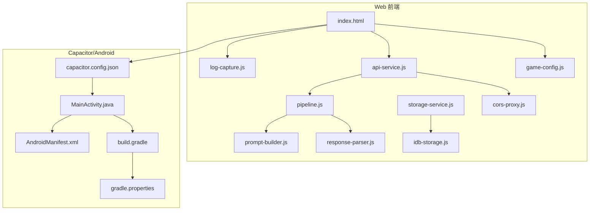
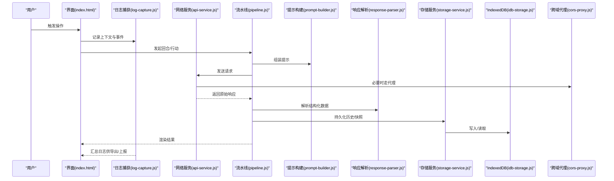
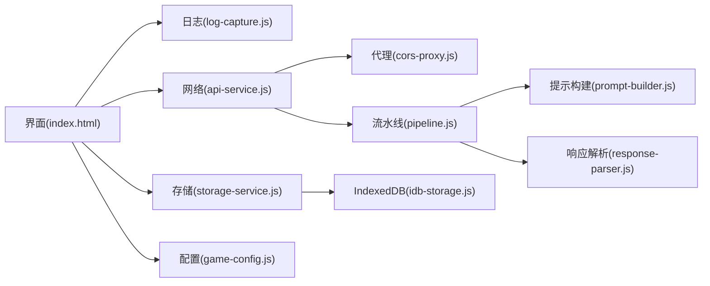

# 故障排除

<cite>
**本文引用的文件**   
- [log-capture.js](file://module/log-capture.js)
- [api-service.js](file://module/api-service.js)
- [storage-service.js](file://module/storage-service.js)
- [idb-storage.js](file://module/idb-storage.js)
- [pipeline.js](file://module/pipeline.js)
- [prompt-builder.js](file://module/prompt-builder.js)
- [response-parser.js](file://module/response-parser.js)
- [game-config.js](file://module/game-config.js)
- [index.html](file://apk/android/app/src/main/assets/public/index.html)
- [capacitor.config.json](file://apk/android/app/src/main/assets/public/capacitor.config.json)
- [MainActivity.java](file://apk/android/app/src/main/java/com/jihaitang/jxz/MainActivity.java)
- [AndroidManifest.xml](file://apk/android/app/src/main/AndroidManifest.xml)
- [build.gradle](file://apk/android/app/build.gradle)
- [gradle.properties](file://apk/android/gradle.properties)
- [cors-proxy.js](file://worker/cors-proxy.js)
- [ReadMe.md](file://ReadMe.md)
</cite>

## 目录
1. [简介](#简介)
2. [项目结构](#项目结构)
3. [核心组件](#核心组件)
4. [架构总览](#架构总览)
5. [详细组件分析](#详细组件分析)
6. [依赖分析](#依赖分析)
7. [性能考虑](#性能考虑)
8. [故障排除指南](#故障排除指南)
9. [结论](#结论)
10. [附录](#附录)

## 简介
本指南面向姬侠传项目的开发与维护人员，聚焦于：
- 开发过程中常见问题与解决方案
- 日志捕获与分析工具的使用
- 常见性能问题与优化策略
- 浏览器兼容性与移动端适配挑战
- 调试技巧与诊断工具使用
- 错误信息解读与定位方法

目标是提供一份完整的排错参考手册，帮助快速定位并解决问题。

## 项目结构
本项目采用前端资源与Capacitor打包的混合结构：
- 前端资源位于 assets/public 下，包含页面、模块脚本、样式与静态资源
- Android 工程位于 apk/android，通过 Capacitor 将 Web 应用打包为 APK
- 关键模块集中在 module 目录，负责网络、存储、提示构建、响应解析、流水线编排等
- worker 目录提供跨域代理能力（CORS）

图表来源
- [index.html](file://apk/android/app/src/main/assets/public/index.html)
- [log-capture.js](file://module/log-capture.js)
- [api-service.js](file://module/api-service.js)
- [pipeline.js](file://module/pipeline.js)
- [prompt-builder.js](file://module/prompt-builder.js)
- [response-parser.js](file://module/response-parser.js)
- [storage-service.js](file://module/storage-service.js)
- [idb-storage.js](file://module/idb-storage.js)
- [game-config.js](file://module/game-config.js)
- [capacitor.config.json](file://apk/android/app/src/main/assets/public/capacitor.config.json)
- [MainActivity.java](file://apk/android/app/src/main/java/com/jihaitang/jxz/MainActivity.java)
- [AndroidManifest.xml](file://apk/android/app/src/main/AndroidManifest.xml)
- [build.gradle](file://apk/android/app/build.gradle)
- [gradle.properties](file://apk/android/gradle.properties)

章节来源
- [ReadMe.md](file://ReadMe.md)

## 核心组件
- 日志捕获与上报：集中采集控制台日志、异常与网络请求，便于离线导出与远程上报
- 网络服务：封装 HTTP 请求、重试、超时、错误分类与代理转发
- 存储层：统一 IndexedDB 访问，提供快照、增量同步与容错
- 流水线：串联提示构建、模型调用、结果解析与后处理
- 配置管理：集中加载运行时配置与环境变量
- 跨域代理：在受限环境下通过 Worker 代理解决 CORS 限制

章节来源
- [log-capture.js](file://module/log-capture.js)
- [api-service.js](file://module/api-service.js)
- [storage-service.js](file://module/storage-service.js)
- [idb-storage.js](file://module/idb-storage.js)
- [pipeline.js](file://module/pipeline.js)
- [prompt-builder.js](file://module/prompt-builder.js)
- [response-parser.js](file://module/response-parser.js)
- [game-config.js](file://module/game-config.js)
- [cors-proxy.js](file://worker/cors-proxy.js)

## 架构总览
下图展示了从用户交互到 AI 响应返回的关键流程，以及日志与存储的参与点。

图表来源
- [index.html](file://apk/android/app/src/main/assets/public/index.html)
- [log-capture.js](file://module/log-capture.js)
- [api-service.js](file://module/api-service.js)
- [pipeline.js](file://module/pipeline.js)
- [prompt-builder.js](file://module/prompt-builder.js)
- [response-parser.js](file://module/response-parser.js)
- [storage-service.js](file://module/storage-service.js)
- [idb-storage.js](file://module/idb-storage.js)
- [cors-proxy.js](file://worker/cors-proxy.js)

## 详细组件分析

### 日志捕获与分析工具
- 功能要点
  - 拦截 console 输出与未捕获异常，附加时间戳、堆栈与上下文
  - 聚合网络请求与响应摘要，便于定位接口问题
  - 支持本地导出与可选的上报通道
- 典型问题
  - 日志缺失：确认是否初始化了日志捕获入口；检查是否在沙箱或受限环境中被屏蔽
  - 日志过大：启用采样或分级过滤，避免影响性能
  - 上报失败：校验目标地址、跨域策略与证书有效性
- 建议实践
  - 在关键路径埋点，记录输入参数与中间状态
  - 对敏感字段脱敏后再落盘
  - 结合错误码与链路 ID 进行关联分析

章节来源
- [log-capture.js](file://module/log-capture.js)

### 网络服务与跨域代理
- 功能要点
  - 统一封装请求，支持重试、超时、错误分类与降级
  - 在需要时通过 Worker 代理绕过 CORS 限制
- 典型问题
  - 跨域失败：检查代理地址、CORS 头与域名白名单
  - 请求超时：调整超时阈值，增加重试次数与退避策略
  - 证书/HTTPS 问题：确保服务端证书有效且受信任
- 建议实践
  - 区分业务错误与网络错误，分别处理
  - 对幂等操作启用重试，非幂等操作谨慎重试
  - 记录请求指纹以便复现

章节来源
- [api-service.js](file://module/api-service.js)
- [cors-proxy.js](file://worker/cors-proxy.js)

### 存储层与快照机制
- 功能要点
  - 基于 IndexedDB 的统一存储抽象，提供读写、事务与错误恢复
  - 支持快照与增量更新，降低大对象写入开销
- 典型问题
  - 存储空间不足：清理旧快照或限制最大容量
  - 版本不兼容：升级时执行迁移脚本
  - 并发冲突：使用事务与版本号控制
- 建议实践
  - 批量写入合并，减少 I/O 次数
  - 定期压缩与归档历史数据
  - 对关键数据做校验和

章节来源
- [storage-service.js](file://module/storage-service.js)
- [idb-storage.js](file://module/idb-storage.js)

### 流水线与提示构建
- 功能要点
  - 将“提示构建—模型调用—结果解析—后处理”串成可插拔管线
  - 支持错误分支与回退策略
- 典型问题
  - 提示过长导致截断：拆分上下文或精简历史
  - 解析失败：增强正则/JSON 校验与容错
  - 模型不可用：切换备用端点或降级模式
- 建议实践
  - 为每个阶段设置超时与熔断
  - 记录阶段耗时，定位瓶颈
  - 对关键步骤添加幂等键

章节来源
- [pipeline.js](file://module/pipeline.js)
- [prompt-builder.js](file://module/prompt-builder.js)
- [response-parser.js](file://module/response-parser.js)

### 配置管理与环境
- 功能要点
  - 集中加载运行配置，覆盖默认值与环境变量
  - 在 Capacitor 环境中读取平台特定配置
- 典型问题
  - 配置未生效：检查加载顺序与优先级
  - 密钥泄露：避免硬编码，使用安全注入
  - 多环境差异：按环境隔离配置项
- 建议实践
  - 启动时校验必填项
  - 提供配置自检与告警

章节来源
- [game-config.js](file://module/game-config.js)

### 移动端与 Capacitor 集成
- 功能要点
  - 通过 capacitor.config.json 声明权限与插件
  - MainActivity 作为宿主桥接原生能力
  - AndroidManifest 声明网络与存储权限
- 典型问题
  - 打包后无法联网：检查清单权限与 HTTPS 明文限制
  - 资源路径错误：确认 public 目录结构与相对路径
  - 插件未注册：核对插件清单与初始化顺序
- 建议实践
  - 在真机调试，避免模拟器差异
  - 使用 Gradle 属性统一管理版本与签名

章节来源
- [capacitor.config.json](file://apk/android/app/src/main/assets/public/capacitor.config.json)
- [MainActivity.java](file://apk/android/app/src/main/java/com/jihaitang/jxz/MainActivity.java)
- [AndroidManifest.xml](file://apk/android/app/src/main/AndroidManifest.xml)
- [build.gradle](file://apk/android/app/build.gradle)
- [gradle.properties](file://apk/android/gradle.properties)

## 依赖分析
- 组件耦合关系
  - 界面依赖日志、网络、存储与配置
  - 网络服务依赖跨域代理（可选）
  - 流水线依赖提示构建与响应解析
  - 存储层依赖 IndexedDB 实现
- 外部依赖
  - Capacitor 与 Android 系统能力
  - 浏览器特性（IndexedDB、Worker、Fetch）

图表来源
- [index.html](file://apk/android/app/src/main/assets/public/index.html)
- [log-capture.js](file://module/log-capture.js)
- [api-service.js](file://module/api-service.js)
- [pipeline.js](file://module/pipeline.js)
- [prompt-builder.js](file://module/prompt-builder.js)
- [response-parser.js](file://module/response-parser.js)
- [storage-service.js](file://module/storage-service.js)
- [idb-storage.js](file://module/idb-storage.js)
- [game-config.js](file://module/game-config.js)
- [cors-proxy.js](file://worker/cors-proxy.js)

章节来源
- [index.html](file://apk/android/app/src/main/assets/public/index.html)

## 性能考虑
- 网络
  - 合理设置超时与重试，避免雪崩
  - 使用缓存与条件请求减少带宽
  - 对大响应分块处理与流式解析
- 存储
  - 批量写入与事务合并
  - 定期清理与压缩历史数据
  - 避免在主线程执行重型 I/O
- 渲染与交互
  - 长列表虚拟化与懒加载
  - 图片与音频按需加载与预取
  - 减少重排与重绘
- 模型调用
  - 提示长度控制与上下文裁剪
  - 并行请求与去重
  - 失败快速回退与降级

[本节为通用指导，无需代码来源]

## 故障排除指南

### 一、日志捕获与分析
- 如何开启与查看
  - 确认日志模块已初始化并在关键路径埋点
  - 在控制台或导出文件中检索关键字、错误码与链路 ID
- 常见问题
  - 无日志：检查初始化时机与权限
  - 日志丢失：排查异步任务与页面卸载时的清理逻辑
  - 日志过多：启用采样与分级
- 分析方法
  - 以时间线串联用户操作、网络请求与解析结果
  - 对比成功与失败用例的差异点
  - 关注异常堆栈与错误分类

章节来源
- [log-capture.js](file://module/log-capture.js)

### 二、网络与跨域问题
- 症状
  - 控制台出现跨域错误或请求被拦截
  - 代理地址不可达或返回 4xx/5xx
- 排查步骤
  - 验证代理地址与端口可达性
  - 检查服务端 CORS 头与域名白名单
  - 确认 HTTPS 证书有效且受信任
  - 在代理模式下比对直连与代理的差异
- 修复建议
  - 修正代理路由与鉴权
  - 增加重试与超时保护
  - 对敏感接口增加签名与限流

章节来源
- [api-service.js](file://module/api-service.js)
- [cors-proxy.js](file://worker/cors-proxy.js)

### 三、存储与数据一致性
- 症状
  - 数据未持久化或读取为空
  - 升级后数据结构不兼容
  - 写入缓慢或卡顿
- 排查步骤
  - 检查 IndexedDB 可用性与配额
  - 确认事务提交与错误回滚
  - 对比前后版本的数据结构差异
- 修复建议
  - 实施迁移脚本与兼容性检测
  - 批量写入合并与异步化
  - 引入校验和与冲突解决策略

章节来源
- [storage-service.js](file://module/storage-service.js)
- [idb-storage.js](file://module/idb-storage.js)

### 四、流水线与提示/解析问题
- 症状
  - 提示过长导致截断或模型拒绝
  - 返回内容无法解析为期望结构
  - 多次调用失败或超时
- 排查步骤
  - 打印提示模板与实际拼接结果
  - 校验返回 JSON 或分段解析
  - 统计各阶段耗时与失败率
- 修复建议
  - 精简上下文与历史
  - 增强解析容错与回退规则
  - 增加熔断与降级策略

章节来源
- [pipeline.js](file://module/pipeline.js)
- [prompt-builder.js](file://module/prompt-builder.js)
- [response-parser.js](file://module/response-parser.js)

### 五、配置与环境问题
- 症状
  - 某些功能在开发环境正常，打包后失效
  - 密钥或地址配置不正确
- 排查步骤
  - 检查配置加载顺序与覆盖优先级
  - 在目标环境打印实际生效的配置
  - 区分不同环境的差异化配置
- 修复建议
  - 启动时校验必填项并提供明确错误信息
  - 使用环境变量注入而非硬编码

章节来源
- [game-config.js](file://module/game-config.js)

### 六、Capacitor 与 Android 打包问题
- 症状
  - 打包后无法联网或资源 404
  - 权限不足导致崩溃或功能不可用
  - 插件未生效
- 排查步骤
  - 检查 AndroidManifest 中网络与存储权限
  - 确认 public 目录结构与资源路径
  - 核对 capacitor.config.json 中的插件与权限声明
  - 使用 gradle.properties 统一版本与签名
- 修复建议
  - 在真机调试，避免模拟器差异
  - 针对 Android 11+ 的明文限制进行适配
  - 逐步启用 ProGuard/R8 并保留必要类

章节来源
- [capacitor.config.json](file://apk/android/app/src/main/assets/public/capacitor.config.json)
- [MainActivity.java](file://apk/android/app/src/main/java/com/jihaitang/jxz/MainActivity.java)
- [AndroidManifest.xml](file://apk/android/app/src/main/AndroidManifest.xml)
- [build.gradle](file://apk/android/app/build.gradle)
- [gradle.properties](file://apk/android/gradle.properties)

### 七、浏览器兼容性与移动端适配
- 常见问题
  - 旧版浏览器不支持 Fetch/IndexedDB/Worker
  - 移动端内存受限导致大图/音频卡顿
  - 横竖屏切换布局错乱
- 应对策略
  - 特性检测与降级方案
  - 资源按需加载与压缩
  - 使用响应式布局与媒体查询
  - 在移动端禁用不必要的动画与特效

[本节为通用指导，无需代码来源]

### 八、调试技巧与诊断工具
- 前端调试
  - 使用控制台与 Sources 面板断点调试
  - 利用 Network 面板观察请求与响应
  - 使用 Performance 面板分析耗时与卡顿
- 移动端调试
  - 使用 Chrome DevTools 连接设备
  - 查看 Logcat 与 Crash 报告
  - 通过 ADB 抓取日志与截图
- 日志辅助
  - 在关键路径输出结构化日志
  - 为每次会话生成唯一标识，便于追踪
  - 导出日志并上传至分析平台

[本节为通用指导，无需代码来源]

### 九、错误信息解读与定位方法
- 分类
  - 网络错误：超时、连接失败、证书错误
  - 解析错误：格式不符、字段缺失、类型错误
  - 存储错误：配额不足、版本不兼容、事务失败
  - 配置错误：缺失必填项、值非法、环境不一致
- 定位步骤
  - 根据错误码与消息定位模块
  - 结合日志时间线与链路 ID 还原场景
  - 最小化复现用例并逐步缩小范围
- 修复原则
  - 先恢复可用性，再优化健壮性
  - 增加防护与监控，防止同类问题再次发生

[本节为通用指导，无需代码来源]

## 结论
通过统一的日志、网络、存储与流水线设计，姬侠传项目在可观测性与可维护性方面具备良好基础。配合完善的调试与诊断流程，能够快速定位并解决大多数问题。建议在持续迭代中完善错误分类、监控告警与自动化测试，进一步提升稳定性与用户体验。

## 附录
- 常用命令与路径
  - 查看 Android 日志：adb logcat
  - 打开设备调试：Chrome DevTools 连接设备
  - 资源路径：assets/public 下的 index.html 与模块脚本
- 相关文档
  - 项目说明与概览参见 ReadMe

章节来源
- [ReadMe.md](file://ReadMe.md)