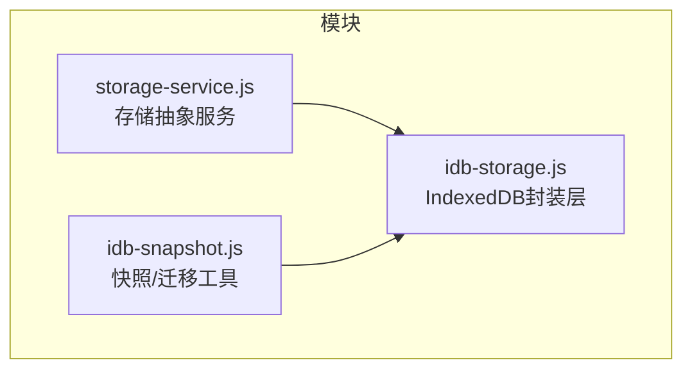
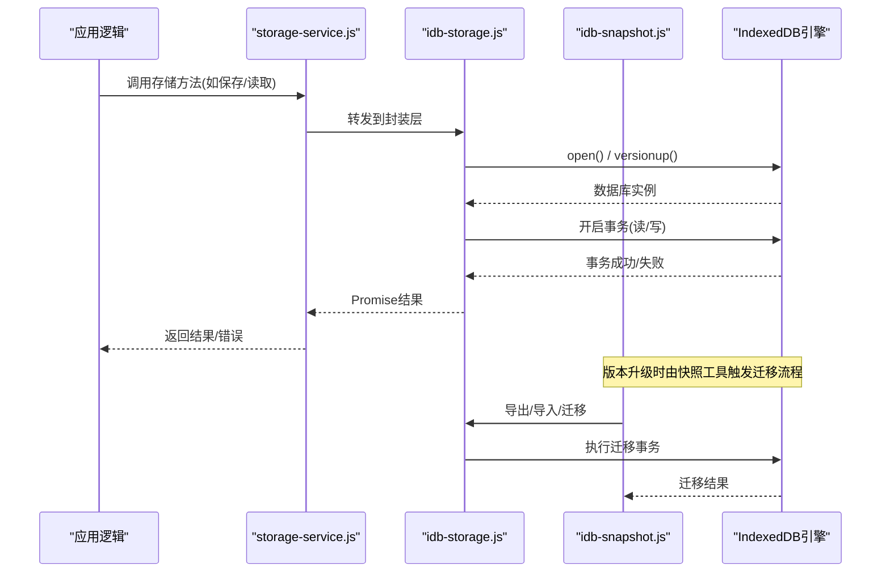
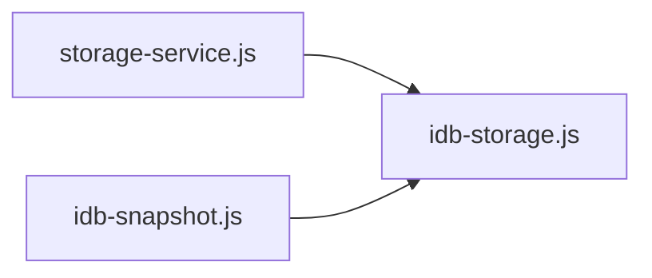
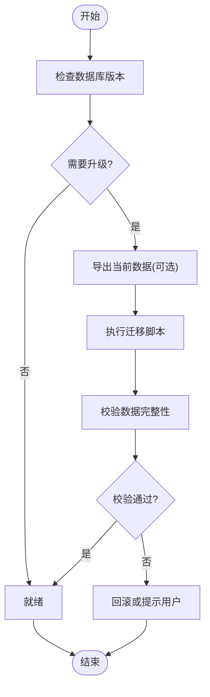

# IndexedDB封装层

<cite>
**本文引用的文件**   
- [idb-storage.js](file://module/idb-storage.js)
- [idb-snapshot.js](file://module/idb-snapshot.js)
- [storage-service.js](file://module/storage-service.js)
</cite>

## 目录
1. [简介](#简介)
2. [项目结构](#项目结构)
3. [核心组件](#核心组件)
4. [架构总览](#架构总览)
5. [详细组件分析](#详细组件分析)
6. [依赖关系分析](#依赖关系分析)
7. [性能考量](#性能考量)
8. [故障排查指南](#故障排查指南)
9. [结论](#结论)
10. [附录](#附录)

## 简介
本技术文档聚焦于“姬侠传”前端中的IndexedDB封装层，围绕 idb-storage.js 的设计与实现进行深入解析。文档将系统阐述数据库初始化、表结构与索引定义、事务管理、异步操作封装、错误处理机制，并提供数据增删改查（CRUD）API的使用指南、批量操作与查询优化技巧，以及连接管理与性能优化策略，帮助开发者高效、稳定地使用IndexedDB进行本地持久化存储。

## 项目结构
本项目采用模块化组织方式，与IndexedDB相关的核心代码位于 module 目录下：
- idb-storage.js：IndexedDB的通用封装层，提供数据库初始化、对象存储（表）与索引管理、事务封装、CRUD API等能力。
- idb-snapshot.js：基于IndexedDB的数据快照/迁移工具，用于版本升级、数据备份与恢复。
- storage-service.js：上层存储抽象服务，可能统一封装多种后端（如IndexedDB、localStorage等），并调用底层idb-storage.js完成具体操作。

图表来源
- [idb-storage.js](file://module/idb-storage.js)
- [idb-snapshot.js](file://module/idb-snapshot.js)
- [storage-service.js](file://module/storage-service.js)

章节来源
- [idb-storage.js](file://module/idb-storage.js)
- [idb-snapshot.js](file://module/idb-snapshot.js)
- [storage-service.js](file://module/storage-service.js)

## 核心组件
- 数据库初始化与版本管理
  - 负责打开数据库、创建或升级对象存储（表）、建立索引、处理版本变更。
- 对象存储与索引
  - 为不同业务实体定义对象存储名称、主键路径、唯一性约束及常用查询索引。
- 事务封装与并发控制
  - 统一封装读写事务，保证原子性与一致性；对并发访问进行排队或限流，避免浏览器端资源争用。
- CRUD API
  - 提供统一的增、删、改、查接口，支持单条与批量操作，返回Promise以简化异步调用。
- 错误处理与重试
  - 捕获并分类错误（如QuotaExceededError、VersionChangeError、AbortError等），提供可配置的重试与降级策略。
- 快照与迁移
  - 通过快照导出/导入与版本迁移脚本，保障数据结构演进时的平滑升级与数据完整性。

章节来源
- [idb-storage.js](file://module/idb-storage.js)
- [idb-snapshot.js](file://module/idb-snapshot.js)
- [storage-service.js](file://module/storage-service.js)

## 架构总览
下图展示了上层存储服务与IndexedDB封装层的交互关系，以及快照工具在版本升级过程中的参与点。

图表来源
- [storage-service.js](file://module/storage-service.js)
- [idb-storage.js](file://module/idb-storage.js)
- [idb-snapshot.js](file://module/idb-snapshot.js)

## 详细组件分析

### 数据库初始化与版本管理
- 设计要点
  - 使用版本号驱动的对象存储与索引变更，确保向后兼容。
  - 首次打开或版本升级时，按需创建对象存储与索引，避免重复初始化。
  - 对版本冲突与升级失败进行兜底处理，必要时回滚或提示用户清理数据。
- 关键流程
  - 打开数据库 -> 检测版本 -> 若需升级则执行升级回调 -> 创建/更新对象存储与索引 -> 返回可用实例。
- 注意事项
  - 避免在高频路径中重复创建索引。
  - 大体积迁移建议分批次提交，降低单次事务压力。

章节来源
- [idb-storage.js](file://module/idb-storage.js)
- [idb-snapshot.js](file://module/idb-snapshot.js)

### 对象存储与索引设计
- 对象存储（表）
  - 每个业务实体对应一个对象存储，明确主键路径与可选的唯一索引。
- 索引策略
  - 针对常用查询字段建立索引，如时间戳、状态码、关联ID等。
  - 复合索引仅在确有需求时使用，避免过度索引导致写入放大。
- 最佳实践
  - 优先使用主键检索，减少全表扫描。
  - 对范围查询尽量利用有序索引，配合游标分页。

章节来源
- [idb-storage.js](file://module/idb-storage.js)

### 事务管理与并发控制
- 事务封装
  - 统一封装readwrite/readonly事务，自动处理开始、提交与回滚。
  - 对长事务进行拆分，避免阻塞UI线程。
- 并发控制
  - 对写操作进行队列化，避免多写并发导致的锁竞争。
  - 读操作可并行，但需注意大数据集读取时的内存占用。
- 错误处理
  - 捕获AbortError、DataCloneError、ConstraintError等，向上抛出结构化错误信息。
  - 对配额不足等错误提供降级策略（如清理旧数据或提示用户）。

章节来源
- [idb-storage.js](file://module/idb-storage.js)

### 异步操作封装与API设计
- Promise化封装
  - 所有IDB操作均返回Promise，便于async/await风格调用。
- 统一错误模型
  - 将底层错误映射为领域错误类型，包含错误码、消息与上下文。
- 典型API
  - 新增：add(key, value)
  - 获取：get(key)
  - 更新：put(key, value)
  - 删除：delete(key)
  - 批量：batchAdd(items)、batchPut(items)、batchDelete(keys)
  - 查询：query(indexName, rangeOrKey, options)
  - 计数：count(indexName, rangeOrKey)
  - 清空：clear(storeName)
- 使用建议
  - 批量操作优先使用batch系列接口，减少事务开销。
  - 查询尽量限定范围，结合分页与游标避免一次性加载过多数据。

章节来源
- [idb-storage.js](file://module/idb-storage.js)

### 快照与迁移机制
- 快照导出/导入
  - 按对象存储维度导出数据，支持压缩与校验，便于备份与跨设备迁移。
- 版本迁移
  - 在数据库版本升级时，根据迁移脚本逐步调整对象存储与索引。
  - 迁移失败时提供回滚或断点续迁能力。
- 使用场景
  - 应用冷启动时检查版本并执行必要迁移。
  - 用户主动触发数据迁移或清理。

章节来源
- [idb-snapshot.js](file://module/idb-snapshot.js)
- [idb-storage.js](file://module/idb-storage.js)

### 与上层存储服务的集成
- 职责划分
  - storage-service.js作为统一入口，屏蔽底层差异，调用idb-storage.js完成具体操作。
- 扩展性
  - 可通过适配器模式切换不同存储后端（如localStorage、WebSQL等），保持上层API一致。
- 错误透传
  - 将底层错误转换为上层业务错误，便于统一日志与监控。

章节来源
- [storage-service.js](file://module/storage-service.js)
- [idb-storage.js](file://module/idb-storage.js)

## 依赖关系分析
- 模块耦合
  - storage-service.js 依赖 idb-storage.js 提供的数据库与CRUD能力。
  - idb-snapshot.js 依赖 idb-storage.js 的事务与对象存储访问接口。
- 外部依赖
  - 直接依赖浏览器原生IndexedDB API，无第三方库依赖。
- 潜在风险
  - 避免循环依赖；确保快照与迁移逻辑不引入额外副作用。

图表来源
- [storage-service.js](file://module/storage-service.js)
- [idb-storage.js](file://module/idb-storage.js)
- [idb-snapshot.js](file://module/idb-snapshot.js)

章节来源
- [storage-service.js](file://module/storage-service.js)
- [idb-storage.js](file://module/idb-storage.js)
- [idb-snapshot.js](file://module/idb-snapshot.js)

## 性能考量
- 事务粒度
  - 小事务优先，避免长事务阻塞；批量写入合并为单个事务。
- 索引选择
  - 仅对高频查询字段建索引；复合索引谨慎使用。
- 分页与游标
  - 列表查询使用游标分页，限制每次返回数量。
- 序列化与克隆
  - 避免在对象中包含不可克隆属性（如函数、DOM节点），减少DataCloneError。
- 内存与I/O
  - 大对象分批处理；避免在主线程执行耗时任务，必要时使用Worker。
- 连接复用
  - 复用数据库连接实例，避免频繁open/close带来的开销。

[本节为通用性能指导，无需特定文件引用]

## 故障排查指南
- 常见问题
  - QuotaExceededError：存储空间不足，建议清理旧数据或提示用户释放空间。
  - VersionChangeError：数据库版本变更冲突，建议关闭其他标签页后重试。
  - AbortError：事务被中止，检查是否过早关闭连接或并发写冲突。
  - DataCloneError：对象不可克隆，检查数据结构是否符合要求。
  - ConstraintError：唯一约束冲突，检查主键或唯一索引。
- 定位步骤
  - 记录错误码与上下文信息（对象存储名、键值、事务ID）。
  - 复现路径：确认是否在迁移或批量操作中发生。
  - 验证索引：确认查询条件是否命中索引。
- 修复建议
  - 增加重试与退避策略；对配额错误实施自动清理。
  - 在迁移前进行数据校验与备份。

章节来源
- [idb-storage.js](file://module/idb-storage.js)
- [idb-snapshot.js](file://module/idb-snapshot.js)

## 结论
idb-storage.js为“姬侠传”提供了稳定、易用的IndexedDB封装层，涵盖数据库初始化、对象存储与索引管理、事务封装、CRUD API、错误处理与快照迁移等核心能力。通过合理的索引设计与事务策略，结合上层storage-service.js的统一抽象，可在保证性能的同时提升开发效率与可维护性。建议在实际使用中遵循本文的最佳实践，持续监控错误与性能指标，并根据业务增长动态调整数据模型与查询策略。

[本节为总结性内容，无需特定文件引用]

## 附录

### API使用参考（概念性说明）
- 初始化
  - 打开数据库并创建/升级对象存储与索引。
- 新增
  - add(key, value)：插入新记录，若存在主键冲突将报错。
- 获取
  - get(key)：按主键获取记录。
- 更新
  - put(key, value)：插入或更新记录。
- 删除
  - delete(key)：按主键删除记录。
- 批量
  - batchAdd(items)、batchPut(items)、batchDelete(keys)：批量操作，减少事务开销。
- 查询
  - query(indexName, rangeOrKey, options)：基于索引的范围或精确查询，支持分页。
- 计数
  - count(indexName, rangeOrKey)：统计满足条件的记录数。
- 清空
  - clear(storeName)：清空指定对象存储。

章节来源
- [idb-storage.js](file://module/idb-storage.js)

### 数据模型与索引示例（概念性说明）
- 对象存储
  - 例如：会话历史、事件记录、角色信息等。
- 索引
  - 常见索引：时间戳、状态码、关联ID、标签等。
- 约束
  - 主键唯一性、联合唯一约束等。

章节来源
- [idb-storage.js](file://module/idb-storage.js)

### 迁移与快照流程（概念性流程图）

图表来源
- [idb-snapshot.js](file://module/idb-snapshot.js)
- [idb-storage.js](file://module/idb-storage.js)