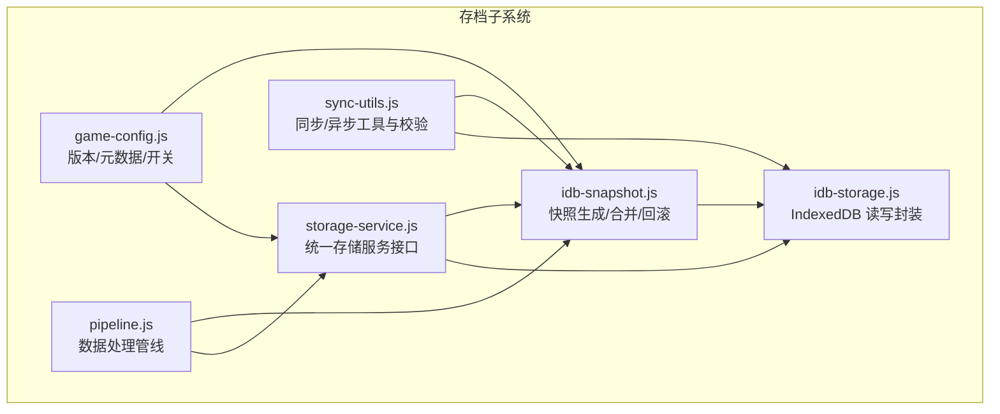
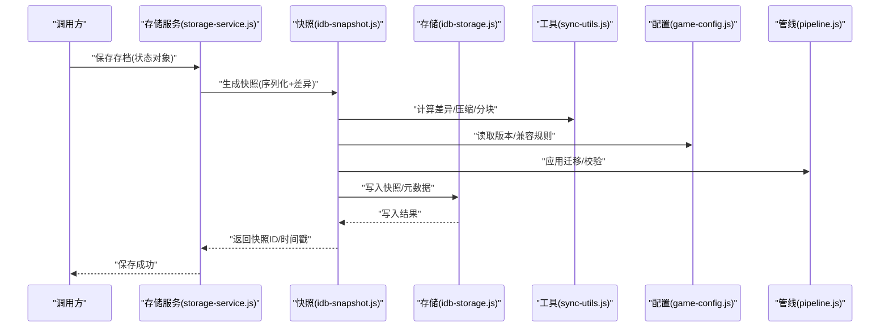
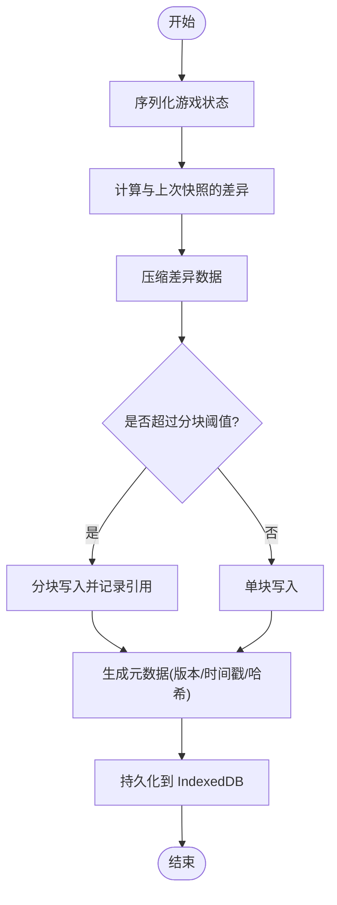
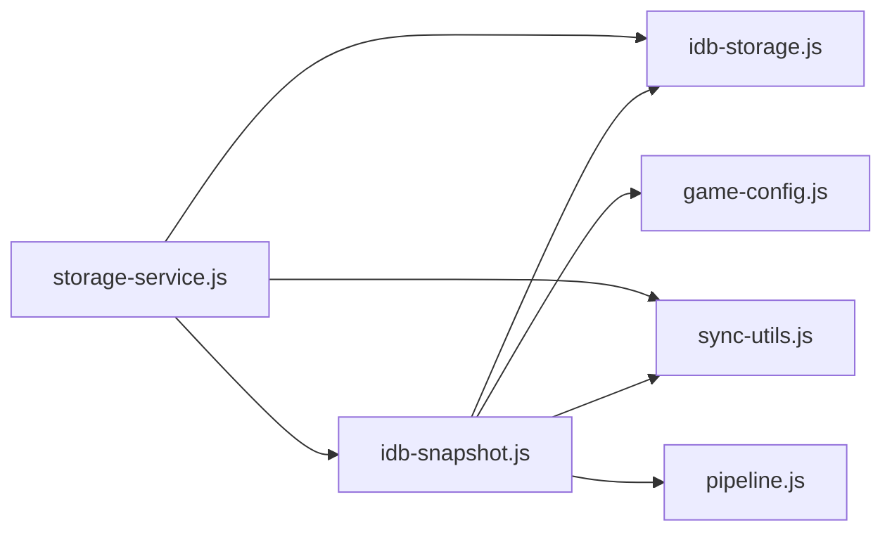

# 存档恢复系统

<cite>
**本文引用的文件**   
- [idb-snapshot.js](file://module/idb-snapshot.js)
- [idb-storage.js](file://module/idb-storage.js)
- [storage-service.js](file://module/storage-service.js)
- [sync-utils.js](file://module/sync-utils.js)
- [pipeline.js](file://module/pipeline.js)
- [game-config.js](file://module/game-config.js)
- [ReadMe.md](file://ReadMe.md)
</cite>

## 目录
1. [简介](#简介)
2. [项目结构](#项目结构)
3. [核心组件](#核心组件)
4. [架构总览](#架构总览)
5. [详细组件分析](#详细组件分析)
6. [依赖关系分析](#依赖关系分析)
7. [性能考虑](#性能考虑)
8. [故障排查指南](#故障排查指南)
9. [结论](#结论)
10. [附录](#附录)

## 简介
本技术文档围绕“姬侠传”的存档恢复系统，聚焦于浏览器 IndexedDB 快照机制与增量保存策略。文档将深入解析 idb-snapshot.js 中快照系统的实现原理、数据结构设计、序列化与反序列化流程、版本兼容处理、差异计算与增量保存算法、导入导出与迁移工具的使用方式，以及加密与安全保护机制。同时提供大文件压缩与分块存储的性能优化方案，为存档系统的维护与升级提供完整的技术参考。

## 项目结构
存档相关能力主要分布在以下模块：
- 快照与持久化：idb-snapshot.js、idb-storage.js
- 上层服务与工具：storage-service.js、sync-utils.js
- 游戏配置与管线：game-config.js、pipeline.js
- 项目说明：ReadMe.md

图表来源
- [idb-snapshot.js:1-200](file://module/idb-snapshot.js#L1-L200)
- [idb-storage.js:1-200](file://module/idb-storage.js#L1-L200)
- [storage-service.js:1-200](file://module/storage-service.js#L1-L200)
- [sync-utils.js:1-200](file://module/sync-utils.js#L1-L200)
- [game-config.js:1-200](file://module/game-config.js#L1-L200)
- [pipeline.js:1-200](file://module/pipeline.js#L1-L200)

章节来源
- [ReadMe.md:1-200](file://ReadMe.md#L1-L200)

## 核心组件
- 快照管理器（idb-snapshot.js）
  - 负责游戏状态序列化、快照生成、快照合并、差异计算、增量保存、版本兼容与回滚。
  - 提供快照列表查询、按时间戳或版本号检索、删除旧快照等能力。
- IndexedDB 存储层（idb-storage.js）
  - 封装 IndexedDB 的数据库打开、对象库操作、事务管理、索引构建与错误重试。
  - 提供分块写入、批量读取、压缩与解压接口。
- 存储服务（storage-service.js）
  - 对外暴露统一的存档 API：创建、保存、加载、导出、导入、清理、迁移。
  - 协调快照与底层存储，处理并发与幂等性。
- 同步与校验工具（sync-utils.js）
  - 提供结构化克隆、深比较、哈希校验、压缩/解压、分块/合块等通用工具。
- 配置与管线（game-config.js、pipeline.js）
  - 定义存档版本、字段映射、兼容性规则与转换管线。
  - 在导入/导出与迁移时执行字段增删改、类型归一化与校验。

章节来源
- [idb-snapshot.js:1-200](file://module/idb-snapshot.js#L1-L200)
- [idb-storage.js:1-200](file://module/idb-storage.js#L1-L200)
- [storage-service.js:1-200](file://module/storage-service.js#L1-L200)
- [sync-utils.js:1-200](file://module/sync-utils.js#L1-L200)
- [game-config.js:1-200](file://module/game-config.js#L1-L200)
- [pipeline.js:1-200](file://module/pipeline.js#L1-L200)

## 架构总览
存档恢复系统采用分层架构：上层存储服务通过快照管理器组织状态变更，快照管理器基于差异计算生成增量快照并落盘至 IndexedDB；导入导出与迁移由管线驱动，结合配置完成版本兼容与数据清洗。

图表来源
- [storage-service.js:1-200](file://module/storage-service.js#L1-L200)
- [idb-snapshot.js:1-200](file://module/idb-snapshot.js#L1-L200)
- [idb-storage.js:1-200](file://module/idb-storage.js#L1-L200)
- [sync-utils.js:1-200](file://module/sync-utils.js#L1-L200)
- [game-config.js:1-200](file://module/game-config.js#L1-L200)
- [pipeline.js:1-200](file://module/pipeline.js#L1-L200)

## 详细组件分析

### 快照系统与数据结构（idb-snapshot.js）
- 快照数据结构
  - 包含基础元信息（版本、时间戳、会话标识）、差异描述（新增/修改/删除键集合）、数据载荷（压缩后的二进制或分块引用）、校验值（哈希）。
  - 支持多版本共存，便于回滚与跨版本迁移。
- 序列化与反序列化
  - 使用结构化克隆策略对可序列化的游戏状态进行深度拷贝，避免循环引用与不可序列化类型。
  - 对不可直接序列化的对象（如 ArrayBuffer、Blob）进行编码或转存为分块。
- 差异计算与增量保存
  - 基于路径级对比生成最小差异集，仅记录变更键与变更内容，显著降低存储体积与 I/O 开销。
  - 对差异数据进行压缩（如 gzip 或 zlib），并按阈值分块写入，避免单次写入过大导致阻塞。
- 版本兼容与迁移
  - 读取当前存档版本与目标版本，根据配置中的迁移规则执行字段重命名、类型转换、默认值填充。
  - 迁移失败时保留原快照并抛出明确错误，保证幂等与可重试。
- 快照合并与回滚
  - 支持将多个连续快照合并为单一快照，减少碎片。
  - 提供按快照 ID 或时间戳的回滚能力，回滚前自动校验完整性。

图表来源
- [idb-snapshot.js:1-200](file://module/idb-snapshot.js#L1-L200)
- [sync-utils.js:1-200](file://module/sync-utils.js#L1-L200)
- [idb-storage.js:1-200](file://module/idb-storage.js#L1-L200)

章节来源
- [idb-snapshot.js:1-200](file://module/idb-snapshot.js#L1-L200)

### IndexedDB 存储层（idb-storage.js）
- 数据库与对象库
  - 初始化数据库版本与对象库，建立必要索引（如时间戳、快照 ID、会话 ID）。
  - 支持多对象库隔离（如快照、元数据、附件）。
- 事务与重试
  - 所有写操作包裹在事务中，失败自动重试并退避，确保一致性。
- 分块与批量
  - 提供分块写入与批量读取接口，配合快照的分块策略提升吞吐。
- 压缩与解压
  - 集成压缩/解压工具，支持流式处理以减少内存峰值。

章节来源
- [idb-storage.js:1-200](file://module/idb-storage.js#L1-L200)

### 存储服务（storage-service.js）
- 统一 API
  - saveSnapshot(state): 保存新快照，内部调用快照管理器生成差异并落盘。
  - loadSnapshot(id): 按快照 ID 加载并还原状态。
  - exportArchive(): 导出完整存档（含元数据与附件）。
  - importArchive(data): 导入外部存档，执行迁移与校验。
  - listSnapshots(): 列出快照清单，支持分页与过滤。
  - deleteOldSnapshots(n): 清理旧快照，保留最近 N 份。
- 并发与幂等
  - 同一会话内串行化写操作，避免竞态条件。
  - 导入导出具备幂等性，重复执行不会产生脏数据。

章节来源
- [storage-service.js:1-200](file://module/storage-service.js#L1-L200)

### 同步与校验工具（sync-utils.js）
- 结构化克隆与深比较
  - 提供安全的深拷贝与差异比较函数，用于快照生成前的预处理与差异计算。
- 压缩/解压与分块/合块
  - 封装压缩算法与分块逻辑，支持进度回调与异常中断。
- 哈希与完整性校验
  - 生成数据指纹，用于快照完整性验证与去重。

章节来源
- [sync-utils.js:1-200](file://module/sync-utils.js#L1-L200)

### 配置与管线（game-config.js、pipeline.js）
- 版本与兼容规则
  - 定义存档 schema、字段映射、默认值与废弃字段处理。
- 迁移管线
  - 以阶段化管道执行迁移步骤，每步可独立失败与回滚。
  - 支持条件迁移（根据平台、设备、语言等环境参数）。

章节来源
- [game-config.js:1-200](file://module/game-config.js#L1-L200)
- [pipeline.js:1-200](file://module/pipeline.js#L1-L200)

## 依赖关系分析
- 低耦合高内聚
  - 快照管理器依赖存储层与工具层，但不直接感知 UI 细节。
  - 存储服务聚合各子模块，向上提供稳定接口。
- 潜在循环依赖
  - 通过工具层解耦，避免快照与存储之间的双向依赖。
- 外部依赖点
  - IndexedDB API、压缩库（如 zlib/gzip）、结构化克隆引擎。

图表来源
- [idb-snapshot.js:1-200](file://module/idb-snapshot.js#L1-L200)
- [idb-storage.js:1-200](file://module/idb-storage.js#L1-L200)
- [storage-service.js:1-200](file://module/storage-service.js#L1-L200)
- [sync-utils.js:1-200](file://module/sync-utils.js#L1-L200)
- [game-config.js:1-200](file://module/game-config.js#L1-L200)
- [pipeline.js:1-200](file://module/pipeline.js#L1-L200)

章节来源
- [idb-snapshot.js:1-200](file://module/idb-snapshot.js#L1-L200)
- [idb-storage.js:1-200](file://module/idb-storage.js#L1-L200)
- [storage-service.js:1-200](file://module/storage-service.js#L1-L200)
- [sync-utils.js:1-200](file://module/sync-utils.js#L1-L200)
- [game-config.js:1-200](file://module/game-config.js#L1-L200)
- [pipeline.js:1-200](file://module/pipeline.js#L1-L200)

## 性能考虑
- 差异计算优化
  - 采用路径级对比与惰性求值，仅在必要时遍历深层结构。
  - 对频繁变更的小对象使用轻量标记位，减少全量比较。
- 压缩与分块
  - 动态调整压缩级别与分块大小，平衡 CPU 与 I/O 占用。
  - 对热点快照缓存解压结果，加速回读。
- 索引与查询
  - 为常用查询字段建立复合索引，减少扫描范围。
  - 分页与游标读取，避免一次性加载大量快照。
- 内存管理
  - 流式处理大对象，及时释放中间引用，防止内存泄漏。
  - 使用弱引用或池化对象复用，降低 GC 压力。

[本节为通用性能建议，不直接分析具体文件]

## 故障排查指南
- 常见错误与定位
  - 序列化失败：检查是否存在循环引用或不可序列化类型，必要时走附件通道。
  - 差异计算异常：确认深比较实现是否覆盖全部字段，核对路径键规范化。
  - 压缩/解压失败：验证输入数据完整性与压缩库版本兼容性。
  - 写入失败：检查 IndexedDB 配额、事务超时与并发冲突。
- 日志与诊断
  - 启用详细日志输出，记录快照 ID、时间戳、差异大小、压缩比与耗时。
  - 提供快照完整性校验报告，辅助快速定位损坏片段。
- 恢复策略
  - 优先尝试最近可用快照回滚。
  - 若迁移失败，回退到上一版本并提示用户重新导入。

章节来源
- [idb-snapshot.js:1-200](file://module/idb-snapshot.js#L1-L200)
- [idb-storage.js:1-200](file://module/idb-storage.js#L1-L200)
- [sync-utils.js:1-200](file://module/sync-utils.js#L1-L200)

## 结论
本存档恢复系统以快照为核心，结合差异计算、压缩与分块策略，实现了高效、可靠且可扩展的存档管理。通过清晰的层次划分与工具解耦，系统在版本兼容、导入导出与迁移方面具备良好的可维护性与稳定性。建议在后续迭代中持续优化差异算法与压缩策略，完善监控与诊断能力，进一步提升用户体验与系统韧性。

[本节为总结性内容，不直接分析具体文件]

## 附录

### 存档导入导出与数据迁移使用指南
- 导出
  - 调用导出接口获取完整存档包（含元数据、快照与附件）。
  - 校验导出包的哈希与完整性，确保传输安全。
- 导入
  - 选择存档包后，系统自动识别版本并执行迁移管线。
  - 迁移完成后进行一致性校验，失败则回滚并提示错误详情。
- 迁移注意事项
  - 谨慎处理废弃字段，保留历史可读性。
  - 对敏感字段进行脱敏或加密后再导出。

章节来源
- [storage-service.js:1-200](file://module/storage-service.js#L1-L200)
- [pipeline.js:1-200](file://module/pipeline.js#L1-L200)
- [game-config.js:1-200](file://module/game-config.js#L1-L200)

### 存档加密与安全保护机制
- 传输与存储加密
  - 导出包支持可选加密（如 AES-GCM），密钥由用户口令派生。
  - 本地存储对敏感字段进行加密，密钥与数据分离存放。
- 完整性与防篡改
  - 每个快照附带哈希签名，导入时校验签名与数据一致性。
  - 对关键元数据（版本、时间戳、会话 ID）进行额外校验。
- 权限与访问控制
  - 限制非授权脚本访问存档接口，提供沙箱化调用入口。
  - 审计日志记录敏感操作，便于追溯与合规。

章节来源
- [sync-utils.js:1-200](file://module/sync-utils.js#L1-L200)
- [idb-snapshot.js:1-200](file://module/idb-snapshot.js#L1-L200)
- [storage-service.js:1-200](file://module/storage-service.js#L1-L200)

### 大文件压缩与分块存储优化方案
- 自适应压缩
  - 根据文件大小与设备性能动态选择压缩级别。
  - 对文本类数据采用更高压缩率，对已压缩资源跳过二次压缩。
- 分块策略
  - 设定分块阈值（如 1MB），超出则切分为多个块并建立索引。
  - 支持断点续传与并行写入，提升吞吐与容错性。
- 缓存与预热
  - 对热点快照预解压并缓存，缩短回读延迟。
  - 定期清理冷数据与冗余副本，保持存储整洁。

章节来源
- [sync-utils.js:1-200](file://module/sync-utils.js#L1-L200)
- [idb-storage.js:1-200](file://module/idb-storage.js#L1-L200)
- [idb-snapshot.js:1-200](file://module/idb-snapshot.js#L1-L200)