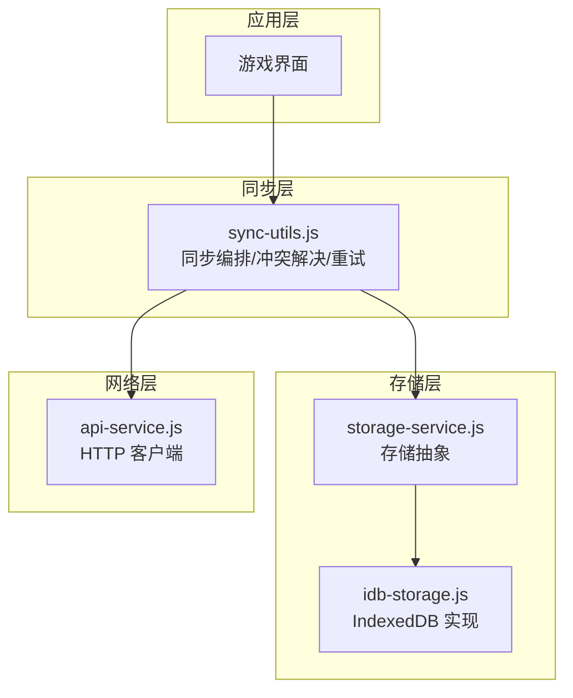
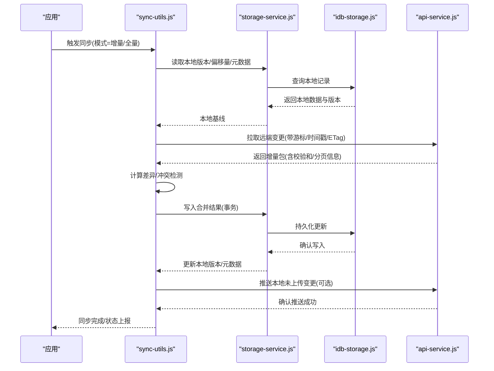
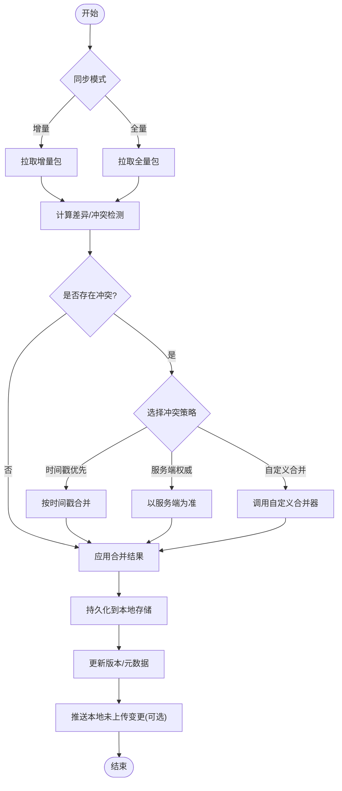
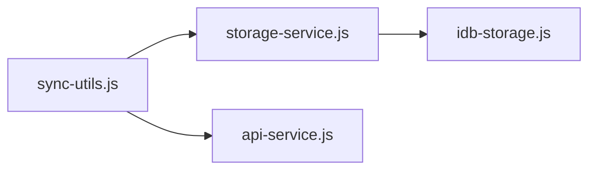

# 数据同步机制

<cite>
**本文引用的文件**   
- [sync-utils.js](file://module/sync-utils.js)
- [storage-service.js](file://module/storage-service.js)
- [idb-storage.js](file://module/idb-storage.js)
- [api-service.js](file://module/api-service.js)
</cite>

## 目录
1. [引言](#引言)
2. [项目结构](#项目结构)
3. [核心组件](#核心组件)
4. [架构总览](#架构总览)
5. [详细组件分析](#详细组件分析)
6. [依赖关系分析](#依赖关系分析)
7. [性能考虑](#性能考虑)
8. [故障排查指南](#故障排查指南)
9. [结论](#结论)
10. [附录](#附录)

## 引言
本技术文档围绕“姬侠传”的数据同步机制展开，重点解析 sync-utils.js 中同步工具的实现原理、冲突解决算法、本地与云端同步策略、断点续传机制、一致性保证与并发控制方案，并提供同步状态监控、错误重试、网络异常处理与离线缓存策略的使用指南。同时给出同步性能优化与带宽控制的实践建议，为分布式数据存储提供完整的技术参考。

## 项目结构
本项目采用模块化前端架构，关键模块职责如下：
- module/sync-utils.js：封装增量/全量同步、冲突检测与合并、队列调度、重试与退避等能力
- module/storage-service.js：统一存储抽象（读写、快照、版本、元数据）
- module/idb-storage.js：IndexedDB 持久化实现（分表、索引、事务）
- module/api-service.js：HTTP 客户端封装（请求、响应、错误码、超时、重试）

图表来源
- [sync-utils.js](file://module/sync-utils.js)
- [storage-service.js](file://module/storage-service.js)
- [idb-storage.js](file://module/idb-storage.js)
- [api-service.js](file://module/api-service.js)

章节来源
- [sync-utils.js](file://module/sync-utils.js)
- [storage-service.js](file://module/storage-service.js)
- [idb-storage.js](file://module/idb-storage.js)
- [api-service.js](file://module/api-service.js)

## 核心组件
- 同步编排器（sync-utils.js）
  - 负责拉取远端变更、计算差异、执行合并、提交本地变更、维护版本号与偏移量
  - 提供批量操作、任务队列、幂等键、去重与冲突标记
- 存储抽象（storage-service.js）
  - 定义统一的 get/set/list/diff/snapshot/checksum 接口
  - 管理本地版本、元数据、快照与回滚点
- IndexedDB 实现（idb-storage.js）
  - 基于对象存储的分片与索引设计，支持范围查询与分页
  - 事务隔离与失败回滚，确保写入原子性
- HTTP 客户端（api-service.js）
  - 封装请求头、鉴权、超时、重试、限流与错误分类
  - 提供断点续传所需的 Range/ETag/Last-Modified 语义支持

章节来源
- [sync-utils.js](file://module/sync-utils.js)
- [storage-service.js](file://module/storage-service.js)
- [idb-storage.js](file://module/idb-storage.js)
- [api-service.js](file://module/api-service.js)

## 架构总览
同步流程由“事件驱动 + 任务队列”驱动，遵循“先拉后推、可中断可恢复”的原则。

图表来源
- [sync-utils.js](file://module/sync-utils.js)
- [storage-service.js](file://module/storage-service.js)
- [idb-storage.js](file://module/idb-storage.js)
- [api-service.js](file://module/api-service.js)

## 详细组件分析

### 同步工具（sync-utils.js）
- 同步模式
  - 增量同步：基于游标/时间戳/ETag 的差量拉取，减少带宽与 CPU 开销
  - 全量同步：在版本漂移过大或检测到不一致时触发，用于修复
- 差异计算与冲突解决
  - 字段级对比：对关键字段进行哈希比对，识别新增、修改、删除
  - 冲突类型：写-写冲突、删除-修改冲突、删除-删除冲突
  - 解决策略：
    - 时间戳优先：以最近更新时间为准
    - 服务端权威：当存在服务端强制覆盖标记时，以服务端为准
    - 合并策略：对可合并字段做并集/交集合并；不可合并字段保留双方并标记人工介入
- 断点续传
  - 拉取侧：通过分页游标与已处理偏移量，支持中断后从上次位置继续
  - 推送侧：按批次提交，每批成功后更新已提交偏移量
- 幂等与去重
  - 为每条变更记录生成幂等键（如 id+version），避免重复提交
  - 本地队列去重，防止同一资源多次入队
- 并发控制
  - 单资源串行：同一资源的写入操作串行化，避免竞态
  - 多资源并行：不同资源可并行处理，提升吞吐
  - 全局限速：令牌桶/滑动窗口限制每秒请求数
- 重试与退避
  - 指数退避 + 抖动，针对网络抖动与服务器过载
  - 最大重试次数与死信队列，失败记录进入待人工处理
- 状态监控
  - 暴露进度、速率、错误统计、队列长度等指标
  - 事件回调：开始、阶段切换、错误、完成

图表来源
- [sync-utils.js](file://module/sync-utils.js)

章节来源
- [sync-utils.js](file://module/sync-utils.js)

### 存储抽象（storage-service.js）
- 接口契约
  - get/set：按主键读写
  - list/query：条件查询与分页
  - diff：计算本地与给定版本的差异
  - snapshot/checksum：创建快照与校验和，用于一致性校验
  - version/meta：获取/设置本地版本与元数据
- 事务与回滚
  - 所有写操作包裹在事务中，失败自动回滚
  - 支持检查点，允许部分失败场景下的最小代价恢复
- 快照与回滚
  - 在重大同步前创建快照，失败时可快速回滚至一致状态

章节来源
- [storage-service.js](file://module/storage-service.js)

### IndexedDB 实现（idb-storage.js）
- 数据结构
  - 资源表：主键、内容、版本、时间戳、标签
  - 变更日志表：操作类型、目标资源、幂等键、状态
  - 元数据表：全局版本、最后同步时间、统计信息
- 索引设计
  - 按时间戳、标签、幂等键建立索引，加速查询与去重
- 事务与并发
  - 使用读/写事务，严格隔离
  - 大对象分片存储，降低单次事务大小

章节来源
- [idb-storage.js](file://module/idb-storage.js)

### HTTP 客户端（api-service.js）
- 请求封装
  - 统一鉴权头、超时、取消信号
  - 支持 Range/If-None-Match/If-Modified-Since 等断点续传相关头
- 错误分类
  - 网络错误、超时、服务端错误、权限错误、数据不一致
- 重试与限流
  - 内置重试策略与全局限流，供上层同步器复用

章节来源
- [api-service.js](file://module/api-service.js)

## 依赖关系分析
- 耦合度
  - sync-utils.js 强依赖 storage-service.js 与 api-service.js
  - storage-service.js 弱依赖具体存储实现（idb-storage.js）
- 内聚性
  - 各模块职责清晰，变更影响面可控
- 外部依赖
  - IndexedDB、Fetch/HTTP 客户端、时间戳/哈希库

图表来源
- [sync-utils.js](file://module/sync-utils.js)
- [storage-service.js](file://module/storage-service.js)
- [idb-storage.js](file://module/idb-storage.js)
- [api-service.js](file://module/api-service.js)

章节来源
- [sync-utils.js](file://module/sync-utils.js)
- [storage-service.js](file://module/storage-service.js)
- [idb-storage.js](file://module/idb-storage.js)
- [api-service.js](file://module/api-service.js)

## 性能考虑
- 增量优先：默认启用增量同步，仅在必要时降级为全量
- 批量与分页：拉取与推送均按批次处理，控制单次负载
- 并发与串行：同资源串行、跨资源并行，最大化吞吐
- 压缩与去重：传输层启用压缩，客户端侧去重减少冗余
- 缓存与预取：热点数据本地缓存，空闲时段预取下一批
- 带宽控制：令牌桶限流，根据网络质量动态调整批次大小
- 内存管理：大对象分片与流式处理，避免峰值内存过高

[本节为通用性能指导，不直接分析具体文件]

## 故障排查指南
- 常见问题定位
  - 同步卡住：检查队列长度、重试计数、是否命中死信队列
  - 数据不一致：比对本地与远端 checksum，必要时触发全量修复
  - 频繁冲突：查看冲突类型分布，评估合并策略是否合理
- 日志与指标
  - 记录每次同步的开始/结束、拉取/推送字节数、错误码、耗时
  - 暴露关键指标：成功率、平均延迟、P95/P99 延迟、重试率
- 恢复策略
  - 断点续传：从上次偏移量继续
  - 快照回滚：重大失败时回滚到最近快照
  - 人工介入：对无法自动解决的冲突，导出差异供人工处理

章节来源
- [sync-utils.js](file://module/sync-utils.js)
- [storage-service.js](file://module/storage-service.js)
- [api-service.js](file://module/api-service.js)

## 结论
本同步机制以“增量优先、可中断可恢复、幂等与去重、冲突可解”为核心原则，结合存储抽象与 HTTP 客户端的能力，实现了高可用、可扩展的数据同步方案。通过合理的并发控制、重试退避与带宽限制，可在复杂网络环境下保持稳定与高效。建议在业务侧完善冲突策略与监控告警，进一步提升系统鲁棒性与可观测性。

[本节为总结性内容，不直接分析具体文件]

## 附录
- 术语
  - 游标：用于增量拉取的偏移标识
  - ETag/Last-Modified：用于条件请求与缓存验证
  - 幂等键：确保重复提交不会产生副作用
  - 死信队列：存放多次重试仍失败的记录
- 最佳实践清单
  - 始终为变更记录分配幂等键
  - 小步快跑：分批提交，缩短事务粒度
  - 明确冲突策略：时间戳优先与服务端权威并存
  - 完善监控：覆盖率、错误分类、性能指标
  - 定期演练：模拟网络异常与数据不一致，验证恢复流程

[本节为补充说明，不直接分析具体文件]