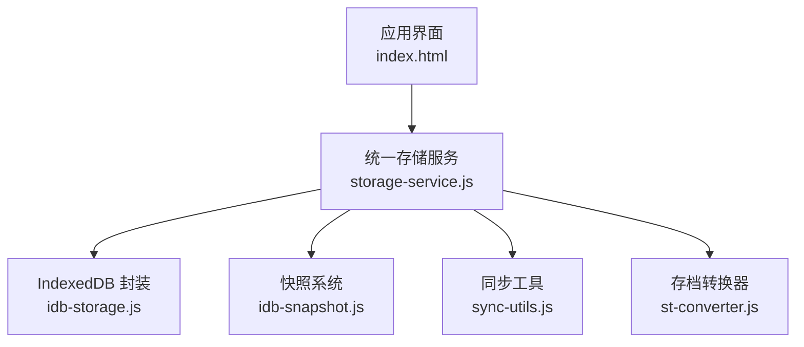
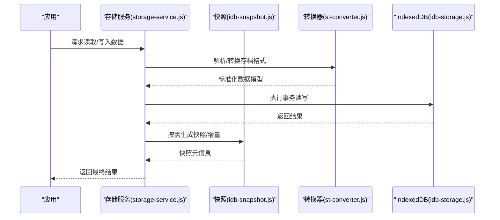
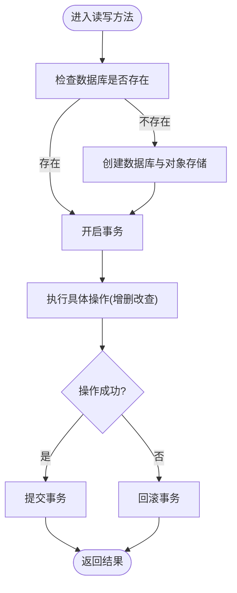
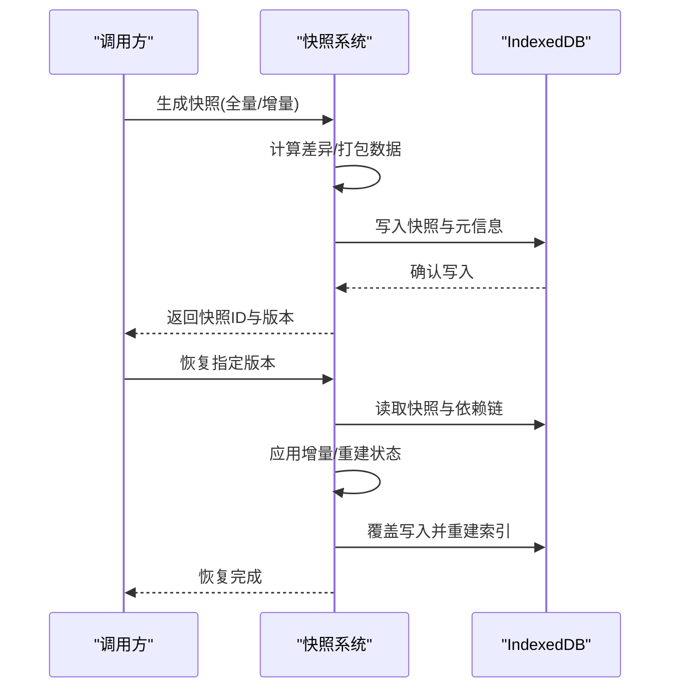
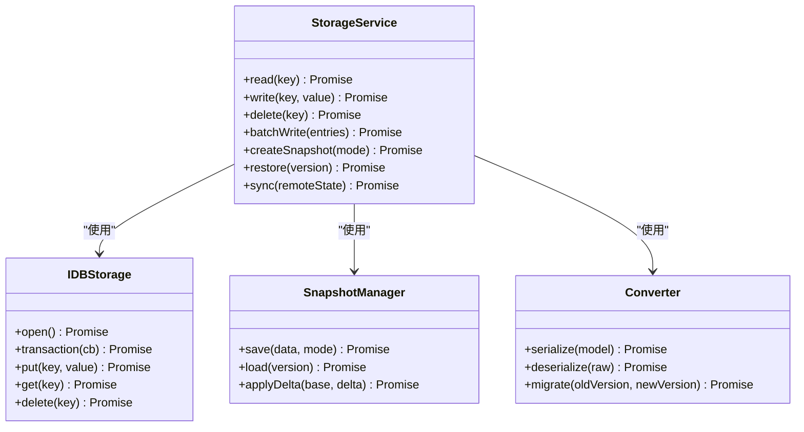
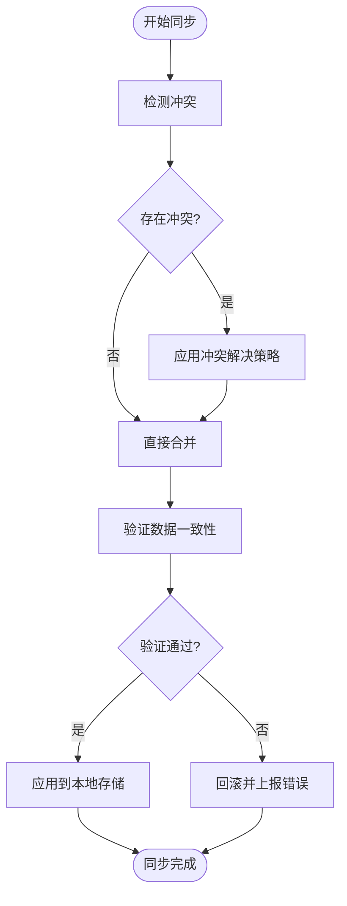
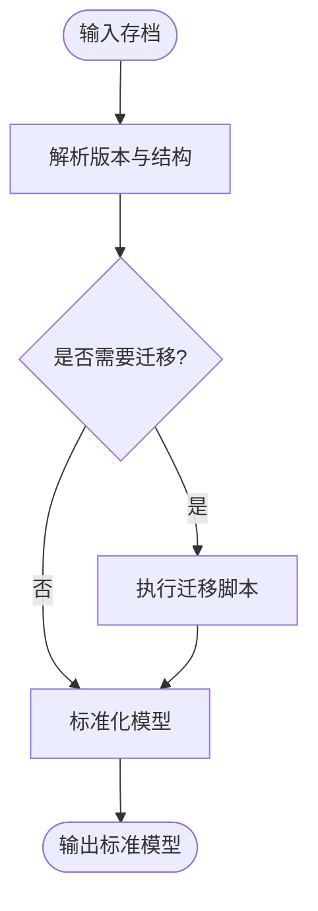
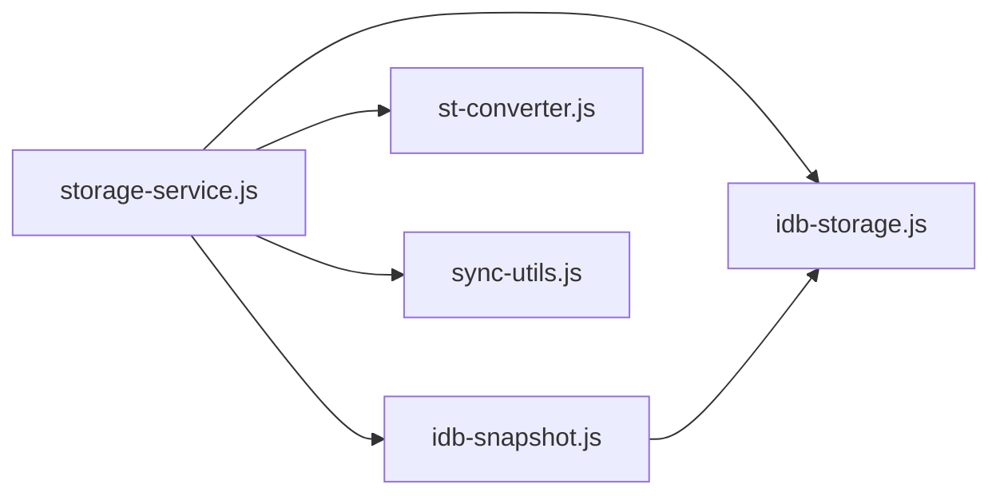

# 数据存储系统

<cite>
**本文引用的文件**   
- [idb-storage.js](file://module/idb-storage.js)
- [idb-snapshot.js](file://module/idb-snapshot.js)
- [storage-service.js](file://module/storage-service.js)
- [sync-utils.js](file://module/sync-utils.js)
- [st-converter.js](file://module/st-converter.js)
- [index.html](file://index.html)
</cite>

## 目录
1. [简介](#简介)
2. [项目结构](#项目结构)
3. [核心组件](#核心组件)
4. [架构总览](#架构总览)
5. [详细组件分析](#详细组件分析)
6. [依赖关系分析](#依赖关系分析)
7. [性能考量](#性能考量)
8. [故障排查指南](#故障排查指南)
9. [结论](#结论)
10. [附录](#附录)

## 简介
本技术文档围绕“姬侠传”数据存储系统展开，重点阐述基于 IndexedDB 的封装设计、统一存储服务接口、存档与恢复机制（快照、增量保存、版本兼容）、数据同步策略与冲突解决算法，以及数据迁移工具与备份恢复实现。文档面向需要实现或维护数据持久化功能的开发者，提供从架构到细节的完整参考。

## 项目结构
数据存储相关代码集中在 module 目录下，关键文件包括：
- idb-storage.js：IndexedDB 底层封装，提供数据库/对象存储的创建、读写、事务与索引能力
- idb-snapshot.js：快照系统，支持全量/增量快照、版本管理与恢复
- storage-service.js：统一存储服务接口，屏蔽底层差异，向上层暴露一致的 API
- sync-utils.js：同步工具，包含冲突检测与合并策略
- st-converter.js：存档格式转换器，负责不同版本的序列化/反序列化和迁移
- index.html：应用入口，初始化并挂载存储服务

**图表来源**
- [index.html](file://index.html)
- [storage-service.js](file://module/storage-service.js)
- [idb-storage.js](file://module/idb-storage.js)
- [idb-snapshot.js](file://module/idb-snapshot.js)
- [sync-utils.js](file://module/sync-utils.js)
- [st-converter.js](file://module/st-converter.js)

**章节来源**
- [index.html](file://index.html)
- [storage-service.js](file://module/storage-service.js)
- [idb-storage.js](file://module/idb-storage.js)
- [idb-snapshot.js](file://module/idb-snapshot.js)
- [sync-utils.js](file://module/sync-utils.js)
- [st-converter.js](file://module/st-converter.js)

## 核心组件
- IndexedDB 封装层（idb-storage.js）
  - 职责：数据库与对象存储的创建、打开、事务管理、CRUD、索引构建与查询
  - 关键点：异步事务封装、错误重试、批量写入优化、索引字段约定
- 快照系统（idb-snapshot.js）
  - 职责：生成全量/增量快照、记录版本元信息、支持按版本恢复与清理旧快照
  - 关键点：快照命名规范、增量差异计算、压缩与分片（可选）、恢复一致性
- 统一存储服务（storage-service.js）
  - 职责：对外暴露一致的数据存取 API，协调快照、转换、同步等子系统
  - 关键点：API 抽象、参数校验、错误归一化、缓存与幂等性
- 同步工具（sync-utils.js）
  - 职责：冲突检测、合并策略、增量同步、回滚保障
  - 关键点：操作日志、向量时钟/时间戳、冲突消解规则
- 存档转换器（st-converter.js）
  - 职责：多版本存档格式的序列化/反序列化、字段映射与迁移
  - 关键点：版本兼容性矩阵、迁移脚本、回退策略

**章节来源**
- [idb-storage.js](file://module/idb-storage.js)
- [idb-snapshot.js](file://module/idb-snapshot.js)
- [storage-service.js](file://module/storage-service.js)
- [sync-utils.js](file://module/sync-utils.js)
- [st-converter.js](file://module/st-converter.js)

## 架构总览
整体采用分层架构：上层业务通过统一存储服务访问数据；中间层协调快照、同步与转换；底层由 IndexedDB 封装提供持久化能力。该设计实现了关注点分离与高内聚低耦合。

**图表来源**
- [storage-service.js](file://module/storage-service.js)
- [idb-snapshot.js](file://module/idb-snapshot.js)
- [st-converter.js](file://module/st-converter.js)
- [idb-storage.js](file://module/idb-storage.js)

## 详细组件分析

### IndexedDB 封装层（idb-storage.js）
- 设计要点
  - 数据库与对象存储的懒创建与版本升级
  - 事务封装：自动开启/提交/回滚，异常捕获与重试
  - 批量操作：减少事务开销，提升写入吞吐
  - 索引策略：为高频查询字段建立索引，避免全表扫描
- 复杂度与优化
  - 读操作 O(log n) 使用索引；写操作批量合并降低 I/O
  - 大对象分块存储，避免单次事务过大导致超时
- 错误处理
  - 区分权限错误、空间不足、版本不匹配等场景
  - 提供降级策略与用户提示

**图表来源**
- [idb-storage.js](file://module/idb-storage.js)

**章节来源**
- [idb-storage.js](file://module/idb-storage.js)

### 快照系统（idb-snapshot.js）
- 功能概述
  - 全量快照：保存当前完整状态，便于快速恢复
  - 增量快照：仅保存变更部分，节省空间与时间
  - 版本管理：记录版本号、时间戳、元数据，支持按版本恢复
- 恢复流程
  - 选择目标版本，加载快照元信息
  - 若为增量，需先加载基线快照再应用增量
  - 验证完整性后写入 IndexedDB 并重建索引
- 清理策略
  - 保留最近 N 个快照，删除过期快照释放空间

**图表来源**
- [idb-snapshot.js](file://module/idb-snapshot.js)
- [idb-storage.js](file://module/idb-storage.js)

**章节来源**
- [idb-snapshot.js](file://module/idb-snapshot.js)

### 统一存储服务（storage-service.js）
- 接口设计
  - 统一的 CRUD 接口，屏蔽 IndexedDB 与快照的差异
  - 参数校验与错误归一化，保证上层调用一致性
  - 可选缓存层，提高热点数据读取性能
- 与子系统集成
  - 调用转换器进行版本兼容
  - 在关键操作后触发快照生成
  - 同步时调用冲突检测与合并逻辑

**图表来源**
- [storage-service.js](file://module/storage-service.js)
- [idb-storage.js](file://module/idb-storage.js)
- [idb-snapshot.js](file://module/idb-snapshot.js)
- [st-converter.js](file://module/st-converter.js)

**章节来源**
- [storage-service.js](file://module/storage-service.js)

### 同步工具（sync-utils.js）
- 冲突检测
  - 基于时间戳或向量时钟识别并发修改
  - 标记冲突区域以便上层决策
- 合并策略
  - 字段级合并：按优先级或最后写入优先
  - 列表合并：去重、顺序保持、新增/删除追踪
- 回滚保障
  - 同步前生成临时快照
  - 失败时自动回滚至同步前状态

**图表来源**
- [sync-utils.js](file://module/sync-utils.js)

**章节来源**
- [sync-utils.js](file://module/sync-utils.js)

### 存档转换器（st-converter.js）
- 版本兼容
  - 定义版本矩阵，支持向前/向后迁移
  - 字段映射与默认值填充
- 序列化/反序列化
  - 结构化数据转存格式，确保可移植性
  - 反序列化时进行类型校验与修复
- 迁移脚本
  - 针对大版本升级提供迁移路径
  - 支持增量迁移与回退

**图表来源**
- [st-converter.js](file://module/st-converter.js)

**章节来源**
- [st-converter.js](file://module/st-converter.js)

## 依赖关系分析
- 模块耦合
  - storage-service.js 作为门面，依赖 idb-storage.js、idb-snapshot.js、st-converter.js、sync-utils.js
  - idb-snapshot.js 与 idb-storage.js 紧密耦合，共享事务与索引策略
  - sync-utils.js 独立性强，主要依赖数据结构与比较逻辑
- 外部依赖
  - IndexedDB 浏览器 API
  - 可选压缩库（用于快照体积优化）
- 潜在循环依赖
  - 通过门面模式避免循环引用，所有子系统被 storage-service.js 统一管理

**图表来源**
- [storage-service.js](file://module/storage-service.js)
- [idb-storage.js](file://module/idb-storage.js)
- [idb-snapshot.js](file://module/idb-snapshot.js)
- [st-converter.js](file://module/st-converter.js)
- [sync-utils.js](file://module/sync-utils.js)

**章节来源**
- [storage-service.js](file://module/storage-service.js)
- [idb-storage.js](file://module/idb-storage.js)
- [idb-snapshot.js](file://module/idb-snapshot.js)
- [st-converter.js](file://module/st-converter.js)
- [sync-utils.js](file://module/sync-utils.js)

## 性能考量
- 事务与批处理
  - 合并多次写入为单次事务，减少锁竞争与 I/O 次数
  - 对大数据集采用分块写入，避免主线程阻塞
- 索引与查询
  - 为常用过滤字段建立复合索引，避免排序与全表扫描
  - 分页查询结合游标，降低内存占用
- 快照与增量
  - 增量快照仅记录变更键集合与差异值，显著减小体积
  - 定期合并增量快照为全量快照，简化恢复路径
- 缓存策略
  - 热点数据在内存中缓存，设置 TTL 与失效策略
  - 读写分离：读路径优先命中缓存，写路径更新缓存与持久化

[本节为通用性能建议，不直接分析具体文件]

## 故障排查指南
- 常见问题
  - 数据库版本不匹配：检查升级脚本与对象存储结构
  - 空间不足：清理旧快照与归档历史数据
  - 事务超时：拆分大事务，优化索引与查询条件
- 诊断步骤
  - 启用详细日志，记录事务生命周期与错误堆栈
  - 校验快照完整性，必要时重新生成基线快照
  - 对比冲突区域，定位并发修改来源
- 恢复策略
  - 使用最近可用快照恢复
  - 对损坏数据进行字段级修复与默认值回填

**章节来源**
- [idb-storage.js](file://module/idb-storage.js)
- [idb-snapshot.js](file://module/idb-snapshot.js)
- [sync-utils.js](file://module/sync-utils.js)

## 结论
本数据存储系统通过分层设计与模块化实现，提供了稳定高效的 IndexedDB 封装、完善的快照与恢复机制、灵活的同步与冲突解决策略，以及强大的版本兼容与迁移能力。遵循本文档的最佳实践，开发者可在复杂业务场景下实现可靠的数据持久化方案。

[本节为总结性内容，不直接分析具体文件]

## 附录
- 最佳实践清单
  - 始终使用事务包裹写操作，确保一致性
  - 为高频查询字段建立索引，避免全表扫描
  - 增量快照配合定期全量快照，平衡恢复速度与存储成本
  - 同步前生成临时快照，失败自动回滚
  - 严格版本管理，提供迁移脚本与回退路径
- 扩展建议
  - 引入压缩与加密以优化体积与安全
  - 增加监控指标（事务耗时、错误率、快照大小）
  - 支持多租户隔离与权限控制

[本节为补充说明，不直接分析具体文件]