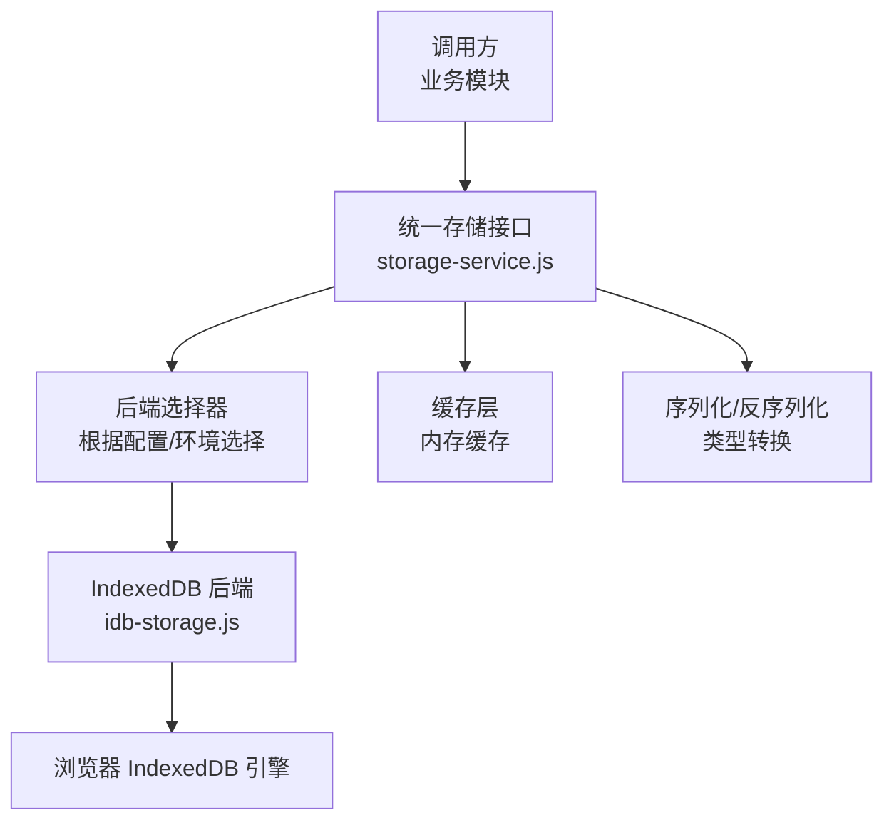
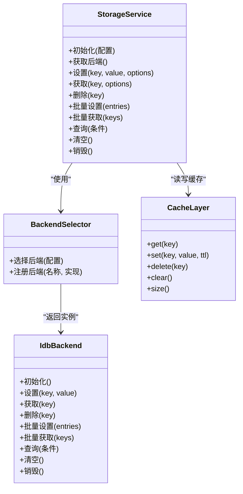
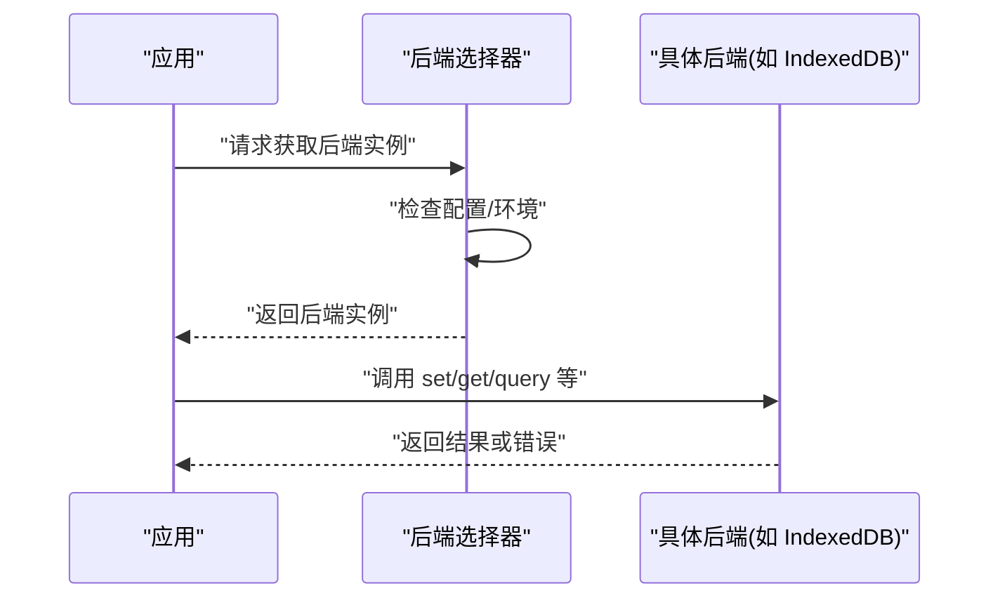
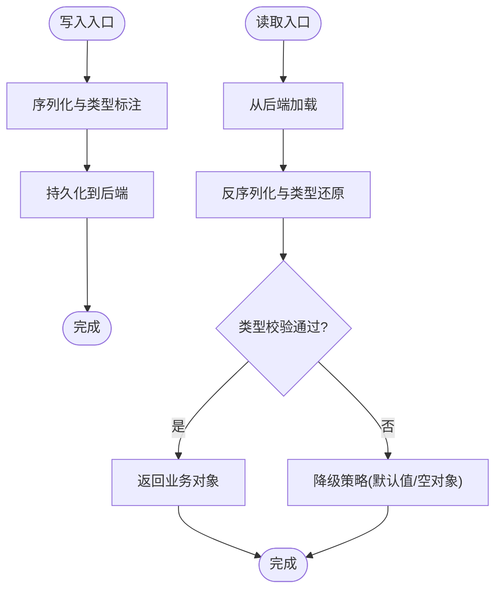
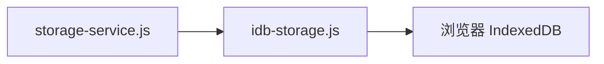

# 统一存储服务接口

<cite>
**本文引用的文件**   
- [storage-service.js](file://module/storage-service.js)
- [idb-storage.js](file://module/idb-storage.js)
</cite>

## 目录
1. [简介](#简介)
2. [项目结构](#项目结构)
3. [核心组件](#核心组件)
4. [架构总览](#架构总览)
5. [详细组件分析](#详细组件分析)
6. [依赖分析](#依赖分析)
7. [性能考虑](#性能考虑)
8. [故障排查指南](#故障排查指南)
9. [结论](#结论)
10. [附录：扩展新存储后端开发指南](#附录扩展新存储后端开发指南)

## 简介
本技术文档围绕“姬侠传统一”项目的统一存储服务接口展开，重点解析 storage-service.js 中抽象存储层的设计模式与接口规范，说明工厂模式实现与后端切换机制，阐述数据序列化、反序列化与类型转换策略，提供统一的 CRUD 操作与高级查询方法，解释缓存策略与内存管理机制，并给出错误处理与降级方案。文末包含为扩展新的存储后端提供完整开发指南。

## 项目结构
本项目采用模块化组织方式，存储相关能力集中在 module 目录下：
- storage-service.js：定义统一存储接口、工厂与后端选择逻辑，封装序列化/反序列化与类型转换，提供 CRUD 与高级查询，内置缓存与降级策略。
- idb-storage.js：基于 IndexedDB 的持久化后端实现，作为默认后端。

图表来源
- [storage-service.js](file://module/storage-service.js)
- [idb-storage.js](file://module/idb-storage.js)

章节来源
- [storage-service.js](file://module/storage-service.js)
- [idb-storage.js](file://module/idb-storage.js)

## 核心组件
- 抽象存储接口：定义统一的键值存取、批量读写、事务与查询语义。
- 工厂与后端切换：依据运行环境或配置动态创建具体后端实例（如 IndexedDB）。
- 序列化与类型转换：在写入前进行安全序列化与类型标注，读取后进行类型还原与校验。
- 缓存层：对热点数据进行内存缓存，减少重复 I/O。
- 统一 CRUD 与高级查询：提供 create/read/update/delete 以及条件过滤、分页、排序等能力。
- 错误处理与降级：捕获底层异常，返回标准化错误对象；在后端不可用时回退到内存或提示用户。

章节来源
- [storage-service.js](file://module/storage-service.js)
- [idb-storage.js](file://module/idb-storage.js)

## 架构总览
统一存储层位于业务模块与具体持久化后端之间，通过工厂模式屏蔽后端差异，向上暴露一致 API。

图表来源
- [storage-service.js](file://module/storage-service.js)
- [idb-storage.js](file://module/idb-storage.js)

## 详细组件分析

### 抽象存储层设计与接口规范
- 接口职责边界清晰：上层只关心键值与查询语义，不感知底层存储细节。
- 方法签名稳定：所有读写方法均支持可选参数（如 TTL、是否跳过缓存、是否强制刷新等），便于扩展。
- 返回值规范化：成功返回结构化结果，失败返回标准错误对象，包含错误码与消息。

章节来源
- [storage-service.js](file://module/storage-service.js)

### 工厂模式与后端切换机制
- 工厂负责根据配置或运行时环境选择合适后端（例如浏览器环境优先使用 IndexedDB）。
- 支持动态注册新后端，避免修改核心逻辑即可接入新实现。
- 切换过程透明：上层调用无需改动。

图表来源
- [storage-service.js](file://module/storage-service.js)
- [idb-storage.js](file://module/idb-storage.js)

章节来源
- [storage-service.js](file://module/storage-service.js)
- [idb-storage.js](file://module/idb-storage.js)

### 数据序列化、反序列化与类型转换策略
- 写入路径：对象 -> 安全序列化 -> 附加元数据（类型、时间戳） -> 持久化。
- 读取路径：持久化 -> 反序列化 -> 类型还原与校验 -> 返回业务对象。
- 类型系统：对常见类型（字符串、数字、布尔、数组、对象、日期、空值）进行显式标注与恢复，避免 JSON 丢失类型信息。
- 兼容性：向后兼容旧格式，遇到未知字段时忽略或降级处理。

图表来源
- [storage-service.js](file://module/storage-service.js)

章节来源
- [storage-service.js](file://module/storage-service.js)

### 统一 CRUD 与高级查询
- CRUD：
  - 创建：设置键值，支持覆盖策略与版本控制。
  - 读取：按 key 精确读取，支持缓存命中与强制刷新。
  - 更新：增量更新或全量替换，支持并发冲突检测。
  - 删除：单条删除与批量删除。
- 高级查询：
  - 条件过滤：支持多字段组合条件。
  - 分页与排序：支持页大小、偏移、排序键。
  - 聚合统计：计数、求和、最大值/最小值等。

章节来源
- [storage-service.js](file://module/storage-service.js)
- [idb-storage.js](file://module/idb-storage.js)

### 缓存策略与内存管理
- 缓存粒度：以 key 为单位，支持 TTL 过期策略。
- 一致性：写操作可选择性失效相关缓存键，保证读一致性。
- 容量控制：限制缓存条目数量与总内存占用，LRU 淘汰策略。
- 监控：暴露缓存命中率、大小、淘汰次数等指标。

章节来源
- [storage-service.js](file://module/storage-service.js)

### 错误处理与降级方案
- 错误分类：网络/IO 错误、权限错误、数据损坏、超时等。
- 标准化错误对象：包含错误码、错误消息、上下文信息。
- 降级策略：
  - 后端不可用：回退到内存缓存或提示用户。
  - 数据损坏：尝试修复或丢弃损坏记录并告警。
  - 性能退化：自动降低缓存 TTL 或关闭部分功能。

章节来源
- [storage-service.js](file://module/storage-service.js)
- [idb-storage.js](file://module/idb-storage.js)

## 依赖分析
- 内部依赖：
  - storage-service.js 依赖 idb-storage.js 作为默认后端。
  - 两者共同构成“接口-实现”解耦结构。
- 外部依赖：
  - 浏览器 IndexedDB API（由 idb-storage.js 封装）。
- 耦合度与内聚性：
  - 接口层与实现层低耦合，新增后端不影响现有调用方。
  - 各组件职责单一，内聚性强。

图表来源
- [storage-service.js](file://module/storage-service.js)
- [idb-storage.js](file://module/idb-storage.js)

章节来源
- [storage-service.js](file://module/storage-service.js)
- [idb-storage.js](file://module/idb-storage.js)

## 性能考虑
- 批量操作：尽量使用批量设置/获取以减少 I/O 次数。
- 索引优化：对高频查询字段建立索引（由后端实现负责）。
- 缓存命中：合理设置 TTL 与预热热点数据。
- 内存控制：限制缓存大小，避免 OOM。
- 异步与并发：利用 Promise/异步队列避免阻塞主线程。

[本节为通用指导，不涉及具体文件分析]

## 故障排查指南
- 常见问题定位：
  - 后端初始化失败：检查权限与环境支持。
  - 数据读取为空：确认 key 是否存在、是否被清理或过期。
  - 类型还原失败：检查序列化元数据是否完整。
- 日志与诊断：
  - 记录关键操作的耗时与错误堆栈。
  - 暴露缓存命中率与后端状态指标。
- 恢复步骤：
  - 清理损坏数据并重建索引。
  - 重启服务或重置后端连接。

章节来源
- [storage-service.js](file://module/storage-service.js)
- [idb-storage.js](file://module/idb-storage.js)

## 结论
统一存储服务通过抽象接口与工厂模式实现了后端无关的存储访问，结合序列化/类型转换、缓存与错误降级，提供了稳定高效的 CRUD 与高级查询能力。该设计易于扩展与维护，适合在多后端场景下演进。

[本节为总结，不涉及具体文件分析]

## 附录：扩展新存储后端开发指南
- 目标：在不修改上层调用代码的前提下，新增一个存储后端（如本地文件系统、云存储、内存数据库等）。
- 步骤：
  1. 新建后端实现文件（例如 my-backend.js），遵循统一接口约定：
     - 初始化：连接资源、准备表/桶/命名空间。
     - 基本操作：设置、获取、删除、批量设置、批量获取。
     - 查询：条件过滤、分页、排序、聚合。
     - 生命周期：清空、销毁、健康检查。
  2. 注册后端：
     - 在工厂中添加新后端名称与构造函数映射。
     - 支持按配置或环境变量选择新后端。
  3. 序列化与类型：
     - 复用现有序列化/反序列化工具，确保类型标注一致。
  4. 缓存适配：
     - 若后端自带缓存，需与内存缓存协调，避免双重缓存不一致。
  5. 错误处理：
     - 将底层错误转换为标准错误对象。
     - 实现必要的降级策略（如回退到内存）。
  6. 测试与验证：
     - 编写单元测试覆盖 CRUD、查询、错误与边界情况。
     - 进行性能基准测试，对比默认后端。
  7. 文档与示例：
     - 补充使用示例与配置项说明。
- 注意事项：
  - 保持接口稳定性，避免破坏性变更。
  - 关注并发与事务语义，确保数据一致性。
  - 做好资源释放与连接池管理。

章节来源
- [storage-service.js](file://module/storage-service.js)
- [idb-storage.js](file://module/idb-storage.js)