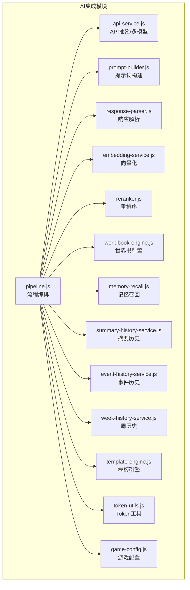
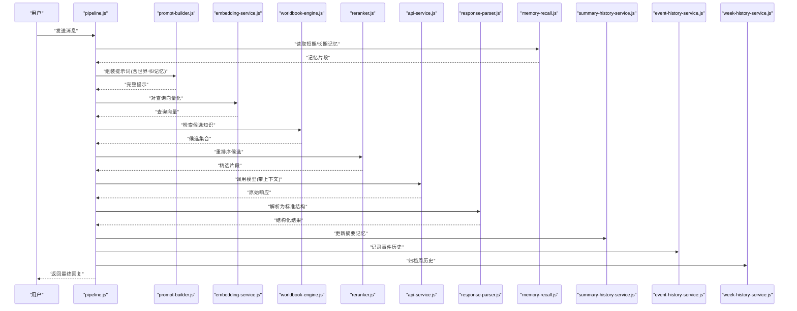
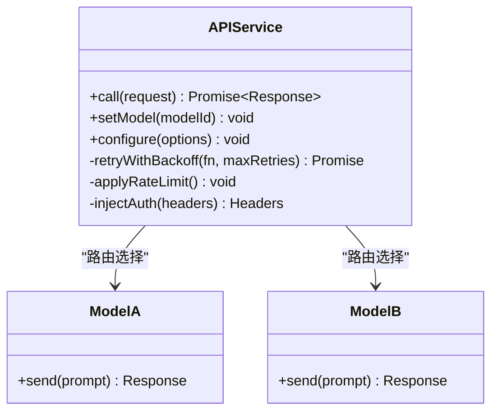
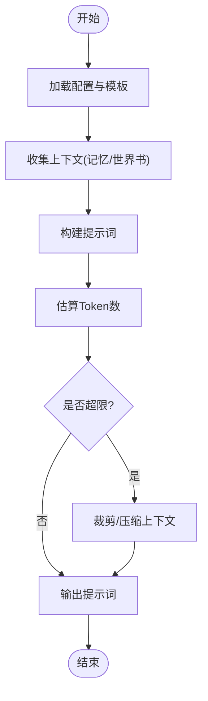
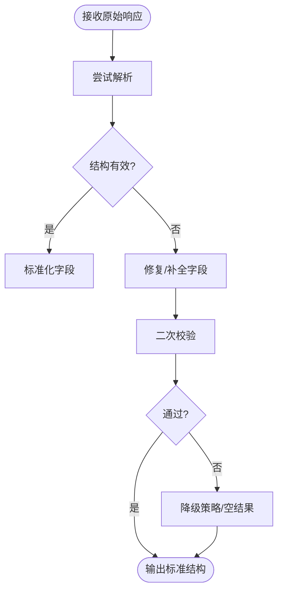
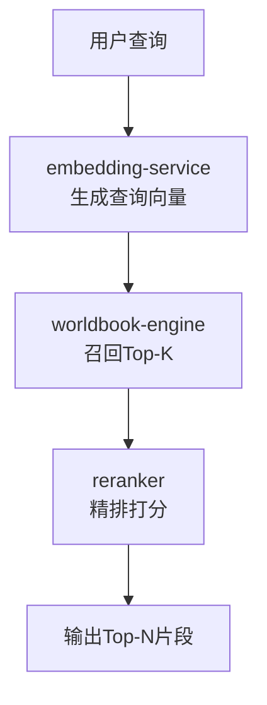
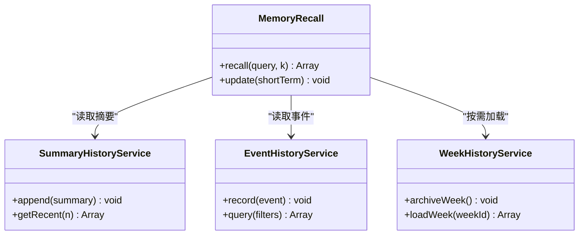
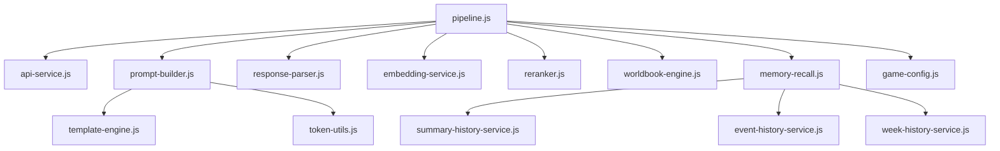

# AI集成架构

<cite>
**本文引用的文件**   
- [module/pipeline.js](file://module/pipeline.js)
- [module/api-service.js](file://module/api-service.js)
- [module/prompt-builder.js](file://module/prompt-builder.js)
- [module/response-parser.js](file://module/response-parser.js)
- [module/embedding-service.js](file://module/embedding-service.js)
- [module/reranker.js](file://module/reranker.js)
- [module/memory-recall.js](file://module/memory-recall.js)
- [module/summary-history-service.js](file://module/summary-history-service.js)
- [module/event-history-service.js](file://module/event-history-service.js)
- [module/week-history-service.js](file://module/week-history-service.js)
- [module/worldbook-engine.js](file://module/worldbook-engine.js)
- [module/template-engine.js](file://module/template-engine.js)
- [module/token-utils.js](file://module/token-utils.js)
- [module/game-config.js](file://module/game-config.js)
</cite>

## 目录
1. [引言](#引言)
2. [项目结构](#项目结构)
3. [核心组件](#核心组件)
4. [架构总览](#架构总览)
5. [详细组件分析](#详细组件分析)
6. [依赖关系分析](#依赖关系分析)
7. [性能考虑](#性能考虑)
8. [故障排查指南](#故障排查指南)
9. [结论](#结论)
10. [附录](#附录)

## 引言
本架构文档面向“姬侠传AI集成系统”，聚焦于AI服务集成的整体设计，涵盖提示词构建器、响应解析器、向量检索服务与重排序算法的协作机制；解释API服务层的抽象设计与多模型支持；说明上下文管理与记忆系统的实现原理；并给出错误重试、性能优化与安全考虑。文末提供AI对话流程图与数据处理管道图，帮助读者快速理解端到端的数据流转。

## 项目结构
本项目采用模块化前端架构，AI相关能力集中在 module 目录下，按职责划分：
- 流程编排：pipeline.js
- API抽象与多模型适配：api-service.js
- 提示词工程：prompt-builder.js、template-engine.js、token-utils.js
- 响应处理：response-parser.js
- 检索增强：embedding-service.js、reranker.js、worldbook-engine.js
- 记忆与上下文：memory-recall.js、summary-history-service.js、event-history-service.js、week-history-service.js
- 配置：game-config.js

图表来源
- [module/pipeline.js](file://module/pipeline.js)
- [module/api-service.js](file://module/api-service.js)
- [module/prompt-builder.js](file://module/prompt-builder.js)
- [module/response-parser.js](file://module/response-parser.js)
- [module/embedding-service.js](file://module/embedding-service.js)
- [module/reranker.js](file://module/reranker.js)
- [module/worldbook-engine.js](file://module/worldbook-engine.js)
- [module/memory-recall.js](file://module/memory-recall.js)
- [module/summary-history-service.js](file://module/summary-history-service.js)
- [module/event-history-service.js](file://module/event-history-service.js)
- [module/week-history-service.js](file://module/week-history-service.js)
- [module/template-engine.js](file://module/template-engine.js)
- [module/token-utils.js](file://module/token-utils.js)
- [module/game-config.js](file://module/game-config.js)

章节来源
- [module/pipeline.js](file://module/pipeline.js)
- [module/api-service.js](file://module/api-service.js)
- [module/prompt-builder.js](file://module/prompt-builder.js)
- [module/response-parser.js](file://module/response-parser.js)
- [module/embedding-service.js](file://module/embedding-service.js)
- [module/reranker.js](file://module/reranker.js)
- [module/worldbook-engine.js](file://module/worldbook-engine.js)
- [module/memory-recall.js](file://module/memory-recall.js)
- [module/summary-history-service.js](file://module/summary-history-service.js)
- [module/event-history-service.js](file://module/event-history-service.js)
- [module/week-history-service.js](file://module/week-history-service.js)
- [module/template-engine.js](file://module/template-engine.js)
- [module/token-utils.js](file://module/token-utils.js)
- [module/game-config.js](file://module/game-config.js)

## 核心组件
- 流程编排（pipeline）：串联提示词构建、检索增强、模型调用、响应解析与记忆更新等步骤，形成可插拔的对话流水线。
- API服务层（api-service）：抽象统一的多模型接口，屏蔽底层差异，支持动态路由与策略选择。
- 提示词构建器（prompt-builder）：组合系统指令、角色设定、世界书片段、近期记忆与用户输入，生成结构化提示。
- 响应解析器（response-parser）：将模型输出标准化为内部数据结构，便于后续动作执行与UI渲染。
- 向量检索（embedding-service + reranker）：对用户查询进行向量化，从知识库召回候选，再经重排序提升相关性。
- 记忆系统（memory-recall + summary/event/week history）：维护长期与短期记忆，控制上下文窗口大小与成本。
- 世界书引擎（worldbook-engine）：管理知识条目、标签与检索索引，支撑RAG。
- 模板引擎（template-engine）：提供可配置的提示词模板与变量替换。
- Token工具（token-utils）：估算与裁剪上下文长度，保障稳定调用。
- 配置（game-config）：集中管理模型参数、检索阈值、重排序策略等。

章节来源
- [module/pipeline.js](file://module/pipeline.js)
- [module/api-service.js](file://module/api-service.js)
- [module/prompt-builder.js](file://module/prompt-builder.js)
- [module/response-parser.js](file://module/response-parser.js)
- [module/embedding-service.js](file://module/embedding-service.js)
- [module/reranker.js](file://module/reranker.js)
- [module/worldbook-engine.js](file://module/worldbook-engine.js)
- [module/memory-recall.js](file://module/memory-recall.js)
- [module/summary-history-service.js](file://module/summary-history-service.js)
- [module/event-history-service.js](file://module/event-history-service.js)
- [module/week-history-service.js](file://module/week-history-service.js)
- [module/template-engine.js](file://module/template-engine.js)
- [module/token-utils.js](file://module/token-utils.js)
- [module/game-config.js](file://module/game-config.js)

## 架构总览
下图展示一次AI对话的端到端流程：从用户输入到最终回复，贯穿提示词构建、检索增强、模型调用、响应解析与记忆更新。

图表来源
- [module/pipeline.js](file://module/pipeline.js)
- [module/prompt-builder.js](file://module/prompt-builder.js)
- [module/embedding-service.js](file://module/embedding-service.js)
- [module/worldbook-engine.js](file://module/worldbook-engine.js)
- [module/reranker.js](file://module/reranker.js)
- [module/api-service.js](file://module/api-service.js)
- [module/response-parser.js](file://module/response-parser.js)
- [module/memory-recall.js](file://module/memory-recall.js)
- [module/summary-history-service.js](file://module/summary-history-service.js)
- [module/event-history-service.js](file://module/event-history-service.js)
- [module/week-history-service.js](file://module/week-history-service.js)

## 详细组件分析

### API服务层抽象与多模型支持
- 统一接口：对外暴露一致的请求/响应契约，内部根据配置选择不同模型后端。
- 策略路由：依据任务类型、延迟预算或成本策略选择最优模型。
- 重试与降级：内置指数退避重试、熔断与回退策略，保障稳定性。
- 鉴权与限流：封装密钥注入、速率限制与配额检查。

图表来源
- [module/api-service.js](file://module/api-service.js)

章节来源
- [module/api-service.js](file://module/api-service.js)

### 提示词构建器与模板引擎
- 构建策略：将系统指令、角色设定、世界书片段、近期记忆与用户输入拼接为结构化提示。
- 模板化：通过模板引擎进行变量替换与条件渲染，提高可维护性。
- Token控制：结合token工具进行长度估算与裁剪，避免超限。

图表来源
- [module/prompt-builder.js](file://module/prompt-builder.js)
- [module/template-engine.js](file://module/template-engine.js)
- [module/token-utils.js](file://module/token-utils.js)

章节来源
- [module/prompt-builder.js](file://module/prompt-builder.js)
- [module/template-engine.js](file://module/template-engine.js)
- [module/token-utils.js](file://module/token-utils.js)

### 响应解析器
- 规范化：将不同模型的输出格式统一为内部结构，便于下游消费。
- 容错：对不完整JSON、字段缺失等进行修复与兜底。
- 校验：基于schema校验关键字段，失败时触发重试或降级。

图表来源
- [module/response-parser.js](file://module/response-parser.js)

章节来源
- [module/response-parser.js](file://module/response-parser.js)

### 向量检索与重排序
- 向量化：将用户查询转换为稠密向量。
- 召回：从世界书索引中检索Top-K候选。
- 重排：使用交叉编码器或规则打分对候选进行精排，输出高相关片段。

图表来源
- [module/embedding-service.js](file://module/embedding-service.js)
- [module/worldbook-engine.js](file://module/worldbook-engine.js)
- [module/reranker.js](file://module/reranker.js)

章节来源
- [module/embedding-service.js](file://module/embedding-service.js)
- [module/worldbook-engine.js](file://module/worldbook-engine.js)
- [module/reranker.js](file://module/reranker.js)

### 上下文管理与记忆系统
- 短期记忆：最近对话轮次与关键事实，用于即时上下文。
- 长期记忆：摘要历史与事件历史，跨会话持久化。
- 周历史：周期性归档，降低存储与检索压力。
- 记忆召回：在构建提示前按需拉取最相关的记忆片段。

图表来源
- [module/memory-recall.js](file://module/memory-recall.js)
- [module/summary-history-service.js](file://module/summary-history-service.js)
- [module/event-history-service.js](file://module/event-history-service.js)
- [module/week-history-service.js](file://module/week-history-service.js)

章节来源
- [module/memory-recall.js](file://module/memory-recall.js)
- [module/summary-history-service.js](file://module/summary-history-service.js)
- [module/event-history-service.js](file://module/event-history-service.js)
- [module/week-history-service.js](file://module/week-history-service.js)

### 数据处理管道图
从输入到输出的数据转换链路如下：

图表来源
- [module/pipeline.js](file://module/pipeline.js)
- [module/prompt-builder.js](file://module/prompt-builder.js)
- [module/api-service.js](file://module/api-service.js)
- [module/response-parser.js](file://module/response-parser.js)
- [module/memory-recall.js](file://module/memory-recall.js)
- [module/summary-history-service.js](file://module/summary-history-service.js)
- [module/event-history-service.js](file://module/event-history-service.js)
- [module/week-history-service.js](file://module/week-history-service.js)

## 依赖关系分析
- pipeline作为编排中心，依赖所有子模块完成一次对话闭环。
- api-service解耦具体模型实现，支持热切换与策略路由。
- embedding-service与worldbook-engine协同完成RAG召回，reranker负责精排。
- memory系列服务共同维护不同粒度的上下文，供prompt-builder与pipeline调度。

图表来源
- [module/pipeline.js](file://module/pipeline.js)
- [module/api-service.js](file://module/api-service.js)
- [module/prompt-builder.js](file://module/prompt-builder.js)
- [module/response-parser.js](file://module/response-parser.js)
- [module/embedding-service.js](file://module/embedding-service.js)
- [module/reranker.js](file://module/reranker.js)
- [module/worldbook-engine.js](file://module/worldbook-engine.js)
- [module/memory-recall.js](file://module/memory-recall.js)
- [module/summary-history-service.js](file://module/summary-history-service.js)
- [module/event-history-service.js](file://module/event-history-service.js)
- [module/week-history-service.js](file://module/week-history-service.js)
- [module/template-engine.js](file://module/template-engine.js)
- [module/token-utils.js](file://module/token-utils.js)
- [module/game-config.js](file://module/game-config.js)

章节来源
- [module/pipeline.js](file://module/pipeline.js)
- [module/api-service.js](file://module/api-service.js)
- [module/prompt-builder.js](file://module/prompt-builder.js)
- [module/response-parser.js](file://module/response-parser.js)
- [module/embedding-service.js](file://module/embedding-service.js)
- [module/reranker.js](file://module/reranker.js)
- [module/worldbook-engine.js](file://module/worldbook-engine.js)
- [module/memory-recall.js](file://module/memory-recall.js)
- [module/summary-history-service.js](file://module/summary-history-service.js)
- [module/event-history-service.js](file://module/event-history-service.js)
- [module/week-history-service.js](file://module/week-history-service.js)
- [module/template-engine.js](file://module/template-engine.js)
- [module/token-utils.js](file://module/token-utils.js)
- [module/game-config.js](file://module/game-config.js)

## 性能考虑
- 缓存与复用：对embedding结果与高频检索片段做缓存，减少重复计算。
- 批处理与并行：在安全范围内并发调用检索与重排序，缩短端到端延迟。
- 上下文裁剪：基于token工具动态裁剪历史与检索片段，平衡质量与成本。
- 模型选择：根据任务复杂度与SLA选择轻量或高质量模型，降低成本。
- 增量更新：记忆与历史采用增量写入与定期归档，避免全量重建。

[本节为通用指导，不直接分析具体文件]

## 故障排查指南
- 常见错误
  - 模型调用超时/限流：检查api-service的重试与熔断策略，确认配额与速率限制。
  - 解析失败：查看response-parser的修复与兜底逻辑，定位字段缺失或格式异常。
  - 检索无关：调整embedding维度、召回Top-K与reranker权重，验证worldbook索引质量。
  - 上下文溢出：使用token-utils估算并裁剪，必要时启用更激进的压缩策略。
- 诊断建议
  - 在pipeline各阶段打印中间态（提示词、候选、评分、解析结果）。
  - 开启详细日志，记录耗时与错误堆栈，定位瓶颈与异常点。
  - 对关键路径添加健康检查与告警（如解析成功率、平均延迟）。

章节来源
- [module/api-service.js](file://module/api-service.js)
- [module/response-parser.js](file://module/response-parser.js)
- [module/embedding-service.js](file://module/embedding-service.js)
- [module/reranker.js](file://module/reranker.js)
- [module/worldbook-engine.js](file://module/worldbook-engine.js)
- [module/token-utils.js](file://module/token-utils.js)
- [module/pipeline.js](file://module/pipeline.js)

## 结论
本架构以pipeline为核心，将提示词构建、检索增强、模型调用与响应解析有机串联，并通过api-service实现多模型抽象与弹性策略。记忆系统与worldbook引擎共同保障长程一致性与知识时效性。配合重试、降级、缓存与上下文裁剪等机制，系统在可用性、性能与成本之间取得良好平衡。

[本节为总结性内容，不直接分析具体文件]

## 附录
- 术语
  - RAG：检索增强生成
  - SLA：服务等级协议
  - Top-K/Top-N：召回/精排数量
- 参考文件
  - 流程编排与入口：[module/pipeline.js](file://module/pipeline.js)
  - 模型接入与策略：[module/api-service.js](file://module/api-service.js)
  - 提示词与模板：[module/prompt-builder.js](file://module/prompt-builder.js)、[module/template-engine.js](file://module/template-engine.js)
  - 响应处理：[module/response-parser.js](file://module/response-parser.js)
  - 检索与重排：[module/embedding-service.js](file://module/embedding-service.js)、[module/reranker.js](file://module/reranker.js)、[module/worldbook-engine.js](file://module/worldbook-engine.js)
  - 记忆与历史：[module/memory-recall.js](file://module/memory-recall.js)、[module/summary-history-service.js](file://module/summary-history-service.js)、[module/event-history-service.js](file://module/event-history-service.js)、[module/week-history-service.js](file://module/week-history-service.js)
  - 工具与配置：[module/token-utils.js](file://module/token-utils.js)、[module/game-config.js](file://module/game-config.js)