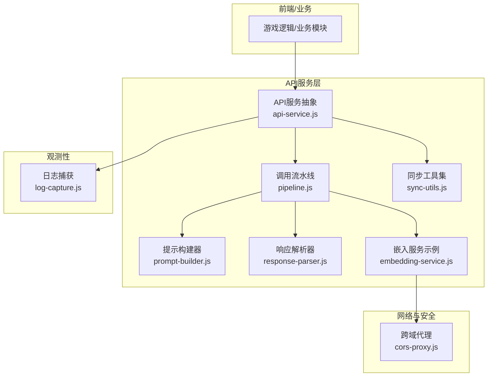
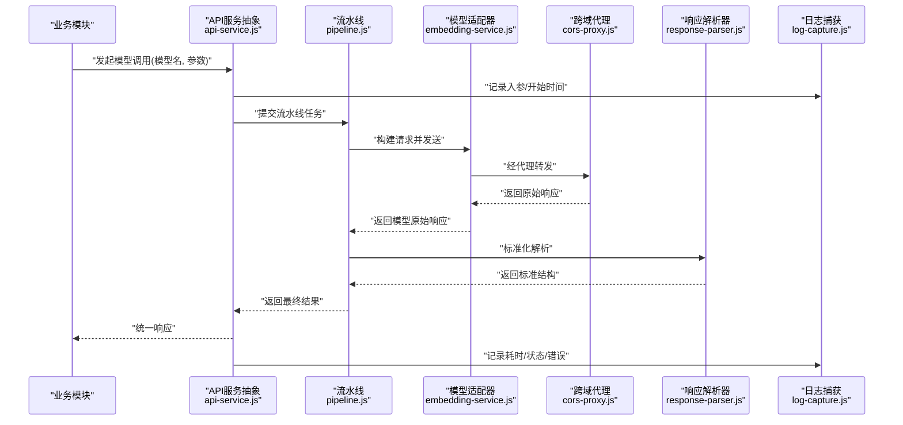
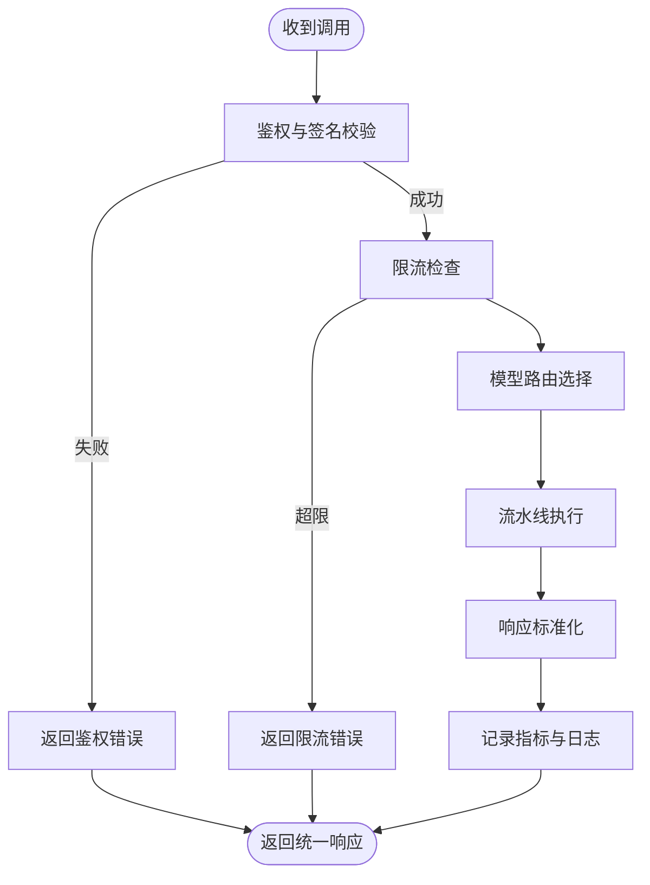
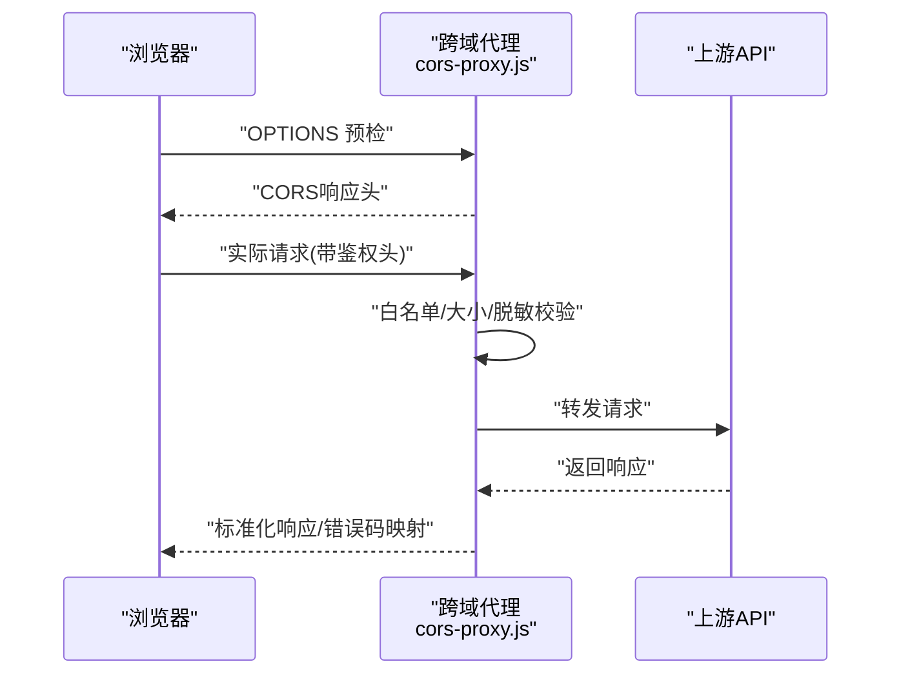
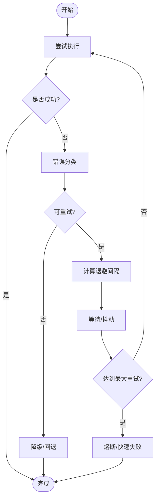
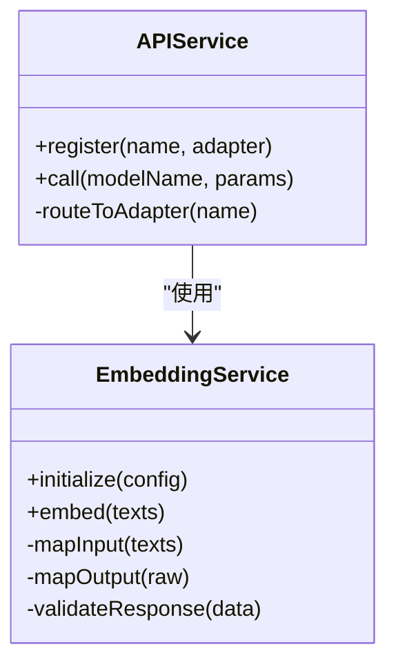
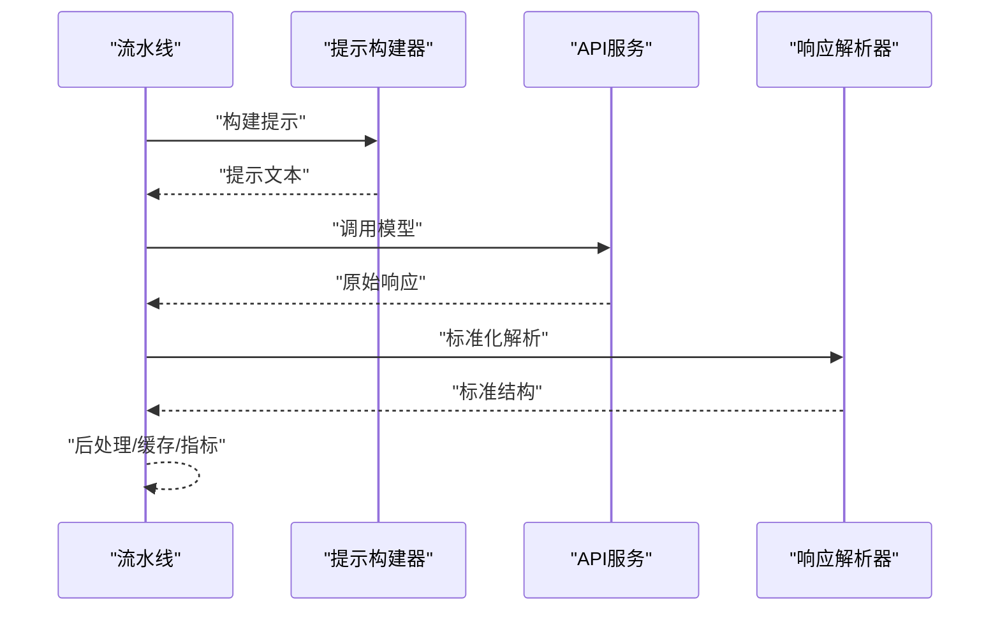
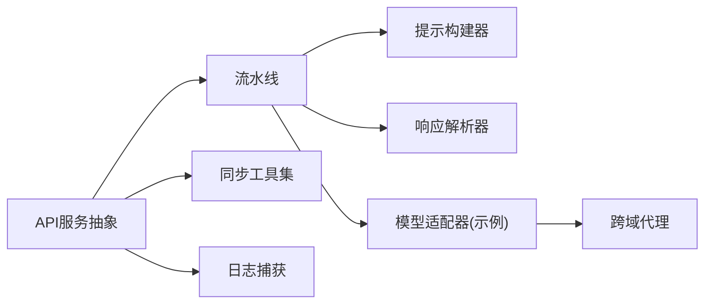

# API服务层抽象

<cite>
**本文引用的文件**   
- [api-service.js](file://module/api-service.js)
- [cors-proxy.js](file://worker/cors-proxy.js)
- [sync-utils.js](file://module/sync-utils.js)
- [embedding-service.js](file://module/embedding-service.js)
- [pipeline.js](file://module/pipeline.js)
- [prompt-builder.js](file://module/prompt-builder.js)
- [response-parser.js](file://module/response-parser.js)
- [log-capture.js](file://module/log-capture.js)
</cite>

## 目录
1. [简介](#简介)
2. [项目结构](#项目结构)
3. [核心组件](#核心组件)
4. [架构总览](#架构总览)
5. [详细组件分析](#详细组件分析)
6. [依赖关系分析](#依赖关系分析)
7. [性能考量](#性能考量)
8. [故障排查指南](#故障排查指南)
9. [结论](#结论)
10. [附录](#附录)

## 简介
本文件面向姬侠传的API服务层，聚焦于以下目标：
- 解释API服务抽象层的设计模式与多模型支持架构
- 说明请求路由机制与响应标准化处理
- 阐述跨域代理服务（CORS）的实现原理、转发与安全策略
- 阐述同步工具集的功能：并发控制、重试机制与错误恢复
- 覆盖API密钥管理、请求限流与监控日志记录
- 提供新AI模型集成指南、自定义API适配器与性能监控配置方法

## 项目结构
API服务相关代码主要分布在以下模块中：
- module/api-service.js：API服务抽象层与多模型调度
- worker/cors-proxy.js：跨域代理与请求转发
- module/sync-utils.js：并发控制、重试与错误恢复
- module/embedding-service.js：嵌入向量服务示例（可视为一个具体模型适配器）
- module/pipeline.js：调用流水线编排（提示构建、模型调用、解析等）
- module/prompt-builder.js：提示词构建器
- module/response-parser.js：响应解析与标准化
- module/log-capture.js：日志捕获与上报

图表来源
- [api-service.js](file://module/api-service.js)
- [pipeline.js](file://module/pipeline.js)
- [prompt-builder.js](file://module/prompt-builder.js)
- [response-parser.js](file://module/response-parser.js)
- [embedding-service.js](file://module/embedding-service.js)
- [sync-utils.js](file://module/sync-utils.js)
- [cors-proxy.js](file://worker/cors-proxy.js)
- [log-capture.js](file://module/log-capture.js)

章节来源
- [api-service.js](file://module/api-service.js)
- [cors-proxy.js](file://worker/cors-proxy.js)
- [sync-utils.js](file://module/sync-utils.js)
- [embedding-service.js](file://module/embedding-service.js)
- [pipeline.js](file://module/pipeline.js)
- [prompt-builder.js](file://module/prompt-builder.js)
- [response-parser.js](file://module/response-parser.js)
- [log-capture.js](file://module/log-capture.js)

## 核心组件
- API服务抽象层（api-service.js）
  - 职责：统一对外暴露模型调用接口；维护多模型注册表；实现请求路由、鉴权、限流、重试与日志埋点。
  - 关键能力：
    - 多模型注册与选择：通过模型标识分发到不同适配器
    - 请求路由：按模型名或能力标签选择适配实现
    - 响应标准化：将不同模型的返回格式统一为内部标准结构
    - 安全与治理：API密钥校验、请求签名、速率限制、超时控制
    - 可观测性：结构化日志、指标采集、错误追踪
- 跨域代理（cors-proxy.js）
  - 职责：在浏览器环境中解决跨域问题，转发请求至后端或第三方API，附加必要的安全头与鉴权信息
  - 关键能力：
    - CORS预检与响应头处理
    - 白名单域名与路径过滤
    - 请求体大小限制与敏感字段脱敏
    - 代理链路日志与错误码映射
- 同步工具集（sync-utils.js）
  - 职责：提供并发控制、指数退避重试、熔断与快速失败、错误分类与恢复策略
  - 关键能力：
    - 信号量/令牌桶限流
    - 重试策略（次数、间隔、抖动、条件重试）
    - 错误分类（网络、超时、业务、认证）
    - 降级与回退（fallback）
- 嵌入服务示例（embedding-service.js）
  - 职责：作为“具体模型适配器”的参考实现，展示如何接入新的AI模型
  - 关键能力：
    - 参数映射（输入文本→模型期望格式）
    - 结果映射（模型返回→内部标准结构）
    - 鉴权与限流集成
- 调用流水线（pipeline.js）
  - 职责：串联提示构建、模型调用、响应解析、后处理与缓存
  - 关键能力：
    - 阶段化执行与短路
    - 中间态数据传递
    - 异常传播与兜底
- 提示构建器（prompt-builder.js）
  - 职责：根据上下文、角色设定、系统指令拼装提示词
- 响应解析器（response-parser.js）
  - 职责：将不同模型的原始响应解析为统一结构，并做校验与清洗
- 日志捕获（log-capture.js）
  - 职责：捕获控制台输出、错误堆栈、关键事件，统一上报与采样

章节来源
- [api-service.js](file://module/api-service.js)
- [cors-proxy.js](file://worker/cors-proxy.js)
- [sync-utils.js](file://module/sync-utils.js)
- [embedding-service.js](file://module/embedding-service.js)
- [pipeline.js](file://module/pipeline.js)
- [prompt-builder.js](file://module/prompt-builder.js)
- [response-parser.js](file://module/response-parser.js)
- [log-capture.js](file://module/log-capture.js)

## 架构总览
API服务层采用“适配器+流水线”的模式：上层业务仅依赖统一的API服务抽象，具体模型以适配器形式注册；请求进入后由流水线编排提示构建、模型调用、响应解析与后处理；跨域代理负责网络边界的安全转发；同步工具集贯穿全链路提供并发与容错保障。

图表来源
- [api-service.js](file://module/api-service.js)
- [pipeline.js](file://module/pipeline.js)
- [embedding-service.js](file://module/embedding-service.js)
- [cors-proxy.js](file://worker/cors-proxy.js)
- [response-parser.js](file://module/response-parser.js)
- [log-capture.js](file://module/log-capture.js)

## 详细组件分析

### API服务抽象层（多模型支持与路由）
- 设计要点
  - 模型注册表：集中管理可用模型及其元信息（名称、能力、版本、限流配额）
  - 路由策略：基于模型名/能力标签/权重进行动态选择
  - 鉴权与限流：在入口拦截非法请求，按租户/用户维度计数
  - 标准化：所有模型返回统一结构，便于上层消费
- 典型流程
  - 接收请求 → 鉴权/限流 → 路由到适配器 → 流水线执行 → 标准化响应 → 日志上报

图表来源
- [api-service.js](file://module/api-service.js)
- [pipeline.js](file://module/pipeline.js)
- [response-parser.js](file://module/response-parser.js)
- [log-capture.js](file://module/log-capture.js)

章节来源
- [api-service.js](file://module/api-service.js)
- [pipeline.js](file://module/pipeline.js)
- [response-parser.js](file://module/response-parser.js)
- [log-capture.js](file://module/log-capture.js)

### 跨域代理服务（CORS与转发）
- 功能概述
  - 处理OPTIONS预检请求，设置Access-Control-*头
  - 白名单校验：域名、路径、HTTP方法
  - 请求体大小限制、敏感字段脱敏
  - 转发至上游API，透传必要头部（如Authorization），并映射错误码
- 安全策略
  - 严格来源校验与Referer检查
  - 最小权限原则：仅允许必要的Header与Method
  - 防重放：可选时间戳与签名校验
  - 审计：完整记录代理链路与结果

图表来源
- [cors-proxy.js](file://worker/cors-proxy.js)

章节来源
- [cors-proxy.js](file://worker/cors-proxy.js)

### 同步工具集（并发、重试与恢复）
- 并发控制
  - 令牌桶/信号量：限制同时进行的请求数
  - 队列与优先级：高优任务优先执行
- 重试机制
  - 指数退避+随机抖动
  - 条件重试：仅对可恢复错误重试
  - 最大重试次数与总时长上限
- 错误恢复
  - 错误分类：网络、超时、认证、业务
  - 降级策略：缓存命中、默认值、替代模型
  - 熔断：连续失败触发快速失败，冷却后恢复

图表来源
- [sync-utils.js](file://module/sync-utils.js)

章节来源
- [sync-utils.js](file://module/sync-utils.js)

### 嵌入服务示例（具体模型适配器）
- 作用
  - 演示如何将第三方嵌入模型接入统一API服务
- 关键点
  - 参数映射：将通用输入转换为模型特定格式
  - 鉴权注入：从配置读取API Key并放入请求头
  - 结果映射：将模型返回转为内部标准结构
  - 错误处理：区分网络错误与业务错误，配合重试/降级

图表来源
- [embedding-service.js](file://module/embedding-service.js)
- [api-service.js](file://module/api-service.js)

章节来源
- [embedding-service.js](file://module/embedding-service.js)
- [api-service.js](file://module/api-service.js)

### 调用流水线（Pipeline）
- 阶段划分
  - 提示构建：组合系统提示、历史对话、变量替换
  - 模型调用：通过API服务抽象发起请求
  - 响应解析：统一结构、字段校验、内容清洗
  - 后处理：缓存写入、指标上报、审计日志
- 特性
  - 可插拔阶段：新增/替换阶段不影响整体
  - 短路机制：任一阶段失败立即中断并返回
  - 中间态共享：各阶段间通过上下文对象传递数据

图表来源
- [pipeline.js](file://module/pipeline.js)
- [prompt-builder.js](file://module/prompt-builder.js)
- [response-parser.js](file://module/response-parser.js)
- [api-service.js](file://module/api-service.js)

章节来源
- [pipeline.js](file://module/pipeline.js)
- [prompt-builder.js](file://module/prompt-builder.js)
- [response-parser.js](file://module/response-parser.js)
- [api-service.js](file://module/api-service.js)

### 日志与监控
- 日志捕获
  - 捕获控制台输出、未捕获异常、关键事件
  - 结构化字段：请求ID、模型名、耗时、状态码、错误类型
  - 采样与分级：生产环境采样降低开销
- 指标与追踪
  - QPS、P95/P99延迟、错误率、重试率、熔断触发次数
  - 与外部监控系统对接（可选）

章节来源
- [log-capture.js](file://module/log-capture.js)

## 依赖关系分析
- 耦合与内聚
  - API服务抽象层与流水线松耦合，通过接口契约交互
  - 具体模型适配器独立实现，易于扩展
  - 跨域代理位于网络边界，屏蔽底层差异
- 外部依赖
  - 浏览器Worker环境（跨域代理）
  - 第三方AI模型API（鉴权、限流、计费）
  - 存储与缓存（可选）

图表来源
- [api-service.js](file://module/api-service.js)
- [pipeline.js](file://module/pipeline.js)
- [prompt-builder.js](file://module/prompt-builder.js)
- [response-parser.js](file://module/response-parser.js)
- [embedding-service.js](file://module/embedding-service.js)
- [sync-utils.js](file://module/sync-utils.js)
- [cors-proxy.js](file://worker/cors-proxy.js)
- [log-capture.js](file://module/log-capture.js)

章节来源
- [api-service.js](file://module/api-service.js)
- [pipeline.js](file://module/pipeline.js)
- [prompt-builder.js](file://module/prompt-builder.js)
- [response-parser.js](file://module/response-parser.js)
- [embedding-service.js](file://module/embedding-service.js)
- [sync-utils.js](file://module/sync-utils.js)
- [cors-proxy.js](file://worker/cors-proxy.js)
- [log-capture.js](file://module/log-capture.js)

## 性能考量
- 并发与吞吐
  - 使用令牌桶/信号量限制并发，避免下游过载
  - 批量请求合并（若模型支持）
- 缓存策略
  - 相同提示的响应缓存（短TTL）
  - 分层缓存：内存→IndexedDB（可选）
- 超时与重试
  - 合理设置超时阈值与重试次数
  - 指数退避+抖动，避免雪崩
- 资源优化
  - 大文本分块与增量处理
  - 日志采样与异步落盘

[本节为通用指导，不直接分析具体文件]

## 故障排查指南
- 常见问题定位
  - 鉴权失败：检查API Key、签名算法、时间戳
  - 限流触发：查看QPS与配额，调整限流策略或扩容
  - 跨域错误：确认CORS头、白名单、预检响应
  - 超时/重试风暴：检查下游稳定性、退避参数、熔断阈值
- 日志与指标
  - 使用请求ID关联上下游日志
  - 关注错误分类分布与重试率趋势
- 建议步骤
  - 复现最小用例，逐步关闭阶段定位问题
  - 开启调试日志，观察中间态数据
  - 对比不同模型适配器的行为差异

章节来源
- [log-capture.js](file://module/log-capture.js)
- [cors-proxy.js](file://worker/cors-proxy.js)
- [sync-utils.js](file://module/sync-utils.js)
- [api-service.js](file://module/api-service.js)

## 结论
API服务层通过抽象与适配器模式实现了多模型统一接入，结合流水线编排与标准化响应，显著降低了上层业务复杂度。跨域代理保障了浏览器端调用的安全性与可用性，同步工具集提供了可靠的并发与容错能力。在此基础上，完善的鉴权、限流、日志与监控体系为稳定运行提供了保障。

[本节为总结性内容，不直接分析具体文件]

## 附录

### 新AI模型集成指南
- 步骤
  - 新建适配器：实现参数映射、鉴权注入、结果映射与错误处理
  - 注册模型：在API服务抽象层注册模型名与适配器实例
  - 配置限流与超时：为新模型设置独立的配额与超时策略
  - 单元测试：覆盖正常、异常与边界场景
- 最佳实践
  - 保持适配器无状态，便于水平扩展
  - 使用统一错误码与消息格式
  - 记录关键指标以便后续优化

章节来源
- [api-service.js](file://module/api-service.js)
- [embedding-service.js](file://module/embedding-service.js)

### 自定义API适配器规范
- 必须实现的接口
  - initialize(config)：初始化配置与连接池
  - call(params)：发起请求并返回原始响应
  - mapInput(params)：参数转换
  - mapOutput(raw)：结果转换
  - validateResponse(data)：响应校验
- 可选能力
  - 流式响应支持
  - 断线重连与心跳
  - 本地缓存与去重

章节来源
- [embedding-service.js](file://module/embedding-service.js)
- [api-service.js](file://module/api-service.js)

### 性能监控配置方法
- 指标项
  - 请求级：耗时、状态码、错误类型、重试次数
  - 系统级：QPS、CPU/内存占用、队列长度
- 采样策略
  - 按错误比例提高采样率，正常流量降低采样率
- 告警规则
  - 错误率阈值、P99延迟阈值、熔断触发频率
- 可视化
  - 仪表盘：总体健康度、模型对比、瓶颈定位

章节来源
- [log-capture.js](file://module/log-capture.js)
- [api-service.js](file://module/api-service.js)