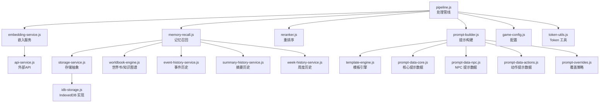
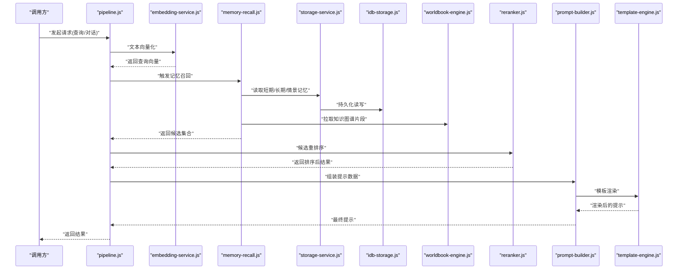
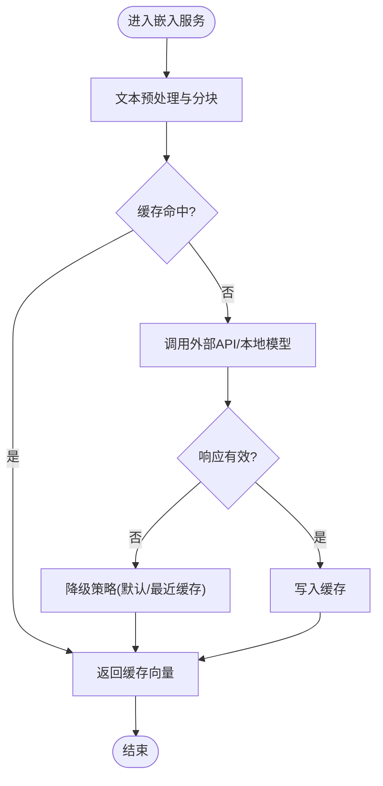
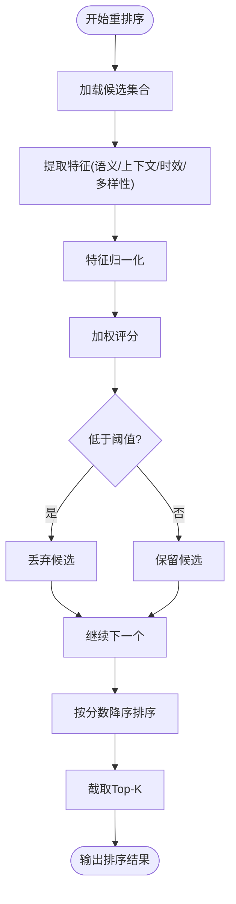
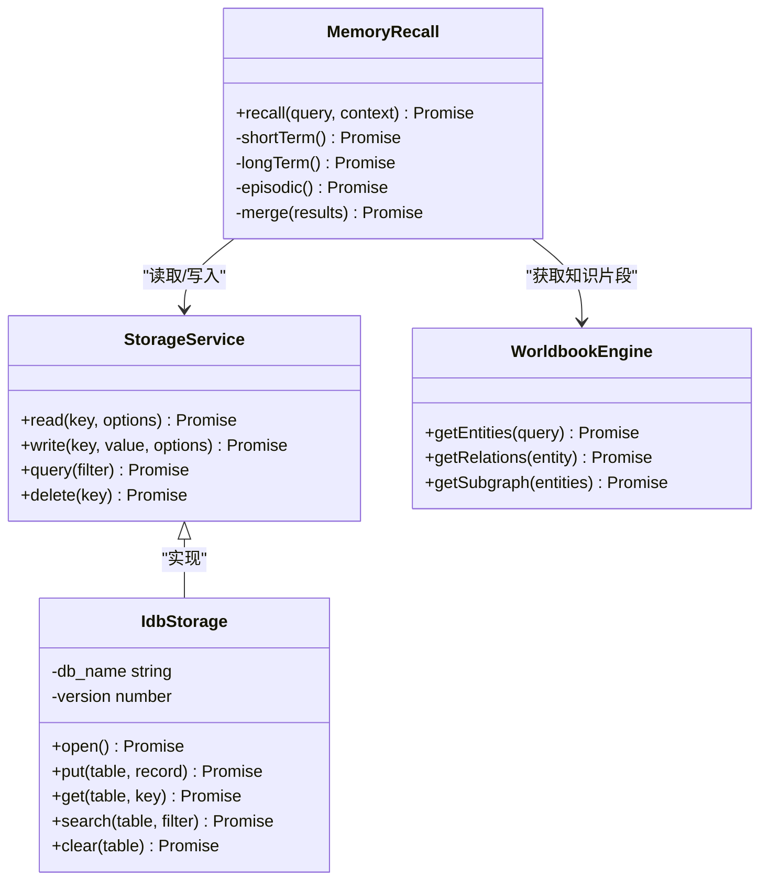
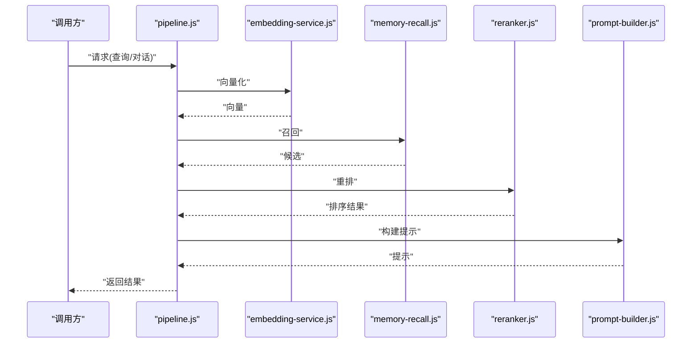
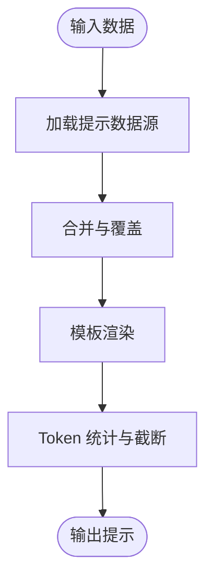
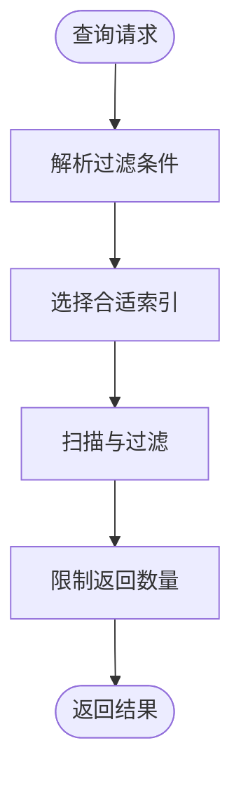
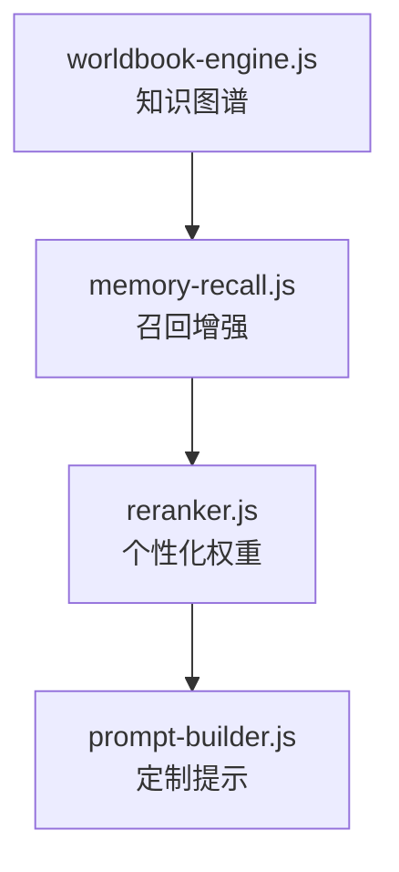
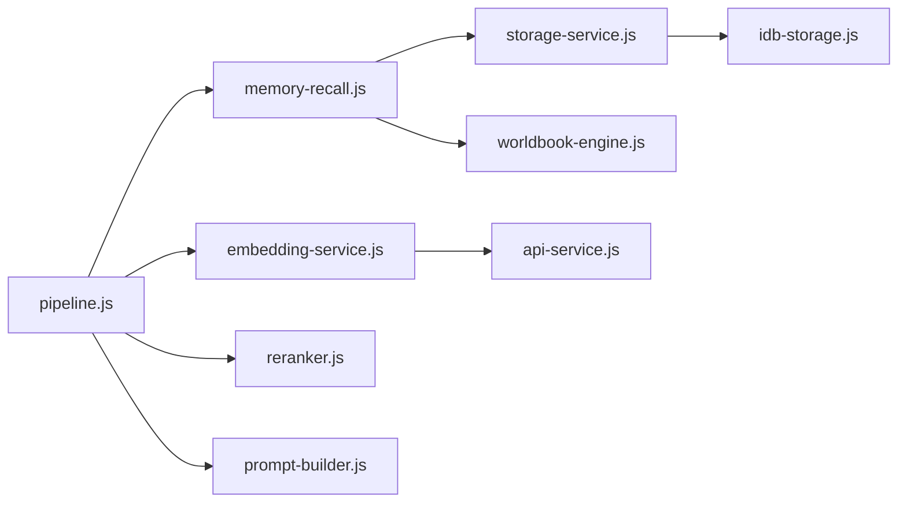

# 向量检索与记忆系统

<cite>
**本文引用的文件**   
- [embedding-service.js](file://module/embedding-service.js)
- [reranker.js](file://module/reranker.js)
- [memory-recall.js](file://module/memory-recall.js)
- [pipeline.js](file://module/pipeline.js)
- [prompt-builder.js](file://module/prompt-builder.js)
- [storage-service.js](file://module/storage-service.js)
- [idb-storage.js](file://module/idb-storage.js)
- [worldbook-engine.js](file://module/worldbook-engine.js)
- [game-config.js](file://module/game-config.js)
- [token-utils.js](file://module/token-utils.js)
- [prompt-data-core.js](file://module/prompt-data-core.js)
- [prompt-data-npc.js](file://module/prompt-data-npc.js)
- [prompt-data-actions.js](file://module/prompt-data-actions.js)
- [prompt-overrides.js](file://module/prompt-overrides.js)
- [template-engine.js](file://module/template-engine.js)
- [event-history-service.js](file://module/event-history-service.js)
- [summary-history-service.js](file://module/summary-history-service.js)
- [week-history-service.js](file://module/week-history-service.js)
- [api-service.js](file://module/api-service.js)
</cite>

## 目录
1. [简介](#简介)
2. [项目结构](#项目结构)
3. [核心组件](#核心组件)
4. [架构总览](#架构总览)
5. [详细组件分析](#详细组件分析)
6. [依赖关系分析](#依赖关系分析)
7. [性能考虑](#性能考虑)
8. [故障排查指南](#故障排查指南)
9. [结论](#结论)
10. [附录](#附录)

## 简介
本文件面向“姬侠传”的向量检索与记忆系统，系统性阐述嵌入服务、相似度计算、索引管理、重排序算法、记忆召回体系（短期/长期/情景）、以及向量化数据在提示构建与个性化推荐中的使用方式。文档同时给出可操作的优化建议与排障指引，帮助读者快速理解并高效调优该子系统。

## 项目结构
与向量检索和记忆相关的核心模块位于 module 目录下，关键文件包括：
- embedding-service.js：文本向量化与相似度计算入口
- reranker.js：候选结果重排序与相关性评分
- memory-recall.js：记忆召回编排器（短期/长期/情景）
- pipeline.js：整体处理管线（串联嵌入、召回、重排、提示组装）
- prompt-builder.js / template-engine.js：提示词构建与模板渲染
- storage-service.js / idb-storage.js：持久化存储抽象与 IndexedDB 实现
- worldbook-engine.js：世界书（知识图谱）引擎
- game-config.js / token-utils.js：配置与 Token 工具
- prompt-data-*：提示数据源（核心/NPC/动作等）
- event-history-service.js / summary-history-service.js / week-history-service.js：历史与摘要服务
- api-service.js：外部 API 调用封装

图表来源
- [pipeline.js](file://module/pipeline.js)
- [embedding-service.js](file://module/embedding-service.js)
- [memory-recall.js](file://module/memory-recall.js)
- [storage-service.js](file://module/storage-service.js)
- [idb-storage.js](file://module/idb-storage.js)
- [worldbook-engine.js](file://module/worldbook-engine.js)
- [reranker.js](file://module/reranker.js)
- [prompt-builder.js](file://module/prompt-builder.js)
- [template-engine.js](file://module/template-engine.js)
- [prompt-data-core.js](file://module/prompt-data-core.js)
- [prompt-data-npc.js](file://module/prompt-data-npc.js)
- [prompt-data-actions.js](file://module/prompt-data-actions.js)
- [prompt-overrides.js](file://module/prompt-overrides.js)
- [game-config.js](file://module/game-config.js)
- [token-utils.js](file://module/token-utils.js)
- [event-history-service.js](file://module/event-history-service.js)
- [summary-history-service.js](file://module/summary-history-service.js)
- [week-history-service.js](file://module/week-history-service.js)
- [api-service.js](file://module/api-service.js)

章节来源
- [pipeline.js](file://module/pipeline.js)
- [embedding-service.js](file://module/embedding-service.js)
- [memory-recall.js](file://module/memory-recall.js)
- [reranker.js](file://module/reranker.js)
- [prompt-builder.js](file://module/prompt-builder.js)
- [storage-service.js](file://module/storage-service.js)
- [idb-storage.js](file://module/idb-storage.js)
- [worldbook-engine.js](file://module/worldbook-engine.js)
- [game-config.js](file://module/game-config.js)
- [token-utils.js](file://module/token-utils.js)
- [prompt-data-core.js](file://module/prompt-data-core.js)
- [prompt-data-npc.js](file://module/prompt-data-npc.js)
- [prompt-data-actions.js](file://module/prompt-data-actions.js)
- [prompt-overrides.js](file://module/prompt-overrides.js)
- [template-engine.js](file://module/template-engine.js)
- [event-history-service.js](file://module/event-history-service.js)
- [summary-history-service.js](file://module/summary-history-service.js)
- [week-history-service.js](file://module/week-history-service.js)
- [api-service.js](file://module/api-service.js)

## 核心组件
- 嵌入服务：负责将自然语言文本转换为向量表示，并提供相似度计算能力；支持批量处理与缓存策略，降低重复计算开销。
- 重排序器：对初筛候选进行精细化打分，融合语义相关性与上下文信号，输出最终排序结果。
- 记忆召回：统一调度短期、长期与情景三类记忆的检索，聚合多源结果并按策略合并与去重。
- 处理管线：串联嵌入、召回、重排与提示构建，提供统一的输入输出接口与错误恢复路径。
- 提示构建与模板：基于多种数据源（核心/NPC/动作/覆盖）生成结构化提示，结合模板引擎渲染最终内容。
- 存储层：通过抽象接口对接 IndexedDB，保障本地持久化与一致性。
- 世界书（知识图谱）：维护实体、关系与属性，为召回与提示注入结构化知识。
- 配置与工具：集中管理模型参数、维度、阈值、超时等；提供 Token 统计与截断辅助。

章节来源
- [embedding-service.js](file://module/embedding-service.js)
- [reranker.js](file://module/reranker.js)
- [memory-recall.js](file://module/memory-recall.js)
- [pipeline.js](file://module/pipeline.js)
- [prompt-builder.js](file://module/prompt-builder.js)
- [storage-service.js](file://module/storage-service.js)
- [idb-storage.js](file://module/idb-storage.js)
- [worldbook-engine.js](file://module/worldbook-engine.js)
- [game-config.js](file://module/game-config.js)
- [token-utils.js](file://module/token-utils.js)

## 架构总览
下图展示从用户输入到最终提示生成的端到端流程，涵盖嵌入、召回、重排与提示组装的关键环节。

图表来源
- [pipeline.js](file://module/pipeline.js)
- [embedding-service.js](file://module/embedding-service.js)
- [memory-recall.js](file://module/memory-recall.js)
- [storage-service.js](file://module/storage-service.js)
- [idb-storage.js](file://module/idb-storage.js)
- [worldbook-engine.js](file://module/worldbook-engine.js)
- [reranker.js](file://module/reranker.js)
- [prompt-builder.js](file://module/prompt-builder.js)
- [template-engine.js](file://module/template-engine.js)

## 详细组件分析

### 嵌入服务（文本向量化与相似度计算）
- 功能要点
  - 文本预处理：清洗、分块、规范化，确保输入稳定。
  - 向量化：调用外部 API 或本地模型生成向量；支持批量并发与重试。
  - 相似度：提供余弦相似度等度量，用于初筛候选。
  - 缓存：按文本指纹缓存向量，避免重复计算。
- 复杂度与优化
  - 时间复杂度：O(n·d) 单次向量化（n 为字符/Token 数，d 为维度），批量可并行。
  - 空间复杂度：O(d) 每向量，缓存命中可降低内存压力。
  - 优化策略：批大小自适应、向量压缩（如半精度）、冷热点分层缓存。
- 错误处理
  - 网络异常降级：回退至默认向量或最近缓存。
  - 超时控制：分段请求与熔断保护。

图表来源
- [embedding-service.js](file://module/embedding-service.js)
- [api-service.js](file://module/api-service.js)
- [game-config.js](file://module/game-config.js)

章节来源
- [embedding-service.js](file://module/embedding-service.js)
- [api-service.js](file://module/api-service.js)
- [game-config.js](file://module/game-config.js)

### 重排序算法（相关性评分与上下文感知）
- 评分维度
  - 语义相关性：基于向量相似度得分。
  - 上下文匹配：结合当前会话上下文、角色状态、地点信息等加权。
  - 时效性衰减：近期记忆权重更高，远期记忆逐步衰减。
  - 多样性惩罚：抑制重复主题，提升覆盖面。
- 实现思路
  - 线性/非线性组合：对多维特征归一化后进行加权求和或学习式融合。
  - 阈值过滤：剔除低分候选，减少后续成本。
  - 稳定性：引入平滑与抖动抑制，避免排序剧烈波动。
- 性能优化
  - 预计算特征：提前计算部分静态特征（如类别权重）。
  - 增量更新：仅对新增/变更候选重新评分。
  - 并行评分：对候选集并行打分，缩短尾延迟。

图表来源
- [reranker.js](file://module/reranker.js)
- [prompt-builder.js](file://module/prompt-builder.js)
- [game-config.js](file://module/game-config.js)

章节来源
- [reranker.js](file://module/reranker.js)
- [prompt-builder.js](file://module/prompt-builder.js)
- [game-config.js](file://module/game-config.js)

### 记忆召回系统（短期/长期/情景）
- 设计目标
  - 短期记忆：近几轮对话与即时上下文，强调时效性与连贯性。
  - 长期记忆：跨会话沉淀的知识与偏好，强调稳定性与可检索性。
  - 情景记忆：与地点、事件、任务相关的背景信息，增强沉浸感。
- 存储与检索
  - 存储抽象：storage-service.js 定义统一接口，idb-storage.js 基于 IndexedDB 实现。
  - 索引机制：按类型、时间戳、标签、实体等多维索引，支持范围查询与模糊匹配。
  - 聚合策略：多源召回结果去重、优先级合并、冲突消解。
- 与知识图谱联动
  - worldbook-engine.js 提供实体/关系检索，辅助召回阶段注入结构化上下文。

图表来源
- [memory-recall.js](file://module/memory-recall.js)
- [storage-service.js](file://module/storage-service.js)
- [idb-storage.js](file://module/idb-storage.js)
- [worldbook-engine.js](file://module/worldbook-engine.js)

章节来源
- [memory-recall.js](file://module/memory-recall.js)
- [storage-service.js](file://module/storage-service.js)
- [idb-storage.js](file://module/idb-storage.js)
- [worldbook-engine.js](file://module/worldbook-engine.js)

### 处理管线（Pipeline）
- 职责
  - 协调嵌入、召回、重排与提示构建，提供统一入口。
  - 管理中间态数据流，记录耗时与指标。
  - 错误恢复与降级策略（例如跳过某阶段、使用默认值）。
- 关键步骤
  - 输入校验与参数解析。
  - 调用嵌入服务生成查询向量。
  - 触发记忆召回并聚合结果。
  - 执行重排序与 Top-K 选择。
  - 组装提示数据并渲染模板。
  - 返回最终结果与元数据。

图表来源
- [pipeline.js](file://module/pipeline.js)
- [embedding-service.js](file://module/embedding-service.js)
- [memory-recall.js](file://module/memory-recall.js)
- [reranker.js](file://module/reranker.js)
- [prompt-builder.js](file://module/prompt-builder.js)

章节来源
- [pipeline.js](file://module/pipeline.js)

### 提示构建与模板引擎
- 数据源
  - prompt-data-core.js：核心提示数据（系统指令、通用规则）。
  - prompt-data-npc.js：NPC 相关提示（性格、关系、偏好）。
  - prompt-data-actions.js：动作与交互提示（行为约束、格式规范）。
  - prompt-overrides.js：覆盖策略（动态替换、条件分支）。
- 模板渲染
  - template-engine.js：变量插值、条件渲染、循环展开。
  - token-utils.js：Token 计数与截断，防止超限。
- 最佳实践
  - 模块化拼装：按主题拆分提示片段，便于复用与维护。
  - 安全过滤：对用户输入与外部数据进行白名单校验。
  - 可观测性：记录模板渲染耗时与 Token 用量。

图表来源
- [prompt-builder.js](file://module/prompt-builder.js)
- [template-engine.js](file://module/template-engine.js)
- [prompt-data-core.js](file://module/prompt-data-core.js)
- [prompt-data-npc.js](file://module/prompt-data-npc.js)
- [prompt-data-actions.js](file://module/prompt-data-actions.js)
- [prompt-overrides.js](file://module/prompt-overrides.js)
- [token-utils.js](file://module/token-utils.js)

章节来源
- [prompt-builder.js](file://module/prompt-builder.js)
- [template-engine.js](file://module/template-engine.js)
- [prompt-data-core.js](file://module/prompt-data-core.js)
- [prompt-data-npc.js](file://module/prompt-data-npc.js)
- [prompt-data-actions.js](file://module/prompt-data-actions.js)
- [prompt-overrides.js](file://module/prompt-overrides.js)
- [token-utils.js](file://module/token-utils.js)

### 存储层与索引优化
- 抽象与实现
  - storage-service.js：定义读/写/查询/删除的统一接口。
  - idb-storage.js：基于 IndexedDB 的具体实现，支持事务与索引。
- 索引策略
  - 复合索引：按类型+时间戳+标签组合，加速范围查询。
  - 前缀索引：对字符串字段使用前缀匹配，提高模糊搜索效率。
  - 分区表：按时间或主题分区，降低单表规模。
- 一致性
  - 事务包裹：保证读写原子性。
  - 版本迁移：schema 升级时兼容旧数据。

图表来源
- [storage-service.js](file://module/storage-service.js)
- [idb-storage.js](file://module/idb-storage.js)

章节来源
- [storage-service.js](file://module/storage-service.js)
- [idb-storage.js](file://module/idb-storage.js)

### 世界书（知识图谱）与个性化推荐
- 知识图谱
  - worldbook-engine.js：维护实体、关系与属性，支持子图检索与路径推理。
  - 与记忆召回联动：在召回阶段注入相关实体与关系，增强上下文质量。
- 个性化推荐
  - 基于用户偏好与历史交互，调整重排序权重与提示内容。
  - 动态覆盖：根据实时状态切换提示策略（如情绪、场景、任务阶段）。

图表来源
- [worldbook-engine.js](file://module/worldbook-engine.js)
- [memory-recall.js](file://module/memory-recall.js)
- [reranker.js](file://module/reranker.js)
- [prompt-builder.js](file://module/prompt-builder.js)

章节来源
- [worldbook-engine.js](file://module/worldbook-engine.js)
- [memory-recall.js](file://module/memory-recall.js)
- [reranker.js](file://module/reranker.js)
- [prompt-builder.js](file://module/prompt-builder.js)

## 依赖关系分析
- 组件耦合
  - pipeline.js 作为中枢，强依赖 embedding-service.js、memory-recall.js、reranker.js、prompt-builder.js。
  - memory-recall.js 依赖 storage-service.js 与 worldbook-engine.js。
  - storage-service.js 由 idb-storage.js 实现具体持久化逻辑。
- 外部依赖
  - api-service.js 提供外部 API 访问，供嵌入服务与可能的其他服务使用。
- 潜在环路与风险
  - 应避免 memory-recall 与 worldbook 之间出现双向强依赖，必要时引入事件总线或回调解耦。
  - 提示构建不应直接依赖底层存储，保持关注点分离。

图表来源
- [pipeline.js](file://module/pipeline.js)
- [embedding-service.js](file://module/embedding-service.js)
- [memory-recall.js](file://module/memory-recall.js)
- [reranker.js](file://module/reranker.js)
- [prompt-builder.js](file://module/prompt-builder.js)
- [storage-service.js](file://module/storage-service.js)
- [idb-storage.js](file://module/idb-storage.js)
- [worldbook-engine.js](file://module/worldbook-engine.js)
- [api-service.js](file://module/api-service.js)

章节来源
- [pipeline.js](file://module/pipeline.js)
- [embedding-service.js](file://module/embedding-service.js)
- [memory-recall.js](file://module/memory-recall.js)
- [reranker.js](file://module/reranker.js)
- [prompt-builder.js](file://module/prompt-builder.js)
- [storage-service.js](file://module/storage-service.js)
- [idb-storage.js](file://module/idb-storage.js)
- [worldbook-engine.js](file://module/worldbook-engine.js)
- [api-service.js](file://module/api-service.js)

## 性能考虑
- 向量化
  - 批量并发：合理设置批大小，平衡吞吐与延迟。
  - 缓存命中率：监控并优化缓存键设计，减少冷启动开销。
- 召回
  - 索引选择：优先命中复合索引，减少全表扫描。
  - 分页与限流：限制返回数量，避免大结果集拖慢下游。
- 重排序
  - 并行评分：对候选集并行打分，缩短尾延迟。
  - 阈值裁剪：尽早剔除低分候选，降低计算量。
- 提示构建
  - Token 预算：严格统计与截断，避免超限导致失败。
  - 模板缓存：对静态模板片段进行缓存，减少渲染开销。
- 存储
  - 事务合并：批量写入合并为一次事务，降低 IO 次数。
  - 分区与归档：定期归档旧数据，保持热数据轻量。

[本节为通用性能指导，不直接分析具体文件]

## 故障排查指南
- 常见问题
  - 向量化失败：检查外部 API 连通性与超时配置，确认降级策略是否生效。
  - 召回为空：验证索引是否存在、过滤条件是否过严、时间窗口是否合理。
  - 重排序不稳定：检查特征归一化与权重配置，避免极端值影响。
  - 提示超长：核对 Token 统计与截断逻辑，适当精简模板或数据源。
- 定位方法
  - 日志埋点：在 pipeline 各阶段记录耗时与关键指标。
  - 快照对比：对比不同版本的索引与数据，定位回归问题。
  - 最小复现：构造最小数据集与配置，隔离环境差异。

章节来源
- [pipeline.js](file://module/pipeline.js)
- [embedding-service.js](file://module/embedding-service.js)
- [memory-recall.js](file://module/memory-recall.js)
- [reranker.js](file://module/reranker.js)
- [prompt-builder.js](file://module/prompt-builder.js)
- [token-utils.js](file://module/token-utils.js)
- [storage-service.js](file://module/storage-service.js)
- [idb-storage.js](file://module/idb-storage.js)

## 结论
本系统以 pipeline 为核心，串联嵌入、召回、重排与提示构建，形成完整的向量检索与记忆链路。通过合理的索引策略、重排序设计与模板化提示构建，系统在准确性、时效性与用户体验方面取得良好平衡。未来可在以下方向持续优化：
- 引入更丰富的上下文特征与学习式融合策略，提升重排序效果。
- 完善知识图谱的自动抽取与更新机制，增强情景记忆质量。
- 强化可观测性与自动化测试，保障系统稳定性与演进速度。

[本节为总结性内容，不直接分析具体文件]

## 附录
- 术语
  - 嵌入：将文本映射为高维向量的过程。
  - 相似度：衡量两个向量接近程度的指标（如余弦相似度）。
  - 重排序：对初筛候选进行精细化打分与排序。
  - 短期/长期/情景记忆：分别对应近程、远程与背景型记忆。
- 参考文件
  - 开发文档中关于向量化检索召回机制的说明可作为补充阅读。

[本节为概念性内容，不直接分析具体文件]