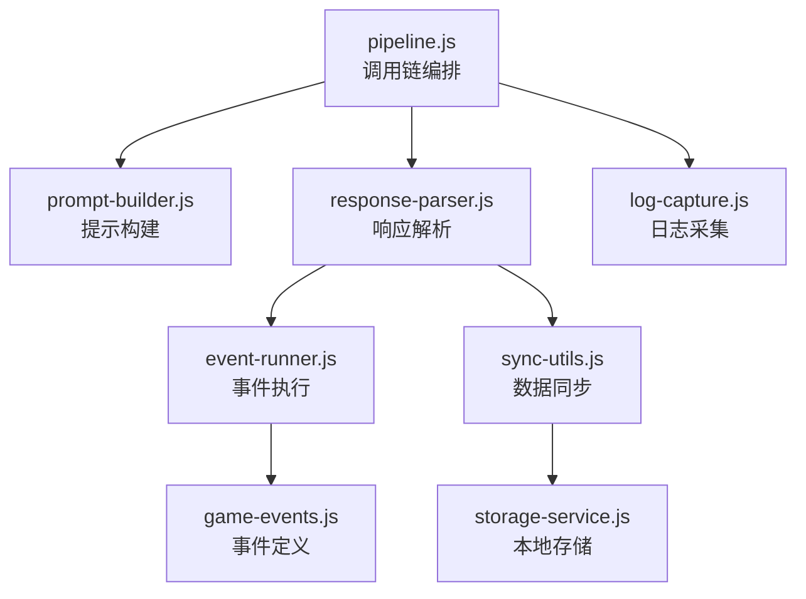
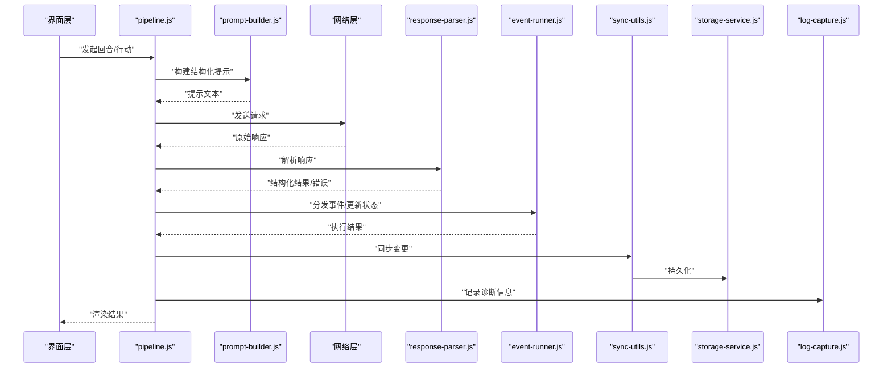
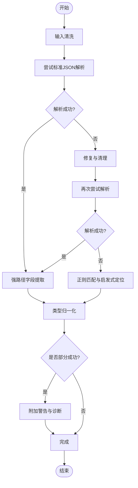
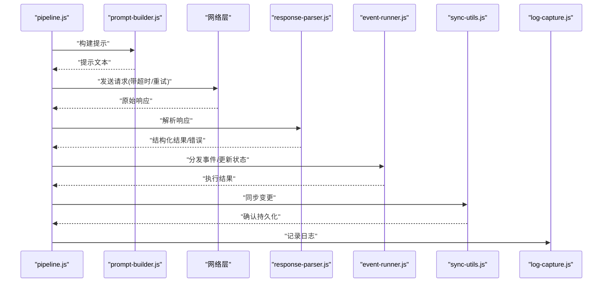
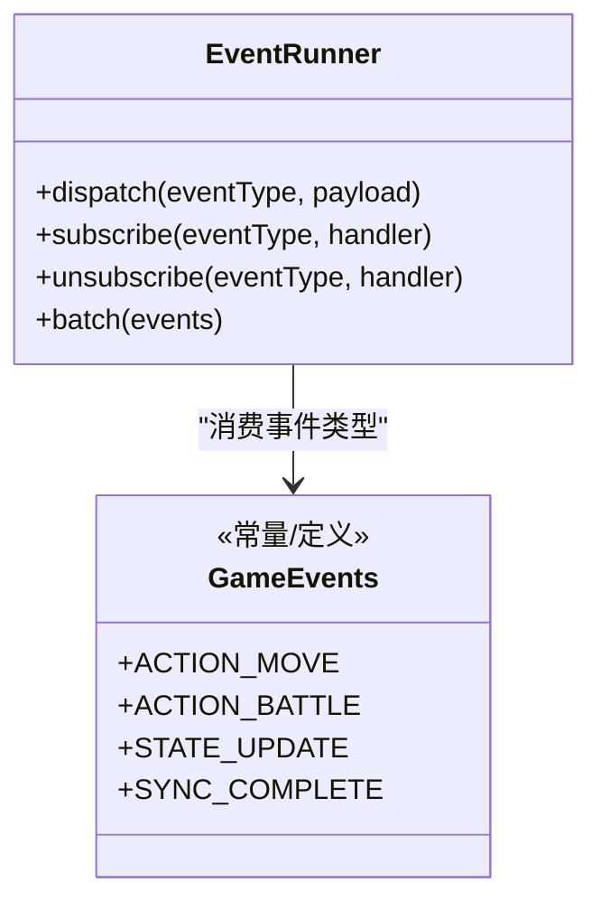
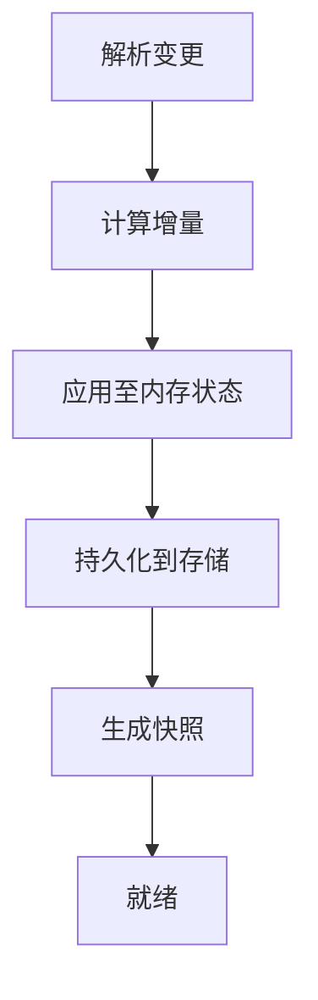
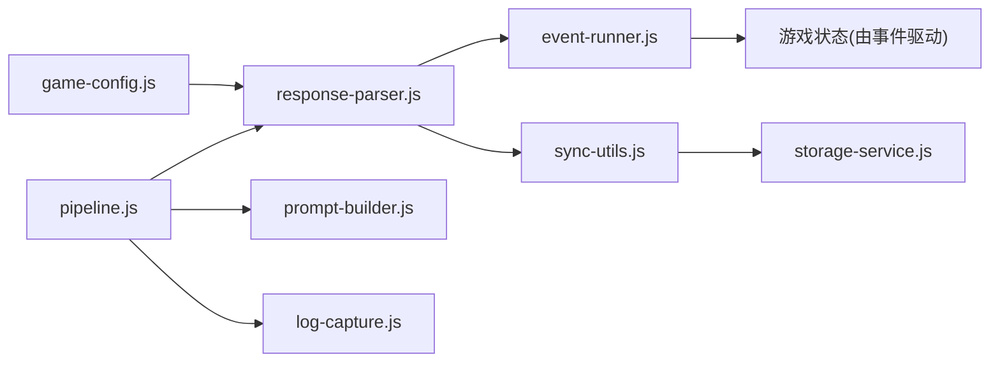

# 响应解析与处理

<cite>
**本文引用的文件**   
- [response-parser.js](file://module/response-parser.js)
- [pipeline.js](file://module/pipeline.js)
- [prompt-builder.js](file://module/prompt-builder.js)
- [game-config.js](file://module/game-config.js)
- [event-runner.js](file://module/event-runner.js)
- [game-events.js](file://module/game-events.js)
- [sync-utils.js](file://module/sync-utils.js)
- [storage-service.js](file://module/storage-service.js)
- [log-capture.js](file://module/log-capture.js)
</cite>

## 目录
1. [简介](#简介)
2. [项目结构](#项目结构)
3. [核心组件](#核心组件)
4. [架构总览](#架构总览)
5. [详细组件分析](#详细组件分析)
6. [依赖关系分析](#依赖关系分析)
7. [性能考量](#性能考量)
8. [故障排查指南](#故障排查指南)
9. [结论](#结论)
10. [附录](#附录)

## 简介
本文件面向“姬侠传AI响应解析系统”，聚焦于响应解析器的工作流程、数据提取算法、错误处理机制，以及与游戏状态更新、事件触发和数据同步的集成方式。文档同时覆盖正则表达式匹配、结构化数据提取、异常恢复策略、响应格式规范、解析规则配置与调试方法，并给出复杂嵌套数据与多模态响应的处理思路。

## 项目结构
围绕响应解析的核心模块位于前端资源目录下的 module 子目录中，关键文件包括：
- response-parser.js：响应解析主逻辑（JSON校验、字段提取、正则匹配、容错）
- pipeline.js：调用链编排（构建提示→请求→解析→应用→持久化）
- prompt-builder.js：提示词构建（为模型生成结构化输出提供约束）
- game-config.js：全局配置（含解析规则开关、阈值等）
- event-runner.js / game-events.js：事件驱动与业务事件定义
- sync-utils.js / storage-service.js：数据同步与本地存储
- log-capture.js：日志采集与诊断

图表来源
- [pipeline.js](file://module/pipeline.js)
- [prompt-builder.js](file://module/prompt-builder.js)
- [response-parser.js](file://module/response-parser.js)
- [event-runner.js](file://module/event-runner.js)
- [game-events.js](file://module/game-events.js)
- [sync-utils.js](file://module/sync-utils.js)
- [storage-service.js](file://module/storage-service.js)
- [log-capture.js](file://module/log-capture.js)

章节来源
- [pipeline.js](file://module/pipeline.js)
- [response-parser.js](file://module/response-parser.js)
- [prompt-builder.js](file://module/prompt-builder.js)
- [game-config.js](file://module/game-config.js)
- [event-runner.js](file://module/event-runner.js)
- [game-events.js](file://module/game-events.js)
- [sync-utils.js](file://module/sync-utils.js)
- [storage-service.js](file://module/storage-service.js)
- [log-capture.js](file://module/log-capture.js)

## 核心组件
- 响应解析器（response-parser.js）
  - JSON格式验证：尝试标准解析；失败时进行清理与修复（如去除多余逗号、补全缺失括号、剔除不可见字符）。
  - 结构化数据提取：优先按强类型键值提取；若缺失则回退到正则匹配与启发式定位。
  - 正则表达式匹配：用于从富文本或混合内容中提取关键字段（如数值、枚举、时间戳、ID等）。
  - 异常恢复策略：分阶段降级（严格→宽松→启发式），记录诊断信息，返回最小可用结果。
- 调用链编排（pipeline.js）
  - 串联“提示构建→网络请求→响应解析→事件/状态应用→持久化”的完整流程。
  - 负责错误边界捕获、重试与超时控制。
- 提示构建（prompt-builder.js）
  - 通过模板与上下文拼装，强制模型输出符合约定结构的JSON片段，降低解析难度。
- 事件与状态（event-runner.js / game-events.js）
  - 将解析出的动作/变更映射为内部事件，驱动UI与状态机更新。
- 数据同步与存储（sync-utils.js / storage-service.js）
  - 将变更写入本地存储，保证断网可恢复与快照一致性。
- 日志采集（log-capture.js）
  - 收集解析过程的关键指标与错误堆栈，便于定位问题。

章节来源
- [response-parser.js](file://module/response-parser.js)
- [pipeline.js](file://module/pipeline.js)
- [prompt-builder.js](file://module/prompt-builder.js)
- [event-runner.js](file://module/event-runner.js)
- [game-events.js](file://module/game-events.js)
- [sync-utils.js](file://module/sync-utils.js)
- [storage-service.js](file://module/storage-service.js)
- [log-capture.js](file://module/log-capture.js)

## 架构总览
下图展示了从用户输入到响应落盘的端到端流程，重点标注了响应解析在其中的位置与上下游交互。

图表来源
- [pipeline.js](file://module/pipeline.js)
- [prompt-builder.js](file://module/prompt-builder.js)
- [response-parser.js](file://module/response-parser.js)
- [event-runner.js](file://module/event-runner.js)
- [sync-utils.js](file://module/sync-utils.js)
- [storage-service.js](file://module/storage-service.js)
- [log-capture.js](file://module/log-capture.js)

## 详细组件分析

### 响应解析器（response-parser.js）
- 工作流程
  - 输入清洗：去除首尾空白、BOM、零宽字符；尝试标准化换行与引号。
  - JSON校验：使用标准解析器；失败时进入修复流程（去尾随逗号、补齐缺失括号、修正转义）。
  - 字段提取：
    - 强路径提取：按约定键名直接取值。
    - 正则提取：对富文本或混合段落进行模式匹配，抽取数值、枚举、时间戳、标识符等。
    - 启发式兜底：当键缺失时，基于上下文语义选择最可能的候选值。
  - 类型归一化：字符串→数字/布尔/日期；数组扁平化；空值规范化。
  - 异常恢复：
    - 分级降级：严格→宽松→启发式。
    - 部分成功：即使仅能解析出部分字段，也返回最小可用对象，并附带警告标记。
    - 诊断记录：记录失败原因、修复步骤、正则命中情况，供日志与调试使用。
- 数据结构与复杂度
  - 主要操作为字符串扫描与正则匹配，时间复杂度近似 O(n)，n 为响应长度。
  - 空间复杂度取决于缓存的中间结构与匹配结果，通常线性增长。
- 优化建议
  - 预编译常用正则，避免重复创建。
  - 对超长响应采用分段解析与增量合并。
  - 对高频字段建立索引，减少二次扫描。

图表来源
- [response-parser.js](file://module/response-parser.js)

章节来源
- [response-parser.js](file://module/response-parser.js)

### 调用链编排（pipeline.js）
- 职责
  - 协调提示构建、网络请求、响应解析、事件应用与持久化。
  - 统一错误边界、重试与超时控制。
  - 注入日志与监控点。
- 关键流程
  - 构建提示：调用提示构建器生成结构化输出约束。
  - 发起请求：携带上下文与参数，设置超时与重试策略。
  - 解析响应：交由解析器处理，支持降级与部分成功。
  - 应用变更：将结构化结果转换为事件，驱动状态更新。
  - 持久化：通过同步工具写入本地存储。
  - 日志：记录关键节点耗时、错误与诊断信息。

图表来源
- [pipeline.js](file://module/pipeline.js)
- [prompt-builder.js](file://module/prompt-builder.js)
- [response-parser.js](file://module/response-parser.js)
- [event-runner.js](file://module/event-runner.js)
- [sync-utils.js](file://module/sync-utils.js)
- [log-capture.js](file://module/log-capture.js)

章节来源
- [pipeline.js](file://module/pipeline.js)
- [prompt-builder.js](file://module/prompt-builder.js)
- [response-parser.js](file://module/response-parser.js)
- [event-runner.js](file://module/event-runner.js)
- [sync-utils.js](file://module/sync-utils.js)
- [log-capture.js](file://module/log-capture.js)

### 事件与状态（event-runner.js / game-events.js）
- 事件定义
  - 集中声明事件类型、载荷结构与默认行为。
- 事件执行
  - 根据解析结果派发事件，更新游戏状态与UI。
  - 支持批量事件合并与幂等性保护。
- 与解析器的协作
  - 解析器输出的动作/变更映射为事件载荷，确保一致性与可追溯性。

图表来源
- [event-runner.js](file://module/event-runner.js)
- [game-events.js](file://module/game-events.js)

章节来源
- [event-runner.js](file://module/event-runner.js)
- [game-events.js](file://module/game-events.js)

### 数据同步与存储（sync-utils.js / storage-service.js）
- 同步策略
  - 增量同步：仅提交变更字段，减少冗余。
  - 冲突解决：以时间戳或版本号为准，必要时回滚。
- 存储接口
  - 提供统一的读写API，屏蔽底层实现差异。
  - 支持快照与回滚。

图表来源
- [sync-utils.js](file://module/sync-utils.js)
- [storage-service.js](file://module/storage-service.js)

章节来源
- [sync-utils.js](file://module/sync-utils.js)
- [storage-service.js](file://module/storage-service.js)

### 提示构建（prompt-builder.js）
- 作用
  - 将用户意图与上下文组装为结构化提示，明确期望的输出格式与字段约束。
- 影响
  - 提高模型输出稳定性，降低解析器压力与正则匹配成本。

章节来源
- [prompt-builder.js](file://module/prompt-builder.js)

### 全局配置（game-config.js）
- 作用
  - 管理解析规则开关、正则模式集合、阈值与降级策略。
- 典型项
  - 解析严格度、最大重试次数、超时时间、正则白名单、字段优先级。

章节来源
- [game-config.js](file://module/game-config.js)

## 依赖关系分析
- 耦合与内聚
  - 解析器相对独立，依赖配置与日志；通过事件与同步模块与状态层解耦。
  - 调用链编排作为中枢，聚合各模块能力，保持高内聚低耦合。
- 外部依赖
  - 网络层、本地存储、日志采集。
- 潜在循环依赖
  - 通过事件总线与配置中心化解耦，避免直接相互引用。

图表来源
- [game-config.js](file://module/game-config.js)
- [response-parser.js](file://module/response-parser.js)
- [event-runner.js](file://module/event-runner.js)
- [sync-utils.js](file://module/sync-utils.js)
- [storage-service.js](file://module/storage-service.js)
- [pipeline.js](file://module/pipeline.js)
- [prompt-builder.js](file://module/prompt-builder.js)
- [log-capture.js](file://module/log-capture.js)

章节来源
- [game-config.js](file://module/game-config.js)
- [response-parser.js](file://module/response-parser.js)
- [event-runner.js](file://module/event-runner.js)
- [sync-utils.js](file://module/sync-utils.js)
- [storage-service.js](file://module/storage-service.js)
- [pipeline.js](file://module/pipeline.js)
- [prompt-builder.js](file://module/prompt-builder.js)
- [log-capture.js](file://module/log-capture.js)

## 性能考量
- 正则优化
  - 预编译与复用正则表达式，避免重复创建开销。
  - 限制匹配范围，仅在必要段落启用复杂模式。
- 增量解析
  - 对长响应采用分段解析与增量合并，降低峰值内存占用。
- 降级与缓存
  - 对高频字段建立轻量缓存，结合TTL策略提升命中率。
  - 在模型不稳定时自动切换更宽松的解析策略。
- I/O与持久化
  - 批量化写入与异步持久化，避免阻塞主线程。

[本节为通用指导，不直接分析具体文件]

## 故障排查指南
- 常见问题
  - JSON非法：检查输入清洗与修复流程是否生效；查看日志中的修复步骤与失败原因。
  - 字段缺失：确认提示构建是否包含足够约束；核对解析规则优先级与正则白名单。
  - 类型错误：检查类型归一化逻辑与默认值策略。
  - 事件未触发：确认事件载荷结构与订阅者注册是否正确。
  - 同步失败：检查增量计算与冲突解决策略；查看快照与回滚记录。
- 诊断手段
  - 开启详细日志，关注解析阶段的耗时与错误堆栈。
  - 导出最近一次请求与响应样本，复现并定位问题。
  - 调整解析严格度与正则模式，观察效果变化。

章节来源
- [log-capture.js](file://module/log-capture.js)
- [response-parser.js](file://module/response-parser.js)
- [pipeline.js](file://module/pipeline.js)

## 结论
本系统通过“提示构建→响应解析→事件驱动→同步持久化”的分层设计，实现了稳定可靠的AI响应解析与处理。解析器具备完善的JSON校验、正则匹配与异常恢复能力，配合调用链编排与事件机制，能够高效地将模型输出转化为游戏状态变更。通过合理的配置与调试手段，可在复杂嵌套与多模态场景下保持稳定表现。

[本节为总结性内容，不直接分析具体文件]

## 附录

### 响应格式规范（建议）
- 顶层结构
  - 必须包含：消息体、动作列表、状态变更摘要。
  - 可选字段：元数据、诊断信息、扩展字段。
- 字段命名
  - 使用小驼峰或下划线风格，保持一致性。
- 数据类型
  - 数值、布尔、字符串、日期、枚举需显式声明。
- 嵌套结构
  - 层级不超过三层，必要时拆分为多个消息。
- 多模态内容
  - 图片/音频以URL或占位符形式提供，附带描述与尺寸信息。

[本节为概念性规范说明，不直接分析具体文件]

### 解析规则配置（示例项）
- 解析严格度：严格/宽松/启发式
- 正则白名单：常用字段模式集合
- 字段优先级：强路径 > 正则 > 启发式
- 重试与超时：最大重试次数、单次超时阈值
- 降级策略：部分成功时的默认值与告警级别

章节来源
- [game-config.js](file://module/game-config.js)

### 调试方法
- 启用详细日志，记录解析各阶段耗时与错误。
- 保存请求与响应样本，便于离线复现。
- 逐步放宽解析严格度，定位问题根源。
- 针对特定字段添加临时正则与断点，验证匹配效果。

章节来源
- [log-capture.js](file://module/log-capture.js)
- [pipeline.js](file://module/pipeline.js)
- [response-parser.js](file://module/response-parser.js)