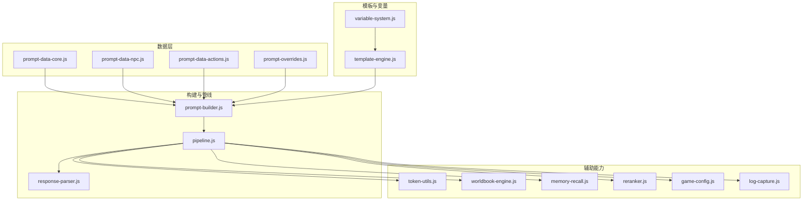
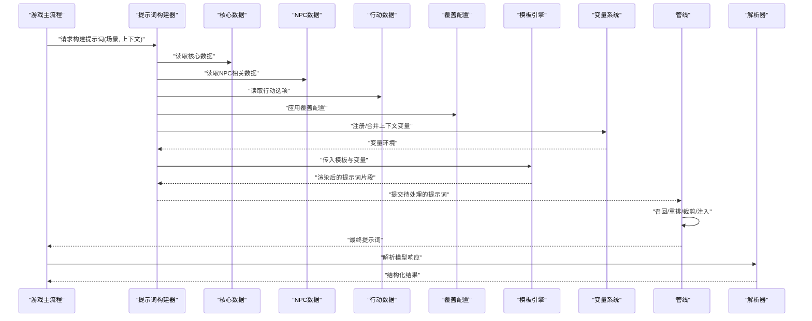
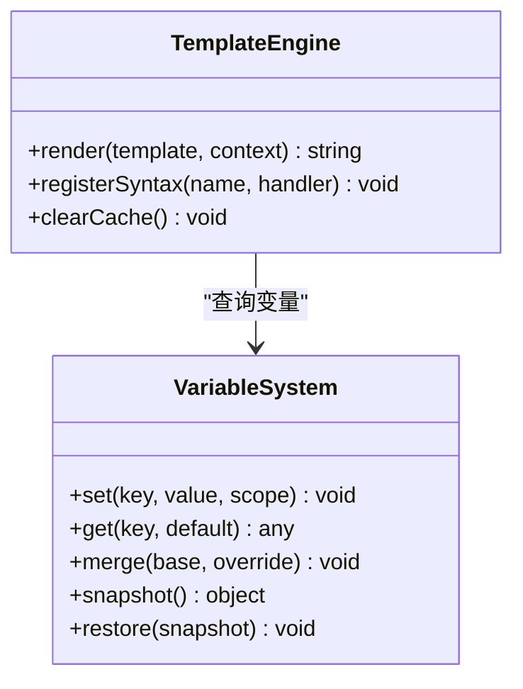
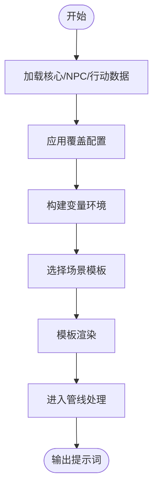
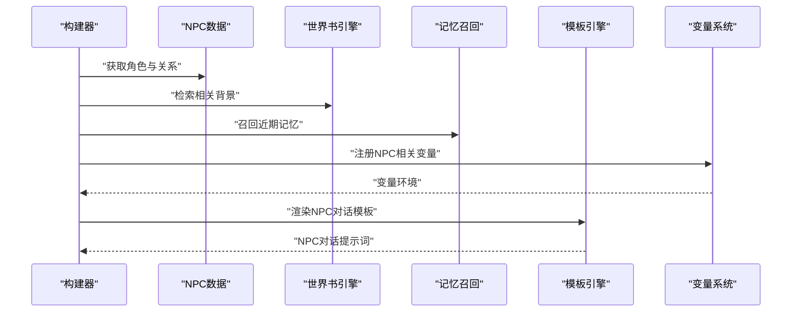
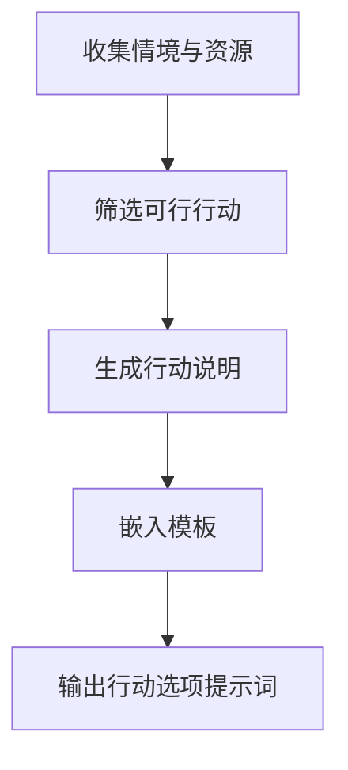
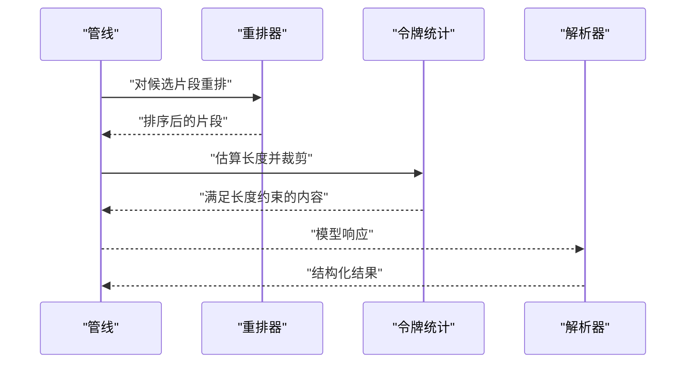
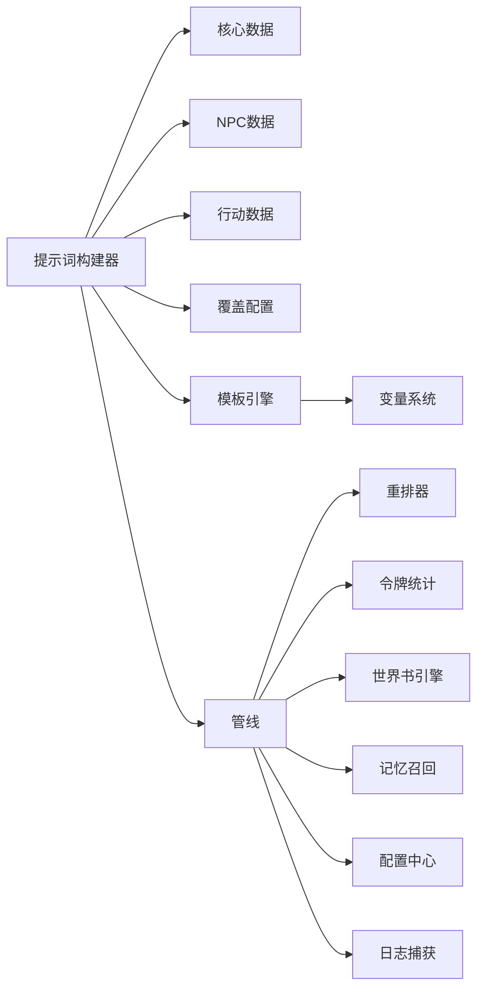

# 提示词工程系统

<cite>
**本文引用的文件**   
- [prompt-builder.js](file://module/prompt-builder.js)
- [template-engine.js](file://module/template-engine.js)
- [variable-system.js](file://module/variable-system.js)
- [prompt-data-core.js](file://module/prompt-data-core.js)
- [prompt-data-npc.js](file://module/prompt-data-npc.js)
- [prompt-data-actions.js](file://module/prompt-data-actions.js)
- [prompt-overrides.js](file://module/prompt-overrides.js)
- [pipeline.js](file://module/pipeline.js)
- [response-parser.js](file://module/response-parser.js)
- [token-utils.js](file://module/token-utils.js)
- [worldbook-engine.js](file://module/worldbook-engine.js)
- [memory-recall.js](file://module/memory-recall.js)
- [reranker.js](file://module/reranker.js)
- [game-config.js](file://module/game-config.js)
- [log-capture.js](file://module/log-capture.js)
</cite>

## 目录
1. [简介](#简介)
2. [项目结构](#项目结构)
3. [核心组件](#核心组件)
4. [架构总览](#架构总览)
5. [详细组件分析](#详细组件分析)
6. [依赖关系分析](#依赖关系分析)
7. [性能考虑](#性能考虑)
8. [故障排查指南](#故障排查指南)
9. [结论](#结论)
10. [附录](#附录)

## 简介
本文件面向“姬侠传”的提示词工程子系统，聚焦于提示词构建器的架构设计与实现细节。文档将深入解释模板引擎的工作原理、动态变量替换机制与上下文管理策略；详述核心提示词数据结构、NPC对话提示词生成逻辑以及行动选项提示词的构建流程；并提供优化技巧、性能调优方法与调试工具使用指南。最后给出扩展自定义模板与集成新对话场景的实践路径。

## 项目结构
提示词工程子系统位于前端模块目录中，围绕“数据—模板—构建—管线—解析”的主线组织：
- 数据层：核心数据、NPC数据、行动数据、覆盖配置
- 模板与变量：模板引擎、变量系统
- 构建器：组合数据与模板，产出最终提示词
- 管线：串联召回、重排、裁剪等步骤
- 解析器：对模型输出进行结构化解析
- 辅助：令牌统计、世界书检索、记忆召回、日志捕获

图表来源
- [prompt-builder.js](file://module/prompt-builder.js)
- [template-engine.js](file://module/template-engine.js)
- [variable-system.js](file://module/variable-system.js)
- [prompt-data-core.js](file://module/prompt-data-core.js)
- [prompt-data-npc.js](file://module/prompt-data-npc.js)
- [prompt-data-actions.js](file://module/prompt-data-actions.js)
- [prompt-overrides.js](file://module/prompt-overrides.js)
- [pipeline.js](file://module/pipeline.js)
- [response-parser.js](file://module/response-parser.js)
- [token-utils.js](file://module/token-utils.js)
- [worldbook-engine.js](file://module/worldbook-engine.js)
- [memory-recall.js](file://module/memory-recall.js)
- [reranker.js](file://module/reranker.js)
- [game-config.js](file://module/game-config.js)
- [log-capture.js](file://module/log-capture.js)

章节来源
- [prompt-builder.js](file://module/prompt-builder.js)
- [template-engine.js](file://module/template-engine.js)
- [variable-system.js](file://module/variable-system.js)
- [prompt-data-core.js](file://module/prompt-data-core.js)
- [prompt-data-npc.js](file://module/prompt-data-npc.js)
- [prompt-data-actions.js](file://module/prompt-data-actions.js)
- [prompt-overrides.js](file://module/prompt-overrides.js)
- [pipeline.js](file://module/pipeline.js)
- [response-parser.js](file://module/response-parser.js)
- [token-utils.js](file://module/token-utils.js)
- [worldbook-engine.js](file://module/worldbook-engine.js)
- [memory-recall.js](file://module/memory-recall.js)
- [reranker.js](file://module/reranker.js)
- [game-config.js](file://module/game-config.js)
- [log-capture.js](file://module/log-capture.js)

## 核心组件
- 模板引擎：负责模板语法解析、占位符匹配与渲染，支持条件片段与循环插值（以占位符形式表达）。
- 变量系统：提供运行时变量的注册、查找、作用域与默认值处理，确保模板渲染时能正确解析上下文。
- 提示词构建器：聚合核心数据、NPC信息、行动选项与覆盖配置，调用模板引擎完成最终提示词组装。
- 数据层：
  - 核心数据：玩家状态、世界设定、格式规范等基础内容。
  - NPC数据：角色画像、关系、当前情境与对话风格。
  - 行动数据：可选动作、触发条件、奖励与副作用描述。
  - 覆盖配置：按场景或会话级别覆盖默认行为与模板。
- 管线：统一编排召回、重排、长度控制、注入顺序等步骤，保证提示词稳定高效。
- 解析器：对模型返回的结构化内容进行校验与提取，便于后续游戏逻辑消费。
- 辅助：令牌统计用于长度控制；世界书与记忆召回用于增强上下文；重排器用于排序候选片段；配置中心集中管理开关与阈值；日志捕获用于问题定位。

章节来源
- [template-engine.js](file://module/template-engine.js)
- [variable-system.js](file://module/variable-system.js)
- [prompt-builder.js](file://module/prompt-builder.js)
- [prompt-data-core.js](file://module/prompt-data-core.js)
- [prompt-data-npc.js](file://module/prompt-data-npc.js)
- [prompt-data-actions.js](file://module/prompt-data-actions.js)
- [prompt-overrides.js](file://module/prompt-overrides.js)
- [pipeline.js](file://module/pipeline.js)
- [response-parser.js](file://module/response-parser.js)
- [token-utils.js](file://module/token-utils.js)
- [worldbook-engine.js](file://module/worldbook-engine.js)
- [memory-recall.js](file://module/memory-recall.js)
- [reranker.js](file://module/reranker.js)
- [game-config.js](file://module/game-config.js)
- [log-capture.js](file://module/log-capture.js)

## 架构总览
下图展示了从“输入上下文”到“最终提示词”的关键流转过程，包括数据准备、模板渲染、管线处理与结果解析。

图表来源
- [prompt-builder.js](file://module/prompt-builder.js)
- [template-engine.js](file://module/template-engine.js)
- [variable-system.js](file://module/variable-system.js)
- [prompt-data-core.js](file://module/prompt-data-core.js)
- [prompt-data-npc.js](file://module/prompt-data-npc.js)
- [prompt-data-actions.js](file://module/prompt-data-actions.js)
- [prompt-overrides.js](file://module/prompt-overrides.js)
- [pipeline.js](file://module/pipeline.js)
- [response-parser.js](file://module/response-parser.js)

## 详细组件分析

### 模板引擎与变量系统
- 模板引擎职责
  - 解析模板字符串中的占位符与条件/循环标记。
  - 执行渲染，将变量环境注入到模板中，生成文本片段。
  - 支持错误回退（如缺失变量时使用默认值或空串），避免渲染中断。
- 变量系统职责
  - 维护多作用域的变量表（全局、会话、场景、局部）。
  - 提供变量注册、查询、合并与覆盖策略。
  - 支持类型转换与格式化（如日期、数值、列表拼接）。
- 交互关系
  - 构建器在渲染前将上下文变量注册至变量系统。
  - 模板引擎按需向变量系统查询值，并缓存命中结果以提升性能。

图表来源
- [template-engine.js](file://module/template-engine.js)
- [variable-system.js](file://module/variable-system.js)

章节来源
- [template-engine.js](file://module/template-engine.js)
- [variable-system.js](file://module/variable-system.js)

### 提示词构建器
- 职责
  - 聚合核心数据、NPC数据、行动数据与覆盖配置。
  - 根据当前场景选择对应模板，并将变量注入后渲染。
  - 输出标准化提示词对象（包含系统提示、用户消息、附件信息等）。
- 关键流程
  - 加载数据源并应用覆盖。
  - 构建变量环境（玩家状态、NPC关系、世界书摘要、历史摘要等）。
  - 调用模板引擎渲染各段落（背景、规则、示例、当前情境、行动选项等）。
  - 交由管线进行召回、重排与长度控制。
- 可扩展点
  - 新增场景模板：通过覆盖配置或扩展数据源注入新模板键。
  - 新增变量：在变量系统中注册新键并在模板中使用。

图表来源
- [prompt-builder.js](file://module/prompt-builder.js)
- [prompt-data-core.js](file://module/prompt-data-core.js)
- [prompt-data-npc.js](file://module/prompt-data-npc.js)
- [prompt-data-actions.js](file://module/prompt-data-actions.js)
- [prompt-overrides.js](file://module/prompt-overrides.js)
- [template-engine.js](file://module/template-engine.js)
- [variable-system.js](file://module/variable-system.js)
- [pipeline.js](file://module/pipeline.js)

章节来源
- [prompt-builder.js](file://module/prompt-builder.js)
- [prompt-data-core.js](file://module/prompt-data-core.js)
- [prompt-data-npc.js](file://module/prompt-data-npc.js)
- [prompt-data-actions.js](file://module/prompt-data-actions.js)
- [prompt-overrides.js](file://module/prompt-overrides.js)
- [template-engine.js](file://module/template-engine.js)
- [variable-system.js](file://module/variable-system.js)
- [pipeline.js](file://module/pipeline.js)

### 核心提示词数据结构
- 典型字段
  - 系统提示：角色设定、任务目标、约束与输出格式。
  - 用户消息：当前对话轮次、情境描述、行动选项。
  - 元数据：版本、语言、温度、最大令牌等参数。
  - 附件/引用：世界书片段、记忆召回片段、历史摘要等。
- 数据来源
  - 核心数据定义通用结构与默认值。
  - NPC数据填充角色相关字段。
  - 行动数据提供可选项与触发条件。
  - 覆盖配置可按场景覆盖上述字段。

章节来源
- [prompt-data-core.js](file://module/prompt-data-core.js)
- [prompt-data-npc.js](file://module/prompt-data-npc.js)
- [prompt-data-actions.js](file://module/prompt-data-actions.js)
- [prompt-overrides.js](file://module/prompt-overrides.js)

### NPC对话提示词生成逻辑
- 输入
  - NPC画像、关系、当前情绪/状态、最近互动历史。
  - 世界书与记忆召回的相关片段。
- 处理
  - 构建变量：角色名、称谓、关系度、情绪标签、地点、时间等。
  - 选择NPC对话模板：根据关系阶段与场景切换不同语气与内容。
  - 渲染：插入具体对话内容与引导性问题。
- 输出
  - 一段符合角色设定的对话提示，附带可选回复引导。

图表来源
- [prompt-data-npc.js](file://module/prompt-data-npc.js)
- [worldbook-engine.js](file://module/worldbook-engine.js)
- [memory-recall.js](file://module/memory-recall.js)
- [template-engine.js](file://module/template-engine.js)
- [variable-system.js](file://module/variable-system.js)
- [prompt-builder.js](file://module/prompt-builder.js)

章节来源
- [prompt-data-npc.js](file://module/prompt-data-npc.js)
- [worldbook-engine.js](file://module/worldbook-engine.js)
- [memory-recall.js](file://module/memory-recall.js)
- [template-engine.js](file://module/template-engine.js)
- [variable-system.js](file://module/variable-system.js)
- [prompt-builder.js](file://module/prompt-builder.js)

### 行动选项提示词构建流程
- 输入
  - 当前情境、可用技能、资源限制、风险与收益评估。
- 处理
  - 筛选符合条件的行动项（基于触发条件与前置要求）。
  - 为每个行动生成简短说明与预期效果。
  - 将行动列表嵌入模板，形成“选择式”提示。
- 输出
  - 一组结构化行动选项，便于玩家选择或模型推荐。

图表来源
- [prompt-data-actions.js](file://module/prompt-data-actions.js)
- [prompt-builder.js](file://module/prompt-builder.js)
- [template-engine.js](file://module/template-engine.js)
- [variable-system.js](file://module/variable-system.js)

章节来源
- [prompt-data-actions.js](file://module/prompt-data-actions.js)
- [prompt-builder.js](file://module/prompt-builder.js)
- [template-engine.js](file://module/template-engine.js)
- [variable-system.js](file://module/variable-system.js)

### 管线与解析
- 管线职责
  - 召回：从世界书与记忆中选取最相关的片段。
  - 重排：依据相关性、时效性与重要性排序。
  - 裁剪：控制总长度，优先保留高价值内容。
  - 注入：将片段按固定位置插入提示词。
- 解析器职责
  - 校验模型输出是否符合约定格式。
  - 提取关键字段（如选择的行动、对话要点、状态变更）。
  - 失败回退：当解析失败时返回安全默认值。

图表来源
- [pipeline.js](file://module/pipeline.js)
- [reranker.js](file://module/reranker.js)
- [token-utils.js](file://module/token-utils.js)
- [response-parser.js](file://module/response-parser.js)

章节来源
- [pipeline.js](file://module/pipeline.js)
- [reranker.js](file://module/reranker.js)
- [token-utils.js](file://module/token-utils.js)
- [response-parser.js](file://module/response-parser.js)

## 依赖关系分析
- 耦合与内聚
  - 构建器与数据层低耦合：通过数据接口访问，便于替换与扩展。
  - 模板引擎与变量系统高内聚：渲染与变量查询紧密配合。
  - 管线作为编排层，聚合召回、重排、裁剪等能力，保持单一职责。
- 外部依赖与集成点
  - 世界书引擎：提供语义检索与片段召回。
  - 记忆召回：提供短期/长期记忆片段。
  - 令牌统计：用于长度控制与预算分配。
  - 配置中心：集中管理功能开关与阈值。
- 潜在循环依赖
  - 构建器不应直接依赖解析器；解析器仅消费模型输出，避免反向依赖。
  - 管线应单向依赖辅助模块，避免被辅助模块反向调用。

图表来源
- [prompt-builder.js](file://module/prompt-builder.js)
- [prompt-data-core.js](file://module/prompt-data-core.js)
- [prompt-data-npc.js](file://module/prompt-data-npc.js)
- [prompt-data-actions.js](file://module/prompt-data-actions.js)
- [prompt-overrides.js](file://module/prompt-overrides.js)
- [template-engine.js](file://module/template-engine.js)
- [variable-system.js](file://module/variable-system.js)
- [pipeline.js](file://module/pipeline.js)
- [reranker.js](file://module/reranker.js)
- [token-utils.js](file://module/token-utils.js)
- [worldbook-engine.js](file://module/worldbook-engine.js)
- [memory-recall.js](file://module/memory-recall.js)
- [game-config.js](file://module/game-config.js)
- [log-capture.js](file://module/log-capture.js)

章节来源
- [prompt-builder.js](file://module/prompt-builder.js)
- [prompt-data-core.js](file://module/prompt-data-core.js)
- [prompt-data-npc.js](file://module/prompt-data-npc.js)
- [prompt-data-actions.js](file://module/prompt-data-actions.js)
- [prompt-overrides.js](file://module/prompt-overrides.js)
- [template-engine.js](file://module/template-engine.js)
- [variable-system.js](file://module/variable-system.js)
- [pipeline.js](file://module/pipeline.js)
- [reranker.js](file://module/reranker.js)
- [token-utils.js](file://module/token-utils.js)
- [worldbook-engine.js](file://module/worldbook-engine.js)
- [memory-recall.js](file://module/memory-recall.js)
- [game-config.js](file://module/game-config.js)
- [log-capture.js](file://module/log-capture.js)

## 性能考虑
- 变量缓存
  - 在模板渲染过程中缓存已解析的变量值，减少重复计算。
- 模板预编译
  - 对常用模板进行预编译，降低运行时解析开销。
- 片段召回优化
  - 使用更精确的检索策略与过滤条件，减少无关片段数量。
- 长度控制
  - 在管线早期进行预估与裁剪，避免过长提示导致超时或成本上升。
- 并发与批处理
  - 对独立的数据加载与召回操作进行并行处理，缩短整体延迟。
- 配置开关
  - 通过配置中心关闭非必要的增强能力（如记忆召回）以降低负载。

[本节为通用指导，不直接分析具体文件]

## 故障排查指南
- 常见问题
  - 变量未定义：检查变量注册与作用域，确认模板占位符名称一致。
  - 模板渲染异常：查看模板语法是否正确，是否存在未闭合的条件/循环标记。
  - 提示词过长：调整管线裁剪阈值，精简非必要片段。
  - 解析失败：核对模型输出格式是否与解析器约定一致，必要时启用回退逻辑。
- 调试工具
  - 日志捕获：记录构建与渲染过程中的关键步骤与中间结果。
  - 令牌统计：实时显示长度变化，帮助定位超限原因。
  - 覆盖配置：临时覆盖某字段或模板，快速验证假设。
- 建议流程
  - 开启详细日志，复现问题。
  - 逐步禁用增强能力（世界书、记忆召回），缩小范围。
  - 使用最小数据集与简化模板，隔离问题。
  - 修正后回归测试，确保无副作用。

章节来源
- [log-capture.js](file://module/log-capture.js)
- [token-utils.js](file://module/token-utils.js)
- [prompt-overrides.js](file://module/prompt-overrides.js)
- [pipeline.js](file://module/pipeline.js)
- [response-parser.js](file://module/response-parser.js)

## 结论
本提示词工程系统以“数据—模板—构建—管线—解析”为主线，实现了高度可配置的提示词生成能力。通过模板引擎与变量系统的解耦设计，结合世界书与记忆召回的增强手段，能够在复杂场景中稳定产出高质量提示词。配合管线化的召回、重排与长度控制，系统在性能与质量之间取得良好平衡。未来可通过更多场景模板与变量扩展，进一步提升灵活性与表现力。

[本节为总结性内容，不直接分析具体文件]

## 附录

### 扩展自定义提示词模板
- 步骤概览
  - 在覆盖配置中注册新模板键与默认内容。
  - 在变量系统中注册所需的新变量。
  - 在构建器中选择并渲染新模板。
  - 在管线中为新模板添加必要的增强片段（如世界书或记忆）。
- 参考路径
  - 覆盖配置入口：[prompt-overrides.js](file://module/prompt-overrides.js)
  - 变量注册与合并：[variable-system.js](file://module/variable-system.js)
  - 模板渲染入口：[template-engine.js](file://module/template-engine.js)
  - 构建器选择与组装：[prompt-builder.js](file://module/prompt-builder.js)
  - 管线增强注入：[pipeline.js](file://module/pipeline.js)

章节来源
- [prompt-overrides.js](file://module/prompt-overrides.js)
- [variable-system.js](file://module/variable-system.js)
- [template-engine.js](file://module/template-engine.js)
- [prompt-builder.js](file://module/prompt-builder.js)
- [pipeline.js](file://module/pipeline.js)

### 集成新的对话场景
- 步骤概览
  - 新增场景数据：在NPC数据或核心数据中补充场景相关字段。
  - 新增场景模板：在覆盖配置中添加该场景的模板键。
  - 更新构建器逻辑：根据场景标识选择对应模板与变量集。
  - 接入管线增强：为该场景启用合适的召回与重排策略。
- 参考路径
  - 场景数据定义：[prompt-data-npc.js](file://module/prompt-data-npc.js)、[prompt-data-core.js](file://module/prompt-data-core.js)
  - 覆盖配置：[prompt-overrides.js](file://module/prompt-overrides.js)
  - 构建器选择逻辑：[prompt-builder.js](file://module/prompt-builder.js)
  - 管线策略：[pipeline.js](file://module/pipeline.js)

章节来源
- [prompt-data-npc.js](file://module/prompt-data-npc.js)
- [prompt-data-core.js](file://module/prompt-data-core.js)
- [prompt-overrides.js](file://module/prompt-overrides.js)
- [prompt-builder.js](file://module/prompt-builder.js)
- [pipeline.js](file://module/pipeline.js)