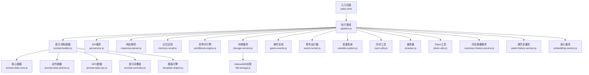
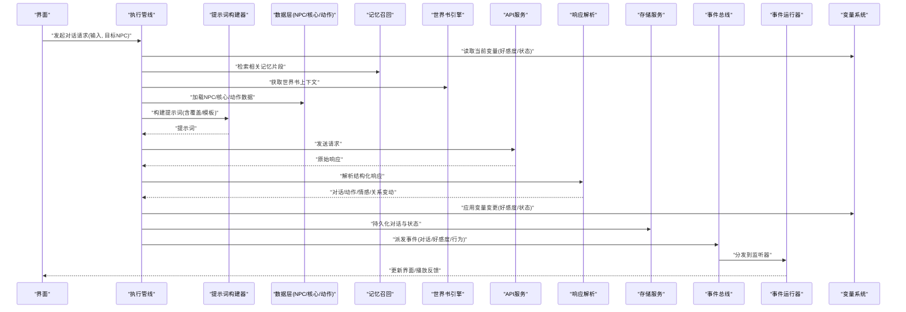
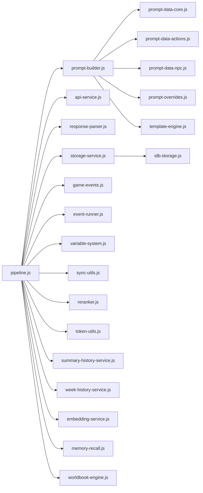

# NPC插件系统

<cite>
**本文引用的文件**   
- [prompt-data-npc.js](file://module/prompt-data-npc.js)
- [prompt-builder.js](file://module/prompt-builder.js)
- [pipeline.js](file://module/pipeline.js)
- [event-runner.js](file://module/event-runner.js)
- [memory-recall.js](file://module/memory-recall.js)
- [variable-system.js](file://module/variable-system.js)
- [game-events.js](file://module/game-events.js)
- [storage-service.js](file://module/storage-service.js)
- [idb-storage.js](file://module/idb-storage.js)
- [sync-utils.js](file://module/sync-utils.js)
- [worldbook-engine.js](file://module/worldbook-engine.js)
- [response-parser.js](file://module/response-parser.js)
- [template-engine.js](file://module/template-engine.js)
- [prompt-overrides.js](file://module/prompt-overrides.js)
- [prompt-data-actions.js](file://module/prompt-data-actions.js)
- [prompt-data-core.js](file://module/prompt-data-core.js)
- [reranker.js](file://module/reranker.js)
- [token-utils.js](file://module/token-utils.js)
- [summary-history-service.js](file://module/summary-history-service.js)
- [week-history-service.js](file://module/week-history-service.js)
- [api-service.js](file://module/api-service.js)
- [embedding-service.js](file://module/embedding-service.js)
- [index.html](file://apk/android/app/src/main/assets/public/index.html)
</cite>

## 目录
1. [简介](#简介)
2. [项目结构](#项目结构)
3. [核心组件](#核心组件)
4. [架构总览](#架构总览)
5. [详细组件分析](#详细组件分析)
6. [依赖分析](#依赖分析)
7. [性能考虑](#性能考虑)
8. [故障排查指南](#故障排查指南)
9. [结论](#结论)
10. [附录](#附录)

## 简介
本文件面向“姬侠传”NPC插件系统的开发者与策划，系统化阐述NPC角色系统的插件化设计。内容覆盖：
- NPC属性定义、对话树扩展、好感度算法与关系网络管理
- NPC插件的注册机制、状态管理与事件处理
- NPC行为模式配置与自定义对话逻辑开发指南
- NPC记忆系统与上下文感知实现细节
- NPC与游戏世界的交互机制和数据同步策略

目标是帮助读者快速理解并扩展NPC能力，构建可插拔、可扩展、可维护的角色生态。

## 项目结构
本项目采用模块化前端架构，NPC相关能力主要分布在 module 目录下的若干脚本中，通过统一的提示词构建管线与事件驱动模型进行编排。关键模块职责如下：
- prompt-data-npc.js：NPC数据与模板（属性、关系、对话片段等）
- prompt-builder.js：将多源数据组装为最终提示词
- pipeline.js：统一执行管线（加载、构建、调用、解析、持久化）
- event-runner.js：事件调度与回调分发
- memory-recall.js：记忆检索与上下文注入
- variable-system.js：变量系统与运行时状态
- game-events.js：全局事件总线
- storage-service.js / idb-storage.js：存储抽象与IndexedDB实现
- sync-utils.js：跨会话/跨标签页同步
- worldbook-engine.js：世界书引擎（背景、地点、势力等）
- response-parser.js：响应解析与结构化提取
- template-engine.js：模板渲染
- prompt-overrides.js：提示词覆盖与补丁
- prompt-data-actions.js：动作与行为数据
- prompt-data-core.js：核心数据（玩家、世界、规则）
- reranker.js：结果重排
- token-utils.js：Token统计与预算控制
- summary-history-service.js / week-history-service.js：历史摘要与周粒度归档
- api-service.js / embedding-service.js：外部API与向量嵌入服务
- index.html：入口页面，挂载各模块

图表来源
- [pipeline.js](file://module/pipeline.js)
- [prompt-builder.js](file://module/prompt-builder.js)
- [prompt-data-core.js](file://module/prompt-data-core.js)
- [prompt-data-actions.js](file://module/prompt-data-actions.js)
- [prompt-data-npc.js](file://module/prompt-data-npc.js)
- [prompt-overrides.js](file://module/prompt-overrides.js)
- [template-engine.js](file://module/template-engine.js)
- [api-service.js](file://module/api-service.js)
- [response-parser.js](file://module/response-parser.js)
- [memory-recall.js](file://module/memory-recall.js)
- [worldbook-engine.js](file://module/worldbook-engine.js)
- [storage-service.js](file://module/storage-service.js)
- [idb-storage.js](file://module/idb-storage.js)
- [game-events.js](file://module/game-events.js)
- [event-runner.js](file://module/event-runner.js)
- [variable-system.js](file://module/variable-system.js)
- [sync-utils.js](file://module/sync-utils.js)
- [reranker.js](file://module/reranker.js)
- [token-utils.js](file://module/token-utils.js)
- [summary-history-service.js](file://module/summary-history-service.js)
- [week-history-service.js](file://module/week-history-service.js)
- [embedding-service.js](file://module/embedding-service.js)
- [index.html](file://apk/android/app/src/main/assets/public/index.html)

章节来源
- [index.html](file://apk/android/app/src/main/assets/public/index.html)

## 核心组件
- NPC数据层（prompt-data-npc.js）
  - 负责NPC基础属性、关系图谱、初始对话片段、行为偏好等数据的定义与导出，供提示词构建器消费。
- 提示词构建器（prompt-builder.js）
  - 聚合核心数据、动作数据、NPC数据、世界书、变量系统与覆盖规则，生成最终提示词。
- 执行管线（pipeline.js）
  - 统一编排：准备上下文→构建提示词→调用API→解析响应→更新状态→持久化→触发事件。
- 事件系统（game-events.js + event-runner.js）
  - 提供发布/订阅式事件总线与运行器，支持NPC生命周期、对话回合、好感度变化等事件的监听与分发。
- 记忆与上下文（memory-recall.js + worldbook-engine.js）
  - 基于近期对话与世界书信息，动态注入上下文，增强NPC的连贯性与情境感知。
- 变量系统（variable-system.js）
  - 统一管理运行时变量（如好感度、关系等级、状态标志），提供读写与变更钩子。
- 存储与同步（storage-service.js + idb-storage.js + sync-utils.js）
  - 抽象存储接口，IndexedDB实现本地持久化；跨标签页/会话同步确保一致性。
- 响应解析（response-parser.js）
  - 从大模型返回文本中提取结构化字段（对话、动作、情感、关系变动等）。
- 模板引擎（template-engine.js）
  - 渲染提示词模板，支持条件分支与占位符替换。
- 覆盖与补丁（prompt-overrides.js）
  - 允许在运行时对提示词或数据进行覆盖，便于热更与A/B测试。
- 动作与行为（prompt-data-actions.js）
  - 定义NPC可执行动作、前置条件、效果与副作用。
- 核心数据（prompt-data-core.js）
  - 玩家、世界、规则等全局数据，作为提示词的基础上下文。
- 重排与Token（reranker.js + token-utils.js）
  - 对候选回复或动作进行重排；统计与控制Token用量，避免超限。
- 历史与摘要（summary-history-service.js + week-history-service.js）
  - 压缩长对话历史，按日/周维度归档，降低上下文成本。
- 外部服务（api-service.js + embedding-service.js）
  - 封装LLM调用与向量嵌入，支撑语义检索与相似性匹配。

章节来源
- [prompt-data-npc.js](file://module/prompt-data-npc.js)
- [prompt-builder.js](file://module/prompt-builder.js)
- [pipeline.js](file://module/pipeline.js)
- [game-events.js](file://module/game-events.js)
- [event-runner.js](file://module/event-runner.js)
- [memory-recall.js](file://module/memory-recall.js)
- [worldbook-engine.js](file://module/worldbook-engine.js)
- [variable-system.js](file://module/variable-system.js)
- [storage-service.js](file://module/storage-service.js)
- [idb-storage.js](file://module/idb-storage.js)
- [sync-utils.js](file://module/sync-utils.js)
- [response-parser.js](file://module/response-parser.js)
- [template-engine.js](file://module/template-engine.js)
- [prompt-overrides.js](file://module/prompt-overrides.js)
- [prompt-data-actions.js](file://module/prompt-data-actions.js)
- [prompt-data-core.js](file://module/prompt-data-core.js)
- [reranker.js](file://module/reranker.js)
- [token-utils.js](file://module/token-utils.js)
- [summary-history-service.js](file://module/summary-history-service.js)
- [week-history-service.js](file://module/week-history-service.js)
- [api-service.js](file://module/api-service.js)
- [embedding-service.js](file://module/embedding-service.js)

## 架构总览
下图展示一次NPC对话请求从UI到持久化的完整流程，以及各模块间的协作关系。

图表来源
- [pipeline.js](file://module/pipeline.js)
- [prompt-builder.js](file://module/prompt-builder.js)
- [prompt-data-npc.js](file://module/prompt-data-npc.js)
- [prompt-data-core.js](file://module/prompt-data-core.js)
- [prompt-data-actions.js](file://module/prompt-data-actions.js)
- [prompt-overrides.js](file://module/prompt-overrides.js)
- [template-engine.js](file://module/template-engine.js)
- [memory-recall.js](file://module/memory-recall.js)
- [worldbook-engine.js](file://module/worldbook-engine.js)
- [api-service.js](file://module/api-service.js)
- [response-parser.js](file://module/response-parser.js)
- [storage-service.js](file://module/storage-service.js)
- [idb-storage.js](file://module/idb-storage.js)
- [game-events.js](file://module/game-events.js)
- [event-runner.js](file://module/event-runner.js)
- [variable-system.js](file://module/variable-system.js)

## 详细组件分析

### NPC数据与属性定义（prompt-data-npc.js）
- 职责
  - 定义NPC基础属性（名称、身份、性格、兴趣、禁忌等）
  - 维护关系网络（与其他NPC的关系类型、强度、历史事件）
  - 提供初始对话片段与行为偏好，用于提示词构建与行为选择
- 数据结构要点
  - 属性字典：键值对形式，便于模板渲染与覆盖
  - 关系图：节点为NPC，边包含关系类型与权重
  - 对话片段：按场景/情绪/阶段组织，支持条件筛选
- 扩展方式
  - 新增NPC：在数据层注册属性与关系，补充对话片段
  - 调整关系：修改关系权重与类型，影响好感度计算
  - 行为偏好：定义倾向概率或阈值，驱动动作选择

章节来源
- [prompt-data-npc.js](file://module/prompt-data-npc.js)

### 提示词构建器（prompt-builder.js）
- 职责
  - 聚合多源数据（核心、动作、NPC、世界书、变量、覆盖）
  - 使用模板引擎渲染最终提示词
  - 支持覆盖与补丁，便于运行时调整
- 关键流程
  - 收集上下文：变量、记忆、世界书、NPC数据
  - 应用覆盖：合并overrides，优先级明确
  - 模板渲染：填充占位符，生成结构化提示词
- 优化点
  - 缓存已构建的静态部分
  - 增量更新动态片段（如最近对话）

章节来源
- [prompt-builder.js](file://module/prompt-builder.js)
- [template-engine.js](file://module/template-engine.js)
- [prompt-overrides.js](file://module/prompt-overrides.js)

### 执行管线（pipeline.js）
- 职责
  - 统一编排对话流程：准备→构建→调用→解析→更新→持久化→事件
- 关键步骤
  - 上下文准备：读取变量、检索记忆、加载世界书
  - 提示词构建：调用构建器生成提示词
  - 外部调用：通过API服务发送请求
  - 响应解析：结构化提取对话、动作、情感、关系变动
  - 状态更新：应用变量变更，写入存储
  - 事件派发：通知UI与业务逻辑
- 错误处理
  - 捕获异常并降级（如回退到默认回复）
  - 记录日志与指标，便于诊断

章节来源
- [pipeline.js](file://module/pipeline.js)

### 事件系统（game-events.js + event-runner.js）
- 职责
  - 提供发布/订阅式事件总线
  - 运行器负责分发事件到监听器
- 典型事件
  - 对话开始/结束
  - 好感度变化
  - NPC行为执行
  - 状态切换
- 扩展方式
  - 自定义事件类型与载荷
  - 注册监听器处理业务逻辑（如UI更新、成就解锁）

章节来源
- [game-events.js](file://module/game-events.js)
- [event-runner.js](file://module/event-runner.js)

### 记忆与上下文（memory-recall.js + worldbook-engine.js）
- 记忆召回
  - 基于关键词/语义相似度检索相关对话片段
  - 限制上下文长度，优先高相关性条目
- 世界书引擎
  - 提供地点、势力、人物背景等静态知识
  - 与记忆结合，增强NPC的情境感知
- 组合策略
  - 先检索记忆，再补充世界书，最后注入提示词

章节来源
- [memory-recall.js](file://module/memory-recall.js)
- [worldbook-engine.js](file://module/worldbook-engine.js)

### 变量系统（variable-system.js）
- 职责
  - 统一管理运行时变量（好感度、关系等级、状态标志等）
  - 提供读写接口与变更钩子
- 关键点
  - 原子更新：避免并发冲突
  - 版本控制：支持回滚与审计
  - 事件联动：变量变更触发相关事件

章节来源
- [variable-system.js](file://module/variable-system.js)

### 存储与同步（storage-service.js + idb-storage.js + sync-utils.js）
- 存储抽象
  - 统一接口：读/写/删除/查询
  - IndexedDB实现：高性能本地持久化
- 同步策略
  - 跨标签页/会话同步：确保状态一致
  - 冲突解决：以时间戳或版本号为准
- 数据模型
  - 对话历史、NPC状态、变量快照、摘要归档

章节来源
- [storage-service.js](file://module/storage-service.js)
- [idb-storage.js](file://module/idb-storage.js)
- [sync-utils.js](file://module/sync-utils.js)

### 响应解析（response-parser.js）
- 职责
  - 从大模型返回文本中提取结构化字段
- 关键字段
  - 对话内容、动作指令、情感倾向、关系变动
- 健壮性
  - 容错解析：缺失字段时回退默认值
  - 校验与清洗：防止非法数据进入状态

章节来源
- [response-parser.js](file://module/response-parser.js)

### 动作与行为（prompt-data-actions.js）
- 职责
  - 定义NPC可执行动作、前置条件、效果与副作用
- 行为模式
  - 基于偏好与上下文选择动作
  - 支持随机性与确定性混合策略
- 扩展方式
  - 新增动作类型与参数
  - 配置动作链与条件分支

章节来源
- [prompt-data-actions.js](file://module/prompt-data-actions.js)

### 核心数据（prompt-data-core.js）
- 职责
  - 提供玩家、世界、规则等全局数据
- 作用
  - 作为提示词的基础上下文
  - 驱动行为选择与对话分支

章节来源
- [prompt-data-core.js](file://module/prompt-data-core.js)

### 重排与Token（reranker.js + token-utils.js）
- 重排器
  - 对候选回复或动作进行评分与排序
  - 考虑相关性、多样性、风险等因素
- Token工具
  - 统计Token用量，控制预算
  - 动态裁剪上下文以避免超限

章节来源
- [reranker.js](file://module/reranker.js)
- [token-utils.js](file://module/token-utils.js)

### 历史与摘要（summary-history-service.js + week-history-service.js）
- 历史摘要
  - 压缩长对话历史，保留关键信息
- 周归档
  - 按周维度归档，降低长期存储成本
- 用途
  - 减少上下文长度，提升响应速度与质量

章节来源
- [summary-history-service.js](file://module/summary-history-service.js)
- [week-history-service.js](file://module/week-history-service.js)

### 外部服务（api-service.js + embedding-service.js）
- API服务
  - 封装LLM调用，处理重试与超时
- 嵌入服务
  - 生成向量嵌入，支撑语义检索
- 集成点
  - 被管线与记忆模块调用

章节来源
- [api-service.js](file://module/api-service.js)
- [embedding-service.js](file://module/embedding-service.js)

## 依赖分析
下图展示模块间的主要依赖关系，突出NPC插件系统的核心耦合点。

图表来源
- [pipeline.js](file://module/pipeline.js)
- [prompt-builder.js](file://module/prompt-builder.js)
- [prompt-data-core.js](file://module/prompt-data-core.js)
- [prompt-data-actions.js](file://module/prompt-data-actions.js)
- [prompt-data-npc.js](file://module/prompt-data-npc.js)
- [prompt-overrides.js](file://module/prompt-overrides.js)
- [template-engine.js](file://module/template-engine.js)
- [api-service.js](file://module/api-service.js)
- [response-parser.js](file://module/response-parser.js)
- [storage-service.js](file://module/storage-service.js)
- [idb-storage.js](file://module/idb-storage.js)
- [game-events.js](file://module/game-events.js)
- [event-runner.js](file://module/event-runner.js)
- [variable-system.js](file://module/variable-system.js)
- [sync-utils.js](file://module/sync-utils.js)
- [reranker.js](file://module/reranker.js)
- [token-utils.js](file://module/token-utils.js)
- [summary-history-service.js](file://module/summary-history-service.js)
- [week-history-service.js](file://module/week-history-service.js)
- [embedding-service.js](file://module/embedding-service.js)
- [memory-recall.js](file://module/memory-recall.js)
- [worldbook-engine.js](file://module/worldbook-engine.js)

章节来源
- [pipeline.js](file://module/pipeline.js)

## 性能考虑
- 上下文长度控制
  - 使用Token工具统计与裁剪，避免超限导致失败或降质
- 历史压缩
  - 通过摘要服务与周归档降低长期上下文成本
- 缓存与复用
  - 缓存静态提示词片段与NPC基础数据
- 异步与批处理
  - 并行检索记忆与世界书，减少等待时间
- 重排与过滤
  - 在候选较多时进行重排，提高命中率与质量

[本节为通用指导，不直接分析具体文件]

## 故障排查指南
- 常见问题
  - 提示词过长：检查Token统计与上下文裁剪策略
  - 解析失败：确认响应格式与解析器的容错逻辑
  - 状态不同步：验证存储与同步服务的冲突解决策略
  - 事件未触发：检查事件类型与监听器注册
- 定位方法
  - 启用日志捕获，关注管线关键步骤
  - 使用覆盖功能临时替换数据，隔离问题
  - 回放历史摘要，复现场景

章节来源
- [pipeline.js](file://module/pipeline.js)
- [response-parser.js](file://module/response-parser.js)
- [storage-service.js](file://module/storage-service.js)
- [sync-utils.js](file://module/sync-utils.js)
- [game-events.js](file://module/game-events.js)
- [prompt-overrides.js](file://module/prompt-overrides.js)

## 结论
NPC插件系统通过模块化设计与事件驱动架构，实现了高度可扩展的角色生态。核心在于：
- 清晰的数据分层（NPC/核心/动作）
- 灵活的提示词构建与覆盖机制
- 强大的记忆与世界书上下文注入
- 稳健的状态管理与持久化同步
- 完善的事件系统与解析流程

遵循本文档的开发指南，可快速扩展NPC能力，构建丰富且连贯的互动体验。

[本节为总结，不直接分析具体文件]

## 附录
- 开发建议
  - 新增NPC时，优先完善属性与关系，再补充对话片段
  - 使用覆盖功能进行A/B测试与热更
  - 监控Token用量与解析成功率，持续优化
- 最佳实践
  - 保持数据与逻辑解耦，便于独立迭代
  - 事件命名规范，载荷结构稳定
  - 存储与同步策略一致，避免数据漂移

[本节为附加信息，不直接分析具体文件]