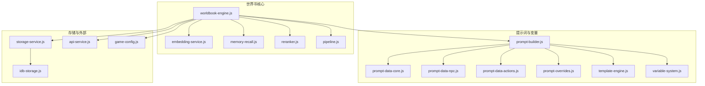
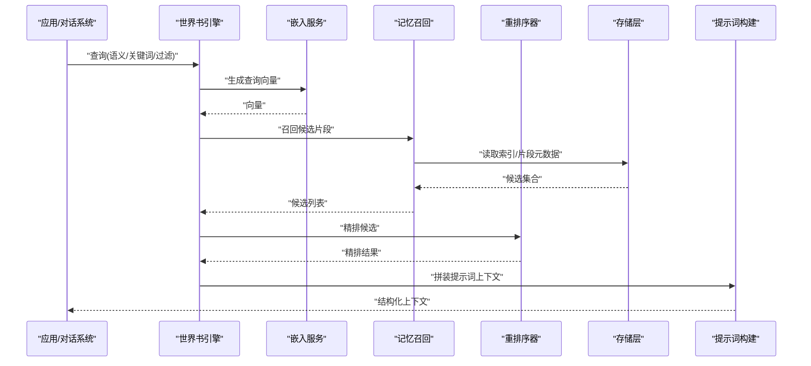
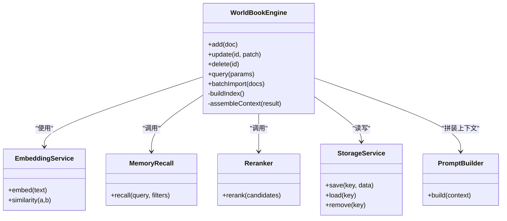
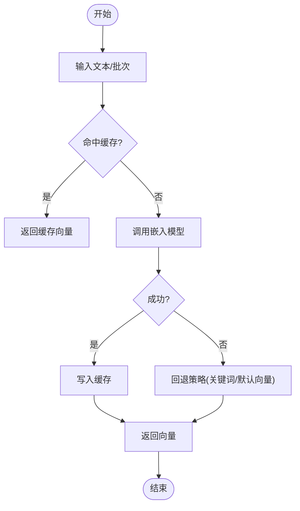
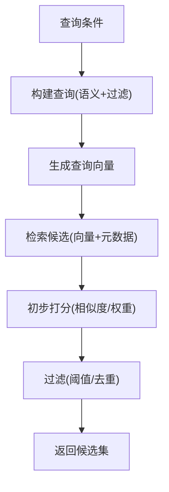
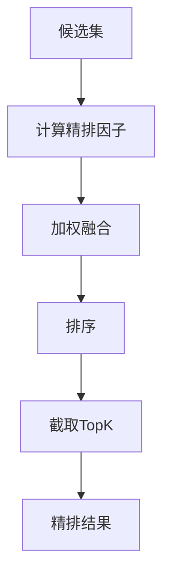
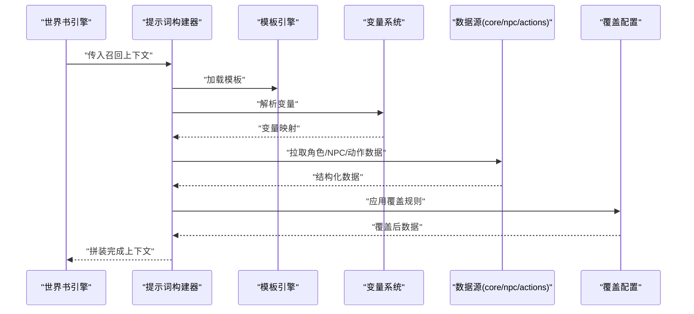
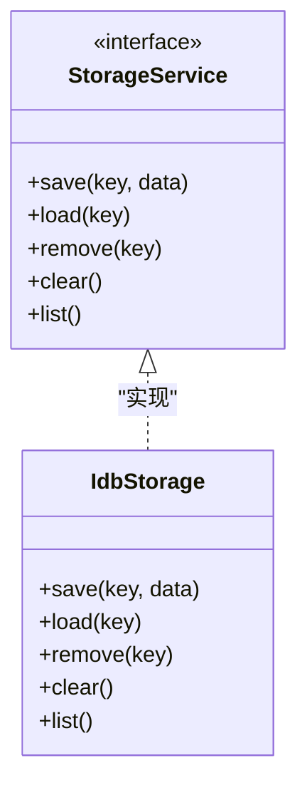
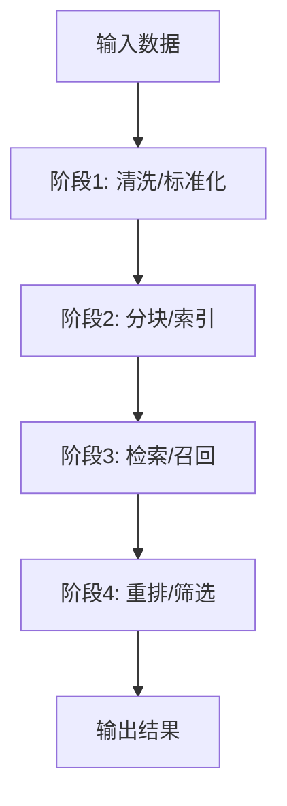
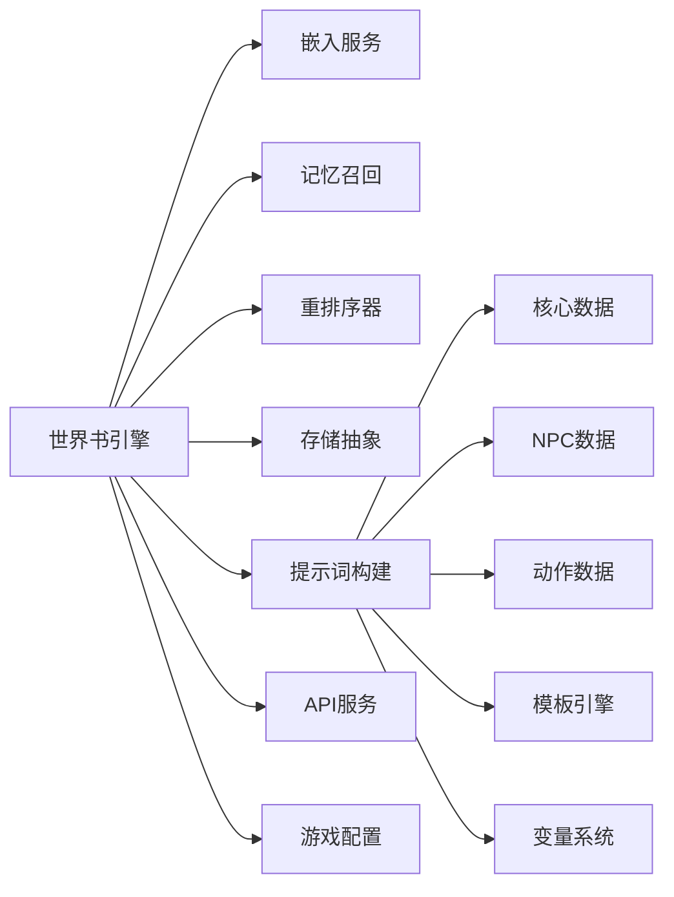

# 世界书扩展机制

<cite>
**本文引用的文件**   
- [worldbook-engine.js](file://module/worldbook-engine.js)
- [embedding-service.js](file://module/embedding-service.js)
- [memory-recall.js](file://module/memory-recall.js)
- [reranker.js](file://module/reranker.js)
- [prompt-builder.js](file://module/prompt-builder.js)
- [custom-worldbook.js](file://module/custom-worldbook.js)
- [pipeline.js](file://module/pipeline.js)
- [storage-service.js](file://module/storage-service.js)
- [idb-storage.js](file://module/idb-storage.js)
- [prompt-data-core.js](file://module/prompt-data-core.js)
- [prompt-data-npc.js](file://module/prompt-data-npc.js)
- [prompt-data-actions.js](file://module/prompt-data-actions.js)
- [prompt-overrides.js](file://module/prompt-overrides.js)
- [template-engine.js](file://module/template-engine.js)
- [variable-system.js](file://module/variable-system.js)
- [token-utils.js](file://module/token-utils.js)
- [game-config.js](file://module/game-config.js)
- [api-service.js](file://module/api-service.js)
</cite>

## 目录
1. [简介](#简介)
2. [项目结构](#项目结构)
3. [核心组件](#核心组件)
4. [架构总览](#架构总览)
5. [详细组件分析](#详细组件分析)
6. [依赖关系分析](#依赖关系分析)
7. [性能与可扩展性](#性能与可扩展性)
8. [故障排查指南](#故障排查指南)
9. [结论](#结论)
10. [附录：接口与配置](#附录接口与配置)

## 简介
本文件面向“姬侠传”的世界书扩展机制，系统性阐述其知识图谱构建、语义检索与记忆召回的整体设计，并给出内容增删改查的接口说明、自定义知识类型定义方法、向量嵌入服务集成方式、检索算法配置项，以及与AI对话系统的深度集成路径。文档兼顾工程实现与可操作指南，帮助开发者快速扩展世界书能力。

## 项目结构
围绕世界书的核心模块集中在 module 目录下，关键文件包括：
- worldbook-engine.js：世界书引擎主入口，编排知识入库、索引、检索与召回流程
- embedding-service.js：向量嵌入服务封装，负责文本向量化与相似度计算
- memory-recall.js：记忆召回策略与上下文组装
- reranker.js：重排序器，对候选结果进行二次精排
- prompt-builder.js / prompt-data-*.js / prompt-overrides.js / template-engine.js / variable-system.js：提示词构建与变量注入
- pipeline.js：通用处理管线，串联多阶段处理（如清洗、分块、索引、检索）
- storage-service.js / idb-storage.js：持久化存储抽象与 IndexedDB 实现
- game-config.js / api-service.js：游戏配置与外部API调用封装

图表来源
- [worldbook-engine.js](file://module/worldbook-engine.js)
- [embedding-service.js](file://module/embedding-service.js)
- [memory-recall.js](file://module/memory-recall.js)
- [reranker.js](file://module/reranker.js)
- [pipeline.js](file://module/pipeline.js)
- [prompt-builder.js](file://module/prompt-builder.js)
- [prompt-data-core.js](file://module/prompt-data-core.js)
- [prompt-data-npc.js](file://module/prompt-data-npc.js)
- [prompt-data-actions.js](file://module/prompt-data-actions.js)
- [prompt-overrides.js](file://module/prompt-overrides.js)
- [template-engine.js](file://module/template-engine.js)
- [variable-system.js](file://module/variable-system.js)
- [storage-service.js](file://module/storage-service.js)
- [idb-storage.js](file://module/idb-storage.js)
- [api-service.js](file://module/api-service.js)
- [game-config.js](file://module/game-config.js)

章节来源
- [worldbook-engine.js](file://module/worldbook-engine.js)
- [embedding-service.js](file://module/embedding-service.js)
- [memory-recall.js](file://module/memory-recall.js)
- [reranker.js](file://module/reranker.js)
- [pipeline.js](file://module/pipeline.js)
- [prompt-builder.js](file://module/prompt-builder.js)
- [prompt-data-core.js](file://module/prompt-data-core.js)
- [prompt-data-npc.js](file://module/prompt-data-npc.js)
- [prompt-data-actions.js](file://module/prompt-data-actions.js)
- [prompt-overrides.js](file://module/prompt-overrides.js)
- [template-engine.js](file://module/template-engine.js)
- [variable-system.js](file://module/variable-system.js)
- [storage-service.js](file://module/storage-service.js)
- [idb-storage.js](file://module/idb-storage.js)
- [api-service.js](file://module/api-service.js)
- [game-config.js](file://module/game-config.js)

## 核心组件
- 世界书引擎（worldbook-engine.js）
  - 职责：统一编排知识入库、索引构建、语义检索、记忆召回与提示词拼装；提供对外API（添加、更新、删除、查询、批量导入）。
  - 关键点：与嵌入服务、重排序器、存储层和提示词构建器协作；支持按场景/实体/事件等维度组织知识片段。
- 向量嵌入服务（embedding-service.js）
  - 职责：将文本转换为向量，提供相似度计算；可对接本地或远程模型；暴露配置项（模型名、维度、批大小、缓存策略）。
- 记忆召回（memory-recall.js）
  - 职责：根据当前对话上下文与用户意图，从世界书中召回相关片段；支持时间衰减、重要性权重与上下文相关性打分。
- 重排序器（reranker.js）
  - 职责：对初筛候选进行二次精排，融合语义相似度、实体匹配度、时效性与业务规则。
- 提示词构建（prompt-builder.js 及 prompt-data-*.js）
  - 职责：基于模板与变量系统，将召回结果与角色/NPC/动作数据拼装为LLM可用的提示词；支持覆盖与动态替换。
- 存储层（storage-service.js / idb-storage.js）
  - 职责：抽象持久化接口，IndexedDB 实现用于本地持久化；支持快照与增量同步。
- 管线（pipeline.js）
  - 职责：串联预处理、分块、索引、检索、重排等阶段，便于扩展新阶段。

章节来源
- [worldbook-engine.js](file://module/worldbook-engine.js)
- [embedding-service.js](file://module/embedding-service.js)
- [memory-recall.js](file://module/memory-recall.js)
- [reranker.js](file://module/reranker.js)
- [prompt-builder.js](file://module/prompt-builder.js)
- [prompt-data-core.js](file://module/prompt-data-core.js)
- [prompt-data-npc.js](file://module/prompt-data-npc.js)
- [prompt-data-actions.js](file://module/prompt-data-actions.js)
- [prompt-overrides.js](file://module/prompt-overrides.js)
- [template-engine.js](file://module/template-engine.js)
- [variable-system.js](file://module/variable-system.js)
- [storage-service.js](file://module/storage-service.js)
- [idb-storage.js](file://module/idb-storage.js)
- [pipeline.js](file://module/pipeline.js)

## 架构总览
世界书采用分层与插件化结合的设计：
- 接入层：对外暴露统一的增删改查与批量导入接口
- 编排层：世界书引擎协调各子系统
- 算法层：嵌入服务、召回策略、重排序器
- 数据层：存储抽象与具体实现
- 应用层：提示词构建与变量注入，驱动AI对话

图表来源
- [worldbook-engine.js](file://module/worldbook-engine.js)
- [embedding-service.js](file://module/embedding-service.js)
- [memory-recall.js](file://module/memory-recall.js)
- [reranker.js](file://module/reranker.js)
- [storage-service.js](file://module/storage-service.js)
- [prompt-builder.js](file://module/prompt-builder.js)

## 详细组件分析

### 世界书引擎（worldbook-engine.js）
- 功能要点
  - 提供 add/update/delete/query/batchImport 等方法
  - 内部维护知识片段、索引与元数据
  - 与嵌入服务、召回、重排、存储、提示词构建器交互
- 扩展点
  - 注册新的知识类型处理器
  - 插入自定义召回策略或重排规则
  - 替换存储后端（通过存储抽象）

图表来源
- [worldbook-engine.js](file://module/worldbook-engine.js)
- [embedding-service.js](file://module/embedding-service.js)
- [memory-recall.js](file://module/memory-recall.js)
- [reranker.js](file://module/reranker.js)
- [storage-service.js](file://module/storage-service.js)
- [prompt-builder.js](file://module/prompt-builder.js)

章节来源
- [worldbook-engine.js](file://module/worldbook-engine.js)

### 向量嵌入服务（embedding-service.js）
- 功能要点
  - 文本到向量转换，支持批量与缓存
  - 相似度计算（余弦/内积等）
  - 可配置模型参数（维度、批大小、超时、重试）
- 集成方式
  - 本地模型：直接调用内置推理
  - 远程模型：通过 api-service.js 发起请求
  - 失败回退：降级为关键词匹配或空向量占位

图表来源
- [embedding-service.js](file://module/embedding-service.js)
- [api-service.js](file://module/api-service.js)

章节来源
- [embedding-service.js](file://module/embedding-service.js)
- [api-service.js](file://module/api-service.js)

### 记忆召回（memory-recall.js）
- 召回策略
  - 语义召回：基于向量相似度
  - 标签/实体召回：基于元数据过滤
  - 时序召回：考虑时间衰减与最近性
- 输出
  - 候选片段集合，附带分数与来源信息

图表来源
- [memory-recall.js](file://module/memory-recall.js)
- [embedding-service.js](file://module/embedding-service.js)

章节来源
- [memory-recall.js](file://module/memory-recall.js)

### 重排序器（reranker.js）
- 精排因子
  - 语义相似度
  - 实体/标签匹配度
  - 时效性与重要性权重
  - 业务规则（如场景优先、NPC关联度）
- 输出
  - 精排后的有序结果，供提示词构建使用

图表来源
- [reranker.js](file://module/reranker.js)

章节来源
- [reranker.js](file://module/reranker.js)

### 提示词构建与变量注入（prompt-builder.js / prompt-data-*.js / template-engine.js / variable-system.js）
- 构建流程
  - 加载基础模板与覆盖配置
  - 注入全局变量与运行时变量
  - 合并角色/NPC/动作等数据源
  - 生成最终提示词上下文
- 覆盖机制
  - 通过 prompt-overrides.js 动态替换特定字段或段落

图表来源
- [prompt-builder.js](file://module/prompt-builder.js)
- [template-engine.js](file://module/template-engine.js)
- [variable-system.js](file://module/variable-system.js)
- [prompt-data-core.js](file://module/prompt-data-core.js)
- [prompt-data-npc.js](file://module/prompt-data-npc.js)
- [prompt-data-actions.js](file://module/prompt-data-actions.js)
- [prompt-overrides.js](file://module/prompt-overrides.js)

章节来源
- [prompt-builder.js](file://module/prompt-builder.js)
- [prompt-data-core.js](file://module/prompt-data-core.js)
- [prompt-data-npc.js](file://module/prompt-data-npc.js)
- [prompt-data-actions.js](file://module/prompt-data-actions.js)
- [prompt-overrides.js](file://module/prompt-overrides.js)
- [template-engine.js](file://module/template-engine.js)
- [variable-system.js](file://module/variable-system.js)

### 存储层（storage-service.js / idb-storage.js）
- 抽象接口
  - save/load/remove/clear/list 等
- IndexedDB 实现
  - 支持对象存储、索引与事务
  - 快照与增量同步工具配合使用

图表来源
- [storage-service.js](file://module/storage-service.js)
- [idb-storage.js](file://module/idb-storage.js)

章节来源
- [storage-service.js](file://module/storage-service.js)
- [idb-storage.js](file://module/idb-storage.js)

### 管线（pipeline.js）
- 作用
  - 串联多个处理阶段（如清洗、分块、索引、检索、重排）
  - 支持阶段插拔与错误恢复
- 扩展
  - 新增阶段只需注册到管线即可参与全流程

图表来源
- [pipeline.js](file://module/pipeline.js)

章节来源
- [pipeline.js](file://module/pipeline.js)

## 依赖关系分析
- 耦合关系
  - 世界书引擎强依赖嵌入服务、召回、重排与存储抽象
  - 提示词构建依赖模板引擎与变量系统，以及数据源模块
- 外部依赖
  - api-service.js 用于远程嵌入模型或外部知识库访问
  - game-config.js 提供运行期配置（如模型参数、阈值、开关）

图表来源
- [worldbook-engine.js](file://module/worldbook-engine.js)
- [embedding-service.js](file://module/embedding-service.js)
- [memory-recall.js](file://module/memory-recall.js)
- [reranker.js](file://module/reranker.js)
- [storage-service.js](file://module/storage-service.js)
- [prompt-builder.js](file://module/prompt-builder.js)
- [prompt-data-core.js](file://module/prompt-data-core.js)
- [prompt-data-npc.js](file://module/prompt-data-npc.js)
- [prompt-data-actions.js](file://module/prompt-data-actions.js)
- [template-engine.js](file://module/template-engine.js)
- [variable-system.js](file://module/variable-system.js)
- [api-service.js](file://module/api-service.js)
- [game-config.js](file://module/game-config.js)

章节来源
- [worldbook-engine.js](file://module/worldbook-engine.js)
- [embedding-service.js](file://module/embedding-service.js)
- [memory-recall.js](file://module/memory-recall.js)
- [reranker.js](file://module/reranker.js)
- [storage-service.js](file://module/storage-service.js)
- [prompt-builder.js](file://module/prompt-builder.js)
- [prompt-data-core.js](file://module/prompt-data-core.js)
- [prompt-data-npc.js](file://module/prompt-data-npc.js)
- [prompt-data-actions.js](file://module/prompt-data-actions.js)
- [template-engine.js](file://module/template-engine.js)
- [variable-system.js](file://module/variable-system.js)
- [api-service.js](file://module/api-service.js)
- [game-config.js](file://module/game-config.js)

## 性能与可扩展性
- 性能优化建议
  - 嵌入服务启用批处理与缓存，减少重复计算
  - 召回阶段设置合理阈值与TopK，避免过大候选集
  - 重排序器采用轻量级评分函数，必要时异步并行
  - 存储层使用索引与分页，避免全表扫描
- 可扩展性设计
  - 通过 pipeline.js 插入新阶段（如领域词典增强、实体链接）
  - 在 reranker.js 中增加业务规则或学习式排序
  - 在 embedding-service.js 中切换不同模型或混合策略
  - 通过 custom-worldbook.js 扩展自定义知识类型与处理逻辑

[本节为通用指导，不直接分析具体文件]

## 故障排查指南
- 常见问题
  - 嵌入服务不可用：检查网络与模型端点，确认回退策略生效
  - 召回结果为空：调整相似度阈值、扩大TopK或放宽过滤条件
  - 提示词过长：使用 token-utils.js 控制长度，裁剪低权重片段
  - 存储异常：检查 IndexedDB 权限与容量，必要时清理旧快照
- 定位手段
  - 开启日志捕获与调试模式
  - 打印中间结果（候选集、精排分数、变量注入前后对比）
  - 使用 pipeline 的阶段断点观察数据流转

章节来源
- [token-utils.js](file://module/token-utils.js)
- [idb-storage.js](file://module/idb-storage.js)
- [api-service.js](file://module/api-service.js)

## 结论
世界书扩展机制以模块化与插件化为核心，围绕“嵌入—召回—重排—提示词构建”的主链路展开，具备较强的可扩展性与容错能力。通过清晰的接口与配置项，开发者可便捷地扩展知识类型、定制检索策略、集成不同嵌入模型，并与AI对话系统深度联动，形成持续进化的知识中枢。

[本节为总结，不直接分析具体文件]

## 附录：接口与配置

### 世界书内容接口
- 添加
  - 方法：add(doc)
  - 说明：将单条知识片段入库，自动分块与索引
  - 参考路径：[worldbook-engine.js](file://module/worldbook-engine.js)
- 更新
  - 方法：update(id, patch)
  - 说明：按ID局部更新片段内容与元数据
  - 参考路径：[worldbook-engine.js](file://module/worldbook-engine.js)
- 删除
  - 方法：delete(id)
  - 说明：移除指定片段及其索引
  - 参考路径：[worldbook-engine.js](file://module/worldbook-engine.js)
- 查询
  - 方法：query(params)
  - 说明：支持语义、关键词、标签、时间范围等过滤
  - 参考路径：[worldbook-engine.js](file://module/worldbook-engine.js)
- 批量导入
  - 方法：batchImport(docs)
  - 说明：批量入库，支持并发与失败重试
  - 参考路径：[worldbook-engine.js](file://module/worldbook-engine.js)

章节来源
- [worldbook-engine.js](file://module/worldbook-engine.js)

### 自定义知识类型定义与扩展点
- 定义位置
  - 在 custom-worldbook.js 中注册新类型处理器
- 扩展点
  - 类型解析器：将原始数据转为标准片段结构
  - 索引策略：针对该类型的特殊索引字段
  - 召回权重：为该类型设定默认权重
- 参考路径
  - [custom-worldbook.js](file://module/custom-worldbook.js)

章节来源
- [custom-worldbook.js](file://module/custom-worldbook.js)

### 向量嵌入服务集成
- 集成方式
  - 本地模型：直接调用 embedding-service.js 的本地推理
  - 远程模型：通过 api-service.js 发送请求
- 配置项
  - 模型名称、向量维度、批大小、超时、重试次数、缓存开关
- 参考路径
  - [embedding-service.js](file://module/embedding-service.js)
  - [api-service.js](file://module/api-service.js)

章节来源
- [embedding-service.js](file://module/embedding-service.js)
- [api-service.js](file://module/api-service.js)

### 检索算法配置选项
- 相似度度量
  - 余弦相似度、内积等
- 阈值与TopK
  - 相似度阈值、召回TopK数量
- 过滤条件
  - 标签、实体、时间窗口、来源域
- 参考路径
  - [memory-recall.js](file://module/memory-recall.js)
  - [reranker.js](file://module/reranker.js)
  - [game-config.js](file://module/game-config.js)

章节来源
- [memory-recall.js](file://module/memory-recall.js)
- [reranker.js](file://module/reranker.js)
- [game-config.js](file://module/game-config.js)

### 与AI对话系统的深度集成
- 集成流程
  - 世界书引擎产出结构化上下文
  - 提示词构建器拼装角色/NPC/动作数据与变量
  - 将最终提示词发送给对话模型
- 覆盖与定制
  - 通过 prompt-overrides.js 动态替换提示词片段
- 参考路径
  - [prompt-builder.js](file://module/prompt-builder.js)
  - [prompt-data-core.js](file://module/prompt-data-core.js)
  - [prompt-data-npc.js](file://module/prompt-data-npc.js)
  - [prompt-data-actions.js](file://module/prompt-data-actions.js)
  - [prompt-overrides.js](file://module/prompt-overrides.js)
  - [template-engine.js](file://module/template-engine.js)
  - [variable-system.js](file://module/variable-system.js)

章节来源
- [prompt-builder.js](file://module/prompt-builder.js)
- [prompt-data-core.js](file://module/prompt-data-core.js)
- [prompt-data-npc.js](file://module/prompt-data-npc.js)
- [prompt-data-actions.js](file://module/prompt-data-actions.js)
- [prompt-overrides.js](file://module/prompt-overrides.js)
- [template-engine.js](file://module/template-engine.js)
- [variable-system.js](file://module/variable-system.js)