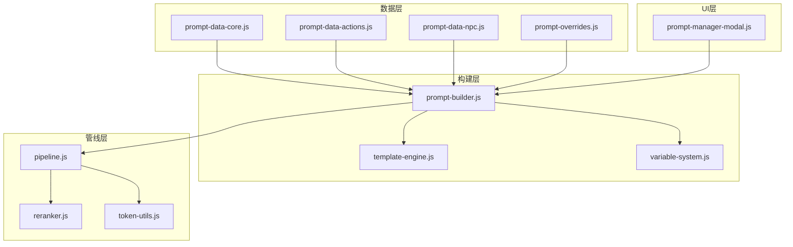
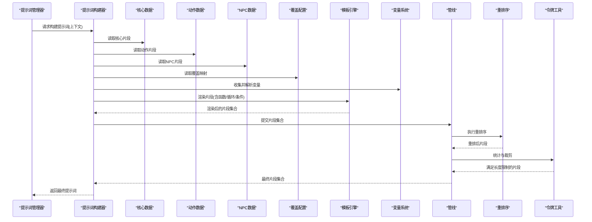
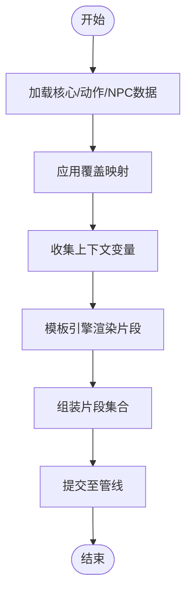
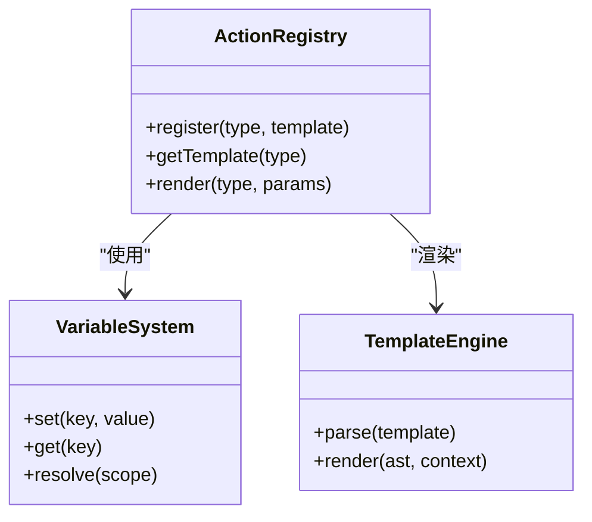
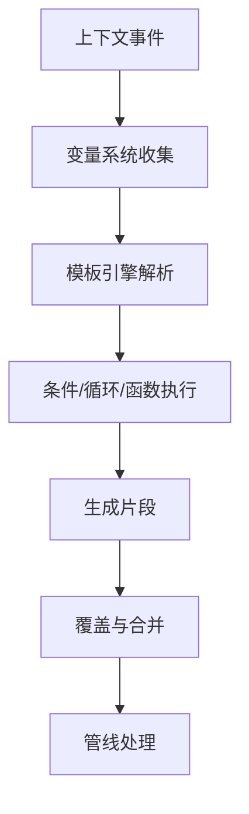
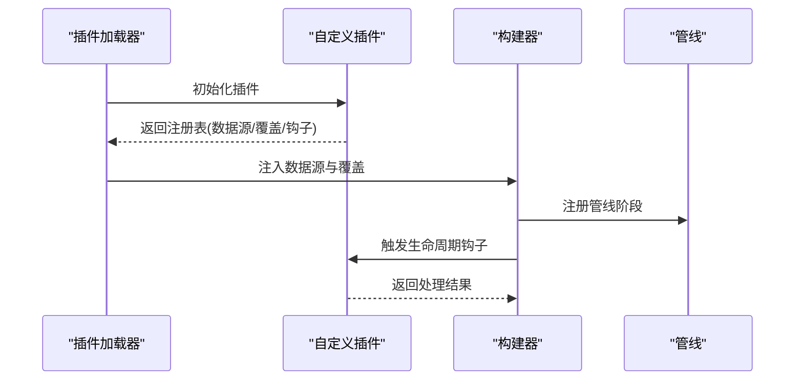
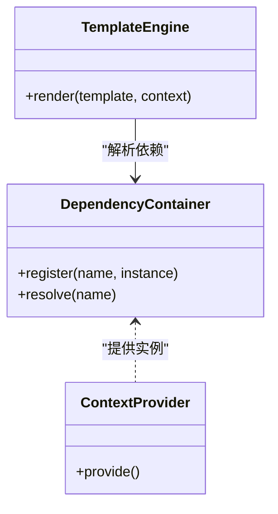
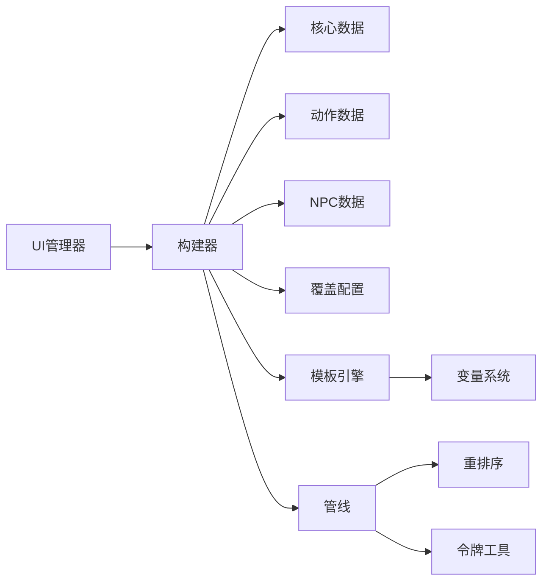

# 提示词插件系统

<cite>
**本文引用的文件**   
- [prompt-builder.js](file://module/prompt-builder.js)
- [prompt-data-core.js](file://module/prompt-data-core.js)
- [prompt-data-actions.js](file://module/prompt-data-actions.js)
- [prompt-data-npc.js](file://module/prompt-data-npc.js)
- [prompt-overrides.js](file://module/prompt-overrides.js)
- [template-engine.js](file://module/template-engine.js)
- [pipeline.js](file://module/pipeline.js)
- [variable-system.js](file://module/variable-system.js)
- [token-utils.js](file://module/token-utils.js)
- [reranker.js](file://module/reranker.js)
- [prompt-manager-modal.js](file://ui/prompt-manager-modal.js)
</cite>

## 目录
1. [简介](#简介)
2. [项目结构](#项目结构)
3. [核心组件](#核心组件)
4. [架构总览](#架构总览)
5. [详细组件分析](#详细组件分析)
6. [依赖关系分析](#依赖关系分析)
7. [性能与缓存策略](#性能与缓存策略)
8. [故障排查指南](#故障排查指南)
9. [结论](#结论)
10. [附录：开发指南与示例](#附录开发指南与示例)

## 简介
本文件面向“姬侠传”的提示词插件系统，系统性阐述提示词数据模块的架构设计、扩展机制与动态构建流程。重点覆盖：
- 核心提示词管理（注册、加载、合并、覆盖）
- 动作提示词扩展（动作类型、参数化模板、运行时注入）
- 动态提示词构建（变量系统、模板引擎、上下文拼装）
- 插件注册接口、生命周期管理与依赖注入
- 模板引擎使用方法与自定义提示词开发规范
- 缓存策略与性能优化技巧

## 项目结构
提示词相关代码主要位于 module 与 ui 两个目录中，采用“分层+模块化”的组织方式：
- 数据层：核心提示词、动作提示词、NPC 提示词等数据源
- 构建层：提示词构建器、模板引擎、变量系统
- 管线层：流水线编排、重排序、令牌统计
- 覆盖层：运行时覆盖与补丁
- UI 层：提示词管理器弹窗，提供可视化配置与调试

图表来源
- [prompt-builder.js](file://module/prompt-builder.js)
- [prompt-data-core.js](file://module/prompt-data-core.js)
- [prompt-data-actions.js](file://module/prompt-data-actions.js)
- [prompt-data-npc.js](file://module/prompt-data-npc.js)
- [prompt-overrides.js](file://module/prompt-overrides.js)
- [template-engine.js](file://module/template-engine.js)
- [variable-system.js](file://module/variable-system.js)
- [pipeline.js](file://module/pipeline.js)
- [reranker.js](file://module/reranker.js)
- [token-utils.js](file://module/token-utils.js)
- [prompt-manager-modal.js](file://ui/prompt-manager-modal.js)

章节来源
- [prompt-builder.js](file://module/prompt-builder.js)
- [prompt-data-core.js](file://module/prompt-data-core.js)
- [prompt-data-actions.js](file://module/prompt-data-actions.js)
- [prompt-data-npc.js](file://module/prompt-data-npc.js)
- [prompt-overrides.js](file://module/prompt-overrides.js)
- [template-engine.js](file://module/template-engine.js)
- [variable-system.js](file://module/variable-system.js)
- [pipeline.js](file://module/pipeline.js)
- [reranker.js](file://module/reranker.js)
- [token-utils.js](file://module/token-utils.js)
- [prompt-manager-modal.js](file://ui/prompt-manager-modal.js)

## 核心组件
- 提示词构建器：负责聚合多源提示词数据、执行覆盖与合并、驱动模板渲染与变量替换，输出最终提示词片段集合。
- 核心提示词数据：定义全局基础提示词、系统指令、通用约束与默认行为。
- 动作提示词数据：按动作类型组织可插拔的动作提示词模板，支持参数化与条件分支。
- NPC 提示词数据：针对角色或场景的个性化提示词片段，便于组合复用。
- 覆盖机制：在运行时对特定键值进行覆盖或补丁，实现热更新与差异化配置。
- 模板引擎：提供模板语法解析、函数调用、循环与条件渲染能力。
- 变量系统：集中管理上下文变量、作用域与优先级，供模板引擎消费。
- 管线与重排序：将构建过程拆分为阶段，支持插入自定义处理节点与结果重排。
- 令牌工具：用于估算与裁剪提示词长度，保障模型输入限制。
- UI 管理器：提供可视化界面，查看、编辑与调试提示词片段与覆盖项。

章节来源
- [prompt-builder.js](file://module/prompt-builder.js)
- [prompt-data-core.js](file://module/prompt-data-core.js)
- [prompt-data-actions.js](file://module/prompt-data-actions.js)
- [prompt-data-npc.js](file://module/prompt-data-npc.js)
- [prompt-overrides.js](file://module/prompt-overrides.js)
- [template-engine.js](file://module/template-engine.js)
- [variable-system.js](file://module/variable-system.js)
- [pipeline.js](file://module/pipeline.js)
- [reranker.js](file://module/reranker.js)
- [token-utils.js](file://module/token-utils.js)
- [prompt-manager-modal.js](file://ui/prompt-manager-modal.js)

## 架构总览
提示词插件系统的整体工作流如下：
- 初始化阶段：加载核心数据、动作数据、NPC 数据与覆盖配置；注册插件钩子与管线阶段。
- 构建阶段：根据当前上下文（玩家状态、NPC、世界书等）收集变量；通过模板引擎渲染各片段；应用覆盖与合并策略。
- 管线阶段：将片段送入管线，依次执行预处理、过滤、重排序、令牌统计与裁剪。
- 输出阶段：生成最终提示词文本或结构化片段集合，供上层调用。

图表来源
- [prompt-builder.js](file://module/prompt-builder.js)
- [prompt-data-core.js](file://module/prompt-data-core.js)
- [prompt-data-actions.js](file://module/prompt-data-actions.js)
- [prompt-data-npc.js](file://module/prompt-data-npc.js)
- [prompt-overrides.js](file://module/prompt-overrides.js)
- [template-engine.js](file://module/template-engine.js)
- [variable-system.js](file://module/variable-system.js)
- [pipeline.js](file://module/pipeline.js)
- [reranker.js](file://module/reranker.js)
- [token-utils.js](file://module/token-utils.js)
- [prompt-manager-modal.js](file://ui/prompt-manager-modal.js)

## 详细组件分析

### 提示词构建器（核心编排）
职责：
- 聚合多源数据（核心、动作、NPC）
- 应用覆盖映射与合并策略
- 驱动变量系统与模板引擎完成渲染
- 将片段交给管线进行后续处理

关键流程：
- 初始化：注册数据源与覆盖项
- 构建：收集上下文变量 -> 渲染片段 -> 应用覆盖 -> 组装片段集合
- 交付：将片段集合提交至管线

图表来源
- [prompt-builder.js](file://module/prompt-builder.js)
- [prompt-data-core.js](file://module/prompt-data-core.js)
- [prompt-data-actions.js](file://module/prompt-data-actions.js)
- [prompt-data-npc.js](file://module/prompt-data-npc.js)
- [prompt-overrides.js](file://module/prompt-overrides.js)
- [template-engine.js](file://module/template-engine.js)
- [variable-system.js](file://module/variable-system.js)
- [pipeline.js](file://module/pipeline.js)

章节来源
- [prompt-builder.js](file://module/prompt-builder.js)
- [prompt-data-core.js](file://module/prompt-data-core.js)
- [prompt-data-actions.js](file://module/prompt-data-actions.js)
- [prompt-data-npc.js](file://module/prompt-data-npc.js)
- [prompt-overrides.js](file://module/prompt-overrides.js)
- [template-engine.js](file://module/template-engine.js)
- [variable-system.js](file://module/variable-system.js)
- [pipeline.js](file://module/pipeline.js)

### 动作提示词扩展（可扩展动作类型）
目标：
- 以“动作类型”为维度组织提示词模板
- 支持参数化（如目标对象、环境信息、技能名称等）
- 允许运行时选择与组合多个动作片段

扩展点：
- 新增动作类型：在动作数据中注册新的键与模板
- 参数注入：通过变量系统传入上下文参数
- 条件渲染：基于状态或偏好决定是否包含某动作片段

图表来源
- [prompt-data-actions.js](file://module/prompt-data-actions.js)
- [variable-system.js](file://module/variable-system.js)
- [template-engine.js](file://module/template-engine.js)

章节来源
- [prompt-data-actions.js](file://module/prompt-data-actions.js)
- [variable-system.js](file://module/variable-system.js)
- [template-engine.js](file://module/template-engine.js)

### 动态提示词构建机制（变量与模板）
要点：
- 变量系统提供统一的作用域与优先级，避免命名冲突
- 模板引擎支持函数调用、循环与条件，使提示词具备动态性
- 构建器协调数据源、覆盖与渲染，确保一致性

图表来源
- [variable-system.js](file://module/variable-system.js)
- [template-engine.js](file://module/template-engine.js)
- [prompt-builder.js](file://module/prompt-builder.js)
- [prompt-overrides.js](file://module/prompt-overrides.js)
- [pipeline.js](file://module/pipeline.js)

章节来源
- [variable-system.js](file://module/variable-system.js)
- [template-engine.js](file://module/template-engine.js)
- [prompt-builder.js](file://module/prompt-builder.js)
- [prompt-overrides.js](file://module/prompt-overrides.js)
- [pipeline.js](file://module/pipeline.js)

### 插件注册接口与生命周期管理
概念：
- 注册接口：允许外部模块注册新的数据源、覆盖规则或管线阶段
- 生命周期：初始化 -> 准备 -> 构建 -> 渲染 -> 管线 -> 输出
- 依赖注入：通过变量系统与构建器注入上下文依赖，避免硬耦合

建议的注册模式：
- 数据源插件：提供 getSegments(context) 方法，返回片段集合
- 覆盖插件：提供 overrideMap(context) 方法，返回覆盖映射
- 管线插件：提供 onBeforeRender/onAfterRender 钩子

图表来源
- [prompt-builder.js](file://module/prompt-builder.js)
- [prompt-overrides.js](file://module/prompt-overrides.js)
- [pipeline.js](file://module/pipeline.js)

章节来源
- [prompt-builder.js](file://module/prompt-builder.js)
- [prompt-overrides.js](file://module/prompt-overrides.js)
- [pipeline.js](file://module/pipeline.js)

### 依赖注入机制
- 变量系统作为依赖容器，提供 set/get/resolve 能力
- 构建器在渲染前注入上下文（玩家状态、NPC、世界书等）
- 模板引擎通过上下文访问依赖，避免直接引用全局状态

图表来源
- [variable-system.js](file://module/variable-system.js)
- [template-engine.js](file://module/template-engine.js)

章节来源
- [variable-system.js](file://module/variable-system.js)
- [template-engine.js](file://module/template-engine.js)

### 提示词模板引擎使用方法
- 模板语法：支持占位符、条件判断、循环遍历与函数调用
- 函数扩展：可在模板中调用内置或自定义函数，实现复杂逻辑
- 错误处理：模板解析失败时回退到默认片段，保证鲁棒性

最佳实践：
- 将复杂逻辑下沉到函数，保持模板简洁
- 使用条件渲染控制片段数量，避免过长
- 对高频片段进行缓存，减少重复渲染

章节来源
- [template-engine.js](file://module/template-engine.js)

### 自定义提示词开发指南
步骤：
- 确定数据类型：核心、动作或 NPC
- 编写模板：遵循模板引擎语法，尽量参数化
- 注册数据源：通过构建器或插件接口注册
- 测试与调试：使用 UI 管理器查看渲染结果与覆盖效果

示例路径（不展示具体代码内容）：
- 新增动作类型：参考动作数据文件的组织方式
- 添加覆盖规则：参考覆盖配置文件的结构
- 注册管线阶段：参考管线模块的扩展点

章节来源
- [prompt-data-actions.js](file://module/prompt-data-actions.js)
- [prompt-overrides.js](file://module/prompt-overrides.js)
- [pipeline.js](file://module/pipeline.js)
- [prompt-manager-modal.js](file://ui/prompt-manager-modal.js)

## 依赖关系分析
- 构建器强依赖数据源与覆盖配置，弱依赖管线与模板引擎
- 模板引擎依赖变量系统提供的上下文
- 管线依赖重排序与令牌工具进行后处理
- UI 管理器依赖构建器进行可视化操作

图表来源
- [prompt-builder.js](file://module/prompt-builder.js)
- [prompt-data-core.js](file://module/prompt-data-core.js)
- [prompt-data-actions.js](file://module/prompt-data-actions.js)
- [prompt-data-npc.js](file://module/prompt-data-npc.js)
- [prompt-overrides.js](file://module/prompt-overrides.js)
- [template-engine.js](file://module/template-engine.js)
- [variable-system.js](file://module/variable-system.js)
- [pipeline.js](file://module/pipeline.js)
- [reranker.js](file://module/reranker.js)
- [token-utils.js](file://module/token-utils.js)
- [prompt-manager-modal.js](file://ui/prompt-manager-modal.js)

章节来源
- [prompt-builder.js](file://module/prompt-builder.js)
- [prompt-data-core.js](file://module/prompt-data-core.js)
- [prompt-data-actions.js](file://module/prompt-data-actions.js)
- [prompt-data-npc.js](file://module/prompt-data-npc.js)
- [prompt-overrides.js](file://module/prompt-overrides.js)
- [template-engine.js](file://module/template-engine.js)
- [variable-system.js](file://module/variable-system.js)
- [pipeline.js](file://module/pipeline.js)
- [reranker.js](file://module/reranker.js)
- [token-utils.js](file://module/token-utils.js)
- [prompt-manager-modal.js](file://ui/prompt-manager-modal.js)

## 性能与缓存策略
- 片段级缓存：对高频模板渲染结果进行缓存，键由模板ID与变量哈希组成
- 增量构建：仅重新渲染发生变化的片段，减少不必要的计算
- 令牌裁剪：在管线末端进行长度统计与裁剪，优先保留重要片段
- 重排序优化：依据重要性评分与上下文相关性进行排序，提升质量与效率
- 懒加载：按需加载动作与 NPC 数据，降低初始开销

章节来源
- [template-engine.js](file://module/template-engine.js)
- [pipeline.js](file://module/pipeline.js)
- [reranker.js](file://module/reranker.js)
- [token-utils.js](file://module/token-utils.js)

## 故障排查指南
常见问题与定位：
- 模板渲染失败：检查模板语法与函数可用性，确认变量存在与作用域正确
- 覆盖未生效：核对覆盖映射的键名与优先级，确认覆盖配置已加载
- 片段过长：调整重排序策略与令牌裁剪阈值，精简低优先级片段
- 性能瓶颈：启用片段缓存与增量构建，监控渲染耗时与内存占用

调试入口：
- 使用 UI 管理器查看渲染前后对比、覆盖差异与管线日志
- 在管线阶段插入日志钩子，追踪片段流转与变更

章节来源
- [prompt-manager-modal.js](file://ui/prompt-manager-modal.js)
- [pipeline.js](file://module/pipeline.js)
- [prompt-overrides.js](file://module/prompt-overrides.js)
- [template-engine.js](file://module/template-engine.js)

## 结论
提示词插件系统通过清晰的分层与模块化设计，实现了高内聚、低耦合的提示词管理能力。核心构建器协调数据源、覆盖与渲染，模板引擎与变量系统提供强大的动态能力，管线与重排序保障输出质量与性能。借助插件注册接口与生命周期管理，开发者可以便捷地扩展新类型与新功能，并通过缓存与裁剪策略优化运行效率。

## 附录：开发指南与示例

### 创建新的提示词插件类型（步骤指引）
- 定义数据结构：参照现有数据文件组织方式，明确键名与字段含义
- 实现渲染逻辑：在模板中使用变量与函数，确保条件与循环的正确性
- 注册数据源：通过构建器或插件接口注册，提供获取片段的方法
- 配置覆盖：在覆盖文件中定义键值映射，实现差异化配置
- 集成管线：如需特殊处理，注册管线阶段并在合适时机介入
- 测试验证：使用 UI 管理器进行可视化调试，确认渲染结果符合预期

章节来源
- [prompt-data-actions.js](file://module/prompt-data-actions.js)
- [prompt-data-core.js](file://module/prompt-data-core.js)
- [prompt-data-npc.js](file://module/prompt-data-npc.js)
- [prompt-overrides.js](file://module/prompt-overrides.js)
- [prompt-builder.js](file://module/prompt-builder.js)
- [pipeline.js](file://module/pipeline.js)
- [prompt-manager-modal.js](file://ui/prompt-manager-modal.js)